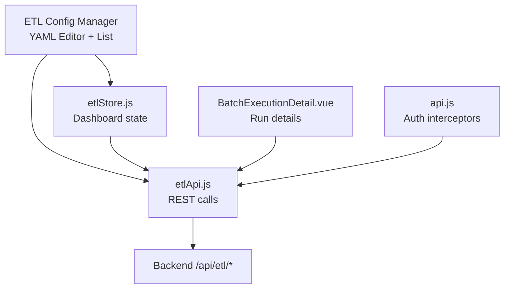
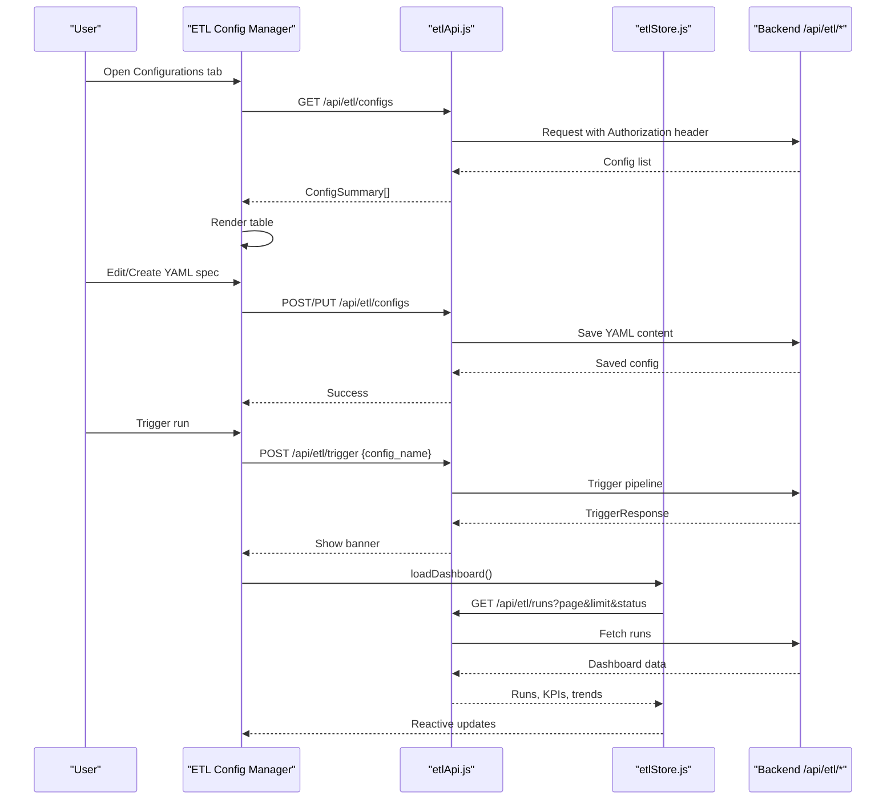
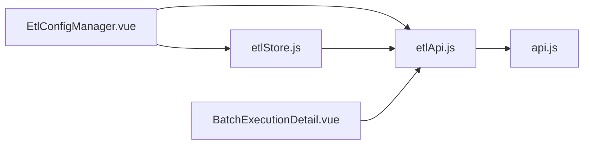

# Source Data Configuration

<cite>
**Referenced Files in This Document**
- [EtlConfigManager.vue](file://src/views/Modules/datapipeline/EtlConfigManager.vue)
- [ETLRunHistory.vue](file://src/views/Modules/datapipeline/ETLRunHistory.vue)
- [BatchExecutionDetail.vue](file://src/views/Modules/datapipeline/BatchExecutionDetail.vue)
- [etlApi.js](file://src/services/etlApi.js)
- [etlStore.js](file://src/stores/etlStore.js)
- [api.js](file://src/services/api.js)
- [AUTH-INTEGRATION.md](file://docs/AUTH-INTEGRATION.md)
- [ETL-CONFIG-MANAGER-REQUIREMENTS-V2.md](file://docs/ETL-CONFIG-MANAGER-REQUIREMENTS-V2.md)
</cite>

## Table of Contents
1. [Introduction](#introduction)
2. [Project Structure](#project-structure)
3. [Core Components](#core-components)
4. [Architecture Overview](#architecture-overview)
5. [Detailed Component Analysis](#detailed-component-analysis)
6. [Dependency Analysis](#dependency-analysis)
7. [Performance Considerations](#performance-considerations)
8. [Troubleshooting Guide](#troubleshooting-guide)
9. [Conclusion](#conclusion)
10. [Appendices](#appendices)

## Introduction
This document explains how to configure data sources for ETL jobs within the frontend’s ETL Config Manager and how those configurations are executed, monitored, and troubleshooted. It focuses on PostgreSQL source configuration using connection references, SQL query specifications, extraction patterns, connection management, error handling, performance optimization, security considerations, timeouts, and retry mechanisms as implemented or exposed by this codebase.

## Project Structure
The ETL feature is primarily composed of:
- A YAML-based configuration editor and list view for extraction specs
- API service functions to list, create, update, delete, and trigger configs
- A store that loads run history and dashboard metrics
- Execution detail views that show logs, quality, and audit trails
- Authentication and request helpers used across the app

**Diagram sources**
- [EtlConfigManager.vue:15-66](file://src/views/Modules/datapipeline/EtlConfigManager.vue#L15-L66)
- [etlApi.js:68-114](file://src/services/etlApi.js#L68-L114)
- [etlStore.js:12-95](file://src/stores/etlStore.js#L12-L95)
- [BatchExecutionDetail.vue:113-151](file://src/views/Modules/datapipeline/BatchExecutionDetail.vue#L113-L151)
- [api.js:64-146](file://src/services/api.js#L64-L146)

**Section sources**
- [EtlConfigManager.vue:15-66](file://src/views/Modules/datapipeline/EtlConfigManager.vue#L15-L66)
- [ETL-CONFIG-MANAGER-REQUIREMENTS-V2.md:183-199](file://docs/ETL-CONFIG-MANAGER-REQUIREMENTS-V2.md#L183-L199)
- [etlApi.js:68-114](file://src/services/etlApi.js#L68-L114)
- [etlStore.js:12-95](file://src/stores/etlStore.js#L12-L95)
- [BatchExecutionDetail.vue:113-151](file://src/views/Modules/datapipeline/BatchExecutionDetail.vue#L113-L151)
- [api.js:64-146](file://src/services/api.js#L64-L146)

## Core Components
- ETL Config Manager: Lists and edits YAML extraction specs with a built-in editor; includes sample configs demonstrating PostgreSQL sources and queries.
- ETL API Service: Provides functions to fetch runs, config lists, and trigger pipelines; centralizes headers and error handling.
- ETL Store: Manages dashboard state (runs, KPIs, pagination) and calls the API with sanitized parameters.
- Batch Execution Detail: Displays execution timeline, quality metrics, rejections, logs, and the exact config used during a run.
- Authentication Interceptors: Attach Bearer tokens and refresh them automatically on 401 responses.

Key responsibilities:
- Define and persist extraction specs (YAML) via backend endpoints
- Trigger pipeline runs and display results
- Provide robust error handling and user feedback
- Maintain secure authenticated requests

**Section sources**
- [EtlConfigManager.vue:15-66](file://src/views/Modules/datapipeline/EtlConfigManager.vue#L15-L66)
- [etlApi.js:10-38](file://src/services/etlApi.js#L10-L38)
- [etlStore.js:33-57](file://src/stores/etlStore.js#L33-L57)
- [BatchExecutionDetail.vue:49-82](file://src/views/Modules/datapipeline/BatchExecutionDetail.vue#L49-L82)
- [api.js:64-146](file://src/services/api.js#L64-L146)

## Architecture Overview
The frontend orchestrates ETL configuration and execution through a clear separation of concerns:
- UI components manage editing and viewing of configs and run history
- Services encapsulate HTTP calls and error normalization
- Stores hold reactive state for dashboards and pagination
- Backend executes the actual extraction based on stored YAML specs

**Diagram sources**
- [EtlConfigManager.vue:15-66](file://src/views/Modules/datapipeline/EtlConfigManager.vue#L15-L66)
- [etlApi.js:68-114](file://src/services/etlApi.js#L68-L114)
- [etlStore.js:33-57](file://src/stores/etlStore.js#L33-L57)
- [ETL-CONFIG-MANAGER-REQUIREMENTS-V2.md:207-215](file://docs/ETL-CONFIG-MANAGER-REQUIREMENTS-V2.md#L207-L215)

## Detailed Component Analysis

### PostgreSQL Source Configuration
PostgreSQL sources are defined in YAML extraction specs. The repository demonstrates two primary patterns:
- Table-based source with connector, schema, and table fields
- Query-based source with type, connection_ref, and an inline SQL query block

Examples present in the codebase include:
- A customer aggregation spec using a PostgreSQL source with a filtered SELECT
- A transaction ledger spec using a PostgreSQL source with a region filter

These examples illustrate:
- Using a connection reference to select credentials and connection settings
- Writing SQL queries directly in the spec
- Selecting subsets of data via WHERE clauses

Practical guidance derived from the code:
- Use a connection_ref to abstract database credentials and connection options
- Prefer explicit column selection in SELECT statements to reduce payload size
- Apply WHERE filters to limit rows transferred
- Keep queries deterministic and index-friendly for performance

**Section sources**
- [EtlConfigManager.vue:23-39](file://src/views/Modules/datapipeline/EtlConfigManager.vue#L23-L39)
- [EtlConfigManager.vue:48-64](file://src/views/Modules/datapipeline/EtlConfigManager.vue#L48-L64)
- [ETL-CONFIG-MANAGER-REQUIREMENTS-V2.md:183-199](file://docs/ETL-CONFIG-MANAGER-REQUIREMENTS-V2.md#L183-L199)

### SQL Query Specifications
The repository shows SQL usage inside YAML specs:
- SELECT statements selecting specific columns
- WHERE clauses filtering by business dimensions (e.g., region, status)

Guidance grounded in the code:
- Limit columns to only what is needed downstream
- Use WHERE to constrain datasets early at the source
- Avoid heavy client-side transformations; push logic to the database when possible
- For aggregations, prefer server-side aggregation where supported by the backend extractor

Note: The frontend does not execute SQL; it persists and triggers specs that the backend executor runs against configured sources.

**Section sources**
- [EtlConfigManager.vue:23-39](file://src/views/Modules/datapipeline/EtlConfigManager.vue#L23-L39)
- [EtlConfigManager.vue:48-64](file://src/views/Modules/datapipeline/EtlConfigManager.vue#L48-L64)

### Data Extraction Patterns
Patterns visible in the repository:
- Filtered queries: Examples use WHERE clauses to extract subsets (e.g., region = 'EU', status = 'active')
- Full table scans: Not shown explicitly; would be represented by SELECT * without restrictive filters
- Incremental loads: Not implemented in the frontend; typically achieved by adding time-based or watermark filters in the SQL

Recommendations aligned with the code:
- Use WHERE filters to implement incremental loads if your source supports timestamps or change tracking
- Keep queries idempotent to support reruns safely
- Validate query syntax in the editor before saving; backend performs full validation on save

**Section sources**
- [EtlConfigManager.vue:23-39](file://src/views/Modules/datapipeline/EtlConfigManager.vue#L23-L39)
- [EtlConfigManager.vue:48-64](file://src/views/Modules/datapipeline/EtlConfigManager.vue#L48-L64)
- [ETL-CONFIG-MANAGER-REQUIREMENTS-V2.md:158-181](file://docs/ETL-CONFIG-MANAGER-REQUIREMENTS-V2.md#L158-L181)

### Connection Management and Security
- Authentication: All API calls attach a Bearer token from local storage; the auth module handles token refresh on 401 responses
- Authorization: Requests include Authorization headers consistently across services
- Safety: Backend rejects untrusted configs that attempt raw SQL features server-side

Operational notes:
- Ensure tokens are refreshed transparently to avoid interrupted runs
- Do not embed secrets in YAML; rely on connection_ref to resolve credentials securely
- Use least-privilege database accounts per environment

**Section sources**
- [etlApi.js:10-16](file://src/services/etlApi.js#L10-L16)
- [api.js:64-146](file://src/services/api.js#L64-L146)
- [AUTH-INTEGRATION.md:10-73](file://docs/AUTH-INTEGRATION.md#L10-L73)
- [ETL-CONFIG-MANAGER-REQUIREMENTS-V2.md:295-304](file://docs/ETL-CONFIG-MANAGER-REQUIREMENTS-V2.md#L295-L304)

### Error Handling and Retry Mechanisms
- API errors are normalized into readable messages and thrown with status codes
- UI surfaces errors inline with retry options where applicable
- Token refresh is handled automatically on 401 responses
- Run detail view aggregates logs and quality metrics to aid troubleshooting

Retry behavior:
- Frontend does not implement exponential backoff for ETL triggers; rely on backend retries if configured
- Use the Run History and Batch Detail views to inspect failures and retry manually

**Section sources**
- [etlApi.js:18-38](file://src/services/etlApi.js#L18-L38)
- [api.js:78-146](file://src/services/api.js#L78-L146)
- [BatchExecutionDetail.vue:113-151](file://src/views/Modules/datapipeline/BatchExecutionDetail.vue#L113-L151)
- [ETL-CONFIG-MANAGER-REQUIREMENTS-V2.md:269-280](file://docs/ETL-CONFIG-MANAGER-REQUIREMENTS-V2.md#L269-L280)

### Performance Optimization Techniques
Derived from observed patterns:
- Column pruning: Only select required columns in SQL
- Filtering: Use WHERE to reduce dataset size at the source
- Pagination: Dashboard uses page and limit parameters to control load sizes
- Quality metrics: Track rejected rows and quality scores to identify slow or problematic queries

Additional recommendations:
- Add appropriate indexes on filtered columns
- Avoid SELECT * in production specs
- Monitor run durations and row counts in the dashboard to tune queries

**Section sources**
- [EtlConfigManager.vue:23-39](file://src/views/Modules/datapipeline/EtlConfigManager.vue#L23-L39)
- [EtlConfigManager.vue:48-64](file://src/views/Modules/datapipeline/EtlConfigManager.vue#L48-L64)
- [etlStore.js:33-57](file://src/stores/etlStore.js#L33-L57)
- [BatchExecutionDetail.vue:196-260](file://src/views/Modules/datapipeline/BatchExecutionDetail.vue#L196-L260)

### Practical Source Configuration Examples
Customer tables:
- Example spec selects active users with minimal columns and filters by status

Transaction ledgers:
- Example spec extracts transactions for a specific region with key fields

Reference data sources:
- Use similar patterns: specify connector/type, connection_ref, and a focused SELECT with WHERE filters

These examples demonstrate how to structure specs for different domains while keeping payloads small and targeted.

**Section sources**
- [EtlConfigManager.vue:23-39](file://src/views/Modules/datapipeline/EtlConfigManager.vue#L23-L39)
- [EtlConfigManager.vue:48-64](file://src/views/Modules/datapipeline/EtlConfigManager.vue#L48-L64)

## Dependency Analysis
The ETL feature depends on:
- Vue components for UI and state
- Pinia store for dashboard state
- API service for HTTP communication
- Authentication utilities for token management
- Backend endpoints for persistence and execution

**Diagram sources**
- [EtlConfigManager.vue:15-66](file://src/views/Modules/datapipeline/EtlConfigManager.vue#L15-L66)
- [etlApi.js:68-114](file://src/services/etlApi.js#L68-L114)
- [etlStore.js:12-95](file://src/stores/etlStore.js#L12-L95)
- [BatchExecutionDetail.vue:113-151](file://src/views/Modules/datapipeline/BatchExecutionDetail.vue#L113-L151)
- [api.js:64-146](file://src/services/api.js#L64-L146)

**Section sources**
- [EtlConfigManager.vue:15-66](file://src/views/Modules/datapipeline/EtlConfigManager.vue#L15-L66)
- [etlApi.js:68-114](file://src/services/etlApi.js#L68-L114)
- [etlStore.js:12-95](file://src/stores/etlStore.js#L12-L95)
- [BatchExecutionDetail.vue:113-151](file://src/views/Modules/datapipeline/BatchExecutionDetail.vue#L113-L151)
- [api.js:64-146](file://src/services/api.js#L64-L146)

## Performance Considerations
- Prefer narrow SELECT lists to minimize network and processing overhead
- Use WHERE filters to reduce row counts early
- Leverage pagination in dashboard queries to keep UI responsive
- Monitor quality scores and rejection rates to detect inefficient queries
- Keep YAML specs concise and well-commented for maintainability

[No sources needed since this section provides general guidance]

## Troubleshooting Guide
Common issues and resolutions:
- Authentication failures: Ensure tokens are present and refreshed; check 401 handling and redirect to login
- API errors: Inspect normalized error messages and status codes; use retry buttons where available
- Pipeline failures: Review run detail logs, quality metrics, and rejected records to pinpoint issues
- Config validation errors: Fix missing required fields (name, source) indicated by client-side validation; backend validates fully on save

Diagnostic steps:
- Open Batch Execution Detail to see timeline, logs, and quality breakdown
- Re-run failed configs after corrections
- Use Run History to compare durations and row counts over time

**Section sources**
- [etlApi.js:18-38](file://src/services/etlApi.js#L18-L38)
- [api.js:78-146](file://src/services/api.js#L78-L146)
- [BatchExecutionDetail.vue:113-151](file://src/views/Modules/datapipeline/BatchExecutionDetail.vue#L113-L151)
- [ETL-CONFIG-MANAGER-REQUIREMENTS-V2.md:269-280](file://docs/ETL-CONFIG-MANAGER-REQUIREMENTS-V2.md#L269-L280)

## Conclusion
This codebase provides a robust frontend for managing ETL data sources via YAML specs, with clear examples for PostgreSQL connections and queries. It emphasizes secure authentication, structured error handling, and observable execution outcomes. By following the patterns shown—using connection_ref, writing focused SQL, and leveraging dashboard insights—you can configure reliable, performant, and secure data extractions.

[No sources needed since this section summarizes without analyzing specific files]

## Appendices

### Appendix A: YAML Spec Fields Observed
- Top-level: name, description, spec_version
- source: connector/type, schema/table or connection_ref/query
- output: destination/type, mode/key or bucket/prefix/format

Use these fields to define PostgreSQL sources and outputs consistently.

**Section sources**
- [ETL-CONFIG-MANAGER-REQUIREMENTS-V2.md:183-199](file://docs/ETL-CONFIG-MANAGER-REQUIREMENTS-V2.md#L183-L199)
- [EtlConfigManager.vue:23-39](file://src/views/Modules/datapipeline/EtlConfigManager.vue#L23-L39)
- [EtlConfigManager.vue:48-64](file://src/views/Modules/datapipeline/EtlConfigManager.vue#L48-L64)

### Appendix B: API Endpoints Used by ETL Feature
- GET /api/etl/runs — dashboard and run history
- GET /api/etl/configs — list configs
- GET /api/etl/configs/{name} — get config content
- POST /api/etl/configs — create config
- PUT /api/etl/configs/{name} — update config
- DELETE /api/etl/configs/{name} — delete config
- POST /api/etl/trigger — run pipeline with a given config

**Section sources**
- [ETL-CONFIG-MANAGER-REQUIREMENTS-V2.md:207-215](file://docs/ETL-CONFIG-MANAGER-REQUIREMENTS-V2.md#L207-L215)
- [etlApi.js:68-114](file://src/services/etlApi.js#L68-L114)