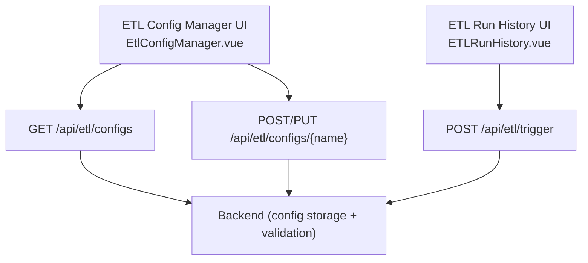
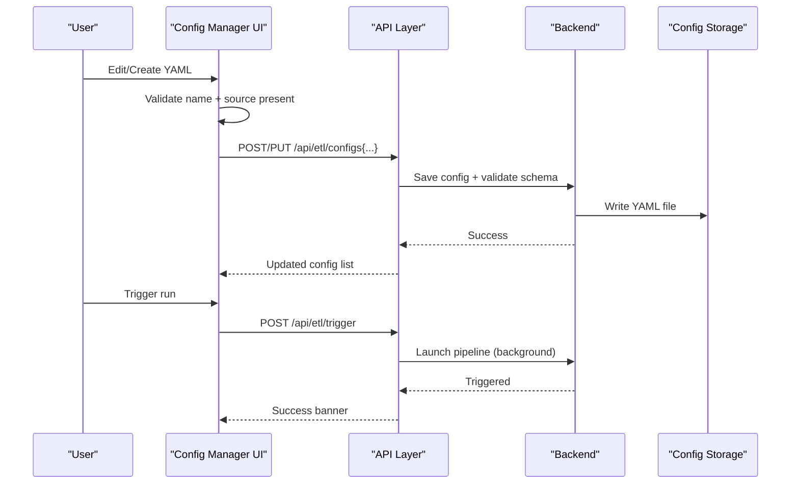
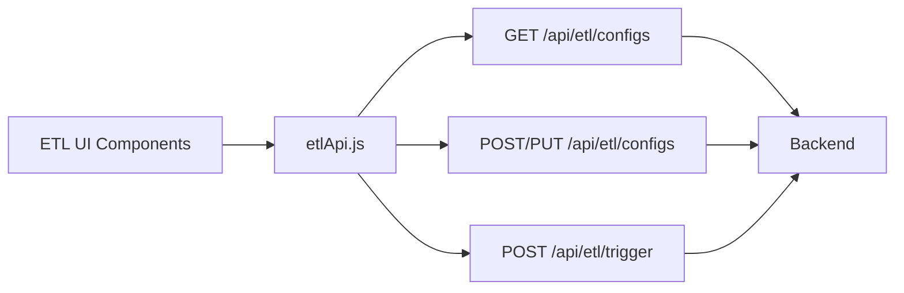

# YAML Configuration Schema

<cite>
**Referenced Files in This Document**
- [EtlConfigManager.vue](file://src/views/Modules/datapipeline/EtlConfigManager.vue)
- [ETLRunHistory.vue](file://src/views/Modules/datapipeline/ETLRunHistory.vue)
- [etlApi.js](file://src/services/etlApi.js)
- [ETL-CONFIG-MANAGER-REQUIREMENTS-V2.md](file://docs/ETL-CONFIG-MANAGER-REQUIREMENTS-V2.md)
- [ETL-CONFIG-MANAGER-REQUIREMENTS.md](file://docs/ETL-CONFIG-MANAGER-REQUIREMENTS.md)
</cite>

## Table of Contents
1. [Introduction](#introduction)
2. [Project Structure](#project-structure)
3. [Core Components](#core-components)
4. [Architecture Overview](#architecture-overview)
5. [Detailed Component Analysis](#detailed-component-analysis)
6. [Dependency Analysis](#dependency-analysis)
7. [Performance Considerations](#performance-considerations)
8. [Troubleshooting Guide](#troubleshooting-guide)
9. [Conclusion](#conclusion)
10. [Appendices](#appendices)

## Introduction
This document specifies the ETL YAML configuration schema used by the Data Pipeline feature. It covers top-level fields, source and output sections, validation rules, required vs optional fields, data type constraints, and example configurations for common scenarios such as simple extractions, complex transformations, and multi-source aggregations. The schema is implemented and demonstrated in the frontend components that manage ETL configurations and trigger pipeline runs.

## Project Structure
The ETL configuration schema is surfaced through:
- A Config Manager UI that lists, edits, previews, and saves YAML extraction specs
- A Run History UI that triggers pipelines using saved configs
- API helpers that call backend endpoints to list, save, and trigger ETL jobs

**Diagram sources**
- [EtlConfigManager.vue:15-66](file://src/views/Modules/datapipeline/EtlConfigManager.vue#L15-L66)
- [ETLRunHistory.vue:352-391](file://src/views/Modules/datapipeline/ETLRunHistory.vue#L352-L391)
- [etlApi.js:94-114](file://src/services/etlApi.js#L94-L114)

**Section sources**
- [EtlConfigManager.vue:15-66](file://src/views/Modules/datapipeline/EtlConfigManager.vue#L15-L66)
- [ETLRunHistory.vue:352-391](file://src/views/Modules/datapipeline/ETLRunHistory.vue#L352-L391)
- [etlApi.js:94-114](file://src/services/etlApi.js#L94-L114)

## Core Components
- Top-level fields: spec_version, name, description
- Source section: connector type, connection reference, query specification
- Output section: destination type, bucket/prefix, format options
- Validation: client-side checks and backend enforcement
- Examples: simple extraction, transformation-heavy, multi-source aggregation

Key implementation references:
- Default templates and examples demonstrate v2.1 with PostgreSQL source and S3 output
- Client-side validation ensures presence of name and source blocks
- Backend enforces safety for untrusted configs and validates full schema on save

**Section sources**
- [EtlConfigManager.vue:23-64](file://src/views/Modules/datapipeline/EtlConfigManager.vue#L23-L64)
- [ETL-CONFIG-MANAGER-REQUIREMENTS-V2.md:158-181](file://docs/ETL-CONFIG-MANAGER-REQUIREMENTS-V2.md#L158-L181)
- [ETL-CONFIG-MANAGER-REQUIREMENTS.md:158-181](file://docs/ETL-CONFIG-MANAGER-REQUIREMENTS.md#L158-L181)

## Architecture Overview
The ETL configuration lifecycle:
- Create/Edit: User composes YAML in the Config Manager; client performs lightweight validation; backend validates schema and persists config
- Trigger: User selects a config from Run History; backend launches pipeline execution asynchronously

**Diagram sources**
- [EtlConfigManager.vue:112-127](file://src/views/Modules/datapipeline/EtlConfigManager.vue#L112-L127)
- [ETLRunHistory.vue:375-391](file://src/views/Modules/datapipeline/ETLRunHistory.vue#L375-L391)
- [etlApi.js:94-114](file://src/services/etlApi.js#L94-L114)

## Detailed Component Analysis

### Schema Specification
- spec_version: string; current supported value is v2.1
- name: string; unique identifier for the job
- description: string; human-readable summary

Source section:
- type: string; currently postgres
- connection_ref: string; reference to a configured PostgreSQL connection
- query: multiline string; SQL query defining the extraction pattern

Output section:
- type: string; currently s3
- bucket: string; target S3 bucket name
- prefix: string; object key prefix under the bucket
- format: string; supported values include parquet and csv

Validation rules:
- Required at minimum: name, source block
- Client-side validation checks presence of name and source
- Backend performs full schema validation on save and enforces safety for untrusted configs

Data types:
- All fields are strings unless otherwise noted
- query uses multiline string syntax
- format must be one of the supported output formats

**Section sources**
- [EtlConfigManager.vue:23-64](file://src/views/Modules/datapipeline/EtlConfigManager.vue#L23-L64)
- [ETL-CONFIG-MANAGER-REQUIREMENTS-V2.md:158-181](file://docs/ETL-CONFIG-MANAGER-REQUIREMENTS-V2.md#L158-L181)
- [ETL-CONFIG-MANAGER-REQUIREMENTS.md:158-181](file://docs/ETL-CONFIG-MANAGER-REQUIREMENTS.md#L158-L181)

### Source Configuration: PostgreSQL
- connector type: postgres
- connection_ref: points to a named PostgreSQL connection defined elsewhere in the system
- query: standard SQL syntax to extract rows; supports filtering, joins, and projections

Extraction patterns:
- Simple table scans with filters
- Aggregations and joins across tables
- Partitioning or time-bounded queries via WHERE clauses

**Section sources**
- [EtlConfigManager.vue:27-39](file://src/views/Modules/datapipeline/EtlConfigManager.vue#L27-L39)
- [EtlConfigManager.vue:52-64](file://src/views/Modules/datapipeline/EtlConfigManager.vue#L52-L64)

### Output Configuration: S3
- destination type: s3
- bucket: target S3 bucket name
- prefix: logical folder path within the bucket
- format: parquet or csv

Notes:
- Parquet is recommended for analytical workloads due to columnar efficiency
- CSV is suitable for interoperability and ad-hoc analysis

**Section sources**
- [EtlConfigManager.vue:35-39](file://src/views/Modules/datapipeline/EtlConfigManager.vue#L35-L39)
- [EtlConfigManager.vue:60-64](file://src/views/Modules/datapipeline/EtlConfigManager.vue#L60-L64)

### Validation Rules and Constraints
- Required fields: name, source
- Client-side validation: presence of name and source blocks
- Backend validation: full schema enforcement on save; rejects unsafe features when trusted_config is false
- Type constraints: all fields are strings; query is multiline; format restricted to supported values

**Section sources**
- [ETL-CONFIG-MANAGER-REQUIREMENTS-V2.md:158-181](file://docs/ETL-CONFIG-MANAGER-REQUIREMENTS-V2.md#L158-L181)
- [ETL-CONFIG-MANAGER-REQUIREMENTS.md:158-181](file://docs/ETL-CONFIG-MANAGER-REQUIREMENTS.md#L158-L181)

### Example Configurations
- Simple data extraction: single-table PostgreSQL query to S3 Parquet
- Complex transformation: multi-table join and aggregation in SQL, output to S3 CSV
- Multi-source aggregation: multiple source blocks combined into a single output dataset

Note: Refer to the component’s embedded templates and examples for concrete YAML structures.

**Section sources**
- [EtlConfigManager.vue:23-64](file://src/views/Modules/datapipeline/EtlConfigManager.vue#L23-L64)

## Dependency Analysis
The ETL configuration flow depends on:
- Frontend UI components for editing and triggering
- API service functions for listing, saving, and triggering
- Backend endpoints for persistence and execution

**Diagram sources**
- [etlApi.js:94-114](file://src/services/etlApi.js#L94-L114)
- [ETLRunHistory.vue:352-391](file://src/views/Modules/datapipeline/ETLRunHistory.vue#L352-L391)

**Section sources**
- [etlApi.js:94-114](file://src/services/etlApi.js#L94-L114)
- [ETLRunHistory.vue:352-391](file://src/views/Modules/datapipeline/ETLRunHistory.vue#L352-L391)

## Performance Considerations
- Prefer Parquet for large analytical datasets to reduce storage and improve query performance
- Use targeted SQL queries with appropriate WHERE clauses to minimize data transfer
- Organize S3 prefixes logically to enable efficient partitioning and discovery
- Avoid overly broad SELECT * queries; project only needed columns

[No sources needed since this section provides general guidance]

## Troubleshooting Guide
Common issues and resolutions:
- Missing required fields: ensure name and source are present; client-side validation will flag missing elements
- Invalid YAML: fix syntax errors; backend will reject invalid schemas on save
- Untrusted config restrictions: avoid raw SQL features if trusted_config is false; rely on safe connectors and queries
- Trigger failures: check backend logs and ensure the referenced connection_ref exists and is accessible

Error handling behavior:
- Client displays user-friendly messages and retry options where applicable
- Modal remains open on save errors to allow corrections
- Trigger banners show success or error messages with auto-dismiss timing

**Section sources**
- [ETL-CONFIG-MANAGER-REQUIREMENTS-V2.md:269-281](file://docs/ETL-CONFIG-MANAGER-REQUIREMENTS-V2.md#L269-L281)
- [ETL-CONFIG-MANAGER-REQUIREMENTS.md:269-281](file://docs/ETL-CONFIG-MANAGER-REQUIREMENTS.md#L269-L281)

## Conclusion
The ETL YAML configuration schema provides a clear, extensible structure for defining data extractions from PostgreSQL and writing results to S3 in Parquet or CSV formats. With robust validation and a straightforward UI, users can create, edit, and trigger ETL jobs efficiently. Following best practices for query design and output organization ensures reliable and performant data pipelines.

[No sources needed since this section summarizes without analyzing specific files]

## Appendices

### Field Reference Table
- spec_version: string; e.g., "v2.1"
- name: string; job identifier
- description: string; human-readable summary
- source.type: string; e.g., "postgres"
- source.connection_ref: string; named database connection
- source.query: multiline string; SQL extraction query
- output.type: string; e.g., "s3"
- output.bucket: string; target S3 bucket
- output.prefix: string; object key prefix
- output.format: string; e.g., "parquet", "csv"

**Section sources**
- [EtlConfigManager.vue:23-64](file://src/views/Modules/datapipeline/EtlConfigManager.vue#L23-L64)

### API Endpoints Used by Config Manager
- GET /api/etl/configs: list configs
- POST /api/etl/configs: create new config
- PUT /api/etl/configs/{name}: update existing config
- DELETE /api/etl/configs/{name}: delete config
- POST /api/etl/trigger: trigger pipeline run

**Section sources**
- [ETL-CONFIG-MANAGER-REQUIREMENTS-V2.md:203-216](file://docs/ETL-CONFIG-MANAGER-REQUIREMENTS-V2.md#L203-L216)
- [etlApi.js:94-114](file://src/services/etlApi.js#L94-L114)