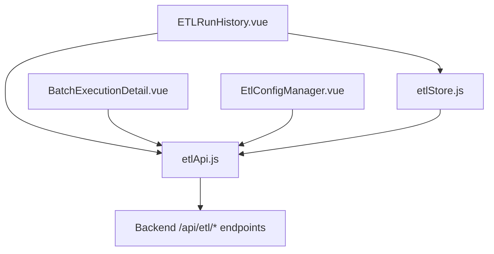
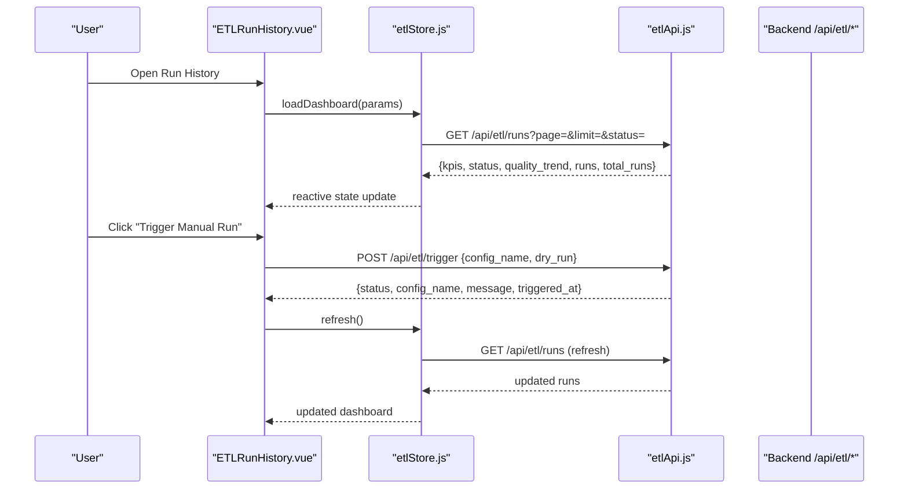
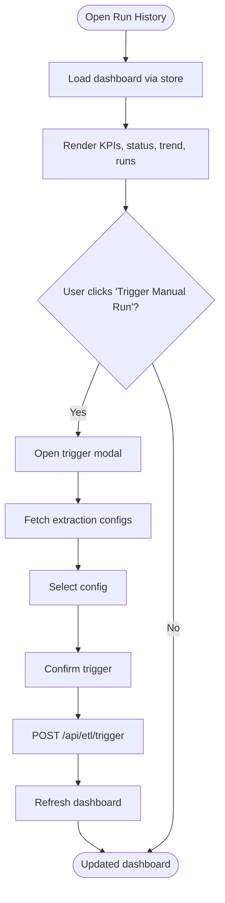
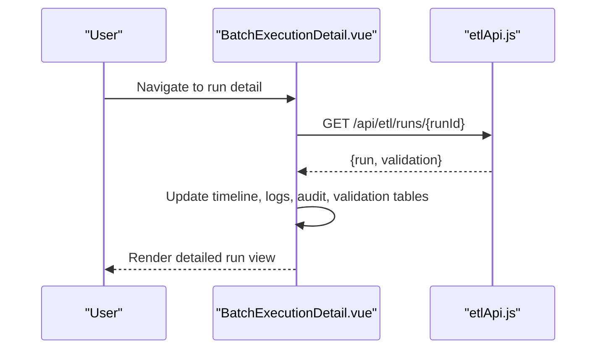
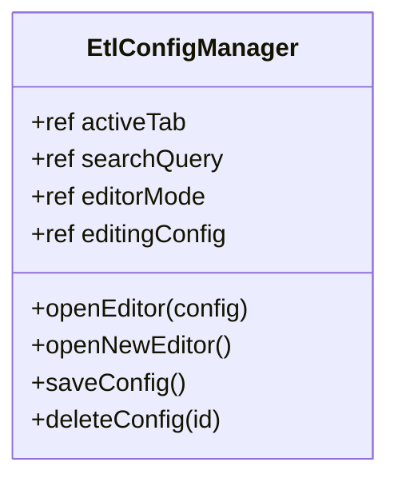
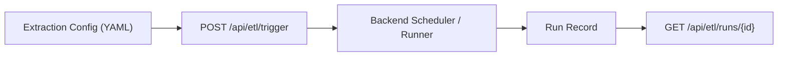

# Scheduling & Execution Management

<cite>
**Referenced Files in This Document**
- [etlApi.js](file://src/services/etlApi.js)
- [etlStore.js](file://src/stores/etlStore.js)
- [ETLRunHistory.vue](file://src/views/Modules/datapipeline/ETLRunHistory.vue)
- [BatchExecutionDetail.vue](file://src/views/Modules/datapipeline/BatchExecutionDetail.vue)
- [EtlConfigManager.vue](file://src/views/Modules/datapipeline/EtlConfigManager.vue)
- [ETL-CONFIG-MANAGER-REQUIREMENTS.md](file://docs/ETL-CONFIG-MANAGER-REQUIREMENTS.md)
- [ETL-CONFIG-MANAGER-REQUIREMENTS-V2.md](file://docs/ETL-CONFIG-MANAGER-REQUIREMENTS-V2.md)
</cite>

## Table of Contents
1. [Introduction](#introduction)
2. [Project Structure](#project-structure)
3. [Core Components](#core-components)
4. [Architecture Overview](#architecture-overview)
5. [Detailed Component Analysis](#detailed-component-analysis)
6. [Dependency Analysis](#dependency-analysis)
7. [Performance Considerations](#performance-considerations)
8. [Troubleshooting Guide](#troubleshooting-guide)
9. [Conclusion](#conclusion)
10. [Appendices](#appendices)

## Introduction
This document explains the ETL scheduling and execution management as implemented in the frontend. It focuses on how users trigger runs, view run history, inspect batch details, and manage extraction configurations. It also outlines where scheduling-related capabilities are exposed or expected to be extended (for example, cron expressions, timezones, execution windows, dependencies, retries), based on the current codebase and requirements documents.

Key takeaways:
- The frontend provides a Run History dashboard and a Configurations panel for managing extraction specs.
- Runs are triggered via an API endpoint; detailed run information is available through a dedicated detail view.
- Scheduling features such as cron expressions, timezones, execution windows, dependency graphs, and retry policies are not yet implemented in the frontend; they are candidates for future enhancement aligned with backend capabilities.

## Project Structure
The ETL feature spans services, stores, and views:
- Services: HTTP client functions to fetch dashboard data, run details, configs, and trigger runs.
- Store: Reactive state for paginated runs, KPIs, status panel, and quality trend.
- Views:
  - Run History: Dashboard with health cards, quality trend, execution table, and trigger modal.
  - Batch Execution Detail: Deep dive into a single run with timeline, logs, audit trail, and validation insights.
  - Config Manager: YAML editor and configuration list for extraction specs.

**Diagram sources**
- [ETLRunHistory.vue:1-601](file://src/views/Modules/datapipeline/ETLRunHistory.vue#L1-L601)
- [BatchExecutionDetail.vue:1-501](file://src/views/Modules/datapipeline/BatchExecutionDetail.vue#L1-L501)
- [EtlConfigManager.vue:1-341](file://src/views/Modules/datapipeline/EtlConfigManager.vue#L1-L341)
- [etlStore.js:1-96](file://src/stores/etlStore.js#L1-L96)
- [etlApi.js:1-115](file://src/services/etlApi.js#L1-L115)

**Section sources**
- [ETLRunHistory.vue:1-601](file://src/views/Modules/datapipeline/ETLRunHistory.vue#L1-L601)
- [BatchExecutionDetail.vue:1-501](file://src/views/Modules/datapipeline/BatchExecutionDetail.vue#L1-L501)
- [EtlConfigManager.vue:1-341](file://src/views/Modules/datapipeline/EtlConfigManager.vue#L1-L341)
- [etlStore.js:1-96](file://src/stores/etlStore.js#L1-L96)
- [etlApi.js:1-115](file://src/services/etlApi.js#L1-L115)

## Core Components
- etlApi.js: Centralized HTTP client for ETL endpoints. Handles authentication headers, error normalization, parameter sanitization, and response parsing. Exposes functions to:
  - Fetch dashboard data (runs, KPIs, status panel, quality trend).
  - Fetch a single run detail.
  - List extraction configs.
  - Trigger a pipeline run (with optional dry-run flag).
- etlStore.js: Pinia store that loads and manages dashboard state (runs, pagination, filters, KPIs, status panel, quality trend). Provides actions to load, refresh, paginate, and filter by status.
- ETLRunHistory.vue: Main dashboard page. Displays health cards, quality trend, execution history table, footer metrics, and a trigger modal to start a pipeline run using configured extraction specs.
- BatchExecutionDetail.vue: Detailed view for a specific run. Shows timeline, logs, audit trail, rejection analysis, and config snapshot used by the run.
- EtlConfigManager.vue: Configuration manager with a tabbed interface (Run History and Configurations). Includes a YAML editor for creating/editing extraction specs and a table listing available configs.

**Section sources**
- [etlApi.js:1-115](file://src/services/etlApi.js#L1-L115)
- [etlStore.js:1-96](file://src/stores/etlStore.js#L1-L96)
- [ETLRunHistory.vue:1-601](file://src/views/Modules/datapipeline/ETLRunHistory.vue#L1-L601)
- [BatchExecutionDetail.vue:1-501](file://src/views/Modules/datapipeline/BatchExecutionDetail.vue#L1-L501)
- [EtlConfigManager.vue:1-341](file://src/views/Modules/datapipeline/EtlConfigManager.vue#L1-L341)

## Architecture Overview
The ETL execution flow starts from the UI and moves through the store and service layer to the backend.

**Diagram sources**
- [ETLRunHistory.vue:224-397](file://src/views/Modules/datapipeline/ETLRunHistory.vue#L224-L397)
- [etlStore.js:33-72](file://src/stores/etlStore.js#L33-L72)
- [etlApi.js:68-114](file://src/services/etlApi.js#L68-L114)

## Detailed Component Analysis

### ETLRunHistory.vue — Dashboard and Trigger Flow
Responsibilities:
- Load and display dashboard data (KPIs, status panel, quality trend, runs).
- Provide pagination and status filtering.
- Show health cards and a quality trend chart.
- Offer a trigger modal to start a pipeline run using available extraction specs.

Key interactions:
- On mount, calls store action to load dashboard data.
- Trigger modal fetches available configs and posts a trigger request.
- After successful trigger, refreshes dashboard data.

**Diagram sources**
- [ETLRunHistory.vue:267-397](file://src/views/Modules/datapipeline/ETLRunHistory.vue#L267-L397)
- [etlStore.js:33-72](file://src/stores/etlStore.js#L33-L72)
- [etlApi.js:94-114](file://src/services/etlApi.js#L94-L114)

**Section sources**
- [ETLRunHistory.vue:1-601](file://src/views/Modules/datapipeline/ETLRunHistory.vue#L1-L601)
- [etlStore.js:1-96](file://src/stores/etlStore.js#L1-L96)
- [etlApi.js:1-115](file://src/services/etlApi.js#L1-L115)

### BatchExecutionDetail.vue — Run Inspection
Responsibilities:
- Fetch and render a specific run’s details.
- Present execution timeline, logs, audit trail, and validation insights.
- Highlight quality score against SLA thresholds.

Key behaviors:
- Loads run detail via API.
- Updates timeline statuses based on run outcome.
- Computes derived data for rejection categories and failing rules.

**Diagram sources**
- [BatchExecutionDetail.vue:113-151](file://src/views/Modules/datapipeline/BatchExecutionDetail.vue#L113-L151)
- [etlApi.js:83-88](file://src/services/etlApi.js#L83-L88)

**Section sources**
- [BatchExecutionDetail.vue:1-501](file://src/views/Modules/datapipeline/BatchExecutionDetail.vue#L1-L501)
- [etlApi.js:1-115](file://src/services/etlApi.js#L1-L115)

### EtlConfigManager.vue — Extraction Specs Editor
Responsibilities:
- Manage extraction specifications stored as YAML files.
- Provide a tabbed interface with Run History and Configurations.
- Offer a YAML editor for create/edit modes and a table listing available configs.

Key behaviors:
- Local state for active tab, search, editor mode, and editing config.
- Save operations simulate persistence (in this implementation) and close the editor.
- Supports preview mode for YAML content.

**Diagram sources**
- [EtlConfigManager.vue:1-148](file://src/views/Modules/datapipeline/EtlConfigManager.vue#L1-L148)

**Section sources**
- [EtlConfigManager.vue:1-341](file://src/views/Modules/datapipeline/EtlConfigManager.vue#L1-L341)

## Dependency Analysis
Current implementation does not include explicit job dependency management between ETL jobs. The backend launch mechanism is referenced in requirements as running a background process per trigger. Any parent-child relationships or execution order constraints would need to be modeled at the backend level and surfaced via additional fields in the run/config payloads.

**Diagram sources**
- [ETL-CONFIG-MANAGER-REQUIREMENTS.md:203-240](file://docs/ETL-CONFIG-MANAGER-REQUIREMENTS.md#L203-L240)
- [ETL-CONFIG-MANAGER-REQUIREMENTS-V2.md:203-240](file://docs/ETL-CONFIG-MANAGER-REQUIREMENTS-V2.md#L203-L240)
- [etlApi.js:94-114](file://src/services/etlApi.js#L94-L114)

**Section sources**
- [ETL-CONFIG-MANAGER-REQUIREMENTS.md:295-304](file://docs/ETL-CONFIG-MANAGER-REQUIREMENTS.md#L295-L304)
- [ETL-CONFIG-MANAGER-REQUIREMENTS-V2.md:295-304](file://docs/ETL-CONFIG-MANAGER-REQUIREMENTS-V2.md#L295-L304)
- [etlApi.js:1-115](file://src/services/etlApi.js#L1-L115)

## Performance Considerations
- Pagination: The store supports pagination with configurable limit and page. Use appropriate limits to balance responsiveness and payload size.
- Filtering: Status filtering reduces dataset size when focusing on specific run states.
- Error handling: Centralized error normalization prevents excessive UI overhead and ensures consistent messaging.
- Re-fetch strategy: After triggering a run, the dashboard refreshes once to avoid polling overhead. For real-time updates, consider adding periodic refresh or WebSocket integration if supported by the backend.

[No sources needed since this section provides general guidance]

## Troubleshooting Guide
Common issues and resolutions:
- Failed to load dashboard: Check network connectivity and token validity. The store sets an error message and loading state; verify API base URL and authorization header construction.
- Trigger failed: Inspect the error banner in the trigger modal. Ensure a valid config is selected and the backend endpoint responds successfully.
- Run detail load failure: Verify the run ID exists and the backend returns a valid run object. Errors are caught and displayed with a back navigation option.

Operational tips:
- Export logs: The Run History page includes an export button for logs.
- Audit trail: Use the audit trail tab in the run detail to trace who triggered runs and what actions were taken.
- Quality trends: Monitor the quality trend chart to detect degradation over time.

**Section sources**
- [ETLRunHistory.vue:224-397](file://src/views/Modules/datapipeline/ETLRunHistory.vue#L224-L397)
- [BatchExecutionDetail.vue:113-151](file://src/views/Modules/datapipeline/BatchExecutionDetail.vue#L113-L151)
- [etlApi.js:18-38](file://src/services/etlApi.js#L18-L38)

## Conclusion
The frontend provides robust tools to monitor ETL runs, inspect details, and manage extraction configurations. While scheduling-specific features like cron expressions, timezones, execution windows, dependencies, and retries are not yet present in the UI, the architecture supports extension points:
- Add scheduling fields to extraction configs and expose them in the editor.
- Introduce dependency graphs and execution order constraints in the backend and surface them in the UI.
- Implement retry policies and execution windows via backend scheduling logic and reflect outcomes in run metadata.

[No sources needed since this section summarizes without analyzing specific files]

## Appendices

### Cron Expression Syntax and Timezone Considerations
- Not currently implemented in the frontend. When added, recommend supporting standard cron syntax with timezone-aware scheduling. Validate expressions server-side and persist timezone settings per schedule.

[No sources needed since this section provides general guidance]

### Execution Windows and Maintenance Windows
- Not currently implemented in the frontend. Recommend defining business hours and maintenance windows at the backend scheduler level and enforcing them during run eligibility checks. Surface window violations in run metadata and UI.

[No sources needed since this section provides general guidance]

### Dependency Management Between Jobs
- Not currently implemented in the frontend. Recommend modeling parent-child relationships in extraction configs and enforcing execution order in the backend. Expose dependency graphs and status propagation in the UI.

[No sources needed since this section provides general guidance]

### Retry Mechanisms
- Not currently implemented in the frontend. Recommend configuring retry policies (max attempts, backoff strategy) at the backend runner level and reporting retry counts and outcomes in run metadata.

[No sources needed since this section provides general guidance]

### Practical Examples
- Setting up recurring jobs: Define a schedule in extraction configs (future enhancement) and validate via the YAML editor. Persist and trigger via the existing trigger flow.
- Configuring dependencies: Add dependency fields to configs (future enhancement) and enforce ordering in the backend scheduler.
- Managing execution policies: Configure retry and window policies in the backend and reflect results in run details and dashboards.

[No sources needed since this section provides general guidance]

### Monitoring and Alerting
- Monitoring: Use the Run History dashboard to track KPIs, quality trends, and run statuses. Export logs for deeper analysis.
- Alerting: Integrate alerting at the backend level for failed runs and threshold breaches. Surface alerts in the UI via notifications or banners.

[No sources needed since this section provides general guidance]