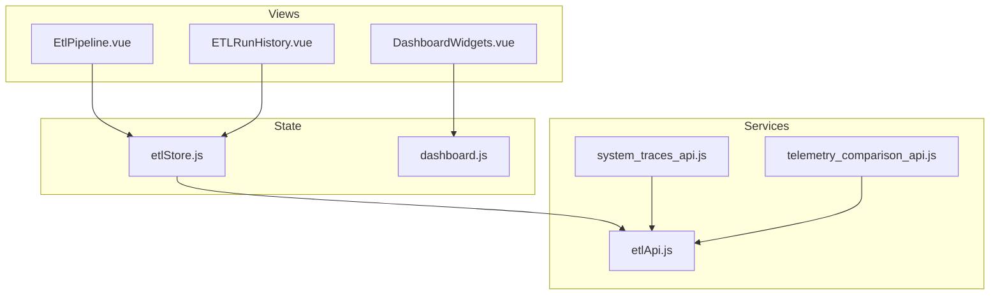
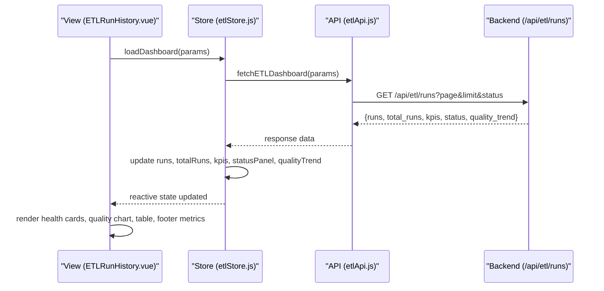
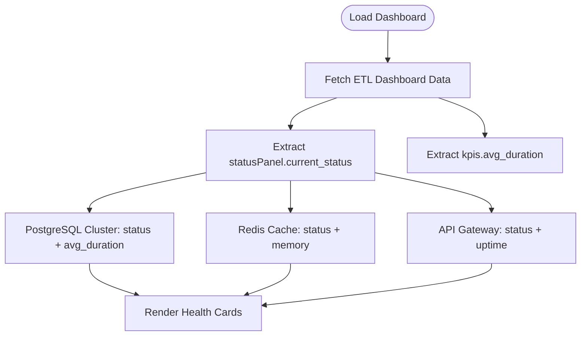
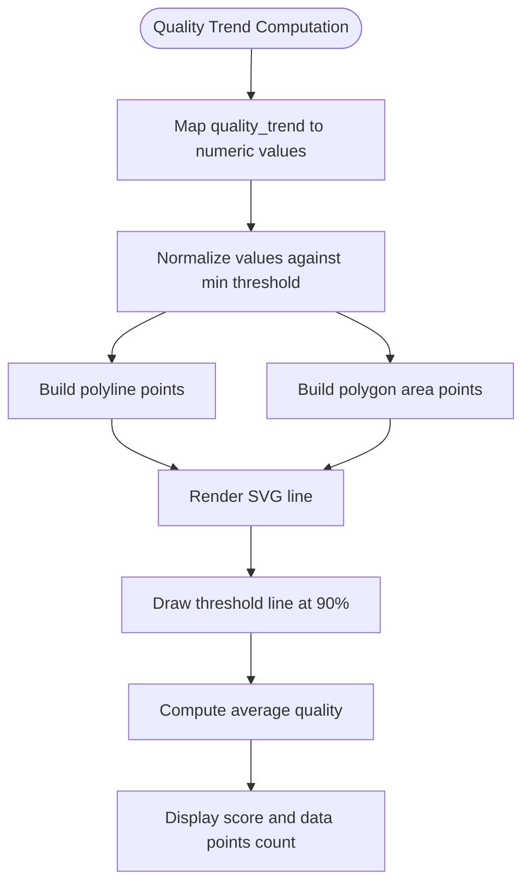
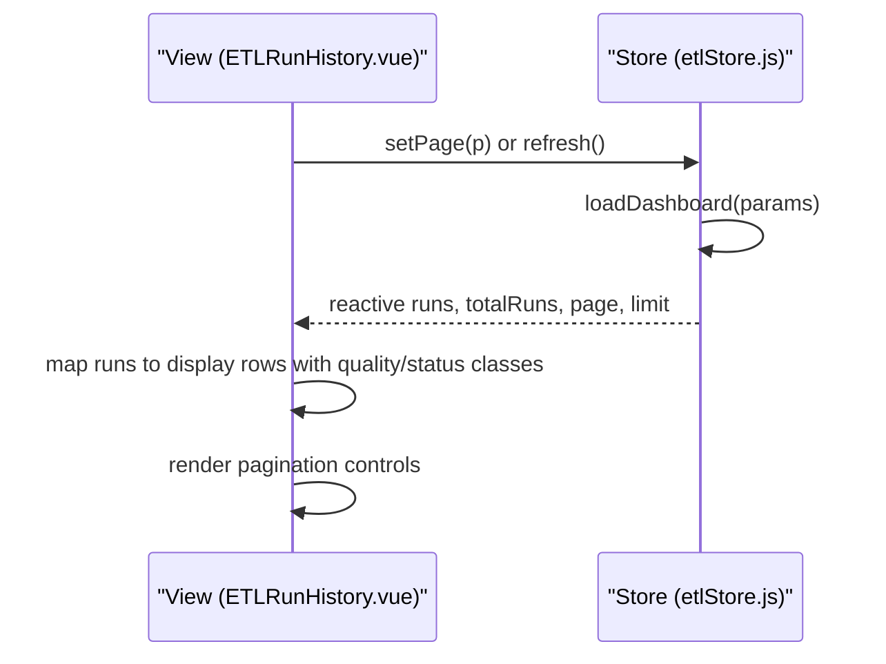
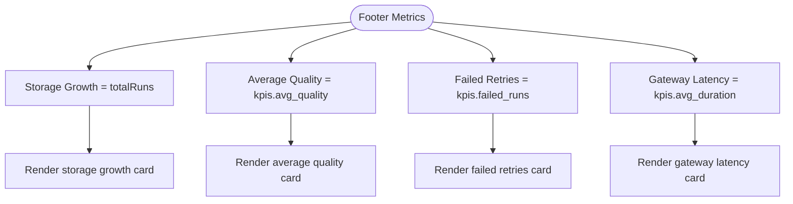
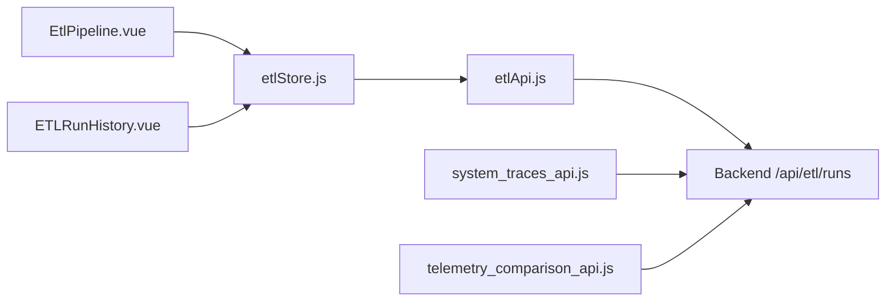

# Analytics Dashboard & Metrics

<cite>
**Referenced Files in This Document**
- [EtlPipeline.vue](file://src/views/Modules/datapipeline/EtlPipeline.vue)
- [ETLRunHistory.vue](file://src/views/Modules/datapipeline/ETLRunHistory.vue)
- [etlStore.js](file://src/stores/etlStore.js)
- [etlApi.js](file://src/services/etlApi.js)
- [DashboardWidgets.vue](file://src/components/ui/DashboardWidgets.vue)
- [dashboard.js](file://src/stores/dashboard.js)
- [system_traces_api.js](file://src/services/system_traces_api.js)
- [telemetry_comparison_api.js](file://src/services/telemetry_comparison_api.js)
</cite>

## Table of Contents
1. [Introduction](#introduction)
2. [Project Structure](#project-structure)
3. [Core Components](#core-components)
4. [Architecture Overview](#architecture-overview)
5. [Detailed Component Analysis](#detailed-component-analysis)
6. [Dependency Analysis](#dependency-analysis)
7. [Performance Considerations](#performance-considerations)
8. [Troubleshooting Guide](#troubleshooting-guide)
9. [Conclusion](#conclusion)
10. [Appendices](#appendices)

## Introduction
This document explains the Analytics Dashboard and Metrics system that monitors data pipeline health, quality trends, and operational KPIs. It focuses on:
- Pipeline health cards for PostgreSQL Cluster, Redis Cache, and API Gateway with real-time metrics and performance indicators
- Quality Score Trend visualization showing data integrity scores over time (24-hour and 7-day views)
- Footer metrics covering storage growth tracking, average quality calculations, failed retries monitoring, and gateway latency measurements
- Implementation details for KPI calculations, metric aggregation strategies, and real-time updates
- Practical guidance for interpreting dashboard metrics, setting alerts for threshold breaches, exporting analytics reports, optimizing performance for large datasets, and caching strategies

## Project Structure
The analytics dashboard is implemented across Vue components, a Pinia store, and API services:
- Views render the dashboard UI, including health cards, charts, tables, and footer metrics
- The ETL store centralizes state for runs, KPIs, status panel, and quality trend
- API service functions fetch dashboard data from backend endpoints
- Additional services provide telemetry and tracing capabilities

**Diagram sources**
- [EtlPipeline.vue:1-438](file://src/views/Modules/datapipeline/EtlPipeline.vue#L1-L438)
- [ETLRunHistory.vue:1-601](file://src/views/Modules/datapipeline/ETLRunHistory.vue#L1-L601)
- [etlStore.js:1-96](file://src/stores/etlStore.js#L1-L96)
- [etlApi.js:1-115](file://src/services/etlApi.js#L1-L115)
- [DashboardWidgets.vue:1-71](file://src/components/ui/DashboardWidgets.vue#L1-L71)
- [dashboard.js:1-29](file://src/stores/dashboard.js#L1-L29)
- [system_traces_api.js:1-39](file://src/services/system_traces_api.js#L1-L39)
- [telemetry_comparison_api.js:112-156](file://src/services/telemetry_comparison_api.js#L112-L156)

**Section sources**
- [EtlPipeline.vue:1-438](file://src/views/Modules/datapipeline/EtlPipeline.vue#L1-L438)
- [ETLRunHistory.vue:1-601](file://src/views/Modules/datapipeline/ETLRunHistory.vue#L1-L601)
- [etlStore.js:1-96](file://src/stores/etlStore.js#L1-L96)
- [etlApi.js:1-115](file://src/services/etlApi.js#L1-L115)
- [DashboardWidgets.vue:1-71](file://src/components/ui/DashboardWidgets.vue#L1-L71)
- [dashboard.js:1-29](file://src/stores/dashboard.js#L1-L29)
- [system_traces_api.js:1-39](file://src/services/system_traces_api.js#L1-L39)
- [telemetry_comparison_api.js:112-156](file://src/services/telemetry_comparison_api.js#L112-L156)

## Core Components
- Pipeline Health Cards: Display PostgreSQL Cluster, Redis Cache, and API Gateway status with key metrics such as duration, memory, uptime, and last successful run details
- Quality Score Trend: Visualizes data integrity score over time with area/line chart and threshold line; supports 24-hour and 7-day views
- Execution History Table: Lists runs with row counts, quality bars, and statuses
- Footer Metrics: Summarizes storage growth, average quality, failed retries, and gateway latency

Key implementation highlights:
- Health cards derive values from the ETL store’s status panel and KPIs
- Quality trend computed from the store’s quality_trend array
- Footer metrics aggregate KPIs and totals into user-friendly summaries

**Section sources**
- [EtlPipeline.vue:31-71](file://src/views/Modules/datapipeline/EtlPipeline.vue#L31-L71)
- [EtlPipeline.vue:73-105](file://src/views/Modules/datapipeline/EtlPipeline.vue#L73-L105)
- [EtlPipeline.vue:174-211](file://src/views/Modules/datapipeline/EtlPipeline.vue#L174-L211)
- [ETLRunHistory.vue:52-97](file://src/views/Modules/datapipeline/ETLRunHistory.vue#L52-L97)
- [ETLRunHistory.vue:174-221](file://src/views/Modules/datapipeline/ETLRunHistory.vue#L174-L221)
- [etlStore.js:12-25](file://src/stores/etlStore.js#L12-L25)

## Architecture Overview
The dashboard follows a clear separation of concerns:
- Views handle presentation and user interactions
- Pinia store manages reactive state and orchestrates data loading
- API services encapsulate HTTP calls and error handling
- Telemetry and tracing services support diagnostics and performance insights

**Diagram sources**
- [ETLRunHistory.vue:267-398](file://src/views/Modules/datapipeline/ETLRunHistory.vue#L267-L398)
- [etlStore.js:33-57](file://src/stores/etlStore.js#L33-L57)
- [etlApi.js:68-75](file://src/services/etlApi.js#L68-L75)

## Detailed Component Analysis

### Pipeline Health Cards
- PostgreSQL Cluster: Shows current status and average query duration
- Redis Cache: Shows current status and memory usage placeholder
- API Gateway: Shows current status and uptime derived from timestamp

These cards are driven by the ETL store’s status panel and KPIs, providing immediate visibility into system health and performance.

**Diagram sources**
- [EtlPipeline.vue:225-237](file://src/views/Modules/datapipeline/EtlPipeline.vue#L225-L237)
- [ETLRunHistory.vue:278-287](file://src/views/Modules/datapipeline/ETLRunHistory.vue#L278-L287)
- [etlStore.js:33-57](file://src/stores/etlStore.js#L33-L57)

**Section sources**
- [EtlPipeline.vue:31-71](file://src/views/Modules/datapipeline/EtlPipeline.vue#L31-L71)
- [EtlPipeline.vue:225-237](file://src/views/Modules/datapipeline/EtlPipeline.vue#L225-L237)
- [ETLRunHistory.vue:278-287](file://src/views/Modules/datapipeline/ETLRunHistory.vue#L278-L287)

### Quality Score Trend Visualization
- Displays data integrity score over time using an SVG area/line chart
- Includes a threshold line at 90% to highlight compliance
- Supports 24-hour and 7-day views via UI toggles

Implementation details:
- Quality points computed from store.quality_trend
- Line and area paths generated based on normalized values against min threshold
- Average quality calculated as mean of recent points

**Diagram sources**
- [EtlPipeline.vue:239-262](file://src/views/Modules/datapipeline/EtlPipeline.vue#L239-L262)
- [ETLRunHistory.vue:289-302](file://src/views/Modules/datapipeline/ETLRunHistory.vue#L289-L302)

**Section sources**
- [EtlPipeline.vue:73-105](file://src/views/Modules/datapipeline/EtlPipeline.vue#L73-L105)
- [EtlPipeline.vue:239-262](file://src/views/Modules/datapipeline/EtlPipeline.vue#L239-L262)
- [ETLRunHistory.vue:73-97](file://src/views/Modules/datapipeline/ETLRunHistory.vue#L73-L97)
- [ETLRunHistory.vue:289-302](file://src/views/Modules/datapipeline/ETLRunHistory.vue#L289-L302)

### Execution History Table
- Lists recent runs with identifiers, durations, row counts, quality bars, and statuses
- Provides navigation to batch detail pages
- Supports pagination via store.page and store.totalPages

**Diagram sources**
- [ETLRunHistory.vue:304-327](file://src/views/Modules/datapipeline/ETLRunHistory.vue#L304-L327)
- [etlStore.js:59-72](file://src/stores/etlStore.js#L59-L72)

**Section sources**
- [ETLRunHistory.vue:99-171](file://src/views/Modules/datapipeline/ETLRunHistory.vue#L99-L171)
- [ETLRunHistory.vue:304-327](file://src/views/Modules/datapipeline/ETLRunHistory.vue#L304-L327)
- [etlStore.js:59-72](file://src/stores/etlStore.js#L59-L72)

### Footer Metrics Section
- Storage Growth: Tracks total runs as a proxy for storage growth with change indicator
- Average Quality: Displays average quality percentage with optional change
- Failed Retries: Counts failed runs and shows warning status when non-zero
- Gateway Latency: Shows average duration and level/note if available

**Diagram sources**
- [ETLRunHistory.vue:329-335](file://src/views/Modules/datapipeline/ETLRunHistory.vue#L329-L335)

**Section sources**
- [ETLRunHistory.vue:174-221](file://src/views/Modules/datapipeline/ETLRunHistory.vue#L174-L221)
- [ETLRunHistory.vue:329-335](file://src/views/Modules/datapipeline/ETLRunHistory.vue#L329-L335)

### Conceptual Overview
The dashboard integrates multiple data sources to present a unified view of pipeline health and quality. Real-time updates are achieved through store actions that refresh data on demand or via periodic polling patterns where applicable.

[No sources needed since this section doesn't analyze specific files]

## Dependency Analysis
- Views depend on the ETL store for reactive state
- Store depends on API service for data fetching
- API service handles authentication headers and error normalization
- Telemetry and tracing services provide additional diagnostic endpoints

**Diagram sources**
- [EtlPipeline.vue:217-288](file://src/views/Modules/datapipeline/EtlPipeline.vue#L217-L288)
- [ETLRunHistory.vue:267-398](file://src/views/Modules/datapipeline/ETLRunHistory.vue#L267-L398)
- [etlStore.js:1-96](file://src/stores/etlStore.js#L1-L96)
- [etlApi.js:1-115](file://src/services/etlApi.js#L1-L115)
- [system_traces_api.js:1-39](file://src/services/system_traces_api.js#L1-L39)
- [telemetry_comparison_api.js:112-156](file://src/services/telemetry_comparison_api.js#L112-L156)

**Section sources**
- [etlStore.js:1-96](file://src/stores/etlStore.js#L1-L96)
- [etlApi.js:1-115](file://src/services/etlApi.js#L1-L115)
- [system_traces_api.js:1-39](file://src/services/system_traces_api.js#L1-L39)
- [telemetry_comparison_api.js:112-156](file://src/services/telemetry_comparison_api.js#L112-L156)

## Performance Considerations
- Pagination: Use store.page and store.limit to reduce payload size for large datasets
- Caching: Leverage localStorage for offline fallbacks in other modules; apply similar patterns for dashboard data where appropriate
- Debouncing/Throttling: Implement throttled refresh intervals for real-time charts to avoid excessive requests
- Aggregation: Compute averages and trends server-side when possible to minimize client-side processing
- Rendering: Optimize SVG chart generation by limiting data points and using efficient path computations

[No sources needed since this section provides general guidance]

## Troubleshooting Guide
Common issues and resolutions:
- Empty health cards: Ensure statusPanel is populated; verify backend returns current_status fields
- No quality trend data: Check quality_trend array population; confirm backend endpoint returns trend data
- High failed retries: Investigate kpis.failed_runs; review execution history for failures and retry logic
- Gateway latency spikes: Monitor kpis.avg_duration; use system traces to identify bottlenecks

Operational steps:
- Refresh dashboard via store.refresh()
- Export logs using UI buttons to capture context
- Use telemetry comparison APIs to compare metrics across time ranges

**Section sources**
- [ETLRunHistory.vue:375-391](file://src/views/Modules/datapipeline/ETLRunHistory.vue#L375-L391)
- [system_traces_api.js:17-39](file://src/services/system_traces_api.js#L17-L39)
- [telemetry_comparison_api.js:112-156](file://src/services/telemetry_comparison_api.js#L112-L156)

## Conclusion
The Analytics Dashboard and Metrics system provides comprehensive visibility into pipeline health, data quality trends, and operational KPIs. By leveraging reactive state management, robust API services, and clear visualizations, it enables operators to monitor performance, detect anomalies, and take corrective actions efficiently.

[No sources needed since this section summarizes without analyzing specific files]

## Appendices

### Interpreting Dashboard Metrics
- PostgreSQL Cluster: Focus on status and average duration; increasing latency may indicate database pressure
- Redis Cache: Monitor memory usage; high memory can lead to eviction and performance degradation
- API Gateway: Uptime and status reflect availability; frequent downtime requires investigation
- Quality Score Trend: Sustained drops below threshold suggest data integrity issues requiring root cause analysis
- Footer Metrics: Track storage growth trends, average quality improvements, failed retries spikes, and gateway latency changes

### Setting Alerts for Threshold Breaches
- Define thresholds for quality score (e.g., below 90%) and gateway latency (e.g., above baseline)
- Configure alerting rules in the backend or monitoring system to trigger notifications
- Use telemetry comparison APIs to establish baselines and detect deviations

### Exporting Analytics Reports
- Use the Export Logs button to capture execution history and related metadata
- Combine exported data with telemetry comparisons for comprehensive reporting
- Schedule periodic exports for audit and compliance purposes

### Performance Optimization for Large Datasets
- Implement server-side pagination and filtering
- Aggregate metrics on the backend to reduce frontend computation
- Cache frequently accessed data using localStorage or browser cache strategies
- Optimize chart rendering by sampling data points and using efficient SVG operations

### Caching Strategies for Dashboard Components
- Cache dashboard responses with timestamps to serve stale data during network outages
- Use conditional requests (ETag/Last-Modified) to minimize bandwidth usage
- Apply component-level caching for static configurations and module lists

[No sources needed since this section provides general guidance]