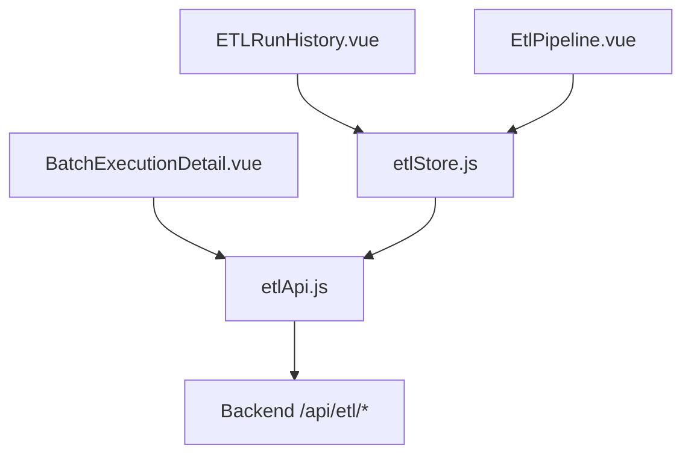
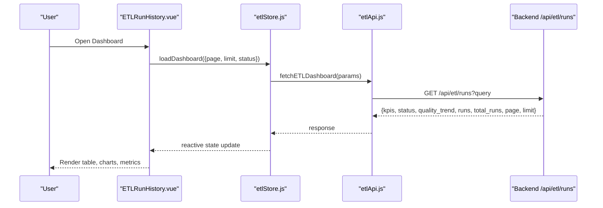
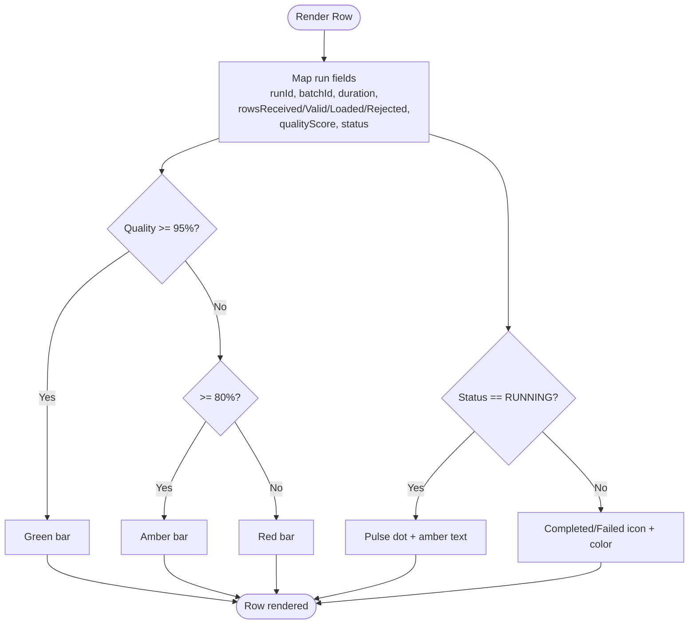
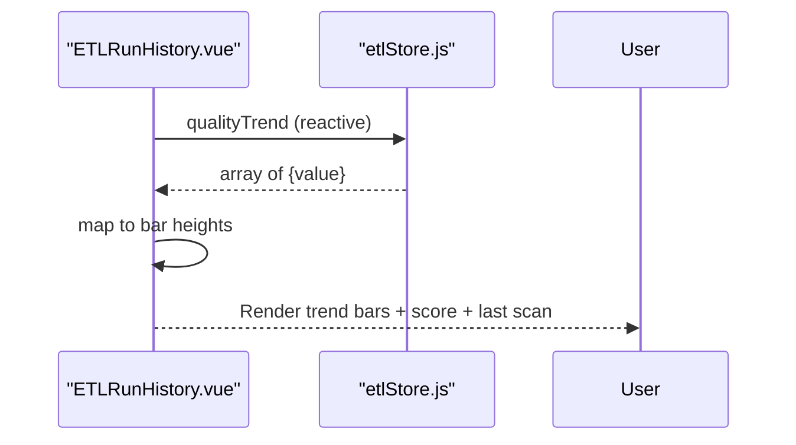
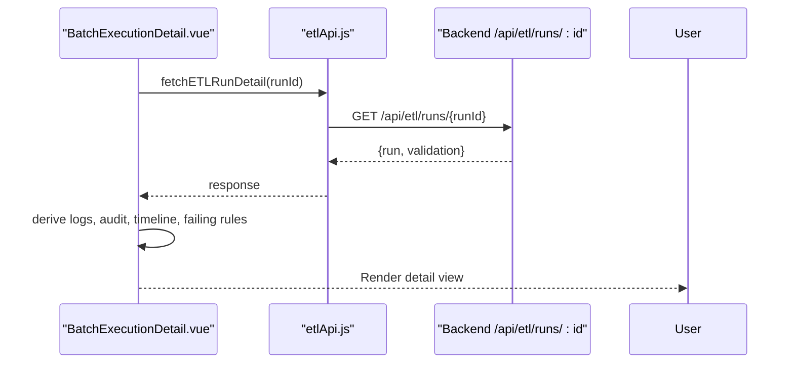
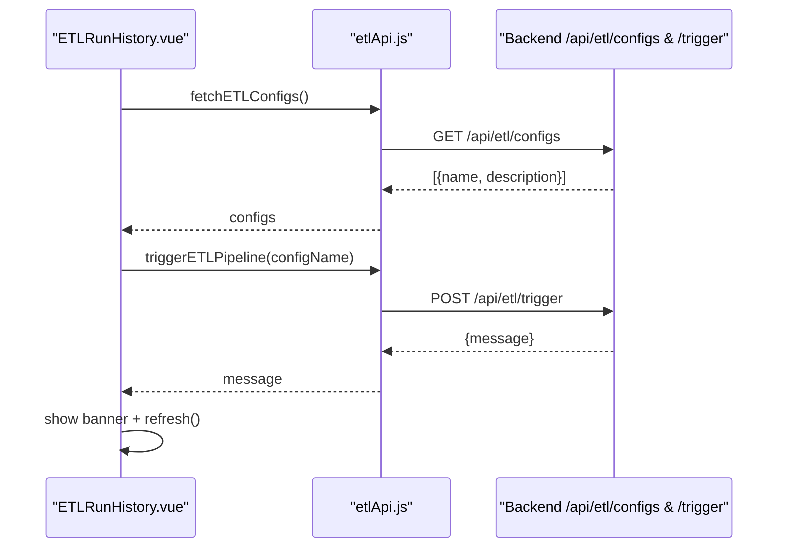
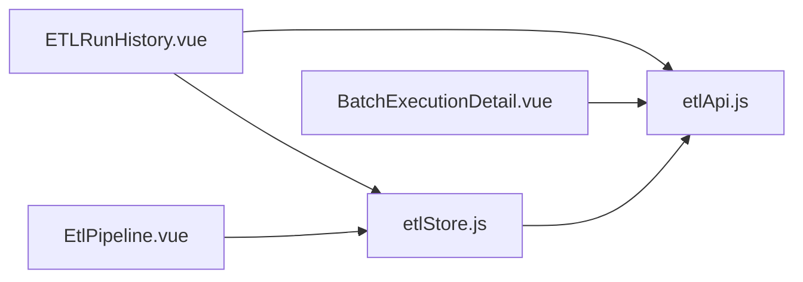

# Execution Timeline & History

<cite>
**Referenced Files in This Document**
- [ETLRunHistory.vue](file://src/views/Modules/datapipeline/ETLRunHistory.vue)
- [BatchExecutionDetail.vue](file://src/views/Modules/datapipeline/BatchExecutionDetail.vue)
- [EtlPipeline.vue](file://src/views/Modules/datapipeline/EtlPipeline.vue)
- [etlStore.js](file://src/stores/etlStore.js)
- [etlApi.js](file://src/services/etlApi.js)
</cite>

## Table of Contents
1. [Introduction](#introduction)
2. [Project Structure](#project-structure)
3. [Core Components](#core-components)
4. [Architecture Overview](#architecture-overview)
5. [Detailed Component Analysis](#detailed-component-analysis)
6. [Dependency Analysis](#dependency-analysis)
7. [Performance Considerations](#performance-considerations)
8. [Troubleshooting Guide](#troubleshooting-guide)
9. [Conclusion](#conclusion)
10. [Appendices](#appendices)

## Introduction
This document explains the Execution Timeline and History system that visualizes ETL pipeline runs, their quality metrics, and operational health. It covers:
- The execution history table with run IDs, batch IDs, duration, row processing statistics (received/valid/loaded/rejected), color-coded quality scores, and status tracking (Running, Completed, Failed).
- Timeline visualization features including quality score trends, success/failure patterns, and performance benchmarks.
- Filtering by status, date ranges, and pipeline types.
- Implementation details for pagination, real-time status updates, and data refresh mechanisms.
- Practical examples for analyzing execution patterns, identifying bottlenecks, and generating reports.
- Troubleshooting workflows for failed runs, retry mechanisms, and integration with monitoring systems.

## Project Structure
The Execution Timeline and History feature spans three primary views and supporting services/store:
- ETLRunHistory.vue: Main dashboard showing health cards, quality trend, execution history table, and footer metrics.
- BatchExecutionDetail.vue: Detailed view for a single run/batch with timeline, logs, audit trail, and rejection analysis.
- EtlPipeline.vue: Alternative styled view for pipeline health and execution history.
- etlStore.js: Central state for runs, KPIs, status panel, quality trend, pagination, and filters.
- etlApi.js: API client for fetching dashboard data, run details, configs, and triggering pipelines.

**Diagram sources**
- [ETLRunHistory.vue:267-397](file://src/views/Modules/datapipeline/ETLRunHistory.vue#L267-L397)
- [BatchExecutionDetail.vue:113-151](file://src/views/Modules/datapipeline/BatchExecutionDetail.vue#L113-L151)
- [EtlPipeline.vue:217-288](file://src/views/Modules/datapipeline/EtlPipeline.vue#L217-L288)
- [etlStore.js:33-72](file://src/stores/etlStore.js#L33-L72)
- [etlApi.js:68-114](file://src/services/etlApi.js#L68-L114)

**Section sources**
- [ETLRunHistory.vue:1-601](file://src/views/Modules/datapipeline/ETLRunHistory.vue#L1-L601)
- [BatchExecutionDetail.vue:1-501](file://src/views/Modules/datapipeline/BatchExecutionDetail.vue#L1-L501)
- [EtlPipeline.vue:1-438](file://src/views/Modules/datapipeline/EtlPipeline.vue#L1-L438)
- [etlStore.js:1-96](file://src/stores/etlStore.js#L1-L96)
- [etlApi.js:1-115](file://src/services/etlApi.js#L1-L115)

## Core Components
- Execution History Table: Displays runId, batchId, duration, rows (RCV/VAL/LD/REJ), quality score bar with color coding, and status badges with icons. Clicking a row navigates to the batch detail page.
- Quality Trend Visualization: Bar chart representing recent quality scores; includes current data integrity score and last scan time.
- Health Cards: Show PostgreSQL Cluster, Redis Cache, and API Gateway statuses and key metrics from the status panel.
- Footer Metrics: Storage growth, average quality, failed retries, and gateway latency.
- Trigger Modal: Lists available extraction specs and triggers a pipeline run with feedback and auto-refresh.

Key behaviors:
- Pagination is driven by store.page and store.totalPages, with previous/next navigation and page buttons.
- Status filter dropdown exists in the UI; store supports setStatusFilter to re-fetch filtered results.
- Real-time indicators: Running status uses an animated dot; Completed/Failed use check/close icons.

**Section sources**
- [ETLRunHistory.vue:100-171](file://src/views/Modules/datapipeline/ETLRunHistory.vue#L100-L171)
- [ETLRunHistory.vue:278-335](file://src/views/Modules/datapipeline/ETLRunHistory.vue#L278-L335)
- [etlStore.js:12-28](file://src/stores/etlStore.js#L12-L28)
- [etlStore.js:59-72](file://src/stores/etlStore.js#L59-L72)

## Architecture Overview
The system follows a clear separation of concerns:
- Views render UI and bind to reactive store state.
- Store manages pagination, filters, and aggregates KPIs/status/trend data.
- API service handles HTTP requests with token-based authorization and error normalization.

**Diagram sources**
- [ETLRunHistory.vue:394-397](file://src/views/Modules/datapipeline/ETLRunHistory.vue#L394-L397)
- [etlStore.js:33-57](file://src/stores/etlStore.js#L33-L57)
- [etlApi.js:68-75](file://src/services/etlApi.js#L68-L75)

## Detailed Component Analysis

### Execution History Table
- Columns: Run ID, Batch ID, Duration, Rows (RCV/VAL/LD/REJ), Quality Score (color-coded bar), Status (with icons and pulse for Running), Action (open details).
- Row click navigates to BatchExecutionDetail using run.auditId (mapped from run.runId).
- Color logic:
  - Quality >= 95%: green
  - 80–94%: amber
  - < 80%: red
- Status colors:
  - COMPLETED: green
  - FAILED: red
  - RUNNING: amber with pulsing dot

**Diagram sources**
- [ETLRunHistory.vue:305-318](file://src/views/Modules/datapipeline/ETLRunHistory.vue#L305-L318)

**Section sources**
- [ETLRunHistory.vue:115-156](file://src/views/Modules/datapipeline/ETLRunHistory.vue#L115-L156)
- [ETLRunHistory.vue:305-318](file://src/views/Modules/datapipeline/ETLRunHistory.vue#L305-L318)

### Quality Trend Visualization
- Displays a series of bars where height corresponds to quality values from qualityTrend.
- Shows Data Integrity Score and Last Scan Time derived from KPIs and status panel.

**Diagram sources**
- [ETLRunHistory.vue:289-302](file://src/views/Modules/datapipeline/ETLRunHistory.vue#L289-L302)
- [etlStore.js:20-22](file://src/stores/etlStore.js#L20-L22)

**Section sources**
- [ETLRunHistory.vue:52-97](file://src/views/Modules/datapipeline/ETLRunHistory.vue#L52-L97)
- [ETLRunHistory.vue:289-302](file://src/views/Modules/datapipeline/ETLRunHistory.vue#L289-L302)

### Batch Execution Detail
- Loads run detail via API and populates:
  - Header with runId, status, pipelineName, triggeredBy, timestamps.
  - Snapshot cards: Quality Score (with SLA threshold), Duration, Rows Processed, Data Quality (duplicates, warnings, errors, skipped).
  - Execution Timeline: steps with status, duration, timestamp, and failure details.
  - Rejection Analysis: categories and top failing rules.
  - Investigation Tabs: rejected records, execution logs, audit trail.
  - Config Used: collapsible config snapshot.

**Diagram sources**
- [BatchExecutionDetail.vue:113-151](file://src/views/Modules/datapipeline/BatchExecutionDetail.vue#L113-L151)
- [BatchExecutionDetail.vue:49-82](file://src/views/Modules/datapipeline/BatchExecutionDetail.vue#L49-L82)
- [etlApi.js:83-88](file://src/services/etlApi.js#L83-L88)

**Section sources**
- [BatchExecutionDetail.vue:154-486](file://src/views/Modules/datapipeline/BatchExecutionDetail.vue#L154-L486)

### Pipeline Health Cards and Footer Metrics
- Health cards show current_status and related metrics from statusPanel.
- Footer metrics include storage growth, average quality, failed retries, and gateway latency derived from KPIs and statusPanel.

**Section sources**
- [ETLRunHistory.vue:278-287](file://src/views/Modules/datapipeline/ETLRunHistory.vue#L278-L287)
- [ETLRunHistory.vue:329-335](file://src/views/Modules/datapipeline/ETLRunHistory.vue#L329-L335)

### Trigger Manual Run
- Opens modal listing extraction specs fetched from backend.
- On confirmation, triggers pipeline and shows success/error banners, then refreshes dashboard.

**Diagram sources**
- [ETLRunHistory.vue:352-391](file://src/views/Modules/datapipeline/ETLRunHistory.vue#L352-L391)
- [etlApi.js:94-114](file://src/services/etlApi.js#L94-L114)

**Section sources**
- [ETLRunHistory.vue:224-263](file://src/views/Modules/datapipeline/ETLRunHistory.vue#L224-L263)
- [ETLRunHistory.vue:352-391](file://src/views/Modules/datapipeline/ETLRunHistory.vue#L352-L391)

## Dependency Analysis
- ETLRunHistory.vue depends on:
  - etlStore for reactive state (runs, kpis, statusPanel, qualityTrend, pagination).
  - etlApi for fetching configs and triggering pipelines.
- BatchExecutionDetail.vue depends on:
  - etlApi for run detail and validation data.
- EtlPipeline.vue depends on:
  - etlStore for rendering alternative UI with same data model.

**Diagram sources**
- [ETLRunHistory.vue:267-397](file://src/views/Modules/datapipeline/ETLRunHistory.vue#L267-L397)
- [BatchExecutionDetail.vue:1-151](file://src/views/Modules/datapipeline/BatchExecutionDetail.vue#L1-L151)
- [EtlPipeline.vue:217-288](file://src/views/Modules/datapipeline/EtlPipeline.vue#L217-L288)
- [etlStore.js:1-96](file://src/stores/etlStore.js#L1-L96)
- [etlApi.js:1-115](file://src/services/etlApi.js#L1-L115)

**Section sources**
- [ETLRunHistory.vue:267-397](file://src/views/Modules/datapipeline/ETLRunHistory.vue#L267-L397)
- [BatchExecutionDetail.vue:1-151](file://src/views/Modules/datapipeline/BatchExecutionDetail.vue#L1-L151)
- [EtlPipeline.vue:217-288](file://src/views/Modules/datapipeline/EtlPipeline.vue#L217-L288)
- [etlStore.js:1-96](file://src/stores/etlStore.js#L1-L96)
- [etlApi.js:1-115](file://src/services/etlApi.js#L1-L115)

## Performance Considerations
- Pagination reduces payload size by limiting runs per page; store computes totalPages based on totalRuns and limit.
- Reactive computed properties minimize unnecessary recalculations for derived UI data (e.g., executionRuns mapping, quality trend).
- Error handling normalizes backend responses to user-friendly messages and prevents UI crashes.
- Avoid excessive polling; consider adding periodic refresh if real-time updates are required beyond manual triggers.

[No sources needed since this section provides general guidance]

## Troubleshooting Guide
Common issues and resolutions:
- No data displayed:
  - Verify network connectivity and authentication token.
  - Check store.error and console logs for API failures.
- Runs not updating:
  - Ensure refresh() is called after triggering a pipeline or when returning to the page.
  - Confirm backend endpoints return expected fields (runs, total_runs, page, limit, kpis, status, quality_trend).
- Failed runs:
  - Navigate to BatchExecutionDetail to inspect timeline, logs, and audit trail.
  - Use rejection analysis to identify failing rules and categories.
- Retry mechanism:
  - Use Trigger Manual Run to re-run a specific extraction spec.
  - Monitor banners for success/error and verify updated run list.

Integration with monitoring:
- Health cards reflect current_status and last_successful_duration/rows, aiding quick identification of degraded components.
- Footer metrics provide high-level insights into storage growth, average quality, failed retries, and gateway latency.

**Section sources**
- [ETLRunHistory.vue:44-51](file://src/views/Modules/datapipeline/ETLRunHistory.vue#L44-L51)
- [ETLRunHistory.vue:375-391](file://src/views/Modules/datapipeline/ETLRunHistory.vue#L375-L391)
- [BatchExecutionDetail.vue:113-151](file://src/views/Modules/datapipeline/BatchExecutionDetail.vue#L113-L151)
- [etlApi.js:18-38](file://src/services/etlApi.js#L18-L38)

## Conclusion
The Execution Timeline and History system provides a comprehensive view of ETL pipeline operations through:
- A detailed execution history table with rich metrics and status indicators.
- Visualizations for quality trends and system health.
- Robust pagination and filtering capabilities.
- A drill-down experience for investigating individual runs, including timelines, logs, and audits.
- Operational controls to trigger runs and monitor outcomes.

Adopting these tools enables efficient analysis of execution patterns, bottleneck identification, and report generation while supporting troubleshooting and continuous improvement.

[No sources needed since this section summarizes without analyzing specific files]

## Appendices

### Filtering Capabilities
- Status filter: Dropdown in UI allows selecting All Statuses, Running, Completed, Failed. Store supports setStatusFilter to re-fetch filtered results.
- Date ranges: Not implemented in current UI; can be added by extending params passed to fetchETLDashboard.
- Pipeline types: Not explicitly filtered in UI; can be extended by adding pipelineName parameter to API calls.

**Section sources**
- [ETLRunHistory.vue:104-112](file://src/views/Modules/datapipeline/ETLRunHistory.vue#L104-L112)
- [etlStore.js:64-68](file://src/stores/etlStore.js#L64-L68)
- [etlApi.js:51-75](file://src/services/etlApi.js#L51-L75)

### Pagination Handling
- Store maintains page, limit, and totalRuns; totalPages computed from ceil(totalRuns / limit).
- UI renders page buttons and prev/next controls; actions call setPage which triggers loadDashboard with updated page.

**Section sources**
- [etlStore.js:14-28](file://src/stores/etlStore.js#L14-L28)
- [etlStore.js:59-62](file://src/stores/etlStore.js#L59-L62)
- [ETLRunHistory.vue:159-170](file://src/views/Modules/datapipeline/ETLRunHistory.vue#L159-L170)

### Real-Time Status Updates and Data Refresh
- Running status indicated by animated dot; Completed/Failed shown with icons.
- After triggering a pipeline, the view refreshes via store.refresh() to pull latest data.
- For true real-time updates, consider implementing periodic polling or WebSocket integration.

**Section sources**
- [ETLRunHistory.vue:141-147](file://src/views/Modules/datapipeline/ETLRunHistory.vue#L141-L147)
- [ETLRunHistory.vue:375-391](file://src/views/Modules/datapipeline/ETLRunHistory.vue#L375-L391)
- [etlStore.js:70-72](file://src/stores/etlStore.js#L70-L72)

### Practical Examples
- Analyzing execution patterns:
  - Review quality trend bars to spot dips and correlate with failed runs.
  - Inspect footer metrics for average quality and failed retries to assess overall health.
- Identifying bottlenecks:
  - In BatchExecutionDetail, examine timeline steps and logs to locate slow or failing stages.
  - Use rejection categories and failing rules to pinpoint data quality issues.
- Generating execution reports:
  - Export Logs button in ETLRunHistory suggests exporting capability; integrate with backend export endpoint if needed.
  - Capture screenshots of quality trend and footer metrics for periodic reporting.

[No sources needed since this section provides general guidance]