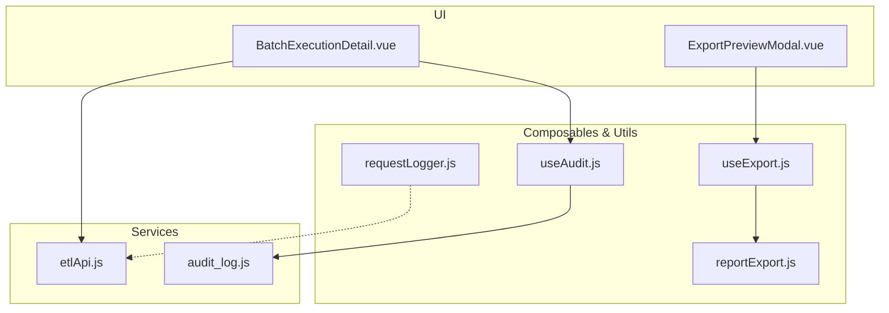
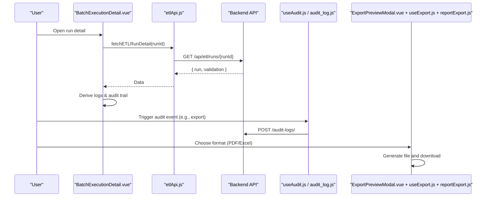
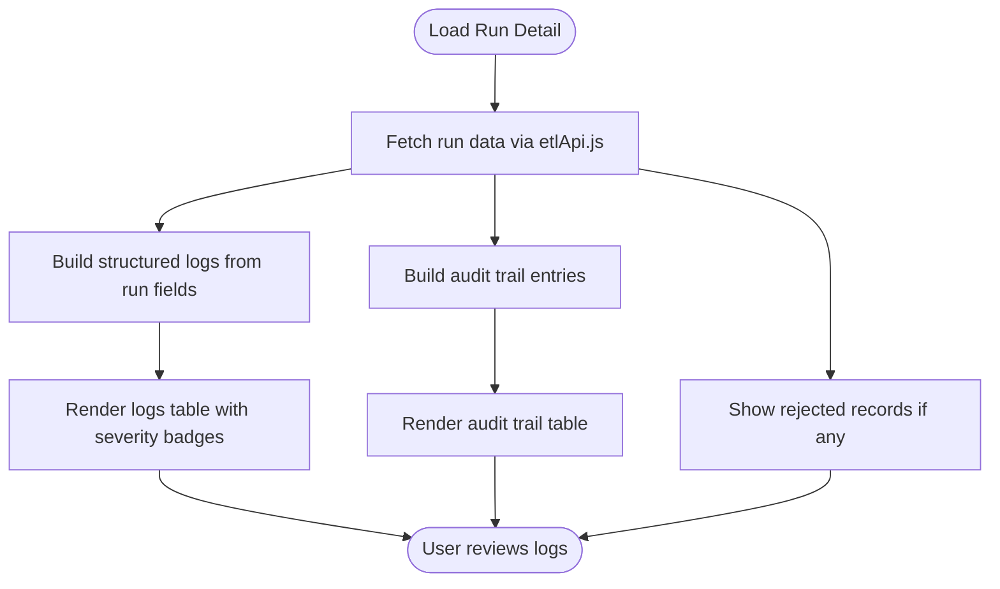
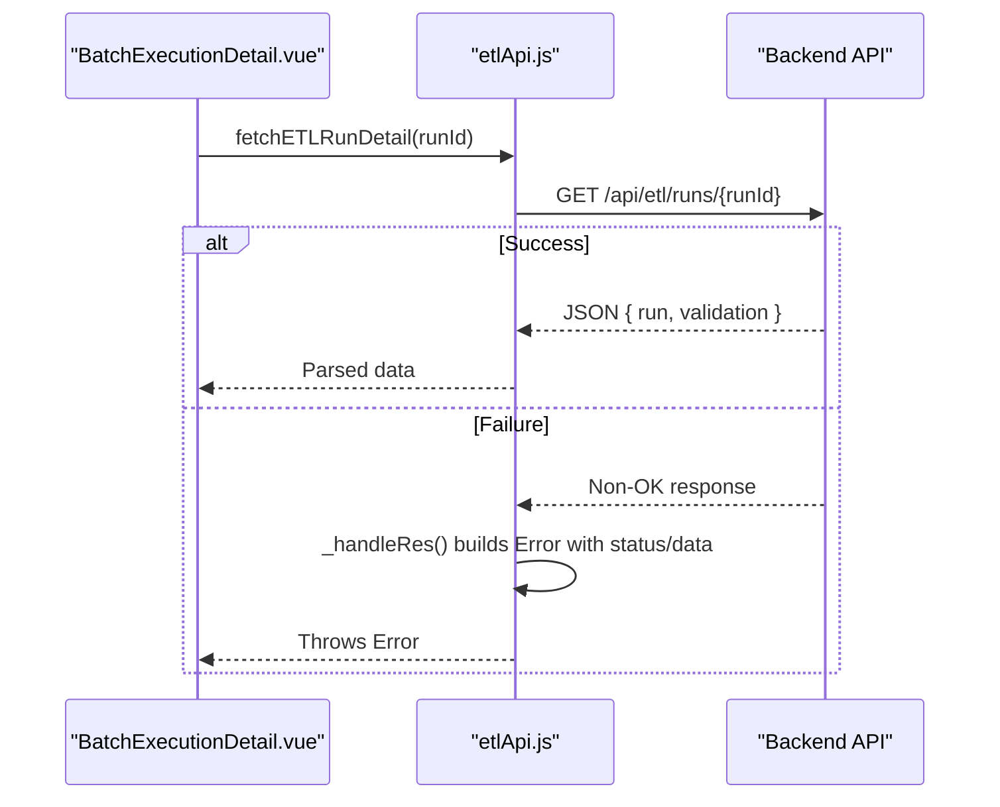
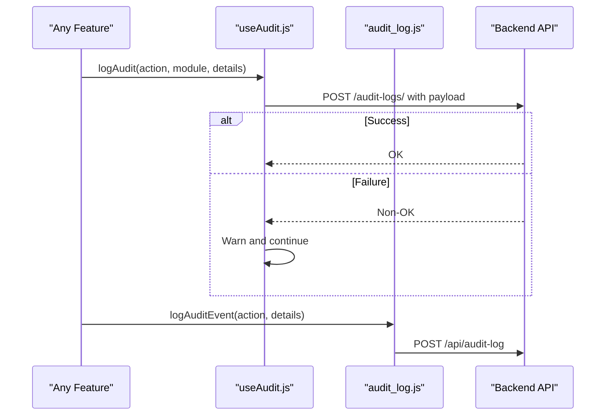
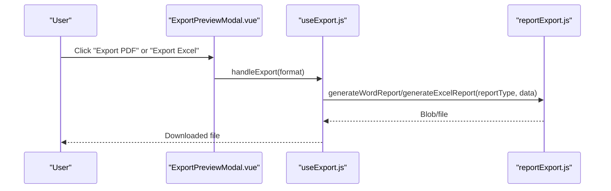
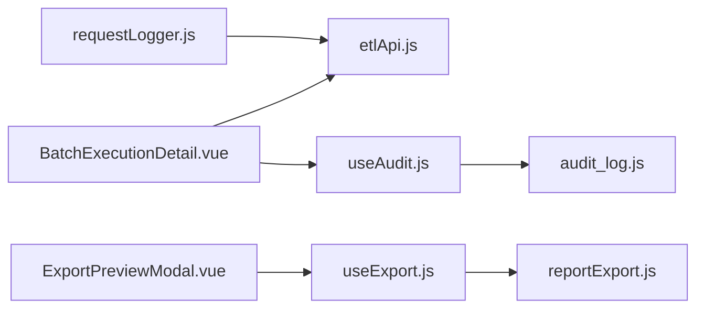

# Log Analysis & Export

<cite>
**Referenced Files in This Document**
- [BatchExecutionDetail.vue](file://src/views/Modules/datapipeline/BatchExecutionDetail.vue)
- [etlApi.js](file://src/services/etlApi.js)
- [useAudit.js](file://src/config/useAudit.js)
- [audit_log.js](file://src/services/audit_log.js)
- [useSettingsAudit.js](file://src/composables/settings/useSettingsAudit.js)
- [ExportPreviewModal.vue](file://src/components/ui/ExportPreviewModal.vue)
- [useExport.js](file://src/composables/useExport.js)
- [reportExport.js](file://src/utils/reportExport.js)
- [requestLogger.js](file://src/utils/requestLogger.js)
</cite>

## Table of Contents
1. [Introduction](#introduction)
2. [Project Structure](#project-structure)
3. [Core Components](#core-components)
4. [Architecture Overview](#architecture-overview)
5. [Detailed Component Analysis](#detailed-component-analysis)
6. [Dependency Analysis](#dependency-analysis)
7. [Performance Considerations](#performance-considerations)
8. [Troubleshooting Guide](#troubleshooting-guide)
9. [Conclusion](#conclusion)
10. [Appendices](#appendices)

## Introduction
This document explains the Log Analysis and Export functionality implemented in the frontend. It covers:
- Viewing execution logs, audit trails, and rejected records for ETL pipeline runs
- Structured log parsing patterns (severity levels, component tagging, timestamps)
- Search and filtering options available to users
- Export capabilities for offline analysis and compliance reporting
- Security considerations around sensitive data handling and access controls
- Practical examples for debugging failures and generating reports

## Project Structure
The log analysis and export features are centered around:
- A detail view for a specific pipeline run that displays logs, audit trail, and rejected records
- API services that fetch run details and dashboard data
- Audit logging composables and utilities that record user actions and HTTP diagnostics
- Export utilities that generate downloadable reports (PDF/Excel) with preview

**Diagram sources**
- [BatchExecutionDetail.vue:350-456](file://src/views/Modules/datapipeline/BatchExecutionDetail.vue#L350-L456)
- [etlApi.js:68-88](file://src/services/etlApi.js#L68-L88)
- [useAudit.js:43-72](file://src/config/useAudit.js#L43-L72)
- [audit_log.js:4-20](file://src/services/audit_log.js#L4-L20)
- [ExportPreviewModal.vue:1-94](file://src/components/ui/ExportPreviewModal.vue#L1-L94)
- [useExport.js:4-35](file://src/composables/useExport.js#L4-L35)
- [reportExport.js:24-88](file://src/utils/reportExport.js#L24-L88)
- [requestLogger.js:1-34](file://src/utils/requestLogger.js#L1-L34)

**Section sources**
- [BatchExecutionDetail.vue:350-456](file://src/views/Modules/datapipeline/BatchExecutionDetail.vue#L350-L456)
- [etlApi.js:68-88](file://src/services/etlApi.js#L68-L88)
- [useAudit.js:43-72](file://src/config/useAudit.js#L43-L72)
- [audit_log.js:4-20](file://src/services/audit_log.js#L4-L20)
- [ExportPreviewModal.vue:1-94](file://src/components/ui/ExportPreviewModal.vue#L1-L94)
- [useExport.js:4-35](file://src/composables/useExport.js#L4-L35)
- [reportExport.js:24-88](file://src/utils/reportExport.js#L24-L88)
- [requestLogger.js:1-34](file://src/utils/requestLogger.js#L1-L34)

## Core Components
- BatchExecutionDetail.vue: Displays execution logs, audit trail, and rejected records for a given run; derives structured logs from run metadata and renders severity-coded entries.
- etlApi.js: Provides functions to fetch run history and detailed run information, including error handling and parameter sanitization.
- useAudit.js: Composable to emit audit events (create/update/delete/export/login/logout) to the backend with user context and timestamp.
- audit_log.js: Utility to send audit events to a dedicated endpoint.
- ExportPreviewModal.vue + useExport.js: Provide an export preview UI and a composable to orchestrate export flows.
- reportExport.js: Generates Word/Excel reports from structured data for compliance and offline analysis.
- requestLogger.js: Logs HTTP requests/responses to aid diagnostics without exposing secrets.

**Section sources**
- [BatchExecutionDetail.vue:49-82](file://src/views/Modules/datapipeline/BatchExecutionDetail.vue#L49-L82)
- [etlApi.js:18-49](file://src/services/etlApi.js#L18-L49)
- [useAudit.js:19-75](file://src/config/useAudit.js#L19-L75)
- [audit_log.js:4-20](file://src/services/audit_log.js#L4-L20)
- [ExportPreviewModal.vue:71-94](file://src/components/ui/ExportPreviewModal.vue#L71-L94)
- [useExport.js:4-35](file://src/composables/useExport.js#L4-L35)
- [reportExport.js:24-88](file://src/utils/reportExport.js#L24-L88)
- [requestLogger.js:1-34](file://src/utils/requestLogger.js#L1-L34)

## Architecture Overview
The system integrates UI, services, and utilities to support log analysis and export:
- The detail view fetches run data via etlApi.js and renders logs and audit trails.
- Audit events are emitted by composables and persisted to the backend.
- Export flows use a preview modal and report generation utilities to produce downloadable files.
- Request logging aids troubleshooting network issues.

**Diagram sources**
- [BatchExecutionDetail.vue:113-151](file://src/views/Modules/datapipeline/BatchExecutionDetail.vue#L113-L151)
- [etlApi.js:83-88](file://src/services/etlApi.js#L83-L88)
- [useAudit.js:43-72](file://src/config/useAudit.js#L43-L72)
- [audit_log.js:4-20](file://src/services/audit_log.js#L4-L20)
- [ExportPreviewModal.vue:86-94](file://src/components/ui/ExportPreviewModal.vue#L86-L94)
- [useExport.js:17-26](file://src/composables/useExport.js#L17-L26)
- [reportExport.js:24-88](file://src/utils/reportExport.js#L24-L88)

## Detailed Component Analysis

### Execution Logs and Audit Trail in BatchExecutionDetail.vue
- Structured logs are derived from run metadata (start/end times, source info, row counts, duplicates, quality score). Each entry includes timestamp, level (INFO/WARN/ERROR), component, and message.
- Severity is visually encoded using color badges.
- Audit trail shows trigger, extract, and completion actions with user/system actor and description.
- Rejected records tab lists rule violations with field, actual vs expected values, rule, and severity.

**Diagram sources**
- [BatchExecutionDetail.vue:49-82](file://src/views/Modules/datapipeline/BatchExecutionDetail.vue#L49-L82)
- [BatchExecutionDetail.vue:350-456](file://src/views/Modules/datapipeline/BatchExecutionDetail.vue#L350-L456)
- [etlApi.js:83-88](file://src/services/etlApi.js#L83-L88)

**Section sources**
- [BatchExecutionDetail.vue:49-82](file://src/views/Modules/datapipeline/BatchExecutionDetail.vue#L49-L82)
- [BatchExecutionDetail.vue:350-456](file://src/views/Modules/datapipeline/BatchExecutionDetail.vue#L350-L456)

### API Integration and Error Handling (etlApi.js)
- Centralized header injection with Authorization token.
- Response handler parses text, attempts JSON parse, and constructs meaningful errors with status and data payload.
- Parameter sanitizer removes undefined/null/empty strings before building query strings.
- Functions include fetching dashboard data, run detail, configs, and triggering pipelines.

**Diagram sources**
- [etlApi.js:18-49](file://src/services/etlApi.js#L18-L49)
- [etlApi.js:83-88](file://src/services/etlApi.js#L83-L88)

**Section sources**
- [etlApi.js:18-49](file://src/services/etlApi.js#L18-L49)
- [etlApi.js:68-88](file://src/services/etlApi.js#L68-L88)

### Audit Logging (useAudit.js and audit_log.js)
- useAudit.js resolves operator role and emits audit events with user email/name, role, action, module, details, and timestamp.
- Events are sent to the backend audit endpoint with Authorization header.
- audit_log.js provides a simple utility to post audit events to a dedicated endpoint.

**Diagram sources**
- [useAudit.js:43-72](file://src/config/useAudit.js#L43-L72)
- [audit_log.js:4-20](file://src/services/audit_log.js#L4-L20)

**Section sources**
- [useAudit.js:19-75](file://src/config/useAudit.js#L19-L75)
- [audit_log.js:4-20](file://src/services/audit_log.js#L4-L20)

### Export Preview and Report Generation (ExportPreviewModal.vue, useExport.js, reportExport.js)
- ExportPreviewModal.vue presents a preview table and buttons to export to PDF or Excel.
- useExport.js manages preview state and wraps export handlers with error toast notifications.
- reportExport.js generates Word documents and Excel workbooks with multiple sheets based on report type and data.

**Diagram sources**
- [ExportPreviewModal.vue:86-94](file://src/components/ui/ExportPreviewModal.vue#L86-L94)
- [useExport.js:17-26](file://src/composables/useExport.js#L17-L26)
- [reportExport.js:24-88](file://src/utils/reportExport.js#L24-L88)

**Section sources**
- [ExportPreviewModal.vue:1-94](file://src/components/ui/ExportPreviewModal.vue#L1-L94)
- [useExport.js:4-35](file://src/composables/useExport.js#L4-L35)
- [reportExport.js:24-88](file://src/utils/reportExport.js#L24-L88)

### HTTP Diagnostics (requestLogger.js)
- Wraps fetch calls to log method, URL, payload, and response body/status.
- Avoids logging sensitive headers like Authorization.
- Useful for diagnosing failed requests and inspecting payloads during development.

**Section sources**
- [requestLogger.js:1-34](file://src/utils/requestLogger.js#L1-L34)

## Dependency Analysis
Key dependencies and relationships:
- BatchExecutionDetail.vue depends on etlApi.js for data retrieval and uses local computed logic to derive logs and audit trail.
- useAudit.js and audit_log.js depend on backend endpoints for persistent audit storage.
- ExportPreviewModal.vue and useExport.js coordinate with reportExport.js to generate downloadable files.
- requestLogger.js can be used across services to enhance observability.

**Diagram sources**
- [BatchExecutionDetail.vue:350-456](file://src/views/Modules/datapipeline/BatchExecutionDetail.vue#L350-L456)
- [etlApi.js:68-88](file://src/services/etlApi.js#L68-L88)
- [useAudit.js:43-72](file://src/config/useAudit.js#L43-L72)
- [audit_log.js:4-20](file://src/services/audit_log.js#L4-L20)
- [ExportPreviewModal.vue:86-94](file://src/components/ui/ExportPreviewModal.vue#L86-L94)
- [useExport.js:17-26](file://src/composables/useExport.js#L17-L26)
- [reportExport.js:24-88](file://src/utils/reportExport.js#L24-L88)
- [requestLogger.js:1-34](file://src/utils/requestLogger.js#L1-L34)

**Section sources**
- [BatchExecutionDetail.vue:350-456](file://src/views/Modules/datapipeline/BatchExecutionDetail.vue#L350-L456)
- [etlApi.js:68-88](file://src/services/etlApi.js#L68-L88)
- [useAudit.js:43-72](file://src/config/useAudit.js#L43-L72)
- [audit_log.js:4-20](file://src/services/audit_log.js#L4-L20)
- [ExportPreviewModal.vue:86-94](file://src/components/ui/ExportPreviewModal.vue#L86-L94)
- [useExport.js:17-26](file://src/composables/useExport.js#L17-L26)
- [reportExport.js:24-88](file://src/utils/reportExport.js#L24-L88)
- [requestLogger.js:1-34](file://src/utils/requestLogger.js#L1-L34)

## Performance Considerations
- Pagination and limits: Dashboard and audit log fetching support pagination parameters to reduce payload size and improve load times.
- Derived computations: Logs and audit trails are computed from minimal run metadata to avoid heavy processing in templates.
- Export sizing: Large datasets should be paginated or filtered before export to prevent memory pressure in the browser.
- Network efficiency: Use sanitized parameters and avoid unnecessary queries; leverage backend-side filtering where possible.

[No sources needed since this section provides general guidance]

## Troubleshooting Guide
Common issues and resolutions:
- Failed run detail fetch: Check network status and error messages returned by etlApi.js; review thrown errors with status and data.
- Missing logs or audit entries: Ensure run metadata contains required fields; verify audit events are successfully posted to the backend.
- Export failures: Confirm data structure matches expected schema; check for large datasets causing memory constraints.
- HTTP diagnostics: Use requestLogger.js to inspect request payloads and responses; ensure no secrets are logged inadvertently.

**Section sources**
- [etlApi.js:18-49](file://src/services/etlApi.js#L18-L49)
- [BatchExecutionDetail.vue:113-151](file://src/views/Modules/datapipeline/BatchExecutionDetail.vue#L113-L151)
- [useAudit.js:43-72](file://src/config/useAudit.js#L43-L72)
- [audit_log.js:4-20](file://src/services/audit_log.js#L4-L20)
- [requestLogger.js:1-34](file://src/utils/requestLogger.js#L1-L34)

## Conclusion
The frontend implements a robust set of features for analyzing execution logs, auditing user actions, and exporting reports for offline review and compliance. Structured logs and severity coding simplify debugging, while export utilities enable creation of standardized reports. Security-conscious practices such as token-based authorization and careful logging help protect sensitive data.

[No sources needed since this section summarizes without analyzing specific files]

## Appendices

### Practical Examples

- Analyzing error logs:
  - Open a run detail page and switch to the Execution Logs tab to view severity-coded entries.
  - Focus on ERROR entries to identify failing components and messages.
  - Cross-reference with Rejected Records to understand data-level failures.

- Debugging pipeline failures:
  - Review the timeline and status indicators in the run detail view.
  - Inspect the Config Used section to validate settings applied during the run.
  - Use requestLogger.js to trace network calls and inspect payloads when diagnosing integration issues.

- Generating compliance reports:
  - Use the Export Preview modal to select PDF or Excel formats.
  - For comprehensive reports, leverage reportExport.js to generate multi-section documents suitable for audits.

[No sources needed since this section provides general guidance]

### Security Considerations
- Authentication: All API calls include Authorization headers; tokens are read from local storage.
- Sensitive data masking: Avoid logging sensitive headers or payloads; requestLogger.js intentionally omits secrets.
- Access controls: Role-based permissions govern viewing and exporting audit logs; ensure backend enforces these controls consistently.
- Audit integrity: Audit events include user context and timestamps; ensure backend validates and stores them securely.

**Section sources**
- [etlApi.js:10-16](file://src/services/etlApi.js#L10-L16)
- [requestLogger.js:1-34](file://src/utils/requestLogger.js#L1-L34)
- [useAudit.js:43-72](file://src/config/useAudit.js#L43-L72)