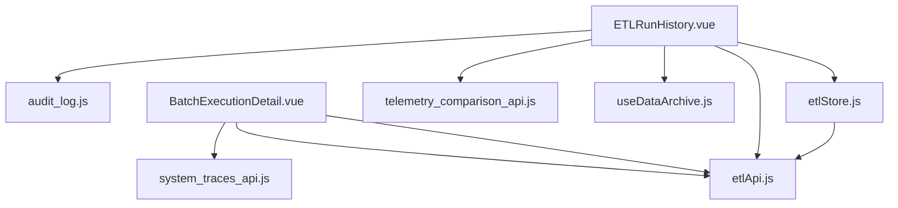
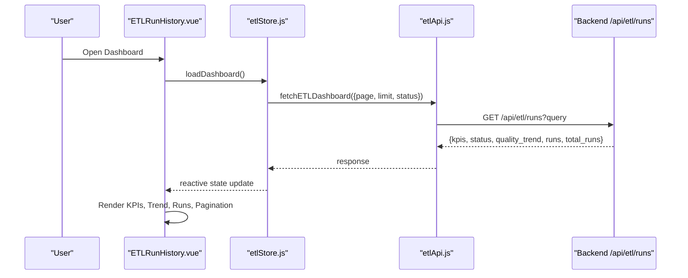
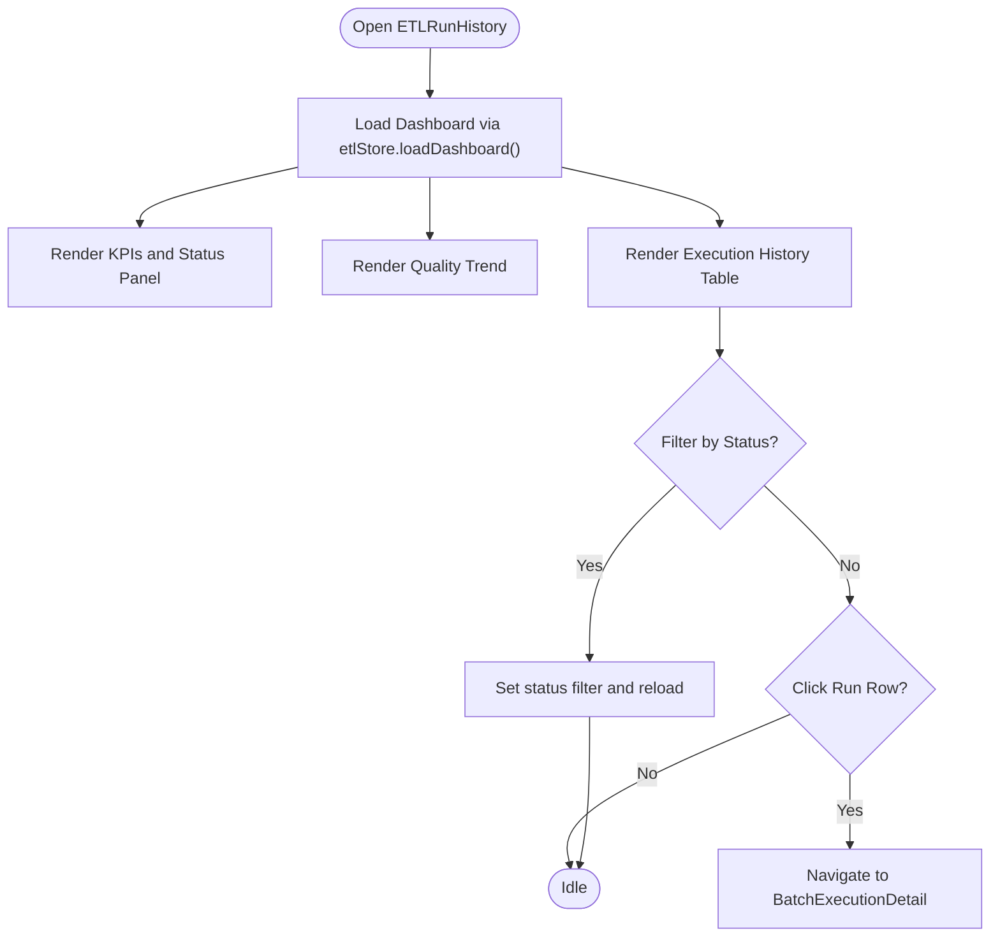
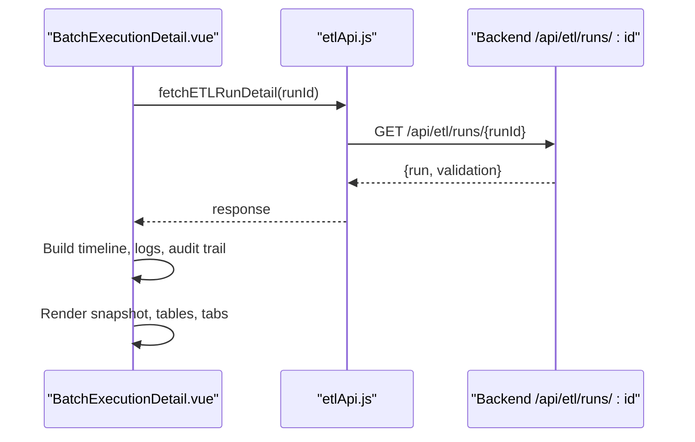
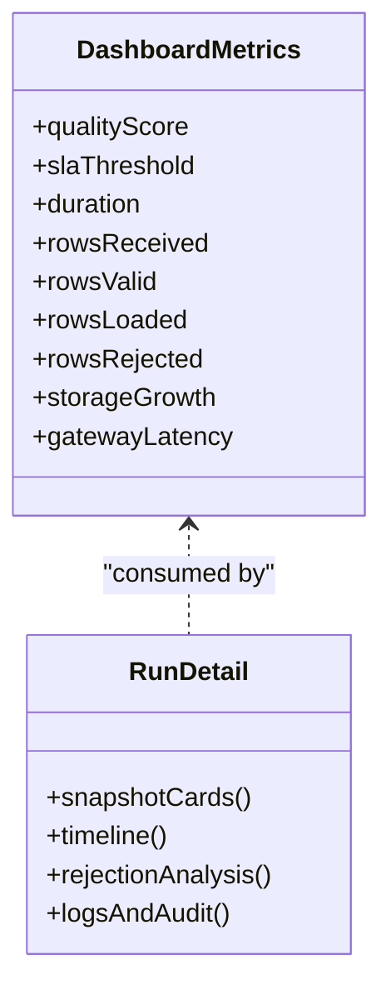
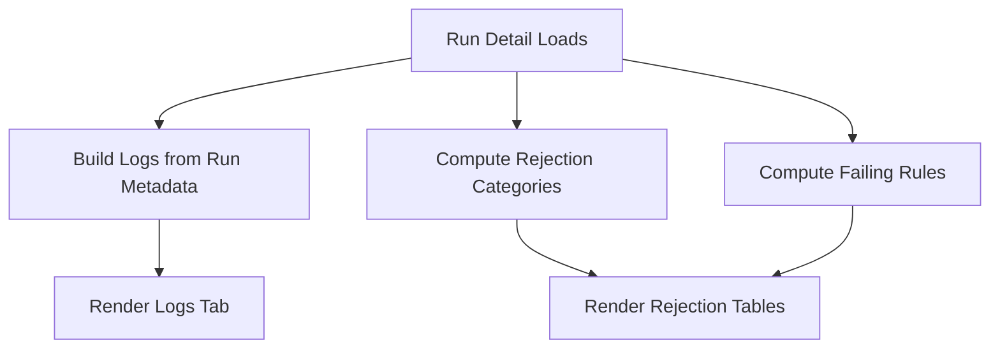
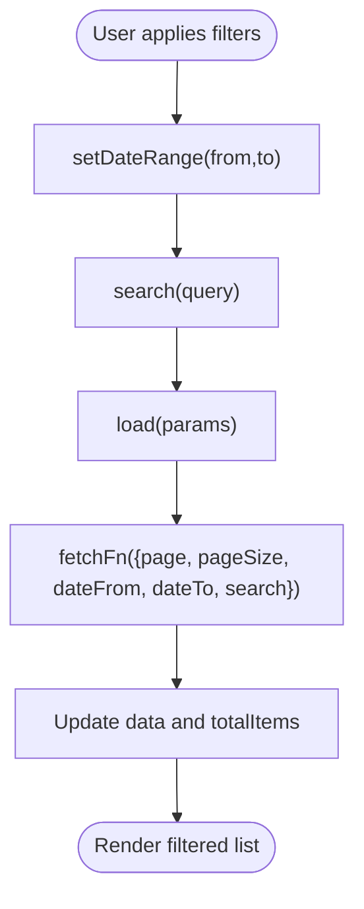
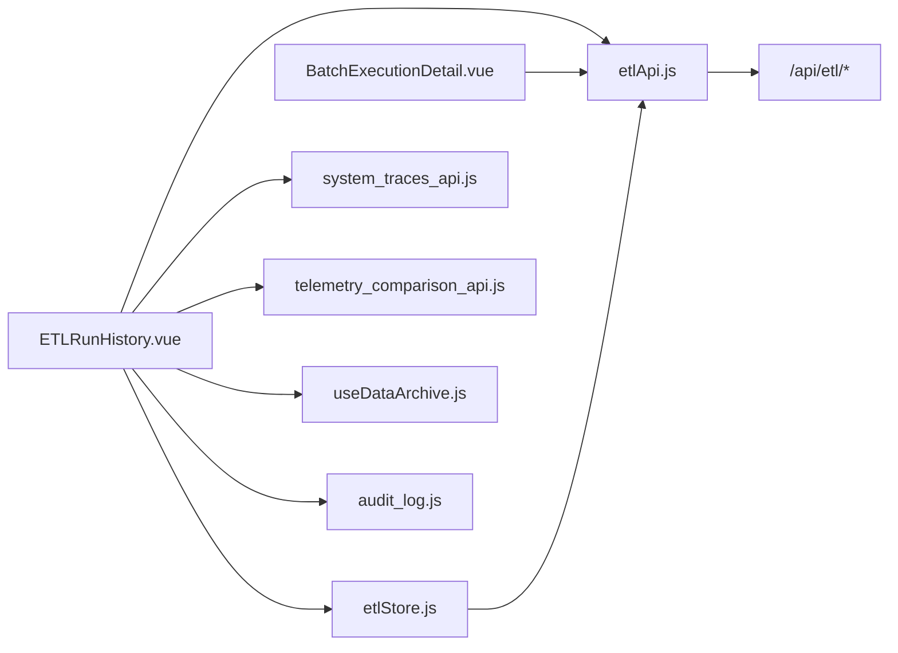
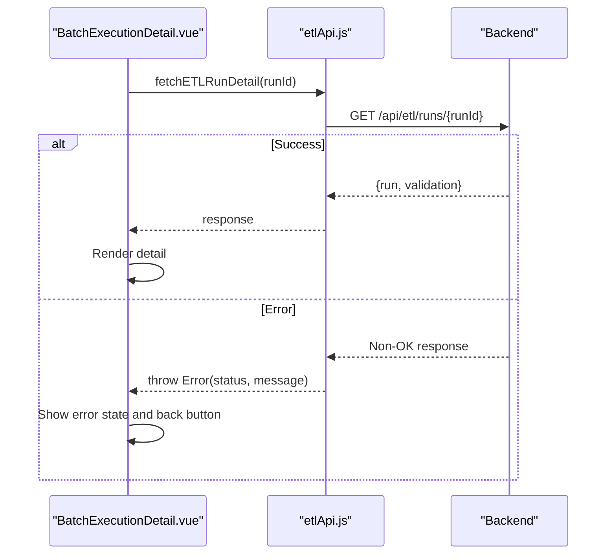

# Run History & Analytics

<cite>
**Referenced Files in This Document**
- [ETLRunHistory.vue](file://src/views/Modules/datapipeline/ETLRunHistory.vue)
- [BatchExecutionDetail.vue](file://src/views/Modules/datapipeline/BatchExecutionDetail.vue)
- [etlApi.js](file://src/services/etlApi.js)
- [etlStore.js](file://src/stores/etlStore.js)
- [useDataArchive.js](file://src/composables/useDataArchive.js)
- [audit_log.js](file://src/services/audit_log.js)
- [system_traces_api.js](file://src/services/system_traces_api.js)
- [telemetry_comparison_api.js](file://src/services/telemetry_comparison_api.js)
</cite>

## Table of Contents
1. [Introduction](#introduction)
2. [Project Structure](#project-structure)
3. [Core Components](#core-components)
4. [Architecture Overview](#architecture-overview)
5. [Detailed Component Analysis](#detailed-component-analysis)
6. [Dependency Analysis](#dependency-analysis)
7. [Performance Considerations](#performance-considerations)
8. [Troubleshooting Guide](#troubleshooting-guide)
9. [Conclusion](#conclusion)
10. [Appendices](#appendices)

## Introduction
This document describes the Run History and Analytics system implemented in the frontend. It covers:
- Execution history interface with run timelines, duration trends, and success/failure patterns
- Analytics dashboard elements including SLA compliance indicators, performance benchmarks, and capacity planning insights
- Log analysis features such as structured log views, error pattern detection via validation breakdowns, and search/pagination capabilities
- Data retention and archival strategies through reusable composable utilities
- Practical examples for filtering runs, analyzing performance trends, generating reports, and exporting audit trails
- Troubleshooting workflows, alerting setup, and integration points with monitoring services

## Project Structure
The Run History and Analytics feature spans several modules:
- Views: ETLRunHistory.vue (dashboard), BatchExecutionDetail.vue (run detail)
- Services: etlApi.js (ETL endpoints), system_traces_api.js (traces), telemetry_comparison_api.js (metrics/export), audit_log.js (audit events)
- Store: etlStore.js (state management for dashboard data)
- Composables: useDataArchive.js (pagination/search/date-range helpers)

**Diagram sources**
- [ETLRunHistory.vue:267-397](file://src/views/Modules/datapipeline/ETLRunHistory.vue#L267-L397)
- [BatchExecutionDetail.vue:1-151](file://src/views/Modules/datapipeline/BatchExecutionDetail.vue#L1-L151)
- [etlApi.js:51-114](file://src/services/etlApi.js#L51-L114)
- [etlStore.js:12-94](file://src/stores/etlStore.js#L12-L94)
- [useDataArchive.js:1-98](file://src/composables/useDataArchive.js#L1-L98)
- [system_traces_api.js:17-39](file://src/services/system_traces_api.js#L17-L39)
- [telemetry_comparison_api.js:38-113](file://src/services/telemetry_comparison_api.js#L38-L113)
- [audit_log.js:3-20](file://src/services/audit_log.js#L3-L20)

**Section sources**
- [ETLRunHistory.vue:1-601](file://src/views/Modules/datapipeline/ETLRunHistory.vue#L1-L601)
- [BatchExecutionDetail.vue:1-501](file://src/views/Modules/datapipeline/BatchExecutionDetail.vue#L1-L501)
- [etlApi.js:1-115](file://src/services/etlApi.js#L1-L115)
- [etlStore.js:1-96](file://src/stores/etlStore.js#L1-L96)
- [useDataArchive.js:1-98](file://src/composables/useDataArchive.js#L1-L98)
- [system_traces_api.js:1-40](file://src/services/system_traces_api.js#L1-L40)
- [telemetry_comparison_api.js:38-252](file://src/services/telemetry_comparison_api.js#L38-L252)
- [audit_log.js:1-20](file://src/services/audit_log.js#L1-L20)

## Core Components
- ETLRunHistory.vue: Dashboard showing health cards, quality trend chart, execution history table, pagination, trigger modal, and footer metrics.
- BatchExecutionDetail.vue: Detailed view of a single run with timeline, rejection analysis, logs, audit trail, and config snapshot.
- etlStore.js: Centralized state for runs, KPIs, status panel, quality trend, pagination, and loading/error states.
- etlApi.js: HTTP client functions to fetch dashboard data, run details, configs, and trigger pipelines.
- useDataArchive.js: Reusable pagination, date range, and search composable for list-like data.
- system_traces_api.js: Integration to fetch recent traces and trace breakdowns for performance diagnostics.
- telemetry_comparison_api.js: Metrics, variance analysis, export, and machine-level comparisons for capacity planning.
- audit_log.js: Utility to emit audit events for important actions.

**Section sources**
- [ETLRunHistory.vue:267-397](file://src/views/Modules/datapipeline/ETLRunHistory.vue#L267-L397)
- [BatchExecutionDetail.vue:14-151](file://src/views/Modules/datapipeline/BatchExecutionDetail.vue#L14-L151)
- [etlStore.js:12-94](file://src/stores/etlStore.js#L12-L94)
- [etlApi.js:51-114](file://src/services/etlApi.js#L51-L114)
- [useDataArchive.js:22-98](file://src/composables/useDataArchive.js#L22-L98)
- [system_traces_api.js:17-39](file://src/services/system_traces_api.js#L17-L39)
- [telemetry_comparison_api.js:38-113](file://src/services/telemetry_comparison_api.js#L38-L113)
- [audit_log.js:3-20](file://src/services/audit_log.js#L3-L20)

## Architecture Overview
The dashboard loads aggregated KPIs, status panel, quality trend, and paginated runs from the backend. The detail view fetches a specific run’s metadata and validation results to render timelines, logs, and audit trails. Optional integrations include system traces and telemetry metrics for deeper performance analysis.

**Diagram sources**
- [ETLRunHistory.vue:394-397](file://src/views/Modules/datapipeline/ETLRunHistory.vue#L394-L397)
- [etlStore.js:33-57](file://src/stores/etlStore.js#L33-L57)
- [etlApi.js:68-75](file://src/services/etlApi.js#L68-L75)

**Section sources**
- [ETLRunHistory.vue:267-397](file://src/views/Modules/datapipeline/ETLRunHistory.vue#L267-L397)
- [etlStore.js:33-57](file://src/stores/etlStore.js#L33-L57)
- [etlApi.js:68-75](file://src/services/etlApi.js#L68-L75)

## Detailed Component Analysis

### Execution History Interface
- Health cards: Display service statuses and key metrics derived from the status panel.
- Quality trend: Visualizes historical quality scores over time; supports time window toggles.
- Execution table: Lists runs with identifiers, duration, row counts, quality score bar, and status badges. Click navigates to batch detail.
- Pagination: Uses store-managed page/limit and computed totals for navigation.
- Footer metrics: Storage growth, average quality, failed retries, gateway latency.

**Diagram sources**
- [ETLRunHistory.vue:278-335](file://src/views/Modules/datapipeline/ETLRunHistory.vue#L278-L335)
- [ETLRunHistory.vue:337-340](file://src/views/Modules/datapipeline/ETLRunHistory.vue#L337-L340)
- [etlStore.js:33-68](file://src/stores/etlStore.js#L33-L68)

**Section sources**
- [ETLRunHistory.vue:17-221](file://src/views/Modules/datapipeline/ETLRunHistory.vue#L17-L221)
- [ETLRunHistory.vue:267-397](file://src/views/Modules/datapipeline/ETLRunHistory.vue#L267-L397)
- [etlStore.js:12-94](file://src/stores/etlStore.js#L12-L94)

### Run Detail and Timeline
- Header: Shows run ID, pipeline name, triggered-by, start/end times, and status badge.
- Snapshot cards: Quality score with SLA threshold, duration, rows processed, and data quality stats.
- Execution timeline: Step-wise progression with timestamps and durations; failure propagation updates later steps.
- Rejection analysis: Breakdown by category and top failing rules.
- Investigation tabs: Rejected records, execution logs, and audit trail.
- Config snapshot: Collapsible view of configuration used for the run.

**Diagram sources**
- [BatchExecutionDetail.vue:113-151](file://src/views/Modules/datapipeline/BatchExecutionDetail.vue#L113-L151)
- [etlApi.js:83-88](file://src/services/etlApi.js#L83-L88)

**Section sources**
- [BatchExecutionDetail.vue:154-483](file://src/views/Modules/datapipeline/BatchExecutionDetail.vue#L154-L483)
- [BatchExecutionDetail.vue:18-82](file://src/views/Modules/datapipeline/BatchExecutionDetail.vue#L18-L82)
- [etlApi.js:83-88](file://src/services/etlApi.js#L83-L88)

### Analytics Dashboard Elements
- SLA compliance: Quality score vs. SLA threshold shown in run detail; color-coded based on thresholds.
- Performance benchmarks: Duration and row throughput visible in snapshots and footer metrics.
- Capacity planning insights: Storage growth metric and gateway latency help assess scaling needs.

**Diagram sources**
- [BatchExecutionDetail.vue:196-260](file://src/views/Modules/datapipeline/BatchExecutionDetail.vue#L196-L260)
- [ETLRunHistory.vue:174-221](file://src/views/Modules/datapipeline/ETLRunHistory.vue#L174-L221)

**Section sources**
- [BatchExecutionDetail.vue:196-260](file://src/views/Modules/datapipeline/BatchExecutionDetail.vue#L196-L260)
- [ETLRunHistory.vue:174-221](file://src/views/Modules/datapipeline/ETLRunHistory.vue#L174-L221)

### Log Analysis Features
- Structured logs: Derived from run metadata (start, source, rows, warnings, completion).
- Error pattern detection: Validation breakdowns by category and rule failures highlight common issues.
- Search and pagination: useDataArchive provides date range filters, search queries, and pagination controls that can be reused across lists.

**Diagram sources**
- [BatchExecutionDetail.vue:49-82](file://src/views/Modules/datapipeline/BatchExecutionDetail.vue#L49-L82)
- [useDataArchive.js:22-98](file://src/composables/useDataArchive.js#L22-L98)

**Section sources**
- [BatchExecutionDetail.vue:49-82](file://src/views/Modules/datapipeline/BatchExecutionDetail.vue#L49-L82)
- [useDataArchive.js:22-98](file://src/composables/useDataArchive.js#L22-L98)

### Data Retention Policies and Archival Strategies
- Pagination and limits: etlStore enforces page/limit to control dataset size per request.
- Date-range filtering and search: useDataArchive exposes dateFrom/dateTo and searchQuery to narrow datasets.
- Export and archival hooks: While not directly implemented in these files, the structure supports adding export/archive flows using existing pagination and filters.

**Diagram sources**
- [useDataArchive.js:22-98](file://src/composables/useDataArchive.js#L22-L98)

**Section sources**
- [useDataArchive.js:22-98](file://src/composables/useDataArchive.js#L22-L98)
- [etlStore.js:33-68](file://src/stores/etlStore.js#L33-L68)

### Practical Examples
- Filtering run history: Use status filter in the dashboard to show Running/Completed/Failed runs; pagination adjusts accordingly.
- Analyzing performance trends: Inspect quality trend chart and footer metrics (average quality, gateway latency) to identify degradation.
- Generating reports: Use export functionality where available; integrate with reportExport utilities if needed for custom formats.
- Exporting audit trails: View audit trail tab in run detail; optionally integrate with audit_log.js to record user-triggered exports.

**Section sources**
- [ETLRunHistory.vue:100-171](file://src/views/Modules/datapipeline/ETLRunHistory.vue#L100-L171)
- [BatchExecutionDetail.vue:350-456](file://src/views/Modules/datapipeline/BatchExecutionDetail.vue#L350-L456)
- [audit_log.js:3-20](file://src/services/audit_log.js#L3-L20)

## Dependency Analysis
The following diagram shows how components depend on services and stores:

**Diagram sources**
- [ETLRunHistory.vue:267-397](file://src/views/Modules/datapipeline/ETLRunHistory.vue#L267-L397)
- [BatchExecutionDetail.vue:1-151](file://src/views/Modules/datapipeline/BatchExecutionDetail.vue#L1-L151)
- [etlStore.js:12-94](file://src/stores/etlStore.js#L12-L94)
- [etlApi.js:51-114](file://src/services/etlApi.js#L51-L114)
- [system_traces_api.js:17-39](file://src/services/system_traces_api.js#L17-L39)
- [telemetry_comparison_api.js:38-113](file://src/services/telemetry_comparison_api.js#L38-L113)
- [useDataArchive.js:22-98](file://src/composables/useDataArchive.js#L22-L98)
- [audit_log.js:3-20](file://src/services/audit_log.js#L3-L20)

**Section sources**
- [ETLRunHistory.vue:267-397](file://src/views/Modules/datapipeline/ETLRunHistory.vue#L267-L397)
- [BatchExecutionDetail.vue:1-151](file://src/views/Modules/datapipeline/BatchExecutionDetail.vue#L1-L151)
- [etlStore.js:12-94](file://src/stores/etlStore.js#L12-L94)
- [etlApi.js:51-114](file://src/services/etlApi.js#L51-L114)
- [system_traces_api.js:17-39](file://src/services/system_traces_api.js#L17-L39)
- [telemetry_comparison_api.js:38-113](file://src/services/telemetry_comparison_api.js#L38-L113)
- [useDataArchive.js:22-98](file://src/composables/useDataArchive.js#L22-L98)
- [audit_log.js:3-20](file://src/services/audit_log.js#L3-L20)

## Performance Considerations
- Paginated requests: etlStore uses page/limit to reduce payload sizes and improve rendering performance.
- Reactive computations: Derived values (e.g., executionRuns, qualityTrendData) are computed efficiently to avoid unnecessary re-renders.
- Conditional rendering: Skeleton loaders and empty states prevent layout thrashing during loading or when data is absent.
- External metrics: Telemetry comparison APIs provide variance analysis and export capabilities for large datasets; consider batching and caching strategies at the service layer.

[No sources needed since this section provides general guidance]

## Troubleshooting Guide
- Loading errors: etlApi handles non-OK responses and throws errors with status and parsed message; UI surfaces errors in loading states.
- Run detail failures: BatchExecutionDetail catches fetch errors and displays a back-to-history action.
- System traces: Use system_traces_api to fetch recent traces and detailed breakdowns for performance bottlenecks.
- Audit logging: Emit audit events for critical actions via audit_log.js to track user activity and changes.

**Diagram sources**
- [BatchExecutionDetail.vue:113-151](file://src/views/Modules/datapipeline/BatchExecutionDetail.vue#L113-L151)
- [etlApi.js:18-38](file://src/services/etlApi.js#L18-L38)

**Section sources**
- [BatchExecutionDetail.vue:113-151](file://src/views/Modules/datapipeline/BatchExecutionDetail.vue#L113-L151)
- [etlApi.js:18-38](file://src/services/etlApi.js#L18-L38)
- [system_traces_api.js:17-39](file://src/services/system_traces_api.js#L17-L39)
- [audit_log.js:3-20](file://src/services/audit_log.js#L3-L20)

## Conclusion
The Run History and Analytics system provides a comprehensive interface for monitoring ETL pipeline executions, analyzing performance trends, and investigating failures. It integrates with backend APIs for dashboard data and run details, supports structured log views and validation breakdowns, and offers reusable tools for pagination, search, and archival. Optional integrations with system traces and telemetry metrics enable deeper performance diagnostics and capacity planning.

[No sources needed since this section summarizes without analyzing specific files]

## Appendices

### API Reference Summary
- Dashboard data: GET /api/etl/runs?page&limit&status
- Run detail: GET /api/etl/runs/{runId}
- Config listing: GET /api/etl/configs
- Trigger run: POST /api/etl/trigger with config_name and dry_run

**Section sources**
- [etlApi.js:51-114](file://src/services/etlApi.js#L51-L114)

### Monitoring and Alerting Integration
- System traces: Fetch recent traces and breakdowns for performance profiling.
- Telemetry metrics: Variance analysis, export, and machine metrics support capacity planning and alerting.

**Section sources**
- [system_traces_api.js:17-39](file://src/services/system_traces_api.js#L17-L39)
- [telemetry_comparison_api.js:38-113](file://src/services/telemetry_comparison_api.js#L38-L113)