# Deployment & DevOps

<cite>
**Referenced Files in This Document**
- [Dockerfile](file://Dockerfile)
- [server.js](file://server.js)
- [app.yaml](file://app.yaml)
- [cloudbuild.yaml](file://cloudbuild.yaml)
- [docker-image.yml](file://.github/workflows/docker-image.yml)
- [vite.config.js](file://vite.config.js)
- [package.json](file://package.json)
- [.dockerignore](file://.dockerignore)
- [api.js](file://src/services/api.js)
- [auth_api.js](file://src/services/auth_api.js)
- [update-sw-cache.js](file://scripts/update-sw-cache.js)
</cite>

## Table of Contents
1. [Introduction](#introduction)
2. [Project Structure](#project-structure)
3. [Core Components](#core-components)
4. [Architecture Overview](#architecture-overview)
5. [Detailed Component Analysis](#detailed-component-analysis)
6. [Dependency Analysis](#dependency-analysis)
7. [Performance Considerations](#performance-considerations)
8. [Troubleshooting Guide](#troubleshooting-guide)
9. [Conclusion](#conclusion)
10. [Appendices](#appendices)

## Introduction
This document provides comprehensive deployment and DevOps guidance for the ABSA Foundry Frontend. It covers containerization with Docker (multi-stage builds, image optimization, security scanning), Google Cloud Platform deployment configuration (App Engine via app.yaml, Cloud Build triggers, pipelines), CI/CD using GitHub Actions, on-premise deployment on Ubuntu with Nginx as a reverse proxy, environment-specific configuration and secrets management, monitoring setup, scaling considerations, rollback procedures, performance optimizations (asset compression, caching, CDN integration), and troubleshooting/maintenance procedures.

## Project Structure
The project is a Vue 3 + Vite frontend that builds static assets and serves them via a lightweight Express server. Key deployment-related files include:
- Dockerfile: Multi-stage build to produce a minimal production image
- server.js: Express server serving built assets with compression and cache headers
- app.yaml: Google App Engine configuration for Node.js runtime
- cloudbuild.yaml: Cloud Build pipeline to install dependencies, build, and deploy to App Engine
- .github/workflows/docker-image.yml: GitHub Actions workflow to build Docker images
- vite.config.js: Vite configuration including PWA settings and build options
- package.json: Scripts for building, previewing, and testing
- .dockerignore: Excludes unnecessary files from Docker context

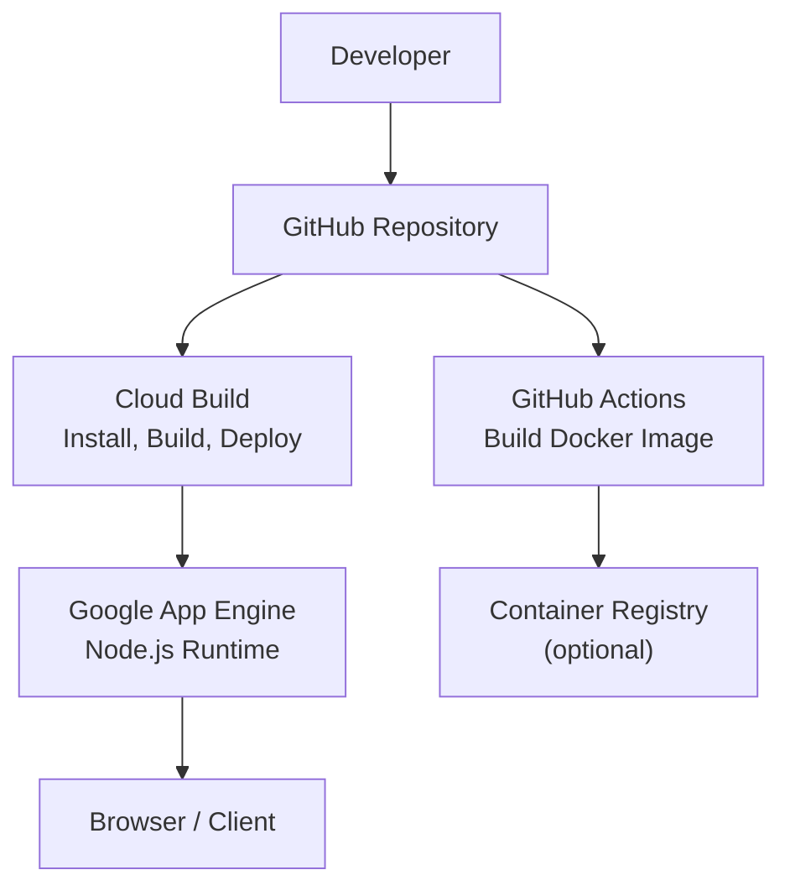

**Diagram sources**
- [docker-image.yml:1-19](file://.github/workflows/docker-image.yml#L1-L19)
- [cloudbuild.yaml:1-19](file://cloudbuild.yaml#L1-L19)
- [app.yaml:1-12](file://app.yaml#L1-L12)

**Section sources**
- [Dockerfile:1-71](file://Dockerfile#L1-L71)
- [server.js:1-70](file://server.js#L1-L70)
- [app.yaml:1-12](file://app.yaml#L1-L12)
- [cloudbuild.yaml:1-19](file://cloudbuild.yaml#L1-L19)
- [docker-image.yml:1-19](file://.github/workflows/docker-image.yml#L1-L19)
- [vite.config.js:1-41](file://vite.config.js#L1-L41)
- [package.json:1-90](file://package.json#L1-L90)
- [.dockerignore:1-5](file://.dockerignore#L1-L5)

## Core Components
- Containerized runtime: The Dockerfile defines a two-stage build using Node Alpine images. The builder stage installs build-time dependencies, sets npm retry behavior, copies source, injects build-time environment variables, and runs the Vite build. The production stage installs only runtime dependencies, copies the built dist folder and server.js, exposes port 3000, and starts the Express server.
- Static asset server: server.js serves the built assets with gzip compression, aggressive caching for content-hashed assets, no-cache for index.html, and SPA routing fallback.
- App Engine configuration: app.yaml configures the Node.js runtime and routes all requests to serve static files from dist, falling back to index.html for SPA routing.
- Cloud Build pipeline: cloudbuild.yaml installs dependencies, runs the build without cache, and deploys to App Engine with extended timeout and high CPU machine type.
- GitHub Actions: docker-image.yml builds the Docker image on push or pull request to main.

**Section sources**
- [Dockerfile:1-71](file://Dockerfile#L1-L71)
- [server.js:1-70](file://server.js#L1-L70)
- [app.yaml:1-12](file://app.yaml#L1-L12)
- [cloudbuild.yaml:1-19](file://cloudbuild.yaml#L1-L19)
- [docker-image.yml:1-19](file://.github/workflows/docker-image.yml#L1-L19)

## Architecture Overview
The deployment architecture supports multiple targets:
- Google App Engine via Cloud Build: Builds static assets and deploys to App Engine using app.yaml.
- Containerized runtime: Docker image can be run anywhere (GKE, ECS, self-hosted) using the same image produced by the Dockerfile.
- On-premise Nginx reverse proxy: Serve the built assets directly via Nginx for maximum performance and control.

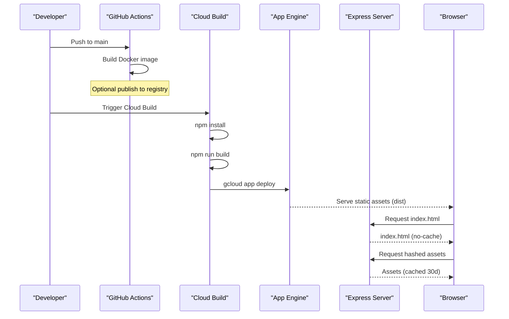

**Diagram sources**
- [docker-image.yml:1-19](file://.github/workflows/docker-image.yml#L1-L19)
- [cloudbuild.yaml:1-19](file://cloudbuild.yaml#L1-L19)
- [app.yaml:1-12](file://app.yaml#L1-L12)
- [server.js:1-70](file://server.js#L1-L70)

## Detailed Component Analysis

### Docker Containerization Strategy
- Multi-stage build: Builder stage compiles assets; production stage contains only runtime dependencies and built assets for minimal image size.
- Dependency installation: Uses npm ci with legacy peer deps to ensure reproducible installs; includes retry configuration to mitigate transient network errors.
- Environment variables: Build-time variables are injected into the image for Vite (e.g., API base URL, client IDs).
- Memory tuning: NODE_OPTIONS increases heap size during build to avoid OOM in constrained environments.
- Security scanning: Use container scanning tools (e.g., Trivy, Snyk) against the final image to detect vulnerabilities.

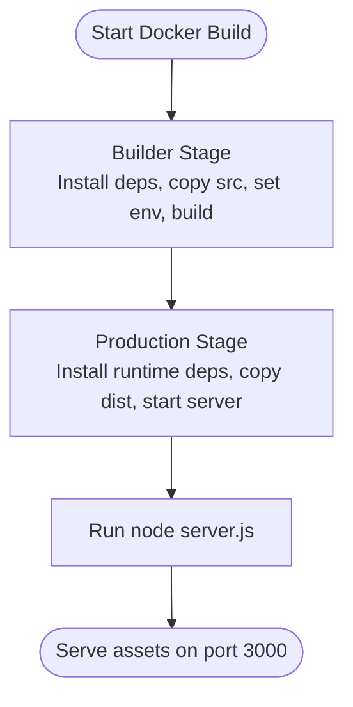

**Diagram sources**
- [Dockerfile:1-71](file://Dockerfile#L1-L71)

**Section sources**
- [Dockerfile:1-71](file://Dockerfile#L1-L71)
- [.dockerignore:1-5](file://.dockerignore#L1-L5)

### Google Cloud Platform Deployment
- App Engine configuration: app.yaml specifies Node.js runtime and routes all requests to serve static files from dist, with fallback to index.html for SPA routing.
- Cloud Build pipeline: Installs dependencies, runs build with cache disabled, then deploys to App Engine with extended timeout and higher CPU machine type for faster builds.
- Build triggers: Configure Cloud Build triggers to run on pushes to specific branches or tags.

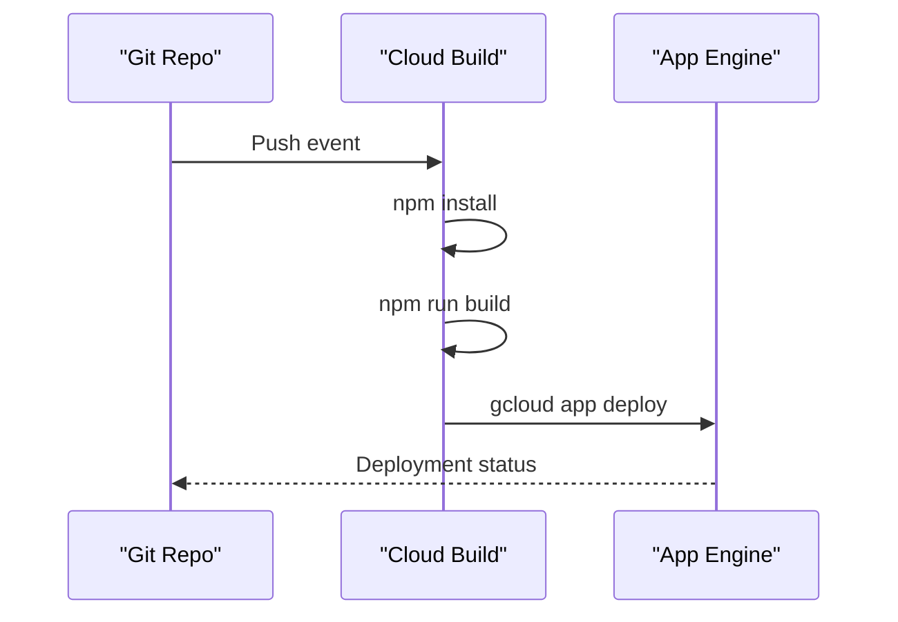

**Diagram sources**
- [cloudbuild.yaml:1-19](file://cloudbuild.yaml#L1-L19)
- [app.yaml:1-12](file://app.yaml#L1-L12)

**Section sources**
- [app.yaml:1-12](file://app.yaml#L1-L12)
- [cloudbuild.yaml:1-19](file://cloudbuild.yaml#L1-L19)

### CI/CD with GitHub Actions
- Workflow: docker-image.yml builds the Docker image on push or pull request to main.
- Integration: Extend the workflow to publish images to a registry and trigger deployments based on branch/tag rules.

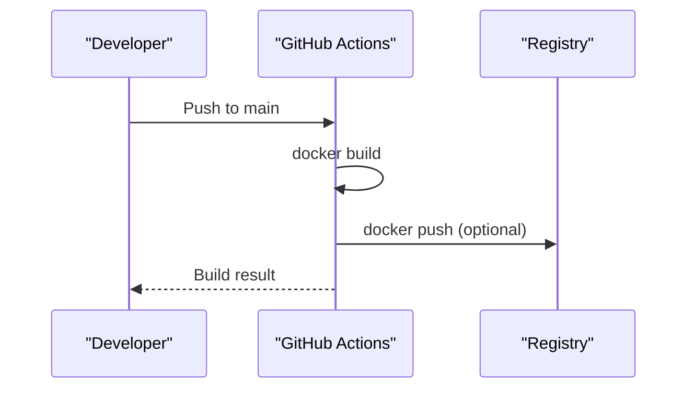

**Diagram sources**
- [docker-image.yml:1-19](file://.github/workflows/docker-image.yml#L1-L19)

**Section sources**
- [docker-image.yml:1-19](file://.github/workflows/docker-image.yml#L1-L19)

### On-Premise Deployment (Ubuntu + Nginx)
- Build artifacts: Use npm run build to generate dist directory.
- Reverse proxy: Configure Nginx to serve static files from dist, enable gzip compression, set appropriate cache headers, and route all paths to index.html for SPA routing.
- Process manager: Use systemd or PM2 to manage the Express server if running server.js locally, or serve entirely through Nginx for optimal performance.

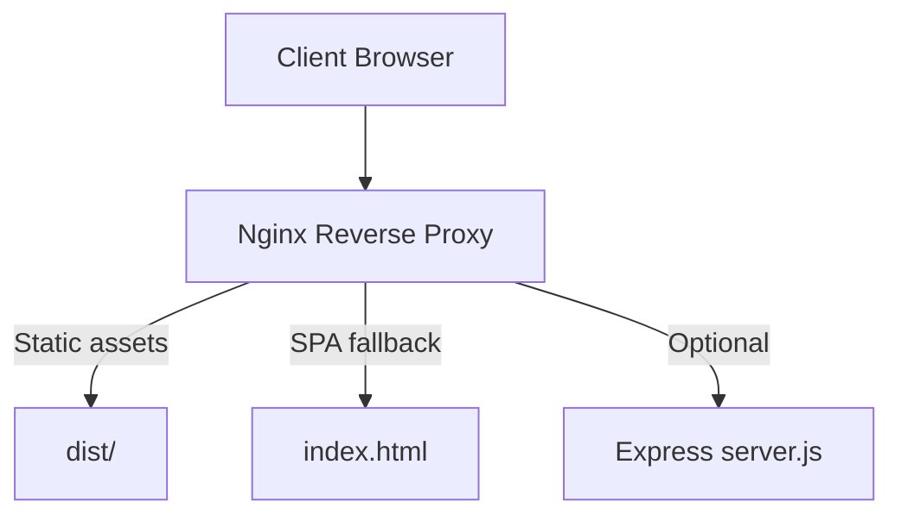

[No sources needed since this section provides general guidance]

### Environment-Specific Configuration and Secrets Management
- Build-time environment variables: Inject VITE_* variables during Docker build to configure the frontend at build time (e.g., API base URL, client IDs).
- Runtime environment variables: server.js reads PORT from environment; other runtime configs can be passed via process.env.
- Secrets: Store sensitive values (API keys, tokens) in platform secret managers (e.g., Google Secret Manager) and inject them at runtime or build time as appropriate. Avoid committing secrets to repository.

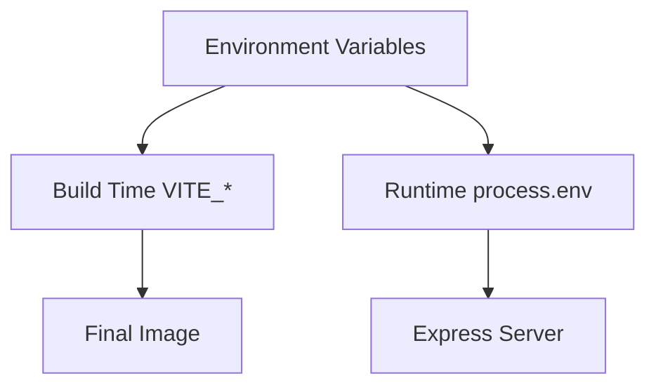

**Diagram sources**
- [Dockerfile:28-39](file://Dockerfile#L28-L39)
- [server.js:63-70](file://server.js#L63-L70)

**Section sources**
- [Dockerfile:28-39](file://Dockerfile#L28-L39)
- [server.js:63-70](file://server.js#L63-L70)
- [api.js:1-39](file://src/services/api.js#L1-L39)
- [auth_api.js:1-87](file://src/services/auth_api.js#L1-L87)

### Monitoring Setup
- Application logs: server.js logs errors and startup messages; capture these logs via your platform’s logging system (e.g., Cloud Logging for App Engine).
- Health checks: Implement a simple health endpoint in server.js to return 200 OK for load balancer or orchestrator health probes.
- Metrics: Integrate frontend metrics (e.g., performance timing, error tracking) via analytics SDKs or custom telemetry endpoints.

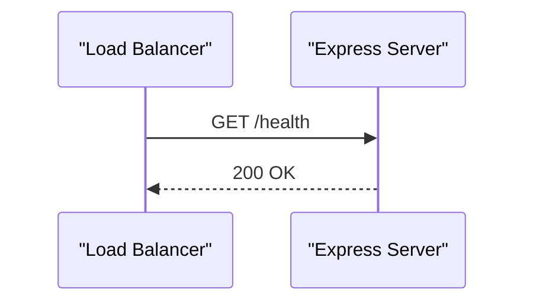

[No sources needed since this section provides general guidance]

### Scaling Considerations
- Horizontal scaling: For App Engine, configure autoscaling policies based on traffic patterns. For containers, scale replicas in Kubernetes or ECS.
- Stateless design: Ensure the Express server is stateless; store session data externally if needed.
- Asset delivery: Offload static assets to a CDN for improved global performance and reduced origin load.

[No sources needed since this section provides general guidance]

### Rollback Procedures
- App Engine: Maintain versioned deployments; roll back to previous versions via the App Engine console or CLI.
- Containers: Tag images with semantic versions; redeploy previous tagged images when issues arise.
- Git-based rollback: Revert commits and re-run CI/CD pipelines to restore prior states.

[No sources needed since this section provides general guidance]

## Dependency Analysis
The deployment pipeline depends on:
- Node.js toolchain for building and running the application
- Vite for asset compilation and bundling
- Express server for serving static assets with compression and caching
- Google Cloud services (App Engine, Cloud Build) for cloud deployment
- GitHub Actions for CI image builds

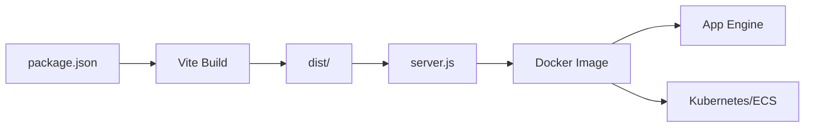

**Diagram sources**
- [package.json:6-11](file://package.json#L6-L11)
- [vite.config.js:7-41](file://vite.config.js#L7-L41)
- [server.js:1-70](file://server.js#L1-L70)
- [Dockerfile:1-71](file://Dockerfile#L1-L71)

**Section sources**
- [package.json:1-90](file://package.json#L1-L90)
- [vite.config.js:1-41](file://vite.config.js#L1-L41)
- [server.js:1-70](file://server.js#L1-L70)
- [Dockerfile:1-71](file://Dockerfile#L1-L71)

## Performance Considerations
- Asset compression: server.js enables gzip compression for responses.
- Caching strategy: index.html is served with no-cache to ensure clients always fetch the latest references; other static assets use aggressive caching (30 days) leveraging content-hashed filenames generated by Vite.
- CDN integration: Place a CDN in front of App Engine or Nginx to cache static assets globally and reduce latency.
- Service Worker: Vite PWA plugin configured to inject manifest and service worker; build script updates cache names per build to force cache invalidation.

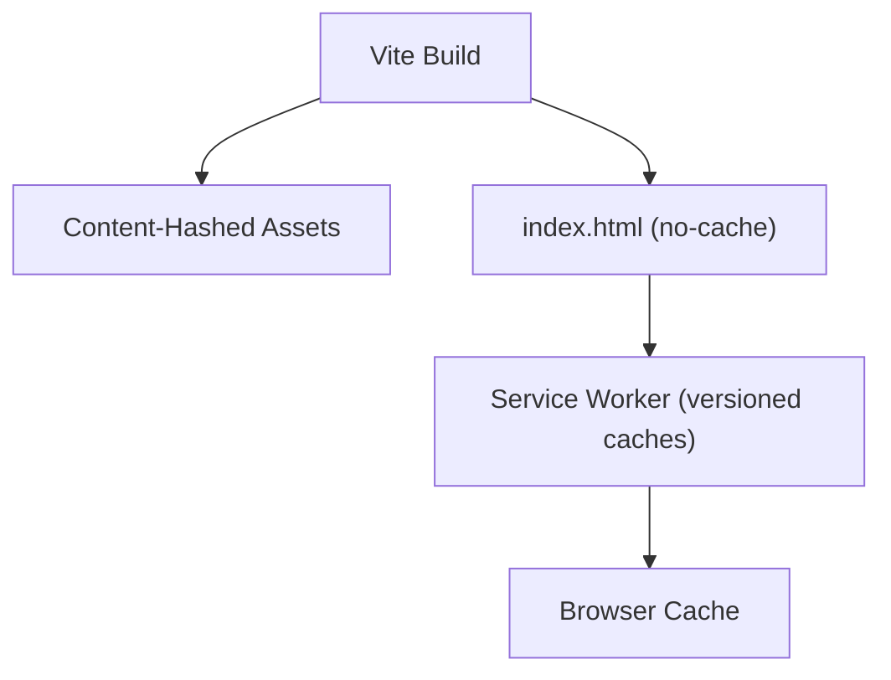

**Diagram sources**
- [vite.config.js:11-35](file://vite.config.js#L11-L35)
- [update-sw-cache.js:1-35](file://scripts/update-sw-cache.js#L1-L35)
- [server.js:19-51](file://server.js#L19-L51)

**Section sources**
- [server.js:19-51](file://server.js#L19-L51)
- [vite.config.js:11-35](file://vite.config.js#L11-L35)
- [update-sw-cache.js:1-35](file://scripts/update-sw-cache.js#L1-L35)

## Troubleshooting Guide
Common deployment issues and resolutions:
- Build failures due to missing dependencies: Ensure npm ci is used and legacy peer deps are enabled if necessary; verify network access to registries.
- Out-of-memory during build: Increase NODE_OPTIONS heap size in Dockerfile; consider using larger build machines in CI.
- SPA routing not working: Confirm app.yaml routes all non-static requests to index.html; verify server.js catch-all route returns index.html.
- Caching problems: Validate that index.html has no-cache headers and that hashed assets have long-lived cache headers; clear browser cache after deployments.
- Environment variable misconfiguration: Verify VITE_* variables are correctly injected at build time; check runtime PORT usage in server.js.
- Service Worker cache stale: Ensure update-sw-cache.js runs before build to refresh cache names; confirm SW registration logic respects dev bypass flags.

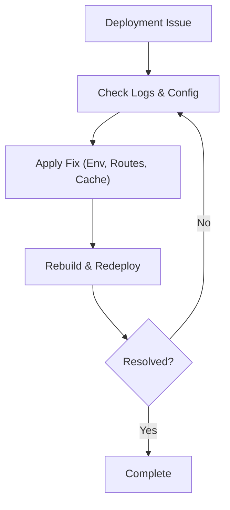

[No sources needed since this section provides general guidance]

## Conclusion
The ABSA Foundry Frontend supports robust deployment across cloud and on-premise environments using Docker, Google App Engine, and Nginx. The multi-stage Dockerfile ensures optimized images, while server.js provides efficient static asset serving with compression and caching. Cloud Build automates builds and deployments to App Engine, and GitHub Actions facilitates container image builds. Proper environment configuration, secrets management, and monitoring are essential for reliable operations. Performance can be further enhanced via CDN integration and careful caching strategies.

## Appendices

### Practical Deployment Examples
- Deploy to Google App Engine:
  - Configure Cloud Build triggers to run on branch pushes.
  - Ensure app.yaml and cloudbuild.yaml are present and correct.
  - Monitor deployment logs and verify SPA routing works.

- Run Docker image locally:
  - Build image using Dockerfile.
  - Set required environment variables (e.g., PORT).
  - Start container and access http://localhost:3000.

- On-premise Nginx:
  - Build dist using npm run build.
  - Configure Nginx to serve static files and handle SPA routing.
  - Enable gzip and set cache headers appropriately.

[No sources needed since this section provides general guidance]