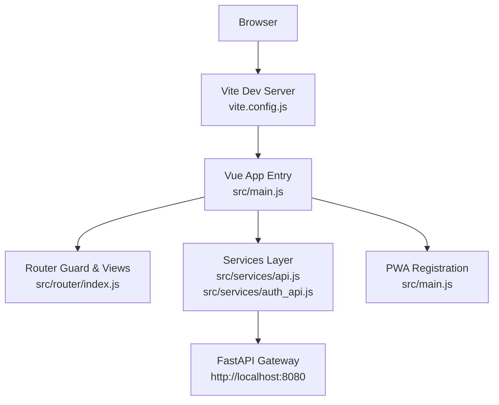
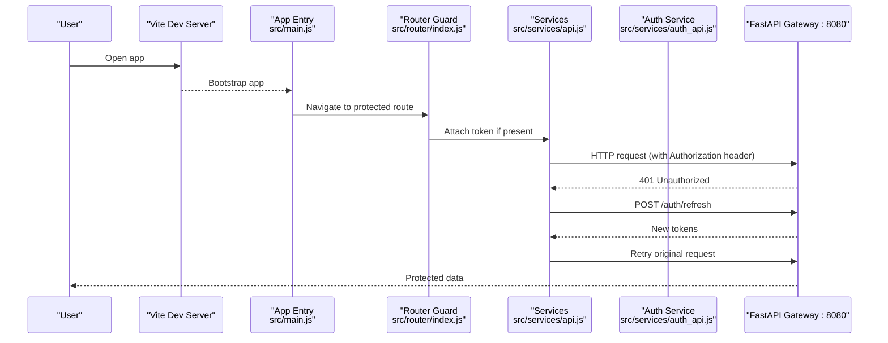
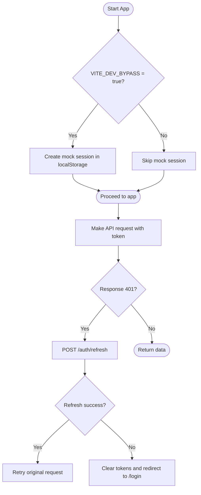
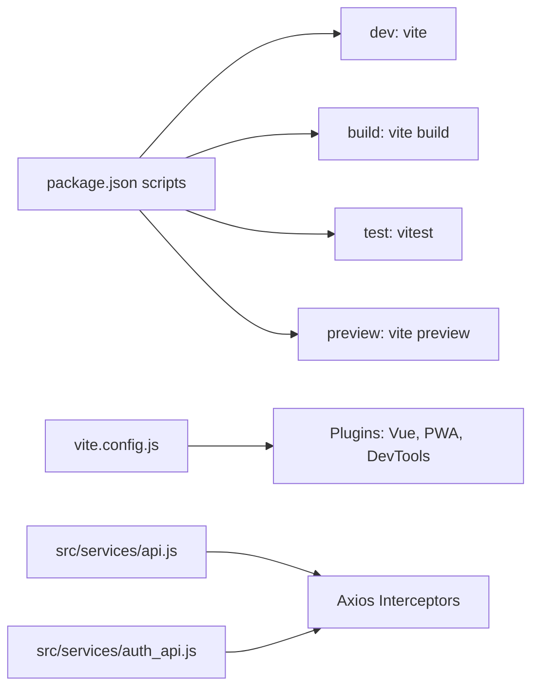

# Getting Started

<cite>
**Referenced Files in This Document**
- [package.json](file://package.json)
- [README.md](file://README.md)
- [vite.config.js](file://vite.config.js)
- [vitest.config.js](file://vitest.config.js)
- [src/main.js](file://src/main.js)
- [src/App.vue](file://src/App.vue)
- [src/services/api.js](file://src/services/api.js)
- [src/services/auth_api.js](file://src/services/auth_api.js)
- [src/config/devFlags.js](file://src/config/devFlags.js)
- [src/router/index.js](file://src/router/index.js)
- [Dockerfile](file://Dockerfile)
- [REMOTE-DEV-GUIDE.md](file://REMOTE-DEV-GUIDE.md)
</cite>

## Table of Contents
1. Introduction
2. Project Structure
3. Core Components
4. Architecture Overview
5. Detailed Component Analysis
6. Dependency Analysis
7. Performance Considerations
8. Troubleshooting Guide
9. Conclusion
10. Appendices

## Introduction
This guide helps you set up and run the ABSA Foundry Frontend locally, connect it to the FastAPI Gateway on your internal network (port 8080), and start developing with hot reload. It also covers environment variables for backend connectivity, local development bypass, and Google OAuth integration, along with testing, building, and previewing your app.

## Project Structure
The project is a Vue 3 + Vite application with Pinia state management, Axios-based API services, and a PWA setup. Key directories:
- src/components: Shared UI components and layouts
- src/composables: Reusable logic across modules
- src/services: API clients and helpers (Axios/fetch wrappers)
- src/views: Page-level components and feature modules
- src/router: Route definitions and guards
- src/config: App configuration and dev flags
- vite.config.js: Vite build and dev server settings
- vitest.config.js: Test runner configuration

**Diagram sources**
- [vite.config.js:7-41](file://vite.config.js#L7-L41)
- [src/main.js:20-67](file://src/main.js#L20-L67)
- [src/router/index.js:196-272](file://src/router/index.js#L196-L272)
- [src/services/api.js:4-18](file://src/services/api.js#L4-L18)
- [src/services/auth_api.js:3-17](file://src/services/auth_api.js#L3-L17)

**Section sources**
- [README.md:47-148](file://README.md#L47-L148)
- [vite.config.js:7-41](file://vite.config.js#L7-L41)

## Core Components
- Development server: Vite serves the app with hot module replacement.
- Services layer: Centralized base URL resolution and token handling for API calls.
- Auth flow: Login/refresh/logout endpoints and automatic token refresh on 401.
- PWA: Service worker registration controlled by a dev flag.
- Router: Global guards enforce authentication and module access.

Key behaviors:
- Base URL defaults to localhost:8080 when running locally; otherwise uses a configured or fallback remote URL.
- Token injection into requests via interceptors and helper functions.
- Automatic refresh on 401 responses using stored refresh tokens.
- Optional Google OAuth client ID from environment.

**Section sources**
- [src/services/api.js:4-18](file://src/services/api.js#L4-L18)
- [src/services/api.js:64-146](file://src/services/api.js#L64-L146)
- [src/services/auth_api.js:3-17](file://src/services/auth_api.js#L3-L17)
- [src/main.js:78-82](file://src/main.js#L78-L82)
- [src/router/index.js:201-272](file://src/router/index.js#L201-L272)

## Architecture Overview
The frontend communicates with a FastAPI Gateway that routes requests to backend services such as auth, CRM, ETL, and predictions. The dev server runs on port 3000 by default.

**Diagram sources**
- [src/services/api.js:64-146](file://src/services/api.js#L64-L146)
- [src/services/auth_api.js:3-17](file://src/services/auth_api.js#L3-L17)
- [src/router/index.js:201-272](file://src/router/index.js#L201-L272)
- [vite.config.js:7-41](file://vite.config.js#L7-L41)

## Detailed Component Analysis

### Environment Variables and Backend Connectivity
- VITE_API_BASE_URL: Controls the backend gateway address used by services. When not set, the app falls back to localhost:8080 during local development.
- VITE_DEV_BYPASS: Skips service worker registration and enables mock auth session for local development.
- VITE_GOOGLE_CLIENT_ID: Configures Google OAuth login client ID.

How they are used:
- Services resolve the base URL and attach Authorization headers automatically.
- Main entry conditionally registers the service worker based on the dev flag.
- Router guard can bypass auth checks when dev bypass is enabled.

**Section sources**
- [src/services/api.js:4-18](file://src/services/api.js#L4-L18)
- [src/services/auth_api.js:3-17](file://src/services/auth_api.js#L3-L17)
- [src/config/devFlags.js:1-27](file://src/config/devFlags.js#L1-L27)
- [src/main.js:35-67](file://src/main.js#L35-L67)
- [src/router/index.js:201-205](file://src/router/index.js#L201-L205)
- [src/main.js:78-82](file://src/main.js#L78-L82)

### Connecting to the FastAPI Gateway on Port 8080
Steps:
1. Ensure the FastAPI Gateway is reachable at http://localhost:8080 on your machine or internal network.
2. Start the frontend dev server; it will target localhost:8080 by default when no custom VITE_API_BASE_URL is set.
3. If connecting to a different host, create a .env.local file and set VITE_API_BASE_URL to the desired gateway URL.
4. Verify connectivity by logging in or checking health endpoints from the browser console or network tab.

Notes:
- Remote developers can use Tailscale addresses as documented in the remote dev guide.
- Docker builds pass environment variables into the image for production builds.

**Section sources**
- [src/services/api.js:4-18](file://src/services/api.js#L4-L18)
- [REMOTE-DEV-GUIDE.md:19-36](file://REMOTE-DEV-GUIDE.md#L19-L36)
- [Dockerfile:28-34](file://Dockerfile#L28-L34)

### Authentication Flow and Local Mock Session
- Login stores access and refresh tokens in localStorage and attaches them to subsequent requests.
- On 401, the app attempts to refresh tokens automatically; if refresh fails, it clears tokens and redirects to login.
- With VITE_DEV_BYPASS=true, a mock session is created in localStorage to skip real auth flows.

**Diagram sources**
- [src/services/api.js:64-146](file://src/services/api.js#L64-L146)
- [src/services/auth_api.js:31-87](file://src/services/auth_api.js#L31-L87)
- [src/config/devFlags.js:19-27](file://src/config/devFlags.js#L19-L27)

**Section sources**
- [src/services/api.js:64-146](file://src/services/api.js#L64-L146)
- [src/services/auth_api.js:31-87](file://src/services/auth_api.js#L31-L87)
- [src/config/devFlags.js:1-27](file://src/config/devFlags.js#L1-L27)

### Google OAuth Integration
- The app initializes Google OAuth using VITE_GOOGLE_CLIENT_ID.
- If not provided, a default client ID is used.
- Configure your own client ID in environment variables for production or team environments.

**Section sources**
- [src/main.js:78-82](file://src/main.js#L78-L82)

### PWA and Service Worker Behavior
- Service worker registration is skipped when VITE_DEV_BYPASS=true to simplify local debugging.
- In normal mode, the app registers the service worker immediately and handles updates.

**Section sources**
- [src/main.js:35-67](file://src/main.js#L35-L67)
- [vite.config.js:11-35](file://vite.config.js#L11-L35)

## Dependency Analysis
Core runtime dependencies include Vue 3, Vite, Pinia, Axios, and Tailwind CSS. Development dependencies include Vitest, JSDOM, and Vite plugins for PWA and Vue tooling.

**Diagram sources**
- [package.json:6-11](file://package.json#L6-L11)
- [vite.config.js:7-35](file://vite.config.js#L7-L35)
- [src/services/api.js:64-146](file://src/services/api.js#L64-L146)
- [src/services/auth_api.js:3-17](file://src/services/auth_api.js#L3-L17)

**Section sources**
- [package.json:13-87](file://package.json#L13-L87)
- [vite.config.js:7-41](file://vite.config.js#L7-L41)

## Performance Considerations
- Use Vite’s fast HMR for rapid iteration.
- Keep service worker disabled in development via VITE_DEV_BYPASS to avoid caching issues.
- Prefer lazy-loaded routes and components to reduce initial bundle size.
- Avoid unnecessary re-renders in components and leverage Pinia stores efficiently.

[No sources needed since this section provides general guidance]

## Troubleshooting Guide
Common issues and resolutions:
- Cannot reach backend:
  - Confirm FastAPI Gateway is running and accessible at http://localhost:8080 or your configured VITE_API_BASE_URL.
  - For remote devs, ensure Tailscale is connected and DNS resolves correctly.
- CORS errors:
  - Ensure the gateway allows requests from the dev server origin (typically http://localhost:3000).
- Authentication loops or 401 errors:
  - Verify tokens exist in localStorage and refresh endpoint is reachable.
  - Clear stale tokens if necessary and re-login.
- Service worker interfering with dev:
  - Set VITE_DEV_BYPASS=true to skip registration and clear existing registrations/caches.
- Google OAuth not working:
  - Provide a valid VITE_GOOGLE_CLIENT_ID in environment variables.

**Section sources**
- [src/services/api.js:4-18](file://src/services/api.js#L4-L18)
- [src/services/api.js:64-146](file://src/services/api.js#L64-L146)
- [src/config/devFlags.js:1-27](file://src/config/devFlags.js#L1-L27)
- [src/main.js:35-67](file://src/main.js#L35-L67)
- [REMOTE-DEV-GUIDE.md:19-36](file://REMOTE-DEV-GUIDE.md#L19-L36)

## Conclusion
You now have the essentials to install, configure, and develop the ABSA Foundry Frontend. Connect to the FastAPI Gateway on port 8080, enable local mock auth when needed, and use the provided scripts to run, test, build, and preview your changes. Refer to the troubleshooting tips if you encounter common setup or networking issues.

[No sources needed since this section summarizes without analyzing specific files]

## Appendices

### Installation and Setup Steps
1. Install Node.js 18+ (as indicated in the README prerequisites).
2. Install dependencies:
   - npm install
3. Start the development server:
   - npm run dev
4. Run tests:
   - npm test
5. Build for production:
   - npm run build
6. Preview the production build:
   - npm run preview

Environment variables:
- VITE_API_BASE_URL=http://localhost:8080 (default when running locally)
- VITE_DEV_BYPASS=true (optional, for local mock auth and disabling service worker)
- VITE_GOOGLE_CLIENT_ID=your-google-client-id (optional, for OAuth)

**Section sources**
- [README.md:461-495](file://README.md#L461-L495)
- [package.json:6-11](file://package.json#L6-L11)
- [src/services/api.js:4-18](file://src/services/api.js#L4-L18)
- [src/config/devFlags.js:1-27](file://src/config/devFlags.js#L1-L27)
- [src/main.js:78-82](file://src/main.js#L78-L82)

### Development Workflow Tips
- Hot reload: Changes reflect instantly in the browser via Vite.
- Testing: Use Vitest with jsdom environment for component and utility tests.
- Building: Production build outputs static assets ready for deployment.
- Preview: Serve the built output locally to validate performance and behavior.

**Section sources**
- [vite.config.js:7-41](file://vite.config.js#L7-L41)
- [vitest.config.js:5-17](file://vitest.config.js#L5-L17)
- [package.json:6-11](file://package.json#L6-L11)