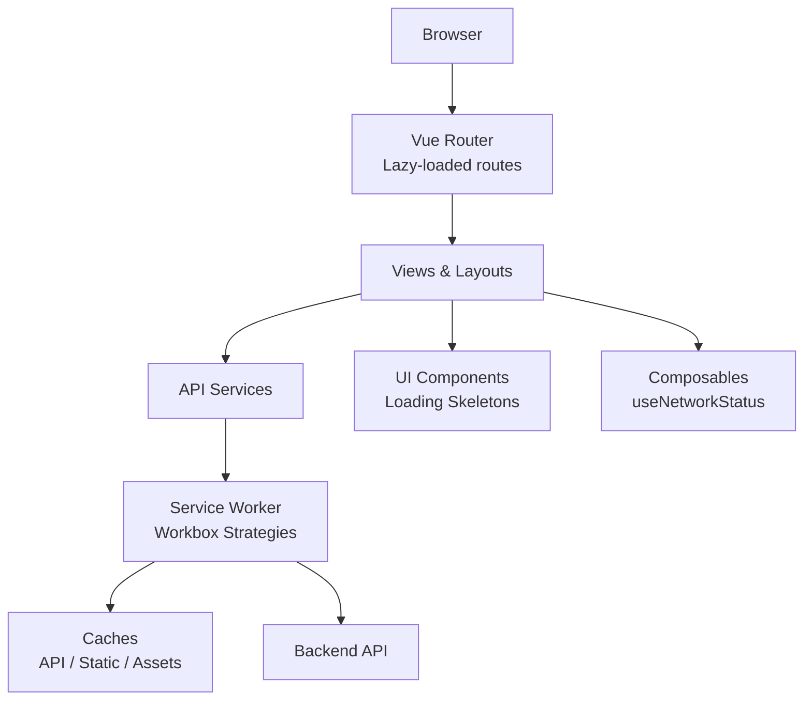
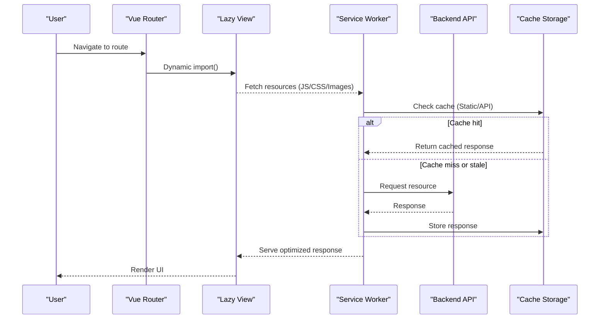
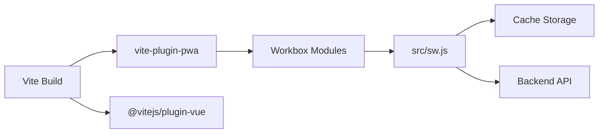

# Performance Optimization

<cite>
**Referenced Files in This Document**
- [vite.config.js](file://vite.config.js)
- [src/router/index.js](file://src/router/index.js)
- [public/manifest.json](file://public/manifest.json)
- [src/sw.js](file://src/sw.js)
- [package.json](file://package.json)
- [scripts/update-sw-cache.js](file://scripts/update-sw-cache.js)
- [src/utils/pwaManager.js](file://src/utils/pwaManager.js)
- [src/components/LoadingSkeleton.vue](file://src/components/LoadingSkeleton.vue)
- [src/composables/useNetworkStatus.js](file://src/composables/useNetworkStatus.js)
</cite>

## Table of Contents
1. [Introduction](#introduction)
2. [Project Structure](#project-structure)
3. [Core Components](#core-components)
4. [Architecture Overview](#architecture-overview)
5. [Detailed Component Analysis](#detailed-component-analysis)
6. [Dependency Analysis](#dependency-analysis)
7. [Performance Considerations](#performance-considerations)
8. [Troubleshooting Guide](#troubleshooting-guide)
9. [Conclusion](#conclusion)
10. [Appendices](#appendices)

## Introduction
This document provides performance optimization guidance for the ABSA Foundry Frontend with a focus on code splitting, asset optimization, Progressive Web App (PWA) implementation, monitoring, memory and re-render efficiency, virtualization strategies, debouncing, mobile/network optimizations, and testing methodologies. It maps directly to the project’s build configuration, routing, service worker, and runtime utilities to ensure actionable, code-backed recommendations.

## Project Structure
The frontend is built with Vite and Vue 3, using Vue Router for navigation and Workbox-based PWA capabilities via vite-plugin-pwa. The service worker handles precaching, API caching, static asset caching, background sync, and offline fallbacks. A custom PWA manager orchestrates install prompts, while composable utilities manage network status and UI feedback.

**Diagram sources**
- [src/router/index.js:1-275](file://src/router/index.js#L1-L275)
- [src/sw.js:1-224](file://src/sw.js#L1-L224)
- [src/components/LoadingSkeleton.vue:1-96](file://src/components/LoadingSkeleton.vue#L1-L96)
- [src/composables/useNetworkStatus.js:1-228](file://src/composables/useNetworkStatus.js#L1-L228)

**Section sources**
- [vite.config.js:1-41](file://vite.config.js#L1-L41)
- [src/router/index.js:1-275](file://src/router/index.js#L1-L275)
- [src/sw.js:1-224](file://src/sw.js#L1-L224)
- [public/manifest.json:1-24](file://public/manifest.json#L1-L24)
- [package.json:1-90](file://package.json#L1-L90)

## Core Components
- Code splitting via Vue Router lazy loading reduces initial bundle size by deferring non-critical route chunks until navigation.
- PWA configuration uses injectManifest strategy with Workbox for precise control over precaching and runtime caching strategies.
- Service worker implements NetworkFirst for APIs, StaleWhileRevalidate for static assets, and CacheFirst for images/fonts/icons, with background sync for offline mutations.
- PWA Manager centralizes install prompt lifecycle, user preference handling, and analytics hooks.
- Loading skeletons provide perceived performance improvements during data fetching.
- Network status composable tracks online/offline state and triggers sync when connectivity resumes.

**Section sources**
- [src/router/index.js:1-275](file://src/router/index.js#L1-L275)
- [vite.config.js:11-35](file://vite.config.js#L11-L35)
- [src/sw.js:17-150](file://src/sw.js#L17-L150)
- [src/utils/pwaManager.js:1-236](file://src/utils/pwaManager.js#L1-L236)
- [src/components/LoadingSkeleton.vue:1-96](file://src/components/LoadingSkeleton.vue#L1-L96)
- [src/composables/useNetworkStatus.js:1-228](file://src/composables/useNetworkStatus.js#L1-L228)

## Architecture Overview
The application leverages Vite’s module system and Vue Router’s dynamic imports to split code at route boundaries. The service worker intercepts requests to optimize network behavior and enable offline experiences. Caching policies are tailored per resource type to balance freshness and speed.

**Diagram sources**
- [src/router/index.js:1-275](file://src/router/index.js#L1-L275)
- [src/sw.js:75-150](file://src/sw.js#L75-L150)

## Detailed Component Analysis

### Code Splitting with Vue Router Lazy Loading
- Routes use dynamic imports to defer loading heavy views until needed, reducing initial payload and time-to-interactive.
- Some routes are eagerly imported (e.g., auth pages) where immediate availability is critical; others are lazily loaded to minimize startup cost.
- Route-level meta fields support guards and feature flags that can be extended for performance-related behaviors (e.g., preloading hints).

Recommendations:
- Ensure all non-critical routes remain lazily loaded.
- Consider route-level preloading hints for likely next steps based on user flows.
- Audit large third-party dependencies within views and consider further chunking or async initialization.

**Section sources**
- [src/router/index.js:1-275](file://src/router/index.js#L1-L275)

### Asset Optimization Techniques
- Images, fonts, and icons are served via CacheFirst with long expiration to improve repeat visits and offline access.
- Static assets (JS/CSS/JSON) use StaleWhileRevalidate to serve quickly from cache while updating in the background.
- Precaching ensures core shell assets are available immediately on first load.

Recommendations:
- Use modern image formats (WebP/AVIF) and responsive srcset where applicable.
- Preload critical fonts and defer non-critical ones.
- Monitor cache sizes and adjust maxEntries/maxAge to fit usage patterns.

**Section sources**
- [src/sw.js:120-150](file://src/sw.js#L120-L150)
- [vite.config.js:11-35](file://vite.config.js#L11-L35)

### Progressive Web App Implementation
- Manifest defines app identity, theme colors, and icons for installation and standalone display.
- Service worker configures:
  - Precaching of build artifacts
  - API caching with NetworkFirst and short TTL
  - Static assets with StaleWhileRevalidate
  - Media/fonts with CacheFirst and longer TTL
  - Background sync for offline mutations
  - Navigation fallback to index.html for offline resilience
- PWA Manager controls install prompts with throttling, cooldowns, and user preference persistence.

Recommendations:
- Validate manifest completeness and icon coverage across device densities.
- Test background sync reliability under intermittent connectivity.
- Provide clear UX cues for offline states and pending operations.

**Section sources**
- [public/manifest.json:1-24](file://public/manifest.json#L1-L24)
- [src/sw.js:1-224](file://src/sw.js#L1-L224)
- [src/utils/pwaManager.js:1-236](file://src/utils/pwaManager.js#L1-L236)

### Performance Monitoring Approaches
- Use browser developer tools (Performance panel, Memory panel, Network tab) to capture real-world interactions and identify bottlenecks.
- Run Lighthouse audits regularly to assess Core Web Vitals and PWA criteria.
- Implement custom metrics (e.g., Time to Interactive, Largest Contentful Paint) via Performance Observer or analytics SDKs.
- Track network transitions and sync events to correlate UX issues with connectivity changes.

Practical steps:
- Instrument key user journeys and measure before/after optimization changes.
- Log errors and performance regressions to a centralized telemetry system.
- Correlate slow renders with large component trees or excessive reactivity updates.

[No sources needed since this section provides general guidance]

### Memory Management and Reactive State Efficiency
- Avoid unnecessary reactive updates by scoping reactivity to minimal necessary state.
- Use computed properties and watchers judiciously to prevent expensive recalculations.
- Clean up event listeners and timers in component teardown to prevent leaks.
- Prefer lightweight stores and avoid holding large datasets in reactive memory unless required.

Best practices:
- Debounce frequent user inputs to reduce reactivity churn.
- Virtualize large lists to limit DOM nodes and memory pressure.
- Release references to large objects when navigating away from heavy views.

[No sources needed since this section provides general guidance]

### Virtual Scrolling for Large Datasets
- Implement windowed rendering to only keep visible rows in the DOM.
- Use fixed-height rows for predictable layout calculations.
- Combine with virtualized lists and efficient item components to minimize re-renders.
- Integrate with pagination or infinite scroll for very large datasets.

Implementation tips:
- Measure viewport height and item size to compute visible ranges.
- Debounce resize handlers and handle dynamic content changes carefully.
- Profile scrolling performance and adjust buffer sizes for smoothness.

[No sources needed since this section provides general guidance]

### Debouncing User Inputs
- Debounce search, filter, and input events to reduce network calls and re-renders.
- Use consistent debounce intervals tuned to user interaction patterns.
- Combine with cancellation tokens or abort controllers to ignore stale responses.

Example pattern:
- On input change, schedule a delayed action; cancel previous if new input arrives before timeout.

[No sources needed since this section provides general guidance]

### Optimizing Re-renders
- Memoize derived data and stable references for props and callbacks.
- Split large components into smaller, focused components to limit update scope.
- Avoid deep reactive objects when shallow reactivity suffices.
- Use v-memo or equivalent techniques to skip unchanged subtrees.

[No sources needed since this section provides general guidance]

### Mobile Performance Considerations
- Minimize layout thrashing by batching DOM reads/writes.
- Reduce heavy computations on the main thread; offload to web workers where feasible.
- Optimize touch interactions and avoid janky animations.
- Ensure responsive images and adaptive assets for varied screen sizes.

[No sources needed since this section provides general guidance]

### Network Optimization and Caching Strategies
- Leverage Service Worker strategies:
  - NetworkFirst for APIs with short TTL to balance freshness and speed.
  - StaleWhileRevalidate for static assets to serve fast and update in background.
  - CacheFirst for immutable media and fonts to maximize reuse.
- Implement background sync for offline mutations to maintain data integrity.
- Use HTTP caching headers appropriately on server-side responses.

**Section sources**
- [src/sw.js:75-150](file://src/sw.js#L75-L150)

### Performance Testing Methodologies and Benchmarking
- Establish baseline metrics using Lighthouse and Performance panel recordings.
- Create synthetic benchmarks for critical paths (route loads, data fetches, render times).
- Compare results before and after changes to validate impact.
- Automate checks in CI to catch regressions early.

[No sources needed since this section provides general guidance]

## Dependency Analysis
The build pipeline integrates Vite plugins for Vue and PWA, with Workbox modules providing runtime caching and background sync. Dependencies include Pinia for state management, Chart.js for visualizations, and various utilities for exports and integrations.

**Diagram sources**
- [vite.config.js:1-41](file://vite.config.js#L1-L41)
- [package.json:64-88](file://package.json#L64-L88)
- [src/sw.js:1-224](file://src/sw.js#L1-L224)

**Section sources**
- [package.json:13-63](file://package.json#L13-L63)
- [package.json:64-88](file://package.json#L64-L88)

## Performance Considerations
- Keep initial bundle lean by lazy-loading routes and deferring heavy features.
- Tune cache lifetimes and entry limits to match usage patterns and storage constraints.
- Monitor Core Web Vitals and address bottlenecks proactively.
- Use skeletons and progressive loading to improve perceived performance.
- Ensure robust offline behavior with background sync and graceful degradation.

[No sources needed since this section provides general guidance]

## Troubleshooting Guide
Common issues and resolutions:
- Mixed content errors: Service worker forces HTTPS for backend requests to eliminate mixed content warnings.
- Offline mutations failing: Background sync queues POST/PUT/DELETE requests and replays them when connectivity returns.
- Stale caches causing outdated UI: Activation logic cleans old caches and claims clients immediately for faster updates.
- Install prompt not appearing: PWA Manager enforces thresholds and cooldowns; verify user interactions and permissions.

Operational tips:
- Use the message handler to skip waiting or clear caches during development.
- Observe network transitions and trigger sync when reconnecting.
- Inspect cache names and versions to ensure updates propagate correctly.

**Section sources**
- [src/sw.js:20-118](file://src/sw.js#L20-L118)
- [src/sw.js:163-213](file://src/sw.js#L163-L213)
- [src/utils/pwaManager.js:74-113](file://src/utils/pwaManager.js#L74-L113)
- [src/composables/useNetworkStatus.js:30-41](file://src/composables/useNetworkStatus.js#L30-L41)

## Conclusion
The ABSA Foundry Frontend employs a robust set of performance strategies: route-level code splitting, targeted caching via Workbox, PWA capabilities with background sync, and thoughtful UI patterns like loading skeletons and network-aware composable utilities. By continuing to monitor metrics, refine caching policies, and apply virtualization and debouncing where appropriate, the application can deliver fast, reliable, and offline-resilient experiences across devices and networks.

[No sources needed since this section summarizes without analyzing specific files]

## Appendices

### Build and Deployment Notes
- The build script runs a cache version updater before building to refresh cache names in the service worker, ensuring clean cache rollover.
- Docker configuration increases Node memory limits to prevent OOM during builds and sets registry retries for stability.

**Section sources**
- [scripts/update-sw-cache.js:1-35](file://scripts/update-sw-cache.js#L1-L35)
- [Dockerfile:36-39](file://Dockerfile#L36-L39)