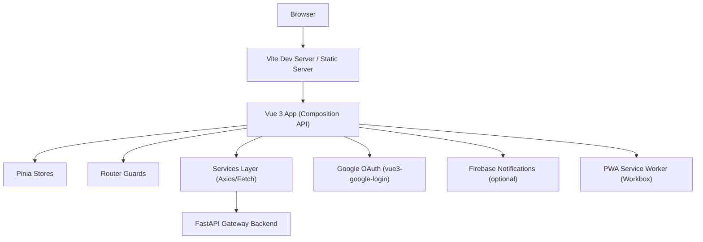
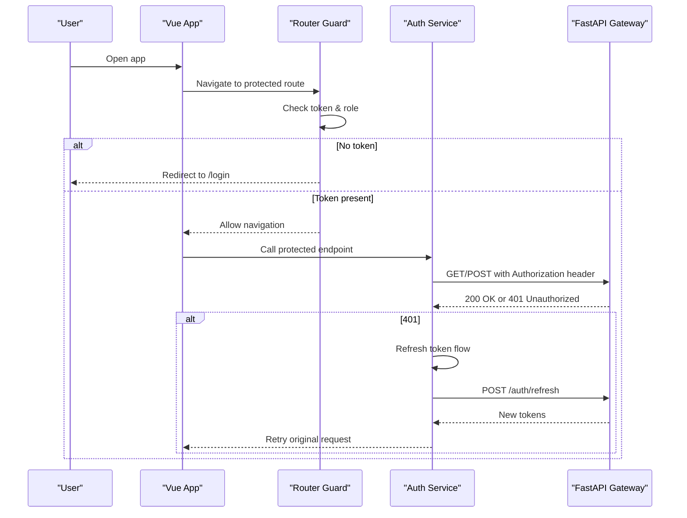
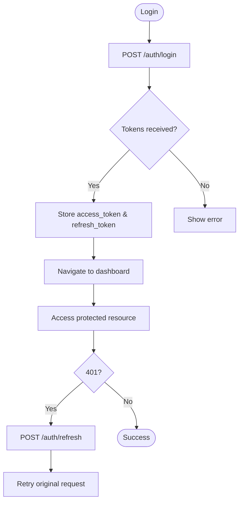
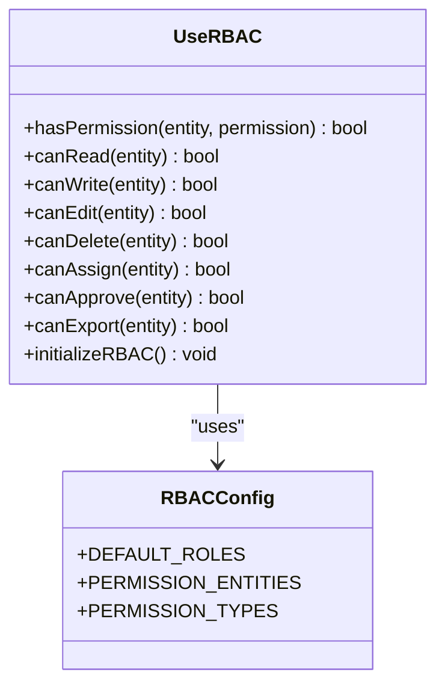
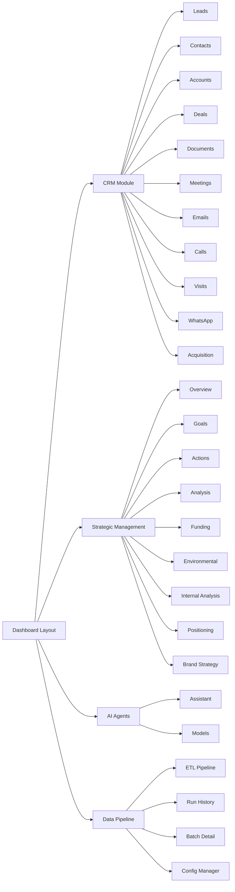
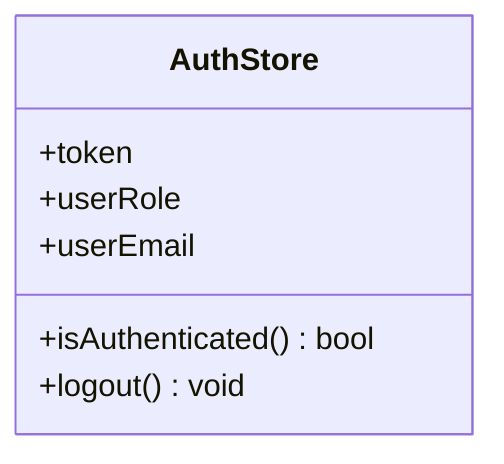
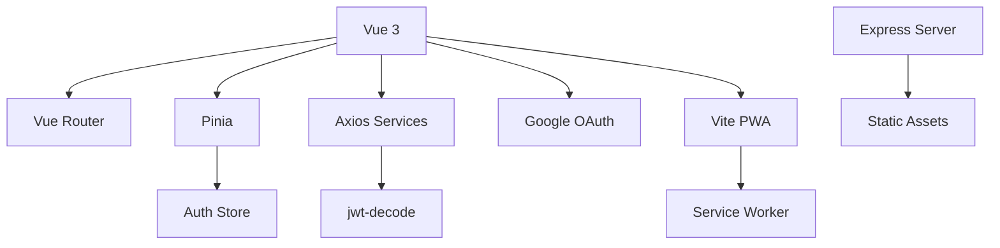

# Architecture Overview

<cite>
**Referenced Files in This Document**
- [main.js](file://src/main.js)
- [vite.config.js](file://vite.config.js)
- [Dockerfile](file://Dockerfile)
- [server.js](file://server.js)
- [app.yaml](file://app.yaml)
- [cloudbuild.yaml](file://cloudbuild.yaml)
- [package.json](file://package.json)
- [router/index.js](file://src/router/index.js)
- [services/api.js](file://src/services/api.js)
- [services/auth_api.js](file://src/services/auth_api.js)
- [services/decodeJWT.js](file://src/services/decodeJWT.js)
- [stores/auth.js](file://src/stores/auth.js)
- [config/rbac.js](file://src/config/rbac.js)
- [composables/useRBAC.js](file://src/composables/useRBAC.js)
- [config/moduleCards.js](file://src/config/moduleCards.js)
</cite>

## Table of Contents
1. Introduction
2. Project Structure
3. Core Components
4. Architecture Overview
5. Detailed Component Analysis
6. Dependency Analysis
7. Performance Considerations
8. Troubleshooting Guide
9. Conclusion

## Introduction
This document describes the ABSA Foundry Frontend architecture, a Vue 3 application built with the Composition API and Pinia state management. It follows a service-oriented pattern to communicate with a FastAPI Gateway backend, supports modular features (CRM, strategic management, AI agents, data pipeline), and integrates external services such as Google OAuth and Firebase notifications. The system is containerized for air-gapped deployments and can be deployed on Google App Engine or other cloud platforms. Security relies on JWT-based authentication with role-based access control (RBAC) enforced both at the router level and within components via composables.

## Project Structure
The frontend is organized into feature-focused directories:
- src/components: reusable UI and layout components
- src/views: page-level components grouped by modules (CRM, strategic, AI agents, data pipeline, settings)
- src/services: HTTP clients and domain-specific API wrappers
- src/stores: Pinia stores for global state (auth, dashboard, ETL, etc.)
- src/composables: shared logic (RBAC, network status, export, etc.)
- src/config: RBAC definitions, module cards, preferences
- src/router: route definitions and guards
- Public assets and PWA configuration are managed via Vite and manifest files

**Diagram sources**
- [main.js:70-101](file://src/main.js#L70-L101)
- [vite.config.js:11-35](file://vite.config.js#L11-L35)
- [router/index.js:201-272](file://src/router/index.js#L201-L272)
- [services/api.js:64-146](file://src/services/api.js#L64-L146)

**Section sources**
- [main.js:70-101](file://src/main.js#L70-L101)
- [vite.config.js:11-35](file://vite.config.js#L11-L35)
- [router/index.js:201-272](file://src/router/index.js#L201-L272)

## Core Components
- Application bootstrap: initializes Pinia, Vue Router, Google OAuth, Toast notifications, and PWA registration. Sets up global directives and icon components.
- Routing and guards: centralizes authentication and subscription checks; enforces module access based on roles and local cache.
- Services layer: centralized Axios client with request/response interceptors for token injection and automatic refresh on 401; dedicated auth API wrapper for login/refresh/logout.
- State management: Pinia store for auth state (token, role, email) with logout action that clears persisted tokens.
- RBAC: composable provides permission checks, role fetching from backend, organization management, and UI preference handling.

**Section sources**
- [main.js:70-101](file://src/main.js#L70-L101)
- [router/index.js:201-272](file://src/router/index.js#L201-L272)
- [services/api.js:64-146](file://src/services/api.js#L64-L146)
- [services/auth_api.js:30-143](file://src/services/auth_api.js#L30-L143)
- [stores/auth.js:1-22](file://src/stores/auth.js#L1-L22)
- [composables/useRBAC.js:55-137](file://src/composables/useRBAC.js#L55-L137)

## Architecture Overview
High-level design:
- Client-side: Vue 3 app with Composition API, Pinia stores, and service layer using Axios and fetch.
- Backend integration: FastAPI Gateway endpoints under /auth and module-specific routes; JWT access and refresh tokens.
- External integrations: Google OAuth via vue3-google-login; optional Firebase notifications.
- Deployment: Docker image builds static assets and serves them via Express; Google App Engine handler config for SPA routing; Cloud Build pipeline automates build and deploy.

**Diagram sources**
- [router/index.js:201-272](file://src/router/index.js#L201-L272)
- [services/api.js:64-146](file://src/services/api.js#L64-L146)
- [services/auth_api.js:30-143](file://src/services/auth_api.js#L30-L143)

## Detailed Component Analysis

### Authentication Flow and Token Management
- Login: credentials sent to /auth/login; access_token and refresh_token stored in localStorage.
- Interceptors: Axios automatically attaches Authorization headers; response interceptor handles 401 by refreshing tokens and retrying requests.
- Logout: clears tokens and redirects to root.
- JWT decoding: decodeJWT utility extracts user role/email/name and validates expiration.

**Diagram sources**
- [services/auth_api.js:30-143](file://src/services/auth_api.js#L30-L143)
- [services/api.js:64-146](file://src/services/api.js#L64-L146)
- [services/decodeJWT.js:11-58](file://src/services/decodeJWT.js#L11-L58)

**Section sources**
- [services/auth_api.js:30-143](file://src/services/auth_api.js#L30-L143)
- [services/api.js:64-146](file://src/services/api.js#L64-L146)
- [services/decodeJWT.js:11-58](file://src/services/decodeJWT.js#L11-L58)

### Role-Based Access Control (RBAC)
- Central RBAC configuration defines entities, permissions, and default roles.
- useRBAC composable exposes permission checks (read/write/edit/delete/assign/approve/export) and admin helpers.
- Router guard enforces module access based on roles and subscription flags; allows universal routes like profile/settings/portfolio.
- Tenant roles and UI preferences are fetched from backend and applied dynamically.

**Diagram sources**
- [composables/useRBAC.js:55-137](file://src/composables/useRBAC.js#L55-L137)
- [config/rbac.js:85-337](file://src/config/rbac.js#L85-L337)

**Section sources**
- [composables/useRBAC.js:55-137](file://src/composables/useRBAC.js#L55-L137)
- [config/rbac.js:85-337](file://src/config/rbac.js#L85-L337)
- [router/index.js:201-272](file://src/router/index.js#L201-L272)

### Module Architecture (CRM, Strategic, AI Agents, Data Pipeline)
- Routes define subpages for CRM (leads, contacts, accounts, deals, documents, meetings, emails, calls, visits, whatsapp, acquisition), strategic management (overview, goals, actions, analysis, funding, environmental, internal-analysis, positioning, brand), AI agents (assistant, models), and data pipeline (ETL pipeline, run history, batch detail, config manager).
- Module cards and sidebar items provide navigation and subscription gating.

**Diagram sources**
- [router/index.js:104-168](file://src/router/index.js#L104-L168)
- [config/moduleCards.js:13-51](file://src/config/moduleCards.js#L13-L51)

**Section sources**
- [router/index.js:104-168](file://src/router/index.js#L104-L168)
- [config/moduleCards.js:13-51](file://src/config/moduleCards.js#L13-L51)

### State Management (Pinia)
- Auth store holds token, role, and email; provides isAuthenticated getter and logout action that clears persisted tokens.
- Other stores exist for dashboard, ETL, intelligence, models, prediction, UI, and navigation, enabling modular state per feature.

**Diagram sources**
- [stores/auth.js:1-22](file://src/stores/auth.js#L1-L22)

**Section sources**
- [stores/auth.js:1-22](file://src/stores/auth.js#L1-L22)

### Integration Points (Google OAuth, Firebase)
- Google OAuth: configured globally via vue3-google-login with client ID from environment variables.
- Firebase notifications: imported and registered conditionally; PWA service worker manages offline capabilities and updates.

**Section sources**
- [main.js:78-82](file://src/main.js#L78-L82)
- [main.js:18-20](file://src/main.js#L18-L20)
- [vite.config.js:11-35](file://vite.config.js#L11-L35)

## Dependency Analysis
Key dependencies and their roles:
- Vue 3, Vue Router 4, Pinia: core framework, routing, and state management.
- Axios: HTTP client with interceptors for auth and token refresh.
- jwt-decode: decodes JWT payloads for role and user info.
- vue3-google-login: Google OAuth integration.
- firebase: optional notifications and auth compatibility.
- vite-plugin-pwa: service worker generation and caching strategies.
- express, compression, serve-static: production server for serving static assets and SPA fallback.

**Diagram sources**
- [package.json:13-63](file://package.json#L13-L63)
- [vite.config.js:11-35](file://vite.config.js#L11-L35)
- [server.js:1-70](file://server.js#L1-L70)

**Section sources**
- [package.json:13-63](file://package.json#L13-L63)
- [vite.config.js:11-35](file://vite.config.js#L11-L35)
- [server.js:1-70](file://server.js#L1-L70)

## Performance Considerations
- Asset caching: index.html served with no-cache; static assets cached aggressively with content hashing for cache-busting.
- Compression: gzip enabled via compression middleware.
- PWA: Workbox injects manifest and caches assets; maximum file size limit set to avoid oversized caches.
- Build optimizations: Vite targets esnext; minification disabled in current config for debugging; module preload disabled; CSS code splitting disabled.
- Network efficiency: Axios interceptors reduce redundant auth failures by refreshing tokens and retrying once.

[No sources needed since this section provides general guidance]

## Troubleshooting Guide
Common issues and resolutions:
- 401 Unauthorized: ensure access_token exists; if missing, verify login flow and token storage; interceptor will attempt refresh using refresh_token; if refresh fails, user is redirected to login.
- Token expired: decodeJWT checks expiration; on expiry, logs out and clears tokens.
- Route access denied: router guard checks requiresAuth and module subscriptions; ensure role and allowedModules are correctly set.
- PWA not updating: check version.json polling and service worker update hooks; dev bypass disables SW registration.

**Section sources**
- [services/api.js:64-146](file://src/services/api.js#L64-L146)
- [services/decodeJWT.js:11-58](file://src/services/decodeJWT.js#L11-L58)
- [router/index.js:201-272](file://src/router/index.js#L201-L272)
- [main.js:105-122](file://src/main.js#L105-L122)

## Conclusion
The ABSA Foundry Frontend employs a modern, modular architecture leveraging Vue 3 Composition API, Pinia, and a robust service layer communicating with a FastAPI Gateway. RBAC ensures secure, role-based access across CRM, strategic management, AI agents, and data pipeline modules. The system supports Google OAuth and Firebase notifications, offers PWA capabilities, and is packaged for containerized deployment with clear paths to cloud platforms. Scalability and performance are addressed through efficient caching, compression, and token refresh strategies, while security is enforced via JWT and comprehensive access controls.