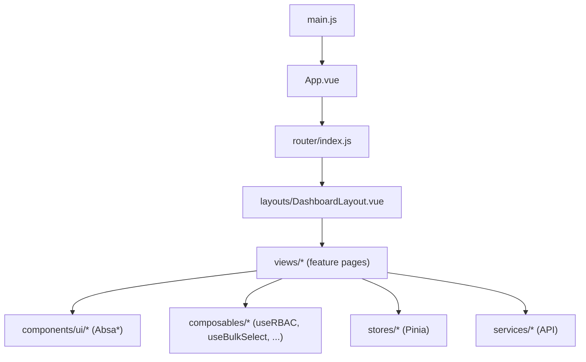
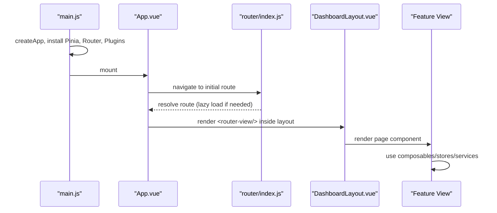
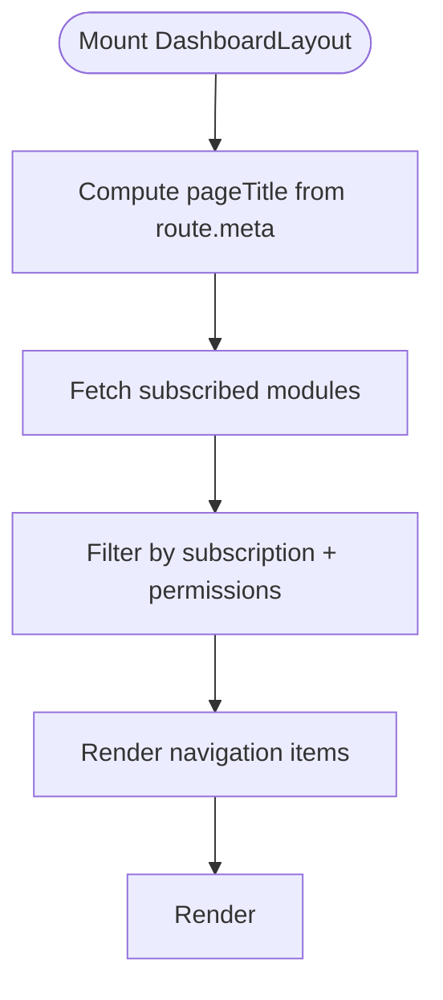
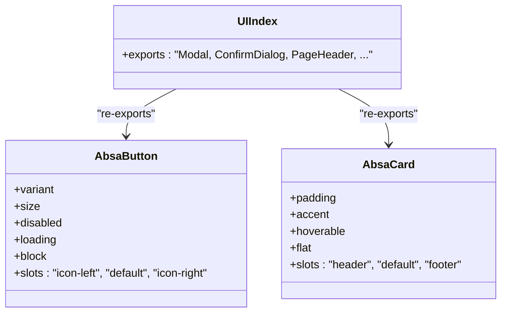
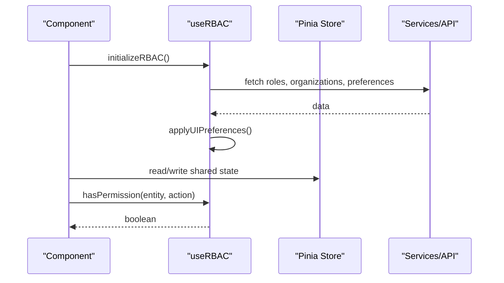
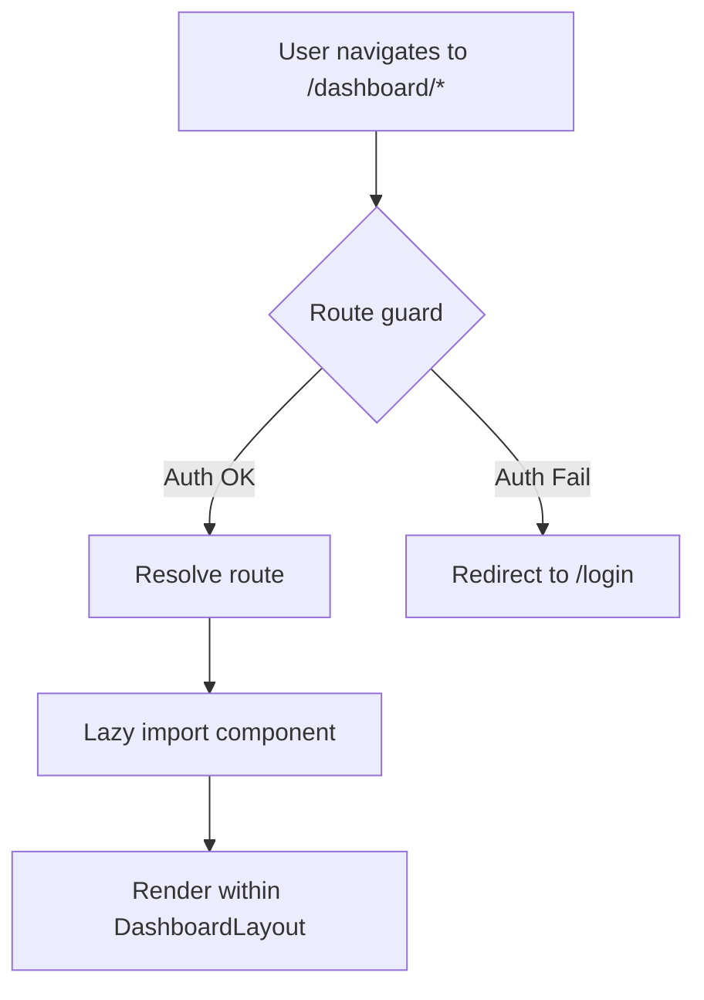
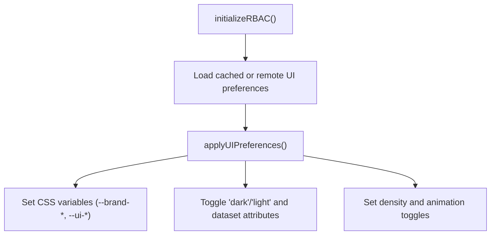
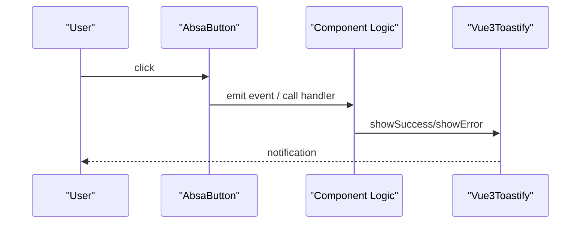
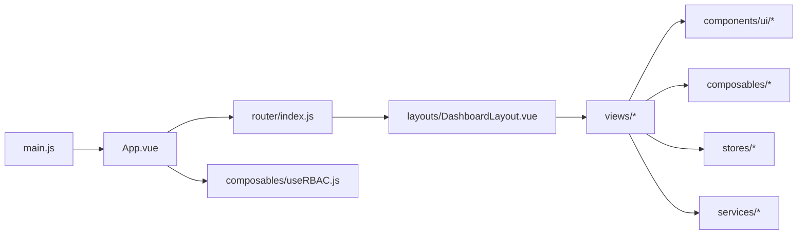

# Component Architecture

<cite>
**Referenced Files in This Document**
- [main.js](file://src/main.js)
- [App.vue](file://src/App.vue)
- [index.js](file://src/router/index.js)
- [DashboardLayout.vue](file://src/components/layouts/DashboardLayout.vue)
- [AbsaButton.vue](file://src/components/ui/AbsaButton.vue)
- [AbsaCard.vue](file://src/components/ui/AbsaCard.vue)
- [index.js](file://src/components/ui/index.js)
- [useRBAC.js](file://src/composables/useRBAC.js)
- [useBulkSelect.js](file://src/composables/useBulkSelect.js)
- [moduleCards.js](file://src/config/moduleCards.js)
</cite>

## Table of Contents
1. Introduction
2. Project Structure
3. Core Components
4. Architecture Overview
5. Detailed Component Analysis
6. Dependency Analysis
7. Performance Considerations
8. Troubleshooting Guide
9. Conclusion

## Introduction
This document explains the component architecture of the ABSA Foundry Frontend with a focus on:
- Hierarchical structure: layout components, UI primitives, and feature modules
- Composition patterns using Vue 3 Composition API
- Prop drilling alternatives via composables and stores
- Event handling strategies
- Design system implementation with reusable Absa* components, theme customization, and responsive design
- Lifecycle management, state sharing, and performance techniques such as lazy loading and code splitting

## Project Structure
The application is organized into clear layers:
- Application bootstrap and global configuration
- Routing and navigation
- Layouts that wrap authenticated views
- A shared UI library (Absa* components)
- Feature-specific modules under views/Modules
- Composables for cross-cutting concerns (RBAC, bulk selection, network status, etc.)
- Stores for shared state (Pinia)
- Services for API integration

**Diagram sources**
- [main.js:70-125](file://src/main.js#L70-L125)
- [App.vue:90-198](file://src/App.vue#L90-L198)
- [index.js:196-274](file://src/router/index.js#L196-L274)
- [DashboardLayout.vue:1-96](file://src/components/layouts/DashboardLayout.vue#L1-L96)

**Section sources**
- [main.js:70-125](file://src/main.js#L70-L125)
- [App.vue:90-198](file://src/App.vue#L90-L198)
- [index.js:196-274](file://src/router/index.js#L196-L274)

## Core Components
- Layouts: DashboardLayout provides the authenticated shell with header, navigation, and content area. It composes router-view to render feature pages.
- UI Primitives: AbsaButton and AbsaCard are foundational building blocks with consistent styling, variants, and slots. They are re-exported from a central index for easy consumption.
- Feature Modules: Views under views/Modules implement domain features (CRM, Strategic Management, AI Agents, Data Pipeline, Settings). These compose layouts, UI primitives, and composables.

Key responsibilities:
- App.vue initializes global services (preferences, RBAC, currency), handles PWA prompts, and renders the router outlet.
- main.js bootstraps the app, registers Pinia, router, plugins, icons, directives, and toast notifications.
- Router defines routes, lazy-loads heavy views, and enforces access control via guards.

**Section sources**
- [DashboardLayout.vue:1-96](file://src/components/layouts/DashboardLayout.vue#L1-L96)
- [AbsaButton.vue:1-101](file://src/components/ui/AbsaButton.vue#L1-L101)
- [AbsaCard.vue:1-90](file://src/components/ui/AbsaCard.vue#L1-L90)
- [index.js:1-22](file://src/components/ui/index.js#L1-L22)
- [App.vue:90-198](file://src/App.vue#L90-L198)
- [main.js:70-125](file://src/main.js#L70-L125)

## Architecture Overview
The frontend follows a layered architecture:
- Bootstrap layer: main.js creates the Vue app, installs Pinia, router, plugins, and global assets.
- Shell layer: App.vue orchestrates global initialization and renders the current route.
- Navigation layer: router/index.js defines routes, lazy loads feature views, and applies guards.
- Layout layer: DashboardLayout wraps authenticated routes and provides top-level chrome.
- Feature layer: Views implement business logic and compose UI primitives and composables.
- Shared utilities: composables encapsulate reusable logic; stores manage shared state; services handle API calls.

**Diagram sources**
- [main.js:70-125](file://src/main.js#L70-L125)
- [App.vue:90-198](file://src/App.vue#L90-L198)
- [index.js:196-274](file://src/router/index.js#L196-L274)
- [DashboardLayout.vue:1-96](file://src/components/layouts/DashboardLayout.vue#L1-L96)

## Detailed Component Analysis

### Layout Components
- DashboardLayout
  - Provides a fixed header with navigation menu, search, user info, and a content area rendering child routes.
  - Computes page title from route meta and derives user identity from JWT decoding.
  - Dynamically filters module visibility based on subscriptions and permissions.
  - Uses composables like useRBAC for permission checks and helpers for module lists.

**Diagram sources**
- [DashboardLayout.vue:111-196](file://src/components/layouts/DashboardLayout.vue#L111-L196)
- [DashboardLayout.vue:198-232](file://src/components/layouts/DashboardLayout.vue#L198-L232)

**Section sources**
- [DashboardLayout.vue:1-96](file://src/components/layouts/DashboardLayout.vue#L1-L96)
- [DashboardLayout.vue:111-232](file://src/components/layouts/DashboardLayout.vue#L111-L232)

### UI Primitives (Design System)
- AbsaButton
  - Variants: absa, power, hope, outline, ghost, energy, danger
  - Sizes: sm, md, lg
  - Supports loading state, block mode, and icon slots
  - Uses CSS variables for brand colors and Tailwind classes for layout and transitions

- AbsaCard
  - Accent bar at top with configurable color
  - Optional hoverable gradient overlay
  - Slots for header, default content, and footer
  - Configurable padding and flat style

- UI Index
  - Centralized exports for Modal, ConfirmDialog, PageHeader, KpiCard, BackButton, FullscreenToggle, ExportPreviewModal, EmptyState, BulkActionsBar, SelectAllCheckbox, DashboardWidgets, ArchiveBrowser, and all Absa* components

**Diagram sources**
- [AbsaButton.vue:23-101](file://src/components/ui/AbsaButton.vue#L23-L101)
- [AbsaCard.vue:38-90](file://src/components/ui/AbsaCard.vue#L38-L90)
- [index.js:1-22](file://src/components/ui/index.js#L1-L22)

**Section sources**
- [AbsaButton.vue:1-101](file://src/components/ui/AbsaButton.vue#L1-L101)
- [AbsaCard.vue:1-90](file://src/components/ui/AbsaCard.vue#L1-L90)
- [index.js:1-22](file://src/components/ui/index.js#L1-L22)

### Composables and State Sharing
- useRBAC
  - Provides role-based access control, permission checks, and UI preferences management
  - Initializes roles, organizations, and UI preferences; applies theme, fonts, radii, shadows, and density
  - Exposes computed flags (isAdmin, isSuperAdmin) and CRUD operations for roles and organizations

- useBulkSelect
  - Encapsulates selection state and actions for multi-select scenarios
  - Supports single select, range select (Shift+click), toggle all, and filtering

- Module Cards
  - Central definitions for dashboard modules, including IDs, titles, routes, and subscription flags
  - Used by layouts and routers to compute visible navigation and enforce access

**Diagram sources**
- [useRBAC.js:668-719](file://src/composables/useRBAC.js#L668-L719)
- [useRBAC.js:577-661](file://src/composables/useRBAC.js#L577-L661)
- [useBulkSelect.js:1-99](file://src/composables/useBulkSelect.js#L1-L99)
- [moduleCards.js:13-51](file://src/config/moduleCards.js#L13-L51)

**Section sources**
- [useRBAC.js:55-137](file://src/composables/useRBAC.js#L55-L137)
- [useRBAC.js:668-719](file://src/composables/useRBAC.js#L668-L719)
- [useBulkSelect.js:1-99](file://src/composables/useBulkSelect.js#L1-L99)
- [moduleCards.js:13-51](file://src/config/moduleCards.js#L13-L51)

### Routing and Lazy Loading
- Routes are defined centrally and use dynamic imports to split code per view
- Route guards enforce authentication and subscription/module access
- Layouts are applied to groups of routes (e.g., /dashboard/*)

**Diagram sources**
- [index.js:196-274](file://src/router/index.js#L196-L274)
- [index.js:1-194](file://src/router/index.js#L1-L194)

**Section sources**
- [index.js:196-274](file://src/router/index.js#L196-L274)
- [index.js:1-194](file://src/router/index.js#L1-L194)

### Theme Customization and Responsive Design
- Theme and UI preferences are managed by useRBAC.applyUIPreferences, which sets CSS variables and classes for dark/light mode, font family, scale, radii, elevation, pattern opacity, and visual style presets
- Brand colors are mapped to CSS variables consumed by Absa* components
- Responsive behavior is achieved via Tailwind utility classes across layouts and components

**Diagram sources**
- [useRBAC.js:577-661](file://src/composables/useRBAC.js#L577-L661)
- [useRBAC.js:668-719](file://src/composables/useRBAC.js#L668-L719)

**Section sources**
- [useRBAC.js:577-661](file://src/composables/useRBAC.js#L577-L661)
- [useRBAC.js:668-719](file://src/composables/useRBAC.js#L668-L719)

### Event Handling Strategies
- Buttons and interactive elements leverage native events and Vue’s event modifiers
- Global toast notifications are configured once in main.js and used throughout the app
- PWA install prompts are handled via callbacks in App.vue and a dedicated manager

**Diagram sources**
- [AbsaButton.vue:1-21](file://src/components/ui/AbsaButton.vue#L1-L21)
- [main.js:94-101](file://src/main.js#L94-L101)
- [App.vue:170-184](file://src/App.vue#L170-L184)

**Section sources**
- [AbsaButton.vue:1-21](file://src/components/ui/AbsaButton.vue#L1-L21)
- [main.js:94-101](file://src/main.js#L94-L101)
- [App.vue:170-184](file://src/App.vue#L170-L184)

## Dependency Analysis
- main.js depends on App.vue, router, Pinia, and global plugins
- App.vue depends on router, composables (usePreferences, useRBAC), and utilities (pwaManager, currencyService)
- DashboardLayout depends on router, JWT decoding, module cards, and RBAC
- UI components are independent and consume CSS variables and Tailwind classes
- Composables abstract cross-cutting concerns and reduce coupling between views and services

**Diagram sources**
- [main.js:70-125](file://src/main.js#L70-L125)
- [App.vue:90-198](file://src/App.vue#L90-L198)
- [index.js:196-274](file://src/router/index.js#L196-L274)
- [DashboardLayout.vue:1-96](file://src/components/layouts/DashboardLayout.vue#L1-L96)

**Section sources**
- [main.js:70-125](file://src/main.js#L70-L125)
- [App.vue:90-198](file://src/App.vue#L90-L198)
- [index.js:196-274](file://src/router/index.js#L196-L274)
- [DashboardLayout.vue:1-96](file://src/components/layouts/DashboardLayout.vue#L1-L96)

## Performance Considerations
- Code splitting and lazy loading:
  - Routes use dynamic imports to defer loading of feature views until needed
  - Reduces initial bundle size and improves first paint time
- Efficient rendering:
  - Use of computed properties for derived values (e.g., page title, filtered modules)
  - Avoid unnecessary re-renders by keeping state local where possible
- Network optimization:
  - Debounced or conditional API calls in composables
  - AbortController usage to cancel stale requests
- PWA and caching:
  - Service worker registration and periodic sync for background updates
  - Version checking to prompt refresh when new content is available

[No sources needed since this section provides general guidance]

## Troubleshooting Guide
- Authentication and routing issues:
  - Verify route guards and token presence; ensure decodeJWT returns expected claims
  - Check redirect logic for authenticated users attempting to access auth pages
- Permission errors:
  - Ensure useRBAC.initializeRBAC runs before permission checks
  - Validate tenant roles and permissions loaded from backend match expectations
- UI preference not applying:
  - Confirm applyUIPreferences is invoked and CSS variables are set on root element
  - Check localStorage cache for corrupted preferences
- PWA install prompt missing:
  - Ensure beforeinstallprompt is captured globally and pwaManager callbacks are wired
  - In dev bypass mode, service worker registration is skipped intentionally

**Section sources**
- [index.js:201-274](file://src/router/index.js#L201-L274)
- [useRBAC.js:668-719](file://src/composables/useRBAC.js#L668-L719)
- [App.vue:145-198](file://src/App.vue#L145-L198)
- [main.js:35-67](file://src/main.js#L35-L67)

## Conclusion
The ABSA Foundry Frontend employs a clean, layered architecture with:
- Clear separation of concerns across layouts, UI primitives, and feature modules
- Robust composition patterns using Vue 3 Composition API and Pinia for state
- A cohesive design system centered on Absa* components with theme customization
- Strong lifecycle management, efficient event handling, and performance optimizations through lazy loading and careful state design

[No sources needed since this section summarizes without analyzing specific files]