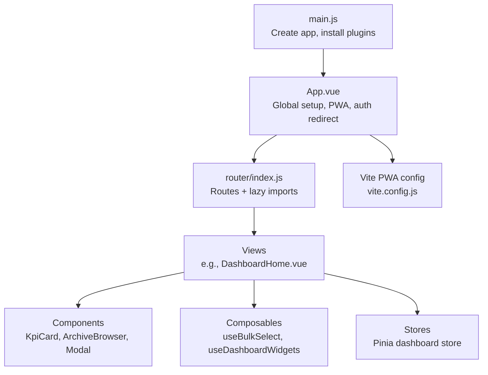
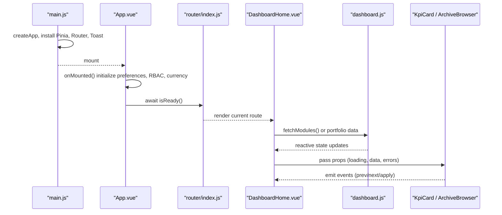
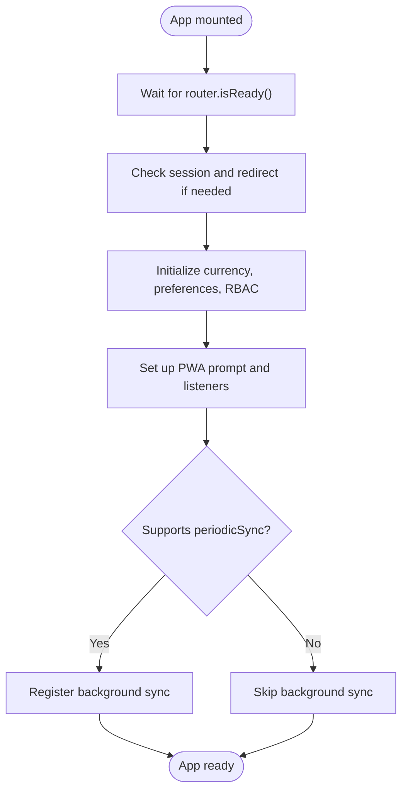
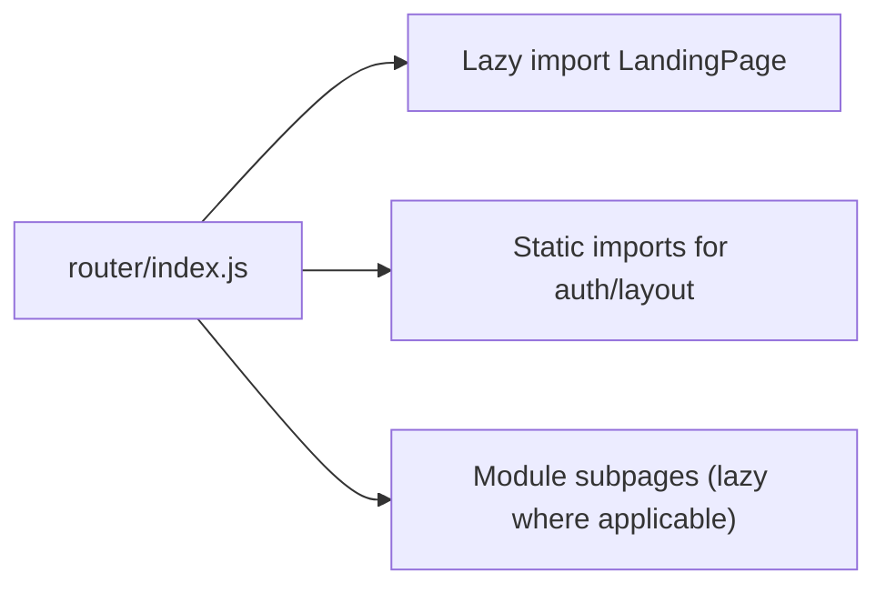
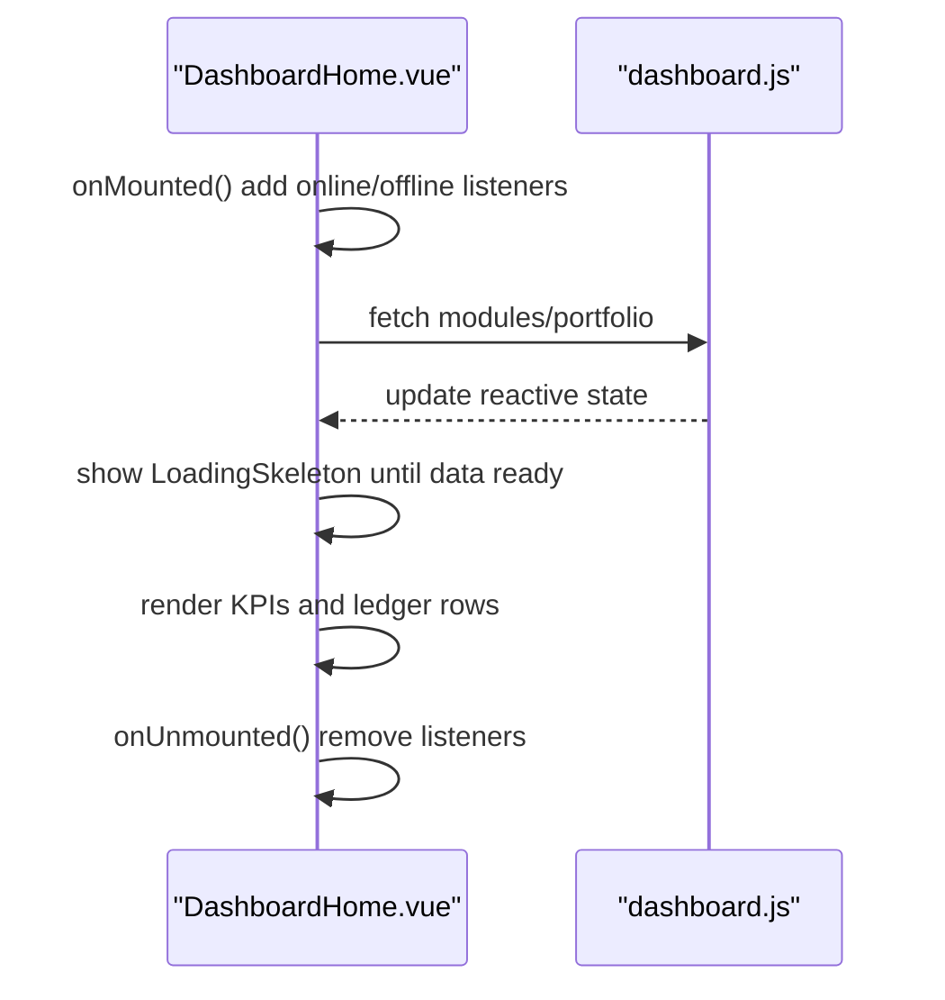
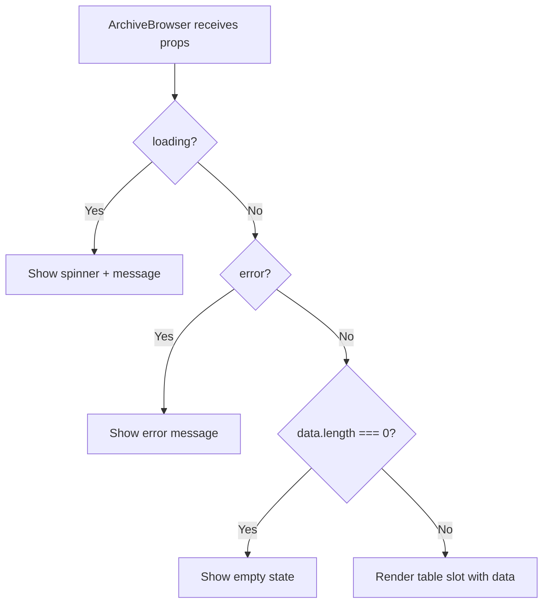
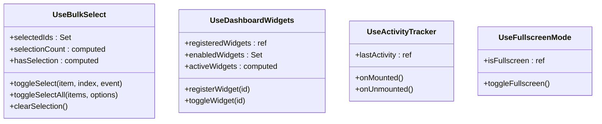
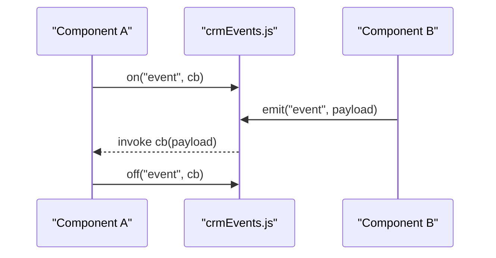
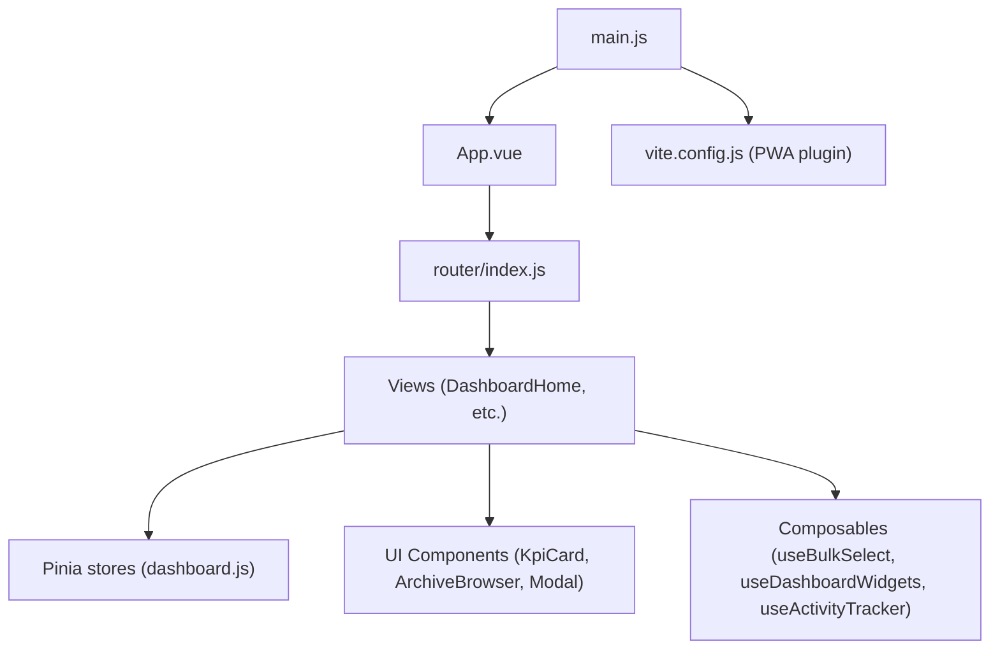

# Component Lifecycle & Performance

<cite>
**Referenced Files in This Document**
- [main.js](file://src/main.js)
- [App.vue](file://src/App.vue)
- [vite.config.js](file://vite.config.js)
- [package.json](file://package.json)
- [router/index.js](file://src/router/index.js)
- [DashboardHome.vue](file://src/views/DashboardHome.vue)
- [DashboardLayout.vue](file://src/components/layouts/DashboardLayout.vue)
- [ArchiveBrowser.vue](file://src/components/ui/ArchiveBrowser.vue)
- [LoadingSkeleton.vue](file://src/components/LoadingSkeleton.vue)
- [KpiCard.vue](file://src/components/ui/KpiCard.vue)
- [Modal.vue](file://src/components/ui/Modal.vue)
- [MlExplainPopover.vue](file://src/components/ui/MlExplainPopover.vue)
- [useActivityTracker.js](file://src/config/useActivityTracker.js)
- [useFullscreenMode.js](file://src/composables/useFullscreenMode.js)
- [useBulkSelect.js](file://src/composables/useBulkSelect.js)
- [useDashboardWidgets.js](file://src/composables/useDashboardWidgets.js)
- [useSettingsBase.js](file://src/composables/settings/useSettingsBase.js)
- [dashboard.js](file://src/stores/dashboard.js)
- [crmEvents.js](file://src/events/crmEvents.js)
</cite>

## Table of Contents
1. [Introduction](#introduction)
2. [Project Structure](#project-structure)
3. [Core Components](#core-components)
4. [Architecture Overview](#architecture-overview)
5. [Detailed Component Analysis](#detailed-component-analysis)
6. [Dependency Analysis](#dependency-analysis)
7. [Performance Considerations](#performance-considerations)
8. [Troubleshooting Guide](#troubleshooting-guide)
9. [Conclusion](#conclusion)
10. [Appendices](#appendices)

## Introduction
This document explains how the ABSA Foundry Frontend manages component lifecycles, reactive dependencies, and memory to deliver a performant Vue 3 application. It covers lifecycle hooks usage, computed properties, lazy loading and code splitting via Vite, rendering optimizations (skeletons, conditional rendering), error boundaries and graceful degradation patterns, efficient data binding, testing strategies, and debugging techniques for performance issues.

## Project Structure
The app is bootstrapped with Vue 3 and Vite, uses Pinia for state, Vue Router for navigation, and PWA capabilities. The root entry initializes plugins, global directives, and service worker registration. App-level logic handles session checks, preferences initialization, and PWA prompts. Views and components follow a shared vs scoped pattern to keep coupling low and enable tree-shaking.

**Diagram sources**
- [main.js:70-101](file://src/main.js#L70-L101)
- [App.vue:146-198](file://src/App.vue#L146-L198)
- [router/index.js:1-26](file://src/router/index.js#L1-L26)
- [vite.config.js:7-39](file://vite.config.js#L7-L39)

**Section sources**
- [main.js:1-129](file://src/main.js#L1-L129)
- [App.vue:1-293](file://src/App.vue#L1-L293)
- [vite.config.js:1-41](file://vite.config.js#L1-L41)
- [package.json:1-90](file://package.json#L1-L90)

## Core Components
Key building blocks that demonstrate lifecycle, reactivity, and performance patterns:

- KpiCard: Uses computed formatting, conditional skeleton during loading, and router-based navigation without tight coupling.
- ArchiveBrowser: Presents loading, error, empty, and data states; emits events for pagination/filtering to keep it reusable.
- LoadingSkeleton: Provides consistent placeholder UI while data loads, reducing layout shifts and perceived latency.
- Modal: Manages focus trapping, keyboard handling, and cleanup on unmount to prevent memory leaks.
- MlExplainPopover: Demonstrates event listener lifecycle management (add/remove) and click-outside behavior.

**Section sources**
- [KpiCard.vue:1-130](file://src/components/ui/KpiCard.vue#L1-L130)
- [ArchiveBrowser.vue:1-75](file://src/components/ui/ArchiveBrowser.vue#L1-L75)
- [LoadingSkeleton.vue:1-96](file://src/components/LoadingSkeleton.vue#L1-L96)
- [Modal.vue:168-217](file://src/components/ui/Modal.vue#L168-L217)
- [MlExplainPopover.vue:138-158](file://src/components/ui/MlExplainPopover.vue#L138-L158)

## Architecture Overview
The runtime flow integrates app bootstrap, route transitions, view data fetching, and component rendering with robust lifecycle and cleanup.

**Diagram sources**
- [main.js:70-101](file://src/main.js#L70-L101)
- [App.vue:146-198](file://src/App.vue#L146-L198)
- [router/index.js:1-26](file://src/router/index.js#L1-L26)
- [dashboard.js:5-28](file://src/stores/dashboard.js#L5-L28)
- [DashboardHome.vue:707-723](file://src/views/DashboardHome.vue#L707-L723)

## Detailed Component Analysis

### App-level lifecycle and global setup
- Initializes Pinia, Router, toast, and optional service worker based on dev flags.
- On mount, waits for router readiness, checks sessions, initializes preferences and RBAC, sets up PWA callbacks, and registers periodic sync when available. Cleans up timers on unmount.

**Diagram sources**
- [App.vue:146-198](file://src/App.vue#L146-L198)

**Section sources**
- [App.vue:90-241](file://src/App.vue#L90-L241)
- [main.js:23-67](file://src/main.js#L23-L67)

### Route-level lazy loading and code splitting
- The router uses dynamic imports for pages to split bundles and reduce initial load. This ensures heavy views are only loaded when navigated to.

**Diagram sources**
- [router/index.js:1-26](file://src/router/index.js#L1-L26)

**Section sources**
- [router/index.js:1-26](file://src/router/index.js#L1-L26)

### Dashboard page lifecycle and data flow
- On mount, listens for online/offline events, fetches data, and schedules periodic checks. On unmount, removes listeners to avoid leaks. Displays skeletons while loading, then renders KPIs and tables bound to store state.

**Diagram sources**
- [DashboardHome.vue:707-723](file://src/views/DashboardHome.vue#L707-L723)
- [dashboard.js:5-28](file://src/stores/dashboard.js#L5-L28)

**Section sources**
- [DashboardHome.vue:1-200](file://src/views/DashboardHome.vue#L1-L200)
- [DashboardHome.vue:589-623](file://src/views/DashboardHome.vue#L589-L623)
- [DashboardHome.vue:707-723](file://src/views/DashboardHome.vue#L707-L723)
- [dashboard.js:1-29](file://src/stores/dashboard.js#L1-L29)

### Reusable UI components: loading, error, and empty states
- ArchiveBrowser centralizes loading/error/empty/data states and pagination controls, emitting events upward to keep it decoupled.
- LoadingSkeleton provides consistent placeholders to improve perceived performance and reduce layout shift.

**Diagram sources**
- [ArchiveBrowser.vue:1-75](file://src/components/ui/ArchiveBrowser.vue#L1-L75)
- [LoadingSkeleton.vue:1-96](file://src/components/LoadingSkeleton.vue#L1-L96)

**Section sources**
- [ArchiveBrowser.vue:1-75](file://src/components/ui/ArchiveBrowser.vue#L1-L75)
- [LoadingSkeleton.vue:1-96](file://src/components/LoadingSkeleton.vue#L1-L96)

### Composables: reactive state and memory-safe patterns
- useBulkSelect: Uses ref(Set) for selected IDs and computed values for selection status; avoids unnecessary re-renders by mutating Sets and replacing refs atomically.
- useDashboardWidgets: Tracks enabled widgets with Set, persists changes, and exposes computed active list.
- useActivityTracker: Adds window event listeners on mount and clears them on unmount; throttles heartbeats to reduce network churn.
- useFullscreenMode: Toggles a class on the document root based on reactive state.

**Diagram sources**
- [useBulkSelect.js:1-99](file://src/composables/useBulkSelect.js#L1-L99)
- [useDashboardWidgets.js:46-87](file://src/composables/useDashboardWidgets.js#L46-L87)
- [useActivityTracker.js:1-58](file://src/config/useActivityTracker.js#L1-L58)
- [useFullscreenMode.js:1-28](file://src/composables/useFullscreenMode.js#L1-L28)

**Section sources**
- [useBulkSelect.js:1-99](file://src/composables/useBulkSelect.js#L1-L99)
- [useDashboardWidgets.js:46-87](file://src/composables/useDashboardWidgets.js#L46-L87)
- [useActivityTracker.js:1-58](file://src/config/useActivityTracker.js#L1-L58)
- [useFullscreenMode.js:1-28](file://src/composables/useFullscreenMode.js#L1-L28)

### Event bus for module-scoped communication
- A lightweight event bus enables decoupled communication within the CRM module, with safe listener removal to prevent leaks.

**Diagram sources**
- [crmEvents.js:1-30](file://src/events/crmEvents.js#L1-L30)

**Section sources**
- [crmEvents.js:1-30](file://src/events/crmEvents.js#L1-L30)

## Dependency Analysis
High-level dependency relationships across layers:

**Diagram sources**
- [main.js:70-101](file://src/main.js#L70-L101)
- [App.vue:146-198](file://src/App.vue#L146-L198)
- [router/index.js:1-26](file://src/router/index.js#L1-L26)
- [dashboard.js:5-28](file://src/stores/dashboard.js#L5-L28)
- [vite.config.js:7-39](file://vite.config.js#L7-L39)

**Section sources**
- [main.js:70-101](file://src/main.js#L70-L101)
- [App.vue:146-198](file://src/App.vue#L146-L198)
- [router/index.js:1-26](file://src/router/index.js#L1-L26)
- [dashboard.js:5-28](file://src/stores/dashboard.js#L5-L28)
- [vite.config.js:7-39](file://vite.config.js#L7-L39)

## Performance Considerations
- Lazy loading and code splitting:
  - Router-level dynamic imports defer heavy views until navigation.
  - Vite build configuration disables minification in this config; consider enabling in production builds for smaller payloads.
- Skeleton screens and conditional rendering:
  - Show LoadingSkeleton while data is loading to reduce layout shifts and improve perceived performance.
  - Use v-if/v-else chains to render only necessary branches (loading, error, empty, data).
- Reactive efficiency:
  - Prefer computed properties for derived values (e.g., formatted numbers, filtered lists).
  - Use Set for membership checks and batch mutations to minimize re-renders.
- Memory management:
  - Always remove event listeners and clear intervals/timers in onUnmounted/onBeforeUnmount.
  - Avoid long-lived closures over large objects; prefer refs and stores for shared state.
- Network optimization:
  - Debounce/throttle frequent actions (e.g., activity heartbeat) to reduce requests.
  - Use stores to centralize data fetching and caching at the module level.
- PWA and offline considerations:
  - Service worker registration and periodic sync are conditionally applied based on environment and browser support.

[No sources needed since this section provides general guidance]

## Troubleshooting Guide
Common issues and how to address them:

- Stale event listeners causing memory leaks:
  - Ensure all window/document event listeners added in onMounted are removed in onUnmounted.
  - Example patterns:
    - Online/offline listeners in views.
    - Global click handlers in popovers/modals.
- Unnecessary re-renders:
  - Replace object/array references with primitives or stable keys where possible.
  - Use computed properties for expensive derivations and memoized results.
- Excessive network calls:
  - Consolidate requests in stores and cache responses.
  - Throttle periodic tasks (e.g., heartbeat) and guard with activity windows.
- Error states not surfaced:
  - Provide explicit error branches in templates and allow retry actions.
  - Centralize error logging and user feedback via toast or banners.

**Section sources**
- [DashboardHome.vue:707-723](file://src/views/DashboardHome.vue#L707-L723)
- [MlExplainPopover.vue:138-158](file://src/components/ui/MlExplainPopover.vue#L138-L158)
- [Modal.vue:168-217](file://src/components/ui/Modal.vue#L168-L217)
- [useActivityTracker.js:1-58](file://src/config/useActivityTracker.js#L1-L58)

## Conclusion
The ABSA Foundry Frontend applies Vue 3 best practices to manage lifecycle, reactivity, and memory efficiently. Lazy routing, skeleton-driven UX, computed properties, and careful cleanup ensure responsive performance. Stores and composables encapsulate business logic and side effects, while UI components remain focused on presentation and interaction. Adopting these patterns consistently across the codebase will sustain scalability and maintainability.

[No sources needed since this section summarizes without analyzing specific files]

## Appendices

### Testing Strategies
- Unit tests for composables and utilities:
  - Test reactive state transitions and computed outputs using Vue Test Utils and Vitest.
  - Mock external services (APIs, localStorage) to isolate logic.
- Component tests:
  - Render components with minimal props, assert loading/error/empty states.
  - Interact with events (e.g., prev/next in ArchiveBrowser) and verify emitted events.
- Store tests:
  - Validate async fetch flows and state mutations in Pinia stores.

[No sources needed since this section provides general guidance]

### Debugging Techniques for Performance Issues
- Use browser DevTools Performance tab to identify long tasks and excessive re-renders.
- Leverage Vue DevTools to inspect component trees, reactive dependencies, and computed caches.
- Add timing logs around heavy operations and network calls to pinpoint bottlenecks.
- Monitor memory snapshots to detect leaks from lingering listeners or closures.

[No sources needed since this section provides general guidance]