# Composition Patterns & State Management

<cite>
**Referenced Files in This Document**
- [useBulkSelect.js](file://src/composables/useBulkSelect.js)
- [useConfirmDialog.js](file://src/composables/useConfirmDialog.js)
- [useCurrency.js](file://src/composables/useCurrency.js)
- [useDashboardWidgets.js](file://src/composables/useDashboardWidgets.js)
- [useDataArchive.js](file://src/composables/useDataArchive.js)
- [useExport.js](file://src/composables/useExport.js)
- [useFullscreenMode.js](file://src/composables/useFullscreenMode.js)
- [useNetworkStatus.js](file://src/composables/useNetworkStatus.js)
- [useRBAC.js](file://src/composables/useRBAC.js)
- [usePwaInstall.js](file://src/composables/usePwaInstall.js)
- [auth.js](file://src/stores/auth.js)
- [dashboard.js](file://src/stores/dashboard.js)
- [ui.js](file://src/stores/ui.js)
- [DashboardHome.vue](file://src/views/DashboardHome.vue)
- [BulkActionsBar.vue](file://src/components/ui/BulkActionsBar.vue)
- [coding-standards.md](file://.ai/coding-standards.md)
</cite>

## Table of Contents
1. [Introduction](#introduction)
2. [Project Structure](#project-structure)
3. [Core Components](#core-components)
4. [Architecture Overview](#architecture-overview)
5. [Detailed Component Analysis](#detailed-component-analysis)
6. [Dependency Analysis](#dependency-analysis)
7. [Performance Considerations](#performance-considerations)
8. [Troubleshooting Guide](#troubleshooting-guide)
9. [Conclusion](#conclusion)

## Introduction
This document explains the Vue 3 Composition API patterns and state management strategies used in the ABSA Foundry Frontend. It focuses on:
- Composable functions for reusable business logic
- Reactive state sharing between components
- Event handling patterns
- Integration between composables and Pinia stores
- Data fetching, caching, error handling, and loading states
- Lifecycle management and performance optimization techniques

The goal is to provide a clear, practical guide for building consistent, maintainable features across the application.

## Project Structure
The codebase organizes shared logic into composable functions under src/composables and global reactive state into Pinia stores under src/stores. Views and UI components consume these abstractions to render interfaces and handle user interactions.

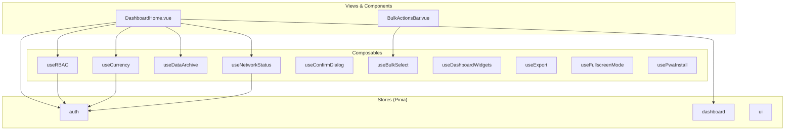

**Diagram sources**
- [useRBAC.js:55-130](file://src/composables/useRBAC.js#L55-L130)
- [useCurrency.js:18-54](file://src/composables/useCurrency.js#L18-L54)
- [useDataArchive.js:3-44](file://src/composables/useDataArchive.js#L3-L44)
- [useNetworkStatus.js:10-41](file://src/composables/useNetworkStatus.js#L10-L41)
- [useConfirmDialog.js:20-55](file://src/composables/useConfirmDialog.js#L20-L55)
- [useBulkSelect.js:3-97](file://src/composables/useBulkSelect.js#L3-L97)
- [useDashboardWidgets.js:24-86](file://src/composables/useDashboardWidgets.js#L24-L86)
- [useExport.js:4-33](file://src/composables/useExport.js#L4-L33)
- [useFullscreenMode.js:5-27](file://src/composables/useFullscreenMode.js#L5-L27)
- [usePwaInstall.js:11-83](file://src/composables/usePwaInstall.js#L11-L83)
- [auth.js:3-21](file://src/stores/auth.js#L3-L21)
- [dashboard.js:5-28](file://src/stores/dashboard.js#L5-L28)
- [ui.js:3-20](file://src/stores/ui.js#L3-L20)
- [DashboardHome.vue:1-200](file://src/views/DashboardHome.vue#L1-L200)
- [BulkActionsBar.vue:1-47](file://src/components/ui/BulkActionsBar.vue#L1-L47)

**Section sources**
- [coding-standards.md:1-66](file://.ai/coding-standards.md#L1-L66)

## Core Components
Key composables encapsulate domain-specific behaviors and are consumed by views and components:
- useRBAC: Role-based access control, permissions, tenant roles, UI preferences
- useCurrency: Currency formatting, settings initialization, persistence
- useDataArchive: Paginated data fetching with search and date filters
- useNetworkStatus: Online/offline detection, sync status, auto-sync on reconnect
- useConfirmDialog: Centralized confirmation dialog lifecycle and callbacks
- useBulkSelect: Multi-select with range selection and computed selection state
- useDashboardWidgets: Widget registry, enable/disable, persistence
- useExport: Export preview modal and error handling via toast
- useFullscreenMode: Fullscreen mode toggle with DOM class toggling
- usePwaInstall: PWA install prompt handling and manual instructions fallback

These composables follow a consistent pattern:
- Encapsulate reactive state using ref/computed
- Expose methods to mutate state or trigger side effects
- Integrate with services, stores, and browser APIs
- Provide robust error handling and fallbacks

**Section sources**
- [useRBAC.js:55-130](file://src/composables/useRBAC.js#L55-L130)
- [useCurrency.js:18-54](file://src/composables/useCurrency.js#L18-L54)
- [useDataArchive.js:3-44](file://src/composables/useDataArchive.js#L3-L44)
- [useNetworkStatus.js:10-41](file://src/composables/useNetworkStatus.js#L10-L41)
- [useConfirmDialog.js:20-55](file://src/composables/useConfirmDialog.js#L20-L55)
- [useBulkSelect.js:3-97](file://src/composables/useBulkSelect.js#L3-L97)
- [useDashboardWidgets.js:24-86](file://src/composables/useDashboardWidgets.js#L24-L86)
- [useExport.js:4-33](file://src/composables/useExport.js#L4-L33)
- [useFullscreenMode.js:5-27](file://src/composables/useFullscreenMode.js#L5-L27)
- [usePwaInstall.js:11-83](file://src/composables/usePwaInstall.js#L11-L83)

## Architecture Overview
The architecture separates concerns:
- Composables own reusable logic and local reactive state
- Pinia stores manage cross-cutting app-wide state (auth, dashboard modules, UI actions)
- Views and components compose both to build feature-rich UIs

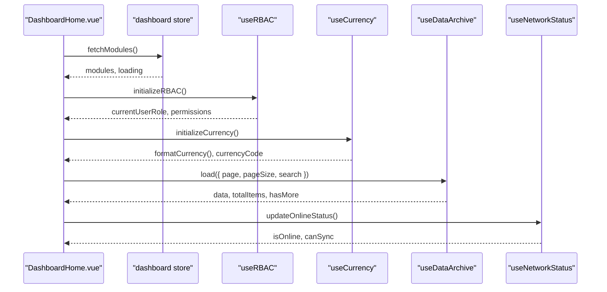

**Diagram sources**
- [dashboard.js:9-25](file://src/stores/dashboard.js#L9-L25)
- [useRBAC.js:668-719](file://src/composables/useRBAC.js#L668-L719)
- [useCurrency.js:24-54](file://src/composables/useCurrency.js#L24-L54)
- [useDataArchive.js:22-44](file://src/composables/useDataArchive.js#L22-L44)
- [useNetworkStatus.js:33-41](file://src/composables/useNetworkStatus.js#L33-L41)
- [DashboardHome.vue:1-200](file://src/views/DashboardHome.vue#L1-L200)

## Detailed Component Analysis

### useRBAC: Role-Based Access Control and UI Preferences
Responsibilities:
- Permission checks (read/write/edit/delete/assign/approve/export)
- Tenant role and organization management
- UI preferences application (theme, fonts, radii, density, animations)
- Initialization flow that loads defaults from localStorage and then fetches from API

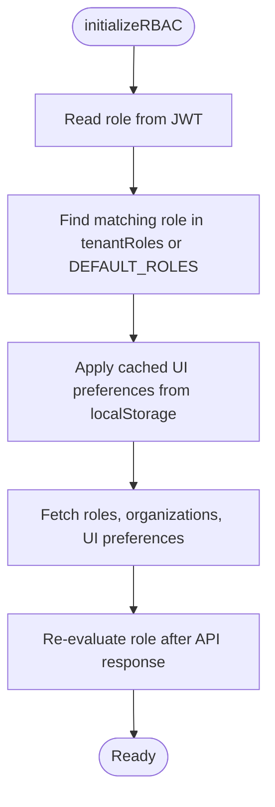

**Diagram sources**
- [useRBAC.js:668-719](file://src/composables/useRBAC.js#L668-L719)
- [useRBAC.js:495-523](file://src/composables/useRBAC.js#L495-L523)
- [useRBAC.js:577-661](file://src/composables/useRBAC.js#L577-L661)

**Section sources**
- [useRBAC.js:55-130](file://src/composables/useRBAC.js#L55-L130)
- [useRBAC.js:144-226](file://src/composables/useRBAC.js#L144-L226)
- [useRBAC.js:495-523](file://src/composables/useRBAC.js#L495-L523)
- [useRBAC.js:577-661](file://src/composables/useRBAC.js#L577-L661)
- [useRBAC.js:668-719](file://src/composables/useRBAC.js#L668-L719)

### useCurrency: Formatting, Settings, and Persistence
Responsibilities:
- Initialize currency service with fallbacks
- Format amounts and compact forms
- Parse formatted strings back to numbers
- Update and persist currency settings globally when no tenant context exists

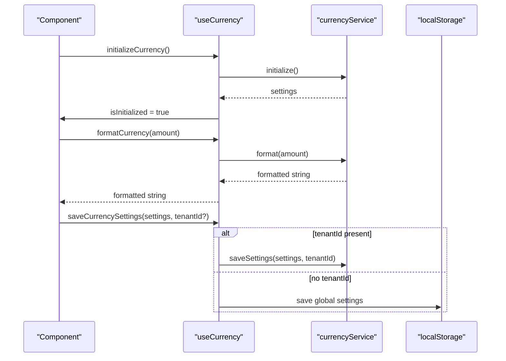

**Diagram sources**
- [useCurrency.js:24-54](file://src/composables/useCurrency.js#L24-L54)
- [useCurrency.js:63-76](file://src/composables/useCurrency.js#L63-L76)
- [useCurrency.js:156-177](file://src/composables/useCurrency.js#L156-L177)

**Section sources**
- [useCurrency.js:18-54](file://src/composables/useCurrency.js#L18-L54)
- [useCurrency.js:63-76](file://src/composables/useCurrency.js#L63-L76)
- [useCurrency.js:112-149](file://src/composables/useCurrency.js#L112-L149)
- [useCurrency.js:156-177](file://src/composables/useCurrency.js#L156-L177)

### useDataArchive: Paginated Data Fetching with Search and Filters
Responsibilities:
- Manage data, loading, error, pagination, and query parameters
- Provide methods to filter by date range and search text
- Compute derived state like totalPages, hasMore, hasPrevious

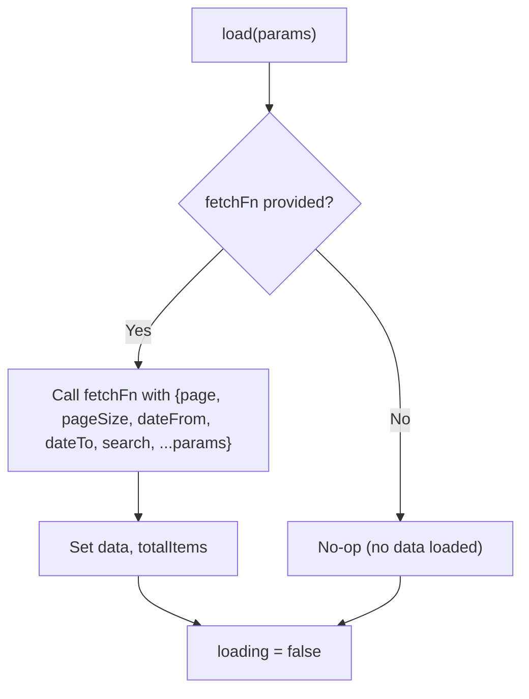

**Diagram sources**
- [useDataArchive.js:22-44](file://src/composables/useDataArchive.js#L22-L44)

**Section sources**
- [useDataArchive.js:3-44](file://src/composables/useDataArchive.js#L3-L44)
- [useDataArchive.js:46-76](file://src/composables/useDataArchive.js#L46-L76)

### useNetworkStatus: Online/Offline Detection and Sync Orchestration
Responsibilities:
- Track online/offline status and auto-sync on reconnect
- Aggregate pending operations from IndexedDB and sync manager
- Force sync with error tracking and last successful sync timestamps
- Show offline notifications and request notification permission

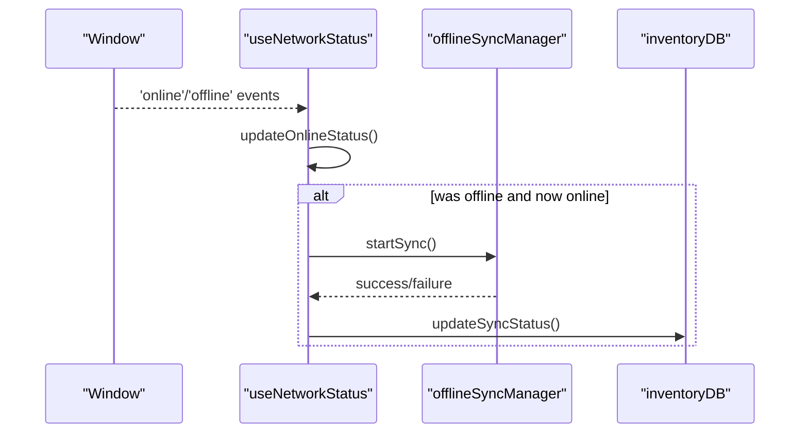

**Diagram sources**
- [useNetworkStatus.js:33-41](file://src/composables/useNetworkStatus.js#L33-L41)
- [useNetworkStatus.js:46-91](file://src/composables/useNetworkStatus.js#L46-L91)
- [useNetworkStatus.js:170-197](file://src/composables/useNetworkStatus.js#L170-L197)

**Section sources**
- [useNetworkStatus.js:10-41](file://src/composables/useNetworkStatus.js#L10-L41)
- [useNetworkStatus.js:46-91](file://src/composables/useNetworkStatus.js#L46-L91)
- [useNetworkStatus.js:96-161](file://src/composables/useNetworkStatus.js#L96-L161)
- [useNetworkStatus.js:170-227](file://src/composables/useNetworkStatus.js#L170-L227)

### useConfirmDialog: Centralized Confirmation Flow
Responsibilities:
- Open, cancel, and confirm actions with optional async handlers
- Support onError and onClose hooks
- Clear state safely after execution

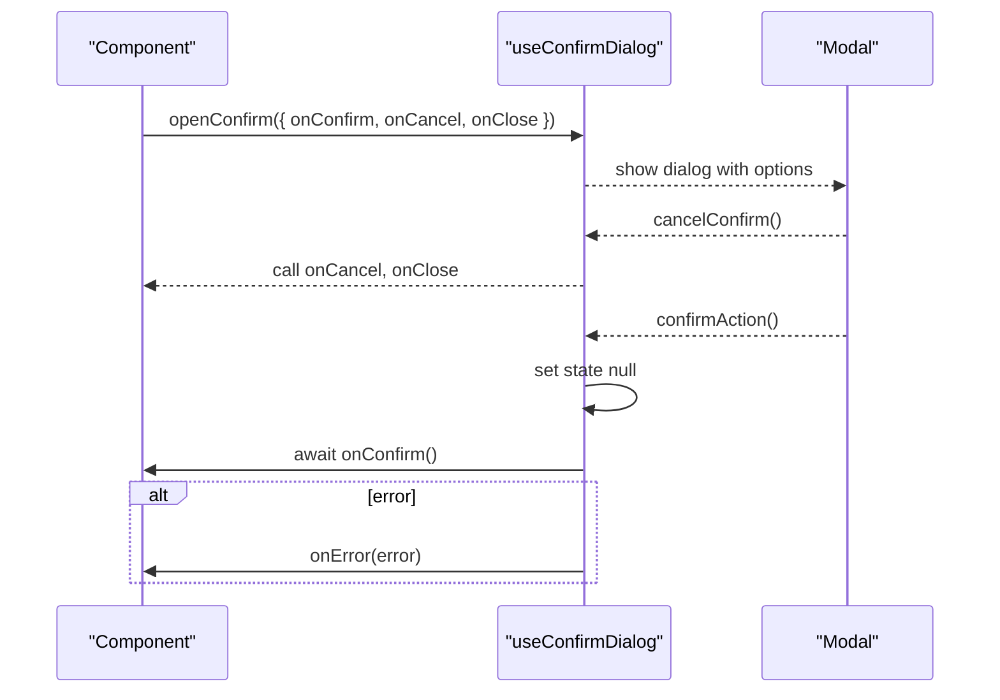

**Diagram sources**
- [useConfirmDialog.js:20-55](file://src/composables/useConfirmDialog.js#L20-L55)

**Section sources**
- [useConfirmDialog.js:20-55](file://src/composables/useConfirmDialog.js#L20-L55)

### useBulkSelect: Multi-Selection with Range Support
Responsibilities:
- Maintain selected IDs and last clicked index
- Compute selection count and presence
- Toggle single items, select all with filtering, and clear selection
- Retrieve selected items based on current list

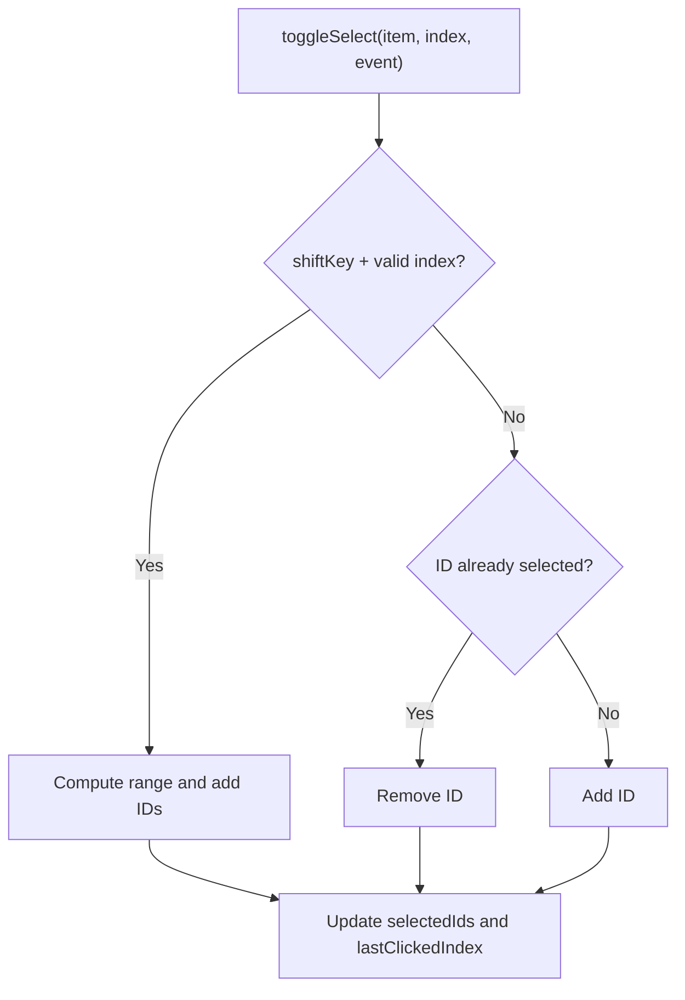

**Diagram sources**
- [useBulkSelect.js:27-50](file://src/composables/useBulkSelect.js#L27-L50)

**Section sources**
- [useBulkSelect.js:3-97](file://src/composables/useBulkSelect.js#L3-L97)

### useDashboardWidgets: Registry and Persistence
Responsibilities:
- Register widgets and track enabled sets
- Persist enabled widget IDs to localStorage
- Compute active and all widgets lists

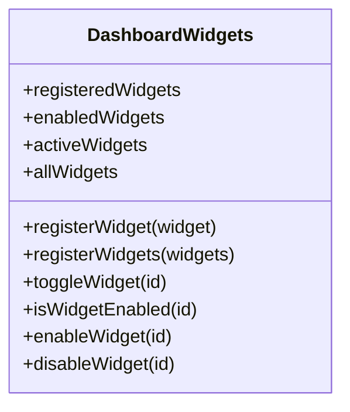

**Diagram sources**
- [useDashboardWidgets.js:24-86](file://src/composables/useDashboardWidgets.js#L24-L86)

**Section sources**
- [useDashboardWidgets.js:24-86](file://src/composables/useDashboardWidgets.js#L24-L86)

### useExport: Export Preview and Error Handling
Responsibilities:
- Manage export preview visibility and data payload
- Wrap export function calls with try/catch and toast feedback

**Section sources**
- [useExport.js:4-33](file://src/composables/useExport.js#L4-L33)

### useFullscreenMode: DOM Class Toggle
Responsibilities:
- Toggle fullscreen mode and apply/remove CSS class on document root

**Section sources**
- [useFullscreenMode.js:5-27](file://src/composables/useFullscreenMode.js#L5-L27)

### usePwaInstall: Install Prompt and Manual Instructions
Responsibilities:
- Detect native install prompt availability
- Trigger install flow and handle user choice
- Show manual instructions modal when native prompt is unavailable

**Section sources**
- [usePwaInstall.js:11-83](file://src/composables/usePwaInstall.js#L11-L83)

### Pinia Stores: Auth, Dashboard, UI
- auth store: token, role, email; logout action clears storage and resets state
- dashboard store: modules list and loading flag; fetchModules retrieves from API
- ui store: placeholder methods for toast actions

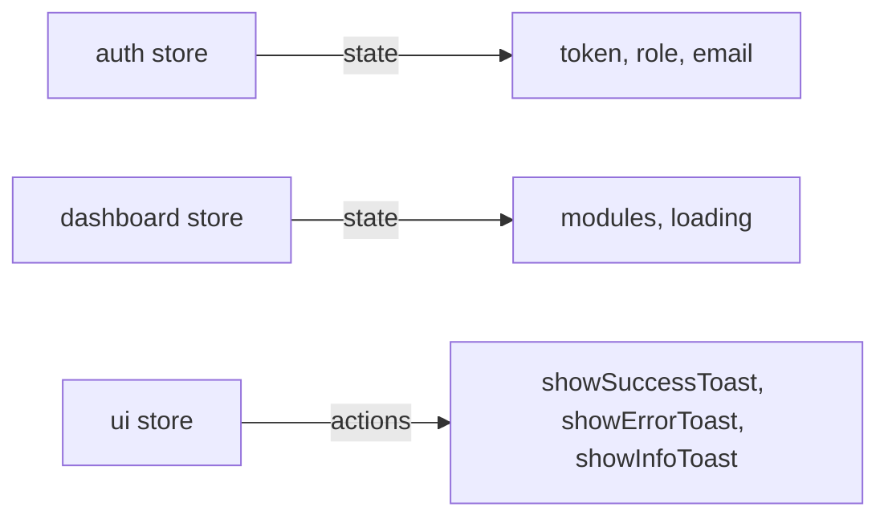

**Diagram sources**
- [auth.js:3-21](file://src/stores/auth.js#L3-L21)
- [dashboard.js:5-28](file://src/stores/dashboard.js#L5-L28)
- [ui.js:3-20](file://src/stores/ui.js#L3-L20)

**Section sources**
- [auth.js:3-21](file://src/stores/auth.js#L3-L21)
- [dashboard.js:5-28](file://src/stores/dashboard.js#L5-L28)
- [ui.js:3-20](file://src/stores/ui.js#L3-L20)

### View Integration: DashboardHome and BulkActionsBar
- DashboardHome consumes stores and composables to display KPIs, alerts, ledger, and AI insights
- BulkActionsBar renders bulk actions and emits events for clearing and deleting selections

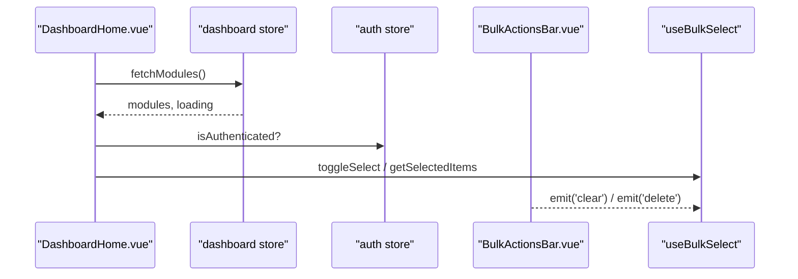

**Diagram sources**
- [DashboardHome.vue:1-200](file://src/views/DashboardHome.vue#L1-L200)
- [BulkActionsBar.vue:1-47](file://src/components/ui/BulkActionsBar.vue#L1-L47)
- [dashboard.js:9-25](file://src/stores/dashboard.js#L9-L25)
- [auth.js:3-21](file://src/stores/auth.js#L3-L21)
- [useBulkSelect.js:3-97](file://src/composables/useBulkSelect.js#L3-L97)

**Section sources**
- [DashboardHome.vue:1-200](file://src/views/DashboardHome.vue#L1-L200)
- [BulkActionsBar.vue:1-47](file://src/components/ui/BulkActionsBar.vue#L1-L47)

## Dependency Analysis
Composables depend on:
- Browser APIs (localStorage, window events, navigator)
- Services (API endpoints, currency service, offline sync manager, IndexedDB)
- Stores (auth, dashboard) for cross-cutting state

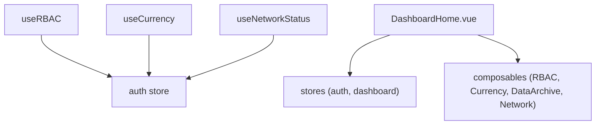

**Diagram sources**
- [useRBAC.js:668-719](file://src/composables/useRBAC.js#L668-L719)
- [useCurrency.js:24-54](file://src/composables/useCurrency.js#L24-L54)
- [useNetworkStatus.js:33-41](file://src/composables/useNetworkStatus.js#L33-L41)
- [DashboardHome.vue:1-200](file://src/views/DashboardHome.vue#L1-L200)
- [auth.js:3-21](file://src/stores/auth.js#L3-L21)
- [dashboard.js:5-28](file://src/stores/dashboard.js#L5-L28)

**Section sources**
- [useRBAC.js:668-719](file://src/composables/useRBAC.js#L668-L719)
- [useCurrency.js:24-54](file://src/composables/useCurrency.js#L24-L54)
- [useNetworkStatus.js:33-41](file://src/composables/useNetworkStatus.js#L33-L41)
- [DashboardHome.vue:1-200](file://src/views/DashboardHome.vue#L1-L200)
- [auth.js:3-21](file://src/stores/auth.js#L3-L21)
- [dashboard.js:5-28](file://src/stores/dashboard.js#L5-L28)

## Performance Considerations
- Prefer computed properties for derived state to avoid unnecessary recalculations (e.g., selectionCount, activeWidgets)
- Use markRaw for non-reactive large objects like registered widgets to prevent overhead
- Debounce network events to reduce churn (see debounced update in network status)
- Keep composable state local unless shared across components; use Pinia stores for app-wide state
- Avoid heavy computations in templates; move logic into composables or computed properties
- Use lazy imports where appropriate to reduce initial bundle size

[No sources needed since this section provides general guidance]

## Troubleshooting Guide
Common issues and resolutions:
- Currency service initialization failures: The composable falls back to default settings and marks initialization complete to prevent crashes
- Network sync errors: Last sync attempt and error fields help diagnose failures; force sync retries with updated status
- Confirm dialog not closing: Ensure onClose is called in clearConfirm and cancelConfirm paths
- Bulk selection not updating: Verify getId mapping and ensure indices are passed correctly for shift+click ranges
- PWA install prompt not appearing: Check platform support and fall back to manual instructions modal

**Section sources**
- [useCurrency.js:24-54](file://src/composables/useCurrency.js#L24-L54)
- [useNetworkStatus.js:75-91](file://src/composables/useNetworkStatus.js#L75-L91)
- [useConfirmDialog.js:30-55](file://src/composables/useConfirmDialog.js#L30-L55)
- [useBulkSelect.js:27-50](file://src/composables/useBulkSelect.js#L27-L50)
- [usePwaInstall.js:49-83](file://src/composables/usePwaInstall.js#L49-L83)

## Conclusion
The ABSA Foundry Frontend leverages Vue 3 composables to encapsulate reusable logic and Pinia stores for centralized state. This separation yields:
- Clear responsibilities per composable
- Consistent error handling and loading states
- Robust integration with services and browser APIs
- Scalable patterns for complex scenarios like RBAC, currency management, and offline sync

Adhering to these patterns ensures maintainability, testability, and performance across the application.

[No sources needed since this section summarizes without analyzing specific files]