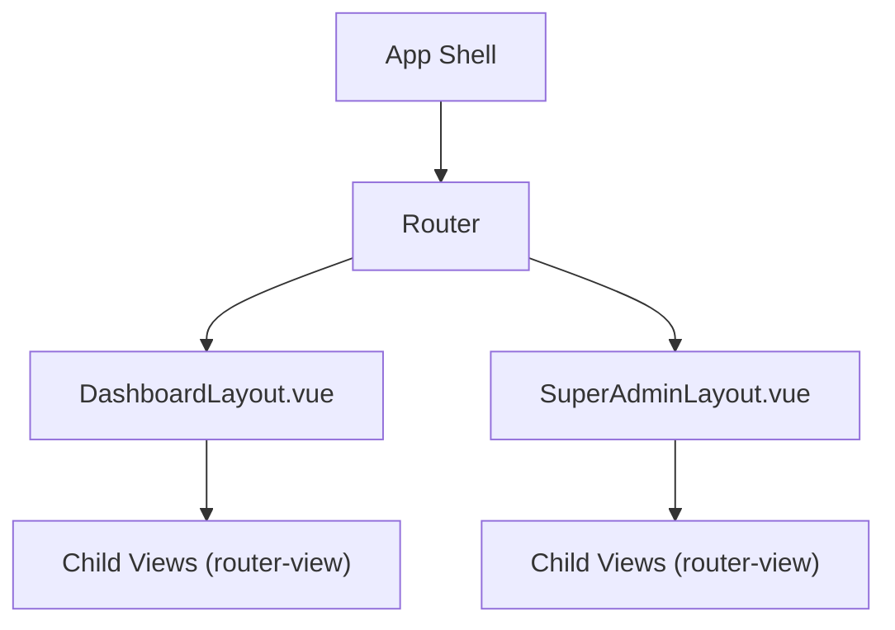
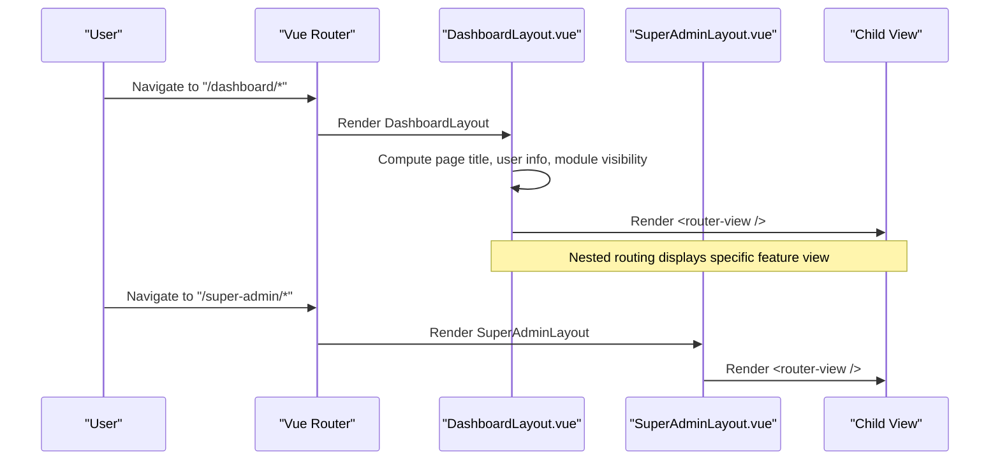
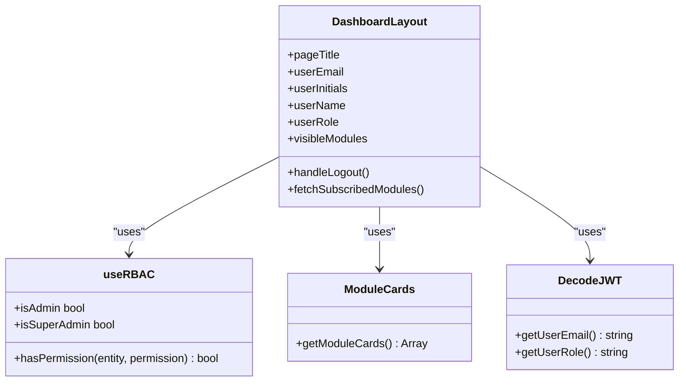
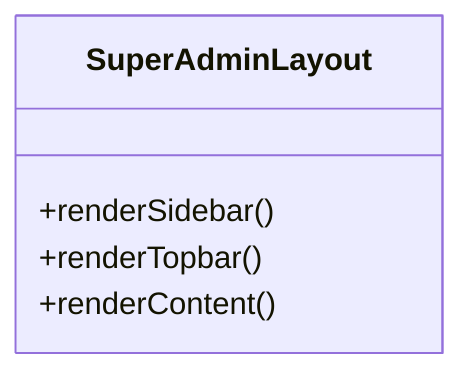
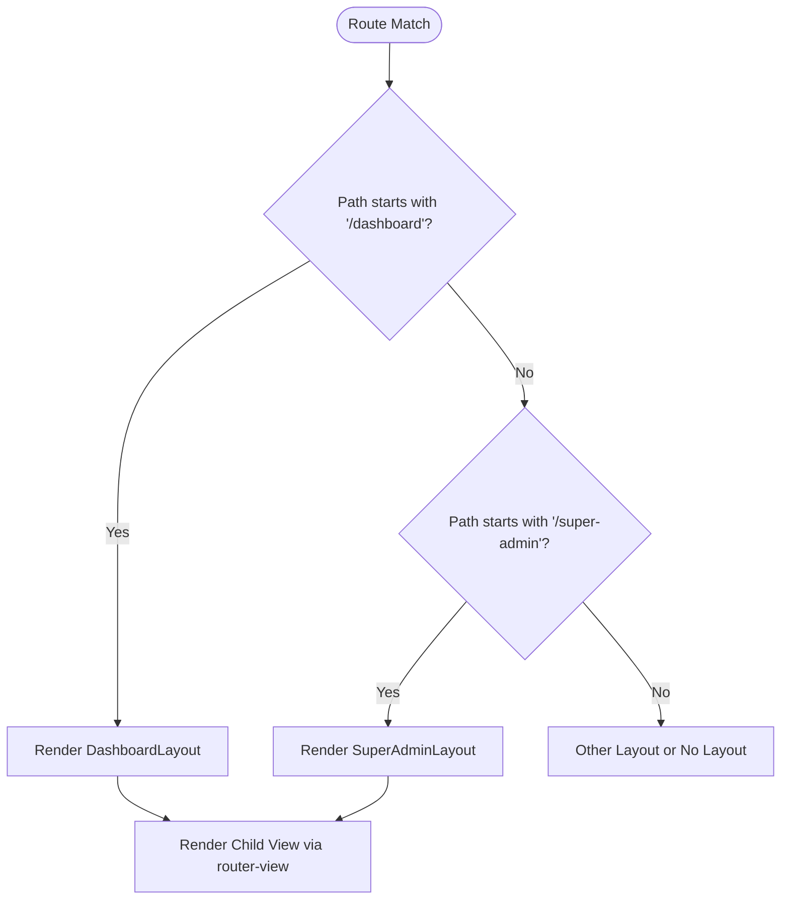
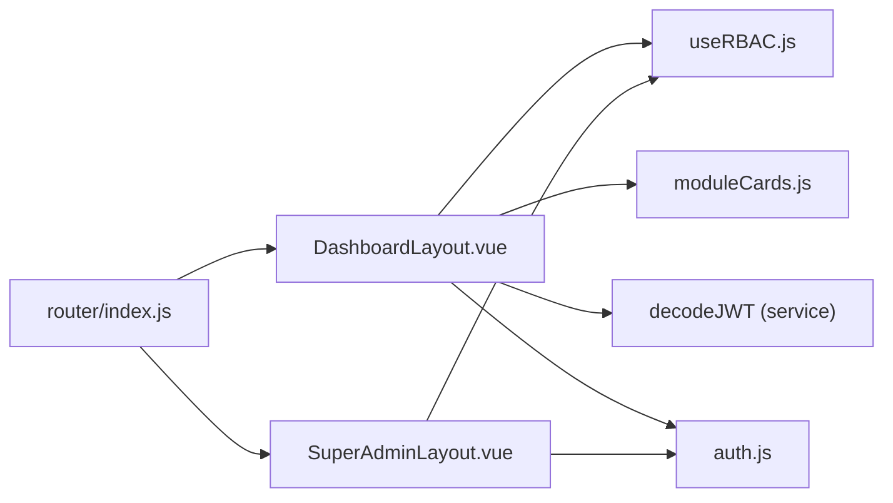

# Layout Components

<cite>
**Referenced Files in This Document**
- [DashboardLayout.vue](file://src/components/layouts/DashboardLayout.vue)
- [SuperAdminLayout.vue](file://src/components/layouts/SuperAdminLayout.vue)
- [index.js](file://src/router/index.js)
- [useRBAC.js](file://src/composables/useRBAC.js)
- [rbac.js](file://src/config/rbac.js)
- [moduleCards.js](file://src/config/moduleCards.js)
- [auth.js](file://src/stores/auth.js)
</cite>

## Table of Contents
1. Introduction
2. Project Structure
3. Core Components
4. Architecture Overview
5. Detailed Component Analysis
6. Dependency Analysis
7. Performance Considerations
8. Troubleshooting Guide
9. Conclusion
10. Appendices

## Introduction
This document explains the layout components used in the ABSA Foundry Frontend, focusing on:
- DashboardLayout: header navigation, user authentication display, and responsive design patterns
- SuperAdminLayout: administrative interface with enhanced permissions and controls
- Layout composition patterns and nested routing integration
- How layouts handle different screen sizes
- Examples for customizing layouts, adding new navigation items, and implementing role-based layout variations

## Project Structure
The layout system is centered around two primary layout components that wrap application views via Vue Router’s nested routing:
- DashboardLayout wraps authenticated dashboard routes and provides a top navigation menu with dropdown links, search, notifications, help, and user info
- SuperAdminLayout wraps super-admin routes and provides a persistent sidebar with admin-specific navigation

**Diagram sources**
- [index.js:104-168](file://src/router/index.js#L104-L168)
- [DashboardLayout.vue:1-96](file://src/components/layouts/DashboardLayout.vue#L1-L96)
- [SuperAdminLayout.vue:1-63](file://src/components/layouts/SuperAdminLayout.vue#L1-L63)

**Section sources**
- [index.js:104-168](file://src/router/index.js#L104-L168)
- [DashboardLayout.vue:1-96](file://src/components/layouts/DashboardLayout.vue#L1-L96)
- [SuperAdminLayout.vue:1-63](file://src/components/layouts/SuperAdminLayout.vue#L1-L63)

## Core Components
- DashboardLayout
  - Provides a fixed header with a dropdown navigation menu, search bar, notification/help buttons, and user avatar/info
  - Renders child routes via router-view under a content area
  - Uses RBAC to compute visibility and access for settings and modules
  - Fetches subscribed modules to filter visible navigation items based on subscription and permissions
- SuperAdminLayout
  - Provides a left sidebar with admin navigation and a minimal top bar
  - Renders child routes via router-view under a content area
  - Designed for administrative interfaces with enhanced controls

**Section sources**
- [DashboardLayout.vue:1-96](file://src/components/layouts/DashboardLayout.vue#L1-L96)
- [SuperAdminLayout.vue:1-63](file://src/components/layouts/SuperAdminLayout.vue#L1-L63)

## Architecture Overview
The application uses Vue Router to compose layouts around groups of routes. The router defines a parent route for /dashboard that renders DashboardLayout and a separate set of routes for super-admin features. Child routes are rendered inside each layout’s router-view.

**Diagram sources**
- [index.js:104-168](file://src/router/index.js#L104-L168)
- [DashboardLayout.vue:92-94](file://src/components/layouts/DashboardLayout.vue#L92-L94)
- [SuperAdminLayout.vue:51-61](file://src/components/layouts/SuperAdminLayout.vue#L51-L61)

## Detailed Component Analysis

### DashboardLayout
Responsibilities:
- Header with dropdown navigation containing grouped sections (Dashboard, Branch Manager, Intelligence, AI & Data)
- Search input, notifications, help, and user avatar/info
- Dynamic module visibility based on subscriptions and RBAC
- Logout flow that clears local storage and redirects to login
- Page title derived from route meta

Responsive behavior:
- On small screens, the brand/title is compact and some desktop-only elements are hidden
- Dropdown menu replaces a traditional sidebar for navigation on mobile

Authentication and user display:
- User email, initials, name, and role are computed from JWT decoding utilities
- Role-based checks determine access to settings and other areas

Module filtering:
- Loads subscribed modules from an API endpoint and filters them against module cards
- Excludes admin-only pages and primary nav items; always shows free essentials
- Applies permission checks for non-owner/admin roles

Key implementation references:
- Header structure and navigation links
- Computed user info and role checks
- Subscribed modules fetching and filtering logic
- Logout handler

**Section sources**
- [DashboardLayout.vue:1-96](file://src/components/layouts/DashboardLayout.vue#L1-L96)
- [DashboardLayout.vue:99-233](file://src/components/layouts/DashboardLayout.vue#L99-L233)
- [DashboardLayout.vue:235-299](file://src/components/layouts/DashboardLayout.vue#L235-L299)

#### DashboardLayout Class Diagram

**Diagram sources**
- [DashboardLayout.vue:99-233](file://src/components/layouts/DashboardLayout.vue#L99-L233)
- [useRBAC.js:55-137](file://src/composables/useRBAC.js#L55-L137)
- [moduleCards.js:13-51](file://src/config/moduleCards.js#L13-L51)

### SuperAdminLayout
Responsibilities:
- Persistent sidebar with admin navigation items (Dashboard, Tenants, Revenue, Reports, System Traces)
- Minimal top bar with breadcrumb-like text and user avatar
- Content area rendering child routes

Responsive behavior:
- Sidebar is hidden on small screens via media queries; content area adapts padding

Permissions and controls:
- Intended for super-admin users; typically protected by route guards or role checks elsewhere in the app

Key implementation references:
- Sidebar navigation links
- Top bar and content area
- Media query for mobile responsiveness

**Section sources**
- [SuperAdminLayout.vue:1-63](file://src/components/layouts/SuperAdminLayout.vue#L1-L63)
- [SuperAdminLayout.vue:69-155](file://src/components/layouts/SuperAdminLayout.vue#L69-L155)

#### SuperAdminLayout Class Diagram

[No sources needed since this diagram shows conceptual structure without mapping to specific code methods]

### Nested Routing Integration
- Dashboard routes are defined under a parent route that renders DashboardLayout; child routes render feature views within the layout
- Super-admin routes would similarly be grouped under a parent route using SuperAdminLayout
- Route meta can include titles for dynamic page headers

**Diagram sources**
- [index.js:104-168](file://src/router/index.js#L104-L168)
- [DashboardLayout.vue:92-94](file://src/components/layouts/DashboardLayout.vue#L92-L94)
- [SuperAdminLayout.vue:51-61](file://src/components/layouts/SuperAdminLayout.vue#L51-L61)

**Section sources**
- [index.js:104-168](file://src/router/index.js#L104-L168)

### Responsive Design Patterns
- DashboardLayout uses Tailwind utility classes to hide/show elements at different breakpoints and to create a dropdown menu for navigation on smaller screens
- SuperAdminLayout hides the sidebar on small screens and adjusts content padding via media queries

Practical examples:
- Hide desktop-only search and action buttons on mobile
- Collapse branding into a compact form on small screens
- Switch from grid layout with sidebar to single-column content on mobile

**Section sources**
- [DashboardLayout.vue:10-91](file://src/components/layouts/DashboardLayout.vue#L10-L91)
- [SuperAdminLayout.vue:144-149](file://src/components/layouts/SuperAdminLayout.vue#L144-L149)

### Role-Based Layout Variations
- DashboardLayout computes user role and uses RBAC to conditionally show settings and filter modules
- SuperAdminLayout is intended for super-admin users; additional route-level guards can restrict access to these routes

Implementation references:
- Role checks and permission functions
- Module visibility filtering based on subscriptions and permissions

**Section sources**
- [DashboardLayout.vue:107-167](file://src/components/layouts/DashboardLayout.vue#L107-L167)
- [useRBAC.js:55-137](file://src/composables/useRBAC.js#L55-L137)
- [rbac.js:85-337](file://src/config/rbac.js#L85-L337)

## Dependency Analysis
The layout components depend on several core services and composables:
- Router for nested routing and route meta
- RBAC composable for permission checks and role detection
- Module cards configuration for dynamic navigation and filtering
- JWT decoding utilities for user information
- Auth store for token and role state management

**Diagram sources**
- [DashboardLayout.vue:99-233](file://src/components/layouts/DashboardLayout.vue#L99-L233)
- [SuperAdminLayout.vue:1-63](file://src/components/layouts/SuperAdminLayout.vue#L1-L63)
- [index.js:104-168](file://src/router/index.js#L104-L168)
- [useRBAC.js:55-137](file://src/composables/useRBAC.js#L55-L137)
- [moduleCards.js:13-51](file://src/config/moduleCards.js#L13-L51)
- [auth.js:1-22](file://src/stores/auth.js#L1-L22)

**Section sources**
- [DashboardLayout.vue:99-233](file://src/components/layouts/DashboardLayout.vue#L99-L233)
- [SuperAdminLayout.vue:1-63](file://src/components/layouts/SuperAdminLayout.vue#L1-L63)
- [index.js:104-168](file://src/router/index.js#L104-L168)
- [useRBAC.js:55-137](file://src/composables/useRBAC.js#L55-L137)
- [moduleCards.js:13-51](file://src/config/moduleCards.js#L13-L51)
- [auth.js:1-22](file://src/stores/auth.js#L1-L22)

## Performance Considerations
- Avoid heavy computations in the header; prefer computed properties for derived values like page title and user info
- Debounce or throttle search inputs if integrated with live search
- Cache subscribed modules locally when possible to reduce network calls
- Use lazy loading for route components to improve initial load time
- Minimize re-renders by keeping layout state minimal and scoped

[No sources needed since this section provides general guidance]

## Troubleshooting Guide
Common issues and resolutions:
- Navigation not updating: Ensure route meta includes titles and that the layout reads route.meta.title correctly
- User info not displaying: Verify JWT decoding utilities return expected values and that tokens are present in local storage
- Module visibility incorrect: Check RBAC permissions and subscribed modules fetched from the backend; ensure filtering logic excludes admin-only pages and applies permission checks
- Mobile layout issues: Confirm Tailwind breakpoints and media queries are applied; verify hidden/visible classes match desired behavior

**Section sources**
- [DashboardLayout.vue:111-167](file://src/components/layouts/DashboardLayout.vue#L111-L167)
- [DashboardLayout.vue:198-232](file://src/components/layouts/DashboardLayout.vue#L198-L232)
- [SuperAdminLayout.vue:144-149](file://src/components/layouts/SuperAdminLayout.vue#L144-L149)

## Conclusion
The ABSA Foundry Frontend employs a clear layout architecture using DashboardLayout and SuperAdminLayout to provide consistent navigation and content presentation across the application. DashboardLayout offers a flexible, role-aware header with dynamic module visibility and responsive design, while SuperAdminLayout delivers a focused administrative interface. Nested routing integrates seamlessly with these layouts, enabling scalable feature development and maintainable UI composition.

[No sources needed since this section summarizes without analyzing specific files]

## Appendices

### Customizing Layouts
- Add a new navigation item to DashboardLayout by inserting a router-link within the dropdown menu and ensuring the route exists in the router configuration
- For SuperAdminLayout, add a new sidebar link under the navigation section and define the corresponding route
- Use route meta titles to update page headers dynamically

**Section sources**
- [DashboardLayout.vue:18-59](file://src/components/layouts/DashboardLayout.vue#L18-L59)
- [SuperAdminLayout.vue:20-41](file://src/components/layouts/SuperAdminLayout.vue#L20-L41)
- [index.js:112-163](file://src/router/index.js#L112-L163)

### Implementing Role-Based Layout Variations
- Use RBAC functions to conditionally render UI elements based on user roles and permissions
- Restrict access to certain routes using route guards or by hiding navigation items for unauthorized users
- Leverage module cards and subscription data to tailor the dashboard experience per tenant and role

**Section sources**
- [useRBAC.js:55-137](file://src/composables/useRBAC.js#L55-L137)
- [moduleCards.js:13-51](file://src/config/moduleCards.js#L13-L51)
- [rbac.js:85-337](file://src/config/rbac.js#L85-L337)