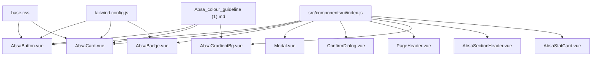
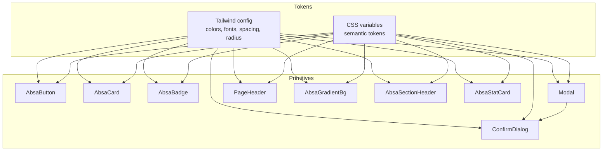
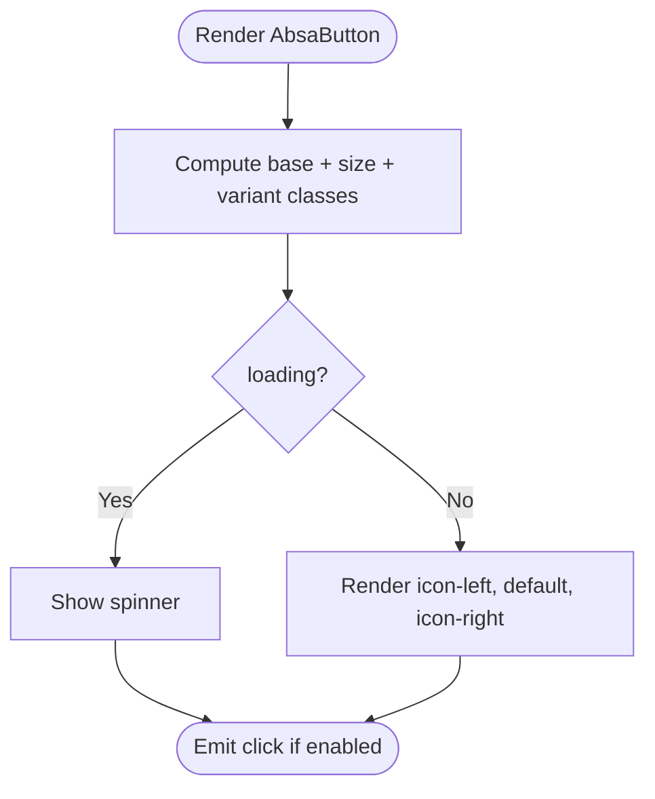
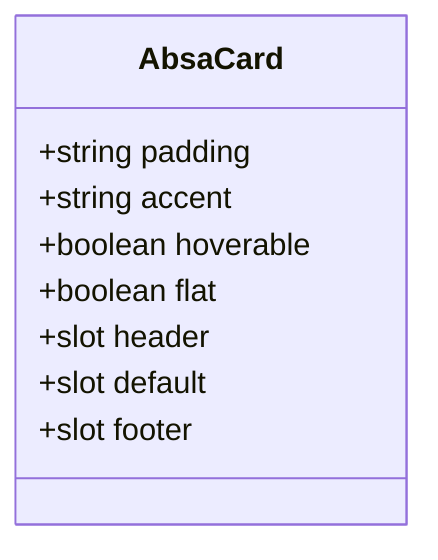
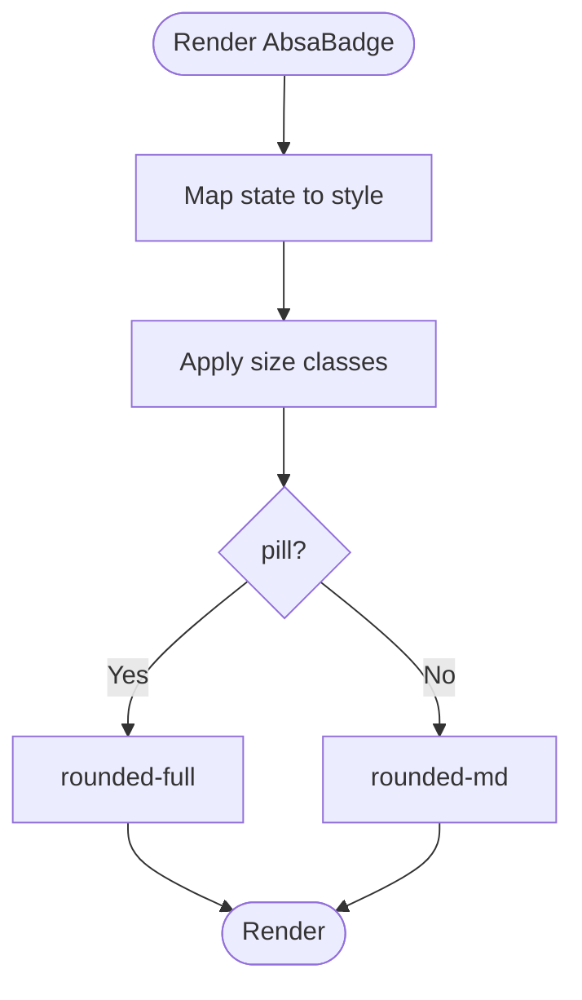
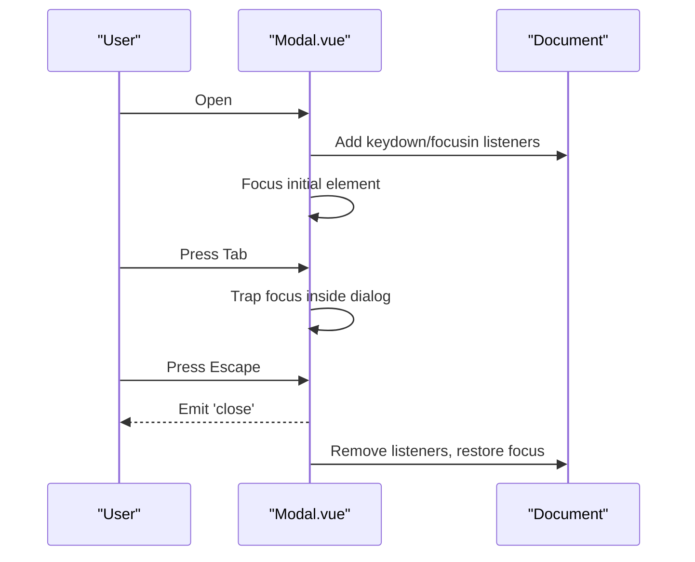
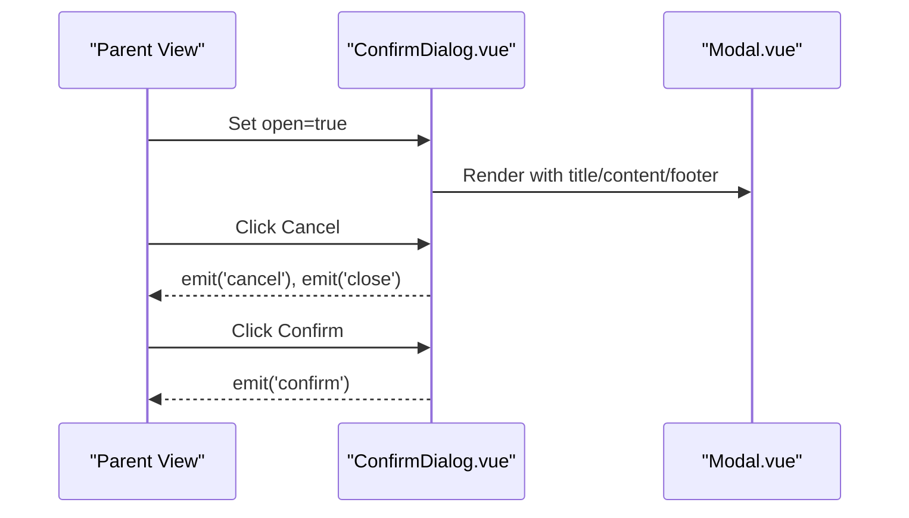
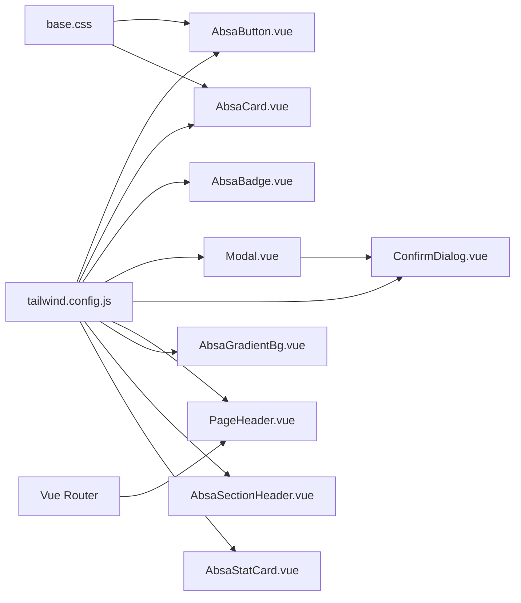

# UI Primitives & Design System

<cite>
**Referenced Files in This Document**
- [index.js](file://src/components/ui/index.js)
- [AbsaButton.vue](file://src/components/ui/AbsaButton.vue)
- [AbsaCard.vue](file://src/components/ui/AbsaCard.vue)
- [AbsaBadge.vue](file://src/components/ui/AbsaBadge.vue)
- [Modal.vue](file://src/components/ui/Modal.vue)
- [ConfirmDialog.vue](file://src/components/ui/ConfirmDialog.vue)
- [PageHeader.vue](file://src/components/ui/PageHeader.vue)
- [AbsaGradientBg.vue](file://src/components/ui/AbsaGradientBg.vue)
- [AbsaSectionHeader.vue](file://src/components/ui/AbsaSectionHeader.vue)
- [AbsaStatCard.vue](file://src/components/ui/AbsaStatCard.vue)
- [base.css](file://src/assets/base.css)
- [tailwind.config.js](file://tailwind.config.js)
- [Absa_colour_guideline (1).md](file://docs/Absa_colour_guideline (1).md)
</cite>

## Table of Contents
1. [Introduction](#introduction)
2. [Project Structure](#project-structure)
3. [Core Components](#core-components)
4. [Architecture Overview](#architecture-overview)
5. [Detailed Component Analysis](#detailed-component-analysis)
6. [Dependency Analysis](#dependency-analysis)
7. [Performance Considerations](#performance-considerations)
8. [Troubleshooting Guide](#troubleshooting-guide)
9. [Conclusion](#conclusion)
10. [Appendices](#appendices)

## Introduction
This document describes the Absa design system and UI primitives implemented in the frontend. It covers the core Absa components (AbsaButton, AbsaCard, AbsaBadge), shared UI elements (Modal, ConfirmDialog, PageHeader), and supporting brand components (AbsaGradientBg, AbsaSectionHeader, AbsaStatCard). It explains the design token system (colors, typography, spacing), component APIs (props, events, slots), accessibility considerations, responsive behavior, and how to extend the system via the component registration index.

## Project Structure
The UI primitives are organized under src/components/ui with a central barrel export file that registers all components for convenient imports across the application. Brand-specific components follow consistent patterns: props define variants/sizes, computed classes derive styles from tokens, and slots provide flexible content composition.

**Diagram sources**
- [index.js:1-22](file://src/components/ui/index.js#L1-L22)
- [AbsaButton.vue:1-101](file://src/components/ui/AbsaButton.vue#L1-L101)
- [AbsaCard.vue:1-90](file://src/components/ui/AbsaCard.vue#L1-L90)
- [AbsaBadge.vue:1-81](file://src/components/ui/AbsaBadge.vue#L1-L81)
- [Modal.vue:1-258](file://src/components/ui/Modal.vue#L1-L258)
- [ConfirmDialog.vue:1-178](file://src/components/ui/ConfirmDialog.vue#L1-L178)
- [PageHeader.vue:1-71](file://src/components/ui/PageHeader.vue#L1-L71)
- [AbsaGradientBg.vue:1-120](file://src/components/ui/AbsaGradientBg.vue#L1-L120)
- [AbsaSectionHeader.vue:1-83](file://src/components/ui/AbsaSectionHeader.vue#L1-L83)
- [AbsaStatCard.vue:1-87](file://src/components/ui/AbsaStatCard.vue#L1-L87)
- [tailwind.config.js:1-181](file://tailwind.config.js#L1-L181)
- [base.css:1-87](file://src/assets/base.css#L1-L87)
- [Absa_colour_guideline (1).md:1-724](file://docs/Absa_colour_guideline (1).md#L1-L724)

**Section sources**
- [index.js:1-22](file://src/components/ui/index.js#L1-L22)

## Core Components
- AbsaButton: Primary interactive element with brand variants, sizes, loading state, and icon slots.
- AbsaCard: Container with accent bar, hover effects, header/footer slots, and flat mode.
- AbsaBadge: Status indicator with state-driven colors, size options, and optional dot.
- Modal: Accessible dialog with focus trapping, escape-to-close, teleport target, and sticky header/footer.
- ConfirmDialog: Prebuilt confirmation modal built on Modal with variant styling and keyboard support.
- PageHeader: Sticky page header with breadcrumb-like navigation and actions slot.
- AbsaGradientBg: Brand gradient backgrounds with pattern overlay and rounded/padding options.
- AbsaSectionHeader: Section title with overline, title, subtitle, and action slot; supports size and color variants.
- AbsaStatCard: Metric card with label, formatted value, trend indicator, and accent top bar.

These components share design tokens defined in Tailwind and CSS variables, ensuring consistent visual language across the app.

**Section sources**
- [AbsaButton.vue:23-100](file://src/components/ui/AbsaButton.vue#L23-L100)
- [AbsaCard.vue:38-89](file://src/components/ui/AbsaCard.vue#L38-L89)
- [AbsaBadge.vue:13-80](file://src/components/ui/AbsaBadge.vue#L13-L80)
- [Modal.vue:55-208](file://src/components/ui/Modal.vue#L55-L208)
- [ConfirmDialog.vue:67-177](file://src/components/ui/ConfirmDialog.vue#L67-L177)
- [PageHeader.vue:37-70](file://src/components/ui/PageHeader.vue#L37-L70)
- [AbsaGradientBg.vue:25-119](file://src/components/ui/AbsaGradientBg.vue#L25-L119)
- [AbsaSectionHeader.vue:37-82](file://src/components/ui/AbsaSectionHeader.vue#L37-L82)
- [AbsaStatCard.vue:46-86](file://src/components/ui/AbsaStatCard.vue#L46-L86)

## Architecture Overview
The design system is built on a layered approach:
- Tokens: Colors, typography, spacing, radius, shadows, z-index, and animations are centralized in Tailwind configuration and CSS variables.
- Primitives: Reusable components implement token-based styling and expose clear APIs (props, slots, events).
- Composition: Higher-level components (e.g., ConfirmDialog) compose primitives (Modal) to deliver domain-specific UX.
- Registration: The barrel index exports all components for consistent import paths.

**Diagram sources**
- [tailwind.config.js:1-181](file://tailwind.config.js#L1-L181)
- [base.css:1-87](file://src/assets/base.css#L1-L87)
- [Modal.vue:1-258](file://src/components/ui/Modal.vue#L1-L258)
- [ConfirmDialog.vue:1-178](file://src/components/ui/ConfirmDialog.vue#L1-L178)

## Detailed Component Analysis

### AbsaButton
- Purpose: Primary call-to-action with brand-aligned variants and states.
- Props:
  - variant: absa, power, hope, outline, ghost, energy, danger
  - size: sm, md, lg
  - disabled: boolean
  - loading: boolean
  - block: boolean (full-width)
- Slots:
  - default: button text
  - icon-left: left icon
  - icon-right: right icon
- Events: none (uses native button behavior; v-bind $attrs forwards attributes)
- Accessibility:
  - Focus ring uses brand color variable
  - Disabled state reduces opacity and prevents interaction
  - Loading state disables button and shows spinner
- Responsive: Uses Tailwind spacing and font sizes; works across breakpoints
- Customization:
  - Use variants for brand semantics
  - Combine size and block for layout control
  - Pass additional attributes via $attrs

**Diagram sources**
- [AbsaButton.vue:1-101](file://src/components/ui/AbsaButton.vue#L1-L101)

**Section sources**
- [AbsaButton.vue:23-100](file://src/components/ui/AbsaButton.vue#L23-L100)

### AbsaCard
- Purpose: Content container with subtle brand accent and hover elevation.
- Props:
  - padding: sm, md, lg
  - accent: passion, power, hope, energy, none
  - hoverable: boolean
  - flat: boolean (no shadow, lighter border)
- Slots:
  - header: title/subtitle/actions area
  - default: main content
  - footer: bottom section with separator
- Accessibility:
  - Accent bar is decorative (aria-hidden)
  - Hover gradient is decorative (aria-hidden)
- Responsive: Padding scales with size prop; hover lift adapts to screen size
- Customization:
  - Choose accent color aligned with brand palette
  - Use flat for low-emphasis contexts

**Diagram sources**
- [AbsaCard.vue:1-90](file://src/components/ui/AbsaCard.vue#L1-L90)

**Section sources**
- [AbsaCard.vue:38-89](file://src/components/ui/AbsaCard.vue#L38-L89)

### AbsaBadge
- Purpose: Compact status indicator with semantic states and optional dot.
- Props:
  - state: active, at-risk, dormant, churned, info, success, warning, error, completed, running, failed
  - size: sm, md
  - noDot: boolean
  - pill: boolean (rounded-full vs rounded-md)
- Slots:
  - default: badge text
- Accessibility:
  - Dot is decorative (aria-hidden)
  - State conveys meaning through color and text
- Responsive: Small sizes suitable for dense layouts
- Customization:
  - Map states to business semantics using provided options

**Diagram sources**
- [AbsaBadge.vue:13-80](file://src/components/ui/AbsaBadge.vue#L13-L80)

**Section sources**
- [AbsaBadge.vue:13-80](file://src/components/ui/AbsaBadge.vue#L13-L80)

### Modal
- Purpose: Accessible, focus-trapped dialog with teleport support and keyboard handling.
- Props:
  - to: string or object (teleport target)
  - closeOnEscape: boolean
  - trapFocus: boolean
  - restoreFocus: boolean
- Slots:
  - title: dialog heading
  - content: main body
  - footer: actions
- Events:
  - close: emitted when backdrop clicked or Escape pressed
- Accessibility:
  - role="dialog", aria-modal="true", tabindex="-1"
  - Focus trap within dialog; restores previous focus on close
  - Escape key closes when enabled
- Responsive:
  - Max width and height constraints; scrollable content
  - Prevents body scroll while open
- Customization:
  - Use custom teleport target for nested modals or portals
  - Control focus behavior via props

**Diagram sources**
- [Modal.vue:55-208](file://src/components/ui/Modal.vue#L55-L208)

**Section sources**
- [Modal.vue:55-208](file://src/components/ui/Modal.vue#L55-L208)

### ConfirmDialog
- Purpose: Confirmation dialog with variant styling and accessible controls.
- Props:
  - open: boolean
  - title: string
  - message: string
  - detail: string
  - variant: danger, warning, info, neutral
  - eyebrow: string
  - confirmLabel, cancelLabel, busyLabel: strings
  - busy: boolean
  - showCancel: boolean
  - confirmDisabled: boolean
- Slots:
  - body: additional content
- Events:
  - confirm, cancel, close
- Accessibility:
  - aria-labelledby and aria-describedby linked to title and description
  - Keyboard-friendly buttons with focus rings
- Customization:
  - Variant changes icon, eyebrow, and button styles
  - Busy state shows spinner and disables actions

**Diagram sources**
- [ConfirmDialog.vue:1-178](file://src/components/ui/ConfirmDialog.vue#L1-L178)
- [Modal.vue:1-258](file://src/components/ui/Modal.vue#L1-L258)

**Section sources**
- [ConfirmDialog.vue:67-177](file://src/components/ui/ConfirmDialog.vue#L67-L177)

### PageHeader
- Purpose: Sticky header with module context and back navigation.
- Props:
  - parentModule, currentView, title: strings
  - backRoute: string or object
  - backLabel: string
- Slots:
  - actions: right-side actions
- Behavior:
  - Navigates back using Vue Router when backRoute is provided
- Accessibility:
  - Back button has descriptive aria-label
- Customization:
  - Provide actions slot for contextual tools

**Section sources**
- [PageHeader.vue:37-70](file://src/components/ui/PageHeader.vue#L37-L70)

### AbsaGradientBg
- Purpose: Brand gradient backgrounds with optional pattern overlay and rounding.
- Props:
  - variant: predefined gradients per brand guide
  - showPattern: boolean
  - padding: none, md, lg
  - rounded: none, md, lg, xl
- Behavior:
  - Gradient direction follows brand guidelines (45 degrees)
  - Pattern overlay adds subtle texture
- Customization:
  - Choose variant based on desired feel (balanced, energetic, sophisticated)

**Section sources**
- [AbsaGradientBg.vue:25-119](file://src/components/ui/AbsaGradientBg.vue#L25-L119)

### AbsaSectionHeader
- Purpose: Section titles with overline, title, subtitle, and actions.
- Props:
  - title, subtitle, overline: strings
  - size: sm, md, lg
  - color: passion, power, energy, hope
- Slots:
  - overline, title, subtitle, actions
- Behavior:
  - Dynamic heading tag based on size
  - Accent bar width and height vary by size
- Customization:
  - Align color with brand usage

**Section sources**
- [AbsaSectionHeader.vue:37-82](file://src/components/ui/AbsaSectionHeader.vue#L37-L82)

### AbsaStatCard
- Purpose: Metric display with label, formatted value, trend, and accent bar.
- Props:
  - label: string (required)
  - value: string or number
  - subLabel: string
  - trend: number (optional)
  - loading: boolean
  - accentColor: string (brand variable)
  - format: number, currency, percentage, raw
- Behavior:
  - Formats values according to locale and format type
  - Shows trend arrow and percentage
- Customization:
  - Use accentColor to align with brand sections

**Section sources**
- [AbsaStatCard.vue:46-86](file://src/components/ui/AbsaStatCard.vue#L46-L86)

## Dependency Analysis
- Token dependencies:
  - Colors: Tailwind extends include brand colors (absa-passion, absa-power, etc.) and semantic tokens mapped to CSS variables.
  - Typography: Font families and sizes are extended in Tailwind for consistency.
  - Spacing and radius: Centralized in Tailwind theme for uniform spacing and shapes.
- Component coupling:
  - ConfirmDialog depends on Modal for dialog behavior.
  - All components rely on Tailwind utility classes and CSS variables for styling.
- External integrations:
  - PageHeader integrates with Vue Router for navigation.
  - Modal uses Teleport to render into a specified target.

**Diagram sources**
- [tailwind.config.js:1-181](file://tailwind.config.js#L1-L181)
- [base.css:1-87](file://src/assets/base.css#L1-L87)
- [Modal.vue:1-258](file://src/components/ui/Modal.vue#L1-L258)
- [ConfirmDialog.vue:1-178](file://src/components/ui/ConfirmDialog.vue#L1-L178)
- [PageHeader.vue:1-71](file://src/components/ui/PageHeader.vue#L1-L71)

**Section sources**
- [tailwind.config.js:1-181](file://tailwind.config.js#L1-L181)
- [base.css:1-87](file://src/assets/base.css#L1-L87)

## Performance Considerations
- Computed classes: Components use computed properties to derive class lists efficiently, minimizing re-renders.
- Lightweight overlays: Modal uses minimal DOM structure and avoids heavy filters for better performance.
- Lazy rendering: Slots allow conditional rendering of content only when needed.
- Scroll management: Modal prevents body scroll to avoid layout thrashing during open/close.
- Animation efficiency: Subtle transitions and transforms are used to maintain smooth interactions.

[No sources needed since this section provides general guidance]

## Troubleshooting Guide
- Modal not closing:
  - Ensure close event is handled in parent component.
  - Verify closeOnEscape prop is set correctly.
- Focus issues:
  - Confirm trapFocus is enabled and dialog contains focusable elements.
  - Check that autofocus or data-autofocus is used appropriately.
- Color inconsistencies:
  - Verify brand color variables are defined in Tailwind and CSS.
  - Use provided variants instead of hardcoding colors.
- Badge state mismatch:
  - Map business states to supported state values to ensure correct styling.
- Button disabled state:
  - Ensure disabled or loading props prevent user interaction when necessary.

**Section sources**
- [Modal.vue:55-208](file://src/components/ui/Modal.vue#L55-L208)
- [AbsaBadge.vue:13-80](file://src/components/ui/AbsaBadge.vue#L13-L80)
- [AbsaButton.vue:23-100](file://src/components/ui/AbsaButton.vue#L23-L100)

## Conclusion
The Absa design system provides a cohesive set of UI primitives grounded in brand tokens and accessible patterns. Components are composable, customizable, and responsive, enabling consistent experiences across the application. By leveraging the registration index and adhering to token definitions, teams can extend the system confidently while maintaining brand integrity.

[No sources needed since this section summarizes without analyzing specific files]

## Appendices

### Design Token System
- Colors:
  - Brand palette includes Passion, Power, Hope, Inspire, Energy, Uplift, Enrich, Serene.
  - Tailwind extends map these to utility classes and CSS variables.
  - Gradients follow brand guidelines with 45-degree direction starting with Passion.
- Typography:
  - Font families include Hanken Grotesk and Space Mono for headings and monospace text.
  - Type scale defines headline and body sizes with appropriate line heights.
- Spacing:
  - Consistent spacing tokens for margins, gutters, and panel padding.
- Radius and Shadows:
  - Unified radius tokens for cards, buttons, and full-rounded elements.
  - Shadow tokens for elevation and depth.

**Section sources**
- [tailwind.config.js:1-181](file://tailwind.config.js#L1-L181)
- [Absa_colour_guideline (1).md:1-724](file://docs/Absa_colour_guideline (1).md#L1-L724)

### Component Registration and Extension
- Registration:
  - Barrel index exports all UI components for centralized imports.
- Extension:
  - Create new components following existing patterns: props for configuration, computed classes for styling, slots for content, and events for interactivity.
  - Register new components in the index to make them available globally.
  - Use Tailwind tokens and CSS variables to ensure consistency.

**Section sources**
- [index.js:1-22](file://src/components/ui/index.js#L1-L22)