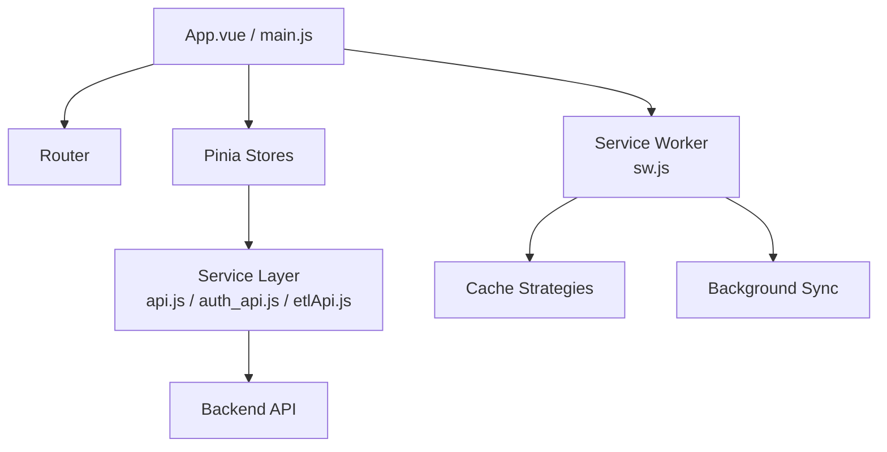
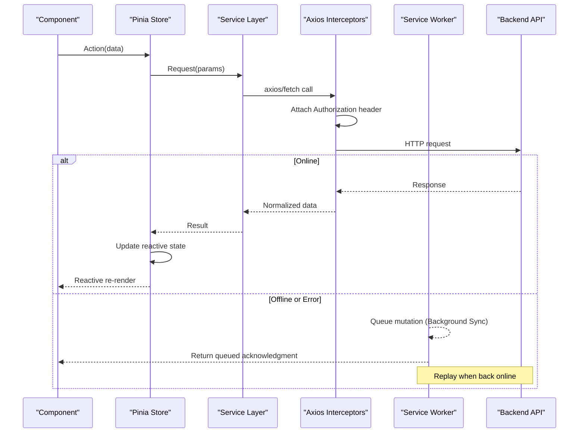
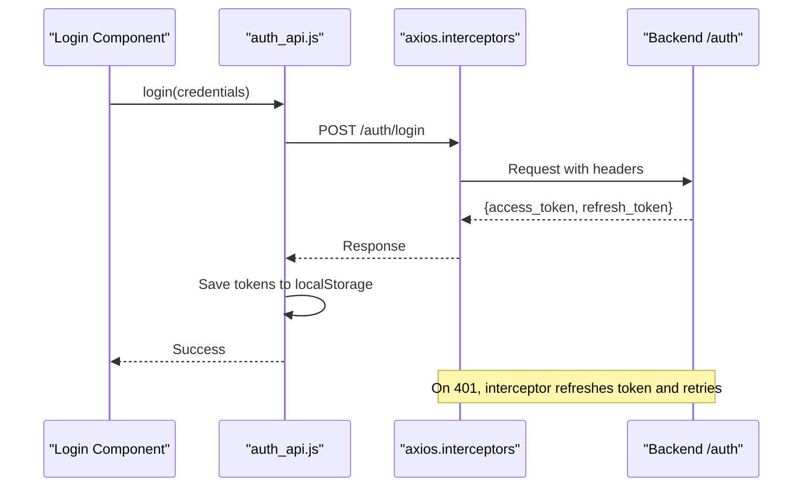
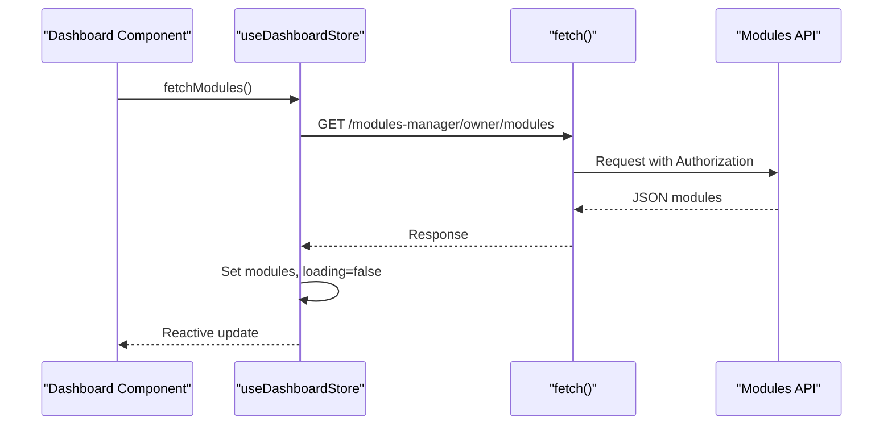
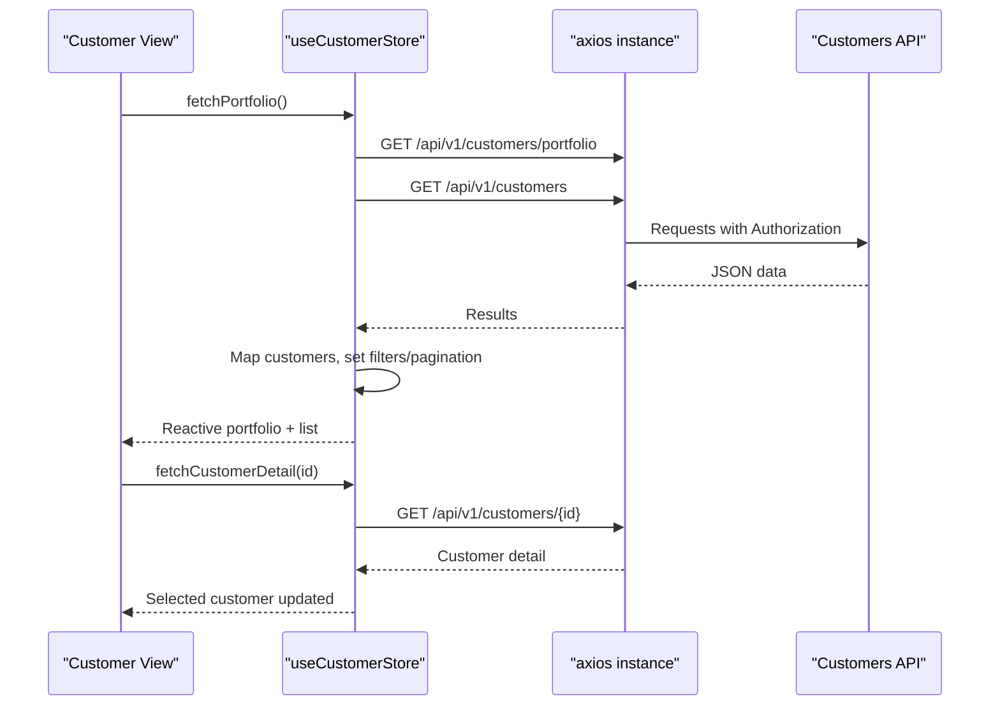
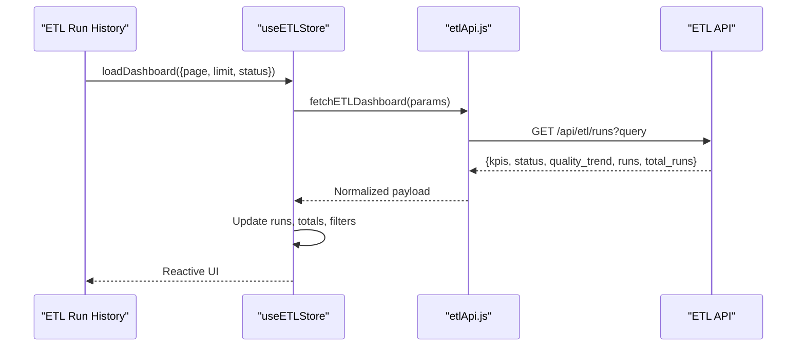
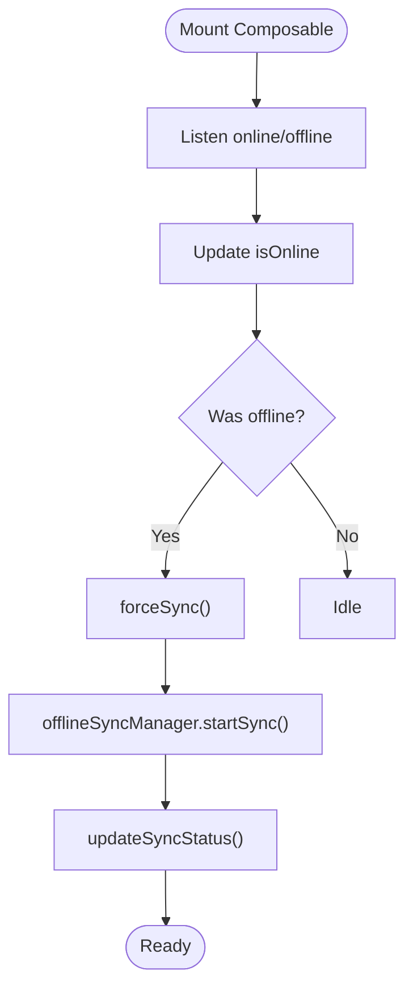
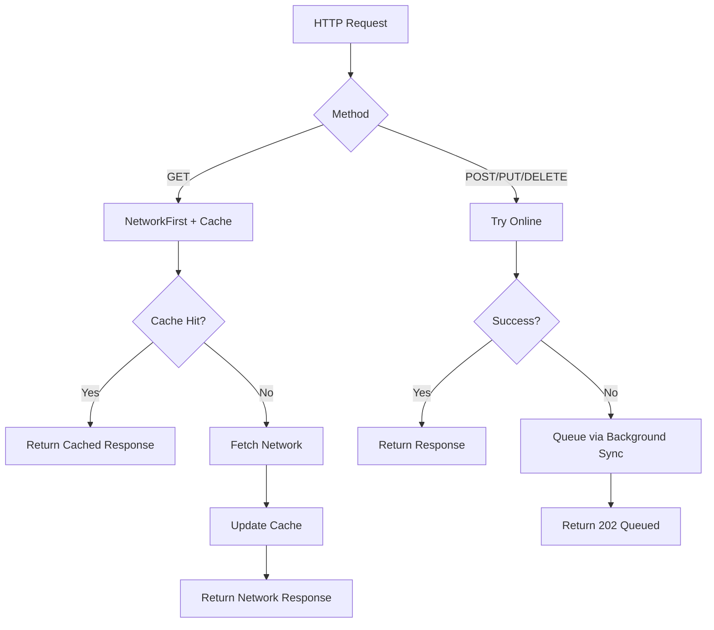
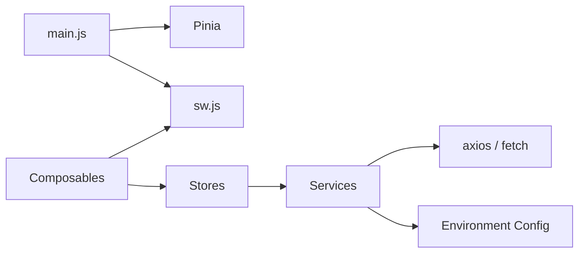

# Data Flow Patterns

<cite>
**Referenced Files in This Document**
- [main.js](file://src/main.js)
- [api.js](file://src/services/api.js)
- [auth_api.js](file://src/services/auth_api.js)
- [etlApi.js](file://src/services/etlApi.js)
- [dashboard.js](file://src/stores/dashboard.js)
- [customerStore.js](file://src/stores/customerStore.js)
- [etlStore.js](file://src/stores/etlStore.js)
- [useNetworkStatus.js](file://src/composables/useNetworkStatus.js)
- [useDataArchive.js](file://src/composables/useDataArchive.js)
- [sw.js](file://src/sw.js)
</cite>

## Table of Contents
1. [Introduction](#introduction)
2. [Project Structure](#project-structure)
3. [Core Components](#core-components)
4. [Architecture Overview](#architecture-overview)
5. [Detailed Component Analysis](#detailed-component-analysis)
6. [Dependency Analysis](#dependency-analysis)
7. [Performance Considerations](#performance-considerations)
8. [Troubleshooting Guide](#troubleshooting-guide)
9. [Conclusion](#conclusion)

## Introduction
This document explains the unidirectional data flow in the ABSA Foundry Frontend, from user interactions through Vue components to composables, Pinia stores, service layer abstractions, and API endpoints. It details centralized API clients, request/response interceptors, error handling strategies, real-time update patterns, caching mechanisms, offline capabilities, validation approaches, optimistic updates, and conflict resolution strategies for collaborative environments.

## Project Structure
The application is a Vue 3 app using Pinia for state management, Axios and fetch-based services for HTTP communication, and a Service Worker for PWA features including caching and background sync. The primary entry initializes plugins (Pinia, router, toast), registers the Service Worker, and mounts the app. Services encapsulate API calls with token injection and error normalization. Stores hold reactive state and orchestrate data fetching. Composables provide reusable logic such as network status tracking and pagination utilities.

**Diagram sources**
- [main.js:70-125](file://src/main.js#L70-L125)
- [sw.js:38-118](file://src/sw.js#L38-L118)

**Section sources**
- [main.js:1-129](file://src/main.js#L1-L129)
- [sw.js:1-224](file://src/sw.js#L1-L224)

## Core Components
- Centralized API client and interceptors:
  - Global axios instance with request interceptor adding Authorization header and response interceptor handling 401 with refresh token flow and queueing.
  - Utility functions for auth headers and legacy postRequest helper.
- Auth service:
  - Dedicated module for login, signup, refresh, logout, and profile operations with consistent error handling.
- Domain-specific services:
  - ETL API service normalizes responses and errors, sanitizes parameters, and exposes typed endpoints.
- Pinia stores:
  - Dashboard store for modules listing.
  - Customer store with portfolio summary, filtering, pagination, and detail/timeline/feature fetching.
  - ETL store driving dashboard UI with paginated runs and KPIs.
- Composables:
  - Network status composable tracks online/offline, sync status, and triggers auto-sync on reconnect.
  - Data archive composable provides generic pagination/search/filtering for list-like data.

**Section sources**
- [api.js:64-146](file://src/services/api.js#L64-L146)
- [auth_api.js:1-143](file://src/services/auth_api.js#L1-L143)
- [etlApi.js:1-115](file://src/services/etlApi.js#L1-L115)
- [dashboard.js:1-29](file://src/stores/dashboard.js#L1-L29)
- [customerStore.js:1-187](file://src/stores/customerStore.js#L1-L187)
- [etlStore.js:1-96](file://src/stores/etlStore.js#L1-L96)
- [useNetworkStatus.js:1-228](file://src/composables/useNetworkStatus.js#L1-L228)
- [useDataArchive.js:1-98](file://src/composables/useDataArchive.js#L1-L98)

## Architecture Overview
Unidirectional data flow:
- User interaction triggers component actions.
- Actions call composables or directly invoke store methods.
- Stores call service functions which use centralized HTTP clients.
- Services attach tokens via interceptors and normalize errors.
- Responses update store state; components reactively render.
- Service Worker caches GET requests and queues mutations when offline, replaying on reconnect.

**Diagram sources**
- [api.js:64-146](file://src/services/api.js#L64-L146)
- [sw.js:38-118](file://src/sw.js#L38-L118)

## Detailed Component Analysis

### Authentication and Token Management
- Login and token storage:
  - Auth service persists access and refresh tokens and returns normalized payloads.
  - Axios interceptor injects Authorization header automatically.
- 401 handling and refresh:
  - Response interceptor detects 401, attempts refresh using stored refresh token, retries original request, and handles failures by clearing tokens and redirecting to login.
- Logout:
  - Clears local storage and navigates away.

**Diagram sources**
- [auth_api.js:36-87](file://src/services/auth_api.js#L36-L87)
- [api.js:64-146](file://src/services/api.js#L64-L146)

**Section sources**
- [auth_api.js:1-143](file://src/services/auth_api.js#L1-L143)
- [api.js:64-146](file://src/services/api.js#L64-L146)

### Dashboard Modules Fetch Flow
- Store action fetches modules from backend with Authorization header.
- Loading state toggles around the request; errors are logged and ignored gracefully.

**Diagram sources**
- [dashboard.js:9-25](file://src/stores/dashboard.js#L9-L25)

**Section sources**
- [dashboard.js:1-29](file://src/stores/dashboard.js#L1-L29)

### Customer Portfolio and Detail Flow
- Parallel fetching of portfolio summary and customer list.
- Mapping raw API fields to domain model used by UI.
- Filtering and pagination computed properties derive visible subset.
- Detail, timeline, and feature endpoints fetched per customer.

**Diagram sources**
- [customerStore.js:91-156](file://src/stores/customerStore.js#L91-L156)

**Section sources**
- [customerStore.js:1-187](file://src/stores/customerStore.js#L1-L187)

### ETL Dashboard Flow
- Store loads dashboard data via service function that sanitizes params and normalizes responses.
- Pagination and status filtering drive subsequent loads.

**Diagram sources**
- [etlStore.js:33-57](file://src/stores/etlStore.js#L33-L57)
- [etlApi.js:68-75](file://src/services/etlApi.js#L68-L75)

**Section sources**
- [etlStore.js:1-96](file://src/stores/etlStore.js#L1-L96)
- [etlApi.js:1-115](file://src/services/etlApi.js#L1-L115)

### Network Status and Offline Sync
- Tracks online/offline events and debounces rapid changes.
- Computes pending sync counts from IndexedDB-backed inventory and sync manager.
- Auto-triggers sync on reconnect and exposes force sync.
- Shows offline notifications and manages notification permissions.

**Diagram sources**
- [useNetworkStatus.js:33-91](file://src/composables/useNetworkStatus.js#L33-L91)
- [useNetworkStatus.js:170-197](file://src/composables/useNetworkStatus.js#L170-L197)

**Section sources**
- [useNetworkStatus.js:1-228](file://src/composables/useNetworkStatus.js#L1-L228)

### Caching and Offline Capabilities (Service Worker)
- Precaches static assets and uses StaleWhileRevalidate for JS/CSS/JSON.
- API routes:
  - GET: NetworkFirst with cache expiration and status filtering.
  - Mutations (POST/PUT/DELETE): Attempt online; if failed, enqueue via Background Sync and return immediate acknowledgment.
- Navigation fallback serves cached index.html when offline.
- Activation cleans old caches and claims clients immediately.

**Diagram sources**
- [sw.js:38-118](file://src/sw.js#L38-L118)
- [sw.js:123-150](file://src/sw.js#L123-L150)
- [sw.js:155-161](file://src/sw.js#L155-L161)

**Section sources**
- [sw.js:1-224](file://src/sw.js#L1-L224)

### Data Validation Patterns
- Parameter sanitization:
  - ETL service removes undefined/null and empty string parameters before building query strings.
- Response normalization:
  - ETL service parses text responses, extracts error messages, and throws structured errors with status and data.
- Store-level validation:
  - Dashboard and customer stores validate response shapes before updating state and handle errors gracefully.

**Section sources**
- [etlApi.js:40-49](file://src/services/etlApi.js#L40-L49)
- [etlApi.js:18-38](file://src/services/etlApi.js#L18-L38)
- [dashboard.js:9-25](file://src/stores/dashboard.js#L9-L25)
- [customerStore.js:91-156](file://src/stores/customerStore.js#L91-L156)

### Optimistic Updates and Conflict Resolution
- Optimistic updates:
  - Not explicitly implemented in current stores; typical approach would be to update store state immediately on mutation and revert on failure.
- Conflict resolution:
  - Offline mutations are queued and replayed when online; conflicts should be handled server-side. If conflicts occur, the frontend can detect via error responses and prompt users to reconcile.
- Real-time updates:
  - No WebSocket/SSE usage detected; polling or manual refresh is used in stores.

[No sources needed since this section provides general guidance based on observed patterns]

## Dependency Analysis
- Entry point wires up Pinia, router, toast, and Service Worker registration.
- Services depend on environment variables for base URLs and centralize token injection.
- Stores depend on services for data fetching and expose reactive state to components.
- Composables abstract cross-cutting concerns like network status and pagination.

**Diagram sources**
- [main.js:70-125](file://src/main.js#L70-L125)
- [api.js:1-18](file://src/services/api.js#L1-L18)
- [auth_api.js:1-17](file://src/services/auth_api.js#L1-L17)
- [etlApi.js:1-16](file://src/services/etlApi.js#L1-L16)

**Section sources**
- [main.js:1-129](file://src/main.js#L1-L129)
- [api.js:1-209](file://src/services/api.js#L1-L209)
- [auth_api.js:1-190](file://src/services/auth_api.js#L1-L190)
- [etlApi.js:1-115](file://src/services/etlApi.js#L1-L115)

## Performance Considerations
- Use parallel requests where possible (e.g., portfolio and list fetching).
- Leverage Service Worker caching for GET requests to reduce latency and bandwidth.
- Debounce network status updates to avoid excessive sync triggers.
- Keep store state minimal and derived via computed properties for filtering and pagination.
- Avoid unnecessary re-renders by keeping granular reactive references.

[No sources needed since this section provides general guidance]

## Troubleshooting Guide
- Authentication issues:
  - Verify token presence and Authorization header injection.
  - Check 401 handling path: refresh token flow and redirect to login.
- Network errors:
  - Inspect service response normalization and error messages.
  - Confirm Service Worker strategy for the endpoint type (GET vs mutation).
- Offline behavior:
  - Ensure Background Sync queue exists and replays on reconnect.
  - Validate that online event triggers force sync.
- Data inconsistencies:
  - Review parameter sanitization and response mapping in services and stores.

**Section sources**
- [api.js:64-146](file://src/services/api.js#L64-L146)
- [auth_api.js:36-87](file://src/services/auth_api.js#L36-L87)
- [etlApi.js:18-38](file://src/services/etlApi.js#L18-L38)
- [useNetworkStatus.js:33-91](file://src/composables/useNetworkStatus.js#L33-L91)
- [sw.js:38-118](file://src/sw.js#L38-L118)

## Conclusion
The ABSA Foundry Frontend implements a clear unidirectional data flow with robust service-layer abstractions, centralized authentication handling, and comprehensive offline support via Service Worker caching and background sync. Stores encapsulate domain logic and reactive state, while composables provide reusable cross-cutting functionality. Validation and error normalization ensure predictable behavior across the stack. For collaborative scenarios, consider adopting optimistic updates and explicit conflict resolution strategies to enhance responsiveness and consistency.