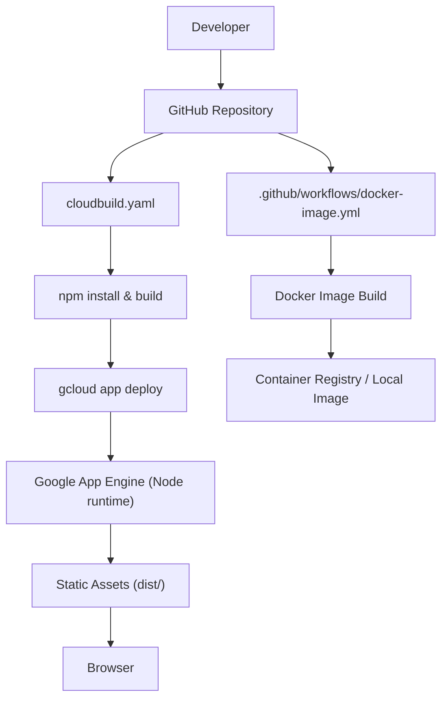
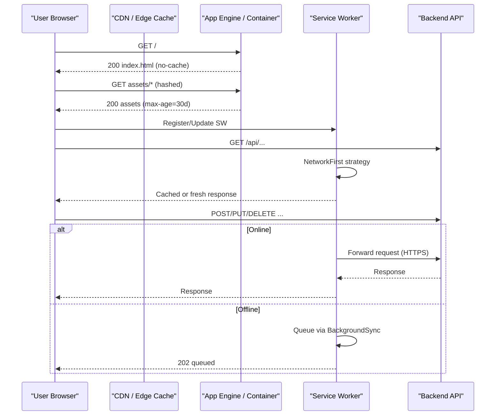
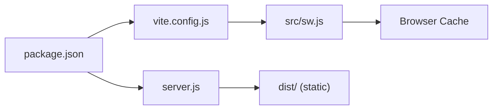

# Deployment Architecture

<cite>
**Referenced Files in This Document**
- [Dockerfile](file://Dockerfile)
- [server.js](file://server.js)
- [app.yaml](file://app.yaml)
- [cloudbuild.yaml](file://cloudbuild.yaml)
- [.github/workflows/docker-image.yml](file://.github/workflows/docker-image.yml)
- [vite.config.js](file://vite.config.js)
- [package.json](file://package.json)
- [public/manifest.json](file://public/manifest.json)
- [src/sw.js](file://src/sw.js)
- [scripts/update-sw-cache.js](file://scripts/update-sw-cache.js)
- [src/config/devFlags.js](file://src/config/devFlags.js)
- [src/services/system_traces_api.js](file://src/services/system_traces_api.js)
</cite>

## Table of Contents
1. Introduction
2. Project Structure
3. Core Components
4. Architecture Overview
5. Detailed Component Analysis
6. Dependency Analysis
7. Performance Considerations
8. Troubleshooting Guide
9. Conclusion
10. Appendices

## Introduction
This document describes the deployment architecture for the ABSA Foundry Frontend, covering containerization with Docker, Google Cloud Platform (GCP) deployment via App Engine and Cloud Build, CI/CD pipelines, air-gapped deployment considerations, static asset serving and CDN integration, environment configuration management, production security, monitoring, scaling and load balancing strategies, and disaster recovery procedures.

## Project Structure
The frontend is a Vue 3 + Vite application that builds to a static bundle served by an Express server. It includes a PWA service worker for offline support and caching strategies. Deployment targets include:
- Google App Engine using Node runtime with static file handlers
- Containerized deployments via Docker images built from a multi-stage Dockerfile
- CI/CD through GitHub Actions and Google Cloud Build

**Diagram sources**
- [.github/workflows/docker-image.yml:1-19](file://.github/workflows/docker-image.yml#L1-L19)
- [cloudbuild.yaml:1-19](file://cloudbuild.yaml#L1-L19)
- [app.yaml:1-12](file://app.yaml#L1-L12)

**Section sources**
- [Dockerfile:1-71](file://Dockerfile#L1-L71)
- [app.yaml:1-12](file://app.yaml#L1-L12)
- [cloudbuild.yaml:1-19](file://cloudbuild.yaml#L1-L19)
- [.github/workflows/docker-image.yml:1-19](file://.github/workflows/docker-image.yml#L1-L19)

## Core Components
- Container image definition: Multi-stage Dockerfile builds the Vite assets and serves them with a lightweight Express server.
- Static asset server: Express middleware serves index.html without cache and other assets with long TTLs; SPA routing fallback ensures client-side routes work.
- PWA and caching: Service worker implements precaching, API caching, background sync, and navigation fallback.
- Build and deployment: Vite config defines PWA injection and build options; package scripts orchestrate build steps; Cloud Build runs install/build/deploy; GitHub Actions builds Docker images.
- Environment variables: Vite build-time env vars are injected into the image; runtime port is configurable via environment.

Key responsibilities:
- Dockerfile: reproducible builds, dependency installation, build args for Vite env vars, minimal runtime image.
- server.js: compression, caching headers, SPA routing, error handling.
- vite.config.js: PWA plugin configuration, build target, dev server settings.
- src/sw.js: Workbox-based caching strategies and backend rewrite to HTTPS.
- cloudbuild.yaml: install, build, deploy to App Engine.
- app.yaml: static file handlers and SPA fallback.
- .github/workflows/docker-image.yml: GitHub Actions job to build Docker image on push/PR to main.

**Section sources**
- [Dockerfile:1-71](file://Dockerfile#L1-L71)
- [server.js:1-70](file://server.js#L1-L70)
- [vite.config.js:1-41](file://vite.config.js#L1-L41)
- [src/sw.js:1-224](file://src/sw.js#L1-L224)
- [cloudbuild.yaml:1-19](file://cloudbuild.yaml#L1-L19)
- [app.yaml:1-12](file://app.yaml#L1-L12)
- [.github/workflows/docker-image.yml:1-19](file://.github/workflows/docker-image.yml#L1-L19)

## Architecture Overview
The frontend is deployed as a static site served by either Google App Engine or a containerized Express server. The browser loads index.html (no cache) and fetches content-hashed assets (long cache). The service worker caches API responses and static assets, supports offline navigation, and rewrites backend requests to HTTPS.

**Diagram sources**
- [server.js:22-61](file://server.js#L22-L61)
- [src/sw.js:20-118](file://src/sw.js#L20-L118)
- [app.yaml:3-12](file://app.yaml#L3-L12)

## Detailed Component Analysis

### Containerization Strategy (Docker)
- Multi-stage build:
  - Builder stage installs system dependencies, sets npm retries and registry, copies source, injects Vite build-time env vars, increases Node memory limit, and runs the build.
  - Production stage installs only runtime dependencies, copies dist and server.js, exposes port 3000, and starts the Express server.
- Build-time environment variables:
  - VITE_GOOGLE_CLIENT_ID, VITE_API_BASE_URL, VITE_ASSETS_MANAGER_MFE_URL are passed via ARG and set as ENV for the build step.
- Runtime behavior:
  - Server listens on PORT or defaults to 3000.
  - Compression enabled; index.html served with no-cache; other assets cached aggressively.

Operational notes:
- Use secrets management for sensitive build-time values (e.g., Google Client ID).
- Pin base images and consider private registries for air-gapped environments.

**Section sources**
- [Dockerfile:1-71](file://Dockerfile#L1-L71)
- [server.js:63-70](file://server.js#L63-L70)

### Google Cloud Platform Deployment (App Engine)
- Runtime: Node.js 24.
- Handlers:
  - Serve all static files under dist/ with appropriate upload paths.
  - Fallback to index.html for SPA routing.
- Deployment pipeline:
  - Cloud Build installs dependencies, builds assets, then deploys to App Engine.
  - Machine type and logging configured for efficient builds.

Recommendations:
- Configure CDN in front of App Engine for global low-latency delivery.
- Use environment variables at deploy time for API endpoints and client IDs.

**Section sources**
- [app.yaml:1-12](file://app.yaml#L1-L12)
- [cloudbuild.yaml:1-19](file://cloudbuild.yaml#L1-L19)

### CI/CD Pipeline Setup
- GitHub Actions:
  - Triggers on push/PR to main.
  - Builds Docker image using the repository’s Dockerfile.
- Google Cloud Build:
  - Installs dependencies, runs build, and deploys to App Engine.
  - Uses high-CPU machine type and cloud-only logging.

Best practices:
- Add artifact promotion and signing for production images.
- Integrate secret scanning and SAST checks before deploy.
- Use branch protection and required status checks.

**Section sources**
- [.github/workflows/docker-image.yml:1-19](file://.github/workflows/docker-image.yml#L1-L19)
- [cloudbuild.yaml:1-19](file://cloudbuild.yaml#L1-L19)

### Air-Gapped Deployment Requirements
- Offline build and packaging:
  - Pre-download all npm packages and system libraries into a local mirror or tarball.
  - Provide a custom npm registry or vendored node_modules within the image.
- Base images:
  - Use prebuilt Node images available in your internal registry or bake them into your own base image.
- Dependencies:
  - Ensure all native modules compile against the target OS libraries included in the image.
- Distribution:
  - Push final images to an internal container registry accessible from the target cluster or VMs.
- Configuration:
  - Bake environment-specific values into images per environment or use a secure config injector at runtime.

[No sources needed since this section provides general guidance]

### Static Asset Serving and CDN Integration
- Server-side caching:
  - index.html: no-cache to ensure latest entrypoint.
  - Other assets: max-age 30 days with ETag and Last-Modified.
- CDN recommendations:
  - Place a CDN in front of App Engine or container endpoint.
  - Configure cache rules to honor asset filenames (content-hash) and enforce short TTL for index.html.
  - Enable gzip/brotli if not already handled by the origin.
- PWA caching:
  - Service worker precaches assets and applies strategies for API and media.

**Section sources**
- [server.js:22-61](file://server.js#L22-L61)
- [src/sw.js:120-150](file://src/sw.js#L120-L150)

### Environment Configuration Management
- Build-time variables:
  - VITE_* variables are injected during Docker build via ARG and used by Vite at build time.
- Runtime variables:
  - PORT controls the server listen port.
- Development flags:
  - DEV_BYPASS can disable service worker registration and enable mock auth for local development.
- Best practices:
  - Store secrets in a secrets manager and inject at deploy time.
  - Separate configs per environment (dev/staging/prod) and avoid committing secrets.

**Section sources**
- [Dockerfile:28-39](file://Dockerfile#L28-L39)
- [server.js:63-70](file://server.js#L63-L70)
- [src/config/devFlags.js:1-27](file://src/config/devFlags.js#L1-L27)

### Security Considerations for Production
- Transport security:
  - Enforce HTTPS at the edge (CDN/App Engine) and ensure service worker rewrites backend requests to HTTPS.
- Content security:
  - Set strict CSP headers at the reverse proxy/CDN layer.
  - Validate CORS policies on the backend.
- Secrets management:
  - Do not embed secrets in images; use runtime injection.
  - Rotate tokens and keys regularly.
- Supply chain:
  - Pin versions, scan dependencies, and sign images.
- Hardening:
  - Run containers as non-root where possible.
  - Limit exposed ports and capabilities.

**Section sources**
- [src/sw.js:20-26](file://src/sw.js#L20-L26)

### Monitoring Setup
- Application logs:
  - Express logs errors via console.error; integrate structured logging and ship to a centralized log system.
- Health checks:
  - Expose a simple health endpoint in the Express server for liveness/readiness probes.
- Telemetry:
  - Backend telemetry APIs are consumed by the frontend; instrument network calls and capture metrics at the edge.
- Observability:
  - Use platform metrics (App Engine/Cloud Run) and add distributed tracing if applicable.

**Section sources**
- [server.js:13-17](file://server.js#L13-L17)
- [src/services/system_traces_api.js:1-39](file://src/services/system_traces_api.js#L1-L39)

### Scaling Strategies and Load Balancing
- Horizontal scaling:
  - Deploy multiple instances behind a load balancer (App Engine auto-scaling or Kubernetes Ingress).
  - Ensure stateless sessions; store tokens securely and rely on backend for session validation.
- CDN offload:
  - Cache static assets at the edge; keep index.html uncached or very short TTL.
- Auto-scaling:
  - Configure CPU/memory thresholds and min/max instances based on traffic patterns.
- Connection limits:
  - Tune Node.js concurrency and connection pooling for optimal throughput.

[No sources needed since this section provides general guidance]

### Disaster Recovery Procedures
- Backups:
  - Versioned artifacts (images and dist bundles) stored in immutable storage.
  - Configuration backups (environment variables, secrets references).
- Rollback:
  - Maintain previous image tags; redeploy instantly on failure.
- RTO/RPO:
  - Define recovery time objectives and recovery point objectives; automate failover where possible.
- Testing:
  - Regularly test restore and rollback procedures in staging.

[No sources needed since this section provides general guidance]

## Dependency Analysis
Build and runtime dependencies are defined in package.json. The build process uses Vite and PWA plugins; the runtime server uses Express and compression.

**Diagram sources**
- [package.json:1-90](file://package.json#L1-L90)
- [vite.config.js:1-41](file://vite.config.js#L1-L41)
- [server.js:1-70](file://server.js#L1-L70)
- [src/sw.js:1-224](file://src/sw.js#L1-L224)

**Section sources**
- [package.json:1-90](file://package.json#L1-L90)

## Performance Considerations
- Build optimizations:
  - Increase Node memory limit during build to avoid OOM in constrained environments.
  - Use content-hashed filenames for long-term caching.
- Serving optimizations:
  - Enable compression and aggressive caching for assets; serve index.html without cache.
- PWA caching:
  - Precache critical assets; use NetworkFirst for API and StaleWhileRevalidate for static assets.
- CDN:
  - Offload static assets to CDN; configure cache rules to match hashed filenames.

**Section sources**
- [Dockerfile:36-39](file://Dockerfile#L36-L39)
- [server.js:19-51](file://server.js#L19-L51)
- [src/sw.js:120-150](file://src/sw.js#L120-L150)

## Troubleshooting Guide
Common issues and resolutions:
- Mixed content errors:
  - Service worker rewrites backend requests to HTTPS; verify backend host and TLS termination at the edge.
- Stale assets:
  - Ensure index.html is served with no-cache; rely on hashed filenames for JS/CSS/images.
- Offline behavior:
  - Service worker queues mutations when offline and replays on reconnect; check background sync events.
- Build failures:
  - Increase Node memory limit; verify npm registry access or configure internal registry for air-gapped setups.
- Port conflicts:
  - Adjust PORT environment variable if another process binds to 3000.

**Section sources**
- [src/sw.js:20-26](file://src/sw.js#L20-L26)
- [src/sw.js:96-118](file://src/sw.js#L96-L118)
- [server.js:22-61](file://server.js#L22-L61)
- [Dockerfile:36-39](file://Dockerfile#L36-L39)

## Conclusion
The ABSA Foundry Frontend is designed for modern, scalable deployments with strong caching, PWA support, and clear separation between build-time and runtime configuration. Using Docker and GCP App Engine, it supports both containerized and serverless hosting models. With CDN integration, robust caching strategies, and comprehensive CI/CD, the application is well-suited for enterprise-grade production environments. Following the recommended security, monitoring, scaling, and disaster recovery practices will ensure reliability and performance at scale.

## Appendices

### PWA Manifest and Service Worker Integration
- Manifest defines app metadata and icons for PWA installation.
- Vite PWA plugin injects the service worker and manages precaching.
- Build script updates cache versioning to force cache refresh across deployments.

**Section sources**
- [public/manifest.json:1-24](file://public/manifest.json#L1-L24)
- [vite.config.js:11-35](file://vite.config.js#L11-L35)
- [scripts/update-sw-cache.js:1-34](file://scripts/update-sw-cache.js#L1-L34)