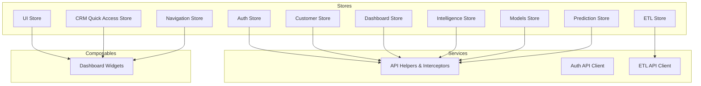
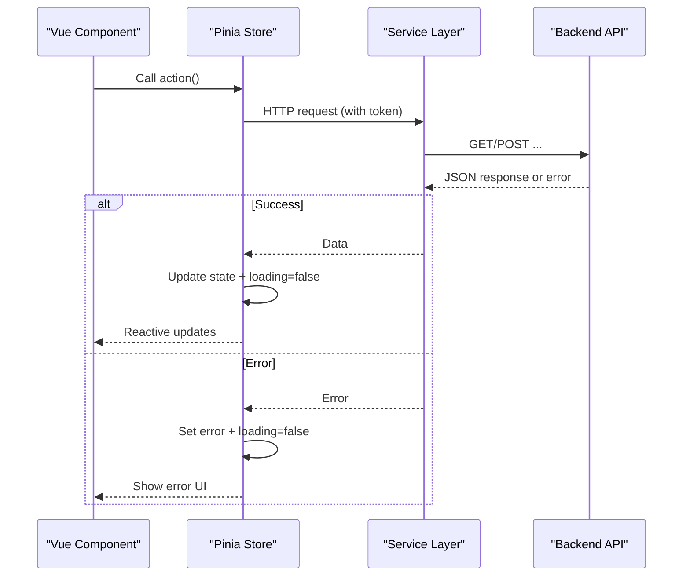
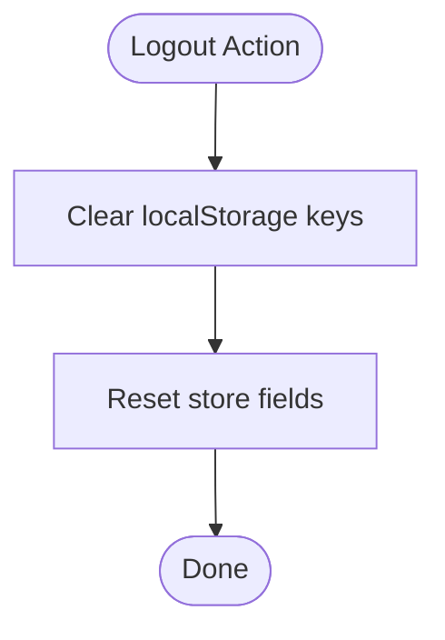
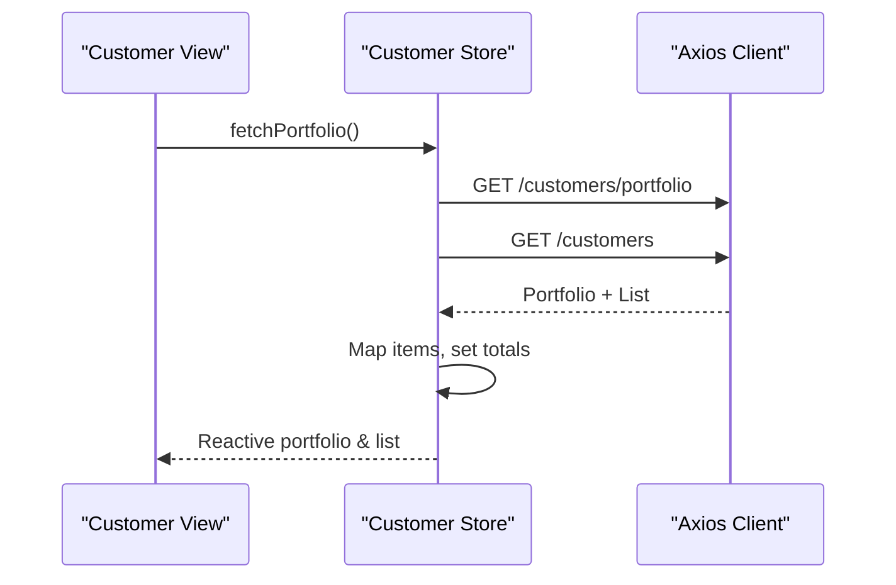
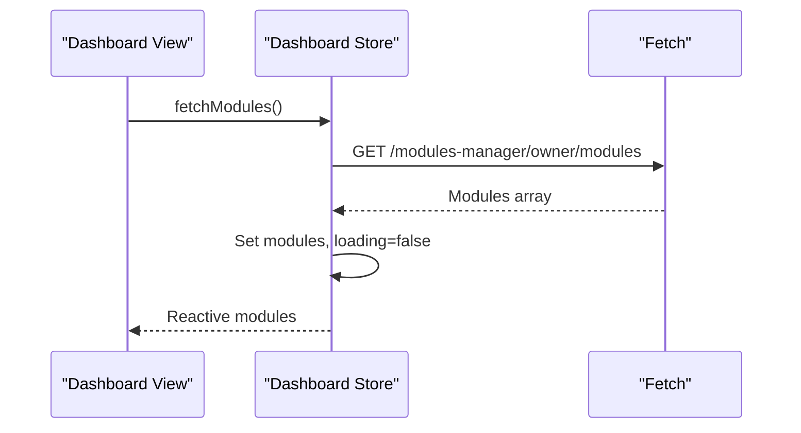
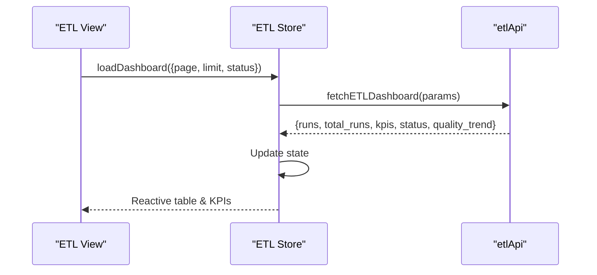
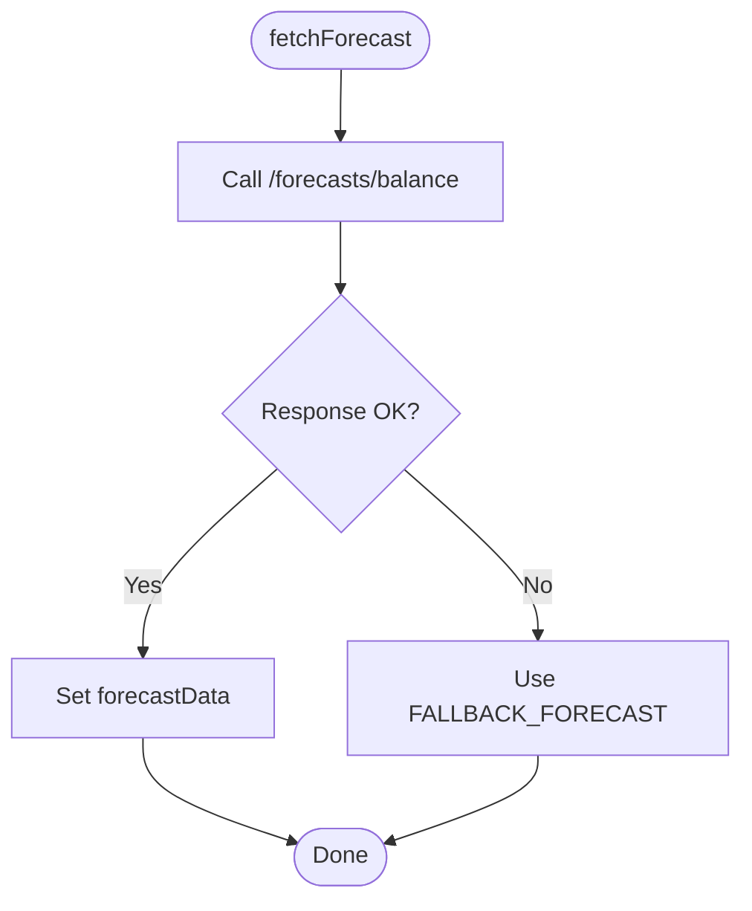
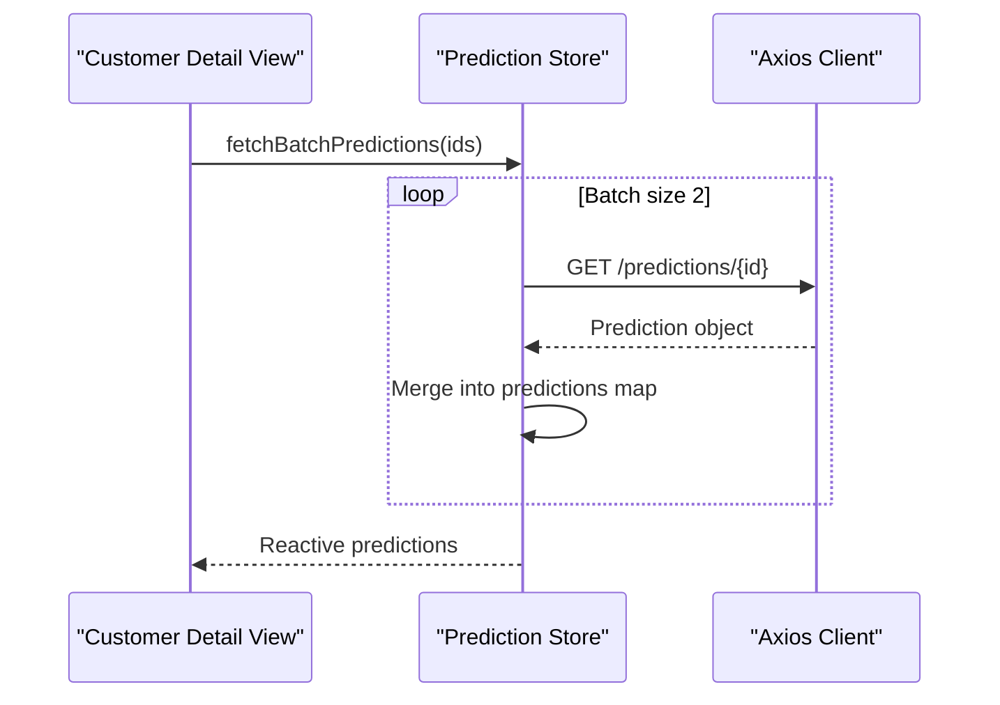
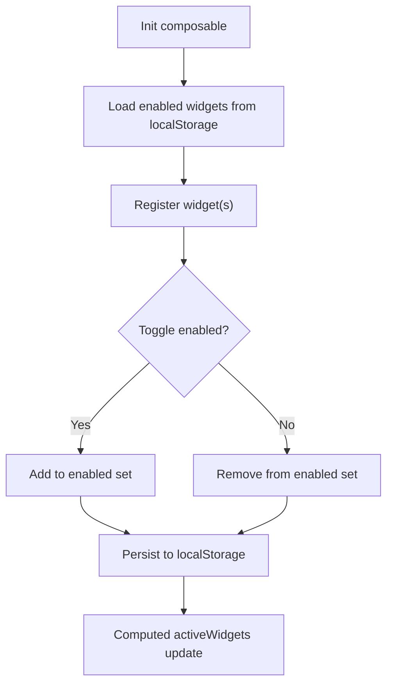
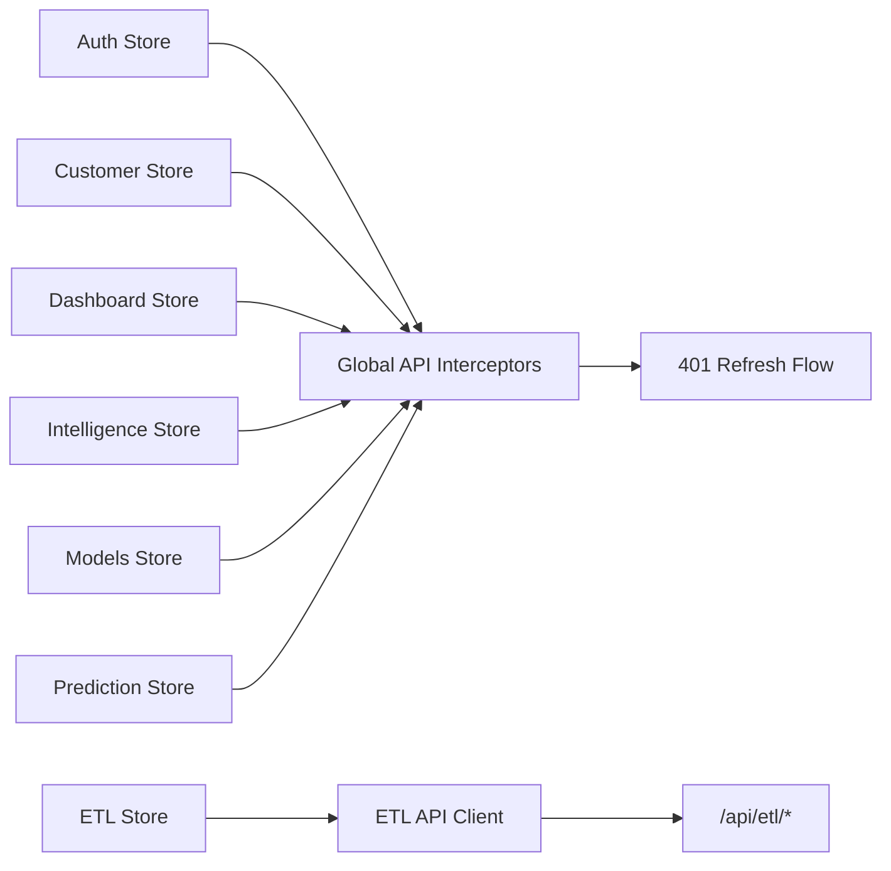

# State Management

<cite>
**Referenced Files in This Document**
- [auth.js](file://src/stores/auth.js)
- [customerStore.js](file://src/stores/customerStore.js)
- [dashboard.js](file://src/stores/dashboard.js)
- [etlStore.js](file://src/stores/etlStore.js)
- [intelligenceStore.js](file://src/stores/intelligenceStore.js)
- [modelsStore.js](file://src/stores/modelsStore.js)
- [predictionStore.js](file://src/stores/predictionStore.js)
- [ui.js](file://src/stores/ui.js)
- [useCRMQuickAccessStore.js](file://src/stores/useCRMQuickAccessStore.js)
- [useNavigationStore.js](file://src/stores/useNavigationStore.js)
- [api.js](file://src/services/api.js)
- [auth_api.js](file://src/services/auth_api.js)
- [etlApi.js](file://src/services/etlApi.js)
- [useDashboardWidgets.js](file://src/composables/useDashboardWidgets.js)
</cite>

## Table of Contents
1. Introduction
2. Project Structure
3. Core Components
4. Architecture Overview
5. Detailed Component Analysis
6. Dependency Analysis
7. Performance Considerations
8. Troubleshooting Guide
9. Conclusion

## Introduction
This document explains the state management architecture of the ABSA Foundry Frontend using Pinia. It covers dedicated stores for authentication, customer data, dashboard metrics, and ETL pipeline state; reactive patterns with actions and computed properties; integration with Vue components via composables; separation of concerns between UI state and business logic; persistence strategies; error handling patterns; and debugging techniques for complex state interactions.

## Project Structure
The application organizes state into focused Pinia stores under src/stores, services under src/services for HTTP clients and API helpers, and reusable logic under src/composables. Stores encapsulate domain state (e.g., customers, predictions, ETL runs), while services centralize network concerns such as token injection, refresh flows, and error normalization. Composables manage UI-level concerns like widget visibility and navigation breadcrumbs.

**Diagram sources**
- [auth.js:1-22](file://src/stores/auth.js#L1-L22)
- [customerStore.js:1-187](file://src/stores/customerStore.js#L1-L187)
- [dashboard.js:1-29](file://src/stores/dashboard.js#L1-L29)
- [etlStore.js:1-96](file://src/stores/etlStore.js#L1-L96)
- [intelligenceStore.js:1-296](file://src/stores/intelligenceStore.js#L1-L296)
- [modelsStore.js:1-54](file://src/stores/modelsStore.js#L1-L54)
- [predictionStore.js:1-171](file://src/stores/predictionStore.js#L1-L171)
- [ui.js:1-22](file://src/stores/ui.js#L1-L22)
- [useCRMQuickAccessStore.js:1-29](file://src/stores/useCRMQuickAccessStore.js#L1-L29)
- [useNavigationStore.js:1-23](file://src/stores/useNavigationStore.js#L1-L23)
- [api.js:1-209](file://src/services/api.js#L1-L209)
- [auth_api.js:1-190](file://src/services/auth_api.js#L1-L190)
- [etlApi.js:1-115](file://src/services/etlApi.js#L1-L115)
- [useDashboardWidgets.js:1-88](file://src/composables/useDashboardWidgets.js#L1-L88)

**Section sources**
- [auth.js:1-22](file://src/stores/auth.js#L1-L22)
- [customerStore.js:1-187](file://src/stores/customerStore.js#L1-L187)
- [dashboard.js:1-29](file://src/stores/dashboard.js#L1-L29)
- [etlStore.js:1-96](file://src/stores/etlStore.js#L1-L96)
- [intelligenceStore.js:1-296](file://src/stores/intelligenceStore.js#L1-L296)
- [modelsStore.js:1-54](file://src/stores/modelsStore.js#L1-L54)
- [predictionStore.js:1-171](file://src/stores/predictionStore.js#L1-L171)
- [ui.js:1-22](file://src/stores/ui.js#L1-L22)
- [useCRMQuickAccessStore.js:1-29](file://src/stores/useCRMQuickAccessStore.js#L1-L29)
- [useNavigationStore.js:1-23](file://src/stores/useNavigationStore.js#L1-L23)
- [api.js:1-209](file://src/services/api.js#L1-L209)
- [auth_api.js:1-190](file://src/services/auth_api.js#L1-L190)
- [etlApi.js:1-115](file://src/services/etlApi.js#L1-L115)
- [useDashboardWidgets.js:1-88](file://src/composables/useDashboardWidgets.js#L1-L88)

## Core Components
- Authentication store: Holds auth tokens and user identity derived from localStorage and exposes getters and logout actions.
- Customer store: Manages portfolio summary, filtered lists, pagination, and per-customer details/timeline/features with robust error handling.
- Dashboard store: Loads module subscriptions for the current owner and tracks loading state.
- ETL store: Paginates and filters pipeline run history and aggregates KPIs/status panels and quality trends.
- Intelligence store: Fetches CLV, lifecycle stages, forecasts, and outcomes with fallback static data when APIs are unavailable.
- Models store: Tracks model registry and derives champion models by type.
- Prediction store: Caches per-customer predictions, health scores, Markov matrix, and churn drivers with batched fetching.
- UI store: Centralized toast/notification helpers.
- Navigation and CRM quick access stores: Lightweight UI state for active modules and breadcrumbs.

Key patterns:
- Reactive state via ref and computed for derived values.
- Actions encapsulate async operations with loading/error states.
- Services centralize HTTP concerns (token injection, refresh, error normalization).
- Composables handle UI-only state and persistence (e.g., widget toggles).

**Section sources**
- [auth.js:1-22](file://src/stores/auth.js#L1-L22)
- [customerStore.js:1-187](file://src/stores/customerStore.js#L1-L187)
- [dashboard.js:1-29](file://src/stores/dashboard.js#L1-L29)
- [etlStore.js:1-96](file://src/stores/etlStore.js#L1-L96)
- [intelligenceStore.js:1-296](file://src/stores/intelligenceStore.js#L1-L296)
- [modelsStore.js:1-54](file://src/stores/modelsStore.js#L1-L54)
- [predictionStore.js:1-171](file://src/stores/predictionStore.js#L1-L171)
- [ui.js:1-22](file://src/stores/ui.js#L1-L22)
- [useCRMQuickAccessStore.js:1-29](file://src/stores/useCRMQuickAccessStore.js#L1-L29)
- [useNavigationStore.js:1-23](file://src/stores/useNavigationStore.js#L1-L23)

## Architecture Overview
The frontend uses a layered approach:
- Stores own domain state and expose actions to mutate it safely.
- Services abstract HTTP calls, token management, and error handling.
- Composables provide UI-specific reactivity and local persistence.
- Vue components consume stores and composables to render views without embedding business logic.

**Diagram sources**
- [api.js:64-146](file://src/services/api.js#L64-L146)
- [customerStore.js:90-131](file://src/stores/customerStore.js#L90-L131)
- [etlStore.js:32-68](file://src/stores/etlStore.js#L32-L68)
- [intelligenceStore.js:242-288](file://src/stores/intelligenceStore.js#L242-L288)

## Detailed Component Analysis

### Authentication Store
Responsibilities:
- Persist and derive auth state from localStorage.
- Provide an isAuthenticated getter.
- Clear credentials on logout.

Reactive patterns:
- State initialized from localStorage for resilience across reloads.
- Getters compute derived booleans for auth checks.

Actions:
- Logout clears persisted tokens and resets store state.

Integration:
- Works alongside service-layer interceptors that attach tokens to requests and handle 401 refresh flows.

**Diagram sources**
- [auth.js:12-20](file://src/stores/auth.js#L12-L20)

**Section sources**
- [auth.js:1-22](file://src/stores/auth.js#L1-L22)
- [api.js:64-146](file://src/services/api.js#L64-L146)
- [auth_api.js:36-87](file://src/services/auth_api.js#L36-L87)

### Customer Store
Responsibilities:
- Load portfolio summary and customer list concurrently.
- Compute filtered and paginated views.
- Fetch per-customer detail, timeline, and features.

Reactive patterns:
- Refs for raw data and UI flags; computed for derived portfolio metrics and filtered lists.

Actions:
- fetchPortfolio, fetchCustomerDetail, fetchCustomerTimeline, fetchCustomerFeatures with consistent loading/error handling.

Error handling:
- Catches network errors, sets user-friendly messages, and resets state to safe defaults.

**Diagram sources**
- [customerStore.js:90-114](file://src/stores/customerStore.js#L90-L114)

**Section sources**
- [customerStore.js:1-187](file://src/stores/customerStore.js#L1-L187)

### Dashboard Store
Responsibilities:
- Fetch subscribed modules for the current owner.
- Track loading state.

Integration:
- Uses base URL and attaches Authorization header from localStorage.

**Diagram sources**
- [dashboard.js:9-25](file://src/stores/dashboard.js#L9-L25)

**Section sources**
- [dashboard.js:1-29](file://src/stores/dashboard.js#L1-L29)
- [api.js:1-18](file://src/services/api.js#L1-L18)

### ETL Store
Responsibilities:
- Load paginated run history and dashboard KPIs/status/quality trend.
- Manage page, limit, and status filter.

Reactive patterns:
- Computed totalPages and isEmpty for UI readiness.

Actions:
- loadDashboard, setPage, setStatusFilter, refresh.

Integration:
- Uses etlApi which normalizes responses and handles errors.

**Diagram sources**
- [etlStore.js:32-68](file://src/stores/etlStore.js#L32-L68)
- [etlApi.js:68-75](file://src/services/etlApi.js#L68-L75)

**Section sources**
- [etlStore.js:1-96](file://src/stores/etlStore.js#L1-L96)
- [etlApi.js:1-115](file://src/services/etlApi.js#L1-L115)

### Intelligence Store
Responsibilities:
- Fetch CLV, lifecycle stages, balance forecast, and retention outcomes.
- Provide fallback static datasets when APIs are unavailable.

Reactive patterns:
- Separate loading flags per feature area.

Actions:
- fetchClv, fetchLifecycle, fetchForecast, fetchOutcomes.

Error handling:
- On failure, populate fallback data to keep UI functional.

**Diagram sources**
- [intelligenceStore.js:266-276](file://src/stores/intelligenceStore.js#L266-L276)

**Section sources**
- [intelligenceStore.js:1-296](file://src/stores/intelligenceStore.js#L1-L296)

### Models Store
Responsibilities:
- Load model registry and derive champion models by type.

Reactive patterns:
- Computed championChurn and championCLV for quick access.

Actions:
- fetchModels with error mapping.

**Section sources**
- [modelsStore.js:1-54](file://src/stores/modelsStore.js#L1-L54)

### Prediction Store
Responsibilities:
- Cache per-customer predictions, health scores, Markov matrix, and churn drivers.
- Support single and batched prediction fetches.

Reactive patterns:
- Maps keyed by customerId for efficient lookups.

Actions:
- fetchChurnProbability, fetchHealthScore, fetchPrediction, fetchMarkovMatrix, fetchBatchPredictions, fetchChurnDrivers.

Error handling:
- Sets error messages and resets partial state on failures.

**Diagram sources**
- [predictionStore.js:110-138](file://src/stores/predictionStore.js#L110-L138)

**Section sources**
- [predictionStore.js:1-171](file://src/stores/predictionStore.js#L1-L171)

### UI, Navigation, and CRM Quick Access Stores
- UI store: Toast helpers for success/info/error notifications.
- Navigation store: Tracks current module and breadcrumbs.
- CRM quick access store: Placeholder for quick access module tracking.

These stores encapsulate UI-only state, keeping business logic out of components.

**Section sources**
- [ui.js:1-22](file://src/stores/ui.js#L1-L22)
- [useNavigationStore.js:1-23](file://src/stores/useNavigationStore.js#L1-L23)
- [useCRMQuickAccessStore.js:1-29](file://src/stores/useCRMQuickAccessStore.js#L1-L29)

### Composables Integration
- useDashboardWidgets: Registers widgets, persists enabled state to localStorage, and exposes computed active/all widgets.
- Provides toggle, enable/disable, and query methods for UI configuration.

**Diagram sources**
- [useDashboardWidgets.js:8-22](file://src/composables/useDashboardWidgets.js#L8-L22)
- [useDashboardWidgets.js:43-73](file://src/composables/useDashboardWidgets.js#L43-L73)

**Section sources**
- [useDashboardWidgets.js:1-88](file://src/composables/useDashboardWidgets.js#L1-L88)

## Dependency Analysis
- Token injection: Multiple stores create Axios instances with request interceptors that read token from localStorage. The shared api.js also configures global interceptors for automatic refresh on 401 and redirects to login when needed.
- ETL flow: etlStore depends on etlApi for normalized responses and error handling.
- Auth flow: auth_api provides login/refresh/signup/logout helpers; api.js centralizes refresh queueing and retry logic.
- UI cohesion: ui, navigation, and CRM quick access stores are independent and consumed by UI layers.

**Diagram sources**
- [api.js:64-146](file://src/services/api.js#L64-L146)
- [auth_api.js:20-27](file://src/services/auth_api.js#L20-L27)
- [etlApi.js:10-16](file://src/services/etlApi.js#L10-L16)
- [customerStore.js:6-12](file://src/stores/customerStore.js#L6-L12)
- [modelsStore.js:6-12](file://src/stores/modelsStore.js#L6-L12)
- [predictionStore.js:6-12](file://src/stores/predictionStore.js#L6-L12)

**Section sources**
- [api.js:1-209](file://src/services/api.js#L1-L209)
- [auth_api.js:1-190](file://src/services/auth_api.js#L1-L190)
- [etlApi.js:1-115](file://src/services/etlApi.js#L1-L115)

## Performance Considerations
- Concurrent requests: Customer store uses Promise.all to fetch portfolio and list simultaneously, reducing latency.
- Pagination and filtering: Computed filteredCustomers computes slices based on pagination, minimizing heavy DOM updates.
- Batched predictions: Prediction store batches requests in small groups to avoid overwhelming the backend.
- Fallback data: Intelligence store provides static datasets to maintain UI responsiveness when APIs are down.
- Token refresh queue: Global interceptor queues concurrent requests during token refresh to prevent cascading 401s.

[No sources needed since this section provides general guidance]

## Troubleshooting Guide
Common issues and remedies:
- 401 Unauthorized:
  - Ensure token exists in localStorage; if missing, redirect to login.
  - If refresh fails, clear tokens and navigate to login.
  - Check that interceptors are attached to all Axios instances used by stores.
- Network errors:
  - Stores set error messages; inspect console warnings for detailed messages.
  - For ETL, etlApi normalizes error payloads; check err.status and err.data.
- Stale data:
  - Re-run relevant actions (e.g., fetchPortfolio, loadDashboard) after changes.
  - Use computed properties to ensure derived state stays consistent.
- Debugging tips:
  - Log store actions and state transitions in browser dev tools.
  - Inspect network tab for request headers and payloads.
  - Verify localStorage contents for tokens and roles.

**Section sources**
- [api.js:78-146](file://src/services/api.js#L78-L146)
- [auth_api.js:36-87](file://src/services/auth_api.js#L36-L87)
- [etlApi.js:18-38](file://src/services/etlApi.js#L18-L38)
- [customerStore.js:105-131](file://src/stores/customerStore.js#L105-L131)
- [etlStore.js:51-57](file://src/stores/etlStore.js#L51-L57)
- [intelligenceStore.js:242-288](file://src/stores/intelligenceStore.js#L242-L288)
- [predictionStore.js:27-79](file://src/stores/predictionStore.js#L27-L79)

## Conclusion
The ABSA Foundry Frontend employs a clean, modular state management strategy with Pinia stores scoped by domain, services centralizing HTTP concerns, and composables managing UI-only state. This separation ensures testability, maintainability, and scalability. Robust error handling, token refresh, and fallback data strategies improve resilience. Following these patterns will help teams extend functionality while keeping UI and business logic well-separated.

[No sources needed since this section summarizes without analyzing specific files]