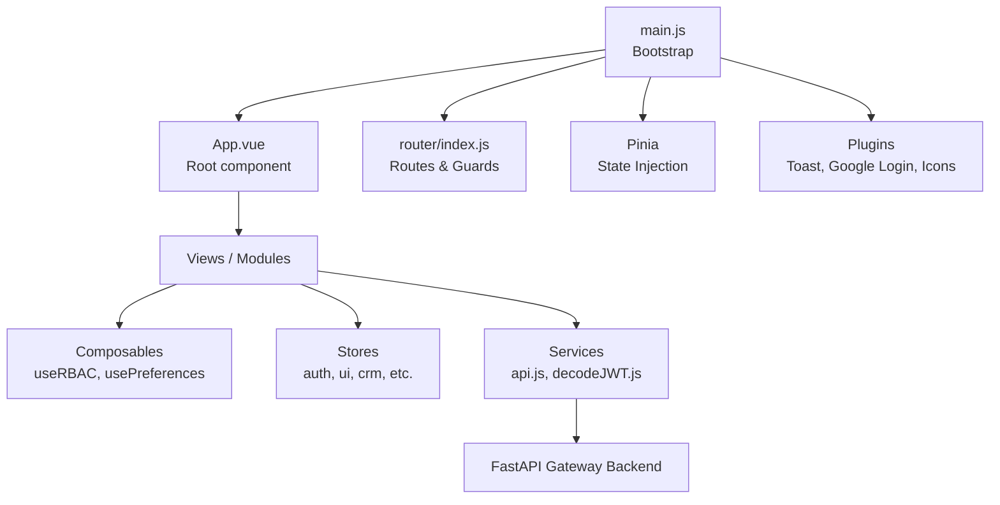
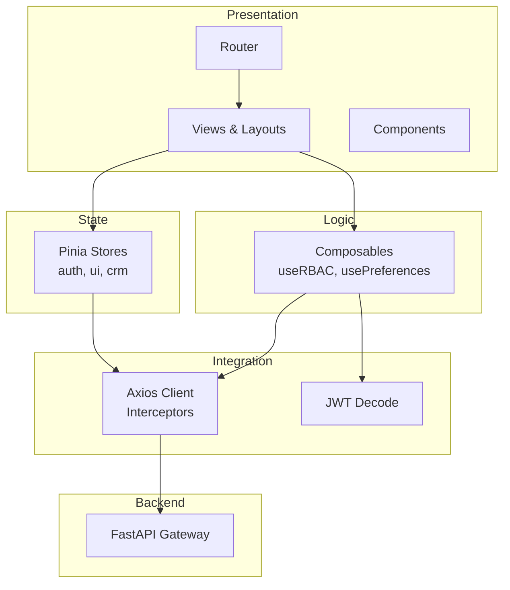
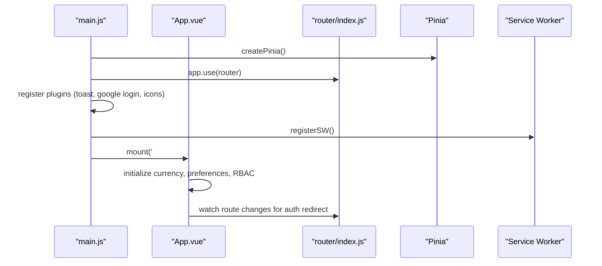
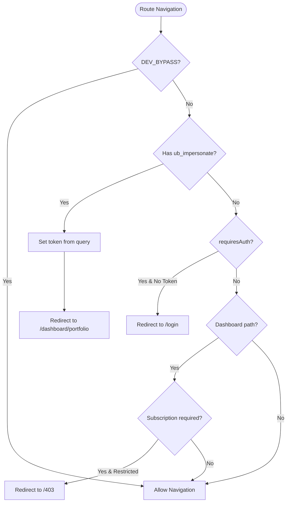
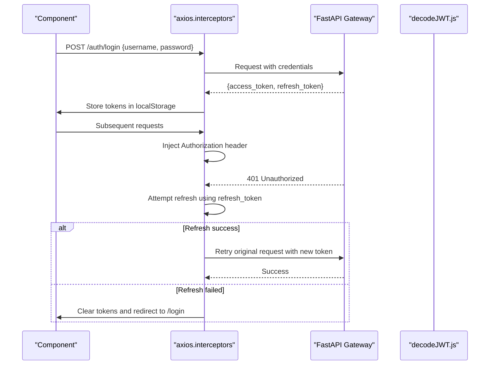
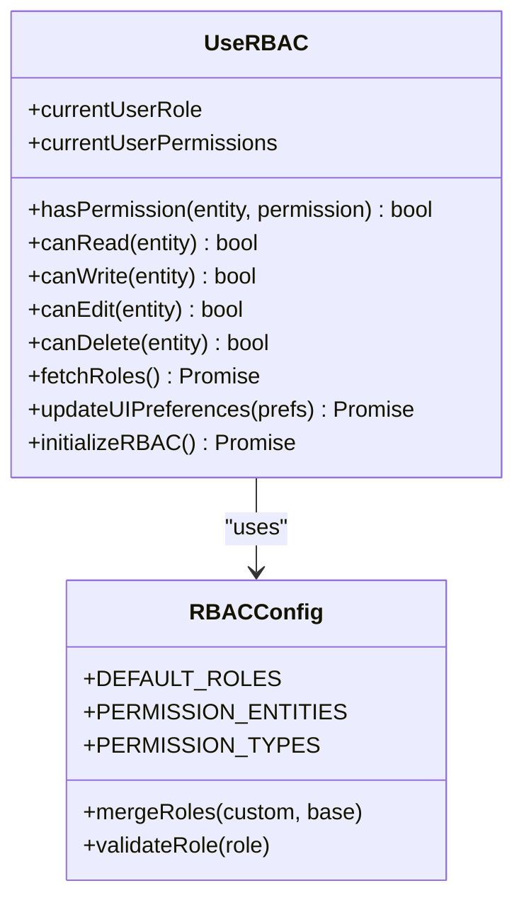
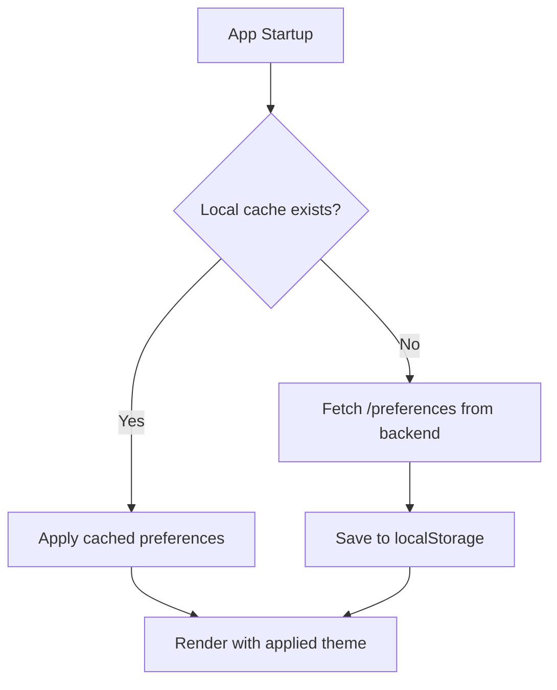
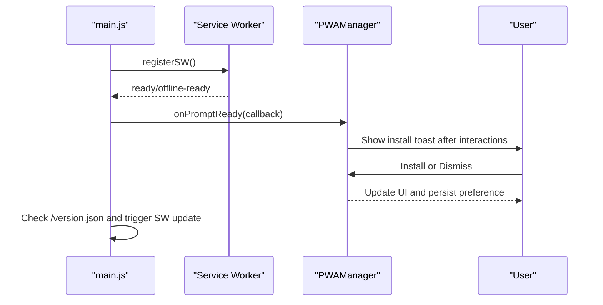
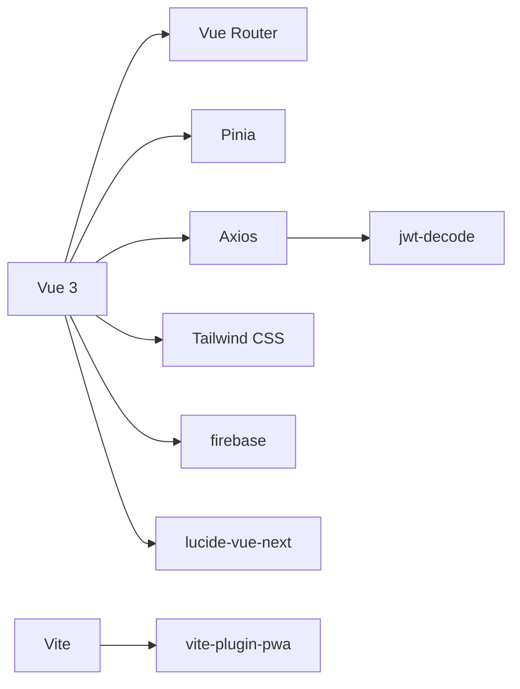

# System Architecture

<cite>
**Referenced Files in This Document**
- [main.js](file://src/main.js)
- [App.vue](file://src/App.vue)
- [index.js](file://src/router/index.js)
- [api.js](file://src/services/api.js)
- [decodeJWT.js](file://src/services/decodeJWT.js)
- [auth.js](file://src/stores/auth.js)
- [useRBAC.js](file://src/composables/useRBAC.js)
- [rbac.js](file://src/config/rbac.js)
- [usePreferences.js](file://src/config/usePreferences.js)
- [pwaManager.js](file://src/utils/pwaManager.js)
- [vite.config.js](file://vite.config.js)
- [tailwind.config.js](file://tailwind.config.js)
- [package.json](file://package.json)
</cite>

## Table of Contents
1. Introduction
2. Project Structure
3. Core Components
4. Architecture Overview
5. Detailed Component Analysis
6. Dependency Analysis
7. Performance Considerations
8. Troubleshooting Guide
9. Conclusion

## Introduction
This document describes the system architecture of the ABSA Foundry Frontend, a Vue 3 application built with the Composition API and a modular, service-oriented design. It covers the bootstrap process, dependency injection via Pinia, global plugin registration, routing and guards, state management, role-based access control (RBAC), PWA capabilities, styling with Tailwind CSS, and communication patterns with the FastAPI Gateway backend. The architecture supports enterprise requirements such as air-gapped deployment, multi-tenant configuration, and secure authentication flows including Google OAuth integration.

## Project Structure
The frontend is organized into feature-focused directories:
- src/components: reusable UI components and layout shells
- src/views: page-level components grouped by modules (CRM, Strategic Management, ETL, etc.)
- src/composables: shared logic encapsulated as Vue composables (e.g., RBAC, preferences, network status)
- src/stores: Pinia stores for cross-cutting state (auth, dashboard, CRM, etc.)
- src/services: HTTP clients and domain services (API gateway, auth, CRM, ETL, notifications)
- src/config: static configuration and composable helpers (RBAC definitions, preferences, dev flags)
- src/utils: utilities (PWA manager, formatting, export helpers)
- src/assets and index.css: global styles and Tailwind entry

**Diagram sources**
- [main.js:70-101](file://src/main.js#L70-L101)
- [index.js:196-275](file://src/router/index.js#L196-L275)
- [api.js:1-18](file://src/services/api.js#L1-L18)

**Section sources**
- [main.js:1-129](file://src/main.js#L1-L129)
- [package.json:1-90](file://package.json#L1-L90)

## Core Components
- Application Bootstrap: Creates the Vue app, registers Pinia, router, plugins, global directives, and initializes PWA and version checks.
- Root App Shell: Manages PWA install prompts, route-based redirects, and initializes currency service, preferences, and RBAC.
- Router and Guards: Centralized navigation with lazy-loaded routes, authentication checks, subscription/module gating, and impersonation token handling.
- State Management: Pinia store for auth tokens and roles; JWT decoding utilities to derive user context from tokens.
- RBAC System: Composable that loads tenant-specific roles and permissions, applies UI preferences, and exposes permission-checking helpers.
- Services Layer: Axios-based client with interceptors for token injection and automatic refresh on 401; helper functions for auth endpoints.
- Styling and Theming: Tailwind CSS with brand tokens and dark mode support; dynamic theme application via RBAC preferences.
- PWA: Service Worker registration, offline strategies, periodic sync, and intelligent install prompt management.

**Section sources**
- [main.js:70-125](file://src/main.js#L70-L125)
- [App.vue:90-198](file://src/App.vue#L90-L198)
- [index.js:196-275](file://src/router/index.js#L196-L275)
- [auth.js:1-22](file://src/stores/auth.js#L1-L22)
- [decodeJWT.js:11-96](file://src/services/decodeJWT.js#L11-L96)
- [useRBAC.js:55-137](file://src/composables/useRBAC.js#L55-L137)
- [api.js:64-146](file://src/services/api.js#L64-L146)
- [tailwind.config.js:1-181](file://tailwind.config.js#L1-L181)
- [vite.config.js:7-41](file://vite.config.js#L7-L41)

## Architecture Overview
The frontend follows a layered architecture:
- Presentation Layer: Vue components and layouts render views based on routes.
- Business Logic Layer: Composables encapsulate domain logic (RBAC, preferences, workflows).
- State Layer: Pinia stores manage cross-component state (auth, UI, module-specific data).
- Integration Layer: Services abstract HTTP calls to the FastAPI Gateway, handle token lifecycle, and error handling.
- Infrastructure Layer: Vite build pipeline, PWA service worker, Tailwind theming, and environment-driven configuration.

**Diagram sources**
- [index.js:196-275](file://src/router/index.js#L196-L275)
- [useRBAC.js:55-137](file://src/composables/useRBAC.js#L55-L137)
- [api.js:64-146](file://src/services/api.js#L64-L146)

## Detailed Component Analysis

### Application Bootstrap and Plugin Registration
- Creates Vue app instance, mounts Pinia, router, and global plugins (toast, Google login, icons).
- Registers directive v-role for role-based rendering.
- Initializes PWA service worker registration with conditional bypass for development.
- Performs startup tasks: currency service initialization, preferences fetch, RBAC initialization, and version check.

**Diagram sources**
- [main.js:70-125](file://src/main.js#L70-L125)
- [App.vue:146-198](file://src/App.vue#L146-L198)

**Section sources**
- [main.js:70-125](file://src/main.js#L70-L125)
- [App.vue:146-198](file://src/App.vue#L146-L198)

### Routing and Access Control
- Defines public and protected routes with lazy loading for performance.
- Global beforeEach guard enforces authentication, subscription/module access, and handles admin impersonation tokens.
- Redirects authenticated users away from login pages and restricts dashboard modules based on roles and allowed modules.

**Diagram sources**
- [index.js:201-275](file://src/router/index.js#L201-L275)

**Section sources**
- [index.js:196-275](file://src/router/index.js#L196-L275)

### Authentication and Token Lifecycle
- Login flow stores access and refresh tokens from the backend response.
- Axios request interceptor injects Authorization header automatically.
- Response interceptor handles 401 errors by refreshing tokens or clearing session and redirecting to login.
- JWT decoding utility extracts user identity, role, email, and branch context; supports dev bypass payload.

**Diagram sources**
- [api.js:64-146](file://src/services/api.js#L64-L146)
- [api.js:166-209](file://src/services/api.js#L166-L209)
- [decodeJWT.js:11-96](file://src/services/decodeJWT.js#L11-L96)

**Section sources**
- [api.js:64-146](file://src/services/api.js#L64-L146)
- [api.js:166-209](file://src/services/api.js#L166-L209)
- [decodeJWT.js:11-96](file://src/services/decodeJWT.js#L11-L96)

### Role-Based Access Control (RBAC)
- Loads tenant-specific roles and merges with defaults; supports deleted role removal.
- Provides permission-checking helpers (canRead, canWrite, canEdit, canDelete, canAssign, canApprove, canExport).
- Applies UI preferences dynamically (theme, fonts, colors) and persists to localStorage for fast load.
- Integrates with route guards and component-level directives for fine-grained access control.

**Diagram sources**
- [useRBAC.js:55-137](file://src/composables/useRBAC.js#L55-L137)
- [rbac.js:85-337](file://src/config/rbac.js#L85-L337)

**Section sources**
- [useRBAC.js:55-137](file://src/composables/useRBAC.js#L55-L137)
- [rbac.js:85-337](file://src/config/rbac.js#L85-L337)

### Preferences and Branding
- Fetches tenant preferences from backend with local cache fallback.
- Applies branding variables to CSS custom properties for consistent theming across the app.
- Persists preferences locally for faster subsequent loads.

**Diagram sources**
- [usePreferences.js:34-66](file://src/config/usePreferences.js#L34-L66)

**Section sources**
- [usePreferences.js:34-66](file://src/config/usePreferences.js#L34-L66)

### PWA and Offline Strategy
- Service Worker registered via Vite PWA plugin with manifest configuration.
- Intelligent install prompt managed by PWAManager, tracking user interactions and cooldowns.
- Periodic background sync registration for maintenance tasks.
- Version checking triggers SW updates when new app versions are detected.

**Diagram sources**
- [vite.config.js:11-35](file://vite.config.js#L11-L35)
- [pwaManager.js:32-121](file://src/utils/pwaManager.js#L32-L121)
- [main.js:35-67](file://src/main.js#L35-L67)

**Section sources**
- [vite.config.js:11-35](file://vite.config.js#L11-L35)
- [pwaManager.js:32-121](file://src/utils/pwaManager.js#L32-L121)
- [main.js:35-67](file://src/main.js#L35-L67)

### Technology Stack
- Framework: Vue 3 with Composition API
- Build System: Vite with PWA plugin and dev tools
- State Management: Pinia
- Routing: Vue Router with lazy loading and guards
- Styling: Tailwind CSS with brand tokens and dark mode
- HTTP Client: Axios with interceptors for token management
- Authentication: Google OAuth via vue3-google-login; JWT-based sessions with FastAPI Gateway
- PWA: Workbox-based service worker with manifest and periodic sync

**Section sources**
- [package.json:13-63](file://package.json#L13-L63)
- [vite.config.js:7-41](file://vite.config.js#L7-L41)
- [tailwind.config.js:1-181](file://tailwind.config.js#L1-L181)
- [main.js:78-101](file://src/main.js#L78-L101)

## Dependency Analysis
Key dependencies and their roles:
- Vue 3, Vue Router, Pinia: Core framework, routing, and state management
- Axios: HTTP client with interceptors for auth and error handling
- jwt-decode: Decodes JWT tokens to extract user context
- firebase: SDK included for potential notification and auth integrations
- tailwindcss: Utility-first CSS framework with custom brand tokens
- vite-plugin-pwa: Service Worker generation and PWA manifest
- lucide-vue-next: Icon library globally registered

**Diagram sources**
- [package.json:13-63](file://package.json#L13-L63)
- [vite.config.js:7-41](file://vite.config.js#L7-L41)

**Section sources**
- [package.json:13-63](file://package.json#L13-L63)

## Performance Considerations
- Lazy Loading: Routes are lazily imported to reduce initial bundle size.
- Interceptors: Centralized token injection and refresh minimize redundant auth logic in components.
- Local Caching: Preferences and RBAC roles cached in localStorage for faster UI rendering.
- PWA Strategies: Service worker precaching and runtime caching improve offline resilience and load times.
- Dev Bypass: Development flag disables service worker and enforces permissive access for rapid iteration.

[No sources needed since this section provides general guidance]

## Troubleshooting Guide
Common issues and resolutions:
- 401 Unauthorized: Ensure refresh token exists; if missing, user is redirected to login. Check backend availability and CORS settings.
- Service Worker Not Registering: Verify VITE_DEV_BYPASS flag; ensure HTTPS in production; check browser console for registration errors.
- Route Guard Loops: Confirm requiresAuth meta flags and token presence; impersonation token must be cleared after redirect.
- RBAC Permissions Not Applied: Validate tenant roles fetched from backend; ensure mergeRoles correctly overrides defaults.
- PWA Install Prompt Not Showing: Ensure beforeinstallprompt event captured; check dismissal count and cooldown; verify site meets PWA criteria.

**Section sources**
- [api.js:90-146](file://src/services/api.js#L90-L146)
- [index.js:201-275](file://src/router/index.js#L201-L275)
- [useRBAC.js:144-226](file://src/composables/useRBAC.js#L144-L226)
- [pwaManager.js:74-121](file://src/utils/pwaManager.js#L74-L121)

## Conclusion
The ABSA Foundry Frontend employs a modern, modular architecture leveraging Vue 3’s Composition API, Pinia for state management, and a robust service layer communicating with a FastAPI Gateway. RBAC ensures enterprise-grade access control, while PWA capabilities and Tailwind theming provide a responsive, branded user experience. The system supports air-gapped deployments through configurable backend URLs, multi-tenant customization via RBAC and preferences, and integrates Google OAuth for streamlined authentication. With centralized routing guards, token lifecycle management, and intelligent PWA prompting, the application balances security, performance, and usability for enterprise environments.

[No sources needed since this section summarizes without analyzing specific files]