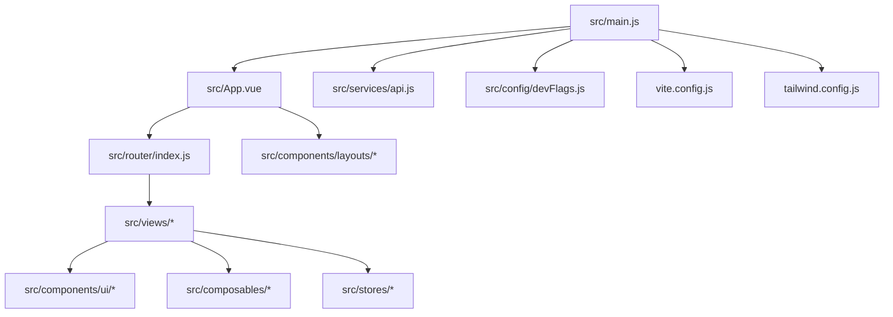
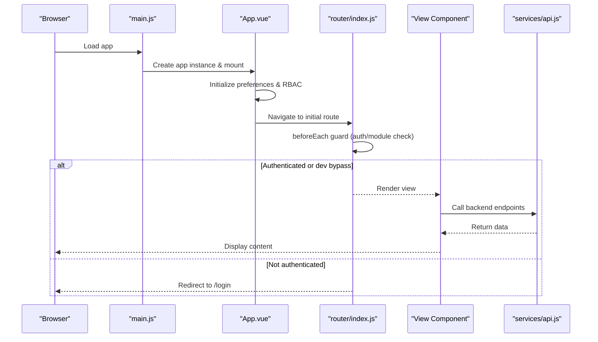
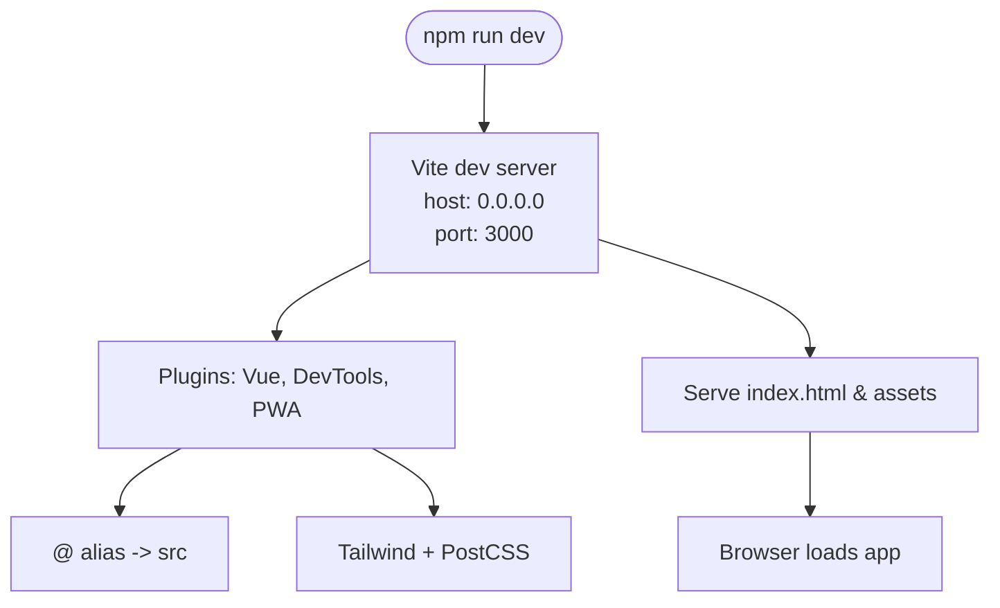
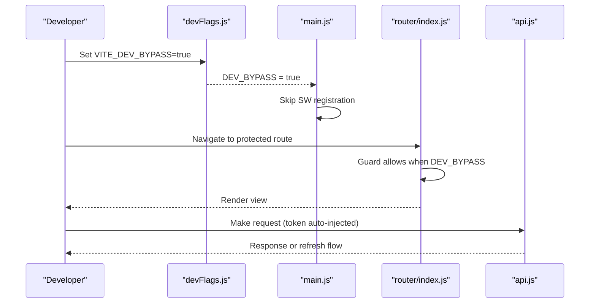
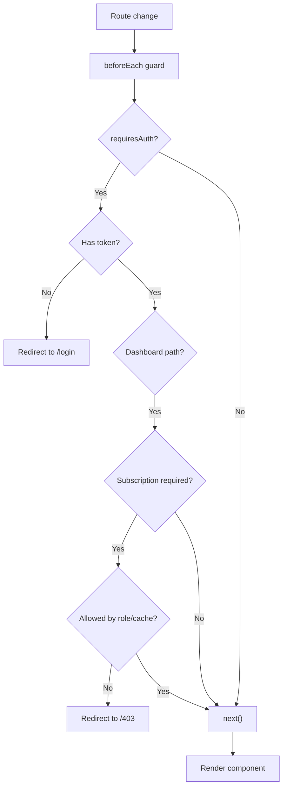
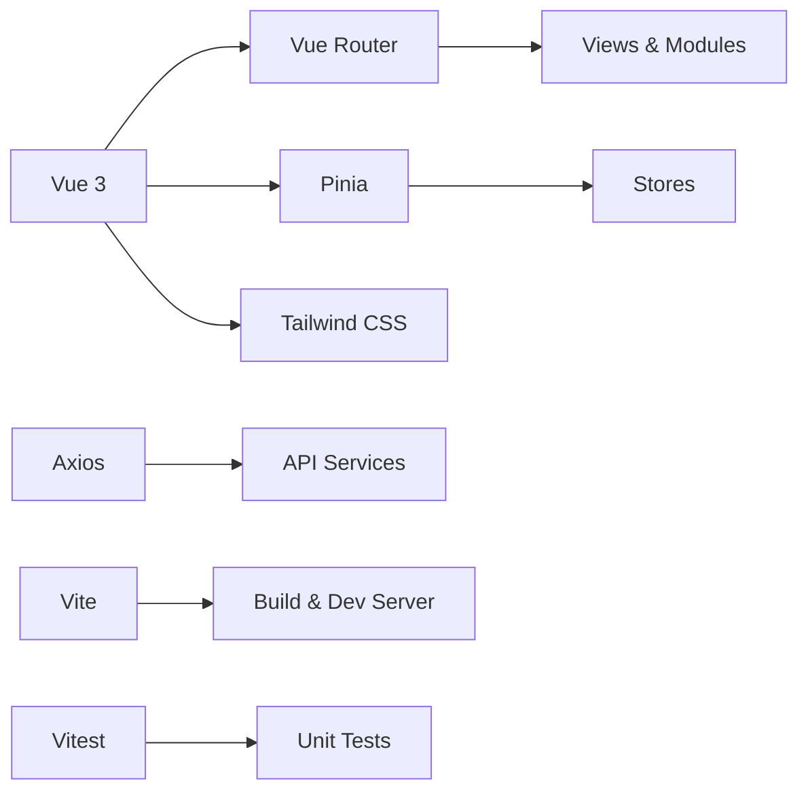

# Getting Started

<cite>
**Referenced Files in This Document**
- [package.json](file://package.json)
- [README.md](file://README.md)
- [vite.config.js](file://vite.config.js)
- [postcss.config.js](file://postcss.config.js)
- [tailwind.config.js](file://tailwind.config.js)
- [vitest.config.js](file://vitest.config.js)
- [jsconfig.json](file://jsconfig.json)
- [src/main.js](file://src/main.js)
- [src/App.vue](file://src/App.vue)
- [src/router/index.js](file://src/router/index.js)
- [src/services/api.js](file://src/services/api.js)
- [src/config/devFlags.js](file://src/config/devFlags.js)
</cite>

## Table of Contents
1. Introduction
2. Project Structure
3. Core Components
4. Architecture Overview
5. Detailed Component Analysis
6. Dependency Analysis
7. Performance Considerations
8. Troubleshooting Guide
9. Conclusion
10. Appendices

## Introduction
This guide helps you set up the ABSA Foundry Frontend for local development, from cloning the repository to running the app and writing your first feature. It covers environment requirements, configuration, project layout, commands, testing, debugging, and common issues.

## Project Structure
The frontend is a Vue 3 + Vite application with Pinia state management, Tailwind CSS styling, and a modular feature layout under src/views/Modules. Key directories:
- src/components: shared UI components and layouts
- src/composables: reusable logic (RBAC, currency, export, network, PWA)
- src/config: app configuration and dev flags
- src/router: route definitions and guards
- src/services: API clients and helpers
- src/stores: Pinia stores
- src/utils: pure utilities
- src/views: page-level components and feature modules
- public: static assets (manifest, version)
- scripts: build-time helpers

**Diagram sources**
- [src/main.js:1-129](file://src/main.js#L1-L129)
- [src/App.vue:1-293](file://src/App.vue#L1-L293)
- [src/router/index.js:1-275](file://src/router/index.js#L1-L275)
- [src/services/api.js:1-209](file://src/services/api.js#L1-L209)
- [src/config/devFlags.js:1-28](file://src/config/devFlags.js#L1-L28)
- [vite.config.js:1-41](file://vite.config.js#L1-L41)
- [tailwind.config.js:1-181](file://tailwind.config.js#L1-L181)

**Section sources**
- [README.md:47-148](file://README.md#L47-L148)
- [package.json:1-90](file://package.json#L1-L90)

## Core Components
- Application bootstrap: initializes Pinia, router, plugins, global directives, and service worker behavior based on environment flags.
- App shell: handles PWA install prompts, session checks, preferences initialization, and RBAC setup.
- Router: defines routes, lazy loads views, and enforces auth/module access via guards.
- API client: centralizes base URL resolution, token injection, refresh flow, and auth endpoints.
- Dev flags: toggles dev bypass mode to skip service worker and provide mock auth session.

Key responsibilities:
- Environment-driven behavior (dev vs production)
- Centralized authentication handling and token refresh
- Route-based navigation and protection
- PWA lifecycle integration

**Section sources**
- [src/main.js:1-129](file://src/main.js#L1-L129)
- [src/App.vue:1-293](file://src/App.vue#L1-L293)
- [src/router/index.js:1-275](file://src/router/index.js#L1-L275)
- [src/services/api.js:1-209](file://src/services/api.js#L1-L209)
- [src/config/devFlags.js:1-28](file://src/config/devFlags.js#L1-L28)

## Architecture Overview
High-level flow during startup and navigation:
- main.js bootstraps the app, registers PWA behavior, and mounts the root component.
- App.vue initializes preferences, RBAC, and PWA interactions.
- Router guards enforce authentication and module access before rendering views.
- Services layer communicates with backend APIs using configured base URLs and tokens.

**Diagram sources**
- [src/main.js:1-129](file://src/main.js#L1-L129)
- [src/App.vue:1-293](file://src/App.vue#L1-L293)
- [src/router/index.js:1-275](file://src/router/index.js#L1-L275)
- [src/services/api.js:1-209](file://src/services/api.js#L1-L209)

## Detailed Component Analysis

### Development Server and Build Configuration
- Vite server runs on host 0.0.0.0 and port 3000 by default.
- PWA plugin is enabled with manifest and icons; dev options can be toggled.
- Alias @ maps to src for clean imports.
- PostCSS pipeline includes Tailwind and Autoprefixer.
- Tailwind config extends theme with brand colors, fonts, spacing, and animations.

**Diagram sources**
- [vite.config.js:1-41](file://vite.config.js#L1-L41)
- [postcss.config.js:1-7](file://postcss.config.js#L1-L7)
- [tailwind.config.js:1-181](file://tailwind.config.js#L1-L181)

**Section sources**
- [vite.config.js:1-41](file://vite.config.js#L1-L41)
- [postcss.config.js:1-7](file://postcss.config.js#L1-L7)
- [tailwind.config.js:1-181](file://tailwind.config.js#L1-L181)

### Authentication Flow and Dev Bypass
- API client resolves backend base URL from environment or defaults to localhost:8080 in local dev.
- Token injection into requests and automatic refresh on 401 are handled centrally.
- Dev bypass flag disables service worker registration and provides mock auth session for local development.

**Diagram sources**
- [src/config/devFlags.js:1-28](file://src/config/devFlags.js#L1-L28)
- [src/main.js:1-129](file://src/main.js#L1-L129)
- [src/router/index.js:1-275](file://src/router/index.js#L1-L275)
- [src/services/api.js:1-209](file://src/services/api.js#L1-L209)

**Section sources**
- [src/config/devFlags.js:1-28](file://src/config/devFlags.js#L1-L28)
- [src/services/api.js:1-209](file://src/services/api.js#L1-L209)
- [src/main.js:1-129](file://src/main.js#L1-L129)
- [src/router/index.js:1-275](file://src/router/index.js#L1-L275)

### Routing and Module Access Control
- Routes define public pages, dashboard sections, and feature modules.
- beforeEach guard enforces authentication and module subscription rules unless dev bypass is active.
- Lazy loading improves performance by splitting code per route.

**Diagram sources**
- [src/router/index.js:1-275](file://src/router/index.js#L1-L275)

**Section sources**
- [src/router/index.js:1-275](file://src/router/index.js#L1-L275)

## Dependency Analysis
Core runtime dependencies include Vue 3, Vue Router, Pinia, Axios, Tailwind CSS, Chart.js, and PWA tooling. Development dependencies cover Vite, Vitest, testing libraries, and build plugins.

**Diagram sources**
- [package.json:1-90](file://package.json#L1-L90)

**Section sources**
- [package.json:1-90](file://package.json#L1-L90)

## Performance Considerations
- Use lazy-loaded routes to reduce initial bundle size.
- Keep shared components generic and scoped components module-specific to enable tree-shaking.
- Prefer composables for cross-cutting concerns to avoid tight coupling.
- Configure Vite optimizeDeps for heavy libraries if needed.
- Avoid unnecessary re-renders by leveraging Pinia stores and computed properties.

[No sources needed since this section provides general guidance]

## Troubleshooting Guide
Common setup issues and resolutions:
- Port conflict on 3000: Change the dev server port in vite.config.js or use an available port.
- Backend connectivity: Ensure VITE_API_BASE_URL points to the correct backend (default localhost:8080 locally).
- Service Worker interference in dev: Set VITE_DEV_BYPASS=true to skip SW registration and clear caches.
- Missing environment variables: Add .env or .env.development with required variables like VITE_API_BASE_URL and VITE_GOOGLE_CLIENT_ID.
- Node.js version mismatch: Use Node.js 18+ as specified in prerequisites.
- Test environment errors: Confirm jsdom environment and setup files in vitest.config.js.

Steps to resolve:
- Verify Node.js version and reinstall dependencies if necessary.
- Clear browser cache and service workers when switching environments.
- Validate axios interceptors and token storage for API calls.
- Review route guards and dev bypass settings for unexpected redirects.

**Section sources**
- [vite.config.js:1-41](file://vite.config.js#L1-L41)
- [src/services/api.js:1-209](file://src/services/api.js#L1-L209)
- [src/config/devFlags.js:1-28](file://src/config/devFlags.js#L1-L28)
- [vitest.config.js:1-17](file://vitest.config.js#L1-L17)
- [README.md:461-495](file://README.md#L461-L495)

## Conclusion
You now have the essentials to set up, run, and extend the ABSA Foundry Frontend. Use the provided commands to start development, build for production, and run tests. Follow the architecture and patterns to integrate new features safely and efficiently.

[No sources needed since this section summarizes without analyzing specific files]

## Appendices

### Quick Start Commands
- Install dependencies: npm install
- Start development server: npm run dev
- Run tests: npm test
- Build for production: npm run build
- Preview production build: npm run preview

**Section sources**
- [package.json:1-90](file://package.json#L1-L90)
- [README.md:461-495](file://README.md#L461-L495)

### Environment Variables
- VITE_API_BASE_URL: Backend API URL (defaults to localhost:8080 in local dev)
- VITE_DEV_BYPASS: Enable dev bypass to skip service worker and mock auth
- VITE_GOOGLE_CLIENT_ID: Google OAuth client ID (optional)

Set these in .env or .env.development as appropriate.

**Section sources**
- [README.md:486-495](file://README.md#L486-L495)
- [src/services/api.js:1-209](file://src/services/api.js#L1-L209)
- [src/config/devFlags.js:1-28](file://src/config/devFlags.js#L1-L28)

### Creating a New Component
- Place shared components under src/components/ui or src/components.
- Import and use within views or other components.
- Keep styling consistent with Tailwind classes and design tokens.

**Section sources**
- [README.md:68-82](file://README.md#L68-L82)
- [tailwind.config.js:1-181](file://tailwind.config.js#L1-L181)

### Adding a Route
- Define a new route in src/router/index.js with lazy-loaded component import.
- Optionally add meta fields for title and auth requirements.
- Ensure navigation links point to the new route.

**Section sources**
- [src/router/index.js:1-275](file://src/router/index.js#L1-L275)

### Integrating with Backend APIs
- Use services/api.js for centralized base URL and token handling.
- Call endpoints via axios with proper headers; handle 401 refresh automatically.
- Store tokens in localStorage as managed by the API client.

**Section sources**
- [src/services/api.js:1-209](file://src/services/api.js#L1-L209)

### Development Workflow Tips
- Hot reload: Enabled by Vite; changes reflect instantly in the browser.
- Debugging: Use browser DevTools and Vue DevTools; logs appear in console for SW events and API calls.
- IDE recommendations: VS Code with Vue and Tailwind extensions; configure jsconfig.json path aliases.

**Section sources**
- [vite.config.js:1-41](file://vite.config.js#L1-L41)
- [jsconfig.json:1-15](file://jsconfig.json#L1-L15)
- [src/main.js:1-129](file://src/main.js#L1-L129)