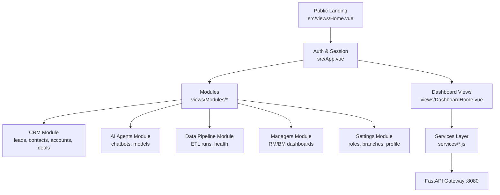
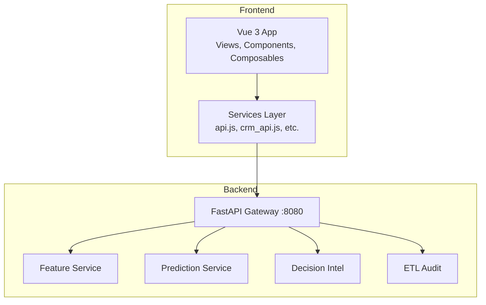
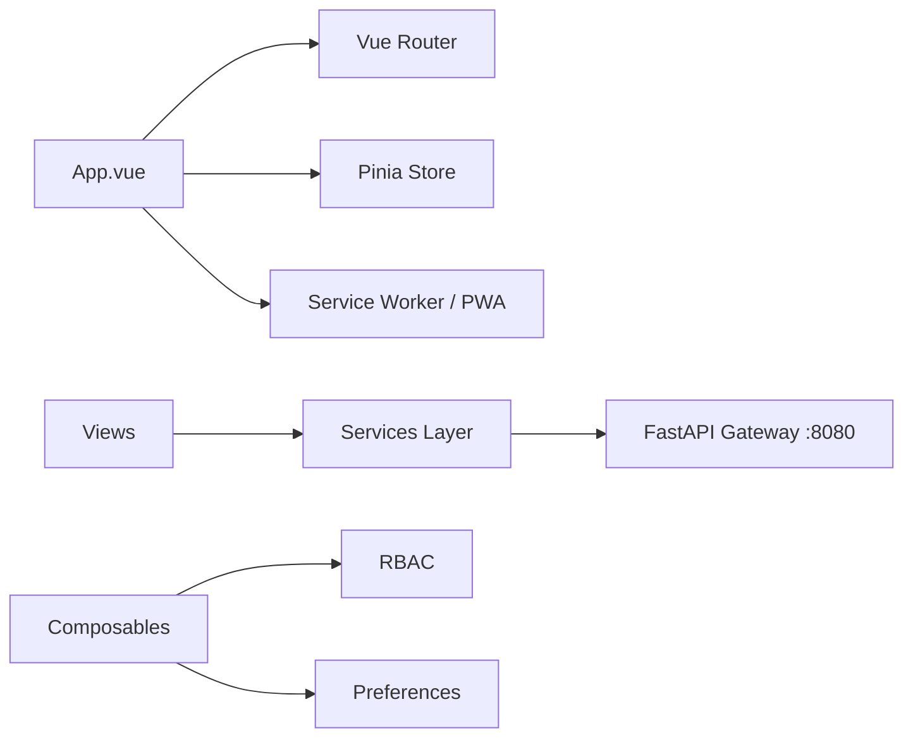

# Introduction & Purpose

<cite>
**Referenced Files in This Document**
- [README.md](file://README.md)
- [Home.vue](file://src/views/Home.vue)
- [index.html](file://index.html)
- [FRONTEND-REQUIREMENTS.md](file://docs/FRONTEND-REQUIREMENTS.md)
- [main.js](file://src/main.js)
- [App.vue](file://src/App.vue)
</cite>

## Table of Contents
1. [Introduction](#introduction)
2. [Project Structure](#project-structure)
3. [Core Components](#core-components)
4. [Architecture Overview](#architecture-overview)
5. [Detailed Component Analysis](#detailed-component-analysis)
6. [Dependency Analysis](#dependency-analysis)
7. [Performance Considerations](#performance-considerations)
8. [Troubleshooting Guide](#troubleshooting-guide)
9. [Conclusion](#conclusion)

## Introduction
ABSA Foundry Frontend is an AI-driven banking analytics platform built for ABSA Bank Zambia’s Intelligence Unit. It transforms raw customer and portfolio data into actionable insights through machine learning models, enabling:
- Customer lifecycle prediction (Active, At Risk, Dormant, Churned) with early warnings
- Retention management via Next Best Action recommendations and action logging
- Portfolio intelligence dashboards for Relationship Managers and Branch Managers

The platform is designed for air-gapped, on-premise deployment within the bank’s internal network, ensuring sensitive banking data never leaves the secure environment while still delivering advanced analytics and strategic planning tools.

Mission statement (as reflected in the application): Predictive Customer Lifecycle & Attrition Intelligence — transforming customer retention from reactive outreach to proactive AI precision with real-time churn risk detection, explainable AI drivers, and Next Best Action recommendations integrated directly into core banking workflows.

Target users:
- Banking professionals: Relationship Managers, Branch Managers
- Analysts: Data Scientists, Operations/Data Quality staff
- Executives: Branch/Portfolio leaders using aggregated KPIs and forecasts

Core value propositions:
- Proactive retention with 60-day predictive lookahead and explainable drivers
- Integrated CRM and portfolio views with audit-compliant action logging
- Air-gapped security with RBAC, end-to-end audit logs, and zero external data transmission
- Operational visibility into ETL runs, data quality, and system health

Competitive advantages over traditional CRM systems:
- ML-powered churn risk scoring and NBA recommendations vs. static records
- Explainable AI insights that guide RM actions rather than just reporting history
- Tight integration with core banking workflows and internal LDAP authentication
- On-premises deployment aligned with bank security policies

**Section sources**
- [README.md:1-4](file://README.md#L1-L4)
- [Home.vue:33-55](file://src/views/Home.vue#L33-L55)
- [index.html:14-19](file://index.html#L14-L19)
- [FRONTEND-REQUIREMENTS.md:6-20](file://docs/FRONTEND-REQUIREMENTS.md#L6-L20)

## Project Structure
The frontend is a Vue 3 application organized into shared components, scoped module components, composables, services, stores, and views. The landing page communicates the platform’s purpose and capabilities to internal users, while authenticated views deliver role-based dashboards and analytics.

**Diagram sources**
- [README.md:8-28](file://README.md#L8-L28)
- [README.md:47-148](file://README.md#L47-L148)

**Section sources**
- [README.md:8-28](file://README.md#L8-L28)
- [README.md:47-148](file://README.md#L47-L148)

## Core Components
- Public landing and messaging: Communicates mission, capabilities, and security posture to internal stakeholders.
- Authentication and session handling: Enforces LDAP login and redirects authenticated users appropriately.
- Role-aware dashboards: Provide tailored views for RMs, Branch Managers, Data Scientists, and Operations.
- Services layer: Encapsulates API calls to the FastAPI Gateway for CRM, predictions, ETL, and performance data.
- Stores and composables: Manage state and reusable logic across modules (e.g., RBAC, preferences).

Key implementation anchors:
- App initialization and service worker registration for offline-ready experience
- Global currency plugin and toast notifications
- PWA install prompt and background sync registration

**Section sources**
- [main.js:1-129](file://src/main.js#L1-L129)
- [App.vue:90-198](file://src/App.vue#L90-L198)
- [FRONTEND-REQUIREMENTS.md:24-41](file://docs/FRONTEND-REQUIREMENTS.md#L24-L41)

## Architecture Overview
The platform follows a layered architecture:
- Presentation: Vue 3 UI with role-based views and shared design system
- Application logic: Composables and stores for cross-cutting concerns
- Services: HTTP clients to the FastAPI Gateway
- Backend: Feature Service, Prediction Service, Decision Intel, ETL Audit
- Deployment: On-premise Ubuntu + Nginx; no internet or CDN usage

**Diagram sources**
- [README.md:8-28](file://README.md#L8-L28)
- [FRONTEND-REQUIREMENTS.md:6-20](file://docs/FRONTEND-REQUIREMENTS.md#L6-L20)

## Detailed Component Analysis

### Mission, Target Users, and Value Propositions
- Mission: Deliver predictive customer lifecycle and attrition intelligence to shift retention from reactive to proactive.
- Target users: Relationship Managers, Branch Managers, Data Scientists, Operations, and executives requiring portfolio insights.
- Value propositions: Early churn detection, explainable AI, NBA guidance, audit-compliant action logging, and secure on-prem deployment.

Evidence in code:
- Hero messaging emphasizes proactive AI precision and integration with core banking workflows.
- Security badge highlights air-gapped deployment and bank-grade encryption.
- Requirements define role-based access and internal LDAP authentication.

**Section sources**
- [Home.vue:33-55](file://src/views/Home.vue#L33-L55)
- [FRONTEND-REQUIREMENTS.md:24-41](file://docs/FRONTEND-REQUIREMENTS.md#L24-L41)

### Air-Gapped On-Premise Deployment and Security
- No internet or CDN usage; all assets vendored for internal networks.
- Internal LDAP/Active Directory authentication; no social logins.
- RBAC enforced per role; audit logging for sensitive actions.
- Zero external data transmission; all requests go to the local FastAPI Gateway.

Implementation anchors:
- Build and deployment constraints specify on-premise Ubuntu + Nginx.
- App initializes service worker for offline readiness when allowed by policy.
- Auth flows rely on LDAP and token-based sessions.

**Section sources**
- [FRONTEND-REQUIREMENTS.md:6-20](file://docs/FRONTEND-REQUIREMENTS.md#L6-L20)
- [main.js:35-67](file://src/main.js#L35-L67)
- [App.vue:145-198](file://src/App.vue#L145-L198)

### Customer Lifecycle Prediction and Retention Management
- Lifecycle states: Active, At Risk, Dormant, Churned with timelines and explanations.
- Health Score gauges and SHAP-based feature importance for transparency.
- Next Best Action engine provides ranked retention recommendations with confidence and impact.
- Action logging ensures accountability and auditability.

User-facing screens:
- RM Dashboard with KPI cards, alerts, and customer table
- Customer Detail with profile, health score, timeline, explanations, and NBA
- Branch Manager view with team performance and churn forecasts

**Section sources**
- [FRONTEND-REQUIREMENTS.md:44-122](file://docs/FRONTEND-REQUIREMENTS.md#L44-L122)
- [FRONTEND-REQUIREMENTS.md:124-159](file://docs/FRONTEND-REQUIREMENTS.md#L124-L159)

### Portfolio Intelligence and Strategic Planning Tools
- Portfolio views include churn risk heatmaps, state distribution charts, and health score histograms.
- Branch-level KPIs and team performance tables support managerial oversight.
- Forecasting projections for next 30/60/90 days aid strategic planning.

Operational visibility:
- ETL run history, data quality dashboards, and system health monitoring ensure reliable analytics.

**Section sources**
- [FRONTEND-REQUIREMENTS.md:107-122](file://docs/FRONTEND-REQUIREMENTS.md#L107-L122)
- [FRONTEND-REQUIREMENTS.md:124-179](file://docs/FRONTEND-REQUIREMENTS.md#L124-L179)

### Competitive Advantages Over Traditional CRM Systems
- ML-driven churn prediction and NBA recommendations vs. static record keeping
- Explainable AI insights guiding RM actions
- Tight integration with core banking workflows and internal auth
- Secure, on-premises deployment aligned with bank policies

Evidence in code:
- Landing page features highlight AI health scoring, explainable drivers, and NBA engine
- Security section emphasizes RBAC, audit logs, and zero external data transmission

**Section sources**
- [Home.vue:209-247](file://src/views/Home.vue#L209-L247)

## Dependency Analysis
The frontend depends on:
- Vue 3 ecosystem (router, Pinia, Tailwind CSS)
- Services layer for API calls to the FastAPI Gateway
- Role-based access control and preferences management
- PWA capabilities for offline readiness and periodic sync

**Diagram sources**
- [main.js:1-129](file://src/main.js#L1-L129)
- [App.vue:90-198](file://src/App.vue#L90-L198)
- [FRONTEND-REQUIREMENTS.md:6-20](file://docs/FRONTEND-REQUIREMENTS.md#L6-L20)

**Section sources**
- [main.js:1-129](file://src/main.js#L1-L129)
- [App.vue:90-198](file://src/App.vue#L90-L198)

## Performance Considerations
- Client-side rendering optimized with Vue 3 Composition API and Vite build tooling
- Service worker enables caching and background sync where permitted by policy
- Efficient routing and component scoping reduce bundle size and improve load times
- API calls are centralized in services with consistent error handling and timeouts

[No sources needed since this section provides general guidance]

## Troubleshooting Guide
Common issues and mitigations:
- Service worker registration failures: Check dev bypass flags and browser support; review console errors during startup
- Authentication problems: Ensure LDAP connectivity and correct token handling; verify session timeout behavior
- API connectivity: Confirm FastAPI Gateway availability on port 8080 and proper CORS/headers configuration
- Offline readiness: Validate PWA install prompts and background sync registration

Operational checks:
- Use ETL run history and data quality dashboards to identify pipeline issues
- Monitor system health endpoints for PostgreSQL, Redis, and API gateway status

**Section sources**
- [main.js:35-67](file://src/main.js#L35-L67)
- [App.vue:145-198](file://src/App.vue#L145-L198)
- [FRONTEND-REQUIREMENTS.md:163-179](file://docs/FRONTEND-REQUIREMENTS.md#L163-L179)

## Conclusion
ABSA Foundry Frontend delivers a secure, AI-powered analytics platform tailored for ABSA Bank Zambia’s Intelligence Unit. By combining predictive lifecycle modeling, retention management, and portfolio intelligence with robust on-premises security and audit compliance, it empowers banking professionals to act proactively and strategically. Its competitive edge lies in explainable AI, integrated workflows, and enterprise-grade deployment constraints that align with banking regulations and operational needs.

[No sources needed since this section summarizes without analyzing specific files]