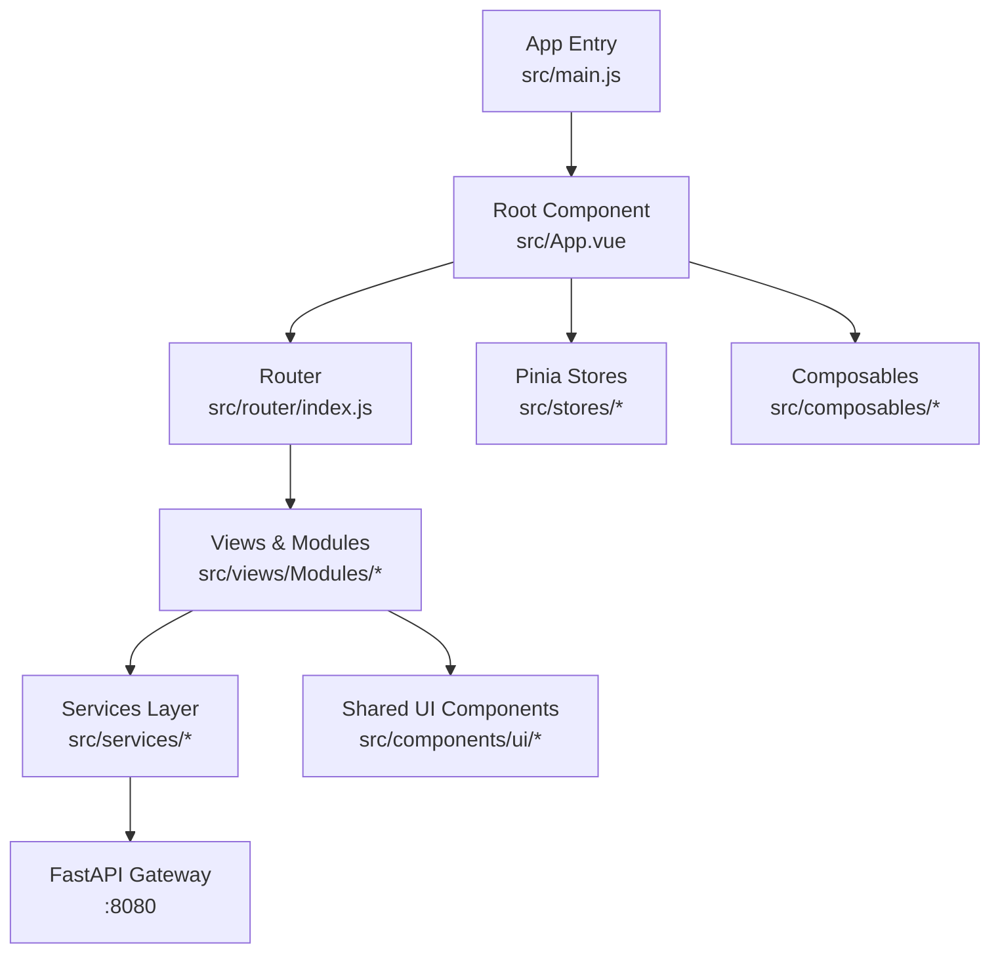
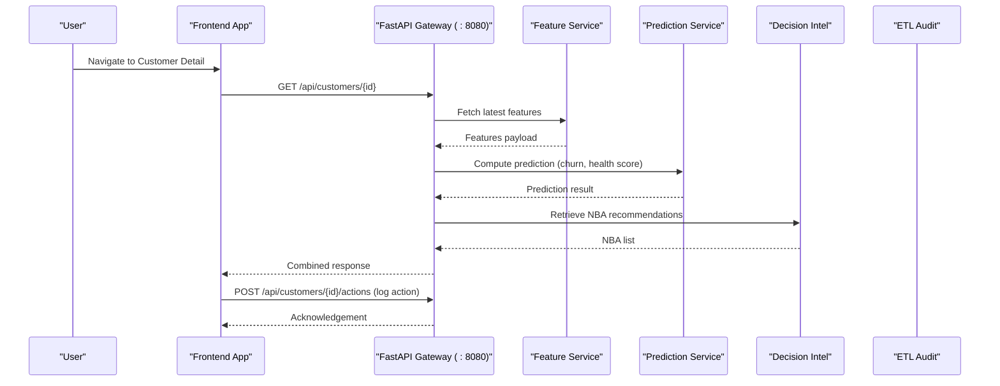
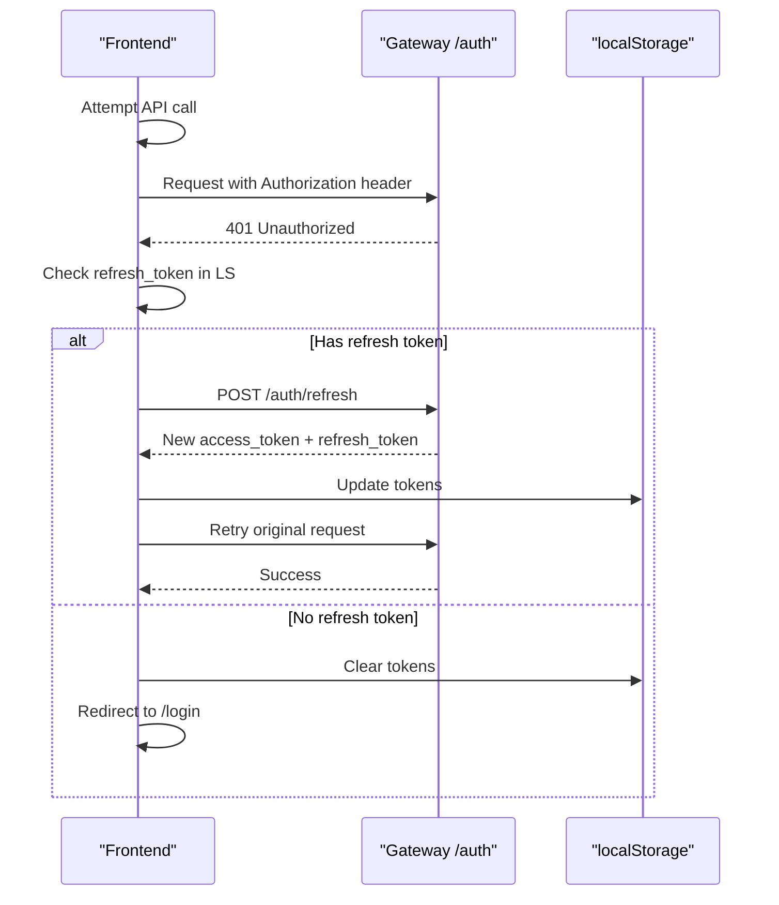
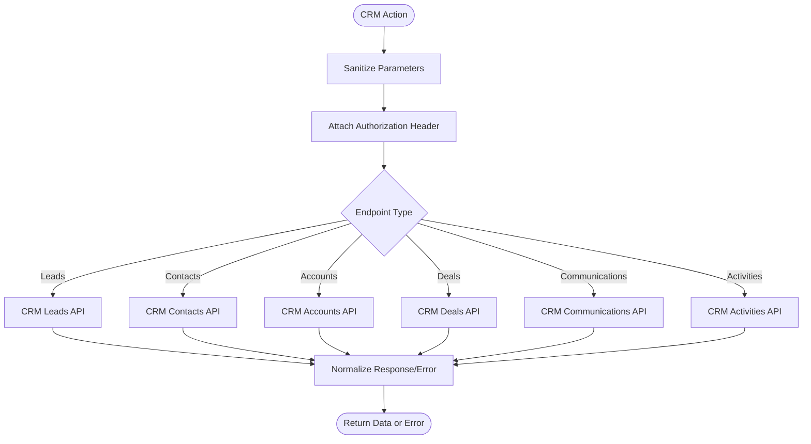
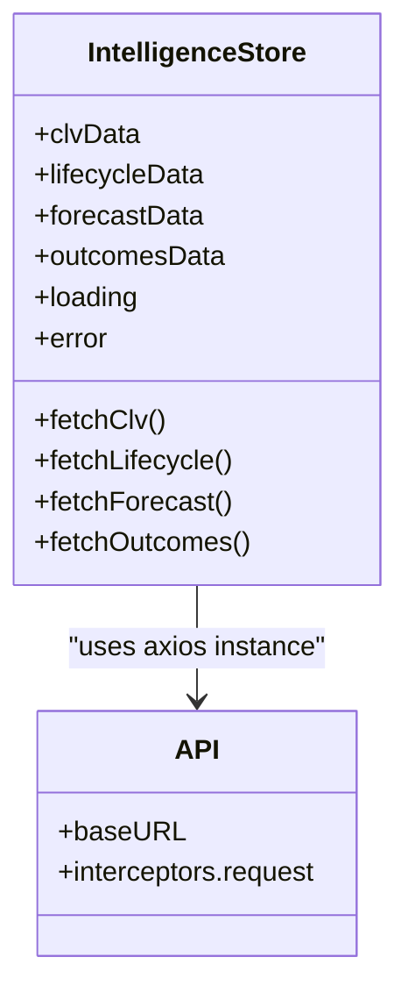
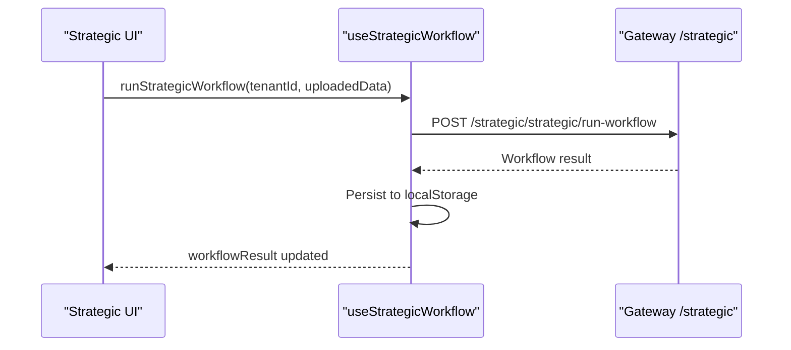
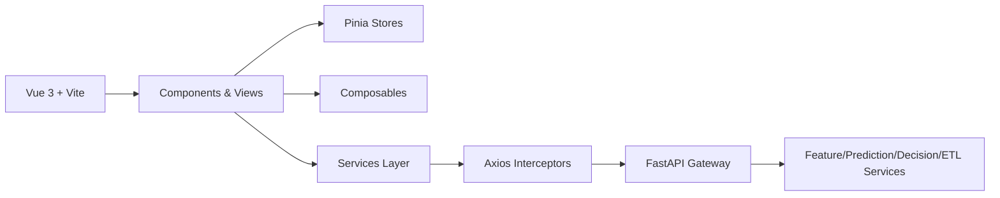

# Project Overview

<cite>
**Referenced Files in This Document**
- [README.md](file://README.md)
- [package.json](file://package.json)
- [vite.config.js](file://vite.config.js)
- [src/main.js](file://src/main.js)
- [src/App.vue](file://src/App.vue)
- [src/router/index.js](file://src/router/index.js)
- [src/services/api.js](file://src/services/api.js)
- [src/stores/auth.js](file://src/stores/auth.js)
- [src/composables/useStrategicWorkflow.js](file://src/composables/useStrategicWorkflow.js)
- [src/services/crm_api.js](file://src/services/crm_api.js)
- [src/stores/intelligenceStore.js](file://src/stores/intelligenceStore.js)
- [src/views/Modules/intelligence/LifecyclePrediction.vue](file://src/views/Modules/intelligence/LifecyclePrediction.vue)
- [docs/FRONTEND-REQUIREMENTS.md](file://docs/FRONTEND-REQUIREMENTS.md)
- [docs/AUTH-INTEGRATION.md](file://docs/AUTH-INTEGRATION.md)
</cite>

## Table of Contents
1. Introduction
2. Project Structure
3. Core Components
4. Architecture Overview
5. Detailed Component Analysis
6. Dependency Analysis
7. Performance Considerations
8. Troubleshooting Guide
9. Conclusion

## Introduction
ABSA Foundry Frontend is an AI-driven banking analytics platform built for ABSA Bank Zambia’s Intelligence Unit. It enables customer lifecycle prediction, retention management, and portfolio intelligence through a secure, air-gapped on-premise deployment. The application provides role-based dashboards for Relationship Managers, Branch Managers, Data Scientists, and Operations staff to monitor churn risk, execute Next Best Actions (NBA), and manage data pipelines that feed AI models.

Key characteristics:
- Purpose: Deliver actionable insights across the customer lifecycle to improve retention and portfolio performance.
- Deployment: On-premise Ubuntu with Nginx; no external CDN or internet access required.
- Integration: Communicates with a FastAPI Gateway that orchestrates Feature Service, Prediction Service, Decision Intelligence, ETL Audit, and other backend services.
- User experience: Desktop-first, Chromium-based browsers, with PWA support for offline readiness and background sync where available.

Practical use cases:
- CRM workflows: Manage leads, contacts, accounts, deals, communications, meetings, visits, and WhatsApp interactions.
- Strategic planning: Run strategic workflows, track goals, milestones, KPIs, and outcomes.
- Data pipeline management: Monitor ETL runs, quality scores, and system health.

**Section sources**
- [README.md:1-45](file://README.md#L1-L45)
- [docs/FRONTEND-REQUIREMENTS.md:6-20](file://docs/FRONTEND-REQUIREMENTS.md#L6-L20)

## Project Structure
The frontend follows a modular architecture with clear separation between shared and scoped components, composables, stores, services, and views.

Highlights:
- Framework: Vue 3 with Composition API and Vite.
- State: Pinia as primary state store; legacy Vuex modules remain but are not used by default.
- Routing: Vue Router 4 with centralized guards for authentication and module access.
- Styling: Tailwind CSS with ABSA design tokens and custom patterns.
- HTTP: Axios with interceptors for token injection and refresh handling; fetch-based service modules also exist for specific domains.
- PWA: vite-plugin-pwa configured for installability and background updates.

**Diagram sources**
- [src/main.js:70-76](file://src/main.js#L70-L76)
- [src/App.vue:90-103](file://src/App.vue#L90-L103)
- [src/router/index.js:196-199](file://src/router/index.js#L196-L199)
- [src/services/api.js:1-18](file://src/services/api.js#L1-L18)

**Section sources**
- [README.md:31-44](file://README.md#L31-L44)
- [README.md:47-148](file://README.md#L47-L148)
- [package.json:13-63](file://package.json#L13-L63)
- [vite.config.js:7-35](file://vite.config.js#L7-L35)

## Core Components
This section outlines the foundational building blocks that power the platform.

- Application bootstrap and global setup:
  - Initializes Pinia, Vue Router, currency plugin, Google OAuth, toast notifications, and PWA registration.
  - Handles dev bypass flags to skip service worker during development.

- Root component orchestration:
  - Manages session checks, PWA prompts, preferences initialization, RBAC initialization, and periodic background sync registration.

- Routing and access control:
  - Centralized route guard enforces authentication and subscription/module access based on roles and local cache.
  - Supports impersonation via URL query parameter for admin flows.

- Authentication and token lifecycle:
  - JWT-based login and refresh endpoints at the FastAPI Gateway.
  - Axios interceptors inject Authorization headers and handle 401 auto-refresh with queueing.
  - Auth store maintains token, user role, and email from localStorage.

- Services layer:
  - Unified base URL resolution for internal network deployments.
  - Domain-specific APIs (CRM, documents, notifications, audit, etc.) encapsulate request/response handling and error normalization.

- Composables:
  - Cross-cutting logic such as strategic workflow execution, currency formatting, export utilities, and network status.

- Stores:
  - Pinia stores for auth, dashboard, intelligence, models, predictions, and navigation.

**Section sources**
- [src/main.js:23-67](file://src/main.js#L23-L67)
- [src/main.js:70-101](file://src/main.js#L70-L101)
- [src/App.vue:145-198](file://src/App.vue#L145-L198)
- [src/router/index.js:201-272](file://src/router/index.js#L201-L272)
- [src/services/api.js:64-146](file://src/services/api.js#L64-L146)
- [src/stores/auth.js:1-22](file://src/stores/auth.js#L1-L22)
- [src/composables/useStrategicWorkflow.js:1-58](file://src/composables/useStrategicWorkflow.js#L1-L58)

## Architecture Overview
The frontend communicates with a FastAPI Gateway that routes requests to specialized services:
- Feature Service: Provides enriched customer features for analytics.
- Prediction Service: Generates churn probability, health scores, and related AI outputs.
- Decision Intelligence: Supplies NBA recommendations and action logging.
- ETL Audit: Exposes pipeline run history and quality metrics.

**Diagram sources**
- [src/services/api.js:166-180](file://src/services/api.js#L166-L180)
- [docs/FRONTEND-REQUIREMENTS.md:209-223](file://docs/FRONTEND-REQUIREMENTS.md#L209-L223)

Deployment pattern:
- Build static assets with Vite and serve via Nginx on an internal Ubuntu server.
- Reverse proxy forwards API calls to the FastAPI Gateway on port 8080.
- No external CDN; all dependencies vendored for air-gapped environments.

**Section sources**
- [README.md:527-536](file://README.md#L527-L536)
- [docs/FRONTEND-REQUIREMENTS.md:6-20](file://docs/FRONTEND-REQUIREMENTS.md#L6-L20)

## Detailed Component Analysis

### Authentication Flow
The authentication flow uses JWT with short-lived access tokens and longer-lived refresh tokens. The frontend automatically handles token refresh on 401 responses and queues concurrent requests during refresh.

**Diagram sources**
- [src/services/api.js:78-146](file://src/services/api.js#L78-L146)
- [docs/AUTH-INTEGRATION.md:53-83](file://docs/AUTH-INTEGRATION.md#L53-L83)

**Section sources**
- [docs/AUTH-INTEGRATION.md:10-128](file://docs/AUTH-INTEGRATION.md#L10-L128)
- [src/services/api.js:166-209](file://src/services/api.js#L166-L209)

### CRM Module Integration
The CRM module provides comprehensive capabilities for lead-to-deal workflows, communication tracking, and team performance analytics.

**Diagram sources**
- [src/services/crm_api.js:3-44](file://src/services/crm_api.js#L3-L44)
- [src/services/crm_api.js:46-143](file://src/services/crm_api.js#L46-L143)
- [src/services/crm_api.js:145-226](file://src/services/crm_api.js#L145-L226)
- [src/services/crm_api.js:329-461](file://src/services/crm_api.js#L329-L461)

**Section sources**
- [src/services/crm_api.js:1-800](file://src/services/crm_api.js#L1-L800)

### Intelligence Store and Lifecycle Prediction
The Intelligence Store centralizes fetching of customer value, lifecycle stages, balance forecasts, and retention outcomes. It includes robust fallback data to ensure UI continuity when the backend is unavailable.

**Diagram sources**
- [src/stores/intelligenceStore.js:1-11](file://src/stores/intelligenceStore.js#L1-L11)
- [src/stores/intelligenceStore.js:234-296](file://src/stores/intelligenceStore.js#L234-L296)

Lifecycle Prediction view demonstrates tabbed interfaces for stage distribution, transitions, onboarding health, and win-back intelligence, consuming data from the Intelligence Store.

**Section sources**
- [src/stores/intelligenceStore.js:15-195](file://src/stores/intelligenceStore.js#L15-L195)
- [src/stores/intelligenceStore.js:234-296](file://src/stores/intelligenceStore.js#L234-L296)
- [src/views/Modules/intelligence/LifecyclePrediction.vue:1-200](file://src/views/Modules/intelligence/LifecyclePrediction.vue#L1-L200)

### Strategic Workflow Execution
The strategic workflow composable allows users to run strategic analyses and persist results locally for resilience.

**Diagram sources**
- [src/composables/useStrategicWorkflow.js:41-58](file://src/composables/useStrategicWorkflow.js#L41-L58)

**Section sources**
- [src/composables/useStrategicWorkflow.js:1-58](file://src/composables/useStrategicWorkflow.js#L1-L58)

## Dependency Analysis
The frontend depends on several layers and modules:

- Framework and tooling:
  - Vue 3, Vite, Tailwind CSS, Chart.js, Pinia, Vue Router.
  - PWA plugin for installability and background updates.

- Services and integrations:
  - Axios for HTTP with interceptors.
  - JWT decode utilities for session parsing.
  - CRM, documents, notifications, audit, and telemetry services.

- Stores and composables:
  - Pinia stores for domain-specific state (auth, dashboard, intelligence, models, predictions).
  - Composables for cross-cutting concerns (RBAC, currency, export, network status, PWA).

**Diagram sources**
- [package.json:13-63](file://package.json#L13-L63)
- [src/services/api.js:64-146](file://src/services/api.js#L64-L146)
- [src/stores/intelligenceStore.js:1-11](file://src/stores/intelligenceStore.js#L1-L11)

**Section sources**
- [package.json:13-63](file://package.json#L13-L63)
- [src/services/api.js:1-18](file://src/services/api.js#L1-L18)

## Performance Considerations
- Lazy loading: Routes and heavy modules are dynamically imported to reduce initial bundle size.
- Token refresh optimization: Concurrent requests are queued during token refresh to avoid redundant refreshes and minimize latency spikes.
- Fallback data: Intelligence Store provides static fallback datasets to maintain UI responsiveness when backend services are unavailable.
- PWA caching: Service worker caches assets for faster subsequent loads and supports background sync where supported.
- Build optimizations: Vite build configuration disables unnecessary minification and code splitting for predictable output in air-gapped deployments.

[No sources needed since this section provides general guidance]

## Troubleshooting Guide
Common issues and resolutions:

- Authentication failures:
  - Ensure valid access and refresh tokens are stored in localStorage.
  - Verify gateway availability and correct base URL configuration.
  - Check for rate limiting or account lockout messages from the backend.

- Token refresh loops:
  - Confirm that refresh endpoint is reachable and returns new tokens.
  - Validate that failed refresh clears tokens and redirects to login.

- CRM API errors:
  - Normalize FastAPI validation errors into user-friendly messages.
  - Inspect sanitized parameters to avoid sending undefined or empty values.

- Offline behavior:
  - In dev mode, service worker registration can be bypassed using environment flags.
  - PWA install prompt may require user interaction; ensure proper event handling.

**Section sources**
- [src/services/api.js:78-146](file://src/services/api.js#L78-L146)
- [src/services/crm_api.js:11-32](file://src/services/crm_api.js#L11-L32)
- [src/main.js:35-67](file://src/main.js#L35-L67)

## Conclusion
ABSA Foundry Frontend delivers a robust, enterprise-grade analytics platform tailored for ABSA Bank Zambia’s Intelligence Unit. Its architecture emphasizes security, modularity, and resilience, enabling customer lifecycle prediction, retention management, and portfolio intelligence within an air-gapped environment. By integrating with a FastAPI Gateway and leveraging modern frontend technologies, it supports diverse user roles and practical workflows including CRM operations, strategic planning, and data pipeline management.

[No sources needed since this section summarizes without analyzing specific files]