# Route Mapping & Navigation

<cite>
**Referenced Files in This Document**
- [index.js](file://src/router/index.js)
- [DashboardLayout.vue](file://src/components/layouts/DashboardLayout.vue)
- [SuperAdminLayout.vue](file://src/components/layouts/SuperAdminLayout.vue)
- [useRBAC.js](file://src/composables/useRBAC.js)
- [rbac.js](file://src/config/rbac.js)
- [moduleCards.js](file://src/config/moduleCards.js)
- [login.vue](file://src/views/auth/login.vue)
- [403.vue](file://src/views/403.vue)
- [useNavigationStore.js](file://src/stores/useNavigationStore.js)
</cite>

## Table of Contents
1. Introduction
2. Project Structure
3. Core Components
4. Architecture Overview
5. Detailed Component Analysis
6. Dependency Analysis
7. Performance Considerations
8. Troubleshooting Guide
9. Conclusion
10. Appendices

## Introduction
This document explains the ABSA Foundry Frontend routing and navigation system. It covers:
- Public, authenticated, and protected routes with role-based guards
- Layouts for regular users (DashboardLayout) and administrators (SuperAdminLayout)
- Nested routing patterns, dynamic parameters, and programmatic navigation
- Route metadata for titles and permissions
- Lazy loading strategies, route transitions, and error handling
- Practical examples for adding new routes, implementing guards, and building permission-aware menus

## Project Structure
The routing is defined centrally and leverages Vue Router with a global guard for authentication and subscription checks. Two primary layouts wrap authenticated content:
- DashboardLayout: main application shell for regular users
- SuperAdminLayout: administrative shell for super admin features

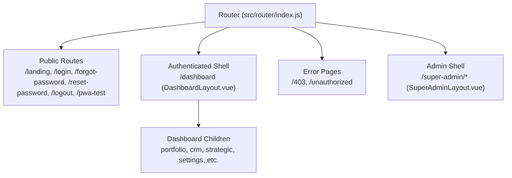

**Diagram sources**
- [index.js:34-194](file://src/router/index.js#L34-L194)
- [DashboardLayout.vue:1-96](file://src/components/layouts/DashboardLayout.vue#L1-L96)
- [SuperAdminLayout.vue:1-63](file://src/components/layouts/SuperAdminLayout.vue#L1-L63)

**Section sources**
- [index.js:34-194](file://src/router/index.js#L34-L194)
- [DashboardLayout.vue:1-96](file://src/components/layouts/DashboardLayout.vue#L1-L96)
- [SuperAdminLayout.vue:1-63](file://src/components/layouts/SuperAdminLayout.vue#L1-L63)

## Core Components
- Router configuration and global guard: centralizes auth, impersonation, and module subscription checks
- Layouts: provide consistent chrome and navigation for user and admin areas
- RBAC composable: provides permission helpers used by UI to conditionally render navigation items
- Module cards: define available modules and their routes; used to build dynamic menus and enforce subscriptions

Key responsibilities:
- Route definitions and lazy imports for code splitting
- Global beforeEach guard for authentication and access control
- Layout-driven page rendering with router-view
- Permission-aware menu generation based on roles and subscriptions

**Section sources**
- [index.js:196-272](file://src/router/index.js#L196-L272)
- [DashboardLayout.vue:99-233](file://src/components/layouts/DashboardLayout.vue#L99-L233)
- [useRBAC.js:55-137](file://src/composables/useRBAC.js#L55-L137)
- [moduleCards.js:13-50](file://src/config/moduleCards.js#L13-L50)

## Architecture Overview
The routing architecture combines declarative route definitions with a centralized guard that enforces authentication and subscription rules. Layouts encapsulate shared UI and context, while RBAC utilities drive conditional visibility.

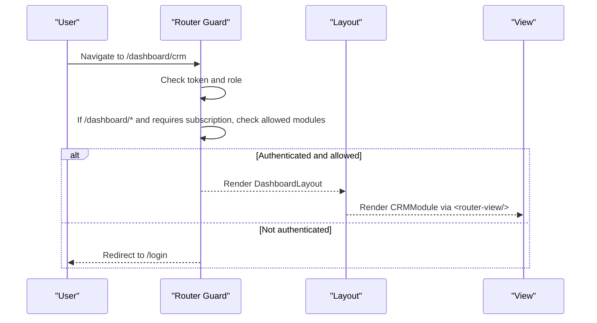

**Diagram sources**
- [index.js:201-272](file://src/router/index.js#L201-L272)
- [DashboardLayout.vue:92-94](file://src/components/layouts/DashboardLayout.vue#L92-L94)

## Detailed Component Analysis

### Router and Global Guard
- Public routes: landing, login, password reset, logout, PWA test
- Authenticated routes: nested under /dashboard using DashboardLayout
- Admin routes: nested under /super-admin using SuperAdminLayout
- Error routes: /403 and /unauthorized
- Global guard:
  - Development bypass flag
  - Impersonation token handling from URL query param
  - Authentication check for routes requiring auth
  - Subscription enforcement for dashboard subpaths not explicitly allowed
  - Role-based allowance for certain paths

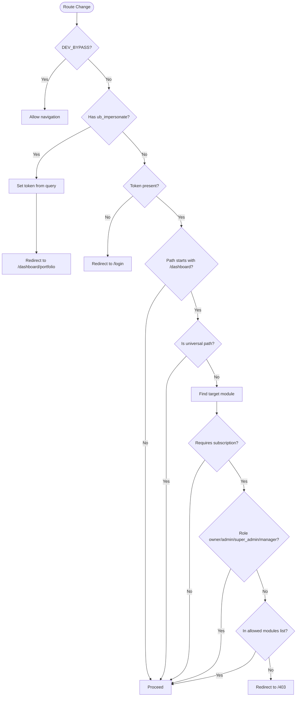

**Diagram sources**
- [index.js:201-272](file://src/router/index.js#L201-L272)

**Section sources**
- [index.js:34-194](file://src/router/index.js#L34-L194)
- [index.js:201-272](file://src/router/index.js#L201-L272)

### DashboardLayout
- Wraps all /dashboard/* child routes
- Displays top bar with title derived from route meta
- Provides dropdown navigation and user info
- Dynamically filters visible modules based on subscriptions and permissions
- Uses RBAC composable to determine admin privileges and permissions

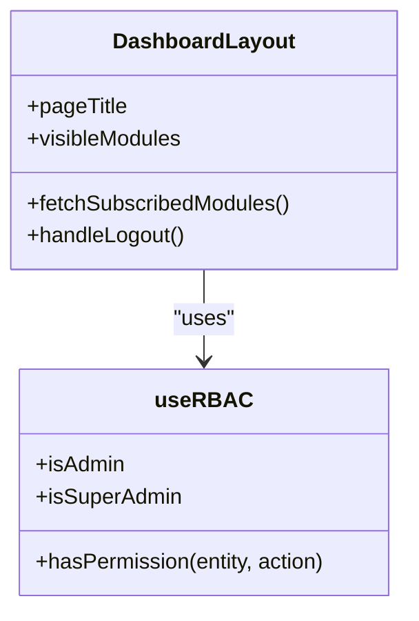

**Diagram sources**
- [DashboardLayout.vue:99-233](file://src/components/layouts/DashboardLayout.vue#L99-L233)
- [useRBAC.js:55-137](file://src/composables/useRBAC.js#L55-L137)

**Section sources**
- [DashboardLayout.vue:1-299](file://src/components/layouts/DashboardLayout.vue#L1-L299)

### SuperAdminLayout
- Dedicated layout for administrative functions under /super-admin/*
- Sidebar navigation for tenant management, revenues, reports, and system traces
- Back link to main app dashboard

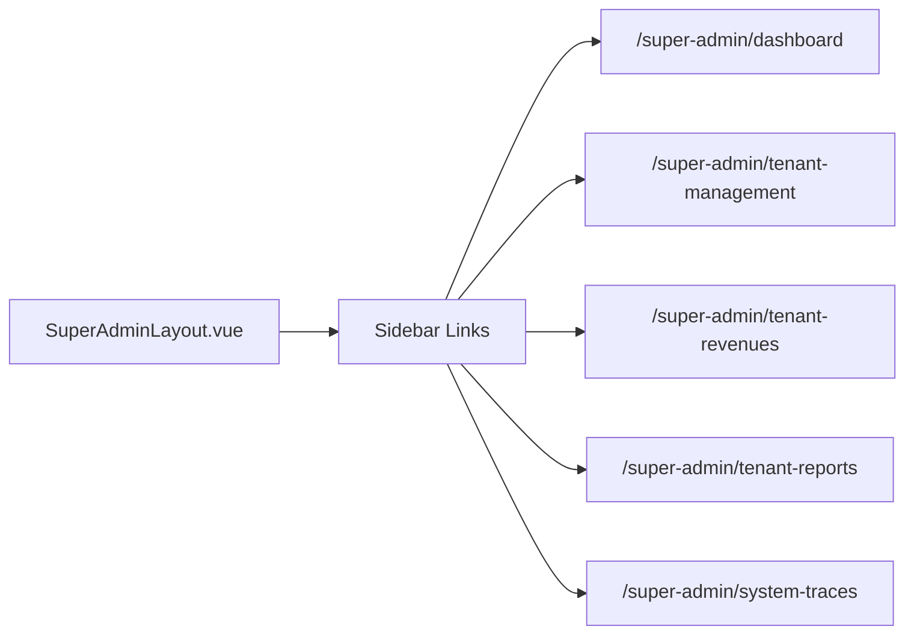

**Diagram sources**
- [SuperAdminLayout.vue:20-48](file://src/components/layouts/SuperAdminLayout.vue#L20-L48)

**Section sources**
- [SuperAdminLayout.vue:1-155](file://src/components/layouts/SuperAdminLayout.vue#L1-L155)

### RBAC and Permissions
- Centralized permission helpers via useRBAC composable
- Default roles and entities defined in rbac config
- Permission checks gate UI elements and influence menu visibility
- DEV_BYPASS allows bypassing checks during development

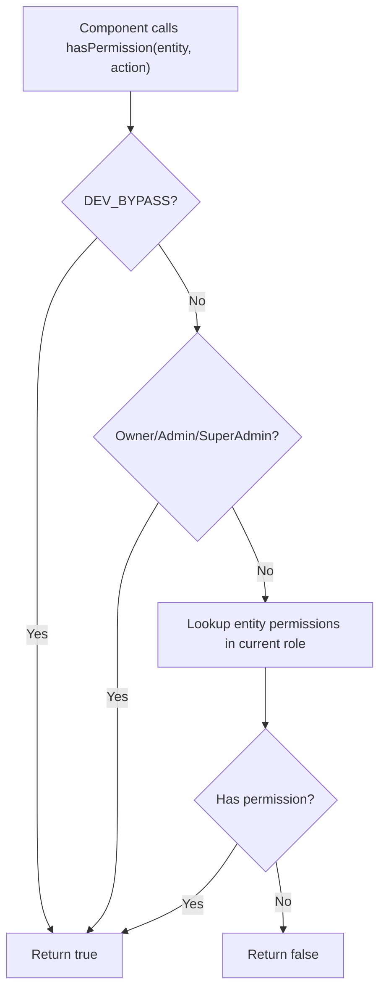

**Diagram sources**
- [useRBAC.js:55-137](file://src/composables/useRBAC.js#L55-L137)
- [rbac.js:658-671](file://src/config/rbac.js#L658-L671)

**Section sources**
- [useRBAC.js:55-137](file://src/composables/useRBAC.js#L55-L137)
- [rbac.js:6-77](file://src/config/rbac.js#L6-L77)
- [rbac.js:658-671](file://src/config/rbac.js#L658-L671)

### Module Cards and Dynamic Menus
- Module cards define IDs, routes, and subscription flags
- Used to compute visible modules in DashboardLayout
- Supports free vs paid modules and admin-only pages

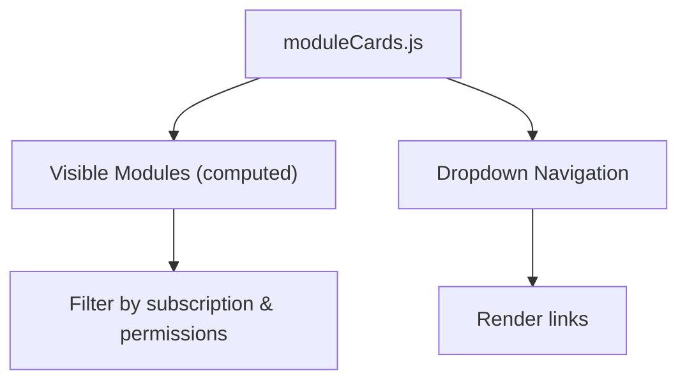

**Diagram sources**
- [moduleCards.js:13-50](file://src/config/moduleCards.js#L13-L50)
- [DashboardLayout.vue:169-232](file://src/components/layouts/DashboardLayout.vue#L169-L232)

**Section sources**
- [moduleCards.js:13-165](file://src/config/moduleCards.js#L13-L165)
- [DashboardLayout.vue:169-232](file://src/components/layouts/DashboardLayout.vue#L169-L232)

### Login Flow and Programmatic Navigation
- Login form validates input and calls API to authenticate
- On success, stores token and navigates to dashboard
- Router guard handles redirects if already authenticated or unauthenticated

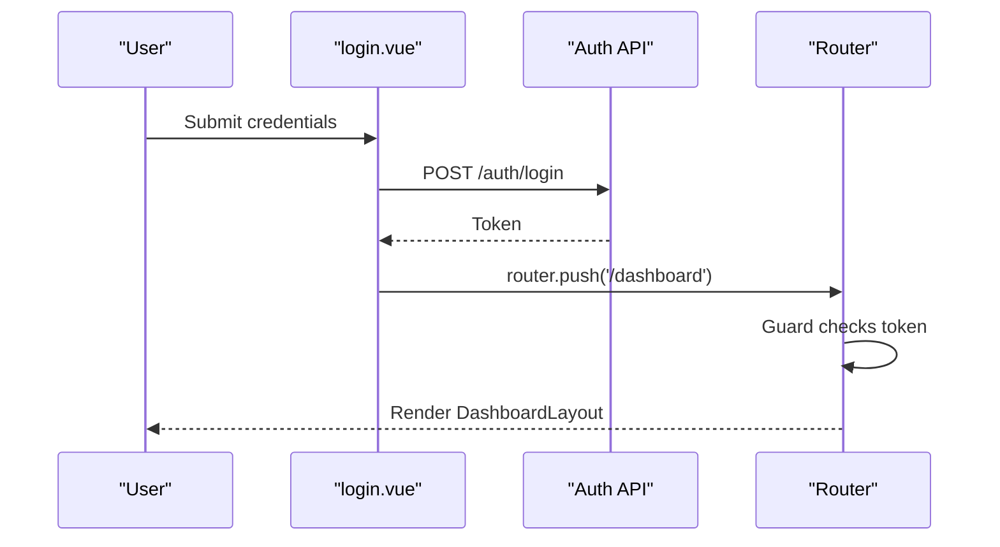

**Diagram sources**
- [login.vue:180-200](file://src/views/auth/login.vue#L180-L200)
- [index.js:201-272](file://src/router/index.js#L201-L272)

**Section sources**
- [login.vue:180-200](file://src/views/auth/login.vue#L180-L200)
- [index.js:201-272](file://src/router/index.js#L201-L272)

### Nested Routing Patterns and Dynamic Parameters
- Nested children under /dashboard for modules like CRM, Strategic Management, Settings
- Dynamic parameters used for customer detail and actions (e.g., /customer/:id)
- Breadcrumb state can be managed via navigation store for deeper hierarchies

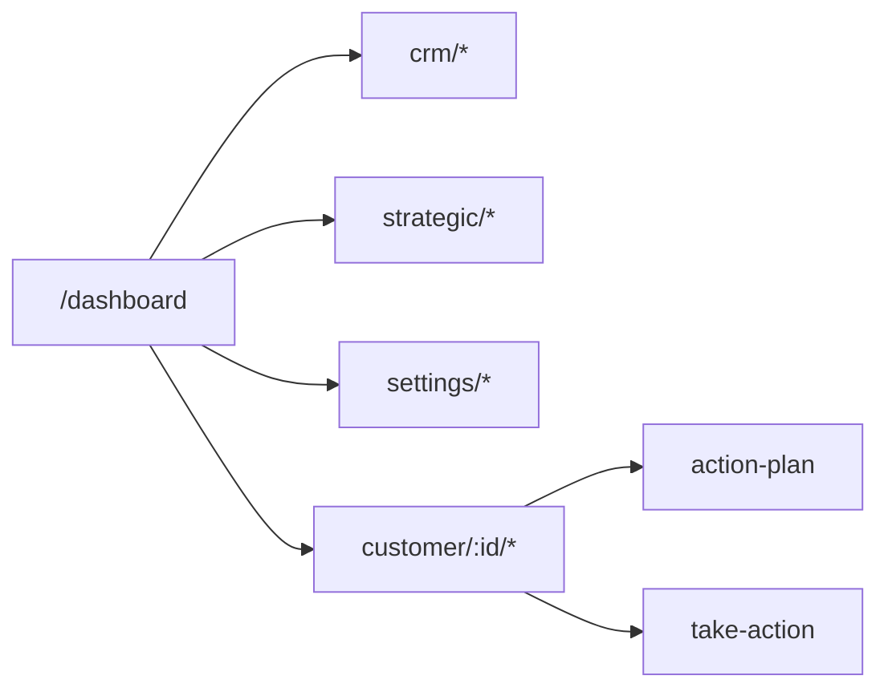

**Diagram sources**
- [index.js:105-168](file://src/router/index.js#L105-L168)
- [index.js:179-186](file://src/router/index.js#L179-L186)

**Section sources**
- [index.js:105-168](file://src/router/index.js#L105-L168)
- [index.js:179-186](file://src/router/index.js#L179-L186)
- [useNavigationStore.js:1-23](file://src/stores/useNavigationStore.js#L1-L23)

### Route Metadata and Titles
- Page titles are set via route meta.title and displayed in DashboardLayout header
- Breadcrumbs can be maintained via navigation store for complex flows

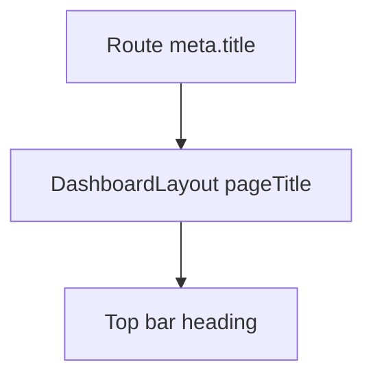

**Diagram sources**
- [index.js:112-133](file://src/router/index.js#L112-L133)
- [DashboardLayout.vue:111-113](file://src/components/layouts/DashboardLayout.vue#L111-L113)

**Section sources**
- [index.js:112-133](file://src/router/index.js#L112-L133)
- [DashboardLayout.vue:111-113](file://src/components/layouts/DashboardLayout.vue#L111-L113)
- [useNavigationStore.js:1-23](file://src/stores/useNavigationStore.js#L1-L23)

### Lazy Loading Strategies
- Many views are imported lazily to enable code splitting and reduce initial bundle size
- Examples include LandingPage, PWATestPage, and various dashboard children

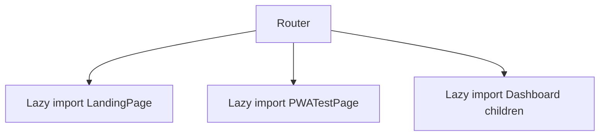

**Diagram sources**
- [index.js:7-7](file://src/router/index.js#L7-L7)
- [index.js:57-65](file://src/router/index.js#L57-L65)
- [index.js:105-168](file://src/router/index.js#L105-L168)

**Section sources**
- [index.js:7-7](file://src/router/index.js#L7-L7)
- [index.js:57-65](file://src/router/index.js#L57-L65)
- [index.js:105-168](file://src/router/index.js#L105-L168)

### Error Handling for Invalid Routes
- Unauthorized access returns a dedicated 403 page
- The router also defines an unauthorized route for generic cases

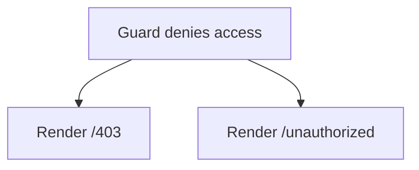

**Diagram sources**
- [index.js:188-190](file://src/router/index.js#L188-L190)
- [403.vue:1-14](file://src/views/403.vue#L1-L14)

**Section sources**
- [index.js:188-190](file://src/router/index.js#L188-L190)
- [403.vue:1-14](file://src/views/403.vue#L1-L14)

## Dependency Analysis
- Router depends on JWT decoding and module card configurations to enforce access
- DashboardLayout depends on RBAC and module cards to render appropriate navigation
- SuperAdminLayout is independent but complements the main app shell
- Login flow integrates with API and router to complete authentication

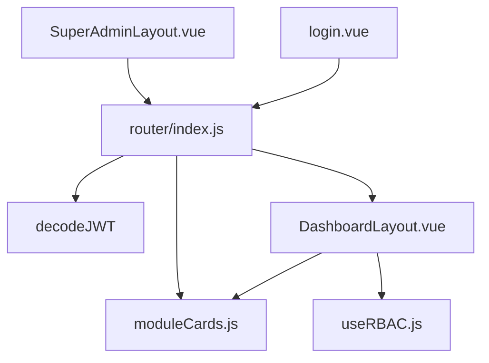

**Diagram sources**
- [index.js:1-5](file://src/router/index.js#L1-L5)
- [DashboardLayout.vue:99-105](file://src/components/layouts/DashboardLayout.vue#L99-L105)
- [SuperAdminLayout.vue:1-63](file://src/components/layouts/SuperAdminLayout.vue#L1-L63)
- [login.vue:133-140](file://src/views/auth/login.vue#L133-L140)

**Section sources**
- [index.js:1-5](file://src/router/index.js#L1-L5)
- [DashboardLayout.vue:99-105](file://src/components/layouts/DashboardLayout.vue#L99-L105)
- [SuperAdminLayout.vue:1-63](file://src/components/layouts/SuperAdminLayout.vue#L1-L63)
- [login.vue:133-140](file://src/views/auth/login.vue#L133-L140)

## Performance Considerations
- Use lazy imports for heavy views to improve initial load time
- Avoid synchronous expensive operations in route guards; rely on cached tokens and local checks where possible
- Debounce or throttle dynamic module fetching in layouts to prevent excessive network calls
- Prefer computed properties for derived UI state to minimize re-renders

[No sources needed since this section provides general guidance]

## Troubleshooting Guide
Common issues and resolutions:
- Redirected to login unexpectedly: ensure token exists and is valid; check DEV_BYPASS behavior
- Access denied to dashboard modules: verify subscription status and allowed modules; confirm role-based allowances
- 403 page shown: indicates insufficient permissions; review RBAC configuration and user role
- Navigation not updating: ensure router-view is within correct layout and routes are properly nested

**Section sources**
- [index.js:201-272](file://src/router/index.js#L201-L272)
- [403.vue:1-14](file://src/views/403.vue#L1-L14)

## Conclusion
The ABSA Foundry Frontend uses a robust routing system with clear separation between public, authenticated, and protected routes. Centralized guards enforce authentication and subscription policies, while layouts provide consistent UX for users and admins. RBAC and module cards enable dynamic, permission-aware navigation. Lazy loading improves performance, and error pages handle invalid access gracefully.

[No sources needed since this section summarizes without analyzing specific files]

## Appendices

### How to Add a New Route
Steps:
- Define the route in the router with a name, path, and component (prefer lazy import)
- Attach meta fields such as title and requiresAuth as needed
- If part of a module, add it to module cards to appear in menus and subscription checks
- Ensure any required permissions are reflected in RBAC configuration

References:
- Adding nested routes under /dashboard
- Using meta.title for page titles
- Defining module entries for dynamic menus

**Section sources**
- [index.js:105-168](file://src/router/index.js#L105-L168)
- [moduleCards.js:13-50](file://src/config/moduleCards.js#L13-L50)

### Implementing Route Guards
- Use the global beforeEach guard for authentication and subscription checks
- For fine-grained UI-level protection, use RBAC helpers in components to show/hide elements
- Leverage DEV_BYPASS for development convenience

**Section sources**
- [index.js:201-272](file://src/router/index.js#L201-L272)
- [useRBAC.js:55-137](file://src/composables/useRBAC.js#L55-L137)

### Creating Permission-Based Navigation Menus
- Build menus from module cards filtered by subscriptions and permissions
- Use RBAC helpers to hide admin-only or restricted items
- Update visible modules dynamically when subscriptions change

**Section sources**
- [DashboardLayout.vue:169-232](file://src/components/layouts/DashboardLayout.vue#L169-L232)
- [moduleCards.js:13-50](file://src/config/moduleCards.js#L13-L50)
- [useRBAC.js:55-137](file://src/composables/useRBAC.js#L55-L137)