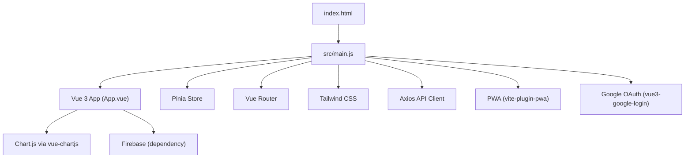
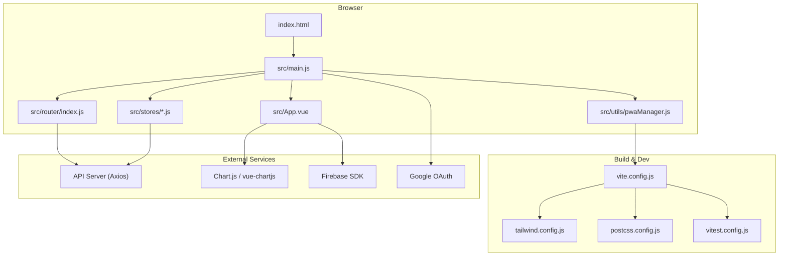
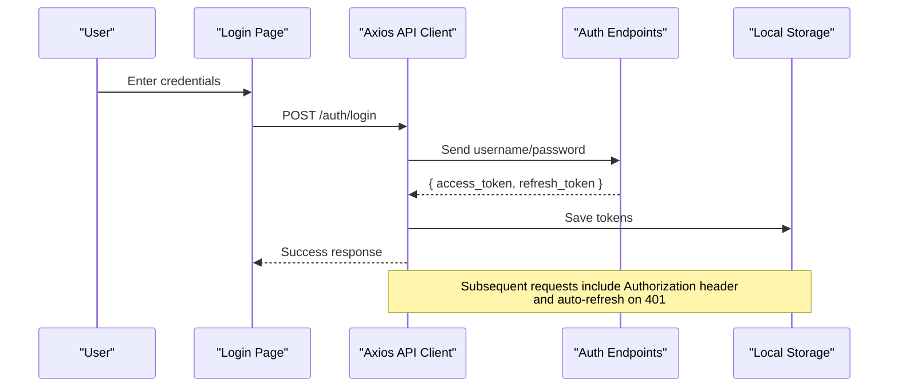
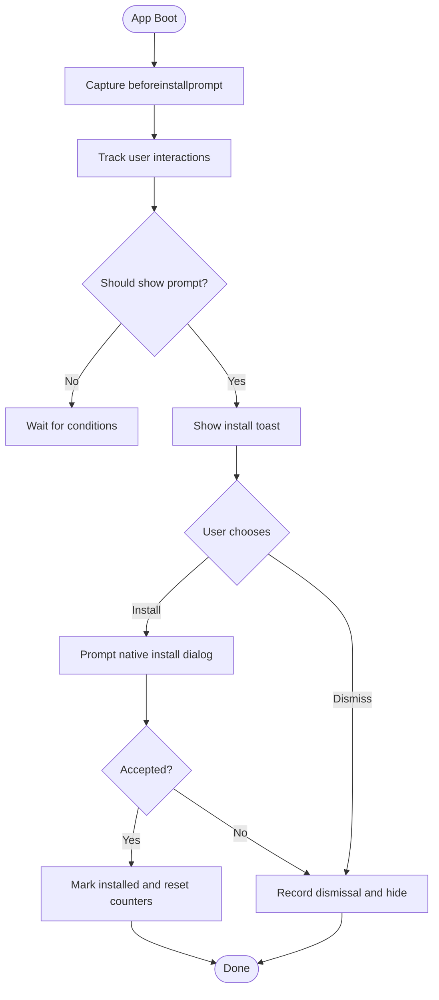
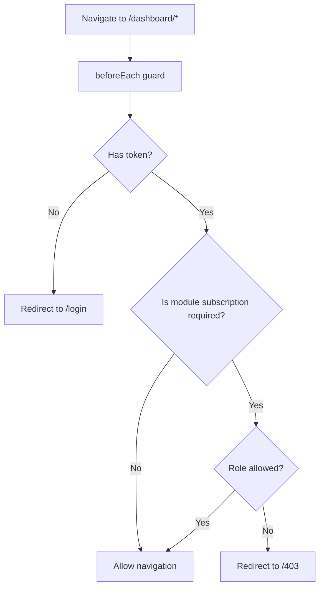
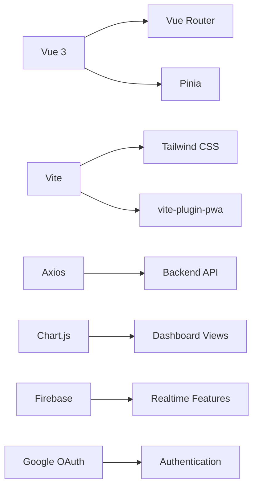

# Technology Stack

<cite>
**Referenced Files in This Document**
- [package.json](file://package.json)
- [vite.config.js](file://vite.config.js)
- [tailwind.config.js](file://tailwind.config.js)
- [postcss.config.js](file://postcss.config.js)
- [vitest.config.js](file://vitest.config.js)
- [index.html](file://index.html)
- [src/main.js](file://src/main.js)
- [src/App.vue](file://src/App.vue)
- [src/router/index.js](file://src/router/index.js)
- [src/stores/auth.js](file://src/stores/auth.js)
- [src/services/api.js](file://src/services/api.js)
- [src/utils/pwaManager.js](file://src/utils/pwaManager.js)
</cite>

## Table of Contents
1. Introduction
2. Project Structure
3. Core Components
4. Architecture Overview
5. Detailed Component Analysis
6. Dependency Analysis
7. Performance Considerations
8. Troubleshooting Guide
9. Conclusion

## Introduction
This section documents the technology stack powering the ABSA Foundry Frontend. It covers core framework choices, build tooling, styling system, state management, routing, HTTP client, testing, PWA support, and third-party integrations. For each technology, we explain rationale, version compatibility, migration considerations, setup instructions, and configuration examples with references to the relevant files.

## Project Structure
The frontend is a Vue 3 application built with Vite, styled with Tailwind CSS, and enhanced with Pinia for state management, Vue Router for navigation, Axios for HTTP requests, and Vitest for unit testing. PWA capabilities are provided via vite-plugin-pwa and a custom service worker. Google OAuth is integrated using vue3-google-login. Chart.js is used for visualizations through vue-chartjs. Firebase is included as a dependency for real-time features.

**Diagram sources**
- [index.html:1-79](file://index.html#L1-L79)
- [src/main.js:1-129](file://src/main.js#L1-L129)
- [src/App.vue:1-293](file://src/App.vue#L1-L293)
- [vite.config.js:1-41](file://vite.config.js#L1-L41)
- [tailwind.config.js:1-181](file://tailwind.config.js#L1-L181)
- [src/router/index.js:1-275](file://src/router/index.js#L1-L275)
- [src/services/api.js:1-209](file://src/services/api.js#L1-L209)
- [src/utils/pwaManager.js:1-236](file://src/utils/pwaManager.js#L1-L236)

**Section sources**
- [package.json:1-90](file://package.json#L1-L90)
- [vite.config.js:1-41](file://vite.config.js#L1-L41)
- [tailwind.config.js:1-181](file://tailwind.config.js#L1-L181)
- [postcss.config.js:1-7](file://postcss.config.js#L1-L7)
- [vitest.config.js:1-17](file://vitest.config.js#L1-L17)
- [index.html:1-79](file://index.html#L1-L79)

## Core Components
- Framework: Vue 3.5.26 with Composition API
  - Rationale: Modern component model, strong ecosystem, excellent performance, and composability.
  - Compatibility: Works with Vite 6.x and Vue plugins; ensure @vitejs/plugin-vue is aligned.
  - Migration: When upgrading Vue minor versions, review deprecations and plugin updates.
  - Setup: Application bootstrap in main entry file; components use <script setup>.
  - References: [src/main.js:1-129](file://src/main.js#L1-L129), [src/App.vue:1-293](file://src/App.vue#L1-L293)

- Build Tool: Vite 6.1.0
  - Rationale: Fast dev server, optimized builds, modern plugin ecosystem.
  - Compatibility: Requires Node >= 18; aligns with Vue 3 and TypeScript/JSX plugins.
  - Migration: Update plugins when Vite major releases occur; verify alias and optimizeDeps settings.
  - Setup: Plugins configured in vite config; PWA injected via vite-plugin-pwa.
  - References: [vite.config.js:1-41](file://vite.config.js#L1-L41)

- Styling: Tailwind CSS 3.4.17
  - Rationale: Utility-first CSS, design tokens, dark mode, responsive utilities.
  - Compatibility: PostCSS pipeline required; forms plugin enabled.
  - Migration: Review utility changes and deprecated classes on upgrades.
  - Setup: Tailwind configured with theme extensions and content paths; PostCSS processes styles.
  - References: [tailwind.config.js:1-181](file://tailwind.config.js#L1-L181), [postcss.config.js:1-7](file://postcss.config.js#L1-L7)

- State Management: Pinia 3.0.3
  - Rationale: Lightweight, type-friendly, composable store pattern replacing Vuex.
  - Compatibility: Works with Vue 3 and Vite; testing helpers available.
  - Migration: Convert Vuex stores to Pinia stores; update imports and usage.
  - Setup: Create and register Pinia instance globally; define stores with state/getters/actions.
  - References: [src/main.js:1-129](file://src/main.js#L1-L129), [src/stores/auth.js:1-22](file://src/stores/auth.js#L1-L22)

- Routing: Vue Router 4.5.0
  - Rationale: Official router for Vue 3 with lazy loading and guards.
  - Compatibility: Works with createWebHistory and route-based code splitting.
  - Migration: Ensure routes use dynamic imports and guard logic is compatible.
  - Setup: Define routes, register router globally, implement beforeEach guards.
  - References: [src/router/index.js:1-275](file://src/router/index.js#L1-L275)

- HTTP Client: Axios 1.7.9
  - Rationale: Interceptors for auth headers and token refresh; robust error handling.
  - Compatibility: Works with fetch polyfills if needed; integrates with environment variables.
  - Migration: Align interceptors with backend auth spec; handle 401 flows consistently.
  - Setup: Configure base URL from env or runtime detection; set up request/response interceptors.
  - References: [src/services/api.js:1-209](file://src/services/api.js#L1-L209)

- Testing: Vitest 3.2.4
  - Rationale: Fast, Vite-native test runner with jsdom environment for UI tests.
  - Compatibility: Works with Vue SFCs via @vitejs/plugin-vue; supports aliases.
  - Migration: Update test configs when Vite/Vitest versions change; ensure globals and setup files are correct.
  - Setup: Configure environment, globals, setupFiles, and path aliases.
  - References: [vitest.config.js:1-17](file://vitest.config.js#L1-L17)

- PWA Support: vite-plugin-pwa 1.2.0
  - Rationale: Enables installable web app with service worker, manifest, caching strategies.
  - Compatibility: Uses injectManifest strategy; requires srcDir and sw.js.
  - Migration: Keep Workbox packages aligned; adjust cache sizes and strategies as needed.
  - Setup: Configure manifest, icons, strategies, and dev options; register SW in main entry.
  - References: [vite.config.js:1-41](file://vite.config.js#L1-L41), [src/main.js:1-129](file://src/main.js#L1-L129), [src/utils/pwaManager.js:1-236](file://src/utils/pwaManager.js#L1-L236)

- Third-Party Integrations:
  - Chart.js with vue-chartjs for data visualizations
    - Rationale: Flexible charting library with Vue wrappers.
    - Setup: Import charts in components; configure datasets and options per view.
    - References: [package.json:1-90](file://package.json#L1-L90)
  - Firebase for real-time features
    - Rationale: Realtime database, messaging, analytics modules available.
    - Setup: Initialize SDK in feature modules; configure auth/database as needed.
    - References: [package.json:1-90](file://package.json#L1-L90)
  - Google OAuth via vue3-google-login
    - Rationale: Simplifies Google Sign-In integration with Vue apps.
    - Setup: Provide clientId from environment; register plugin globally.
    - References: [src/main.js:1-129](file://src/main.js#L1-L129)

**Section sources**
- [package.json:1-90](file://package.json#L1-L90)
- [vite.config.js:1-41](file://vite.config.js#L1-L41)
- [tailwind.config.js:1-181](file://tailwind.config.js#L1-L181)
- [postcss.config.js:1-7](file://postcss.config.js#L1-L7)
- [vitest.config.js:1-17](file://vitest.config.js#L1-L17)
- [src/main.js:1-129](file://src/main.js#L1-L129)
- [src/App.vue:1-293](file://src/App.vue#L1-L293)
- [src/router/index.js:1-275](file://src/router/index.js#L1-L275)
- [src/stores/auth.js:1-22](file://src/stores/auth.js#L1-L22)
- [src/services/api.js:1-209](file://src/services/api.js#L1-L209)
- [src/utils/pwaManager.js:1-236](file://src/utils/pwaManager.js#L1-L236)

## Architecture Overview
High-level architecture showing how core technologies interact at runtime:

**Diagram sources**
- [index.html:1-79](file://index.html#L1-L79)
- [src/main.js:1-129](file://src/main.js#L1-L129)
- [src/App.vue:1-293](file://src/App.vue#L1-L293)
- [src/router/index.js:1-275](file://src/router/index.js#L1-L275)
- [src/stores/auth.js:1-22](file://src/stores/auth.js#L1-L22)
- [src/utils/pwaManager.js:1-236](file://src/utils/pwaManager.js#L1-L236)
- [vite.config.js:1-41](file://vite.config.js#L1-L41)
- [tailwind.config.js:1-181](file://tailwind.config.js#L1-L181)
- [postcss.config.js:1-7](file://postcss.config.js#L1-L7)
- [vitest.config.js:1-17](file://vitest.config.js#L1-L17)

## Detailed Component Analysis

### Authentication Flow with Axios Interceptors
Demonstrates how login, token storage, and automatic refresh work during API calls.

**Diagram sources**
- [src/services/api.js:1-209](file://src/services/api.js#L1-L209)

**Section sources**
- [src/services/api.js:1-209](file://src/services/api.js#L1-L209)

### PWA Install Prompt Lifecycle
Shows how the app captures the beforeinstallprompt event and manages user interactions.

**Diagram sources**
- [src/utils/pwaManager.js:1-236](file://src/utils/pwaManager.js#L1-L236)
- [src/main.js:1-129](file://src/main.js#L1-L129)

**Section sources**
- [src/utils/pwaManager.js:1-236](file://src/utils/pwaManager.js#L1-L236)
- [src/main.js:1-129](file://src/main.js#L1-L129)

### Route Guards and Module Access Control
Illustrates how authentication and subscription checks protect dashboard routes.

**Diagram sources**
- [src/router/index.js:1-275](file://src/router/index.js#L1-L275)

**Section sources**
- [src/router/index.js:1-275](file://src/router/index.js#L1-L275)

### Configuration Examples and Setup Instructions

- Vue 3 + Vite
  - Bootstrap app and register plugins in main entry.
  - Configure aliases and dev tools in Vite config.
  - References: [src/main.js:1-129](file://src/main.js#L1-L129), [vite.config.js:1-41](file://vite.config.js#L1-L41)

- Tailwind CSS
  - Extend theme colors, fonts, spacing, animations; enable forms plugin.
  - Process with PostCSS.
  - References: [tailwind.config.js:1-181](file://tailwind.config.js#L1-L181), [postcss.config.js:1-7](file://postcss.config.js#L1-L7)

- Pinia
  - Create store with state, getters, actions; register globally.
  - References: [src/stores/auth.js:1-22](file://src/stores/auth.js#L1-L22), [src/main.js:1-129](file://src/main.js#L1-L129)

- Vue Router
  - Define routes with lazy loading; add global beforeEach guard.
  - References: [src/router/index.js:1-275](file://src/router/index.js#L1-L275)

- Axios
  - Set base URL from environment; add request/response interceptors for auth and refresh.
  - References: [src/services/api.js:1-209](file://src/services/api.js#L1-L209)

- Vitest
  - Configure jsdom environment, globals, setup files, and aliases.
  - References: [vitest.config.js:1-17](file://vitest.config.js#L1-L17)

- PWA
  - Configure manifest, icons, strategies; register service worker in main entry.
  - References: [vite.config.js:1-41](file://vite.config.js#L1-L41), [src/main.js:1-129](file://src/main.js#L1-L129), [src/utils/pwaManager.js:1-236](file://src/utils/pwaManager.js#L1-L236)

- Google OAuth
  - Provide clientId from environment; register plugin globally.
  - References: [src/main.js:1-129](file://src/main.js#L1-L129)

- Chart.js
  - Use vue-chartjs wrappers in components to render charts.
  - References: [package.json:1-90](file://package.json#L1-L90)

- Firebase
  - Include SDK for real-time features; initialize in feature modules as needed.
  - References: [package.json:1-90](file://package.json#L1-L90)

**Section sources**
- [src/main.js:1-129](file://src/main.js#L1-L129)
- [vite.config.js:1-41](file://vite.config.js#L1-L41)
- [tailwind.config.js:1-181](file://tailwind.config.js#L1-L181)
- [postcss.config.js:1-7](file://postcss.config.js#L1-L7)
- [src/stores/auth.js:1-22](file://src/stores/auth.js#L1-L22)
- [src/router/index.js:1-275](file://src/router/index.js#L1-L275)
- [src/services/api.js:1-209](file://src/services/api.js#L1-L209)
- [vitest.config.js:1-17](file://vitest.config.js#L1-L17)
- [src/utils/pwaManager.js:1-236](file://src/utils/pwaManager.js#L1-L236)
- [package.json:1-90](file://package.json#L1-L90)

## Dependency Analysis
Key dependencies and their roles:

- Core: Vue 3, Vite, Tailwind CSS, Pinia, Vue Router, Axios
- Testing: Vitest, jsdom, Vue Test Utils
- PWA: vite-plugin-pwa, Workbox packages
- Visualizations: Chart.js, vue-chartjs
- Real-time: Firebase
- Auth: vue3-google-login
- Utilities: lodash, date formatting, PDF/Excel generation, QR/barcode scanning

**Diagram sources**
- [package.json:1-90](file://package.json#L1-L90)

**Section sources**
- [package.json:1-90](file://package.json#L1-L90)

## Performance Considerations
- Use lazy-loaded routes to reduce initial bundle size.
- Leverage Vite’s dependency optimization and code splitting.
- Minimize heavy libraries; prefer tree-shaking where possible.
- Configure PWA caching strategies to balance freshness and offline capability.
- Avoid unnecessary re-renders by leveraging Pinia state and computed properties.
- Monitor bundle size and analyze with Vite build reports.

[No sources needed since this section provides general guidance]

## Troubleshooting Guide
- Service Worker registration failures
  - Check dev bypass flag and console logs for registration errors.
  - Clear existing registrations and caches in development mode.
  - References: [src/main.js:1-129](file://src/main.js#L1-L129)

- 401 Unauthorized responses
  - Ensure refresh token flow is implemented; verify interceptor logic.
  - Confirm tokens are stored correctly and sent in Authorization header.
  - References: [src/services/api.js:1-209](file://src/services/api.js#L1-L209)

- PWA install prompt not appearing
  - Verify beforeinstallprompt capture and user interaction thresholds.
  - Ensure site meets PWA criteria and manifest is valid.
  - References: [src/utils/pwaManager.js:1-236](file://src/utils/pwaManager.js#L1-L236), [vite.config.js:1-41](file://vite.config.js#L1-L41)

- Route guard redirects to login unexpectedly
  - Check token presence and role-based permissions.
  - Validate module subscription checks and allowed paths.
  - References: [src/router/index.js:1-275](file://src/router/index.js#L1-L275)

**Section sources**
- [src/main.js:1-129](file://src/main.js#L1-L129)
- [src/services/api.js:1-209](file://src/services/api.js#L1-L209)
- [src/utils/pwaManager.js:1-236](file://src/utils/pwaManager.js#L1-L236)
- [src/router/index.js:1-275](file://src/router/index.js#L1-L275)

## Conclusion
The ABSA Foundry Frontend leverages a modern, cohesive stack centered around Vue 3, Vite, Tailwind CSS, Pinia, Vue Router, and Axios. PWA support ensures an installable, resilient experience, while Chart.js and Firebase provide rich visualizations and real-time capabilities. Google OAuth streamlines authentication. The configuration and patterns documented here provide a solid foundation for maintaining, scaling, and migrating the application as technologies evolve.

[No sources needed since this section summarizes without analyzing specific files]