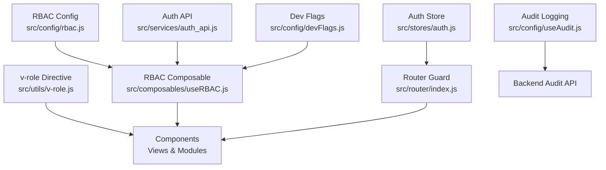
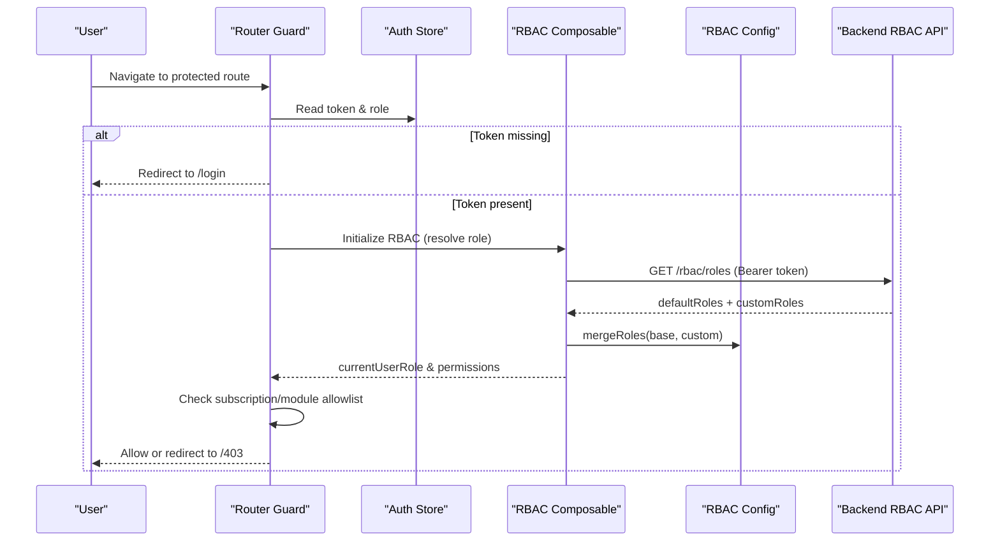
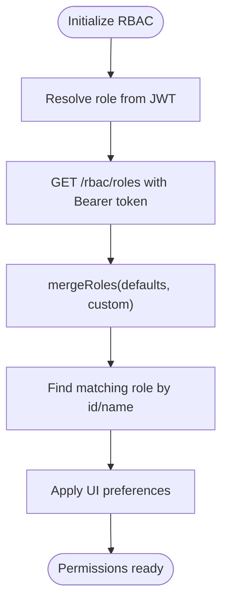
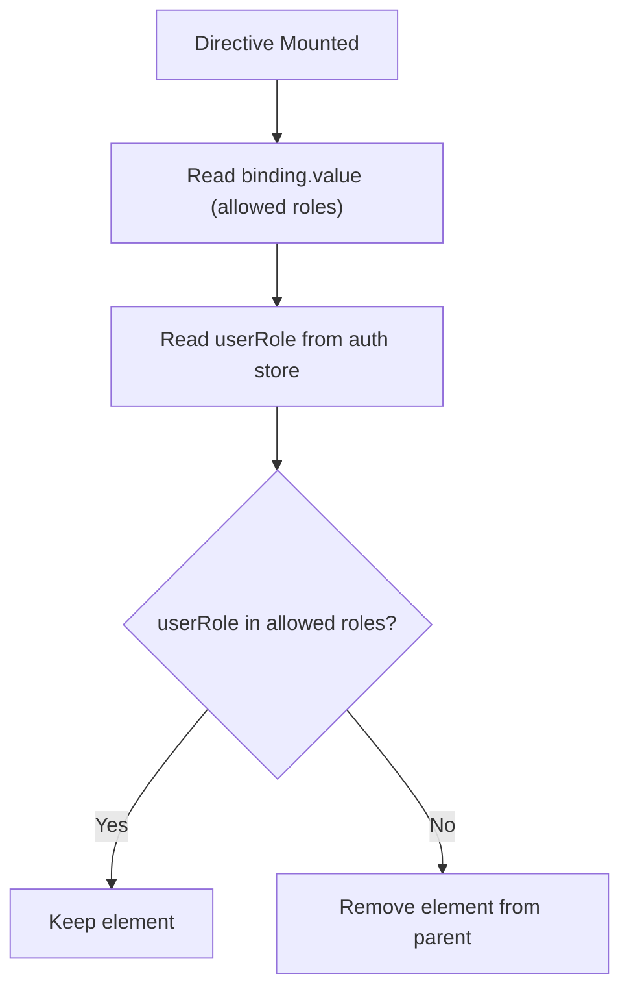
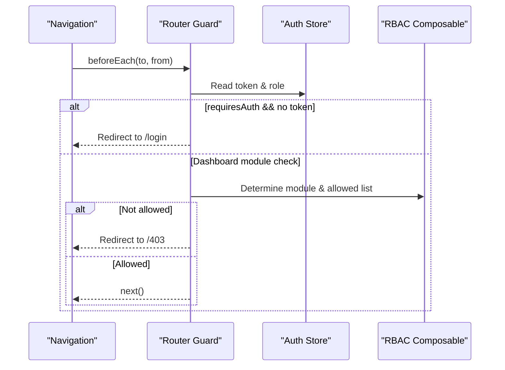
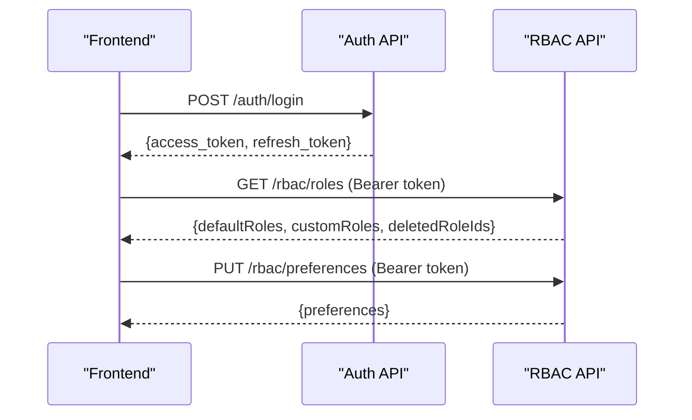
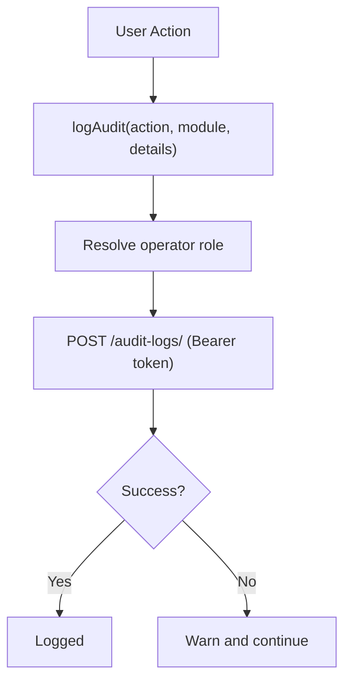
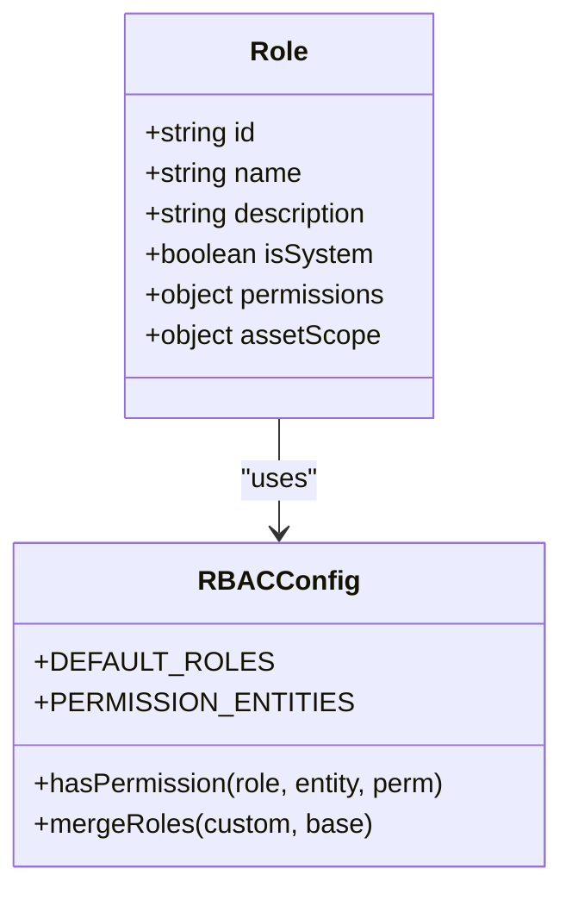
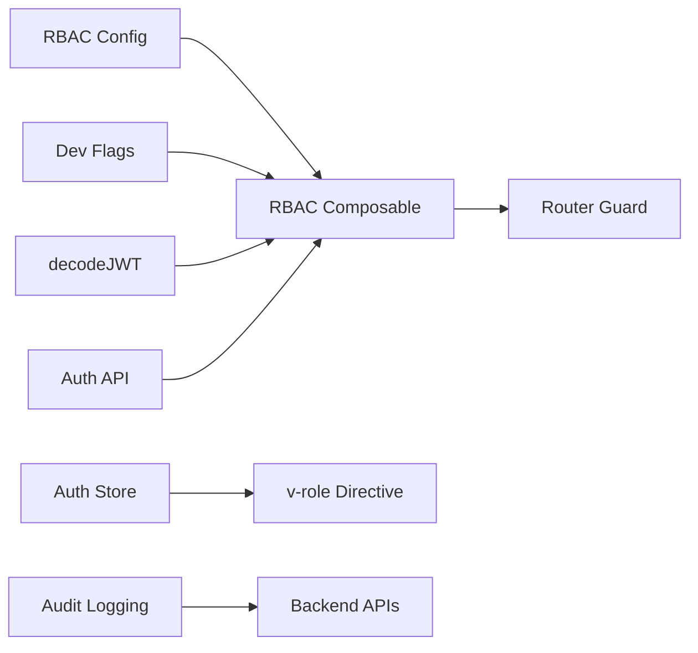

# User Roles & Permissions

<cite>
**Referenced Files in This Document**
- [rbac.js](file://src/config/rbac.js)
- [useRBAC.js](file://src/composables/useRBAC.js)
- [v-role.js](file://src/utils/v-role.js)
- [index.js](file://src/router/index.js)
- [auth.js](file://src/stores/auth.js)
- [auth_api.js](file://src/services/auth_api.js)
- [useAudit.js](file://src/config/useAudit.js)
- [devFlags.js](file://src/config/devFlags.js)
- [SettingsRoles.vue](file://src/views/Modules/settings/components/SettingsRoles.vue)
- [SubAccountModule.vue](file://src/views/Modules/settings/SubAccountModule.vue)
</cite>

## Table of Contents
1. [Introduction](#introduction)
2. [Project Structure](#project-structure)
3. [Core Components](#core-components)
4. [Architecture Overview](#architecture-overview)
5. [Detailed Component Analysis](#detailed-component-analysis)
6. [Dependency Analysis](#dependency-analysis)
7. [Performance Considerations](#performance-considerations)
8. [Troubleshooting Guide](#troubleshooting-guide)
9. [Conclusion](#conclusion)
10. [Appendices](#appendices)

## Introduction
This document explains the Role-Based Access Control (RBAC) system implemented in the ABSA Foundry Frontend. It covers predefined roles, permission inheritance, role assignment workflows, dynamic permission checks, UI rendering with v-role, route protection, custom role creation, module-scoped permissions, audit logging for access control events, and integration with backend authorization services using token-based validation. It also provides troubleshooting guidance and best practices for implementing new role types.

## Project Structure
The RBAC implementation is centered around a configuration file that defines entities, permissions, and default roles; a composable that loads tenant roles from the backend and exposes permission-checking utilities; a Vue directive for conditional UI rendering based on user roles; router guards for navigation protection; an auth store for session state; and audit logging utilities to record access control events.

**Diagram sources**
- [rbac.js:1-753](file://src/config/rbac.js#L1-L753)
- [useRBAC.js:1-783](file://src/composables/useRBAC.js#L1-L783)
- [v-role.js:1-12](file://src/utils/v-role.js#L1-L12)
- [index.js:1-275](file://src/router/index.js#L1-L275)
- [auth.js:1-22](file://src/stores/auth.js#L1-L22)
- [auth_api.js:1-190](file://src/services/auth_api.js#L1-L190)
- [useAudit.js:1-76](file://src/config/useAudit.js#L1-L76)
- [devFlags.js:1-28](file://src/config/devFlags.js#L1-L28)

**Section sources**
- [rbac.js:1-753](file://src/config/rbac.js#L1-L753)
- [useRBAC.js:1-783](file://src/composables/useRBAC.js#L1-L783)
- [v-role.js:1-12](file://src/utils/v-role.js#L1-L12)
- [index.js:1-275](file://src/router/index.js#L1-L275)
- [auth.js:1-22](file://src/stores/auth.js#L1-L22)
- [auth_api.js:1-190](file://src/services/auth_api.js#L1-L190)
- [useAudit.js:1-76](file://src/config/useAudit.js#L1-L76)
- [devFlags.js:1-28](file://src/config/devFlags.js#L1-L28)

## Core Components
- RBAC Configuration: Defines permission types, entities, default roles, helper functions for permission checks, role merging, and validation.
- RBAC Composable: Loads tenant roles from the backend, resolves current user role from JWT, exposes reactive permission-checking methods, and manages organizations and UI preferences.
- v-role Directive: Conditionally renders DOM nodes based on the current user’s role stored in the auth store.
- Router Guards: Enforce authentication and module-level access checks during navigation.
- Auth Store: Holds token, role, and email from localStorage for quick access across components.
- Auth API: Handles login, refresh, profile fetch, and role update endpoints with automatic token attachment.
- Audit Logging: Records user actions (create, update, delete, export, etc.) to a backend audit endpoint with operator context.

Key responsibilities:
- Centralized definitions of entities and permissions ensure consistency across modules.
- The composable abstracts permission logic and integrates with backend role management APIs.
- The directive simplifies UI-level gating without complex conditionals in templates.
- Router guards provide coarse-grained access control at the route level.
- Audit logging ensures traceability of access-related actions.

**Section sources**
- [rbac.js:1-753](file://src/config/rbac.js#L1-L753)
- [useRBAC.js:1-783](file://src/composables/useRBAC.js#L1-L783)
- [v-role.js:1-12](file://src/utils/v-role.js#L1-L12)
- [index.js:1-275](file://src/router/index.js#L1-L275)
- [auth.js:1-22](file://src/stores/auth.js#L1-L22)
- [auth_api.js:1-190](file://src/services/auth_api.js#L1-L190)
- [useAudit.js:1-76](file://src/config/useAudit.js#L1-L76)

## Architecture Overview
The RBAC architecture combines static configuration with dynamic, backend-driven roles and permissions. On initialization, the app loads tenant-specific roles and merges them with defaults, then resolves the current user’s role from the JWT. Permission checks are performed via the composable, which short-circuits for privileged roles and otherwise consults the resolved role’s entity-specific permissions. UI elements can be gated using the v-role directive or by calling permission helpers. Route guards enforce access at navigation time, while audit logs capture significant actions.

**Diagram sources**
- [index.js:201-272](file://src/router/index.js#L201-L272)
- [useRBAC.js:144-226](file://src/composables/useRBAC.js#L144-L226)
- [rbac.js:701-713](file://src/config/rbac.js#L701-L713)

**Section sources**
- [index.js:201-272](file://src/router/index.js#L201-L272)
- [useRBAC.js:144-226](file://src/composables/useRBAC.js#L144-L226)
- [rbac.js:701-713](file://src/config/rbac.js#L701-L713)

## Detailed Component Analysis

### RBAC Configuration (Entities, Permissions, Default Roles)
- Entities: A comprehensive list of modules/entities that can have permissions applied, including CRM, POS, Inventory, Finance, HR, Assets Manager, Strategic Management, and more.
- Permission Types: read, write, edit, delete, assign, approve, export. Some entities expose additional specific permissions like assign or approve.
- Default Roles: Predefined roles such as Owner, Manager, Cashier, Accountant, Auditor, Attendant, Hotel Attendant, System Admin, Asset Manager, Finance Officer, Technician, Department Manager, and Read-Only Viewer. Each role declares explicit per-entity permissions.
- Helper Functions: hasPermission, hasAnyPermission, getDefaultRole, createEmptyRole, mergeRoles, validateRole. These support dynamic role merging and validation.

Notes on inheritance:
- Super-admin-like roles (owner, admin, super_admin) bypass granular checks in the composable, effectively inheriting all permissions.
- Custom roles override or extend defaults via mergeRoles, allowing tenant-specific customization.

**Section sources**
- [rbac.js:13-77](file://src/config/rbac.js#L13-L77)
- [rbac.js:85-337](file://src/config/rbac.js#L85-L337)
- [rbac.js:658-713](file://src/config/rbac.js#L658-L713)

### RBAC Composable (Dynamic Permission Checking and Role Management)
- State: Tracks current user role, permissions, organizations, and UI preferences.
- Permission Checks: Exposes canRead, canWrite, canEdit, canDelete, canAssign, canApprove, canExport, plus generic hasPermission and hasAnyPermission. Short-circuits for privileged roles and respects development bypass flags.
- Role Loading: fetchRoles retrieves tenant roles from the backend, merges with defaults, removes deleted roles, and syncs healthcare-specific addon permissions into localStorage for fast access.
- Role CRUD: createRole, updateRole, deleteRole interact with backend RBAC endpoints and update local state.
- Initialization: initializeRBAC resolves the current role from JWT against loaded tenant roles and applies UI preferences.

**Diagram sources**
- [useRBAC.js:668-719](file://src/composables/useRBAC.js#L668-L719)
- [useRBAC.js:144-226](file://src/composables/useRBAC.js#L144-L226)
- [rbac.js:701-713](file://src/config/rbac.js#L701-L713)

**Section sources**
- [useRBAC.js:55-137](file://src/composables/useRBAC.js#L55-L137)
- [useRBAC.js:144-226](file://src/composables/useRBAC.js#L144-L226)
- [useRBAC.js:231-347](file://src/composables/useRBAC.js#L231-L347)
- [useRBAC.js:668-719](file://src/composables/useRBAC.js#L668-L719)

### v-role Directive (Conditional UI Rendering)
- Behavior: When mounted, reads the allowed roles from the directive binding and compares against the current user’s role from the auth store. If not allowed, it removes the element from the DOM.
- Usage: Attach v-role to elements to hide/show based on role membership.

**Diagram sources**
- [v-role.js:1-12](file://src/utils/v-role.js#L1-L12)
- [auth.js:1-22](file://src/stores/auth.js#L1-L22)

**Section sources**
- [v-role.js:1-12](file://src/utils/v-role.js#L1-L12)
- [auth.js:1-22](file://src/stores/auth.js#L1-L22)

### Route Protection (Navigation Guards)
- Authentication: Routes marked requiresAuth redirect unauthenticated users to /login.
- Module Access: For dashboard routes, the guard identifies the target module and enforces subscription/module allowlists. Non-admin/non-manager roles must have the module in their allowed list; otherwise, they are redirected to /403.
- Impersonation: Supports temporary impersonation tokens via query parameter to set session context and navigate to dashboard.

**Diagram sources**
- [index.js:201-272](file://src/router/index.js#L201-L272)

**Section sources**
- [index.js:201-272](file://src/router/index.js#L201-L272)

### Integration with Backend Authorization Services
- Token Handling: The auth API client automatically attaches Bearer tokens to requests. Login and refresh endpoints manage tokens and sessions.
- Role Updates: An endpoint exists to update user roles server-side.
- RBAC Endpoints: The composable calls /rbac/roles, /rbac/organizations, and /rbac/preferences to synchronize roles, associations, and UI preferences.

**Diagram sources**
- [auth_api.js:1-190](file://src/services/auth_api.js#L1-L190)
- [useRBAC.js:144-226](file://src/composables/useRBAC.js#L144-L226)

**Section sources**
- [auth_api.js:1-190](file://src/services/auth_api.js#L1-L190)
- [useRBAC.js:144-226](file://src/composables/useRBAC.js#L144-L226)

### Audit Logging for Access Control Events
- Purpose: Record user actions (create, update, delete, export, login, logout, approve, reject) along with module context and details.
- Operator Resolution: Resolves active operator role from localStorage or JWT to attribute actions correctly.
- Endpoint: Posts to /audit-logs/ with Authorization header.

**Diagram sources**
- [useAudit.js:1-76](file://src/config/useAudit.js#L1-L76)

**Section sources**
- [useAudit.js:1-76](file://src/config/useAudit.js#L1-L76)

### Custom Role Creation and Permission Scoping
- Creating Roles: Use createRole to send role data to the backend; includes createdBy and createdAt metadata. Validation ensures required fields.
- Updating/Deleting Roles: updateRole and deleteRole modify or remove roles, with protections for system roles (e.g., Owner cannot be deleted).
- Permission Scoping: Roles define per-entity permissions. Additional scoping mechanisms exist for assets (assetScope) and healthcare addons (healthcare_addons), enabling fine-grained visibility and capabilities.

**Diagram sources**
- [rbac.js:85-337](file://src/config/rbac.js#L85-L337)
- [rbac.js:658-713](file://src/config/rbac.js#L658-L713)

**Section sources**
- [useRBAC.js:231-347](file://src/composables/useRBAC.js#L231-L347)
- [rbac.js:683-713](file://src/config/rbac.js#L683-L713)

### Role Assignment Workflows
- User Management: The settings module allows managing users and assigning roles with hierarchy constraints. Certain roles (admin/super_admin) are restricted to admin dashboards and do not appear in general role dropdowns.
- Hierarchy Enforcement: Role hierarchy arrays determine permissible assignments based on the current user’s role level.

**Section sources**
- [SubAccountModule.vue:906-934](file://src/views/Modules/settings/SubAccountModule.vue#L906-L934)
- [SettingsRoles.vue:1-37](file://src/views/Modules/settings/components/SettingsRoles.vue#L1-L37)

## Dependency Analysis
- RBAC Config depends on no runtime services; it provides constants and helpers.
- RBAC Composable depends on:
  - decodeJWT for user identity extraction
  - devFlags for development bypass behavior
  - API_BASE_URL for backend calls
  - RBAC Config for defaults and helpers
- Router Guard depends on:
  - decodeJWT for role extraction
  - moduleCards for module identification
  - devFlags for bypass behavior
- Auth Store depends on localStorage for persistence.
- Auth API depends on axios and environment variables for base URL.
- Audit Logging depends on decodeJWT and API_BASE_URL.

**Diagram sources**
- [useRBAC.js:1-34](file://src/composables/useRBAC.js#L1-L34)
- [index.js:1-5](file://src/router/index.js#L1-L5)
- [auth.js:1-22](file://src/stores/auth.js#L1-L22)
- [auth_api.js:1-27](file://src/services/auth_api.js#L1-L27)
- [useAudit.js:1-18](file://src/config/useAudit.js#L1-L18)

**Section sources**
- [useRBAC.js:1-34](file://src/composables/useRBAC.js#L1-L34)
- [index.js:1-5](file://src/router/index.js#L1-L5)
- [auth.js:1-22](file://src/stores/auth.js#L1-L22)
- [auth_api.js:1-27](file://src/services/auth_api.js#L1-L27)
- [useAudit.js:1-18](file://src/config/useAudit.js#L1-L18)

## Performance Considerations
- Local Caching: UI preferences and healthcare role permissions are cached in localStorage to reduce network calls and speed up initial render.
- Lazy Loading: Routes use lazy imports to minimize bundle size and improve load times.
- Minimal Checks: Permission shortcuts for privileged roles avoid unnecessary lookups.
- Background Initialization: Role fetching, organization loading, and UI preference retrieval run concurrently to reduce startup latency.

[No sources needed since this section provides general guidance]

## Troubleshooting Guide
Common issues and resolutions:
- Permission not applied after login:
  - Ensure initializeRBAC runs and fetches roles from the backend.
  - Verify the JWT contains the correct role and that the role matches a tenant role or default.
  - Check for development bypass flags that may alter behavior.
- v-role hides elements unexpectedly:
  - Confirm the auth store has the correct userRole and that the directive binding lists allowed roles accurately.
- Route redirects to /403:
  - Validate module subscription and allowed modules in localStorage for non-admin roles.
  - Ensure the route meta and path mapping align with module cards.
- Role updates not reflected:
  - Re-fetch roles after updating via createRole/updateRole/deleteRole.
  - Clear stale caches if necessary and reinitialize RBAC.
- Audit logs not recorded:
  - Verify network connectivity and Authorization header presence.
  - Check backend endpoint availability and response status.

**Section sources**
- [useRBAC.js:668-719](file://src/composables/useRBAC.js#L668-L719)
- [v-role.js:1-12](file://src/utils/v-role.js#L1-L12)
- [index.js:201-272](file://src/router/index.js#L201-L272)
- [useAudit.js:43-72](file://src/config/useAudit.js#L43-L72)

## Conclusion
The ABSA Foundry Frontend implements a robust RBAC system combining static configuration with dynamic, backend-managed roles and permissions. The composable centralizes permission logic, the directive simplifies UI gating, and router guards enforce navigation security. Audit logging provides traceability for access control events. By following the outlined workflows and best practices, teams can safely introduce new roles, scope permissions to modules, and integrate seamlessly with backend authorization services.

[No sources needed since this section summarizes without analyzing specific files]

## Appendices

### Predefined Roles Summary
- Owner: Full access to all features.
- Manager: Broad operational access across multiple entities.
- Cashier: Limited to POS and invoicing operations.
- Accountant: Financial records and reporting focus.
- Auditor: Read-only with export capabilities for audit trails.
- Attendant: Basic POS and inventory access.
- Hotel Attendant: Hotel manager access subset.
- System Admin: Administrative control over assets and settings.
- Asset Manager: Lifecycle and maintenance management.
- Finance Officer: Depreciation, capex, revaluation approvals.
- Technician: Field service operations without financial or delete rights.
- Department Manager: Department-scoped asset management.
- Read-Only Viewer: View-only access to assets.

**Section sources**
- [rbac.js:85-337](file://src/config/rbac.js#L85-L337)

### Best Practices for New Role Types
- Define clear per-entity permissions aligned with business needs.
- Use mergeRoles to override defaults rather than duplicating entire role sets.
- Avoid granting broad permissions unless necessary; prefer least privilege.
- Test role assignments with both UI gating (v-role) and route guards.
- Log critical actions via audit logging for compliance and debugging.
- Validate roles before saving to prevent invalid configurations.

**Section sources**
- [rbac.js:683-735](file://src/config/rbac.js#L683-L735)
- [useRBAC.js:231-347](file://src/composables/useRBAC.js#L231-L347)
- [useAudit.js:1-76](file://src/config/useAudit.js#L1-L76)