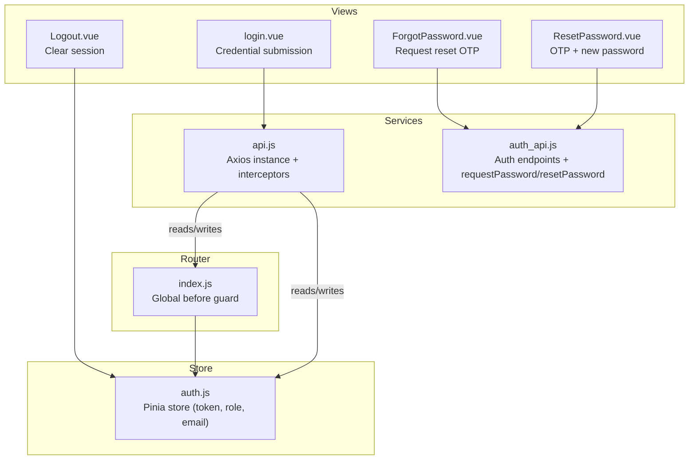
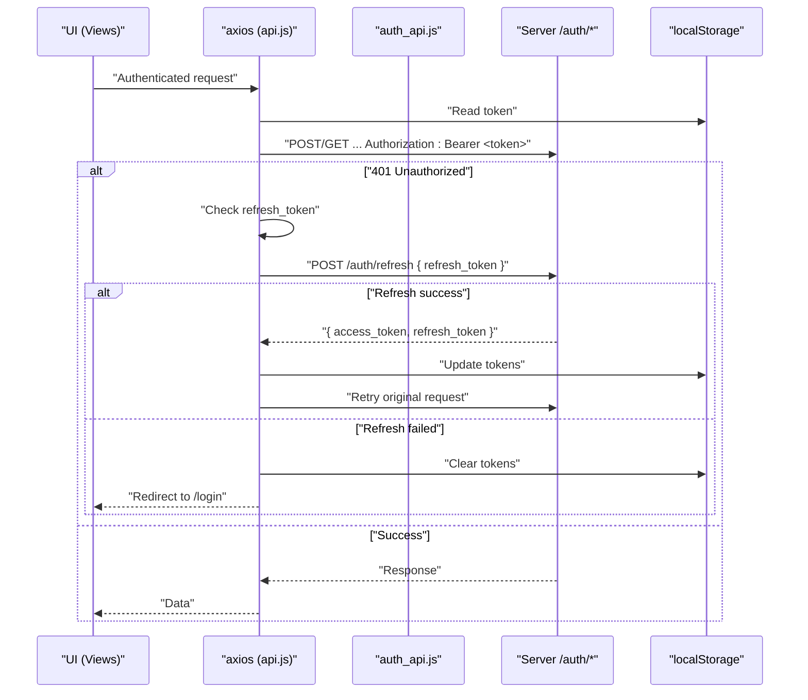
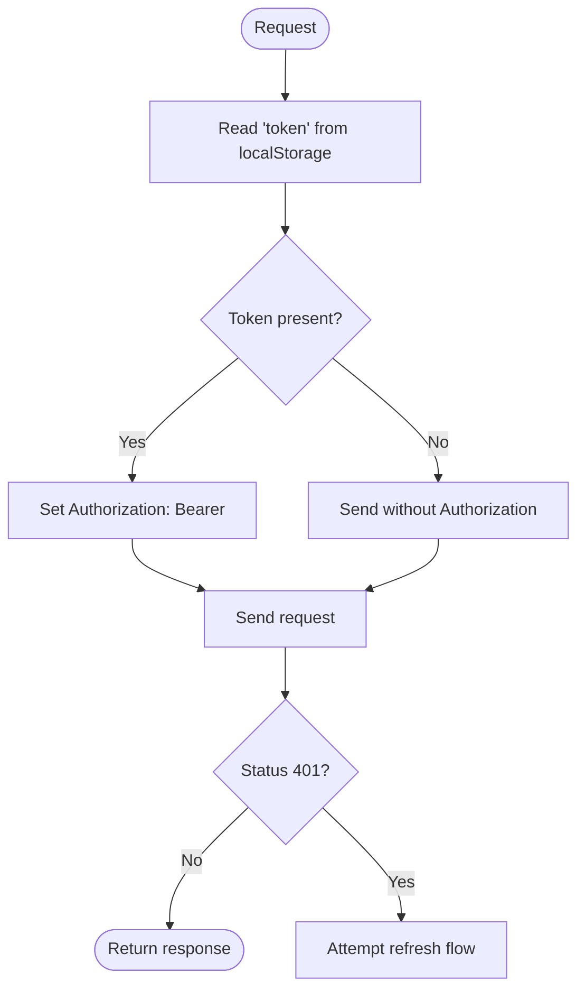
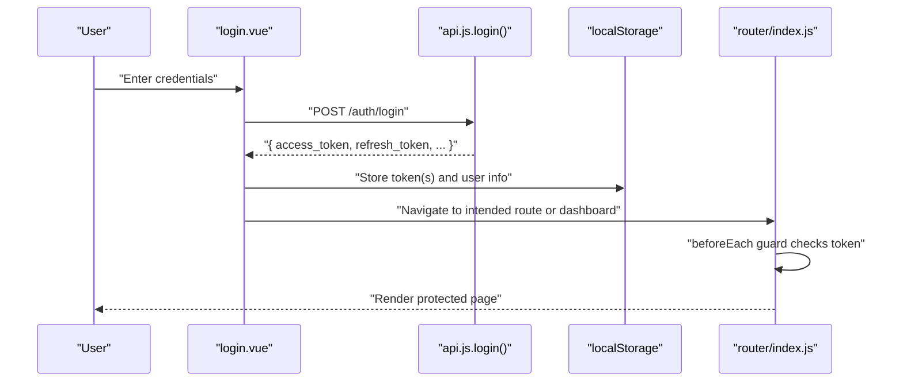
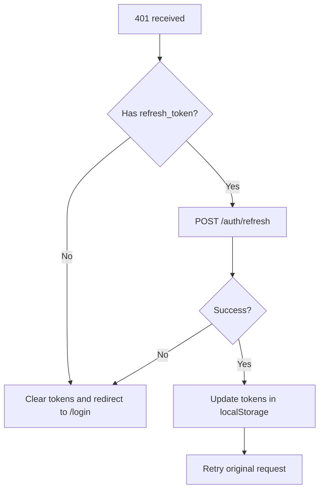
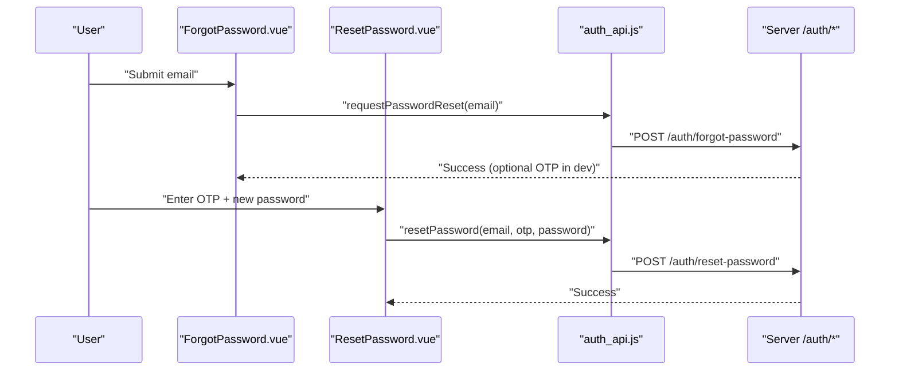
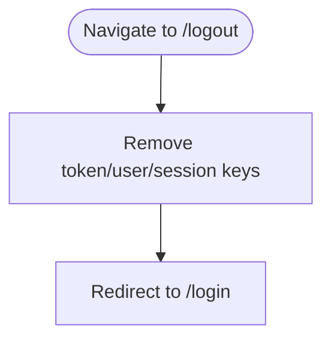
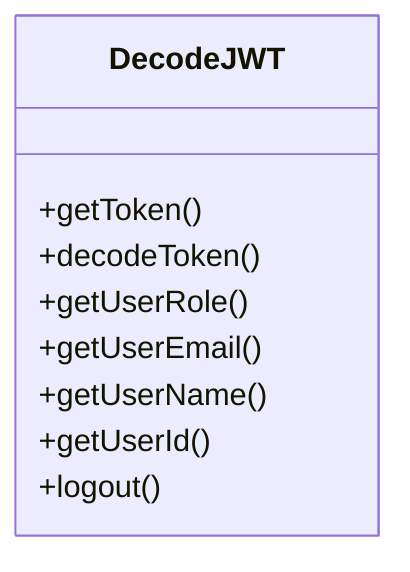
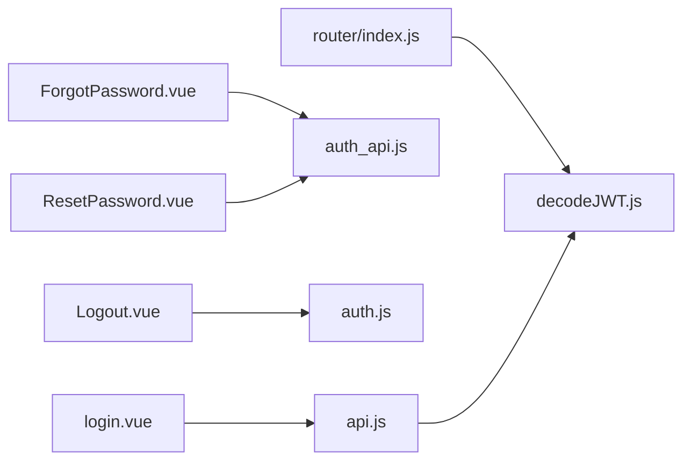

# Authentication Security

<cite>
**Referenced Files in This Document**
- [api.js](file://src/services/api.js)
- [auth_api.js](file://src/services/auth_api.js)
- [auth.js](file://src/stores/auth.js)
- [decodeJWT.js](file://src/services/decodeJWT.js)
- [login.vue](file://src/views/auth/login.vue)
- [ForgotPassword.vue](file://src/views/auth/ForgotPassword.vue)
- [ResetPassword.vue](file://src/views/auth/ResetPassword.vue)
- [Logout.vue](file://src/views/auth/Logout.vue)
- [index.js](file://src/router/index.js)
</cite>

## Table of Contents
1. [Introduction](#introduction)
2. [Project Structure](#project-structure)
3. [Core Components](#core-components)
4. [Architecture Overview](#architecture-overview)
5. [Detailed Component Analysis](#detailed-component-analysis)
6. [Dependency Analysis](#dependency-analysis)
7. [Performance Considerations](#performance-considerations)
8. [Troubleshooting Guide](#troubleshooting-guide)
9. [Conclusion](#conclusion)
10. [Appendices](#appendices)

## Introduction
This document explains the authentication and security mechanisms implemented in the ABSA Foundry Frontend. It covers JWT token storage, automatic Bearer token attachment via interceptors, token refresh on 401 responses, login flow with credential validation and session handling, logout procedures, password reset with OTP verification, and security considerations for token storage, expiration handling, and protection against common attacks such as CSRF and XSS.

## Project Structure
Authentication-related code is distributed across services, stores, views, and router:
- Services: HTTP clients and API wrappers that attach tokens and handle refresh logic
- Store: Centralized auth state synced with localStorage
- Views: Login, Forgot Password, Reset Password, Logout UIs
- Router: Global guards to enforce authentication and redirect unauthenticated users

**Diagram sources**
- [api.js:64-146](file://src/services/api.js#L64-L146)
- [auth_api.js:19-27](file://src/services/auth_api.js#L19-L27)
- [auth.js:3-20](file://src/stores/auth.js#L3-L20)
- [login.vue:181-248](file://src/views/auth/login.vue#L181-L248)
- [ForgotPassword.vue:179-196](file://src/views/auth/ForgotPassword.vue#L179-L196)
- [ResetPassword.vue:279-296](file://src/views/auth/ResetPassword.vue#L279-L296)
- [Logout.vue:7-15](file://src/views/auth/Logout.vue#L7-L15)
- [index.js:201-272](file://src/router/index.js#L201-L272)

**Section sources**
- [api.js:1-209](file://src/services/api.js#L1-L209)
- [auth_api.js:1-190](file://src/services/auth_api.js#L1-L190)
- [auth.js:1-22](file://src/stores/auth.js#L1-L22)
- [login.vue:133-265](file://src/views/auth/login.vue#L133-L265)
- [ForgotPassword.vue:156-197](file://src/views/auth/ForgotPassword.vue#L156-L197)
- [ResetPassword.vue:207-297](file://src/views/auth/ResetPassword.vue#L207-L297)
- [Logout.vue:1-25](file://src/views/auth/Logout.vue#L1-L25)
- [index.js:1-275](file://src/router/index.js#L1-L275)

## Core Components
- Axios request interceptor attaches a Bearer token from localStorage to every authenticated request.
- Axios response interceptor handles 401 Unauthorized by attempting to refresh tokens using a stored refresh token; if refresh fails or is unavailable, it clears tokens and redirects to login.
- Pinia auth store mirrors localStorage values for token, role, and email, exposing an isAuthenticated getter and a logout action that clears sensitive keys.
- Login view validates credentials, stores tokens and user metadata, and navigates to the intended route or dashboard.
- Password reset uses two endpoints: one to send OTP and another to validate OTP and set a new password.
- Logout clears local session data and redirects to login.

**Section sources**
- [api.js:64-146](file://src/services/api.js#L64-L146)
- [auth_api.js:19-27](file://src/services/auth_api.js#L19-L27)
- [auth.js:3-20](file://src/stores/auth.js#L3-L20)
- [login.vue:181-248](file://src/views/auth/login.vue#L181-L248)
- [ForgotPassword.vue:179-196](file://src/views/auth/ForgotPassword.vue#L179-L196)
- [ResetPassword.vue:279-296](file://src/views/auth/ResetPassword.vue#L279-L296)
- [Logout.vue:7-15](file://src/views/auth/Logout.vue#L7-L15)

## Architecture Overview
The authentication architecture combines client-side token management with server-driven sessions:
- Tokens are stored in localStorage for persistence across page reloads.
- All axios-based requests automatically include Authorization headers via interceptors.
- On 401, the system attempts a silent refresh using a refresh token; queued requests wait for completion.
- The router enforces access control based on presence of a valid token and role checks.

**Diagram sources**
- [api.js:64-146](file://src/services/api.js#L64-L146)
- [auth_api.js:64-87](file://src/services/auth_api.js#L64-L87)

**Section sources**
- [api.js:64-146](file://src/services/api.js#L64-L146)
- [auth_api.js:64-87](file://src/services/auth_api.js#L64-L87)

## Detailed Component Analysis

### Token Storage and Interceptors
- Request interceptor reads the current token from localStorage and sets Authorization header for all axios requests.
- A secondary client in auth_api.js also attaches Bearer tokens via its own interceptor.
- Response interceptor implements a retry queue to serialize refresh attempts and avoid concurrent refresh calls.

**Diagram sources**
- [api.js:64-76](file://src/services/api.js#L64-L76)
- [api.js:90-146](file://src/services/api.js#L90-L146)
- [auth_api.js:19-27](file://src/services/auth_api.js#L19-L27)

**Section sources**
- [api.js:64-146](file://src/services/api.js#L64-L146)
- [auth_api.js:19-27](file://src/services/auth_api.js#L19-L27)

### Login Flow and Session Handling
- The login form validates inputs and submits credentials to the backend.
- On success, tokens and user metadata are persisted to localStorage.
- The router guard ensures protected routes require a valid token; otherwise, redirects to login.
- After login, the app may fetch additional context (e.g., branches) based on claims.

**Diagram sources**
- [login.vue:181-248](file://src/views/auth/login.vue#L181-L248)
- [api.js:166-180](file://src/services/api.js#L166-L180)
- [index.js:201-272](file://src/router/index.js#L201-L272)

**Section sources**
- [login.vue:181-248](file://src/views/auth/login.vue#L181-L248)
- [api.js:166-180](file://src/services/api.js#L166-L180)
- [index.js:201-272](file://src/router/index.js#L201-L272)

### Token Refresh Mechanism
- On receiving a 401, the response interceptor checks for a refresh token.
- If available, it calls the refresh endpoint, updates stored tokens, and retries the original request.
- If refresh fails or no refresh token exists, it clears tokens and redirects to login.

**Diagram sources**
- [api.js:90-146](file://src/services/api.js#L90-L146)
- [auth_api.js:64-87](file://src/services/auth_api.js#L64-L87)

**Section sources**
- [api.js:90-146](file://src/services/api.js#L90-L146)
- [auth_api.js:64-87](file://src/services/auth_api.js#L64-L87)

### Password Reset with OTP Verification
- Forgot Password sends a reset request to the backend; optionally returns an OTP for development display.
- Reset Password validates OTP format and password strength, then calls the reset endpoint to finalize the change.

**Diagram sources**
- [ForgotPassword.vue:179-196](file://src/views/auth/ForgotPassword.vue#L179-L196)
- [auth_api.js:145-164](file://src/services/auth_api.js#L145-L164)
- [ResetPassword.vue:279-296](file://src/views/auth/ResetPassword.vue#L279-L296)
- [auth_api.js:166-189](file://src/services/auth_api.js#L166-L189)

**Section sources**
- [ForgotPassword.vue:179-196](file://src/views/auth/ForgotPassword.vue#L179-L196)
- [auth_api.js:145-189](file://src/services/auth_api.js#L145-L189)
- [ResetPassword.vue:279-296](file://src/views/auth/ResetPassword.vue#L279-L296)

### Logout Procedures
- Dedicated logout view clears relevant keys from localStorage and redirects to login.
- Additional logout helpers clear broader auth state in the Pinia store and other utilities.

**Diagram sources**
- [Logout.vue:7-15](file://src/views/auth/Logout.vue#L7-L15)
- [auth.js:12-20](file://src/stores/auth.js#L12-L20)

**Section sources**
- [Logout.vue:7-15](file://src/views/auth/Logout.vue#L7-L15)
- [auth.js:12-20](file://src/stores/auth.js#L12-L20)

### JWT Decoding and Expiration Handling
- JWT decoding utility checks token expiry and triggers logout when expired.
- Provides helpers to read user identity and roles from decoded tokens.

**Diagram sources**
- [decodeJWT.js:11-96](file://src/services/decodeJWT.js#L11-L96)

**Section sources**
- [decodeJWT.js:11-96](file://src/services/decodeJWT.js#L11-L96)

## Dependency Analysis
- api.js depends on axios and provides global interceptors used by most feature modules.
- auth_api.js defines dedicated auth endpoints and includes its own interceptor for consistency.
- login.vue depends on api.js login function and decodeJWT for claims processing.
- Router guard depends on decodeJWT to evaluate roles and enforce access.
- Stores mirror localStorage to keep UI state consistent.

**Diagram sources**
- [login.vue:181-248](file://src/views/auth/login.vue#L181-L248)
- [ForgotPassword.vue:179-196](file://src/views/auth/ForgotPassword.vue#L179-L196)
- [ResetPassword.vue:279-296](file://src/views/auth/ResetPassword.vue#L279-L296)
- [Logout.vue:7-15](file://src/views/auth/Logout.vue#L7-L15)
- [index.js:201-272](file://src/router/index.js#L201-L272)
- [api.js:64-146](file://src/services/api.js#L64-L146)
- [auth_api.js:19-27](file://src/services/auth_api.js#L19-L27)
- [decodeJWT.js:11-96](file://src/services/decodeJWT.js#L11-L96)

**Section sources**
- [login.vue:181-248](file://src/views/auth/login.vue#L181-L248)
- [ForgotPassword.vue:179-196](file://src/views/auth/ForgotPassword.vue#L179-L196)
- [ResetPassword.vue:279-296](file://src/views/auth/ResetPassword.vue#L279-L296)
- [Logout.vue:7-15](file://src/views/auth/Logout.vue#L7-L15)
- [index.js:201-272](file://src/router/index.js#L201-L272)
- [api.js:64-146](file://src/services/api.js#L64-L146)
- [auth_api.js:19-27](file://src/services/auth_api.js#L19-L27)
- [decodeJWT.js:11-96](file://src/services/decodeJWT.js#L11-L96)

## Performance Considerations
- Token refresh uses a queue to prevent multiple concurrent refresh calls, reducing unnecessary network traffic.
- Storing tokens in localStorage avoids repeated network calls to re-authenticate on page reload.
- Avoid storing large payloads in localStorage; keep only minimal identifiers and tokens.

[No sources needed since this section provides general guidance]

## Troubleshooting Guide
Common issues and resolutions:
- 401 Unauthorized after navigation: Ensure refresh_token exists; if missing, the system clears tokens and redirects to login.
- Stuck loading after login: Verify that tokens were written to localStorage and that the router guard allows access.
- Password reset failures: Validate OTP length/format and password requirements; check error messages returned by the reset endpoint.
- Expired token behavior: The decoder logs a warning and triggers logout; ensure the application redirects appropriately.

**Section sources**
- [api.js:90-146](file://src/services/api.js#L90-L146)
- [decodeJWT.js:11-38](file://src/services/decodeJWT.js#L11-L38)
- [ForgotPassword.vue:179-196](file://src/views/auth/ForgotPassword.vue#L179-L196)
- [ResetPassword.vue:279-296](file://src/views/auth/ResetPassword.vue#L279-L296)

## Conclusion
The ABSA Foundry Frontend implements a robust authentication flow with secure token storage, automatic Bearer token attachment, resilient token refresh, and comprehensive password reset capabilities. The router guard enforces access control, while JWT decoding ensures timely logout on expiration. For enhanced security, consider adding CSRF protections where applicable, enforcing HTTPS-only cookies for refresh tokens, and implementing strict Content Security Policy to mitigate XSS risks.

[No sources needed since this section summarizes without analyzing specific files]

## Appendices

### Practical Examples and Best Practices
- Implementing secure authentication flows:
  - Always validate inputs on the client side and rely on server-side validation for credentials and OTP.
  - Use interceptors to centralize token attachment and refresh logic to avoid duplication.
- Handling authentication errors gracefully:
  - Provide user-friendly messages for invalid credentials, expired sessions, and network errors.
  - Redirect to login on 401 when refresh fails and clear sensitive data.
- Security considerations:
  - Token storage: Prefer HttpOnly cookies for refresh tokens to reduce XSS exposure; if using localStorage, ensure CSP and sanitize outputs rigorously.
  - Expiration handling: Check token expiry on decode and proactively refresh or logout.
  - CSRF/XSS: Enforce CSP, avoid inline scripts, sanitize user inputs, and use proper headers.

[No sources needed since this section provides general guidance]