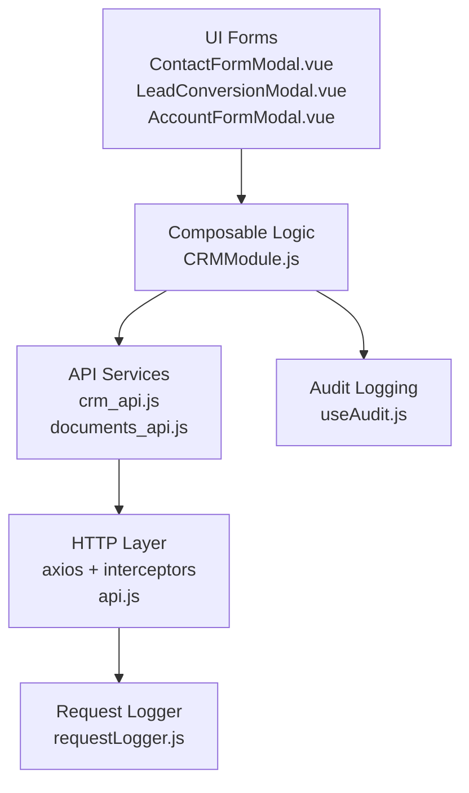
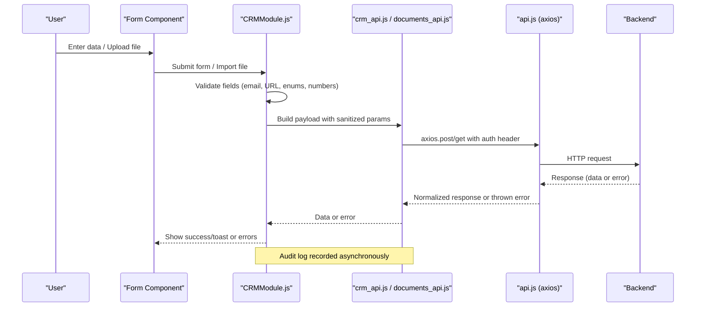
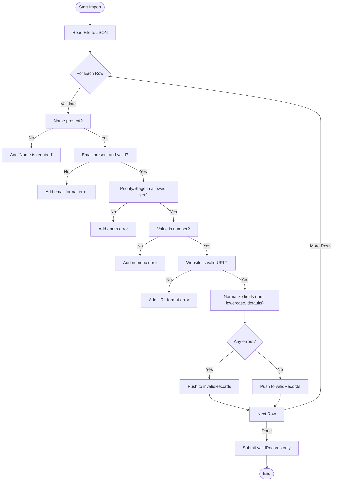
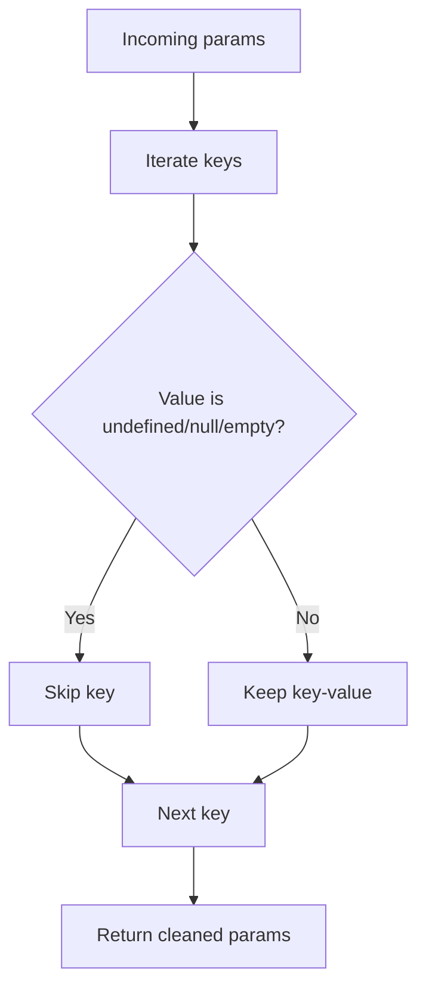
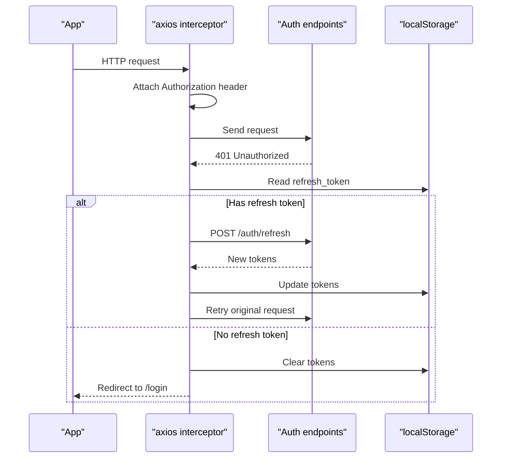
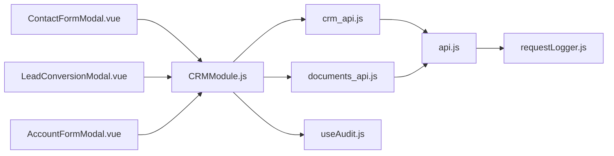

# Input Validation & Sanitization

<cite>
**Referenced Files in This Document**
- [api.js](file://src/services/api.js)
- [crm_api.js](file://src/services/crm_api.js)
- [documents_api.js](file://src/services/documents_api.js)
- [useAudit.js](file://src/config/useAudit.js)
- [requestLogger.js](file://src/utils/requestLogger.js)
- [CRMModule.js](file://src/views/Modules/crm/composables/CRMModule.js)
- [ContactFormModal.vue](file://src/views/Modules/crm/components/ContactFormModal.vue)
- [LeadConversionModal.vue](file://src/views/Modules/crm/components/LeadConversionModal.vue)
- [AccountFormModal.vue](file://src/views/Modules/crm/components/AccountFormModal.vue)
- [BulkUploadLeadsModal.vue](file://src/views/Modules/crm/components/BulkUploadLeadsModal.vue)
- [DocumentUploadModal.vue](file://src/views/Modules/crm/components/DocumentUploadModal.vue)
</cite>

## Table of Contents
1. [Introduction](#introduction)
2. [Project Structure](#project-structure)
3. [Core Components](#core-components)
4. [Architecture Overview](#architecture-overview)
5. [Detailed Component Analysis](#detailed-component-analysis)
6. [Dependency Analysis](#dependency-analysis)
7. [Performance Considerations](#performance-considerations)
8. [Troubleshooting Guide](#troubleshooting-guide)
9. [Conclusion](#conclusion)

## Introduction
This document explains how the ABSA Foundry Frontend validates and sanitizes user inputs to prevent XSS, injection, and data integrity issues. It covers:
- Client-side validation strategies for forms and bulk imports
- Sanitization techniques for user-generated content and file uploads
- Request logging mechanisms for security monitoring and audit trails
- Best practices for error messaging and safe rendering
- Examples mapped to actual code locations

## Project Structure
The frontend uses a layered approach:
- UI components collect and validate user input (Vue components with HTML5 constraints and custom checks)
- Composables centralize business logic and validation rules (e.g., CRM module)
- Services encapsulate API calls, parameter sanitization, and error handling
- Utilities provide request logging and audit logging

**Diagram sources**
- [ContactFormModal.vue:62-85](file://src/views/Modules/crm/components/ContactFormModal.vue#L62-L85)
- [LeadConversionModal.vue:100-118](file://src/views/Modules/crm/components/LeadConversionModal.vue#L100-L118)
- [AccountFormModal.vue:44-67](file://src/views/Modules/crm/components/AccountFormModal.vue#L44-L67)
- [CRMModule.js:2496-2534](file://src/views/Modules/crm/composables/CRMModule.js#L2496-L2534)
- [crm_api.js:34-44](file://src/services/crm_api.js#L34-L44)
- [documents_api.js:48-59](file://src/services/documents_api.js#L48-L59)
- [api.js:64-76](file://src/services/api.js#L64-L76)
- [requestLogger.js:1-34](file://src/utils/requestLogger.js#L1-L34)
- [useAudit.js:43-72](file://src/config/useAudit.js#L43-L72)

**Section sources**
- [api.js:20-38](file://src/services/api.js#L20-L38)
- [crm_api.js:34-44](file://src/services/crm_api.js#L34-L44)
- [documents_api.js:48-59](file://src/services/documents_api.js#L48-L59)
- [CRMModule.js:2496-2534](file://src/views/Modules/crm/composables/CRMModule.js#L2496-L2534)

## Core Components
- Form inputs use HTML5 types and required attributes to enforce basic validation at the UI layer.
- Bulk import flows parse files client-side, then validate each row against strict rules before submission.
- API services sanitize query parameters to remove empty or invalid values prior to network requests.
- Axios interceptors attach authentication tokens and handle token refresh on 401 responses.
- Audit logging records user actions asynchronously without blocking feature flows.
- A lightweight fetch wrapper logs request/response details for debugging and monitoring.

Key implementation highlights:
- Parameter sanitization removes undefined/null/empty strings from query payloads.
- Email and URL formats are validated using regex and URL constructor.
- File uploads set appropriate headers and metadata; server enforces final acceptance.
- Error messages are surfaced via toasts/alerts and structured error objects.

**Section sources**
- [crm_api.js:34-44](file://src/services/crm_api.js#L34-L44)
- [CRMModule.js:2516-2534](file://src/views/Modules/crm/composables/CRMModule.js#L2516-L2534)
- [api.js:64-76](file://src/services/api.js#L64-L76)
- [useAudit.js:43-72](file://src/config/useAudit.js#L43-L72)
- [requestLogger.js:1-34](file://src/utils/requestLogger.js#L1-L34)

## Architecture Overview
The end-to-end flow for secure input handling spans UI, composable logic, services, and network layers.

**Diagram sources**
- [CRMModule.js:2496-2534](file://src/views/Modules/crm/composables/CRMModule.js#L2496-L2534)
- [crm_api.js:34-44](file://src/services/crm_api.js#L34-L44)
- [documents_api.js:48-59](file://src/services/documents_api.js#L48-L59)
- [api.js:64-76](file://src/services/api.js#L64-L76)
- [useAudit.js:43-72](file://src/config/useAudit.js#L43-L72)

## Detailed Component Analysis

### Form Inputs and Basic Validation
- Contact and lead forms bind to model properties and rely on HTML5 type constraints (email, tel, url) plus required attributes to catch obvious mistakes early.
- Account forms constrain industry via select lists to prevent free-text injection.

Security benefits:
- Reduces malformed input reaching the backend.
- Minimizes XSS surface by avoiding raw HTML binding in templates.

Examples in code:
- Email and phone fields with proper types and required flags.
- Industry selection restricted to predefined options.

**Section sources**
- [ContactFormModal.vue:62-85](file://src/views/Modules/crm/components/ContactFormModal.vue#L62-L85)
- [LeadConversionModal.vue:100-118](file://src/views/Modules/crm/components/LeadConversionModal.vue#L100-L118)
- [AccountFormModal.vue:44-67](file://src/views/Modules/crm/components/AccountFormModal.vue#L44-L67)

### Bulk Import Validation Pipeline
The bulk import flow reads spreadsheets, parses rows, and validates each record before sending to the server.

**Diagram sources**
- [CRMModule.js:2496-2534](file://src/views/Modules/crm/composables/CRMModule.js#L2496-L2534)

Best practices demonstrated:
- Strict field presence checks
- Format validation for emails and URLs
- Enumerated value enforcement for priority and stage
- Numeric coercion and defaulting
- Normalization (trimming, lowercasing) to ensure consistent data

**Section sources**
- [CRMModule.js:2516-2534](file://src/views/Modules/crm/composables/CRMModule.js#L2516-L2534)

### File Upload Handling
- The document upload modal collects metadata and attaches a file to FormData.
- The service configures multipart/form-data correctly by removing the default Content-Type so the browser sets the boundary.
- File type and size checks occur in the bulk import flow; general document upload accepts any type but relies on server-side validation for safety.

Security considerations:
- Always validate file type and size on the client where feasible.
- Rely on server-side validation for final acceptance.
- Avoid executing or rendering uploaded content on the client.

**Section sources**
- [DocumentUploadModal.vue:264-297](file://src/views/Modules/crm/components/DocumentUploadModal.vue#L264-L297)
- [documents_api.js:48-59](file://src/services/documents_api.js#L48-L59)
- [CRMModule.js:2496-2498](file://src/views/Modules/crm/composables/CRMModule.js#L2496-L2498)

### API Parameter Sanitization
Query parameters are sanitized to remove undefined, null, empty strings, and literal 'undefined' values before being sent to the backend. This reduces noise and prevents accidental injection through malformed query strings.

**Diagram sources**
- [crm_api.js:34-44](file://src/services/crm_api.js#L34-L44)

**Section sources**
- [crm_api.js:34-44](file://src/services/crm_api.js#L34-L44)

### Authentication and Token Refresh Flow
Axios interceptors automatically attach Bearer tokens and handle 401 responses by refreshing tokens when possible. If refresh fails, users are redirected to login.

**Diagram sources**
- [api.js:64-76](file://src/services/api.js#L64-L76)
- [api.js:78-146](file://src/services/api.js#L78-L146)

**Section sources**
- [api.js:64-76](file://src/services/api.js#L64-L76)
- [api.js:78-146](file://src/services/api.js#L78-L146)

### Request Logging and Audit Trails
- A lightweight fetch wrapper logs method, URL, payload, and response status/body for debugging.
- An audit composable posts user actions to a dedicated endpoint asynchronously, ensuring failures do not break feature flows.

Security notes:
- Avoid logging sensitive headers like Authorization.
- Ensure audit payloads do not include secrets or PII beyond what is necessary.

**Section sources**
- [requestLogger.js:1-34](file://src/utils/requestLogger.js#L1-L34)
- [useAudit.js:43-72](file://src/config/useAudit.js#L43-L72)

## Dependency Analysis
The following diagram shows how validation and sanitization responsibilities are distributed across modules.

**Diagram sources**
- [ContactFormModal.vue:62-85](file://src/views/Modules/crm/components/ContactFormModal.vue#L62-L85)
- [LeadConversionModal.vue:100-118](file://src/views/Modules/crm/components/LeadConversionModal.vue#L100-L118)
- [AccountFormModal.vue:44-67](file://src/views/Modules/crm/components/AccountFormModal.vue#L44-L67)
- [CRMModule.js:2496-2534](file://src/views/Modules/crm/composables/CRMModule.js#L2496-L2534)
- [crm_api.js:34-44](file://src/services/crm_api.js#L34-L44)
- [documents_api.js:48-59](file://src/services/documents_api.js#L48-L59)
- [api.js:64-76](file://src/services/api.js#L64-L76)
- [useAudit.js:43-72](file://src/config/useAudit.js#L43-L72)
- [requestLogger.js:1-34](file://src/utils/requestLogger.js#L1-L34)

**Section sources**
- [CRMModule.js:2496-2534](file://src/views/Modules/crm/composables/CRMModule.js#L2496-L2534)
- [crm_api.js:34-44](file://src/services/crm_api.js#L34-L44)
- [documents_api.js:48-59](file://src/services/documents_api.js#L48-L59)
- [api.js:64-76](file://src/services/api.js#L64-L76)

## Performance Considerations
- Prefer client-side validation for immediate feedback and reduced network round-trips.
- Use enumerated selects to avoid expensive parsing and validation.
- Batch validations during bulk imports to minimize reflows and keep UI responsive.
- Log requests efficiently; avoid heavy serialization in hot paths.

[No sources needed since this section provides general guidance]

## Troubleshooting Guide
Common issues and resolutions:
- Invalid email or URL in bulk import: Ensure values match expected formats; see validation rules in the import pipeline.
- Empty or malformed query parameters: Confirm that parameters are sanitized before sending; check the sanitizer function.
- 401 Unauthorized: Verify token presence and refresh flow; confirm redirect behavior when refresh fails.
- Audit log failures: Non-fatal warnings are logged; investigate if audit events are missing.

Where to look:
- Bulk import validation and normalization
- Parameter sanitizer in CRM API
- Axios interceptors for auth and refresh
- Audit logging composable

**Section sources**
- [CRMModule.js:2516-2534](file://src/views/Modules/crm/composables/CRMModule.js#L2516-L2534)
- [crm_api.js:34-44](file://src/services/crm_api.js#L34-L44)
- [api.js:78-146](file://src/services/api.js#L78-L146)
- [useAudit.js:43-72](file://src/config/useAudit.js#L43-L72)

## Conclusion
The ABSA Foundry Frontend implements a robust, layered approach to input validation and sanitization:
- UI-level constraints and composable-driven validation reduce risks early.
- Centralized parameter sanitization ensures clean queries.
- Secure file handling and server-side validation guard against malicious uploads.
- Robust authentication handling protects sessions.
- Request and audit logging support monitoring and compliance.

Adopt these patterns consistently across new features to maintain data integrity and protect against XSS, injection, and other common web vulnerabilities.

[No sources needed since this section summarizes without analyzing specific files]