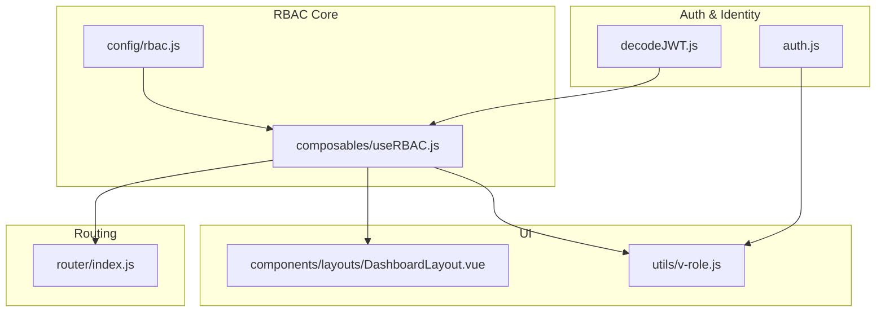
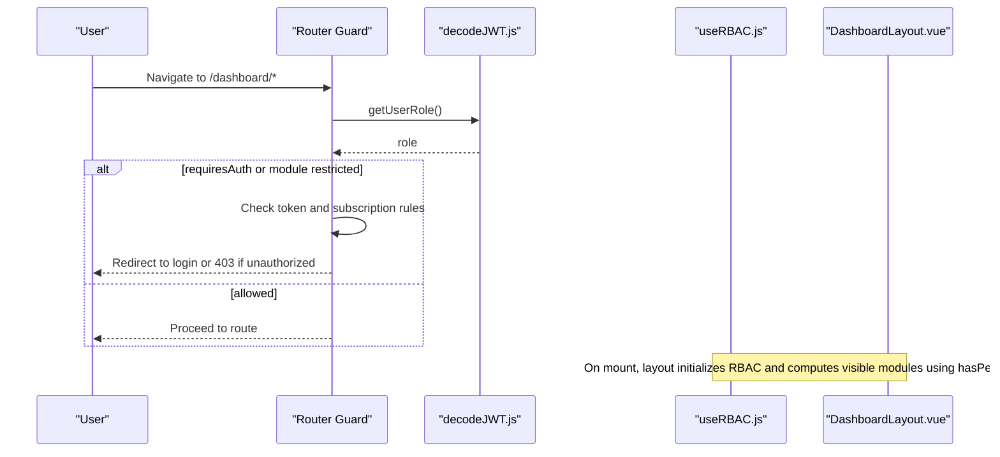
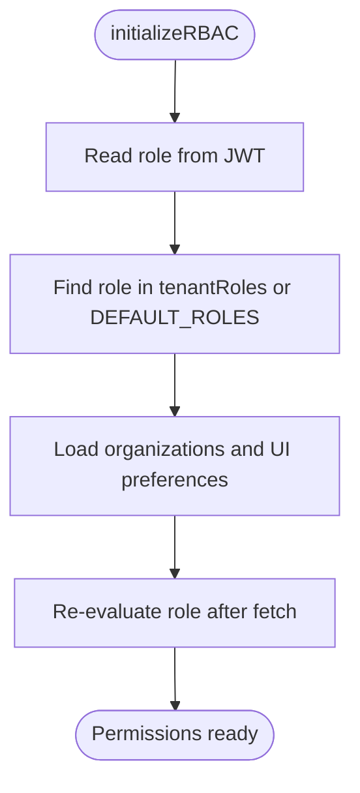
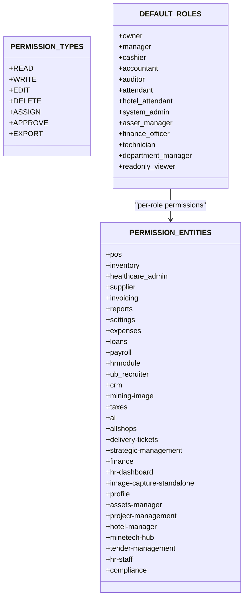
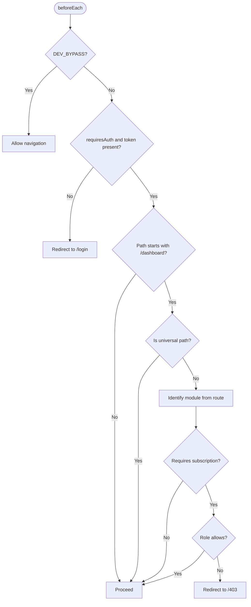
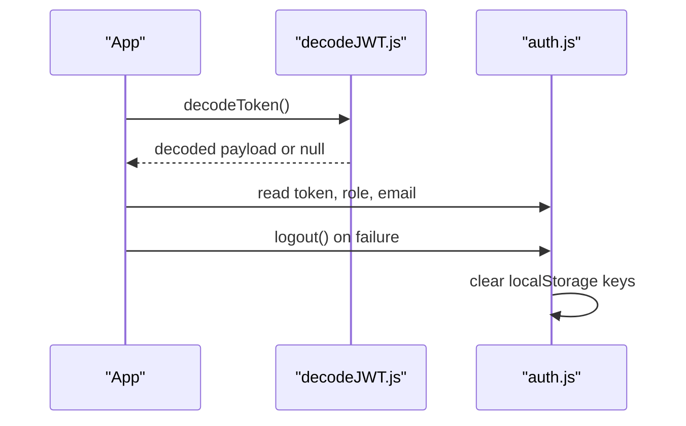
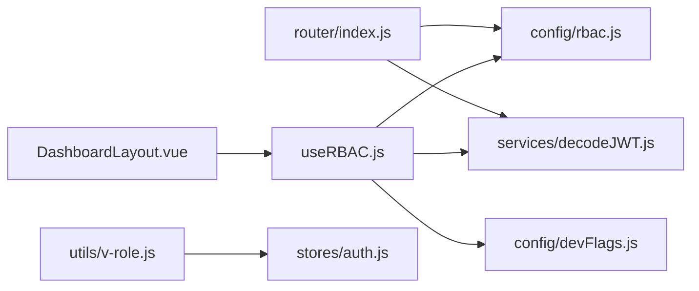

# Role-Based Access Control (RBAC)

<cite>
**Referenced Files in This Document**
- [useRBAC.js](file://src/composables/useRBAC.js)
- [rbac.js](file://src/config/rbac.js)
- [index.js](file://src/router/index.js)
- [auth.js](file://src/stores/auth.js)
- [decodeJWT.js](file://src/services/decodeJWT.js)
- [v-role.js](file://src/utils/v-role.js)
- [DashboardLayout.vue](file://src/components/layouts/DashboardLayout.vue)
- [devFlags.js](file://src/config/devFlags.js)
</cite>

## Table of Contents
1. Introduction
2. Project Structure
3. Core Components
4. Architecture Overview
5. Detailed Component Analysis
6. Dependency Analysis
7. Performance Considerations
8. Troubleshooting Guide
9. Conclusion
10. Appendices

## Introduction
This document explains the Role-Based Access Control (RBAC) system implemented in the ABSA Foundry Frontend. It covers role definitions, permission matrices, authorization checks, route guards, composables and utilities for permissions, UI-level conditional rendering, API-level authorization patterns, permission hierarchy and inheritance, dynamic permission assignment, and guidance for adding new roles and fine-grained access control across modules.

## Project Structure
The RBAC implementation is centered around a composable that loads roles and permissions from the backend, a configuration file defining entities, default roles, and permission helpers, a router guard for authentication and module access, stores for auth state, JWT decoding utilities, and UI helpers for role-based rendering.

**Diagram sources**
- [decodeJWT.js:11-62](file://src/services/decodeJWT.js#L11-L62)
- [auth.js:3-21](file://src/stores/auth.js#L3-L21)
- [rbac.js:13-77](file://src/config/rbac.js#L13-L77)
- [useRBAC.js:55-78](file://src/composables/useRBAC.js#L55-L78)
- [index.js:201-272](file://src/router/index.js#L201-L272)
- [DashboardLayout.vue:109-227](file://src/components/layouts/DashboardLayout.vue#L109-L227)
- [v-role.js:3-11](file://src/utils/v-role.js#L3-L11)

**Section sources**
- [useRBAC.js:55-78](file://src/composables/useRBAC.js#L55-L78)
- [rbac.js:13-77](file://src/config/rbac.js#L13-L77)
- [index.js:201-272](file://src/router/index.js#L201-L272)
- [DashboardLayout.vue:109-227](file://src/components/layouts/DashboardLayout.vue#L109-L227)
- [v-role.js:3-11](file://src/utils/v-role.js#L3-L11)
- [decodeJWT.js:11-62](file://src/services/decodeJWT.js#L11-L62)
- [auth.js:3-21](file://src/stores/auth.js#L3-L21)

## Core Components
- Permission model and defaults: Entities, permission types, default roles, and helper functions are defined centrally.
- RBAC composable: Loads tenant roles and permissions, exposes permission checks, role management APIs, and UI preferences.
- Router guard: Enforces authentication and module subscription rules before navigation.
- Auth store and JWT decoding: Provides current user identity and token lifecycle.
- UI helpers: Directive to hide elements based on roles; layout uses RBAC to compute visible modules and settings access.

Key responsibilities:
- Centralize role and permission definitions for consistency.
- Provide reusable permission checks across components.
- Protect routes and UI surfaces based on roles and subscriptions.
- Support dynamic role merging from backend with static defaults.

**Section sources**
- [rbac.js:13-77](file://src/config/rbac.js#L13-L77)
- [rbac.js:85-337](file://src/config/rbac.js#L85-L337)
- [useRBAC.js:55-78](file://src/composables/useRBAC.js#L55-L78)
- [useRBAC.js:144-226](file://src/composables/useRBAC.js#L144-L226)
- [index.js:201-272](file://src/router/index.js#L201-L272)
- [DashboardLayout.vue:109-227](file://src/components/layouts/DashboardLayout.vue#L109-L227)
- [v-role.js:3-11](file://src/utils/v-role.js#L3-L11)
- [decodeJWT.js:11-62](file://src/services/decodeJWT.js#L11-L62)
- [auth.js:3-21](file://src/stores/auth.js#L3-L21)

## Architecture Overview
The RBAC architecture combines runtime role resolution with declarative permission checks:

- On app start, the RBAC composable initializes by reading the user’s role from the JWT, loading tenant-specific roles and organizations from the backend, and applying UI preferences.
- Permission checks are performed via the composable’s methods, which delegate to core helpers that evaluate entity-specific permissions.
- Route guards enforce authentication and module subscription constraints before allowing navigation.
- UI components use computed checks and directives to conditionally render features based on permissions.

**Diagram sources**
- [index.js:201-272](file://src/router/index.js#L201-L272)
- [decodeJWT.js:11-62](file://src/services/decodeJWT.js#L11-L62)
- [useRBAC.js:668-719](file://src/composables/useRBAC.js#L668-L719)
- [DashboardLayout.vue:109-227](file://src/components/layouts/DashboardLayout.vue#L109-L227)

## Detailed Component Analysis

### RBAC Composable (useRBAC)
Responsibilities:
- Initialize current user role and permissions from JWT and backend roles.
- Expose permission checking methods: hasPermission, hasAnyPermission, canRead, canWrite, canEdit, canDelete, canAssign, canApprove, canExport.
- Manage roles and organizations via API calls (fetch, create, update, delete).
- Apply UI preferences and persist them locally.
- Merge backend custom roles with static defaults.

Authorization logic:
- Super-admin, admin, and owner bypass checks in development mode or when explicitly allowed.
- Otherwise, delegates to core permission helpers to evaluate entity-specific permissions.

Initialization flow:
- Reads role from JWT.
- Finds matching role from tenant roles or defaults.
- Loads organizations and UI preferences in parallel.
- Re-evaluates role after fetching to ensure latest permissions.

**Diagram sources**
- [useRBAC.js:668-719](file://src/composables/useRBAC.js#L668-L719)

**Section sources**
- [useRBAC.js:55-78](file://src/composables/useRBAC.js#L55-L78)
- [useRBAC.js:144-226](file://src/composables/useRBAC.js#L144-L226)
- [useRBAC.js:668-719](file://src/composables/useRBAC.js#L668-L719)

### Permission Model and Defaults (rbac.js)
Defines:
- Permission types: read, write, edit, delete, assign, approve, export.
- Entities/modules available for permission assignment.
- Default roles with explicit per-entity permissions.
- Helper functions: hasPermission, hasAnyPermission, mergeRoles, validateRole, createEmptyRole.

Permission matrix highlights:
- Owner has full permissions across all entities.
- Manager, cashier, accountant, auditor, attendant, hotel_attendant have scoped permissions.
- Asset-related roles define granular permissions for assets-manager and related modules.

**Diagram sources**
- [rbac.js:13-77](file://src/config/rbac.js#L13-L77)
- [rbac.js:85-337](file://src/config/rbac.js#L85-L337)

**Section sources**
- [rbac.js:13-77](file://src/config/rbac.js#L13-L77)
- [rbac.js:85-337](file://src/config/rbac.js#L85-L337)
- [rbac.js:658-713](file://src/config/rbac.js#L658-L713)

### Route Guards (router/index.js)
Enforcement points:
- Authentication check: If a route requires auth and no token exists, redirect to login.
- Module subscription enforcement: For dashboard routes beyond portfolio, identify the target module and enforce subscription rules based on role and cached allowed modules.
- Impersonation support: Accepts an impersonation token from query params, sets it in storage, and redirects to dashboard.

**Diagram sources**
- [index.js:201-272](file://src/router/index.js#L201-L272)

**Section sources**
- [index.js:201-272](file://src/router/index.js#L201-L272)

### Auth Store and JWT Decoding
- Auth store maintains token, user role, and email from localStorage and provides logout action to clear state.
- JWT decoding utility validates token expiry, extracts user identity fields, supports dev bypass payload, and handles logout by calling backend and clearing local storage.

**Diagram sources**
- [decodeJWT.js:11-96](file://src/services/decodeJWT.js#L11-L96)
- [auth.js:3-21](file://src/stores/auth.js#L3-L21)

**Section sources**
- [decodeJWT.js:11-96](file://src/services/decodeJWT.js#L11-L96)
- [auth.js:3-21](file://src/stores/auth.js#L3-L21)

### UI-Level Authorization
- Dashboard layout computes visibility of modules and settings access using RBAC checks.
- v-role directive removes DOM nodes when the user’s role does not match the required roles.

Examples:
- Settings access computed via isAdmin/isSuperAdmin or hasPermission('settings', 'read').
- Sidebar modules filtered by subscription and hasPermission checks for non-admin roles.
- v-role usage to hide buttons or sections based on role arrays.

**Section sources**
- [DashboardLayout.vue:109-227](file://src/components/layouts/DashboardLayout.vue#L109-L227)
- [v-role.js:3-11](file://src/utils/v-role.js#L3-L11)

## Dependency Analysis
Core dependencies and relationships:
- useRBAC depends on rbac.js for permission helpers and constants, decodeJWT.js for user identity, and devFlags.js for development bypass behavior.
- Router guard depends on decodeJWT.js and module configuration to enforce access.
- DashboardLayout depends on useRBAC for permission checks and module filtering.
- v-role depends on auth store for current role.

**Diagram sources**
- [useRBAC.js:55-78](file://src/composables/useRBAC.js#L55-L78)
- [rbac.js:13-77](file://src/config/rbac.js#L13-L77)
- [decodeJWT.js:11-62](file://src/services/decodeJWT.js#L11-L62)
- [devFlags.js:1-28](file://src/config/devFlags.js#L1-L28)
- [index.js:201-272](file://src/router/index.js#L201-L272)
- [DashboardLayout.vue:109-227](file://src/components/layouts/DashboardLayout.vue#L109-L227)
- [v-role.js:3-11](file://src/utils/v-role.js#L3-L11)
- [auth.js:3-21](file://src/stores/auth.js#L3-L21)

**Section sources**
- [useRBAC.js:55-78](file://src/composables/useRBAC.js#L55-L78)
- [rbac.js:13-77](file://src/config/rbac.js#L13-L77)
- [index.js:201-272](file://src/router/index.js#L201-L272)
- [DashboardLayout.vue:109-227](file://src/components/layouts/DashboardLayout.vue#L109-L227)
- [v-role.js:3-11](file://src/utils/v-role.js#L3-L11)
- [decodeJWT.js:11-62](file://src/services/decodeJWT.js#L11-L62)
- [auth.js:3-21](file://src/stores/auth.js#L3-L21)
- [devFlags.js:1-28](file://src/config/devFlags.js#L1-L28)

## Performance Considerations
- Lazy initialization: RBAC loads roles, organizations, and UI preferences in parallel to minimize startup time.
- Local caching: UI preferences are cached in localStorage for faster subsequent loads.
- Minimal checks: Permission checks are O(1) lookups into role permissions arrays.
- Avoid redundant network calls: Use memoized computed properties in components where possible.

[No sources needed since this section provides general guidance]

## Troubleshooting Guide
Common issues and resolutions:
- Token expired or invalid: The JWT decoder logs warnings and triggers logout; ensure tokens are refreshed and stored correctly.
- Development bypass: When enabled, checks may be skipped; disable in production to enforce security.
- Missing permissions: Verify role assignments in backend and ensure tenant roles are merged correctly.
- Route redirection: Confirm route meta flags and module subscription status; check allowed modules cache.

**Section sources**
- [decodeJWT.js:11-96](file://src/services/decodeJWT.js#L11-L96)
- [devFlags.js:1-28](file://src/config/devFlags.js#L1-L28)
- [useRBAC.js:144-226](file://src/composables/useRBAC.js#L144-L226)
- [index.js:201-272](file://src/router/index.js#L201-L272)

## Conclusion
The ABSA Foundry Frontend implements a robust RBAC system combining centralized role and permission definitions, a flexible composable for runtime checks, strict route guards, and UI-level controls. The design supports dynamic role merging, fine-grained permissions per entity, and scalable extension for new modules and roles. Following the guidance below will help maintain secure and consistent access control across the application.

[No sources needed since this section summarizes without analyzing specific files]

## Appendices

### Permission Matrix Summary
- Entities: POS, Inventory, Healthcare Admin, Supplier, Invoicing, Reports, Settings, Expenses, Loans, Payroll, HR Module, Recruiter, CRM, Mining/Image Capture, Taxes, AI Agent, Users, Delivery Tickets, Executive Module, Finance Dashboard, HR Dashboard, Image Capture Standalone, Profile, Unified Assets, Project Management, Hotel Management, MineTech Hub, Tender Management, Staff Portal, Compliance Center.
- Permission types: read, write, edit, delete, assign, approve, export.
- Default roles include Owner, Manager, Cashier, Accountant, Auditor, Attendant, Hotel Attendant, System Admin, Asset Manager, Finance Officer, Technician, Department Manager, Read-Only Viewer.

**Section sources**
- [rbac.js:13-77](file://src/config/rbac.js#L13-L77)
- [rbac.js:85-337](file://src/config/rbac.js#L85-L337)

### Authorization Checks Reference
- hasPermission(entity, permission): Core check delegated to rbac.js helpers.
- hasAnyPermission(entity): Checks if any permissions exist for an entity.
- canRead/canWrite/canEdit/canDelete/canAssign/canApprove/canExport: Convenience wrappers around hasPermission.
- isSuperAdmin/isAdmin/canManageRoles: Role-based shortcuts used in UI and guards.

**Section sources**
- [useRBAC.js:55-78](file://src/composables/useRBAC.js#L55-L78)
- [rbac.js:658-671](file://src/config/rbac.js#L658-L671)

### Route Guards Reference
- Authentication: Redirects to login if token missing for protected routes.
- Module access: Enforces subscription requirements for dashboard routes beyond portfolio.
- Impersonation: Supports temporary admin impersonation via URL parameter.

**Section sources**
- [index.js:201-272](file://src/router/index.js#L201-L272)

### UI-Level Conditional Rendering
- Dashboard layout computes settings access and visible modules using RBAC checks.
- v-role directive hides elements when user role does not match required roles.

**Section sources**
- [DashboardLayout.vue:109-227](file://src/components/layouts/DashboardLayout.vue#L109-L227)
- [v-role.js:3-11](file://src/utils/v-role.js#L3-L11)

### Adding New Roles and Permissions
Steps:
1. Define new entity permissions in rbac.js if introducing a new module.
2. Add default role entries with explicit per-entity permissions in rbac.js.
3. Ensure the RBAC composable merges backend roles with defaults; verify merge behavior.
4. Update route guards if new modules require subscription checks.
5. Add UI checks in components using hasPermission or convenience methods.
6. Test with both development bypass disabled and enabled to validate behavior.

**Section sources**
- [rbac.js:13-77](file://src/config/rbac.js#L13-L77)
- [rbac.js:85-337](file://src/config/rbac.js#L85-L337)
- [useRBAC.js:144-226](file://src/composables/useRBAC.js#L144-L226)
- [index.js:201-272](file://src/router/index.js#L201-L272)

### Permission Hierarchy and Inheritance Patterns
- Role hierarchy: Owner > Admin/Super Admin > Manager > specialized roles (e.g., Asset Manager, Finance Officer).
- Inheritance pattern: Backend-provided custom roles override or extend static defaults via mergeRoles.
- Scope restrictions: Some roles include assetScope fields to limit visibility by department/location/category.

**Section sources**
- [rbac.js:85-337](file://src/config/rbac.js#L85-L337)
- [rbac.js:701-713](file://src/config/rbac.js#L701-L713)

### Dynamic Permission Assignment
- Role management APIs allow creating, updating, and deleting roles at runtime.
- UI preferences and healthcare-specific permissions are synced to localStorage for immediate effect.
- Approval workflows can gate sensitive role mutations through approval modals.

**Section sources**
- [useRBAC.js:229-347](file://src/composables/useRBAC.js#L229-L347)
- [useRBAC.js:495-572](file://src/composables/useRBAC.js#L495-L572)