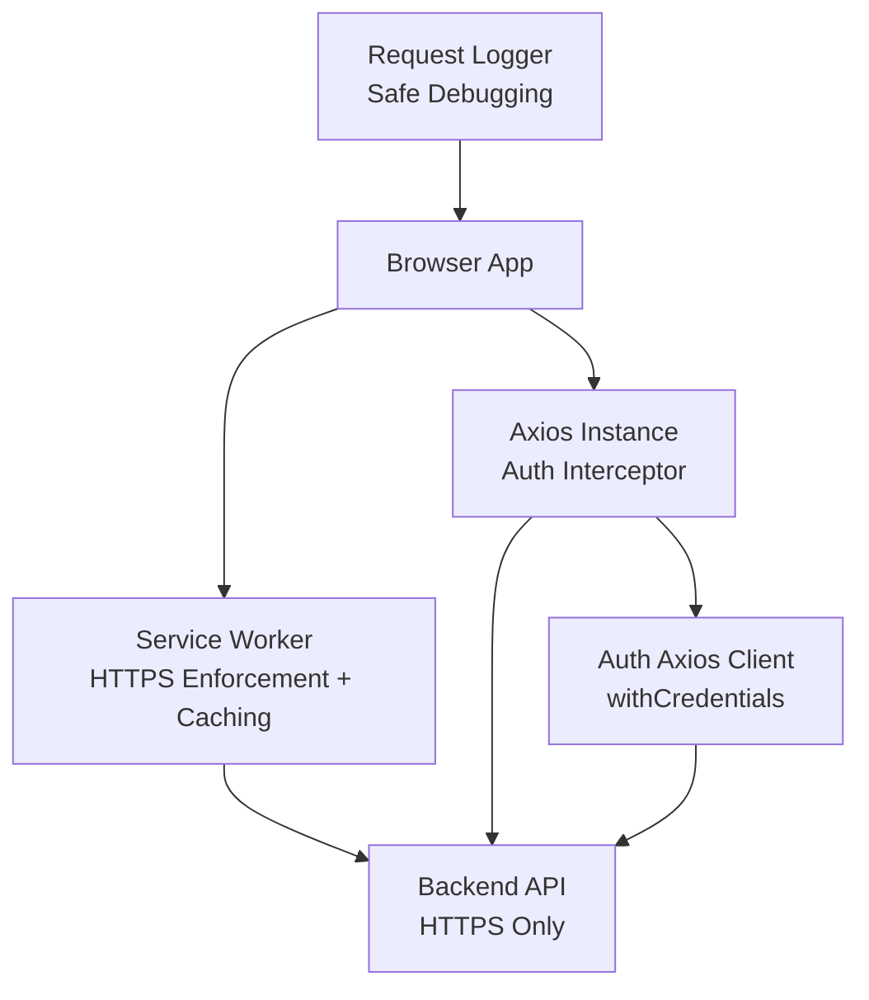
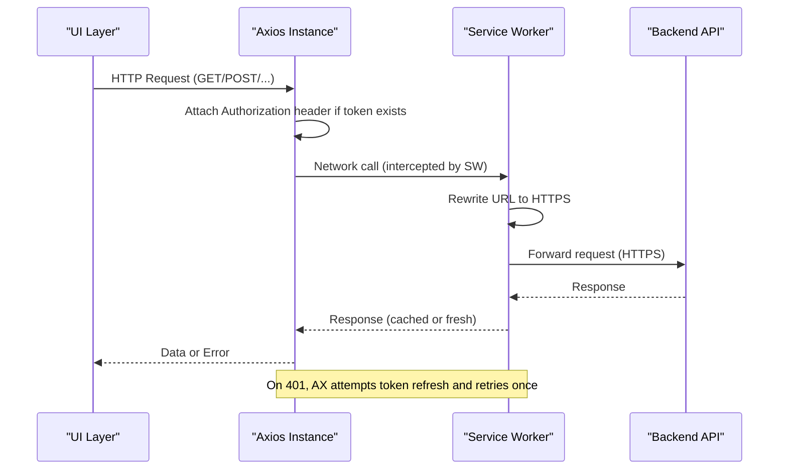
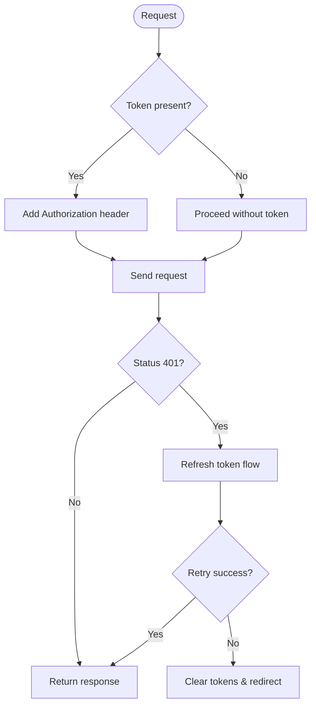
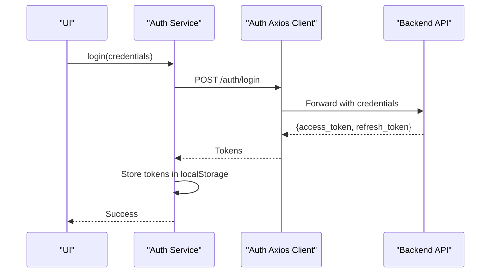
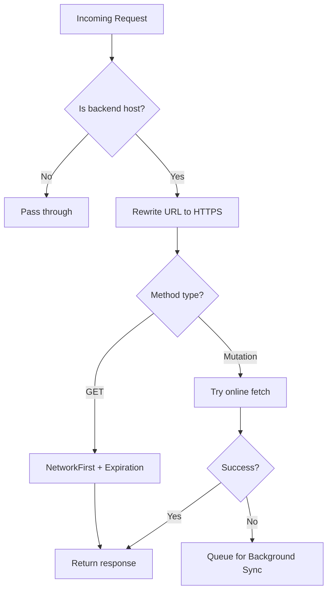
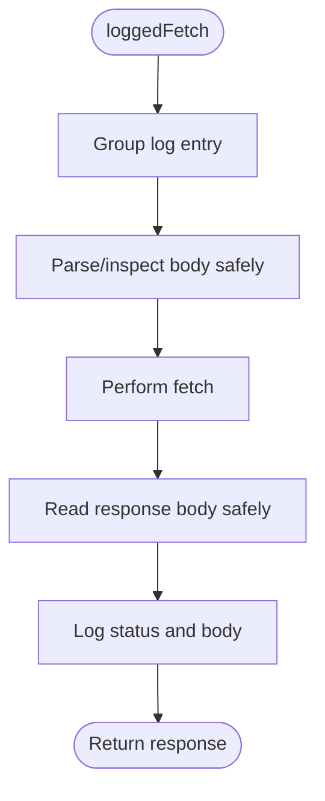
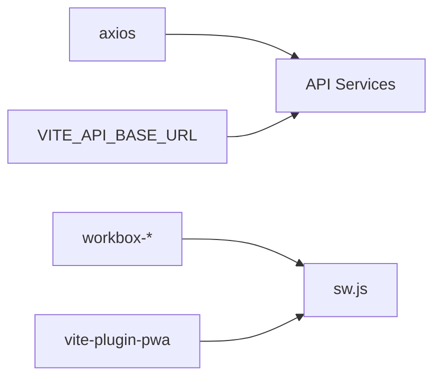

# Secure API Communication

<cite>
**Referenced Files in This Document**
- [api.js](file://src/services/api.js)
- [auth_api.js](file://src/services/auth_api.js)
- [sw.js](file://src/sw.js)
- [requestLogger.js](file://src/utils/requestLogger.js)
- [server.js](file://server.js)
- [vite.config.js](file://vite.config.js)
- [package.json](file://package.json)
- [auth.js](file://src/stores/auth.js)
</cite>

## Table of Contents
1. [Introduction](#introduction)
2. [Project Structure](#project-structure)
3. [Core Components](#core-components)
4. [Architecture Overview](#architecture-overview)
5. [Detailed Component Analysis](#detailed-component-analysis)
6. [Dependency Analysis](#dependency-analysis)
7. [Performance Considerations](#performance-considerations)
8. [Troubleshooting Guide](#troubleshooting-guide)
9. [Conclusion](#conclusion)
10. [Appendices](#appendices)

## Introduction
This document explains how the ABSA Foundry Frontend implements secure API communication. It covers centralized axios configuration, authentication token handling, request/response interception for security and error management, HTTPS enforcement via a service worker, CORS considerations, and a request logging utility for auditing and debugging. It also provides guidelines for implementing secure API calls, protecting sensitive data in transit, and monitoring API security metrics.

## Project Structure
The secure API layer is implemented across several files:
- Centralized axios instance with interceptors for authentication and token refresh
- Dedicated auth service with its own axios client and credentials handling
- Service worker that enforces HTTPS for backend requests and caches responses
- Request logger utility for safe debugging and audit trails
- Server configuration for static assets and caching headers
- Build configuration for PWA and service worker integration

**Diagram sources**
- [api.js:64-146](file://src/services/api.js#L64-L146)
- [auth_api.js:10-27](file://src/services/auth_api.js#L10-L27)
- [sw.js:22-118](file://src/sw.js#L22-L118)
- [requestLogger.js:1-34](file://src/utils/requestLogger.js#L1-L34)

**Section sources**
- [api.js:1-209](file://src/services/api.js#L1-L209)
- [auth_api.js:1-190](file://src/services/auth_api.js#L1-L190)
- [sw.js:1-224](file://src/sw.js#L1-L224)
- [requestLogger.js:1-34](file://src/utils/requestLogger.js#L1-L34)
- [server.js:1-70](file://server.js#L1-L70)
- [vite.config.js:1-41](file://vite.config.js#L1-L41)

## Core Components
- Centralized axios configuration with request interceptor to attach Authorization Bearer tokens and response interceptor to handle 401 errors and refresh tokens.
- Auth service with a dedicated axios client configured with withCredentials for cookie-based sessions where applicable.
- Service worker enforcing HTTPS on all backend requests, applying network-first caching for GETs, and background sync for mutations when offline.
- Request logger utility that safely logs endpoints, methods, payloads, and responses without exposing secrets.
- Server configuration that serves static assets with appropriate cache-control headers.

**Section sources**
- [api.js:64-146](file://src/services/api.js#L64-L146)
- [auth_api.js:10-27](file://src/services/auth_api.js#L10-L27)
- [sw.js:22-118](file://src/sw.js#L22-L118)
- [requestLogger.js:1-34](file://src/utils/requestLogger.js#L1-L34)
- [server.js:28-51](file://server.js#L28-L51)

## Architecture Overview
The frontend uses multiple layers to ensure secure and resilient API communication:
- Axios interceptors manage authentication and token lifecycle centrally.
- The service worker rewrites backend URLs to HTTPS and applies caching strategies, preventing mixed content issues.
- Auth flows store tokens securely in localStorage and clear them on logout or failure.
- Logging utilities provide safe, non-sensitive diagnostics for developers and auditors.

**Diagram sources**
- [api.js:64-146](file://src/services/api.js#L64-L146)
- [sw.js:22-118](file://src/sw.js#L22-L118)

## Detailed Component Analysis

### Centralized Axios Configuration and Interceptors
- Request interceptor attaches Authorization Bearer token from storage to every request.
- Response interceptor handles 401 Unauthorized by:
  - Avoiding retry loops on login/refresh endpoints
  - Attempting token refresh using stored refresh token
  - Replaying failed requests after successful refresh
  - Clearing tokens and redirecting to login on persistent failures
- Base URL resolution supports environment-driven configuration and fallbacks for local vs hosted environments.

**Diagram sources**
- [api.js:64-146](file://src/services/api.js#L64-L146)

**Section sources**
- [api.js:64-146](file://src/services/api.js#L64-L146)
- [api.js:166-200](file://src/services/api.js#L166-L200)

### Authentication Service and Token Handling
- A dedicated axios client sets base URL and default headers, with withCredentials enabled for cookie-based flows.
- Login stores access and refresh tokens; refresh endpoint updates both tokens.
- Signup and profile endpoints use the same client for consistent behavior.
- Errors are normalized and thrown with user-friendly messages.

**Diagram sources**
- [auth_api.js:10-27](file://src/services/auth_api.js#L10-L27)
- [auth_api.js:36-87](file://src/services/auth_api.js#L36-L87)

**Section sources**
- [auth_api.js:10-27](file://src/services/auth_api.js#L10-L27)
- [auth_api.js:36-87](file://src/services/auth_api.js#L36-L87)
- [auth.js:1-22](file://src/stores/auth.js#L1-L22)

### HTTPS Enforcement and CORS via Service Worker
- The service worker identifies backend requests and rewrites their protocol to HTTPS, eliminating mixed content risks.
- GET requests use a NetworkFirst strategy with short timeouts and expiration policies.
- Mutations (POST/PUT/DELETE/PATCH) attempt online execution; on failure, they are queued for background sync when offline.
- Credentials and headers are preserved during rewrite to maintain session continuity.

**Diagram sources**
- [sw.js:22-118](file://src/sw.js#L22-L118)

**Section sources**
- [sw.js:22-118](file://src/sw.js#L22-L118)

### Request Logging for Security Auditing and Debugging
- The loggedFetch wrapper captures method, URL, payload, and response status/body while avoiding sensitive headers like Authorization.
- Logs are grouped and include error details to aid troubleshooting without leaking secrets.

**Diagram sources**
- [requestLogger.js:1-34](file://src/utils/requestLogger.js#L1-L34)

**Section sources**
- [requestLogger.js:1-34](file://src/utils/requestLogger.js#L1-L34)

### Server-Side Static Asset Serving and Caching Headers
- The server serves index.html without caching to ensure clients always load the latest bundle references.
- Other static assets are served with aggressive caching and ETag support.
- Compression is enabled to reduce payload sizes.

**Section sources**
- [server.js:19-51](file://server.js#L19-L51)

## Dependency Analysis
- Axios is used for HTTP requests with interceptors for authentication and error handling.
- The service worker depends on Workbox modules for routing, strategies, and background sync.
- The build system integrates PWA via Vite plugin, generating the service worker manifest and assets.
- Environment variables control base URLs and development bypass flags.

**Diagram sources**
- [package.json:22-62](file://package.json#L22-L62)
- [vite.config.js:7-35](file://vite.config.js#L7-L35)
- [api.js:1-18](file://src/services/api.js#L1-L18)

**Section sources**
- [package.json:22-62](file://package.json#L22-L62)
- [vite.config.js:7-35](file://vite.config.js#L7-L35)
- [api.js:1-18](file://src/services/api.js#L1-L18)

## Performance Considerations
- Network-first caching for GET requests reduces latency and improves resilience under poor connectivity.
- Aggressive caching for static assets minimizes repeated downloads.
- Compression reduces payload sizes.
- Token refresh logic avoids redundant network calls by queuing concurrent requests during refresh.

[No sources needed since this section provides general guidance]

## Troubleshooting Guide
- Mixed Content Issues: Ensure the service worker is active and rewriting backend URLs to HTTPS. Verify the backend host matches the expected domain.
- 401 Loops: Confirm that refresh tokens exist and are valid. Check that login/refresh endpoints are not retried unnecessarily.
- CORS Errors: Validate that the backend allows the frontend’s origin and required headers. Use browser dev tools to inspect preflight responses.
- Offline Behavior: For mutations failing offline, check background sync queues and ensure the app can reconnect and replay requests.
- Logging: Use the request logger to capture safe diagnostics. Avoid logging Authorization headers or other secrets.

**Section sources**
- [sw.js:22-118](file://src/sw.js#L22-L118)
- [api.js:90-146](file://src/services/api.js#L90-L146)
- [requestLogger.js:1-34](file://src/utils/requestLogger.js#L1-L34)

## Conclusion
The ABSA Foundry Frontend employs a layered approach to secure API communication:
- Centralized axios interceptors manage authentication and error handling consistently.
- The service worker enforces HTTPS and provides robust caching and offline capabilities.
- Safe logging practices enable effective debugging and auditing without exposing sensitive data.
Adhering to these patterns ensures secure, reliable, and performant interactions with backend services.

[No sources needed since this section summarizes without analyzing specific files]

## Appendices

### Implementing Secure API Calls
- Use the centralized axios instance to automatically attach Authorization headers.
- For cookie-based flows, prefer the auth client with withCredentials enabled.
- Always rely on HTTPS; avoid constructing HTTP URLs for backend hosts.

**Section sources**
- [api.js:64-76](file://src/services/api.js#L64-L76)
- [auth_api.js:10-27](file://src/services/auth_api.js#L10-L27)

### Handling Sensitive Data Transmission
- Do not log Authorization headers or tokens in console output.
- Use the request logger utility for safe diagnostics.
- Ensure backend endpoints validate and sanitize inputs.

**Section sources**
- [requestLogger.js:1-34](file://src/utils/requestLogger.js#L1-L34)

### Protecting Against Common Network Threats
- HTTPS enforcement via service worker prevents mixed content and man-in-the-middle attacks at the transport layer.
- Token refresh logic mitigates unauthorized access by invalidating stale sessions.
- Avoid storing long-lived secrets in localStorage; prefer short-lived tokens and secure server-side sessions where possible.

**Section sources**
- [sw.js:22-118](file://src/sw.js#L22-L118)
- [api.js:90-146](file://src/services/api.js#L90-L146)

### Monitoring API Security Metrics
- Capture request metadata (method, endpoint, status) via the request logger for audit trails.
- Track 401/403 rates and token refresh outcomes to detect potential abuse or misconfiguration.
- Monitor service worker activity for HTTPS rewrites and offline queue growth.

**Section sources**
- [requestLogger.js:1-34](file://src/utils/requestLogger.js#L1-L34)
- [api.js:90-146](file://src/services/api.js#L90-L146)
- [sw.js:22-118](file://src/sw.js#L22-L118)