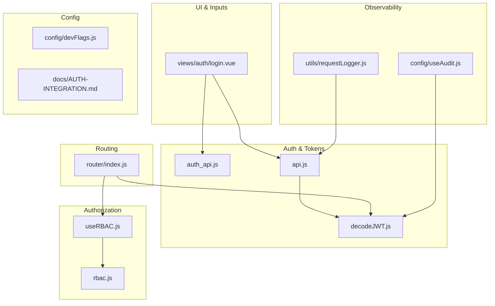
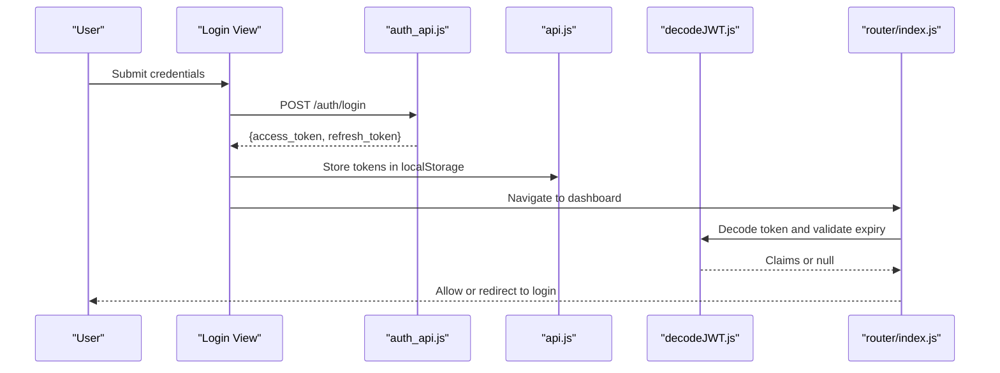
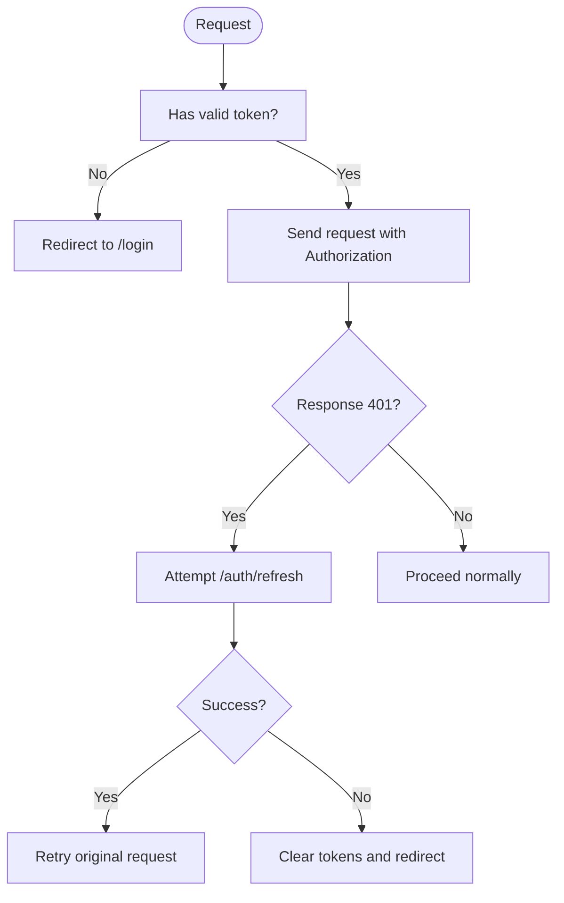
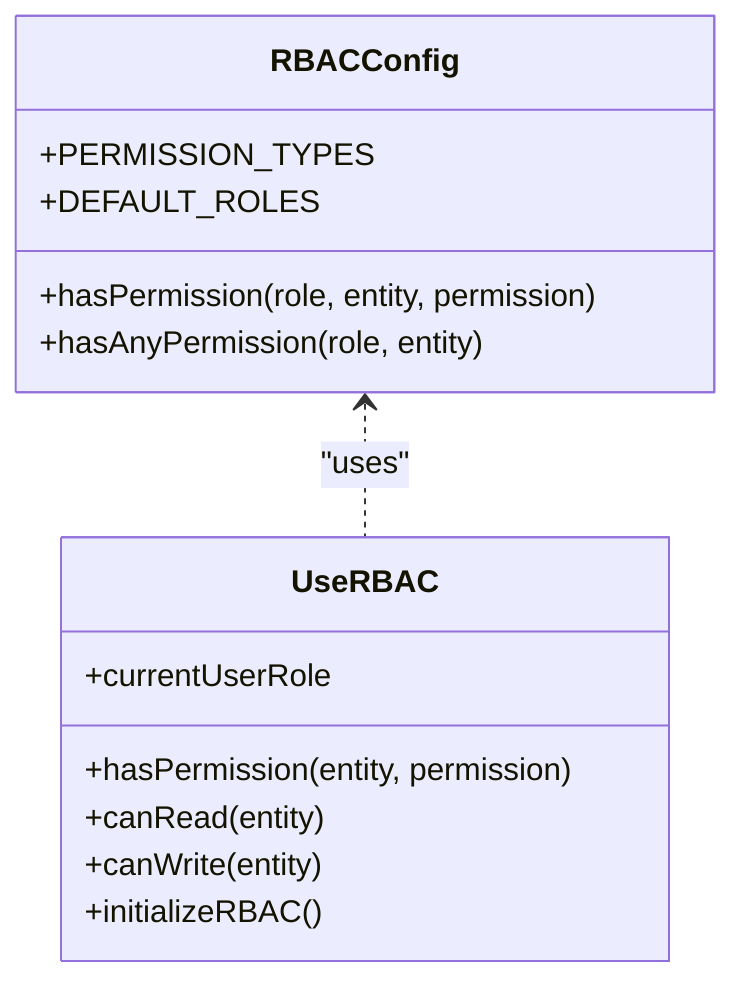
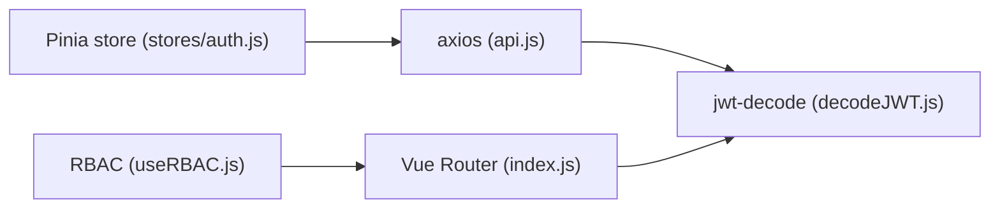

# Security Considerations

<cite>
**Referenced Files in This Document**
- [auth_api.js](file://src/services/auth_api.js)
- [api.js](file://src/services/api.js)
- [decodeJWT.js](file://src/services/decodeJWT.js)
- [rbac.js](file://src/config/rbac.js)
- [useRBAC.js](file://src/composables/useRBAC.js)
- [index.js](file://src/router/index.js)
- [login.vue](file://src/views/auth/login.vue)
- [useAudit.js](file://src/config/useAudit.js)
- [requestLogger.js](file://src/utils/requestLogger.js)
- [devFlags.js](file://src/config/devFlags.js)
- [AUTH-INTEGRATION.md](file://docs/AUTH-INTEGRATION.md)
</cite>

## Table of Contents
1. Introduction
2. Project Structure
3. Core Components
4. Architecture Overview
5. Detailed Component Analysis
6. Dependency Analysis
7. Performance Considerations
8. Troubleshooting Guide
9. Conclusion
10. Appendices

## Introduction
This document provides comprehensive security guidance for the ABSA Foundry Frontend. It covers authentication and session handling, token storage and lifecycle, input validation and sanitization, CSRF considerations, secure API communication, data encryption strategies, role-based access control (RBAC), audit logging and monitoring, third-party integration risks, file upload safeguards, client-side storage hygiene, testing methodologies, vulnerability scanning, and incident response procedures. The content is grounded in the current codebase and highlights both implemented controls and recommended improvements.

## Project Structure
Security-relevant areas are distributed across services, composables, configuration, router guards, and views:
- Authentication and token management: auth_api.js, api.js, decodeJWT.js
- Authorization and RBAC: rbac.js, useRBAC.js
- Route-level protection: index.js
- Login flow and user input: login.vue
- Audit and observability: useAudit.js, requestLogger.js
- Development flags and mock bypass: devFlags.js
- Integration reference: AUTH-INTEGRATION.md

**Diagram sources**
- [auth_api.js:1-190](file://src/services/auth_api.js#L1-L190)
- [api.js:1-209](file://src/services/api.js#L1-L209)
- [decodeJWT.js:1-164](file://src/services/decodeJWT.js#L1-L164)
- [rbac.js:1-753](file://src/config/rbac.js#L1-L753)
- [useRBAC.js:1-783](file://src/composables/useRBAC.js#L1-L783)
- [index.js:1-275](file://src/router/index.js#L1-L275)
- [login.vue:1-657](file://src/views/auth/login.vue#L1-L657)
- [useAudit.js:1-76](file://src/config/useAudit.js#L1-L76)
- [requestLogger.js:1-34](file://src/utils/requestLogger.js#L1-L34)
- [devFlags.js:1-28](file://src/config/devFlags.js#L1-L28)
- [AUTH-INTEGRATION.md:1-882](file://docs/AUTH-INTEGRATION.md#L1-L882)

**Section sources**
- [auth_api.js:1-190](file://src/services/auth_api.js#L1-L190)
- [api.js:1-209](file://src/services/api.js#L1-L209)
- [decodeJWT.js:1-164](file://src/services/decodeJWT.js#L1-L164)
- [rbac.js:1-753](file://src/config/rbac.js#L1-L753)
- [useRBAC.js:1-783](file://src/composables/useRBAC.js#L1-L783)
- [index.js:1-275](file://src/router/index.js#L1-L275)
- [login.vue:1-657](file://src/views/auth/login.vue#L1-L657)
- [useAudit.js:1-76](file://src/config/useAudit.js#L1-L76)
- [requestLogger.js:1-34](file://src/utils/requestLogger.js#L1-L34)
- [devFlags.js:1-28](file://src/config/devFlags.js#L1-L28)
- [AUTH-INTEGRATION.md:1-882](file://docs/AUTH-INTEGRATION.md#L1-L882)

## Core Components
- Authentication service: Centralizes login, refresh, signup, logout, and profile fetch with consistent headers and error handling.
- Token decoding and session helpers: Decodes JWTs, validates expiry, extracts claims, and manages logout flows.
- RBAC engine: Defines roles, permissions, entities, and runtime checks to gate UI and actions.
- Router guard: Enforces authentication and module access at navigation time.
- Audit logging: Emits structured events to a backend endpoint for compliance and monitoring.
- Request logger: Provides safe debugging logs without leaking secrets.

Key responsibilities and security properties:
- Secure header injection for all authenticated requests.
- Automatic token refresh on 401 responses with queueing to avoid race conditions.
- Centralized logout that clears local state and navigates away from protected routes.
- Role-based visibility and action gating via composable utilities.

**Section sources**
- [auth_api.js:1-190](file://src/services/auth_api.js#L1-L190)
- [api.js:64-146](file://src/services/api.js#L64-L146)
- [decodeJWT.js:11-96](file://src/services/decodeJWT.js#L11-L96)
- [useRBAC.js:55-137](file://src/composables/useRBAC.js#L55-L137)
- [index.js:201-272](file://src/router/index.js#L201-L272)
- [useAudit.js:19-75](file://src/config/useAudit.js#L19-L75)

## Architecture Overview
The frontend enforces security through layered controls:
- Transport security: HTTPS endpoints enforced by environment configuration; service worker rewrites HTTP to HTTPS for backend calls.
- Authentication: JWT-based sessions with short-lived access tokens and refresh tokens; automatic refresh on 401.
- Authorization: RBAC model with entity-scoped permissions and route guards.
- Observability: Audit logs and request logging for troubleshooting and detection.

**Diagram sources**
- [login.vue:180-248](file://src/views/auth/login.vue#L180-L248)
- [auth_api.js:36-87](file://src/services/auth_api.js#L36-L87)
- [api.js:166-200](file://src/services/api.js#L166-L200)
- [decodeJWT.js:11-96](file://src/services/decodeJWT.js#L11-L96)
- [index.js:201-272](file://src/router/index.js#L201-L272)

## Detailed Component Analysis

### Authentication and Session Handling
- Login flow: Credentials sent to /auth/login; on success, access and refresh tokens are stored in localStorage and used for subsequent requests.
- Token refresh: Axios response interceptor detects 401, queues concurrent requests, attempts /auth/refresh, updates tokens, and retries original requests. On failure, it clears tokens and redirects to login.
- Logout: Clears local storage and navigates to home; also calls backend logout where applicable.

Security notes:
- Tokens are stored in localStorage; consider using httpOnly cookies for enhanced protection against XSS exfiltration.
- Refresh token rotation is supported by the backend spec; ensure new refresh tokens are always persisted after refresh.
- Dev bypass flag can skip auth in development; ensure it is disabled in production.

**Diagram sources**
- [api.js:64-146](file://src/services/api.js#L64-L146)
- [auth_api.js:64-87](file://src/services/auth_api.js#L64-L87)

**Section sources**
- [auth_api.js:36-143](file://src/services/auth_api.js#L36-L143)
- [api.js:64-209](file://src/services/api.js#L64-L209)
- [decodeJWT.js:11-96](file://src/services/decodeJWT.js#L11-L96)
- [devFlags.js:1-28](file://src/config/devFlags.js#L1-L28)

### JWT Token Management and Storage
- Token decoding: Uses jwt-decode to parse payloads, check expiration, and extract claims such as role, email, name, and id.
- Expiry handling: If expired, triggers logout and clears sensitive keys.
- Storage keys: Multiple keys exist (token, access_token, refresh_token, role, email, user_id); unify to a single canonical key to reduce leakage surface.

Recommendations:
- Prefer httpOnly cookies for tokens to mitigate XSS theft.
- Implement proactive refresh before expiry to reduce 401 churn.
- Sanitize and validate decoded claims before use in authorization decisions.

**Section sources**
- [decodeJWT.js:11-96](file://src/services/decodeJWT.js#L11-L96)
- [api.js:166-200](file://src/services/api.js#L166-L200)
- [auth_api.js:36-87](file://src/services/auth_api.js#L36-L87)

### Input Validation and Sanitization
- Login form: Validates presence of username/email and password; displays errors and prevents submission if invalid.
- Parameter sanitization: Some services sanitize query parameters to remove undefined/null/empty values.
- Data validation in modules: CRM module validates emails, URLs, enums, and numeric fields during bulk operations.

Recommendations:
- Add server-side schema validation for all inputs.
- Apply Content Security Policy (CSP) to mitigate XSS.
- Use DOMPurify when rendering user-generated HTML.

**Section sources**
- [login.vue:161-178](file://src/views/auth/login.vue#L161-L178)
- [crm_api.js:34-44](file://src/services/crm_api.js#L34-L44)
- [CRMModule.js:2516-2522](file://src/views/Modules/crm/composables/CRMModule.js#L2516-L2522)

### CSRF Protection
- Current implementation relies on Bearer tokens in headers; CSRF typically targets state-changing requests with cookies.
- If switching to cookie-based sessions, implement CSRF tokens or SameSite cookie attributes.

Recommendations:
- For cookie-based auth, enforce SameSite=Strict or Lax and include CSRF tokens for mutating endpoints.
- Validate Origin/Referer on the backend for sensitive operations.

[No sources needed since this section provides general guidance]

### Secure API Communication
- Base URL resolution: Environment variable or hostname-based fallback ensures correct backend targeting.
- Header injection: Axios interceptors attach Authorization headers automatically.
- Error handling: Centralized error mapping and retry logic on 401.

Recommendations:
- Enforce HTTPS-only connections in production.
- Log only non-sensitive request/response metadata for debugging.

**Section sources**
- [api.js:1-38](file://src/services/api.js#L1-L38)
- [api.js:64-146](file://src/services/api.js#L64-L146)

### Data Encryption Strategies
- Client-side: No explicit encryption of sensitive data beyond token storage; rely on transport security (HTTPS).
- Recommendations:
  - Encrypt sensitive payloads at rest if stored locally (e.g., IndexedDB) using Web Crypto APIs.
  - Avoid storing PII in localStorage; prefer memory-scoped variables or secure storage mechanisms.

[No sources needed since this section provides general guidance]

### Role-Based Access Control (RBAC)
- Permission model: Entities and permission types defined centrally; default roles provide baseline access.
- Runtime checks: Composable exposes hasPermission, canRead, canWrite, etc., integrating with JWT-derived roles.
- Module access: Router guard restricts dashboard modules based on roles and subscription status.

Implementation highlights:
- Default roles include owner, manager, cashier, accountant, auditor, and others with scoped permissions.
- Healthcare-specific role sets and organization associations are supported.
- UI preferences and tenant settings are managed securely with role checks.

**Diagram sources**
- [rbac.js:1-753](file://src/config/rbac.js#L1-L753)
- [useRBAC.js:55-137](file://src/composables/useRBAC.js#L55-L137)

**Section sources**
- [rbac.js:1-753](file://src/config/rbac.js#L1-L753)
- [useRBAC.js:55-783](file://src/composables/useRBAC.js#L55-L783)
- [index.js:201-272](file://src/router/index.js#L201-L272)

### Audit Logging and Security Monitoring
- Audit composable: Logs user actions (create, update, delete, export, login, logout) with context to a backend endpoint.
- Request logger: Safe console logging of endpoints, methods, payloads, and responses without exposing secrets.

Recommendations:
- Correlate audit logs with user sessions and IP addresses.
- Implement alerting for suspicious patterns (e.g., repeated failed logins, mass exports).

**Section sources**
- [useAudit.js:19-75](file://src/config/useAudit.js#L19-L75)
- [requestLogger.js:1-34](file://src/utils/requestLogger.js#L1-L34)

### Third-Party Integrations and File Uploads
- Integrations: CRM and other modules call external APIs; ensure CORS and token handling are consistent.
- File uploads: Views simulate or record uploads; ensure backend enforces type, size, and virus scanning.

Recommendations:
- Validate file types and sizes client-side and server-side.
- Use signed URLs for direct uploads to storage backends.
- Sanitize filenames and metadata to prevent path traversal.

**Section sources**
- [AnalysisSubpage.vue:1190-1218](file://src/views/Modules/strategic/AnalysisSubpage.vue#L1190-L1218)
- [OverviewSubpage.vue:837-855](file://src/views/Modules/strategic/OverviewSubpage.vue#L837-L855)

### Client-Side Storage Hygiene
- Current keys: token, access_token, refresh_token, role, email, user_id, branches, selected_branch, ui preferences.
- Risks: Multiple keys increase exposure surface; localStorage is vulnerable to XSS.

Recommendations:
- Consolidate to minimal keys; prefer httpOnly cookies for tokens.
- Scope sensitive data to memory where possible.
- Regularly rotate and invalidate tokens on logout.

**Section sources**
- [decodeJWT.js:66-96](file://src/services/decodeJWT.js#L66-L96)
- [auth_api.js:109-115](file://src/services/auth_api.js#L109-L115)
- [api.js:202-209](file://src/services/api.js#L202-L209)

## Dependency Analysis
Security-critical dependencies and their interactions:
- axios: Used for HTTP requests with interceptors for token injection and 401 handling.
- jwt-decode: Parses JWTs for claims and expiry checks.
- Vue Router: Guards enforce authentication and module access.
- Pinia store: Maintains auth state synced with localStorage.

**Diagram sources**
- [api.js:1-209](file://src/services/api.js#L1-L209)
- [decodeJWT.js:1-164](file://src/services/decodeJWT.js#L1-L164)
- [index.js:1-275](file://src/router/index.js#L1-L275)
- [useRBAC.js:1-783](file://src/composables/useRBAC.js#L1-L783)

**Section sources**
- [api.js:1-209](file://src/services/api.js#L1-L209)
- [decodeJWT.js:1-164](file://src/services/decodeJWT.js#L1-L164)
- [index.js:1-275](file://src/router/index.js#L1-L275)
- [useRBAC.js:1-783](file://src/composables/useRBAC.js#L1-L783)

## Performance Considerations
- Token refresh queueing prevents redundant refresh attempts and reduces latency spikes.
- Lazy loading of routes reduces initial bundle size and improves perceived performance.
- Audit logging should be fire-and-forget to avoid blocking critical user flows.

[No sources needed since this section provides general guidance]

## Troubleshooting Guide
Common issues and resolutions:
- 401 Unauthorized: Ensure refresh token exists; if missing or invalid, clear tokens and redirect to login.
- Expired token: decodeJWT handles expiry and triggers logout; verify backend token validity.
- Dev bypass: Ensure VITE_DEV_BYPASS is disabled in production to avoid unauthorized access.
- Audit failures: Non-fatal; inspect network tab and backend logs for /audit-logs/ errors.

**Section sources**
- [api.js:78-146](file://src/services/api.js#L78-L146)
- [decodeJWT.js:11-96](file://src/services/decodeJWT.js#L11-L96)
- [devFlags.js:1-28](file://src/config/devFlags.js#L1-L28)
- [useAudit.js:43-75](file://src/config/useAudit.js#L43-L75)

## Conclusion
The ABSA Foundry Frontend implements a robust set of security controls including JWT-based authentication, automatic token refresh, centralized authorization via RBAC, route guards, and audit logging. To further harden the application, adopt httpOnly cookies for tokens, enforce strict CSP, centralize input validation, and enhance client-side storage hygiene. Continuous monitoring, automated scanning, and incident response play critical roles in maintaining a secure posture.

[No sources needed since this section summarizes without analyzing specific files]

## Appendices

### Practical Secure Coding Examples
- Always validate and sanitize user inputs on both client and server.
- Use least privilege principles in RBAC; scope permissions per entity and action.
- Log security-relevant events without exposing secrets.

[No sources needed since this section provides general guidance]

### Security Testing Methodologies
- Unit tests for auth flows and RBAC checks.
- Integration tests for token refresh and 401 handling.
- Penetration testing focusing on XSS, CSRF, and injection vectors.

[No sources needed since this section provides general guidance]

### Vulnerability Scanning and Incident Response
- Integrate SAST/DAST into CI/CD pipelines.
- Monitor audit logs for anomalies and set up alerts.
- Define runbooks for credential leaks, account takeover, and data exfiltration.

[No sources needed since this section provides general guidance]