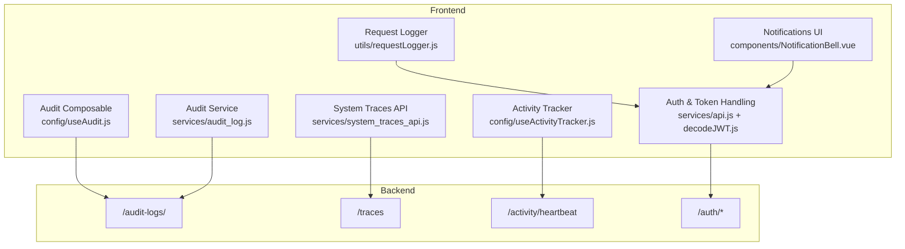
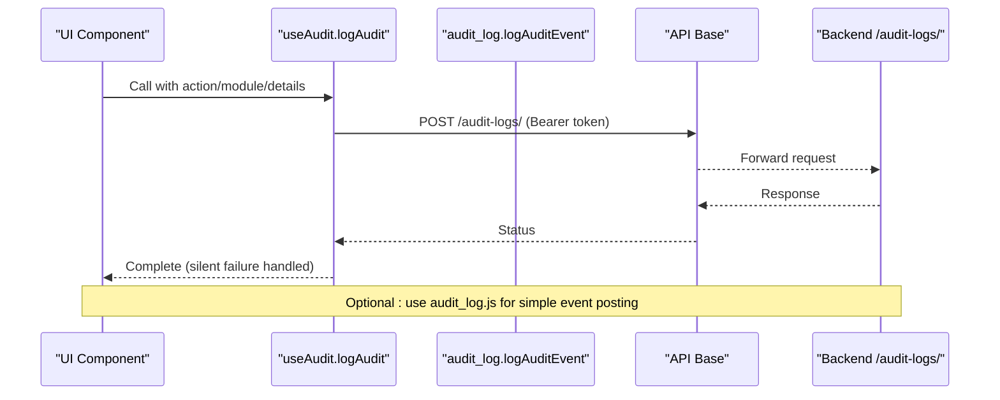
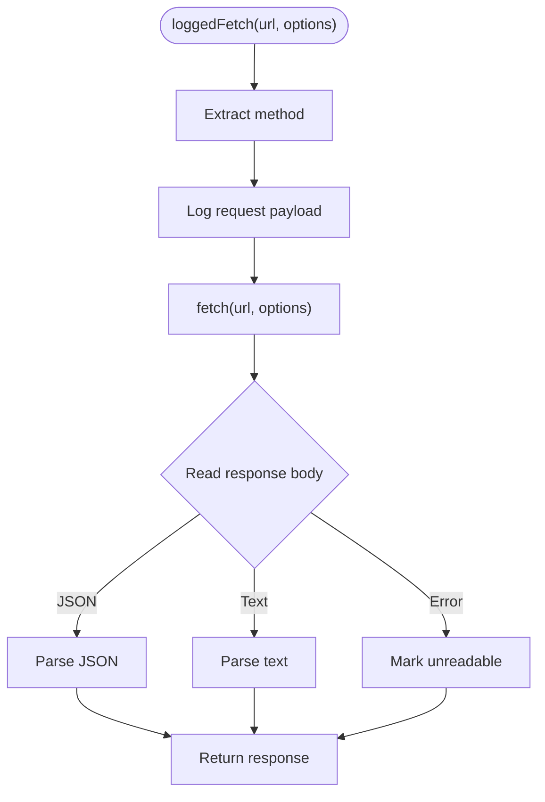
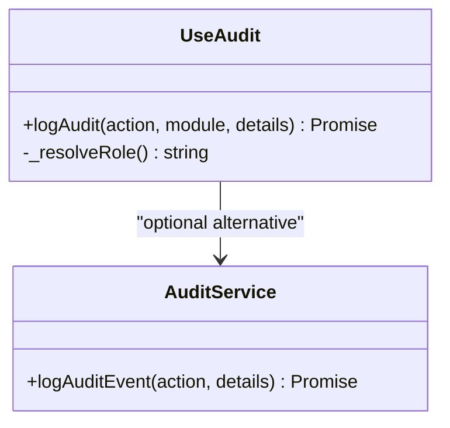
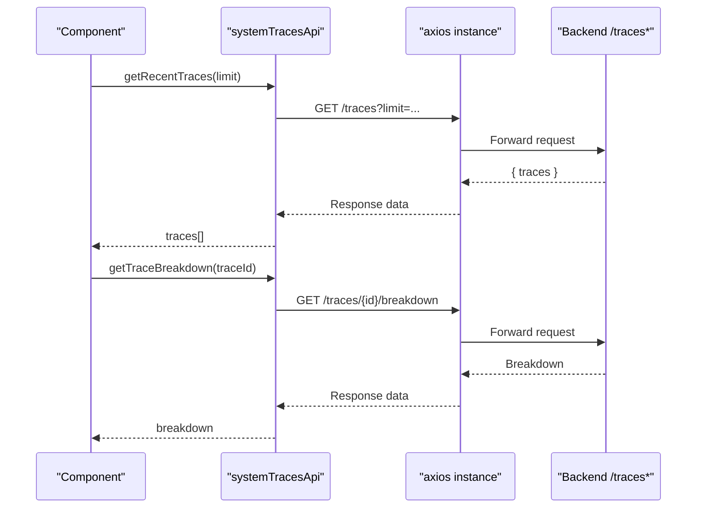
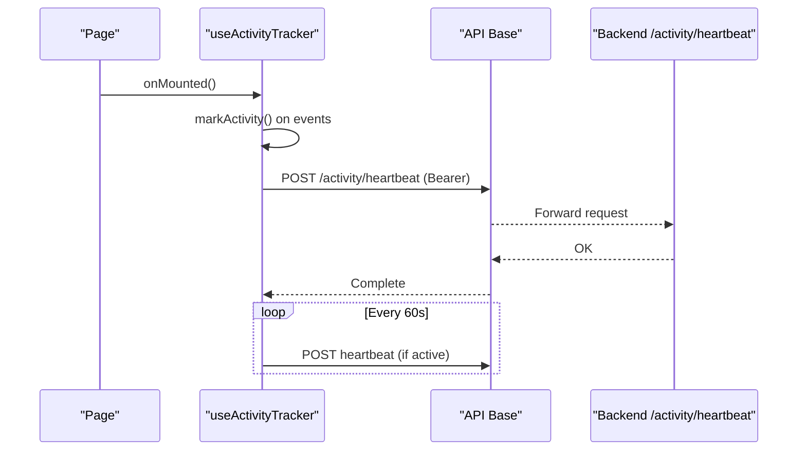
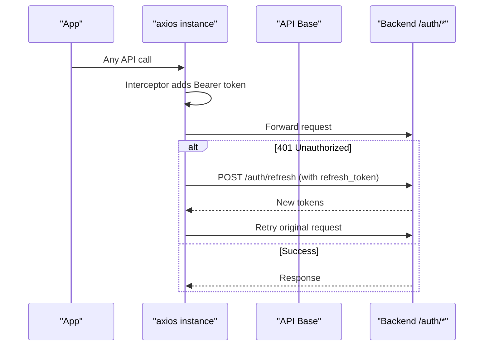
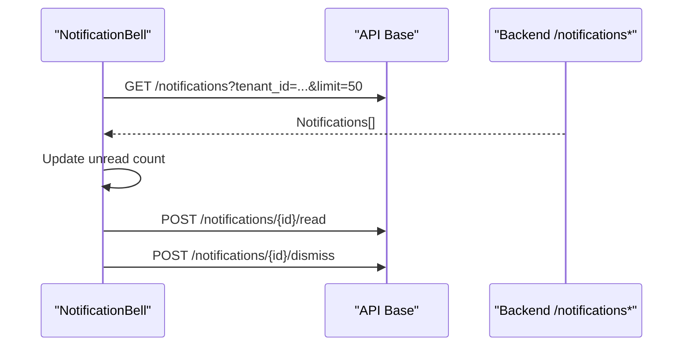
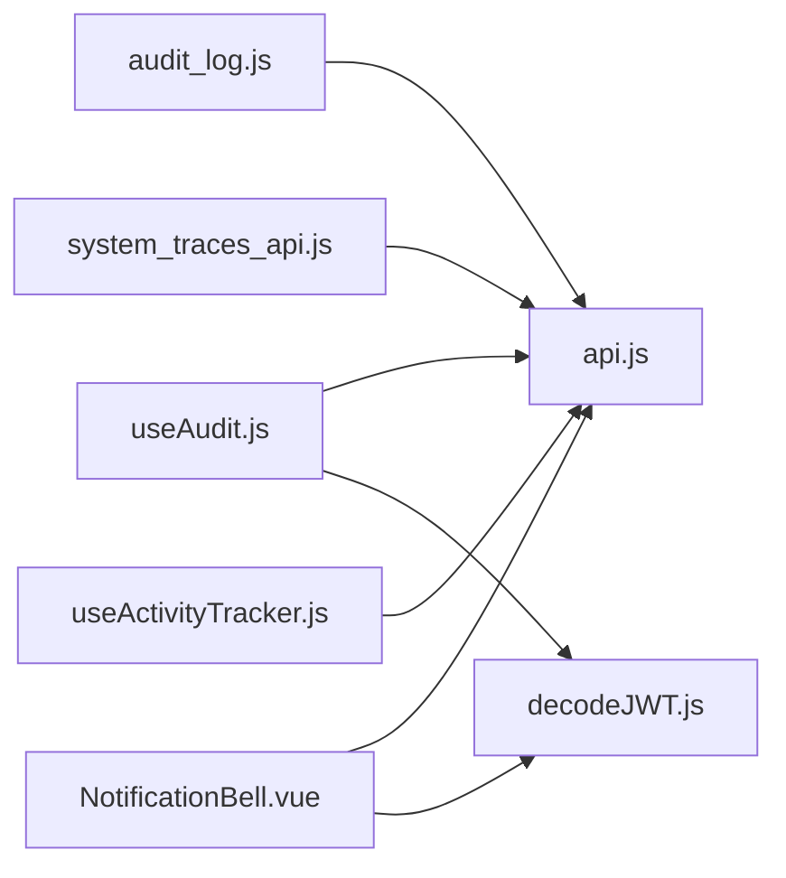

# Security Monitoring & Audit

<cite>
**Referenced Files in This Document**
- [audit_log.js](file://src/services/audit_log.js)
- [useAudit.js](file://src/config/useAudit.js)
- [requestLogger.js](file://src/utils/requestLogger.js)
- [system_traces_api.js](file://src/services/system_traces_api.js)
- [api.js](file://src/services/api.js)
- [decodeJWT.js](file://src/services/decodeJWT.js)
- [useActivityTracker.js](file://src/config/useActivityTracker.js)
- [useSettingsAudit.js](file://src/composables/settings/useSettingsAudit.js)
- [NotificationBell.vue](file://src/components/NotificationBell.vue)
</cite>

## Table of Contents
1. Introduction
2. Project Structure
3. Core Components
4. Architecture Overview
5. Detailed Component Analysis
6. Dependency Analysis
7. Performance Considerations
8. Troubleshooting Guide
9. Conclusion
10. Appendices

## Introduction
This document provides comprehensive security monitoring and audit guidance for the ABSA Foundry Frontend. It explains how user actions, API calls, and security events are captured and recorded; how to implement custom security logs and audit trails; how to integrate with system traces for performance and anomaly detection; and how to set up alerts, analyze logs, correlate events, and respond to incidents. It also includes guidance for building security dashboards, monitoring user behavior patterns, and generating compliance reports.

## Project Structure
The frontend implements a layered approach to security observability:
- Request logging utility for HTTP request/response capture
- Audit composable and service for recording user activities and permission changes
- System traces API integration for performance and suspicious activity signals
- Activity tracking via heartbeats to detect idle sessions and unusual usage
- RBAC and token handling to ensure secure, authenticated operations
- Notification UI for alerting on security-relevant events

**Diagram sources**
- [requestLogger.js:1-34](file://src/utils/requestLogger.js#L1-L34)
- [useAudit.js:16-75](file://src/config/useAudit.js#L16-L75)
- [audit_log.js:1-20](file://src/services/audit_log.js#L1-L20)
- [useActivityTracker.js:1-59](file://src/config/useActivityTracker.js#L1-L59)
- [system_traces_api.js:1-40](file://src/services/system_traces_api.js#L1-L40)
- [api.js:20-146](file://src/services/api.js#L20-L146)
- [decodeJWT.js:11-96](file://src/services/decodeJWT.js#L11-L96)
- [NotificationBell.vue:105-255](file://src/components/NotificationBell.vue#L105-L255)

**Section sources**
- [requestLogger.js:1-34](file://src/utils/requestLogger.js#L1-L34)
- [useAudit.js:16-75](file://src/config/useAudit.js#L16-L75)
- [audit_log.js:1-20](file://src/services/audit_log.js#L1-L20)
- [useActivityTracker.js:1-59](file://src/config/useActivityTracker.js#L1-L59)
- [system_traces_api.js:1-40](file://src/services/system_traces_api.js#L1-L40)
- [api.js:20-146](file://src/services/api.js#L20-L146)
- [decodeJWT.js:11-96](file://src/services/decodeJWT.js#L11-L96)
- [NotificationBell.vue:105-255](file://src/components/NotificationBell.vue#L105-L255)

## Core Components
- Request logger: A lightweight wrapper that logs method, URL, payload, response status, and body to the console while avoiding sensitive headers.
- Audit composable: Provides a reusable logAudit function that posts structured audit events (user identity, role, action, module, details, timestamp) to the backend.
- Audit service: A minimal helper to post basic audit events when needed.
- System traces API: Axios-based client to fetch recent traces and trace breakdowns for performance and anomaly analysis.
- Activity tracker: Tracks user interactions and periodically sends heartbeat events to indicate active sessions.
- Auth and tokens: Centralized auth helpers and interceptors manage Bearer tokens, refresh flows, and logout behavior.
- Notifications: UI component that polls and displays notifications, enabling alerting and quick triage.

**Section sources**
- [requestLogger.js:1-34](file://src/utils/requestLogger.js#L1-L34)
- [useAudit.js:16-75](file://src/config/useAudit.js#L16-L75)
- [audit_log.js:1-20](file://src/services/audit_log.js#L1-L20)
- [system_traces_api.js:1-40](file://src/services/system_traces_api.js#L1-L40)
- [useActivityTracker.js:1-59](file://src/config/useActivityTracker.js#L1-L59)
- [api.js:20-146](file://src/services/api.js#L20-L146)
- [decodeJWT.js:11-96](file://src/services/decodeJWT.js#L11-L96)
- [NotificationBell.vue:105-255](file://src/components/NotificationBell.vue#L105-L255)

## Architecture Overview
The security monitoring architecture combines client-side telemetry with server-side persistence:
- User actions trigger audit events via the audit composable or service, which POST to /audit-logs/.
- All network requests can be wrapped by the request logger to capture HTTP-level details for debugging and forensics.
- System traces are fetched from /traces to monitor performance and identify anomalies.
- Activity heartbeats keep session liveness visible to the backend.
- Authentication is enforced via Bearer tokens managed by centralized interceptors and JWT utilities.
- Notifications provide real-time alerting and triage workflows.

**Diagram sources**
- [useAudit.js:43-72](file://src/config/useAudit.js#L43-L72)
- [audit_log.js:4-19](file://src/services/audit_log.js#L4-L19)
- [api.js:20-38](file://src/services/api.js#L20-L38)

**Section sources**
- [useAudit.js:43-72](file://src/config/useAudit.js#L43-L72)
- [audit_log.js:4-19](file://src/services/audit_log.js#L4-L19)
- [api.js:20-38](file://src/services/api.js#L20-L38)

## Detailed Component Analysis

### Request Logging Utility
- Purpose: Capture HTTP method, URL, payload, response status, and body for debugging and audit support.
- Behavior: Uses console.groupCollapsed to structure logs; safely parses JSON payloads; avoids logging Authorization headers.
- Usage: Wrap fetch calls or integrate into a global interceptor if desired.

**Diagram sources**
- [requestLogger.js:3-33](file://src/utils/requestLogger.js#L3-L33)

**Section sources**
- [requestLogger.js:1-34](file://src/utils/requestLogger.js#L1-L34)

### Audit Log Service and Composable
- Service: Posts a minimal audit event with action, details, timestamp, and user email.
- Composable: Enriches events with user identity, resolved role, module, and details; attaches Bearer token; handles failures without breaking feature flow.

**Diagram sources**
- [useAudit.js:19-75](file://src/config/useAudit.js#L19-L75)
- [audit_log.js:4-19](file://src/services/audit_log.js#L4-L19)

**Section sources**
- [useAudit.js:16-75](file://src/config/useAudit.js#L16-L75)
- [audit_log.js:1-20](file://src/services/audit_log.js#L1-L20)

### System Traces API Integration
- Purpose: Retrieve recent traces and detailed timing breakdowns to monitor performance and detect anomalies.
- Behavior: Axios client with base URL and automatic Bearer token injection; error handling with console errors.

**Diagram sources**
- [system_traces_api.js:5-39](file://src/services/system_traces_api.js#L5-L39)
- [api.js:65-76](file://src/services/api.js#L65-L76)

**Section sources**
- [system_traces_api.js:1-40](file://src/services/system_traces_api.js#L1-L40)
- [api.js:65-76](file://src/services/api.js#L65-L76)

### Activity Tracking and Session Liveness
- Purpose: Track user activity and send periodic heartbeats to signal active sessions.
- Behavior: Listens to mousemove, keydown, click, focus; sends heartbeat every 60 seconds if active within last 2 minutes; uses Bearer token.

**Diagram sources**
- [useActivityTracker.js:4-59](file://src/config/useActivityTracker.js#L4-L59)
- [api.js:20-38](file://src/services/api.js#L20-L38)

**Section sources**
- [useActivityTracker.js:1-59](file://src/config/useActivityTracker.js#L1-L59)
- [api.js:20-38](file://src/services/api.js#L20-L38)

### Authentication and Token Management
- Centralized helpers add Bearer tokens to requests and handle 401 flows, including refresh token rotation and forced logout.
- JWT decoding provides user identity and role information used by audit and RBAC features.

**Diagram sources**
- [api.js:65-146](file://src/services/api.js#L65-L146)
- [decodeJWT.js:11-96](file://src/services/decodeJWT.js#L11-L96)

**Section sources**
- [api.js:65-146](file://src/services/api.js#L65-L146)
- [decodeJWT.js:11-96](file://src/services/decodeJWT.js#L11-L96)

### Notifications and Alerts
- Polls for notifications and displays them in a popover; supports marking read/dismiss and shows toast for new items.
- Can be extended to surface security alerts derived from audit logs or system traces.

**Diagram sources**
- [NotificationBell.vue:121-199](file://src/components/NotificationBell.vue#L121-L199)

**Section sources**
- [NotificationBell.vue:105-255](file://src/components/NotificationBell.vue#L105-L255)

## Dependency Analysis
Key dependencies and relationships:
- useAudit depends on API_BASE_URL and decodeJWT for identity and authorization.
- audit_log is independent but posts to a similar endpoint pattern.
- system_traces_api depends on axios and API_BASE_URL; relies on token injection via api.js interceptors.
- useActivityTracker depends on API_BASE_URL and local token storage.
- NotificationBell depends on API_BASE_URL and decodeJWT tenant context.

**Diagram sources**
- [useAudit.js:16-75](file://src/config/useAudit.js#L16-L75)
- [audit_log.js:4-19](file://src/services/audit_log.js#L4-L19)
- [system_traces_api.js:1-40](file://src/services/system_traces_api.js#L1-L40)
- [useActivityTracker.js:1-59](file://src/config/useActivityTracker.js#L1-L59)
- [NotificationBell.vue:105-255](file://src/components/NotificationBell.vue#L105-L255)
- [api.js:20-146](file://src/services/api.js#L20-L146)
- [decodeJWT.js:11-96](file://src/services/decodeJWT.js#L11-L96)

**Section sources**
- [useAudit.js:16-75](file://src/config/useAudit.js#L16-L75)
- [audit_log.js:4-19](file://src/services/audit_log.js#L4-L19)
- [system_traces_api.js:1-40](file://src/services/system_traces_api.js#L1-L40)
- [useActivityTracker.js:1-59](file://src/config/useActivityTracker.js#L1-L59)
- [NotificationBell.vue:105-255](file://src/components/NotificationBell.vue#L105-L255)
- [api.js:20-146](file://src/services/api.js#L20-L146)
- [decodeJWT.js:11-96](file://src/services/decodeJWT.js#L11-L96)

## Performance Considerations
- Prefer batching or debouncing high-frequency audit events to reduce network overhead.
- Use the request logger only in development or controlled environments to avoid excessive console output in production.
- Limit system traces polling frequency based on operational needs; consider caching results locally when appropriate.
- Heartbeat intervals should balance accuracy with bandwidth; current implementation sends every 60 seconds when active.
- Ensure audit payloads remain small and include only necessary fields to minimize latency.

[No sources needed since this section provides general guidance]

## Troubleshooting Guide
Common issues and resolutions:
- Audit POST failures: The composable logs warnings without breaking functionality; verify network connectivity and token validity.
- Missing user identity: Ensure JWT contains required claims and that decodeJWT returns expected values.
- 401 errors: The interceptor attempts token refresh; if refresh fails, users are redirected to login.
- Excessive console noise: Disable or gate the request logger in production builds.
- Notifications not updating: Verify polling interval and backend availability; check tenant context.

**Section sources**
- [useAudit.js:64-71](file://src/config/useAudit.js#L64-L71)
- [api.js:90-146](file://src/services/api.js#L90-L146)
- [decodeJWT.js:11-96](file://src/services/decodeJWT.js#L11-L96)
- [NotificationBell.vue:245-255](file://src/components/NotificationBell.vue#L245-L255)

## Conclusion
The ABSA Foundry Frontend implements a robust, layered security monitoring and audit capability through dedicated components for request logging, audit event recording, system traces integration, activity tracking, and notification-driven alerting. By consistently using the audit composable, leveraging system traces, and maintaining strong authentication practices, teams can build comprehensive audit trails, detect anomalies, and support incident response and compliance reporting.

[No sources needed since this section summarizes without analyzing specific files]

## Appendices

### Implementing Custom Security Logs
- Use the audit composable to record structured events with user identity, role, module, and details.
- For simple cases, use the audit service to post minimal events.
- Always attach Bearer tokens via centralized helpers to ensure authenticated requests.

**Section sources**
- [useAudit.js:43-72](file://src/config/useAudit.js#L43-L72)
- [audit_log.js:4-19](file://src/services/audit_log.js#L4-L19)
- [api.js:20-38](file://src/services/api.js#L20-L38)

### Creating Audit Trails for Compliance
- Record create, update, delete, export, import, approve, reject actions with resource identifiers and contextual details.
- Include timestamps and user identity for each event.
- Persist events to the backend’s /audit-logs/ endpoint.

**Section sources**
- [useAudit.js:39-62](file://src/config/useAudit.js#L39-L62)

### Setting Up Security Alerts
- Extend the notification component to surface security alerts derived from audit logs or system traces.
- Configure thresholds and severity levels to trigger timely notifications.
- Provide quick actions to investigate or dismiss alerts.

**Section sources**
- [NotificationBell.vue:121-199](file://src/components/NotificationBell.vue#L121-L199)

### Log Analysis Techniques and Event Correlation
- Analyze audit logs for patterns such as repeated deletes or updates in sensitive modules.
- Correlate system traces with audit events to identify performance regressions tied to user actions.
- Use heartbeat data to detect inactive sessions or unusual activity spikes.

**Section sources**
- [useSettingsAudit.js:15-38](file://src/composables/settings/useSettingsAudit.js#L15-L38)
- [system_traces_api.js:17-39](file://src/services/system_traces_api.js#L17-L39)
- [useActivityTracker.js:12-36](file://src/config/useActivityTracker.js#L12-L36)

### Incident Response Procedures
- On detecting anomalous activity, review related audit logs and system traces.
- Validate user identity and permissions via JWT decoding and RBAC checks.
- Escalate alerts through the notification system and initiate containment steps.

**Section sources**
- [decodeJWT.js:11-96](file://src/services/decodeJWT.js#L11-L96)
- [NotificationBell.vue:121-199](file://src/components/NotificationBell.vue#L121-L199)

### Security Dashboards, Monitoring, and Reporting
- Build dashboards that visualize audit event volumes by module and action.
- Monitor system traces for latency spikes and error rates.
- Generate compliance reports by exporting audit logs and correlating with system traces and activity data.

**Section sources**
- [useSettingsAudit.js:40-64](file://src/composables/settings/useSettingsAudit.js#L40-L64)
- [system_traces_api.js:17-39](file://src/services/system_traces_api.js#L17-L39)