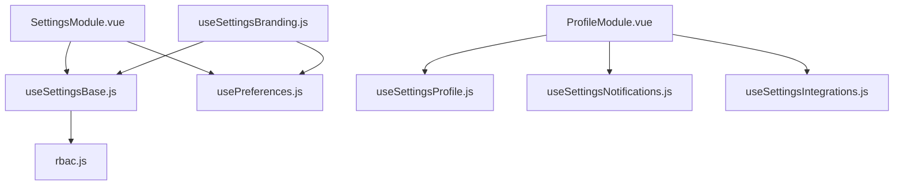
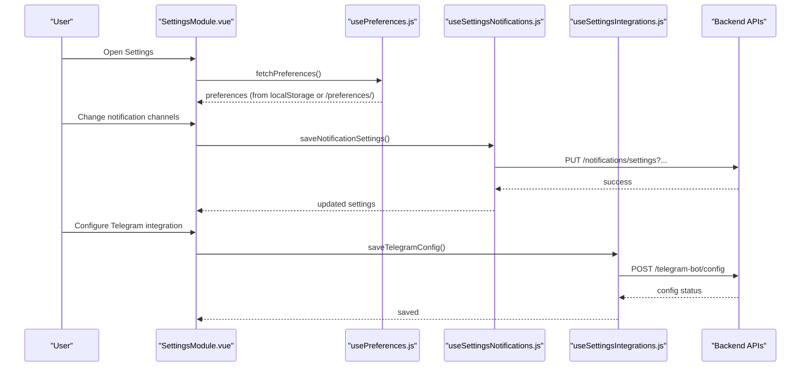
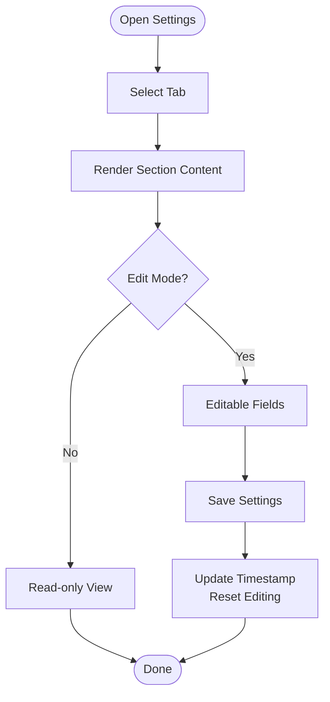
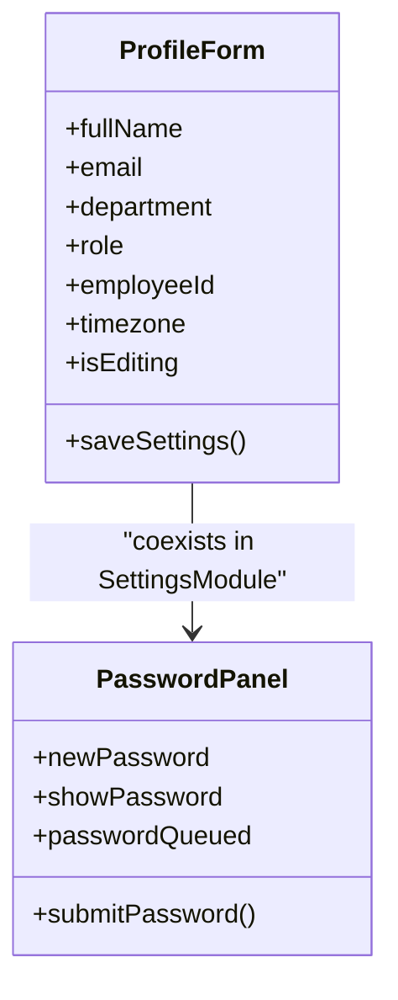
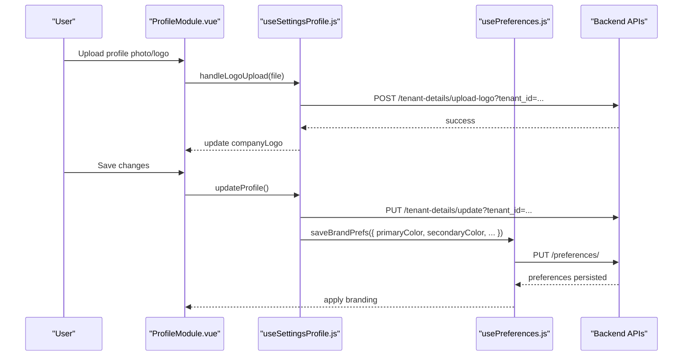
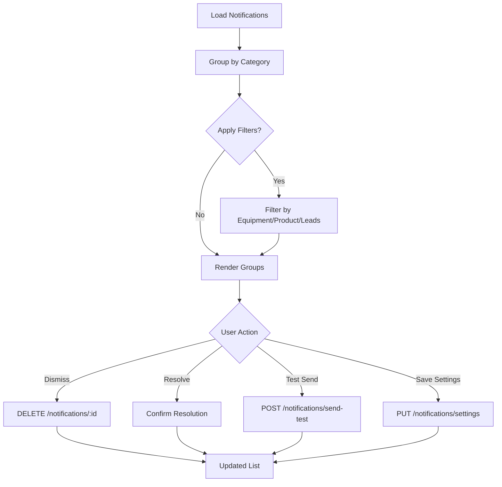
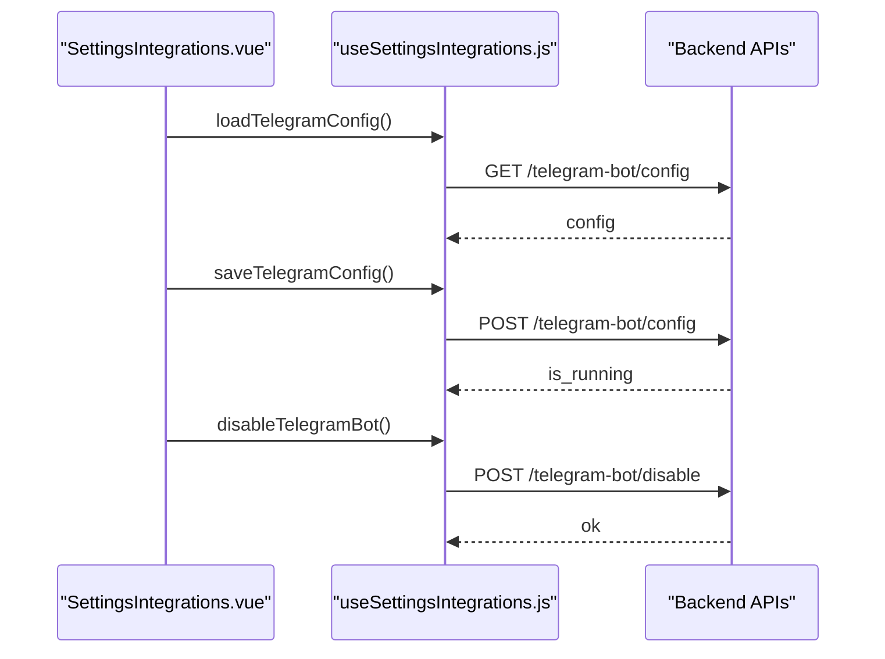
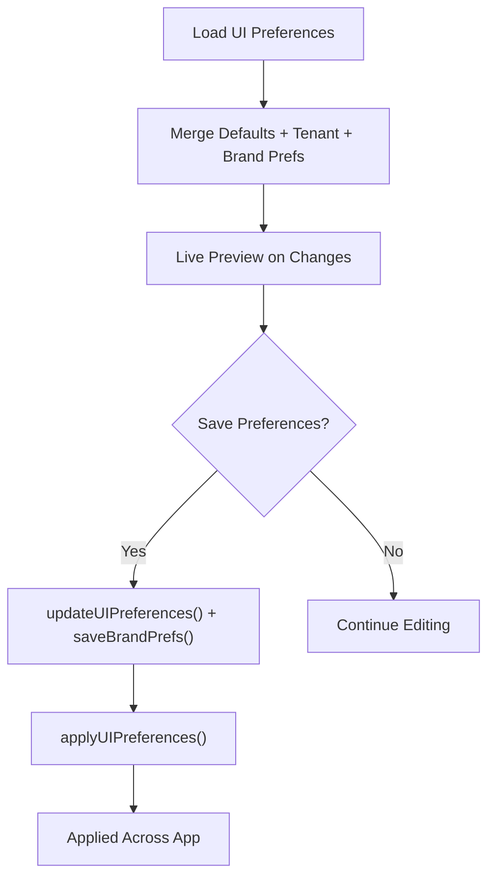
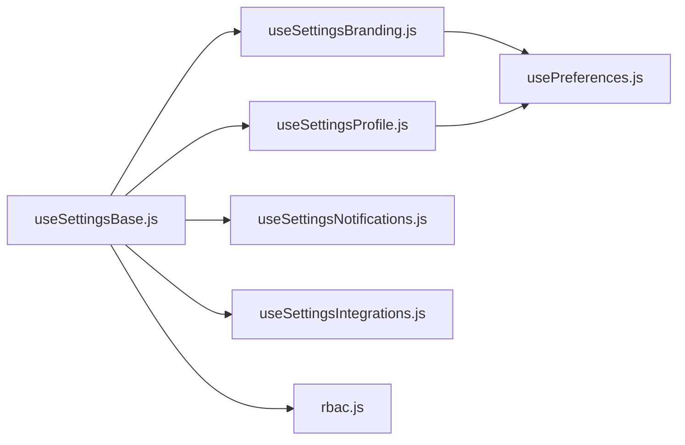

# Profile & Settings

<cite>
**Referenced Files in This Document**
- [SettingsModule.vue](file://src/views/Modules/settings/SettingsModule.vue)
- [ProfileModule.vue](file://src/views/Modules/settings/ProfileModule.vue)
- [useSettingsBase.js](file://src/composables/settings/useSettingsBase.js)
- [usePreferences.js](file://src/config/usePreferences.js)
- [useSettingsProfile.js](file://src/composables/settings/useSettingsProfile.js)
- [useSettingsNotifications.js](file://src/composables/settings/useSettingsNotifications.js)
- [useSettingsIntegrations.js](file://src/composables/settings/useSettingsIntegrations.js)
- [useSettingsBranding.js](file://src/composables/settings/useSettingsBranding.js)
- [rbac.js](file://src/config/rbac.js)
</cite>

## Table of Contents
1. Introduction
2. Project Structure
3. Core Components
4. Architecture Overview
5. Detailed Component Analysis
6. Dependency Analysis
7. Performance Considerations
8. Troubleshooting Guide
9. Conclusion

## Introduction
This document explains the Profile and Settings management system, covering user profile editing (personal information, avatar upload, password management), notification preferences, and the settings architecture that supports both user-specific and system-wide configurations. It details preference storage using localStorage with backend synchronization, the categorized settings interface (profile, notifications, appearance, integrations), validation and feedback patterns, customization examples (theme selection, language/timezone, notification channels), and security considerations for sensitive data protection.

## Project Structure
The settings feature is implemented across Vue components and reusable composables:
- Views provide the UI shells and tabbed interfaces for settings sections.
- Composables encapsulate business logic, API calls, state, and persistence.
- Configuration modules define RBAC roles, permissions, and default UI preferences.

**Diagram sources**
- [SettingsModule.vue:1-120](file://src/views/Modules/settings/SettingsModule.vue#L1-L120)
- [useSettingsBase.js:1-65](file://src/composables/settings/useSettingsBase.js#L1-L65)
- [usePreferences.js:1-66](file://src/config/usePreferences.js#L1-L66)
- [useSettingsProfile.js:1-45](file://src/composables/settings/useSettingsProfile.js#L1-L45)
- [useSettingsNotifications.js:1-48](file://src/composables/settings/useSettingsNotifications.js#L1-L48)
- [useSettingsIntegrations.js:1-25](file://src/composables/settings/useSettingsIntegrations.js#L1-L25)
- [useSettingsBranding.js:1-40](file://src/composables/settings/useSettingsBranding.js#L1-L40)
- [rbac.js:1-77](file://src/config/rbac.js#L1-L77)

**Section sources**
- [SettingsModule.vue:1-120](file://src/views/Modules/settings/SettingsModule.vue#L1-L120)
- [useSettingsBase.js:1-65](file://src/composables/settings/useSettingsBase.js#L1-L65)
- [usePreferences.js:1-66](file://src/config/usePreferences.js#L1-L66)

## Core Components
- Settings shell and tabs: The main settings page organizes sections into Personal Information, Security & Authentication, Roles, Notifications, and Integrations. It provides edit modes, save actions, and contextual navigation.
- Profile management: Dedicated profile view supports personal info editing, avatar/logo uploads, contact details, social links, and multiple business cards with templates and themes.
- Notification preferences: Centralized composable manages notification categories, filtering, scheduling, channel toggles (email, WhatsApp), and test sends.
- Integrations: Telegram bot configuration and conversation listing via a dedicated composable.
- Branding and appearance: Theme mode, typography, color presets, and visual style application are managed through a branding composable backed by global preferences.

Key responsibilities:
- State management per section via composables.
- Local-first persistence with localStorage and backend sync.
- Validation and user feedback via toast messages and inline indicators.
- RBAC-aware rendering and actions.

**Section sources**
- [SettingsModule.vue:12-274](file://src/views/Modules/settings/SettingsModule.vue#L12-L274)
- [ProfileModule.vue:63-743](file://src/views/Modules/settings/ProfileModule.vue#L63-L743)
- [useSettingsNotifications.js:188-310](file://src/composables/settings/useSettingsNotifications.js#L188-L310)
- [useSettingsIntegrations.js:15-63](file://src/composables/settings/useSettingsIntegrations.js#L15-L63)
- [useSettingsBranding.js:27-111](file://src/composables/settings/useSettingsBranding.js#L27-L111)

## Architecture Overview
The system follows a layered approach:
- UI layer: Vue components render categorized settings panels and handle user interactions.
- Logic layer: Composables encapsulate domain logic, API integration, and state.
- Persistence layer: Preferences are cached locally and synchronized to the backend; profile and notification settings persist via API endpoints.
- Security layer: RBAC controls visibility and actions; JWT-derived identity informs defaults and permissions.

**Diagram sources**
- [SettingsModule.vue:277-441](file://src/views/Modules/settings/SettingsModule.vue#L277-L441)
- [usePreferences.js:34-99](file://src/config/usePreferences.js#L34-L99)
- [useSettingsNotifications.js:276-310](file://src/composables/settings/useSettingsNotifications.js#L276-L310)
- [useSettingsIntegrations.js:27-45](file://src/composables/settings/useSettingsIntegrations.js#L27-L45)

## Detailed Component Analysis

### Settings Shell and Tabs
- Provides a tabbed layout with sections: Personal Information, Security & Authentication, Roles, Notifications, Integrations.
- Edit mode toggles for profile fields; save action updates local timestamp and resets editing state.
- Navigation scrolls to active section and updates breadcrumb label.

**Diagram sources**
- [SettingsModule.vue:12-274](file://src/views/Modules/settings/SettingsModule.vue#L12-L274)
- [SettingsModule.vue:277-441](file://src/views/Modules/settings/SettingsModule.vue#L277-L441)

**Section sources**
- [SettingsModule.vue:12-274](file://src/views/Modules/settings/SettingsModule.vue#L12-L274)
- [SettingsModule.vue:277-441](file://src/views/Modules/settings/SettingsModule.vue#L277-L441)

### Profile Management
- Personal information editing: Full Name, Email, Department, Role, Employee ID, Locale/Timezone.
- Avatar/photo handling: Placeholder initials and change photo button; actual file upload flows exist in the dedicated ProfileModule.
- Password management: Inline form to update password with queued confirmation feedback.
- Device authorization list and revoke actions.

**Diagram sources**
- [SettingsModule.vue:31-156](file://src/views/Modules/settings/SettingsModule.vue#L31-L156)
- [SettingsModule.vue:277-441](file://src/views/Modules/settings/SettingsModule.vue#L277-L441)

**Section sources**
- [SettingsModule.vue:31-156](file://src/views/Modules/settings/SettingsModule.vue#L31-L156)
- [SettingsModule.vue:277-441](file://src/views/Modules/settings/SettingsModule.vue#L277-L441)

### User Profile Module (Advanced)
- Business card gallery with template selection and accent theme colors.
- Contact details, social media links, and asset uploads (profile photo, logo, CV).
- Real-time preview of business cards with QR code generation and export options.
- Owner vs sub-account read-only behavior enforced via role checks.

**Diagram sources**
- [ProfileModule.vue:338-392](file://src/views/Modules/settings/ProfileModule.vue#L338-L392)
- [useSettingsProfile.js:73-185](file://src/composables/settings/useSettingsProfile.js#L73-L185)
- [usePreferences.js:68-99](file://src/config/usePreferences.js#L68-L99)

**Section sources**
- [ProfileModule.vue:63-743](file://src/views/Modules/settings/ProfileModule.vue#L63-L743)
- [useSettingsProfile.js:1-195](file://src/composables/settings/useSettingsProfile.js#L1-L195)

### Notification Preferences
- Categories: Inventory, CRM, Payments, System, General with auto-detection and filters.
- Channel toggles: Email and WhatsApp; schedule type, time, and day configuration.
- Actions: Load notifications, dismiss single/all, resolve with confirm dialog, send test message, export to Excel/PDF.
- Item-level settings: Per inventory item thresholds and notification flags.

**Diagram sources**
- [useSettingsNotifications.js:42-107](file://src/composables/settings/useSettingsNotifications.js#L42-L107)
- [useSettingsNotifications.js:188-310](file://src/composables/settings/useSettingsNotifications.js#L188-L310)
- [useSettingsNotifications.js:235-291](file://src/composables/settings/useSettingsNotifications.js#L235-L291)

**Section sources**
- [useSettingsNotifications.js:1-424](file://src/composables/settings/useSettingsNotifications.js#L1-L424)

### Integrations (Telegram Bot)
- Load, save, and disable Telegram bot configuration.
- Fetch conversations and manage token visibility.

**Diagram sources**
- [useSettingsIntegrations.js:15-63](file://src/composables/settings/useSettingsIntegrations.js#L15-L63)

**Section sources**
- [useSettingsIntegrations.js:1-72](file://src/composables/settings/useSettingsIntegrations.js#L1-L72)

### Appearance and Branding
- Theme mode, font family, font size, brand colors, and visual style presets.
- Live preview applies UI preferences immediately; saving persists to backend and updates localStorage.

**Diagram sources**
- [useSettingsBranding.js:27-111](file://src/composables/settings/useSettingsBranding.js#L27-L111)
- [usePreferences.js:22-99](file://src/config/usePreferences.js#L22-L99)

**Section sources**
- [useSettingsBranding.js:1-119](file://src/composables/settings/useSettingsBranding.js#L1-L119)
- [usePreferences.js:1-111](file://src/config/usePreferences.js#L1-L111)

## Dependency Analysis
- useSettingsBase centralizes shared state and utilities: tabs, RBAC, preferences, currency, audit logging, and module subscription calculations.
- usePreferences provides global branding preferences with localStorage caching and backend synchronization.
- Profile, Notifications, Integrations, and Branding composables depend on useSettingsBase for common capabilities and on usePreferences for branding persistence.
- RBAC configuration defines roles and permissions controlling access to settings features.

**Diagram sources**
- [useSettingsBase.js:1-65](file://src/composables/settings/useSettingsBase.js#L1-L65)
- [usePreferences.js:1-66](file://src/config/usePreferences.js#L1-L66)
- [useSettingsBranding.js:1-40](file://src/composables/settings/useSettingsBranding.js#L1-L40)
- [useSettingsProfile.js:1-45](file://src/composables/settings/useSettingsProfile.js#L1-L45)
- [useSettingsNotifications.js:1-48](file://src/composables/settings/useSettingsNotifications.js#L1-L48)
- [useSettingsIntegrations.js:1-25](file://src/composables/settings/useSettingsIntegrations.js#L1-L25)
- [rbac.js:1-77](file://src/config/rbac.js#L1-L77)

**Section sources**
- [useSettingsBase.js:1-65](file://src/composables/settings/useSettingsBase.js#L1-L65)
- [usePreferences.js:1-66](file://src/config/usePreferences.js#L1-L66)
- [rbac.js:1-77](file://src/config/rbac.js#L1-L77)

## Performance Considerations
- Local-first preferences: Loading from localStorage reduces initial latency; background sync ensures consistency with backend.
- Debounced live previews: Branding changes apply immediately but save operations batch updates to minimize network calls.
- Efficient grouping and filtering: Notification lists group by category and support search and severity filters to reduce rendering overhead.
- Image handling: File readers and previews avoid unnecessary re-renders; only selected assets update state.

[No sources needed since this section provides general guidance]

## Troubleshooting Guide
Common issues and resolutions:
- Preferences not applying: Ensure localStorage key exists and backend returns valid preferences; check error logs in usePreferences.
- Notification settings save failures: Verify tenant ID and channel parameters; inspect toast messages and server response details.
- Telegram integration errors: Check token validity and endpoint responses; review error states and retry after fixing configuration.
- Profile logo upload failures: Validate file type and size; ensure tenant ID is present and backend accepts the payload.

Validation and feedback patterns:
- Toast notifications for success and error states across profile, notifications, and integrations.
- Inline feedback for password updates and save timestamps.
- Confirmation dialogs for destructive actions like resolving notifications or resetting UI preferences.

**Section sources**
- [usePreferences.js:60-99](file://src/config/usePreferences.js#L60-L99)
- [useSettingsNotifications.js:235-310](file://src/composables/settings/useSettingsNotifications.js#L235-L310)
- [useSettingsIntegrations.js:27-63](file://src/composables/settings/useSettingsIntegrations.js#L27-L63)
- [useSettingsProfile.js:73-185](file://src/composables/settings/useSettingsProfile.js#L73-L185)

## Conclusion
The Profile and Settings system provides a robust, categorized interface for managing personal information, security, notifications, integrations, and appearance. It leverages a composable-based architecture for clear separation of concerns, integrates RBAC for secure access control, and employs a hybrid persistence strategy combining localStorage for speed and backend synchronization for reliability. Users can customize their experience through theme selection, timezone/locale preferences, and notification channels, while maintaining data integrity through validation and user feedback. Security best practices include token-based authentication, careful handling of sensitive fields, and confirmation workflows for critical actions.

[No sources needed since this section summarizes without analyzing specific files]