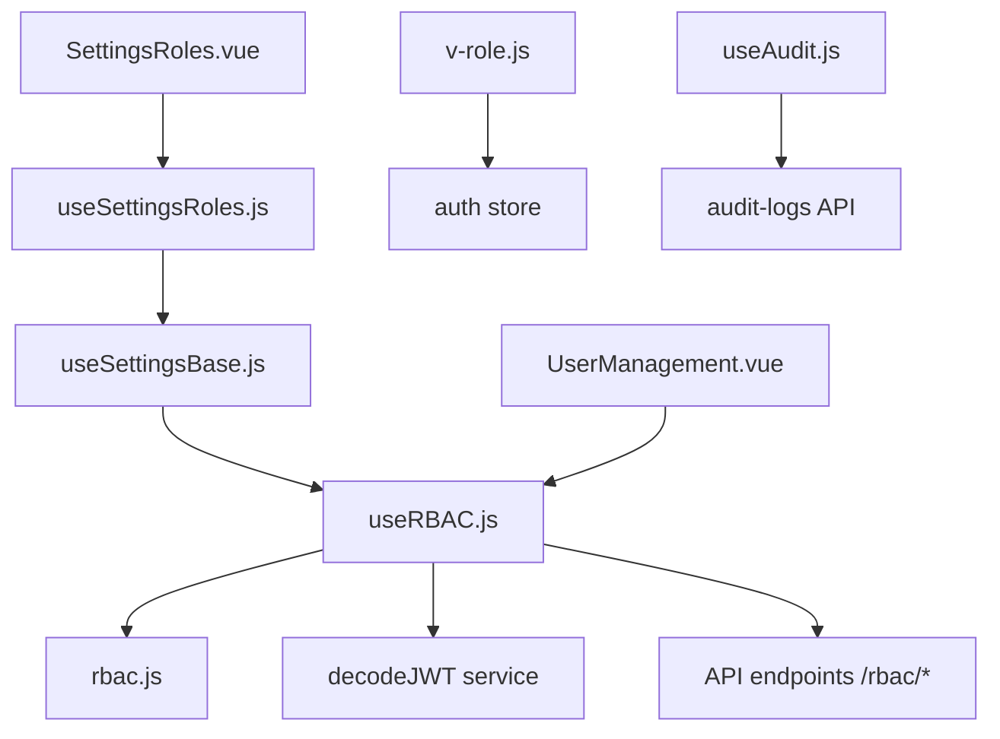
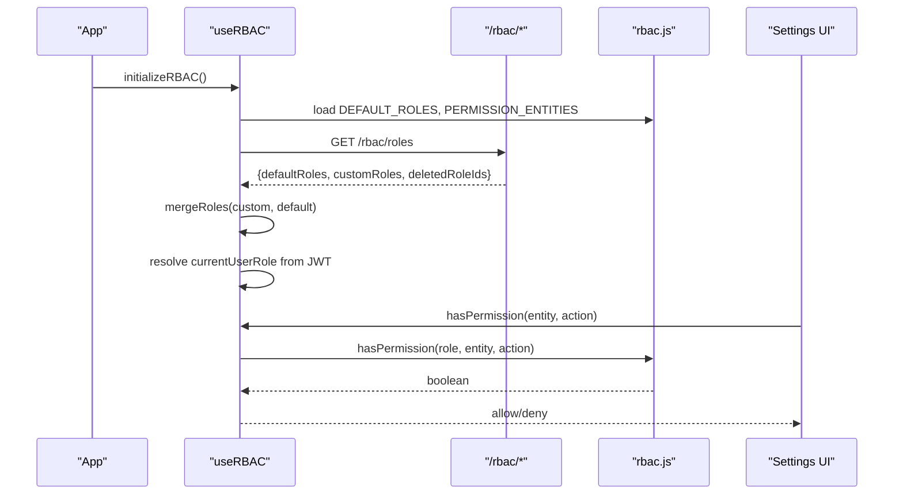
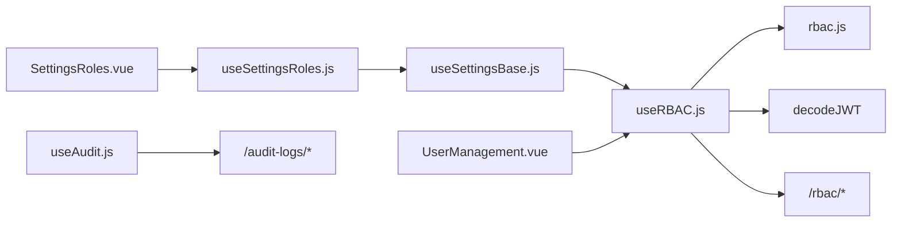
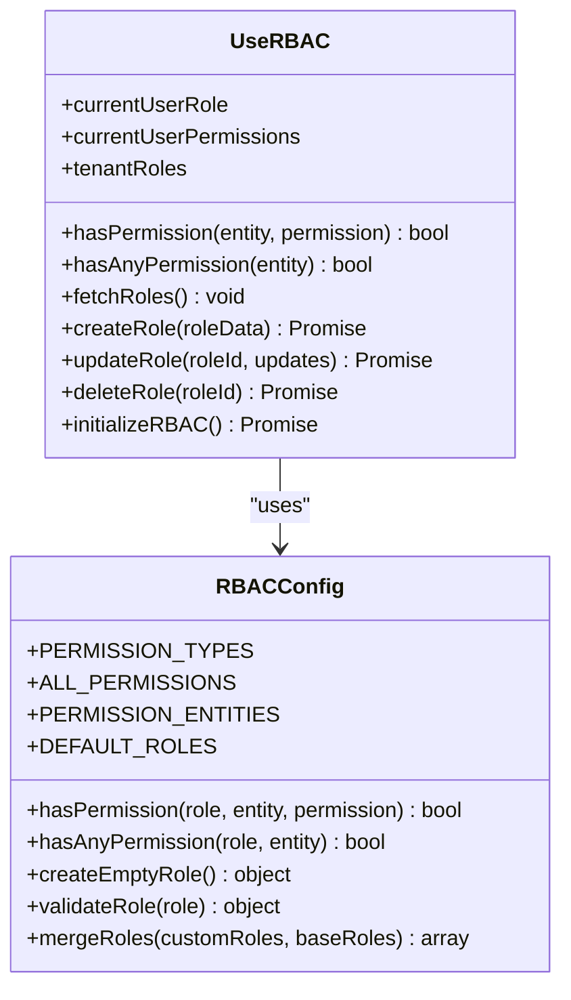
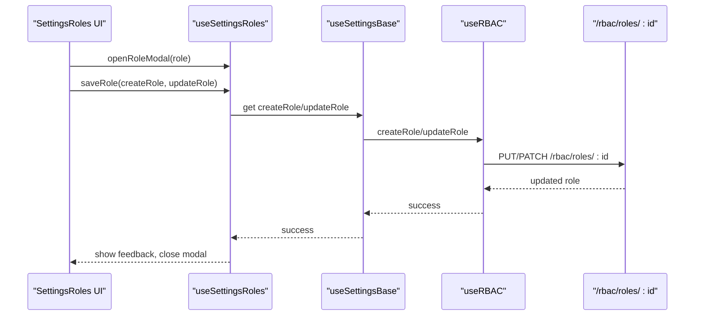
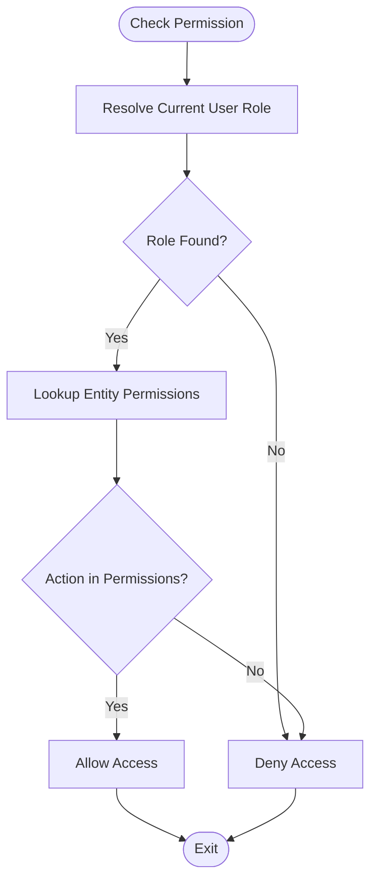

# Role & Permission System

<cite>
**Referenced Files in This Document**
- [useRBAC.js](file://src/composables/useRBAC.js)
- [rbac.js](file://src/config/rbac.js)
- [v-role.js](file://src/utils/v-role.js)
- [useSettingsRoles.js](file://src/composables/settings/useSettingsRoles.js)
- [useSettingsBase.js](file://src/composables/settings/useSettingsBase.js)
- [SettingsRoles.vue](file://src/views/Modules/settings/components/SettingsRoles.vue)
- [UserManagement.vue](file://src/views/Modules/settings/UserManagement.vue)
- [useAudit.js](file://src/config/useAudit.js)
</cite>

## Table of Contents
1. [Introduction](#introduction)
2. [Project Structure](#project-structure)
3. [Core Components](#core-components)
4. [Architecture Overview](#architecture-overview)
5. [Detailed Component Analysis](#detailed-component-analysis)
6. [Dependency Analysis](#dependency-analysis)
7. [Performance Considerations](#performance-considerations)
8. [Troubleshooting Guide](#troubleshooting-guide)
9. [Conclusion](#conclusion)
10. [Appendices](#appendices)

## Introduction
This document explains the Role-Based Access Control (RBAC) system implemented in the frontend. It covers role definition and management, the permission matrix across modules, inheritance and composition patterns, the UI for managing permissions, configuration structure, runtime evaluation, practical examples, auditing, and security considerations to prevent privilege escalation.

## Project Structure
The RBAC system is centered around a composable that loads roles from the backend, evaluates permissions at runtime, and exposes helpers for UI gating and role management. Configuration defines entities, default roles, and permission types. Settings composables provide the UI for creating/editing roles and toggling module-level permissions.

**Diagram sources**
- [useRBAC.js:55-78](file://src/composables/useRBAC.js#L55-L78)
- [rbac.js:658-671](file://src/config/rbac.js#L658-L671)
- [useSettingsBase.js:26-41](file://src/composables/settings/useSettingsBase.js#L26-L41)
- [useSettingsRoles.js:5-23](file://src/composables/settings/useSettingsRoles.js#L5-L23)
- [SettingsRoles.vue:31-34](file://src/views/Modules/settings/components/SettingsRoles.vue#L31-L34)
- [UserManagement.vue:586-621](file://src/views/Modules/settings/UserManagement.vue#L586-L621)
- [v-role.js:3-11](file://src/utils/v-role.js#L3-L11)
- [useAudit.js:53-75](file://src/config/useAudit.js#L53-L75)

**Section sources**
- [useRBAC.js:55-78](file://src/composables/useRBAC.js#L55-L78)
- [rbac.js:6-77](file://src/config/rbac.js#L6-L77)
- [useSettingsBase.js:26-41](file://src/composables/settings/useSettingsBase.js#L26-L41)
- [useSettingsRoles.js:5-23](file://src/composables/settings/useSettingsRoles.js#L5-L23)
- [SettingsRoles.vue:31-34](file://src/views/Modules/settings/components/SettingsRoles.vue#L31-L34)
- [UserManagement.vue:586-621](file://src/views/Modules/settings/UserManagement.vue#L586-L621)
- [v-role.js:3-11](file://src/utils/v-role.js#L3-L11)
- [useAudit.js:53-75](file://src/config/useAudit.js#L53-L75)

## Core Components
- useRBAC composable: Loads tenant roles, merges with defaults, initializes current user role and permissions, provides permission checks, and manages roles and organizations via API.
- rbac configuration: Defines permission types, entities/modules, default roles, helper functions for permission checks and role creation/validation, and UI preferences.
- Settings composables: Provide role editing UI, bulk toggle operations, POS add-ons, asset scope fields, and integration with RBAC APIs.
- v-role directive: Simple client-side visibility control based on user role.
- Audit logging: Utility to log actions to an audit endpoint.

Key responsibilities:
- Centralized permission evaluation using role definitions and entity-specific permissions.
- Role CRUD operations against backend RBAC endpoints.
- UI-driven permission matrix with expandable modules and per-action toggles.
- Optional feature scoping (POS add-ons, asset scopes).

**Section sources**
- [useRBAC.js:55-78](file://src/composables/useRBAC.js#L55-L78)
- [rbac.js:6-77](file://src/config/rbac.js#L6-L77)
- [useSettingsRoles.js:118-131](file://src/composables/settings/useSettingsRoles.js#L118-L131)
- [v-role.js:3-11](file://src/utils/v-role.js#L3-L11)
- [useAudit.js:53-75](file://src/config/useAudit.js#L53-L75)

## Architecture Overview
The RBAC architecture combines static configuration with dynamic tenant data. Roles are fetched from the backend and merged with built-in defaults. The current user’s role is resolved from JWT and matched to a role definition. Permission checks are performed by evaluating arrays of allowed actions per entity.

**Diagram sources**
- [useRBAC.js:668-719](file://src/composables/useRBAC.js#L668-L719)
- [useRBAC.js:144-226](file://src/composables/useRBAC.js#L144-L226)
- [rbac.js:658-671](file://src/config/rbac.js#L658-L671)

## Detailed Component Analysis

### Role Definition and Management
- Default roles: Built-in roles define baseline permissions per entity. These can be overridden or extended by tenant-specific roles returned from the backend.
- Custom roles: Created/updated/deleted via API; validation ensures required fields and structure.
- Merging strategy: Backend-provided roles override matching default roles by ID; deleted IDs are removed from the effective set.

Implementation highlights:
- Role fetch and merge pipeline with fallbacks to defaults if API fails.
- Creation/update/delete flows include metadata like creator/updater timestamps.
- Validation prevents invalid role structures before persisting changes.

Practical example: Creating a department-specific role
- Define a new role with a unique id and name.
- Set permissions per entity (e.g., CRM read/write, Reports export).
- Persist via createRole; the UI updates the local role list.

Security note:
- Owner/system roles cannot be deleted through the UI.
- Admin bypass flags exist for development; ensure they are disabled in production.

**Section sources**
- [rbac.js:85-337](file://src/config/rbac.js#L85-L337)
- [useRBAC.js:144-226](file://src/composables/useRBAC.js#L144-L226)
- [useRBAC.js:228-347](file://src/composables/useRBAC.js#L228-L347)
- [rbac.js:718-735](file://src/config/rbac.js#L718-L735)

### Permission Matrix System
- Entities: Modules such as POS, Inventory, Healthcare, Supplier, Invoicing, Reports, Settings, Expenses, Loans, Payroll, HR, Recruiter, CRM, Mining/Image Capture, Taxes, AI Agent, Users, Delivery Tickets, Executive Module, Finance Dashboard, HR Dashboard, Image Capture - Text Scanner, Profile, Unified Assets, Project Management, Hotel Manager, MineTech Hub, Tender Management, Staff Portal, Compliance Center.
- Actions: read, write, edit, delete, assign, approve, export. Some entities have additional specific actions (e.g., CRM supports assign/approve).
- Per-entity permission sets are computed to avoid duplicates when combining common and entity-specific actions.

Usage:
- UI renders each entity as an expandable section with individual action toggles.
- Bulk grant/revoke operates per entity to quickly enable/disable all actions.

Example: Granting CRM access with assign and approve
- Toggle CRM entity to include read/write/edit/delete plus assign/approve/export as needed.
- Save role; runtime checks will reflect these permissions.

**Section sources**
- [rbac.js:6-77](file://src/config/rbac.js#L6-L77)
- [rbac.js:37-41](file://src/config/rbac.js#L37-L41)
- [UserManagement.vue:586-621](file://src/views/Modules/settings/UserManagement.vue#L586-L621)
- [useSettingsRoles.js:118-131](file://src/composables/settings/useSettingsRoles.js#L118-L131)

### Permission Inheritance and Composition
- Inheritance model: No explicit hierarchy graph is defined in the frontend. Instead, roles are composed by assigning explicit permissions per entity. Overriding default roles via backend allows fine-grained customization.
- Composition patterns: Combine base permissions (from defaults) with custom additions or restrictions. Deleted role IDs remove previously granted capabilities.

Best practice:
- Prefer least-privilege by starting with minimal permissions and adding only what is necessary.
- Use separate roles for different departments and combine them conceptually by assigning users to multiple roles if supported by the backend.

**Section sources**
- [useRBAC.js:144-226](file://src/composables/useRBAC.js#L144-L226)
- [rbac.js:701-713](file://src/config/rbac.js#L701-L713)

### Permission UI: Expandable Modules and Toggles
- Expandable modules: Each module can be expanded to reveal its action toggles.
- Individual toggles: Each action (read, write, edit, delete, assign, approve, export) can be toggled per entity.
- Bulk operations: “Grant all” and “Revoke all” buttons operate within a module to quickly set all actions.

Workflow:
- Open role editor modal.
- Select entity and toggle desired actions.
- Optionally configure POS add-ons or asset scopes where applicable.
- Save changes; UI reflects updated permissions.

**Section sources**
- [useSettingsRoles.js:93-111](file://src/composables/settings/useSettingsRoles.js#L93-L111)
- [useSettingsRoles.js:118-131](file://src/composables/settings/useSettingsRoles.js#L118-L131)
- [UserManagement.vue:204-231](file://src/views/Modules/settings/UserManagement.vue#L204-L231)
- [UserManagement.vue:660-664](file://src/views/Modules/settings/UserManagement.vue#L660-L664)

### RBAC Configuration File Structure
- Permission types: Enumerated actions available across entities.
- Entities: List of modules/entities that can receive permissions.
- Default roles: Predefined roles with entity-to-permissions mappings.
- Helpers: Functions to check permissions, create empty roles, validate roles, and merge custom/default roles.

Runtime usage:
- The composable imports constants and helpers to evaluate permissions and manage roles.
- UI components consume these constants to render the correct set of actions per entity.

**Section sources**
- [rbac.js:6-77](file://src/config/rbac.js#L6-L77)
- [rbac.js:85-337](file://src/config/rbac.js#L85-L337)
- [rbac.js:658-753](file://src/config/rbac.js#L658-L753)

### Runtime Permission Evaluation
- Current user role resolution: From JWT, matched against loaded tenant roles or defaults.
- Permission checks: Direct lookup of action in the entity’s permission array for the current role.
- Admin/super-admin bypass: Certain privileged roles bypass checks in the composable for convenience; ensure this is appropriate for your environment.

Evaluation flow:
- Component calls hasPermission(entity, action).
- Composable resolves current role and delegates to config helper.
- Config returns true if action is present in the role’s entity permissions.

**Section sources**
- [useRBAC.js:63-78](file://src/composables/useRBAC.js#L63-L78)
- [useRBAC.js:668-719](file://src/composables/useRBAC.js#L668-L719)
- [rbac.js:658-671](file://src/config/rbac.js#L658-L671)

### Practical Examples

Creating a department-specific role
- Create a new role with a unique id and descriptive name.
- Assign read-only access to sensitive modules (e.g., Finance, Compliance) and full access to operational modules (e.g., CRM, Reports).
- Save and assign users to this role.

Implementing least-privilege access patterns
- Start with minimal permissions per entity.
- Add actions incrementally based on job requirements.
- Regularly review and revoke unused permissions.

Auditing permission changes
- Log role creation, updates, and deletions to the audit endpoint.
- Include actor identity and timestamp for traceability.

**Section sources**
- [useRBAC.js:228-347](file://src/composables/useRBAC.js#L228-L347)
- [useAudit.js:53-75](file://src/config/useAudit.js#L53-L75)

### Security Considerations
- Client-side controls:
  - Use v-role directive to hide elements based on user role.
  - Gate UI features with hasPermission checks before rendering interactive controls.
- Server-side validation:
  - Always enforce permissions on the backend for every protected operation.
  - Treat frontend checks as UX enhancements only.
- Privilege escalation prevention:
  - Prevent deletion of critical system roles (Owner, etc.).
  - Validate role inputs strictly before saving.
  - Disable development bypass flags in production environments.
- Auditing:
  - Record all permission-related changes with actor and timestamp.
  - Monitor for unusual patterns (bulk grants, frequent updates).

**Section sources**
- [v-role.js:3-11](file://src/utils/v-role.js#L3-L11)
- [useRBAC.js:63-78](file://src/composables/useRBAC.js#L63-L78)
- [useRBAC.js:315-347](file://src/composables/useRBAC.js#L315-L347)
- [rbac.js:718-735](file://src/config/rbac.js#L718-L735)
- [useAudit.js:53-75](file://src/config/useAudit.js#L53-L75)

## Dependency Analysis
The RBAC system depends on configuration constants, JWT decoding, and API endpoints. Settings UI depends on the RBAC composable and shared settings base.

**Diagram sources**
- [useRBAC.js:55-78](file://src/composables/useRBAC.js#L55-L78)
- [useSettingsBase.js:26-41](file://src/composables/settings/useSettingsBase.js#L26-L41)
- [useSettingsRoles.js:5-23](file://src/composables/settings/useSettingsRoles.js#L5-L23)
- [SettingsRoles.vue:31-34](file://src/views/Modules/settings/components/SettingsRoles.vue#L31-L34)
- [UserManagement.vue:586-621](file://src/views/Modules/settings/UserManagement.vue#L586-L621)
- [useAudit.js:53-75](file://src/config/useAudit.js#L53-L75)

**Section sources**
- [useRBAC.js:55-78](file://src/composables/useRBAC.js#L55-L78)
- [useSettingsBase.js:26-41](file://src/composables/settings/useSettingsBase.js#L26-L41)
- [useSettingsRoles.js:5-23](file://src/composables/settings/useSettingsRoles.js#L5-L23)
- [SettingsRoles.vue:31-34](file://src/views/Modules/settings/components/SettingsRoles.vue#L31-L34)
- [UserManagement.vue:586-621](file://src/views/Modules/settings/UserManagement.vue#L586-L621)
- [useAudit.js:53-75](file://src/config/useAudit.js#L53-L75)

## Performance Considerations
- Cache UI preferences locally to reduce network calls on subsequent loads.
- Merge roles once at initialization to minimize repeated computations.
- Avoid excessive re-renders by using readonly state and computed properties for permission checks.
- Defer heavy operations (like fetching all roles) until needed.

[No sources needed since this section provides general guidance]

## Troubleshooting Guide
Common issues and resolutions:
- Permissions not applying:
  - Ensure roles are fetched and merged correctly; check API responses and fallback behavior.
  - Verify current user role matches expected id/name case-insensitively.
- UI shows incorrect actions:
  - Confirm entity-specific permissions are computed without duplication.
  - Check for development bypass flags that might grant unintended access.
- Role save failures:
  - Validate role structure before submission; inspect error messages from API.
  - Ensure admin privileges to modify roles.

Debugging steps:
- Inspect localStorage for cached preferences and healthcare/POS permissions.
- Review console logs for errors during role fetch or permission evaluation.
- Use audit logs to track recent changes and identify anomalies.

**Section sources**
- [useRBAC.js:144-226](file://src/composables/useRBAC.js#L144-L226)
- [useRBAC.js:668-719](file://src/composables/useRBAC.js#L668-L719)
- [useAudit.js:53-75](file://src/config/useAudit.js#L53-L75)

## Conclusion
The RBAC system provides a flexible, configurable approach to managing access across modules. By combining static defaults with dynamic tenant roles, it supports granular permissions and scalable administration. The UI enables efficient role management with expandable modules, per-action toggles, and bulk operations. Adhering to least-privilege principles, auditing changes, and enforcing server-side validation ensures secure and maintainable access control.

[No sources needed since this section summarizes without analyzing specific files]

## Appendices

### Class Diagram: RBAC Core Types

**Diagram sources**
- [rbac.js:6-77](file://src/config/rbac.js#L6-L77)
- [rbac.js:658-753](file://src/config/rbac.js#L658-L753)
- [useRBAC.js:55-78](file://src/composables/useRBAC.js#L55-L78)
- [useRBAC.js:144-347](file://src/composables/useRBAC.js#L144-L347)

### Sequence Diagram: Role Update Flow

**Diagram sources**
- [useSettingsRoles.js:93-111](file://src/composables/settings/useSettingsRoles.js#L93-L111)
- [useSettingsRoles.js:142-155](file://src/composables/settings/useSettingsRoles.js#L142-L155)
- [useSettingsBase.js:26-41](file://src/composables/settings/useSettingsBase.js#L26-L41)
- [useRBAC.js:271-310](file://src/composables/useRBAC.js#L271-L310)

### Flowchart: Permission Evaluation

**Diagram sources**
- [useRBAC.js:63-78](file://src/composables/useRBAC.js#L63-L78)
- [rbac.js:658-671](file://src/config/rbac.js#L658-L671)