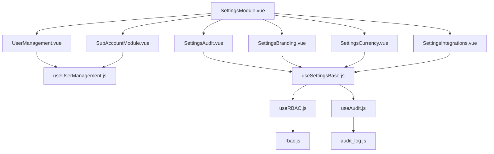
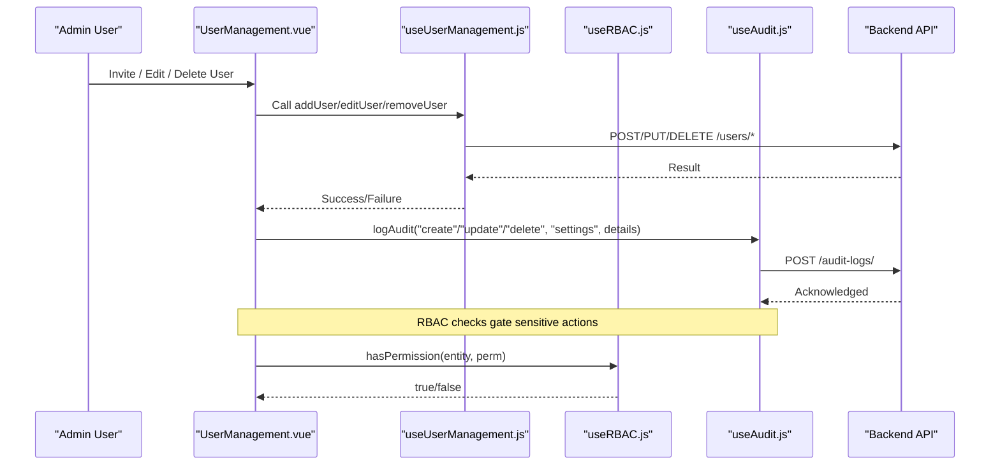
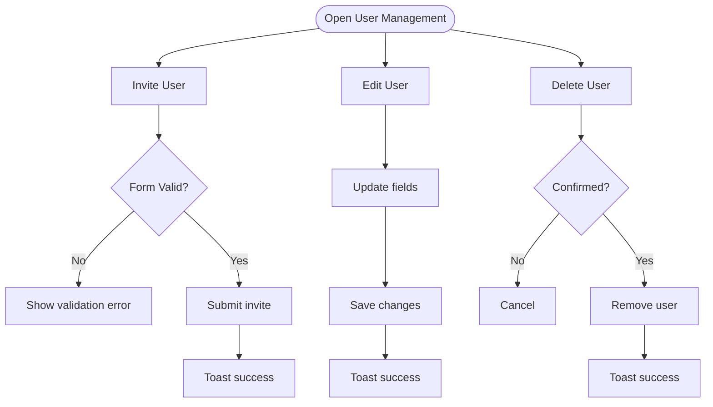
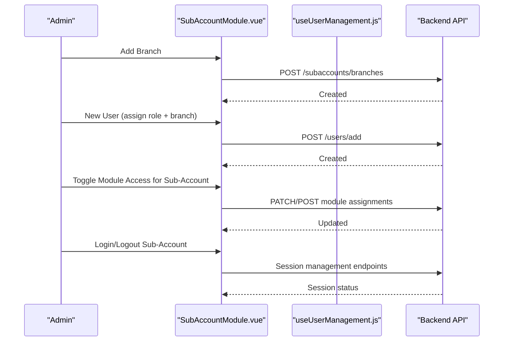
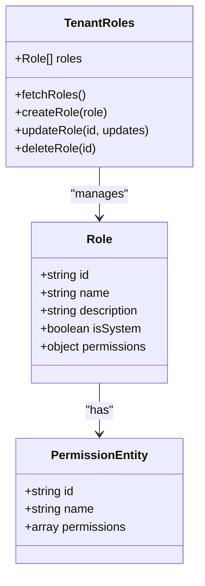
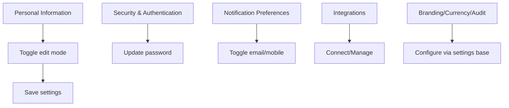
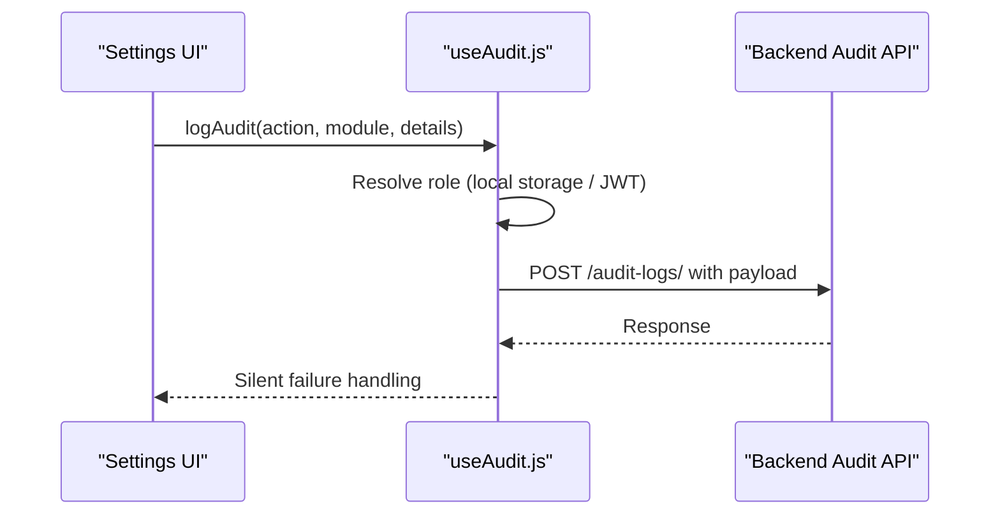
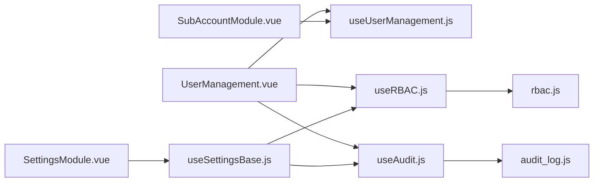

# Settings & Administration

<cite>
**Referenced Files in This Document**
- [SettingsModule.vue](file://src/views/Modules/settings/SettingsModule.vue)
- [UserManagement.vue](file://src/views/Modules/settings/UserManagement.vue)
- [SubAccountModule.vue](file://src/views/Modules/settings/SubAccountModule.vue)
- [useUserManagement.js](file://src/composables/useUserManagement.js)
- [rbac.js](file://src/config/rbac.js)
- [useRBAC.js](file://src/composables/useRBAC.js)
- [useAudit.js](file://src/config/useAudit.js)
- [audit_log.js](file://src/services/audit_log.js)
- [SettingsAudit.vue](file://src/views/Modules/settings/components/SettingsAudit.vue)
- [SettingsBranding.vue](file://src/views/Modules/settings/components/SettingsBranding.vue)
- [SettingsCurrency.vue](file://src/views/Modules/settings/components/SettingsCurrency.vue)
- [SettingsIntegrations.vue](file://src/views/Modules/settings/components/SettingsIntegrations.vue)
- [useSettingsBase.js](file://src/composables/settings/useSettingsBase.js)
- [useSettingsRoles.js](file://src/composables/settings/useSettingsRoles.js)
</cite>

## Table of Contents
1. Introduction
2. Project Structure
3. Core Components
4. Architecture Overview
5. Detailed Component Analysis
6. Dependency Analysis
7. Performance Considerations
8. Troubleshooting Guide
9. Conclusion
10. Appendices

## Introduction
This document explains the Settings and Administration module with a focus on:
- User management (creation, editing, password changes, activity tracking)
- Role and permissions system (role definition, permission matrices, module access control, branch visibility)
- Sub-account management for multi-tenant support (branch creation, user assignment, bulk operations via CSV import/export)
- Settings interface (branding, notifications, currency, integrations)
- Audit trail capturing administrative actions with timestamps and actor identification
- Practical examples and security best practices

## Project Structure
The Settings and Administration feature spans views, composables, configuration, and services:
- Views: SettingsModule, UserManagement, SubAccountModule, and setting-specific components (Audit, Branding, Currency, Integrations)
- Composables: useUserManagement, useRBAC, useSettingsBase, useSettingsRoles, useAudit
- Configuration: rbac (roles, entities, permissions), usePreferences
- Services: audit_log and API integration helpers

**Diagram sources**
- [SettingsModule.vue:1-120](file://src/views/Modules/settings/SettingsModule.vue#L1-L120)
- [UserManagement.vue:1-120](file://src/views/Modules/settings/UserManagement.vue#L1-L120)
- [SubAccountModule.vue:1-120](file://src/views/Modules/settings/SubAccountModule.vue#L1-L120)
- [SettingsAudit.vue:1-53](file://src/views/Modules/settings/components/SettingsAudit.vue#L1-L53)
- [SettingsBranding.vue:1-53](file://src/views/Modules/settings/components/SettingsBranding.vue#L1-L53)
- [SettingsCurrency.vue:1-53](file://src/views/Modules/settings/components/SettingsCurrency.vue#L1-L53)
- [SettingsIntegrations.vue:1-53](file://src/views/Modules/settings/components/SettingsIntegrations.vue#L1-L53)
- [useUserManagement.js:1-120](file://src/composables/useUserManagement.js#L1-L120)
- [useSettingsBase.js:1-120](file://src/composables/settings/useSettingsBase.js#L1-L120)
- [useRBAC.js:1-120](file://src/composables/useRBAC.js#L1-L120)
- [rbac.js:1-120](file://src/config/rbac.js#L1-L120)
- [useAudit.js:1-76](file://src/config/useAudit.js#L1-L76)
- [audit_log.js:1-20](file://src/services/audit_log.js#L1-L20)

**Section sources**
- [SettingsModule.vue:1-120](file://src/views/Modules/settings/SettingsModule.vue#L1-L120)
- [UserManagement.vue:1-120](file://src/views/Modules/settings/UserManagement.vue#L1-L120)
- [SubAccountModule.vue:1-120](file://src/views/Modules/settings/SubAccountModule.vue#L1-L120)

## Core Components
- SettingsModule: Central navigation to profile, security, roles, notifications, and integrations; includes personal info editing and password update UI.
- UserManagement: Users, Roles, and Permissions tabs with invite/edit/delete flows and permission matrix per role.
- SubAccountModule: Multi-tenant sub-account dashboard with branch CRUD, user assignment, login/logout per sub-account, and details modal for profile and module access matrix.
- useUserManagement: Encapsulates users, branches, modules state and API calls for create/update/delete/list.
- useRBAC: Role-based access control, tenant roles, organizations, UI preferences, and permission checks.
- useSettingsBase: Shared settings composable integrating RBAC, preferences, currency, and subscription calculator.
- useSettingsRoles: Role editor with entity-level permissions, POS addons, asset scope, and save/delete workflows.
- useAudit: Captures admin actions to backend audit logs with actor identity and timestamp.

**Section sources**
- [SettingsModule.vue:277-442](file://src/views/Modules/settings/SettingsModule.vue#L277-L442)
- [UserManagement.vue:478-786](file://src/views/Modules/settings/UserManagement.vue#L478-L786)
- [SubAccountModule.vue:1-800](file://src/views/Modules/settings/SubAccountModule.vue#L1-L800)
- [useUserManagement.js:15-292](file://src/composables/useUserManagement.js#L15-L292)
- [useRBAC.js:55-137](file://src/composables/useRBAC.js#L55-L137)
- [useSettingsBase.js:26-120](file://src/composables/settings/useSettingsBase.js#L26-L120)
- [useSettingsRoles.js:5-187](file://src/composables/settings/useSettingsRoles.js#L5-L187)
- [useAudit.js:19-76](file://src/config/useAudit.js#L19-L76)

## Architecture Overview
The Settings and Administration module is composed of Vue views that coordinate through composables to manage users, roles, permissions, sub-accounts, and settings. Data flows from UI to composables, which call backend APIs and persist state locally where appropriate. Audit events are emitted for critical actions.

**Diagram sources**
- [UserManagement.vue:706-780](file://src/views/Modules/settings/UserManagement.vue#L706-L780)
- [useUserManagement.js:75-161](file://src/composables/useUserManagement.js#L75-L161)
- [useRBAC.js:63-137](file://src/composables/useRBAC.js#L63-L137)
- [useAudit.js:43-72](file://src/config/useAudit.js#L43-L72)

## Detailed Component Analysis

### User Management
- Capabilities:
  - Invite new users with name, email, role, department, and password
  - Edit user profiles including role, department, status, and optional password reset
  - Deactivate/activate users and delete with confirmation
  - Filter/search users by role and status
  - Permission matrix view per role with module-level toggles and bulk grant/revoke
- Implementation highlights:
  - Local state-driven table with pagination and filters
  - Modals for invite, edit, create role, and delete confirmation
  - Toast feedback for success/error
  - Permission matrix organized by module with progress indicators

**Diagram sources**
- [UserManagement.vue:272-461](file://src/views/Modules/settings/UserManagement.vue#L272-L461)
- [UserManagement.vue:706-780](file://src/views/Modules/settings/UserManagement.vue#L706-L780)

**Section sources**
- [UserManagement.vue:1-476](file://src/views/Modules/settings/UserManagement.vue#L1-L476)
- [UserManagement.vue:478-786](file://src/views/Modules/settings/UserManagement.vue#L478-L786)

### Sub-Account Management (Multi-Tenant)
- Capabilities:
  - Create branches with location and contact details
  - Manage branches (activate/deactivate, edit, delete with confirmation)
  - Assign users to branches and roles
  - Login/logout per sub-account with active session list
  - Details modal for profile editing and module access matrix per sub-account
- Implementation highlights:
  - Card and list views with search and filters
  - Metrics for total users, active branches, tier, filtered context
  - Modal-driven workflows for create/edit/delete and module assignment

**Diagram sources**
- [SubAccountModule.vue:1-800](file://src/views/Modules/settings/SubAccountModule.vue#L1-L800)
- [useUserManagement.js:163-228](file://src/composables/useUserManagement.js#L163-L228)

**Section sources**
- [SubAccountModule.vue:1-800](file://src/views/Modules/settings/SubAccountModule.vue#L1-L800)
- [useUserManagement.js:15-292](file://src/composables/useUserManagement.js#L15-L292)

### Role and Permissions System
- Role definitions:
  - Default roles include Owner, Manager, Cashier, Accountant, Auditor, Attendant, Hotel Attendant, plus asset-focused roles (System Admin, Asset Manager, Finance Officer, Technician, Department Manager, Read-Only Viewer)
  - Each role defines per-entity permissions (read/write/edit/delete/assign/approve/export)
- Permission matrices:
  - Per-role matrix with module grouping, toggle controls, and bulk actions
  - Entity-specific permissions can be extended (e.g., CRM assign/approve)
- Module access control:
  - Sub-account details include a feature matrix to toggle module access per sub-account
  - Available permissions filtered by subscribed modules
- Branch visibility:
  - Branch selection during user creation/assignment limits data scope
  - Sub-account sessions show branch context

**Diagram sources**
- [rbac.js:85-337](file://src/config/rbac.js#L85-L337)
- [useRBAC.js:144-347](file://src/composables/useRBAC.js#L144-L347)
- [UserManagement.vue:586-664](file://src/views/Modules/settings/UserManagement.vue#L586-L664)

**Section sources**
- [rbac.js:1-337](file://src/config/rbac.js#L1-L337)
- [useRBAC.js:55-347](file://src/composables/useRBAC.js#L55-L347)
- [UserManagement.vue:178-241](file://src/views/Modules/settings/UserManagement.vue#L178-L241)

### Settings Interface
- Profile and Security:
  - Personal information editing (name, email, department, role, employee ID, timezone)
  - Password update with queued confirmation feedback
  - Device authorization listing with revoke actions
- Notifications:
  - Channel toggles for email/mobile per notification type
- Integrations:
  - List of connected systems with connect/manage actions
- Branding, Currency, Audit:
  - Placeholder panels ready for migration; base settings composable provides shared utilities and preferences

**Diagram sources**
- [SettingsModule.vue:31-270](file://src/views/Modules/settings/SettingsModule.vue#L31-L270)
- [useSettingsBase.js:50-65](file://src/composables/settings/useSettingsBase.js#L50-L65)

**Section sources**
- [SettingsModule.vue:31-270](file://src/views/Modules/settings/SettingsModule.vue#L31-L270)
- [SettingsAudit.vue:1-53](file://src/views/Modules/settings/components/SettingsAudit.vue#L1-L53)
- [SettingsBranding.vue:1-53](file://src/views/Modules/settings/components/SettingsBranding.vue#L1-L53)
- [SettingsCurrency.vue:1-53](file://src/views/Modules/settings/components/SettingsCurrency.vue#L1-L53)
- [SettingsIntegrations.vue:1-53](file://src/views/Modules/settings/components/SettingsIntegrations.vue#L1-L53)

### Audit Trail System
- Captures administrative actions with:
  - Actor identity (email, name, resolved role)
  - Action type (create/update/delete/login/logout/export/import/approve/reject)
  - Module context and details payload
  - Timestamps
- Integration points:
  - useAudit composable posts to backend audit endpoint
  - Legacy service also available for simple logging
- UI placeholder:
  - SettingsAudit component present for future configuration panel

**Diagram sources**
- [useAudit.js:19-76](file://src/config/useAudit.js#L19-L76)
- [audit_log.js:1-20](file://src/services/audit_log.js#L1-L20)
- [SettingsAudit.vue:1-53](file://src/views/Modules/settings/components/SettingsAudit.vue#L1-L53)

**Section sources**
- [useAudit.js:19-76](file://src/config/useAudit.js#L19-L76)
- [audit_log.js:1-20](file://src/services/audit_log.js#L1-L20)
- [SettingsAudit.vue:1-53](file://src/views/Modules/settings/components/SettingsAudit.vue#L1-L53)

## Dependency Analysis
Key dependencies and relationships:
- Views depend on composables for business logic and state
- Composables depend on configuration (rbac) and services (API, audit)
- RBAC governs permission checks across user management and settings
- Sub-account flows rely on user and branch management APIs

**Diagram sources**
- [UserManagement.vue:478-786](file://src/views/Modules/settings/UserManagement.vue#L478-L786)
- [SubAccountModule.vue:1-800](file://src/views/Modules/settings/SubAccountModule.vue#L1-L800)
- [SettingsModule.vue:277-442](file://src/views/Modules/settings/SettingsModule.vue#L277-L442)
- [useUserManagement.js:15-292](file://src/composables/useUserManagement.js#L15-L292)
- [useRBAC.js:55-783](file://src/composables/useRBAC.js#L55-L783)
- [useSettingsBase.js:26-379](file://src/composables/settings/useSettingsBase.js#L26-L379)
- [rbac.js:1-753](file://src/config/rbac.js#L1-L753)
- [useAudit.js:19-76](file://src/config/useAudit.js#L19-L76)
- [audit_log.js:1-20](file://src/services/audit_log.js#L1-L20)

**Section sources**
- [useRBAC.js:55-783](file://src/composables/useRBAC.js#L55-L783)
- [useSettingsBase.js:26-379](file://src/composables/settings/useSettingsBase.js#L26-L379)
- [rbac.js:1-753](file://src/config/rbac.js#L1-L753)

## Performance Considerations
- Use computed properties for derived lists (filtered users, permission stats) to minimize re-renders
- Paginate large user lists to reduce DOM size
- Debounce search inputs if connecting to remote APIs
- Batch module permission updates where possible
- Cache tenant roles and UI preferences locally to avoid repeated network calls
- Avoid heavy synchronous operations in event handlers; prefer async flows with loading states

[No sources needed since this section provides general guidance]

## Troubleshooting Guide
Common issues and resolutions:
- Role not assignable or missing:
  - Ensure roles are loaded from backend and merged with defaults; check fetchRoles and merge logic
  - Verify tenant roles contain the expected role IDs and names
- Permission matrix not updating:
  - Confirm togglePermission and grantAll functions update local state and reflect counts
  - Check module filtering and search inputs
- Audit logs not recorded:
  - Verify useAudit is called with correct action/module/details
  - Check network requests to /audit-logs/ and handle non-ok responses gracefully
- Sub-account branch deletion fails:
  - Ensure confirmation text matches required pattern and API returns success
- User invite/edit fails:
  - Validate form fields and handle API errors; refresh user list after successful mutations

**Section sources**
- [useRBAC.js:144-226](file://src/composables/useRBAC.js#L144-L226)
- [UserManagement.vue:706-780](file://src/views/Modules/settings/UserManagement.vue#L706-L780)
- [useAudit.js:43-72](file://src/config/useAudit.js#L43-L72)
- [SubAccountModule.vue:585-643](file://src/views/Modules/settings/SubAccountModule.vue#L585-L643)

## Conclusion
The Settings and Administration module provides comprehensive capabilities for managing users, roles, permissions, sub-accounts, and system settings. It integrates robust RBAC, audit logging, and modular settings interfaces. By following the documented flows and best practices, administrators can maintain secure, auditable, and scalable multi-tenant environments.

[No sources needed since this section summarizes without analyzing specific files]

## Appendices

### Practical Examples
- Configuring user roles:
  - Open Roles tab, create a new role, select entity permissions, and save
  - Reference: [UserManagement.vue:401-438](file://src/views/Modules/settings/UserManagement.vue#L401-L438)
- Managing sub-accounts:
  - Create a branch, then add a user assigned to that branch and role
  - Reference: [SubAccountModule.vue:419-483](file://src/views/Modules/settings/SubAccountModule.vue#L419-L483)
- Monitoring system usage:
  - Review audit logs via backend; ensure actions trigger useAudit calls
  - Reference: [useAudit.js:43-72](file://src/config/useAudit.js#L43-L72)

### Security Considerations and Best Practices
- Enforce RBAC checks before rendering sensitive controls
- Validate all inputs on client and server sides
- Use confirmation dialogs for destructive actions (delete user/branch)
- Log all administrative actions to audit trails
- Limit exposure of sensitive fields (e.g., disable email editing in user edit modal)
- Apply least privilege when assigning roles and permissions
- Securely handle tokens and credentials in API calls

**Section sources**
- [useRBAC.js:63-137](file://src/composables/useRBAC.js#L63-L137)
- [UserManagement.vue:335-399](file://src/views/Modules/settings/UserManagement.vue#L335-L399)
- [SubAccountModule.vue:585-643](file://src/views/Modules/settings/SubAccountModule.vue#L585-L643)
- [useAudit.js:43-72](file://src/config/useAudit.js#L43-L72)