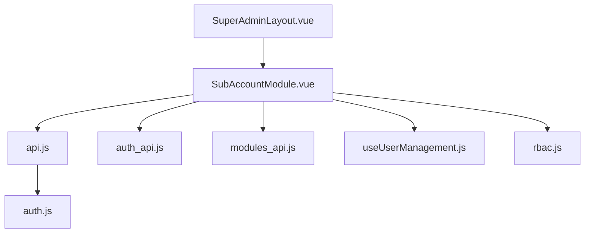
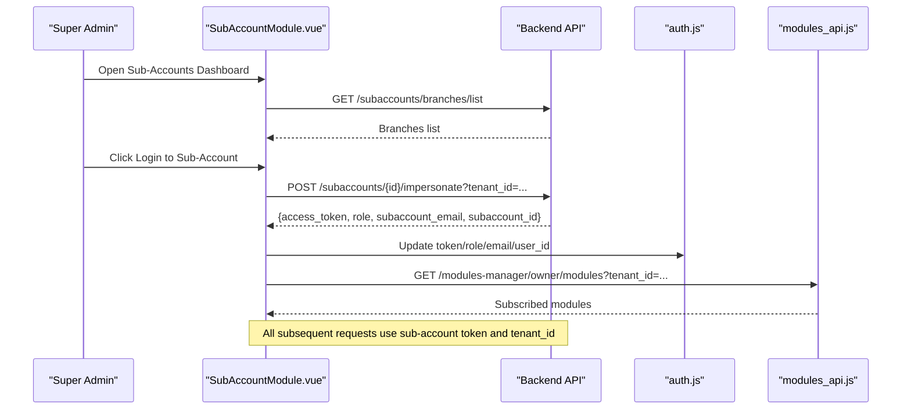
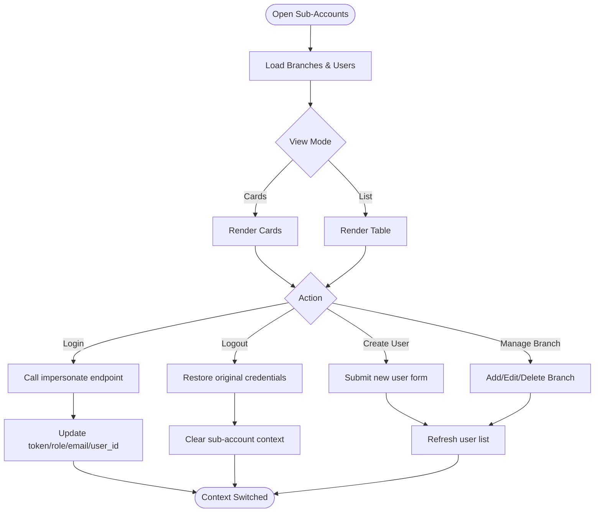
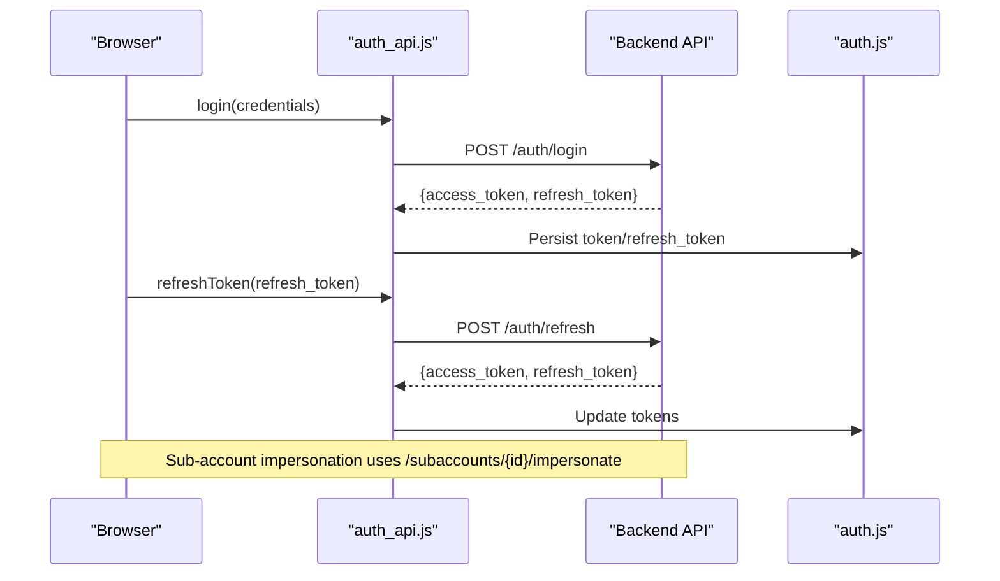
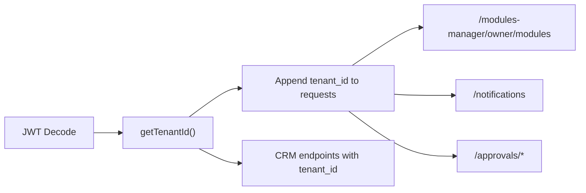
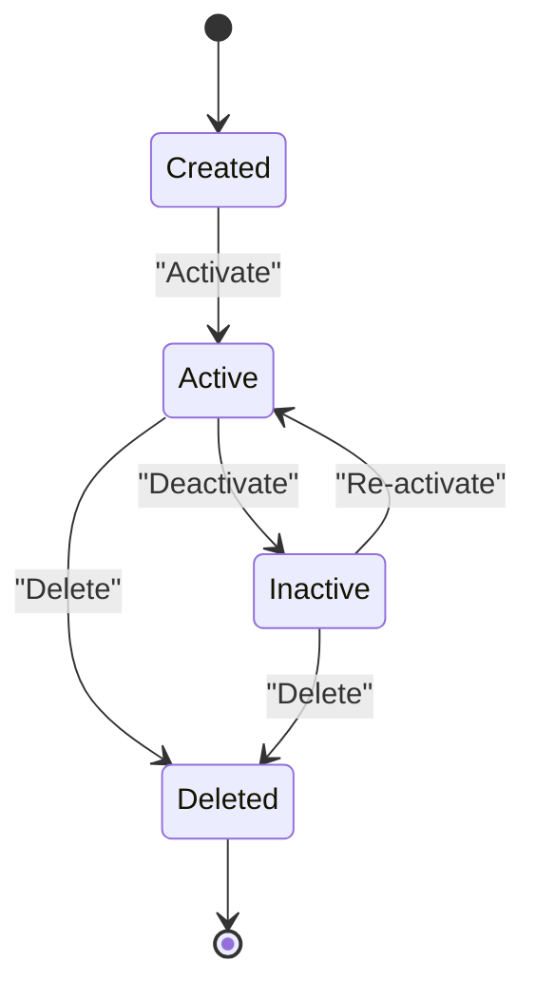
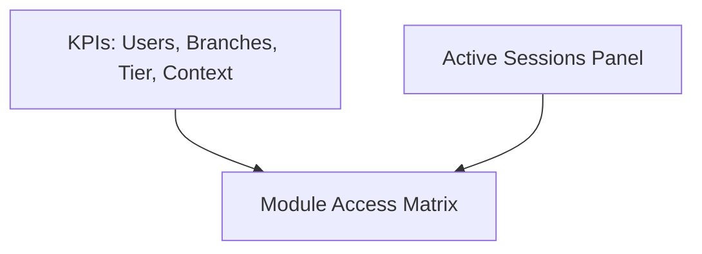

# Sub-Account Management

<cite>
**Referenced Files in This Document**
- [SubAccountModule.vue](file://src/views/Modules/settings/SubAccountModule.vue)
- [auth.js](file://src/stores/auth.js)
- [auth_api.js](file://src/services/auth_api.js)
- [api.js](file://src/services/api.js)
- [modules_api.js](file://src/services/modules_api.js)
- [useUserManagement.js](file://src/composables/useUserManagement.js)
- [rbac.js](file://src/config/rbac.js)
- [SuperAdminLayout.vue](file://src/components/layouts/SuperAdminLayout.vue)
</cite>

## Table of Contents
1. [Introduction](#introduction)
2. [Project Structure](#project-structure)
3. [Core Components](#core-components)
4. [Architecture Overview](#architecture-overview)
5. [Detailed Component Analysis](#detailed-component-analysis)
6. [Dependency Analysis](#dependency-analysis)
7. [Performance Considerations](#performance-considerations)
8. [Troubleshooting Guide](#troubleshooting-guide)
9. [Conclusion](#conclusion)
10. [Appendices](#appendices)

## Introduction
This document explains the Sub-Account Management system that enables multi-tenant operations within the application. It covers:
- Creating and configuring sub-accounts (tenants), including organization setup, initial configuration, and administrator assignment
- Tenant isolation mechanisms ensuring data separation while sharing platform functionality
- Lifecycle management for activation/deactivation, configuration updates, and deletion
- Multi-tenant authentication flows where users authenticate against specific sub-accounts with context-aware access
- Dashboard views, usage statistics, and configuration panels for managing sub-accounts
- Practical examples for setting up tenants, migrating users between accounts, and managing cross-tenant operations
- Security considerations for tenant isolation, data privacy, and secure inter-tenant communication patterns

## Project Structure
The sub-account feature spans UI components, services, stores, and configuration modules:
- Sub-account dashboard and modals: [SubAccountModule.vue](file://src/views/Modules/settings/SubAccountModule.vue)
- Authentication and token handling: [auth_api.js](file://src/services/auth_api.js), [api.js](file://src/services/api.js), [auth.js](file://src/stores/auth.js)
- Module subscription and tenant-scoped features: [modules_api.js](file://src/services/modules_api.js)
- User and branch management utilities: [useUserManagement.js](file://src/composables/useUserManagement.js)
- Role-based access control definitions: [rbac.js](file://src/config/rbac.js)
- Super admin navigation shell: [SuperAdminLayout.vue](file://src/components/layouts/SuperAdminLayout.vue)

**Diagram sources**
- [SubAccountModule.vue:1-800](file://src/views/Modules/settings/SubAccountModule.vue#L1-L800)
- [api.js:1-209](file://src/services/api.js#L1-L209)
- [auth_api.js:1-190](file://src/services/auth_api.js#L1-L190)
- [auth.js:1-22](file://src/stores/auth.js#L1-L22)
- [modules_api.js:1-187](file://src/services/modules_api.js#L1-L187)
- [useUserManagement.js:1-292](file://src/composables/useUserManagement.js#L1-L292)
- [rbac.js:1-753](file://src/config/rbac.js#L1-L753)
- [SuperAdminLayout.vue:1-155](file://src/components/layouts/SuperAdminLayout.vue#L1-L155)

**Section sources**
- [SubAccountModule.vue:1-800](file://src/views/Modules/settings/SubAccountModule.vue#L1-L800)
- [api.js:1-209](file://src/services/api.js#L1-L209)
- [auth_api.js:1-190](file://src/services/auth_api.js#L1-L190)
- [auth.js:1-22](file://src/stores/auth.js#L1-L22)
- [modules_api.js:1-187](file://src/services/modules_api.js#L1-L187)
- [useUserManagement.js:1-292](file://src/composables/useUserManagement.js#L1-L292)
- [rbac.js:1-753](file://src/config/rbac.js#L1-L753)
- [SuperAdminLayout.vue:1-155](file://src/components/layouts/SuperAdminLayout.vue#L1-L155)

## Core Components
- Sub-account dashboard and session management: The main interface lists sub-accounts, shows active sessions, supports login/logout per sub-account, and provides create/edit/delete workflows for users and branches.
- Authentication service: Handles login, refresh, signup, profile fetch, and token storage; includes interceptors to attach Authorization headers and auto-refresh on 401.
- Auth store: Maintains minimal auth state (token, role, email) and logout action to clear persisted credentials.
- Modules API: Provides tenant-scoped module subscription checks and retrieval using tenant_id from JWT decoding.
- User management composable: Encapsulates user CRUD, branch CRUD, and module subscription fetching with loading/error states.
- RBAC configuration: Defines roles, permissions, entities, and helpers for permission checks and role merging.
- Super Admin layout: Provides navigation to tenant management, revenues, reports, and system traces.

**Section sources**
- [SubAccountModule.vue:1-800](file://src/views/Modules/settings/SubAccountModule.vue#L1-L800)
- [auth_api.js:1-190](file://src/services/auth_api.js#L1-L190)
- [api.js:1-209](file://src/services/api.js#L1-L209)
- [auth.js:1-22](file://src/stores/auth.js#L1-L22)
- [modules_api.js:1-187](file://src/services/modules_api.js#L1-L187)
- [useUserManagement.js:1-292](file://src/composables/useUserManagement.js#L1-L292)
- [rbac.js:1-753](file://src/config/rbac.js#L1-L753)
- [SuperAdminLayout.vue:1-155](file://src/components/layouts/SuperAdminLayout.vue#L1-L155)

## Architecture Overview
The sub-account architecture centers around impersonation and tenant-scoped requests:
- A super-admin or owner authenticates once and maintains original credentials
- To manage a sub-account, the frontend calls an impersonate endpoint to obtain a sub-account-specific JWT
- All subsequent requests include the sub-account’s token and tenant_id to ensure isolation
- Module subscriptions are checked per tenant, enabling feature gating based on subscription status

**Diagram sources**
- [SubAccountModule.vue:1472-1537](file://src/views/Modules/settings/SubAccountModule.vue#L1472-L1537)
- [modules_api.js:16-49](file://src/services/modules_api.js#L16-L49)
- [api.js:64-146](file://src/services/api.js#L64-L146)
- [auth.js:1-22](file://src/stores/auth.js#L1-L22)

**Section sources**
- [SubAccountModule.vue:1472-1537](file://src/views/Modules/settings/SubAccountModule.vue#L1472-L1537)
- [modules_api.js:16-49](file://src/services/modules_api.js#L16-L49)
- [api.js:64-146](file://src/services/api.js#L64-L146)
- [auth.js:1-22](file://src/stores/auth.js#L1-L22)

## Detailed Component Analysis

### Sub-Account Dashboard and Session Management
- Displays metrics (total users, active branches, subscription tier, filtered context)
- Supports card and list views with search, filters by role and branch, pagination
- Active sessions panel shows currently logged-in sub-accounts with logout controls
- Create user modal collects identity, role, branch, and security fields
- Manage branches modal allows adding, editing, toggling status, and deleting branches with confirmation
- Sub-account details panel supports profile edits and module access matrix toggles

Key behaviors:
- Impersonation flow obtains a sub-account JWT and persists it alongside original credentials
- Logout restores original tenant credentials and clears sub-account context
- Module assignments are toggled per sub-account and saved automatically

**Diagram sources**
- [SubAccountModule.vue:1-800](file://src/views/Modules/settings/SubAccountModule.vue#L1-L800)
- [SubAccountModule.vue:1472-1537](file://src/views/Modules/settings/SubAccountModule.vue#L1472-L1537)
- [SubAccountModule.vue:1539-1605](file://src/views/Modules/settings/SubAccountModule.vue#L1539-L1605)

**Section sources**
- [SubAccountModule.vue:1-800](file://src/views/Modules/settings/SubAccountModule.vue#L1-L800)
- [SubAccountModule.vue:1472-1537](file://src/views/Modules/settings/SubAccountModule.vue#L1472-L1537)
- [SubAccountModule.vue:1539-1605](file://src/views/Modules/settings/SubAccountModule.vue#L1539-L1605)

### Multi-Tenant Authentication Flow
- Login and refresh endpoints are centralized in the auth service
- Token is attached via Axios interceptor and stored in localStorage
- On 401, the API client attempts to refresh tokens; if unsuccessful, redirects to login
- Sub-account impersonation swaps the current token to a sub-account JWT scoped to the tenant

**Diagram sources**
- [auth_api.js:36-87](file://src/services/auth_api.js#L36-L87)
- [api.js:166-200](file://src/services/api.js#L166-L200)
- [auth.js:1-22](file://src/stores/auth.js#L1-L22)

**Section sources**
- [auth_api.js:36-87](file://src/services/auth_api.js#L36-L87)
- [api.js:64-146](file://src/services/api.js#L64-L146)
- [auth.js:1-22](file://src/stores/auth.js#L1-L22)

### Tenant Isolation Mechanisms
- Tenant ID is extracted from JWT and appended to API queries (e.g., modules, notifications, approvals)
- Sub-account impersonation ensures all requests are scoped to the target tenant
- Module subscriptions are fetched per tenant, gating feature availability
- Branch-level scoping is supported via branch_id associations for users

**Diagram sources**
- [modules_api.js:16-49](file://src/services/modules_api.js#L16-L49)
- [useSettingsApprovals.js:97-128](file://src/composables/settings/useSettingsApprovals.js#L97-L128)
- [NotificationBell.vue:123-190](file://src/components/NotificationBell.vue#L123-L190)

**Section sources**
- [modules_api.js:16-49](file://src/services/modules_api.js#L16-L49)
- [useSettingsApprovals.js:97-128](file://src/composables/settings/useSettingsApprovals.js#L97-L128)
- [NotificationBell.vue:123-190](file://src/components/NotificationBell.vue#L123-L190)

### Sub-Account Lifecycle Management
- Creation: Add new users with role and branch assignment; create branches with location and contact info
- Activation/Deactivation: Toggle branch status; deactivate/activate users via user management
- Configuration Updates: Edit user profiles, assign roles and branches; toggle module access per sub-account
- Deletion: Delete branches with confirmation; delete users with confirmation dialogs

**Diagram sources**
- [SubAccountModule.vue:419-643](file://src/views/Modules/settings/SubAccountModule.vue#L419-L643)
- [useUserManagement.js:75-161](file://src/composables/useUserManagement.js#L75-L161)

**Section sources**
- [SubAccountModule.vue:419-643](file://src/views/Modules/settings/SubAccountModule.vue#L419-L643)
- [useUserManagement.js:75-161](file://src/composables/useUserManagement.js#L75-L161)

### Multi-Tenant Dashboard Views and Usage Statistics
- Metrics display total registered users, active branches, subscription tier, and filtered context counts
- Active sessions panel shows sub-account names, timestamps, and logout controls
- Module access matrix allows toggling feature availability per sub-account

**Diagram sources**
- [SubAccountModule.vue:63-120](file://src/views/Modules/settings/SubAccountModule.vue#L63-L120)
- [SubAccountModule.vue:33-61](file://src/views/Modules/settings/SubAccountModule.vue#L33-L61)
- [SubAccountModule.vue:735-791](file://src/views/Modules/settings/SubAccountModule.vue#L735-L791)

**Section sources**
- [SubAccountModule.vue:63-120](file://src/views/Modules/settings/SubAccountModule.vue#L63-L120)
- [SubAccountModule.vue:33-61](file://src/views/Modules/settings/SubAccountModule.vue#L33-L61)
- [SubAccountModule.vue:735-791](file://src/views/Modules/settings/SubAccountModule.vue#L735-L791)

### Practical Examples
- Setting up a new tenant:
  - Create a branch with name, location, phone, and email
  - Invite a user with role and department; set password and confirm
  - Assign modules based on subscription status
- Migrating users between accounts:
  - Use impersonation to switch context to target sub-account
  - Update user’s branch_id and role within the target tenant
  - Re-authenticate to apply changes
- Managing cross-tenant operations:
  - Fetch subscribed modules per tenant to gate features
  - Use tenant_id in all API calls to ensure isolation

**Section sources**
- [useUserManagement.js:180-228](file://src/composables/useUserManagement.js#L180-L228)
- [modules_api.js:56-87](file://src/services/modules_api.js#L56-L87)
- [SubAccountModule.vue:1472-1537](file://src/views/Modules/settings/SubAccountModule.vue#L1472-L1537)

## Dependency Analysis
- SubAccountModule depends on:
  - api.js for base URL resolution and request helpers
  - auth_api.js for login/refresh/signup/profile
  - modules_api.js for tenant module subscriptions
  - useUserManagement.js for user/branch/module operations
  - rbac.js for role definitions and permission checks
  - auth.js for minimal auth state and logout
- SuperAdminLayout provides navigation to tenant management routes

**Diagram sources**
- [SubAccountModule.vue:1-800](file://src/views/Modules/settings/SubAccountModule.vue#L1-L800)
- [api.js:1-209](file://src/services/api.js#L1-L209)
- [auth_api.js:1-190](file://src/services/auth_api.js#L1-L190)
- [modules_api.js:1-187](file://src/services/modules_api.js#L1-L187)
- [useUserManagement.js:1-292](file://src/composables/useUserManagement.js#L1-L292)
- [rbac.js:1-753](file://src/config/rbac.js#L1-L753)
- [auth.js:1-22](file://src/stores/auth.js#L1-L22)
- [SuperAdminLayout.vue:1-155](file://src/components/layouts/SuperAdminLayout.vue#L1-L155)

**Section sources**
- [SubAccountModule.vue:1-800](file://src/views/Modules/settings/SubAccountModule.vue#L1-L800)
- [api.js:1-209](file://src/services/api.js#L1-L209)
- [auth_api.js:1-190](file://src/services/auth_api.js#L1-L190)
- [modules_api.js:1-187](file://src/services/modules_api.js#L1-L187)
- [useUserManagement.js:1-292](file://src/composables/useUserManagement.js#L1-L292)
- [rbac.js:1-753](file://src/config/rbac.js#L1-L753)
- [auth.js:1-22](file://src/stores/auth.js#L1-L22)
- [SuperAdminLayout.vue:1-155](file://src/components/layouts/SuperAdminLayout.vue#L1-L155)

## Performance Considerations
- Minimize unnecessary re-renders by leveraging computed properties for filtering and pagination
- Batch module subscription checks to reduce network calls during dashboard load
- Use lazy loading for large lists and defer heavy computations until needed
- Cache tenant metadata and module lists locally when appropriate to reduce API calls
- Ensure token refresh logic handles concurrent requests efficiently to avoid redundant refreshes

[No sources needed since this section provides general guidance]

## Troubleshooting Guide
Common issues and resolutions:
- Failed to impersonate sub-account:
  - Verify original token is present and valid
  - Check backend response for detailed error messages
  - Ensure tenant_id is correctly appended to the impersonate endpoint
- Token refresh failures:
  - Confirm refresh_token exists and is not expired
  - If refresh fails, clear tokens and redirect to login
- Module subscription errors:
  - Validate tenant_id extraction from JWT
  - Ensure Authorization header is attached to requests
- Branch deletion warnings:
  - Confirm irreversible action and required confirmation text
  - Verify no active dependencies before deletion

**Section sources**
- [SubAccountModule.vue:1472-1537](file://src/views/Modules/settings/SubAccountModule.vue#L1472-L1537)
- [api.js:78-146](file://src/services/api.js#L78-L146)
- [modules_api.js:16-49](file://src/services/modules_api.js#L16-L49)
- [SubAccountModule.vue:586-643](file://src/views/Modules/settings/SubAccountModule.vue#L586-L643)

## Conclusion
The Sub-Account Management system provides a robust foundation for multi-tenant operations through impersonation, tenant-scoped requests, and role-based access control. It supports comprehensive lifecycle management for sub-accounts, including creation, configuration, activation/deactivation, and deletion. The dashboard offers visibility into usage and module access, while security measures ensure data isolation and privacy across tenants.

[No sources needed since this section summarizes without analyzing specific files]

## Appendices
- Security best practices:
  - Always validate tenant_id from JWT and append to all API requests
  - Use impersonation only for authorized administrators
  - Enforce least privilege via RBAC and module subscriptions
  - Securely handle token storage and rotation
- Cross-tenant operations:
  - Use tenant_id consistently in all API calls
  - Gate features based on module subscriptions per tenant
  - Audit actions across tenants for compliance

[No sources needed since this section provides general guidance]