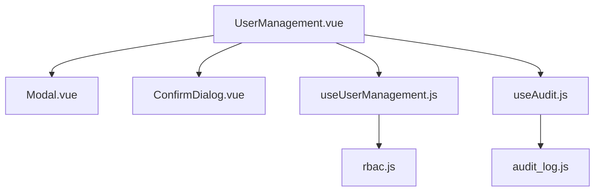
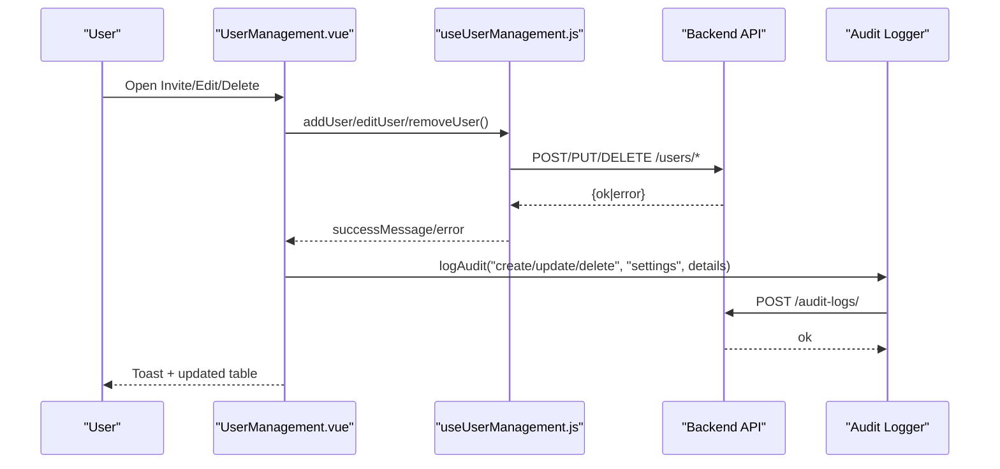
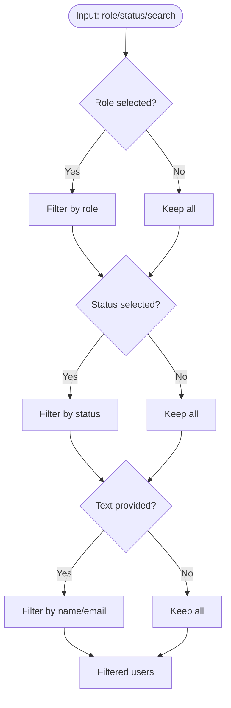
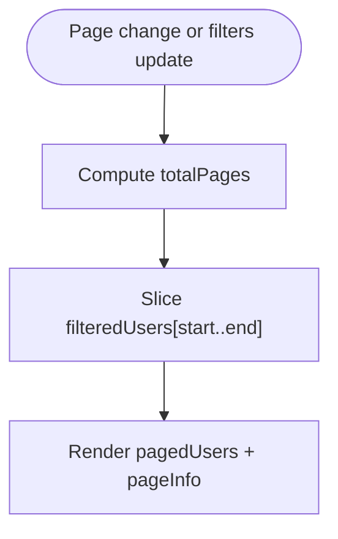
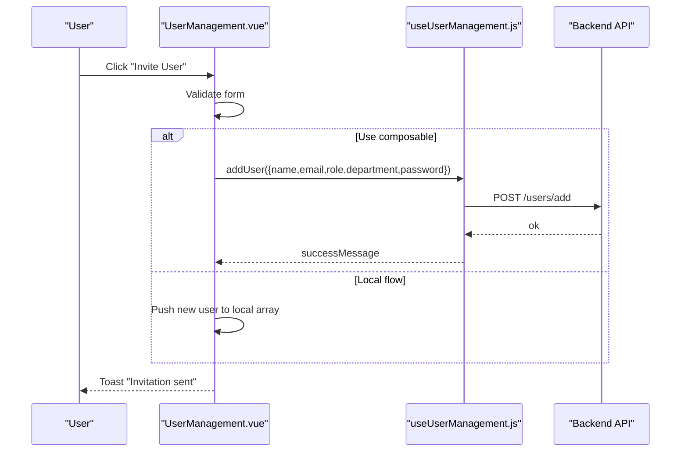
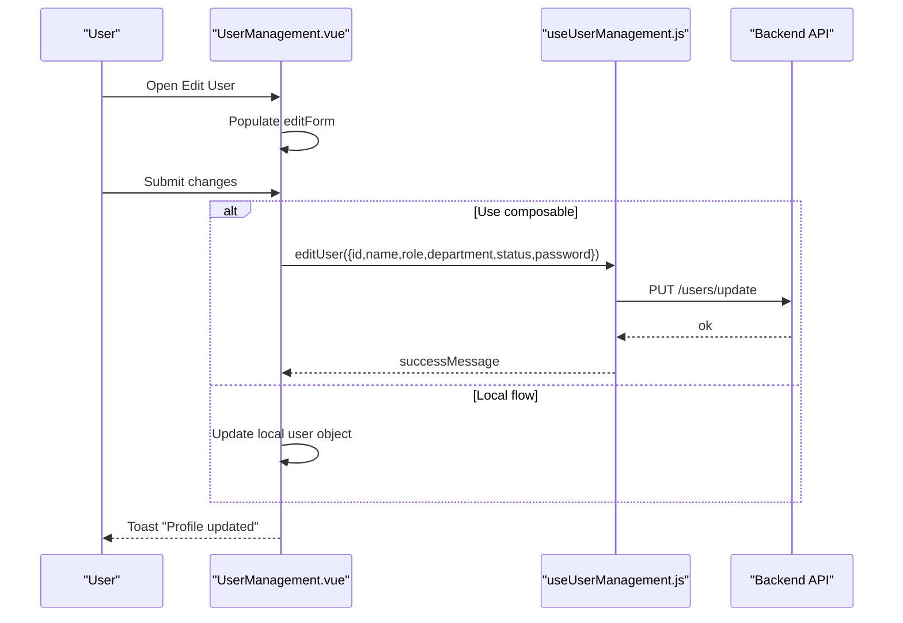
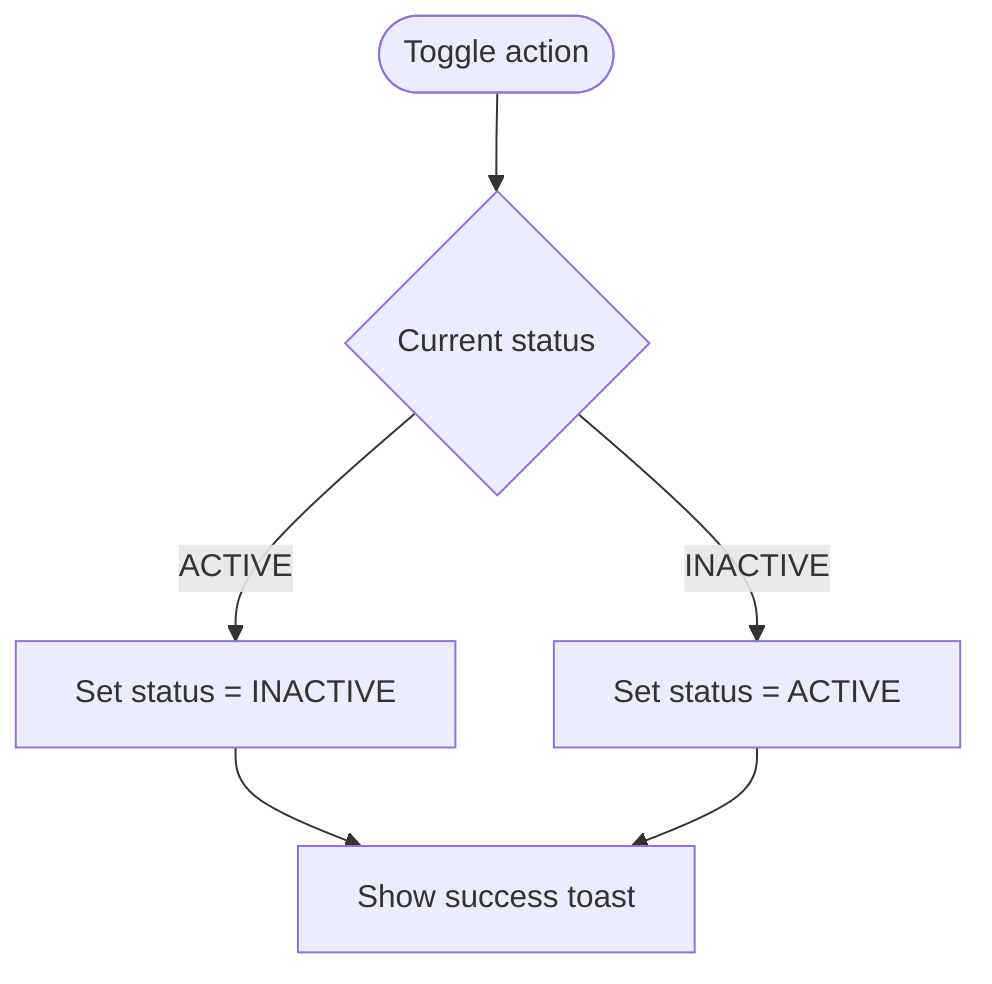
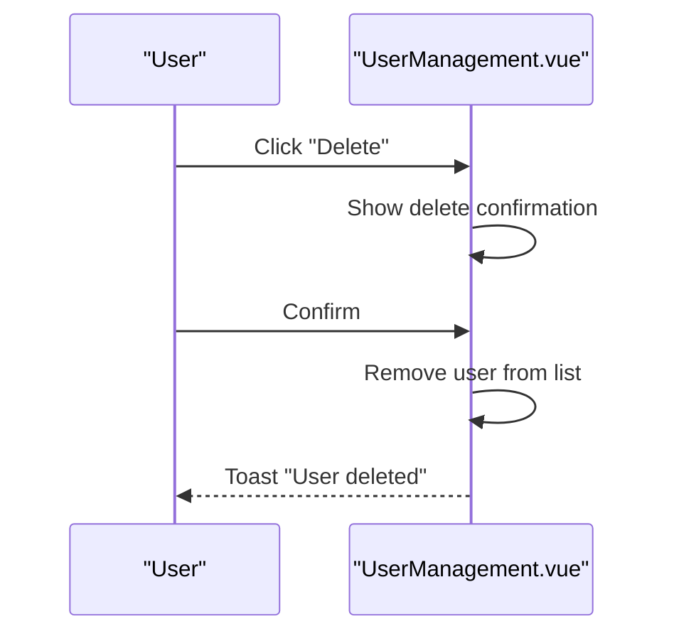
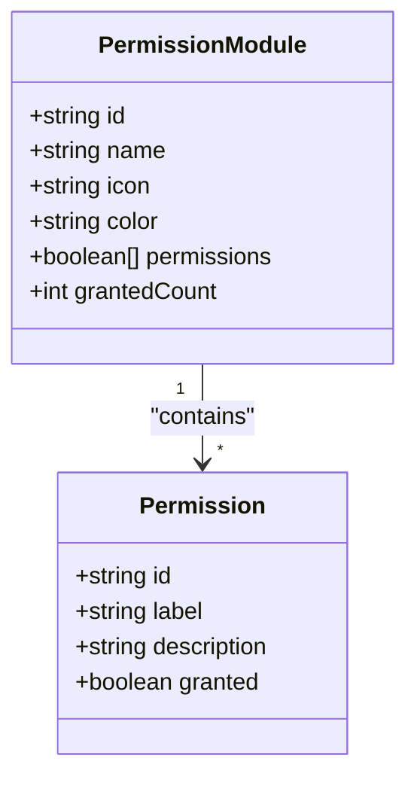
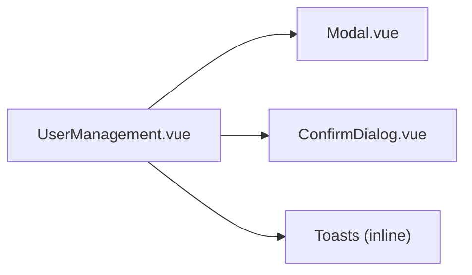

# User Management

<cite>
**Referenced Files in This Document**
- [UserManagement.vue](file://src/views/Modules/settings/UserManagement.vue)
- [useUserManagement.js](file://src/composables/useUserManagement.js)
- [Modal.vue](file://src/components/ui/Modal.vue)
- [ConfirmDialog.vue](file://src/components/ui/ConfirmDialog.vue)
- [rbac.js](file://src/config/rbac.js)
- [useAudit.js](file://src/config/useAudit.js)
- [audit_log.js](file://src/services/audit_log.js)
</cite>

## Table of Contents
1. Introduction
2. Project Structure
3. Core Components
4. Architecture Overview
5. Detailed Component Analysis
6. Dependency Analysis
7. Performance Considerations
8. Troubleshooting Guide
9. Conclusion

## Introduction
This document explains the User Management system implemented in the frontend. It covers user lifecycle operations (creation, invitation, editing, activation/deactivation), the user data model, search and filtering, pagination, UI components (modals, confirm dialogs, toasts), bulk operations, role assignment workflows, department management, security considerations, and audit logging for administrative actions.

## Project Structure
The User Management feature is centered around a settings page that provides:
- A users table with role/status filters and text search
- Role and permissions management tabs
- Modals for inviting/editing users and creating roles
- Confirmation dialogs for destructive actions
- Toast notifications for feedback
- Pagination for large datasets

**Diagram sources**
- [UserManagement.vue:1-800](file://src/views/Modules/settings/UserManagement.vue#L1-L800)
- [useUserManagement.js:1-292](file://src/composables/useUserManagement.js#L1-L292)
- [Modal.vue:1-258](file://src/components/ui/Modal.vue#L1-L258)
- [ConfirmDialog.vue:1-178](file://src/components/ui/ConfirmDialog.vue#L1-L178)
- [rbac.js:1-333](file://src/config/rbac.js#L1-L333)
- [useAudit.js:1-76](file://src/config/useAudit.js#L1-L76)
- [audit_log.js:1-20](file://src/services/audit_log.js#L1-L20)

**Section sources**
- [UserManagement.vue:1-800](file://src/views/Modules/settings/UserManagement.vue#L1-L800)
- [useUserManagement.js:1-292](file://src/composables/useUserManagement.js#L1-L292)

## Core Components
- Users view: table with role/status filters and text search; per-row actions (edit, activate/deactivate, delete).
- Roles tab: list roles and create new ones with base permissions.
- Permissions tab: module-based permission matrix with toggle controls and bulk grant/revoke.
- Modals: invite user, edit user, create role, delete confirmation.
- Toasts: success/error messages with auto-dismiss.
- Pagination: configurable page size with computed page numbers and info.

Key responsibilities:
- Local state management for users, roles, permissions, modals, and toasts.
- Filtering and pagination logic via Vue computed properties.
- Optional integration with backend APIs through a composable for CRUD operations.

**Section sources**
- [UserManagement.vue:37-134](file://src/views/Modules/settings/UserManagement.vue#L37-L134)
- [UserManagement.vue:136-241](file://src/views/Modules/settings/UserManagement.vue#L136-L241)
- [UserManagement.vue:272-474](file://src/views/Modules/settings/UserManagement.vue#L272-L474)
- [UserManagement.vue:517-554](file://src/views/Modules/settings/UserManagement.vue#L517-L554)
- [UserManagement.vue:666-672](file://src/views/Modules/settings/UserManagement.vue#L666-L672)
- [useUserManagement.js:62-161](file://src/composables/useUserManagement.js#L62-L161)

## Architecture Overview
The UI layer (UserManagement.vue) orchestrates user interactions and renders tables/modals/toasts. It can operate with local mock data or integrate with backend services via useUserManagement.js. The composable encapsulates API calls for fetching and mutating user data, branches, and modules. RBAC configuration defines roles and permissions used across the app. Audit utilities log administrative actions to the backend.

**Diagram sources**
- [UserManagement.vue:706-761](file://src/views/Modules/settings/UserManagement.vue#L706-L761)
- [useUserManagement.js:75-161](file://src/composables/useUserManagement.js#L75-L161)
- [useAudit.js:43-72](file://src/config/useAudit.js#L43-L72)
- [audit_log.js:4-20](file://src/services/audit_log.js#L4-L20)

## Detailed Component Analysis

### User Data Model
The users table displays and edits the following fields:
- Name, Email, Role, Department, Status (ACTIVE/INACTIVE), Last Login
- Additional display fields like initials and avatar color are derived from name and index.

These fields are bound in the invite and edit forms and reflected in the table rows.

**Section sources**
- [UserManagement.vue:66-94](file://src/views/Modules/settings/UserManagement.vue#L66-L94)
- [UserManagement.vue:284-320](file://src/views/Modules/settings/UserManagement.vue#L284-L320)
- [UserManagement.vue:347-387](file://src/views/Modules/settings/UserManagement.vue#L347-L387)
- [UserManagement.vue:493-503](file://src/views/Modules/settings/UserManagement.vue#L493-L503)

### Search and Filtering
- Role filter: dropdown to select a single role.
- Status filter: ACTIVE or INACTIVE.
- Text search: matches against name and email.
- Results are computed reactively and then paginated.

**Diagram sources**
- [UserManagement.vue:513-527](file://src/views/Modules/settings/UserManagement.vue#L513-L527)

**Section sources**
- [UserManagement.vue:40-61](file://src/views/Modules/settings/UserManagement.vue#L40-L61)
- [UserManagement.vue:513-527](file://src/views/Modules/settings/UserManagement.vue#L513-L527)

### Pagination
- Configurable page size (default 5).
- Computes total pages and slices filtered results per page.
- Displays “Showing X - Y of Z” info and page number buttons with ellipsis handling.

**Diagram sources**
- [UserManagement.vue:529-554](file://src/views/Modules/settings/UserManagement.vue#L529-L554)

**Section sources**
- [UserManagement.vue:122-133](file://src/views/Modules/settings/UserManagement.vue#L122-L133)
- [UserManagement.vue:529-554](file://src/views/Modules/settings/UserManagement.vue#L529-L554)

### Invitation Workflow
- Opens an invite modal with fields: name, email, role, department, password, confirm password.
- Validates required fields and password match.
- On submit, simulates sending an invitation and adds a new user locally (or integrates with backend via composable).
- Shows toast on success.

**Diagram sources**
- [UserManagement.vue:272-333](file://src/views/Modules/settings/UserManagement.vue#L272-L333)
- [UserManagement.vue:706-735](file://src/views/Modules/settings/UserManagement.vue#L706-L735)
- [useUserManagement.js:75-105](file://src/composables/useUserManagement.js#L75-L105)

**Section sources**
- [UserManagement.vue:272-333](file://src/views/Modules/settings/UserManagement.vue#L272-L333)
- [UserManagement.vue:706-735](file://src/views/Modules/settings/UserManagement.vue#L706-L735)
- [useUserManagement.js:75-105](file://src/composables/useUserManagement.js#L75-L105)

### Profile Editing
- Edit modal pre-fills current user data; email is disabled for editing.
- Allows changing name, role, department, password (optional), and status.
- Saves changes and updates the row; shows toast.

**Diagram sources**
- [UserManagement.vue:335-399](file://src/views/Modules/settings/UserManagement.vue#L335-L399)
- [UserManagement.vue:737-753](file://src/views/Modules/settings/UserManagement.vue#L737-L753)
- [useUserManagement.js:107-136](file://src/composables/useUserManagement.js#L107-L136)

**Section sources**
- [UserManagement.vue:335-399](file://src/views/Modules/settings/UserManagement.vue#L335-L399)
- [UserManagement.vue:737-753](file://src/views/Modules/settings/UserManagement.vue#L737-L753)
- [useUserManagement.js:107-136](file://src/composables/useUserManagement.js#L107-L136)

### Account Activation/Deactivation
- Per-row action toggles user status between ACTIVE and INACTIVE.
- Updates local state and shows a toast confirming the change.

**Diagram sources**
- [UserManagement.vue:107-108](file://src/views/Modules/settings/UserManagement.vue#L107-L108)
- [UserManagement.vue:694-698](file://src/views/Modules/settings/UserManagement.vue#L694-L698)

**Section sources**
- [UserManagement.vue:107-108](file://src/views/Modules/settings/UserManagement.vue#L107-L108)
- [UserManagement.vue:694-698](file://src/views/Modules/settings/UserManagement.vue#L694-L698)

### Deletion and Confirmation
- Delete opens a confirmation dialog before removing the user.
- Uses a small modal overlay with warning message and destructive action button.

**Diagram sources**
- [UserManagement.vue:108-109](file://src/views/Modules/settings/UserManagement.vue#L108-L109)
- [UserManagement.vue:440-461](file://src/views/Modules/settings/UserManagement.vue#L440-L461)
- [UserManagement.vue:700-761](file://src/views/Modules/settings/UserManagement.vue#L700-L761)

**Section sources**
- [UserManagement.vue:440-461](file://src/views/Modules/settings/UserManagement.vue#L440-L461)
- [UserManagement.vue:700-761](file://src/views/Modules/settings/UserManagement.vue#L700-L761)

### Role Assignment and Permissions
- Roles tab lists existing roles with counts and creation dates; supports creating new roles with base permissions.
- Permissions tab presents a module-based matrix where each permission can be granted or revoked individually or in bulk per module.
- RBAC configuration defines available permission types and role definitions used elsewhere in the application.

**Diagram sources**
- [UserManagement.vue:591-621](file://src/views/Modules/settings/UserManagement.vue#L591-L621)
- [rbac.js:13-41](file://src/config/rbac.js#L13-L41)

**Section sources**
- [UserManagement.vue:136-241](file://src/views/Modules/settings/UserManagement.vue#L136-L241)
- [UserManagement.vue:569-621](file://src/views/Modules/settings/UserManagement.vue#L569-L621)
- [rbac.js:13-41](file://src/config/rbac.js#L13-L41)

### UI Components: Modals, Confirm Dialogs, Toasts
- Modal: reusable accessible modal with focus trapping, ESC-to-close, and backdrop click-to-close.
- ConfirmDialog: variant-driven confirmation dialog with customizable labels and busy states.
- Toasts: simple notification queue with auto-dismiss and success/error variants.

**Diagram sources**
- [UserManagement.vue:272-474](file://src/views/Modules/settings/UserManagement.vue#L272-L474)
- [Modal.vue:1-258](file://src/components/ui/Modal.vue#L1-L258)
- [ConfirmDialog.vue:1-178](file://src/components/ui/ConfirmDialog.vue#L1-L178)

**Section sources**
- [UserManagement.vue:272-474](file://src/views/Modules/settings/UserManagement.vue#L272-L474)
- [Modal.vue:1-258](file://src/components/ui/Modal.vue#L1-L258)
- [ConfirmDialog.vue:1-178](file://src/components/ui/ConfirmDialog.vue#L1-L178)

### Bulk Operations and Workflows
- Bulk grant/revoke: per-module “Grant all” and “Revoke all” toggle all permissions at once.
- Role creation workflow: define role name, optional description, and base permissions.
- Department management: departments are selectable during invite/edit flows; they act as organizational grouping for users.

Practical examples:
- Grant all CRM permissions to a role by expanding the CRM module and clicking “Grant all”.
- Create a custom role “Senior Analyst” with base permissions such as View Users and Export Reports.
- Assign a new hire to the Corporate KYC department and set their role to Analyst.

**Section sources**
- [UserManagement.vue:197-239](file://src/views/Modules/settings/UserManagement.vue#L197-L239)
- [UserManagement.vue:401-438](file://src/views/Modules/settings/UserManagement.vue#L401-L438)
- [UserManagement.vue:284-320](file://src/views/Modules/settings/UserManagement.vue#L284-L320)
- [UserManagement.vue:347-387](file://src/views/Modules/settings/UserManagement.vue#L347-L387)

### Security Considerations
- Input validation: required fields enforced in invite flow; password confirmation validated before submission.
- Access control: RBAC configuration centralizes permission types and role definitions; UI uses role-based views and filters.
- Sensitive actions: deletion requires explicit confirmation; status toggles provide immediate feedback.
- Audit logging: administrative actions should be logged using the shared audit utility to record actor, timestamp, module, and details.

Recommendations:
- Integrate invite/edit/delete flows with the composable to enforce server-side authorization and validation.
- Always call the audit logger after successful mutations (create/update/delete/export).
- Ensure tokens are included in requests and errors are handled gracefully without leaking sensitive information.

**Section sources**
- [UserManagement.vue:706-735](file://src/views/Modules/settings/UserManagement.vue#L706-L735)
- [rbac.js:13-41](file://src/config/rbac.js#L13-L41)
- [useAudit.js:43-72](file://src/config/useAudit.js#L43-L72)
- [audit_log.js:4-20](file://src/services/audit_log.js#L4-L20)

## Dependency Analysis
- UserManagement.vue depends on:
  - Modal and ConfirmDialog for consistent UX.
  - useUserManagement.js for API-backed CRUD when integrated.
  - RBAC config for role/permission semantics.
  - Audit utilities for compliance logging.

**Diagram sources**
- [UserManagement.vue:1-800](file://src/views/Modules/settings/UserManagement.vue#L1-L800)
- [useUserManagement.js:1-292](file://src/composables/useUserManagement.js#L1-L292)
- [Modal.vue:1-258](file://src/components/ui/Modal.vue#L1-L258)
- [ConfirmDialog.vue:1-178](file://src/components/ui/ConfirmDialog.vue#L1-L178)
- [rbac.js:1-333](file://src/config/rbac.js#L1-L333)
- [useAudit.js:1-76](file://src/config/useAudit.js#L1-L76)
- [audit_log.js:1-20](file://src/services/audit_log.js#L1-L20)

**Section sources**
- [UserManagement.vue:1-800](file://src/views/Modules/settings/UserManagement.vue#L1-L800)
- [useUserManagement.js:1-292](file://src/composables/useUserManagement.js#L1-L292)

## Performance Considerations
- Client-side filtering and pagination reduce network load by limiting visible rows.
- Avoid unnecessary re-renders by keeping filters and search reactive and minimal.
- When integrating with backend, consider server-side pagination and filtering for very large datasets.
- Debounce search input if connecting to remote endpoints.
- Batch audit logs if many actions occur in quick succession.

[No sources needed since this section provides general guidance]

## Troubleshooting Guide
Common issues and resolutions:
- Invite fails due to missing fields: ensure all required fields are filled and passwords match before submission.
- Edit not saving: verify payload includes id and changed fields; check network responses for error details.
- Delete does nothing: confirm the target user is set and the confirmation dialog is submitted.
- Toast not appearing: ensure addToast is called with valid type and message; check for console errors.
- Audit logs not recorded: verify token presence and endpoint availability; inspect network tab for failures.

Operational tips:
- Use browser dev tools to inspect network requests and payloads.
- Temporarily enable verbose logging in the composable to trace API calls.
- For permission issues, validate RBAC configuration and ensure the current user’s role has necessary rights.

**Section sources**
- [UserManagement.vue:706-761](file://src/views/Modules/settings/UserManagement.vue#L706-L761)
- [useUserManagement.js:75-161](file://src/composables/useUserManagement.js#L75-L161)
- [useAudit.js:43-72](file://src/config/useAudit.js#L43-L72)

## Conclusion
The User Management system provides a comprehensive interface for managing users, roles, and permissions with robust filtering, pagination, and clear feedback mechanisms. It supports both local operations and backend integration via a dedicated composable, while enforcing security through RBAC and audit logging. Extending it with server-side pagination and advanced search will further improve scalability and usability for large user bases.

[No sources needed since this section summarizes without analyzing specific files]