# State Management

<cite>
**Referenced Files in This Document**
- [main.js](file://src/main.js)
- [api.js](file://src/services/api.js)
- [auth.js](file://src/stores/auth.js)
- [customerStore.js](file://src/stores/customerStore.js)
- [dashboard.js](file://src/stores/dashboard.js)
- [etlStore.js](file://src/stores/etlStore.js)
- [intelligenceStore.js](file://src/stores/intelligenceStore.js)
- [modelsStore.js](file://src/stores/modelsStore.js)
- [predictionStore.js](file://src/stores/predictionStore.js)
- [ui.js](file://src/stores/ui.js)
- [useCRMQuickAccessStore.js](file://src/stores/useCRMQuickAccessStore.js)
- [useNavigationStore.js](file://src/stores/useNavigationStore.js)
- [useDashboardWidgets.js](file://src/composables/useDashboardWidgets.js)
- [package.json](file://package.json)
</cite>

## Table of Contents
1. [Introduction](#introduction)
2. [Project Structure](#project-structure)
3. [Core Components](#core-components)
4. [Architecture Overview](#architecture-overview)
5. [Detailed Component Analysis](#detailed-component-analysis)
6. [Dependency Analysis](#dependency-analysis)
7. [Performance Considerations](#performance-considerations)
8. [Troubleshooting Guide](#troubleshooting-guide)
9. [Conclusion](#conclusion)
10. [Appendices](#appendices)

## Introduction
This document explains the state management architecture built with Pinia across the application. It covers store structure and responsibilities for authentication, customer data, dashboard widgets, ETL pipeline state, and AI/ML model state. It details reactive patterns using Vue 3 Composition API, data flow between components and stores, persistence strategies, integration points with backend APIs, migration guidance from legacy Vuex to Pinia, performance considerations, testing approaches, and debugging techniques.

## Project Structure
The application initializes a Pinia instance at the app entry point and registers it globally so all stores can be used throughout the app. Stores are organized by domain:
- Authentication: auth store
- Customer data: customer store
- Dashboard modules: dashboard store
- ETL pipeline: etl store
- AI/ML intelligence and models: intelligence store, models store, prediction store
- UI helpers: ui store, navigation store, CRM quick access store
- Widget preferences: composables-based widget registry with local storage persistence

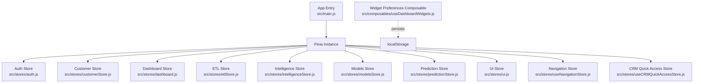

**Diagram sources**
- [main.js:70-75](file://src/main.js#L70-L75)
- [auth.js:3-21](file://src/stores/auth.js#L3-L21)
- [customerStore.js:17-186](file://src/stores/customerStore.js#L17-L186)
- [dashboard.js:5-28](file://src/stores/dashboard.js#L5-L28)
- [etlStore.js:12-95](file://src/stores/etlStore.js#L12-L95)
- [intelligenceStore.js:234-295](file://src/stores/intelligenceStore.js#L234-L295)
- [modelsStore.js:15-53](file://src/stores/modelsStore.js#L15-L53)
- [predictionStore.js:17-170](file://src/stores/predictionStore.js#L17-L170)
- [ui.js:3-21](file://src/stores/ui.js#L3-L21)
- [useNavigationStore.js:4-22](file://src/stores/useNavigationStore.js#L4-L22)
- [useCRMQuickAccessStore.js:4-28](file://src/stores/useCRMQuickAccessStore.js#L4-L28)
- [useDashboardWidgets.js:24-87](file://src/composables/useDashboardWidgets.js#L24-L87)

**Section sources**
- [main.js:70-75](file://src/main.js#L70-L75)
- [package.json:50-62](file://package.json#L50-L62)

## Core Components
- Auth store: Holds token, user role, email; exposes getters and logout action; persists tokens via localStorage.
- Customer store: Manages portfolio summary, customer list, filters, pagination, timeline, features; fetches data from backend; provides computed views like filtered lists and portfolio metrics.
- Dashboard store: Loads available modules for the current owner; manages loading state.
- ETL store: Paginated run history, KPIs, status panel, quality trend; integrates with ETL API service.
- Intelligence store: Aggregates CLV, lifecycle stages, forecasts, outcomes; includes fallback static data when APIs are unavailable.
- Models store: Lists ML models and exposes champion model selections via computed properties.
- Prediction store: Per-customer predictions (churn probability, health score), Markov matrix, churn drivers; supports batch fetching with concurrency control.
- UI store: Toast helpers (placeholder).
- Navigation store: Tracks current module and breadcrumbs.
- CRM quick access store: Placeholder for quick access actions.
- Widget preferences composable: Registers widgets, toggles visibility, persists enabled set to localStorage.

**Section sources**
- [auth.js:3-21](file://src/stores/auth.js#L3-L21)
- [customerStore.js:17-186](file://src/stores/customerStore.js#L17-L186)
- [dashboard.js:5-28](file://src/stores/dashboard.js#L5-L28)
- [etlStore.js:12-95](file://src/stores/etlStore.js#L12-L95)
- [intelligenceStore.js:234-295](file://src/stores/intelligenceStore.js#L234-L295)
- [modelsStore.js:15-53](file://src/stores/modelsStore.js#L15-L53)
- [predictionStore.js:17-170](file://src/stores/predictionStore.js#L17-L170)
- [ui.js:3-21](file://src/stores/ui.js#L3-L21)
- [useNavigationStore.js:4-22](file://src/stores/useNavigationStore.js#L4-L22)
- [useCRMQuickAccessStore.js:4-28](file://src/stores/useCRMQuickAccessStore.js#L4-L28)
- [useDashboardWidgets.js:24-87](file://src/composables/useDashboardWidgets.js#L24-L87)

## Architecture Overview
The system uses Pinia as the central state container. Stores encapsulate state, computed values, and actions that call backend services. Axios interceptors attach Authorization headers and handle token refresh on 401 responses. Some stores use direct fetch calls with manual header injection. Widget preferences are persisted locally via a composable.

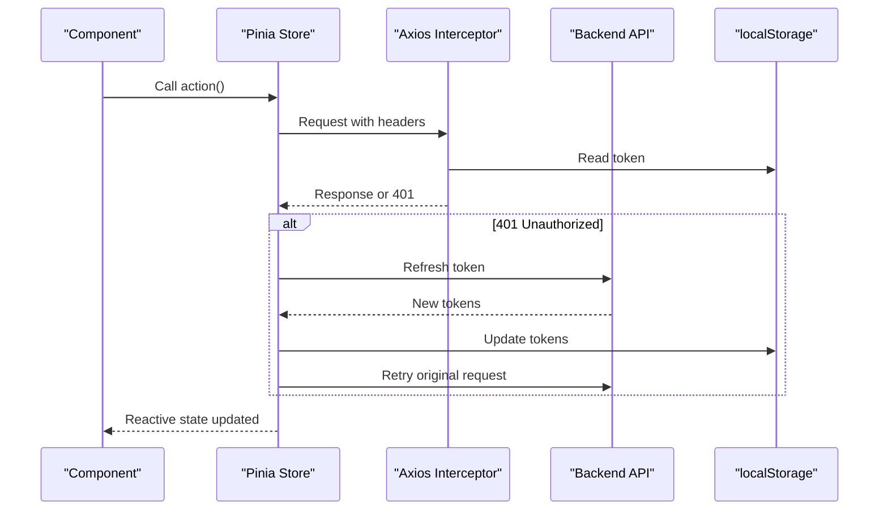

**Diagram sources**
- [api.js:64-146](file://src/services/api.js#L64-L146)
- [auth.js:3-21](file://src/stores/auth.js#L3-L21)
- [customerStore.js:8-12](file://src/stores/customerStore.js#L8-L12)
- [intelligenceStore.js:6-11](file://src/stores/intelligenceStore.js#L6-L11)
- [modelsStore.js:8-12](file://src/stores/modelsStore.js#L8-L12)
- [predictionStore.js:8-12](file://src/stores/predictionStore.js#L8-L12)

## Detailed Component Analysis

### Authentication Store
- State: token, userRole, userEmail initialized from localStorage.
- Getters: isAuthenticated derived from token presence.
- Actions: logout clears stored keys and resets state.
- Integration: Token retrieval and refresh handled centrally in axios interceptors; login/logout functions in api.js manage token persistence.

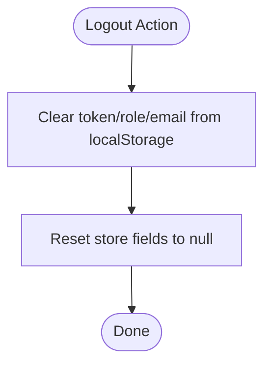

**Diagram sources**
- [auth.js:12-20](file://src/stores/auth.js#L12-L20)
- [api.js:166-208](file://src/services/api.js#L166-L208)

**Section sources**
- [auth.js:3-21](file://src/stores/auth.js#L3-L21)
- [api.js:64-146](file://src/services/api.js#L64-L146)
- [api.js:166-208](file://src/services/api.js#L166-L208)

### Customer Data Store
- State: customers, selectedCustomer, filters, pagination, loading, error, timeline, features, internal portfolio summary.
- Computed: portfolio metrics derived from summary; filteredCustomers applying filters and pagination.
- Actions: fetchPortfolio (parallel requests), fetchCustomerDetail, fetchCustomerTimeline, fetchCustomerFeatures, filter setters.
- Persistence: None directly; relies on API responses.

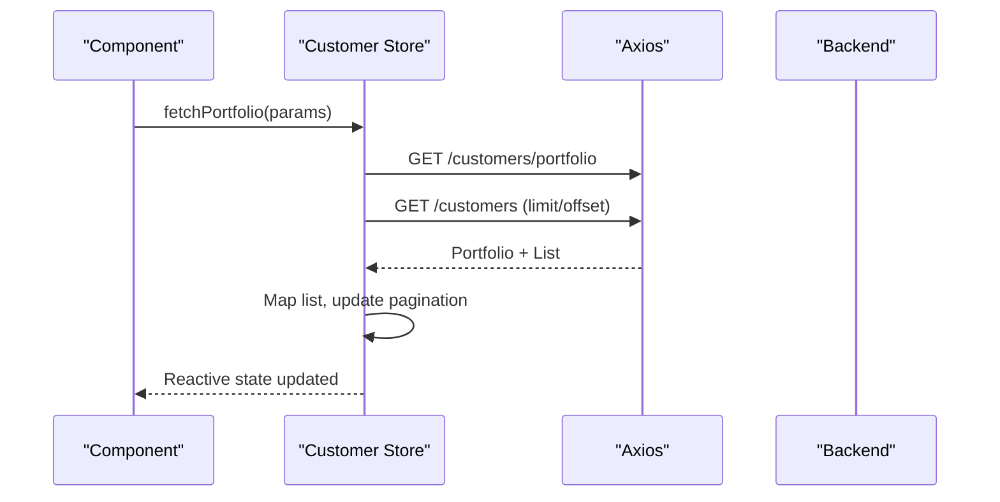

**Diagram sources**
- [customerStore.js:91-114](file://src/stores/customerStore.js#L91-L114)
- [customerStore.js:53-69](file://src/stores/customerStore.js#L53-L69)

**Section sources**
- [customerStore.js:17-186](file://src/stores/customerStore.js#L17-L186)

### Dashboard Modules Store
- State: modules array, loading flag.
- Actions: fetchModules retrieves modules for the current owner with Authorization header.

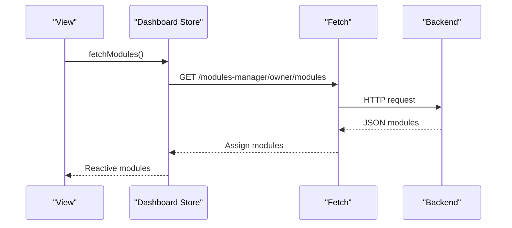

**Diagram sources**
- [dashboard.js:9-25](file://src/stores/dashboard.js#L9-L25)

**Section sources**
- [dashboard.js:5-28](file://src/stores/dashboard.js#L5-L28)

### ETL Pipeline Store
- State: runs, totalRuns, page, limit, statusFilter, kpis, statusPanel, qualityTrend, loading, error.
- Computed: totalPages, isEmpty.
- Actions: loadDashboard delegates to etlApi; setPage/setStatusFilter trigger reload; refresh convenience method.

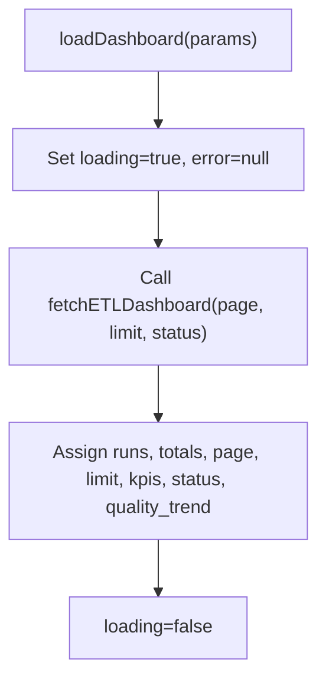

**Diagram sources**
- [etlStore.js:33-57](file://src/stores/etlStore.js#L33-L57)

**Section sources**
- [etlStore.js:12-95](file://src/stores/etlStore.js#L12-L95)

### AI/ML Intelligence Store
- State: clvData, lifecycleData, forecastData, outcomesData, per-feature loading flags, error map.
- Actions: fetchClv, fetchLifecycle, fetchForecast, fetchOutcomes; each falls back to static data if API fails.
- Notes: Uses an axios instance with timeout and Authorization interceptor.

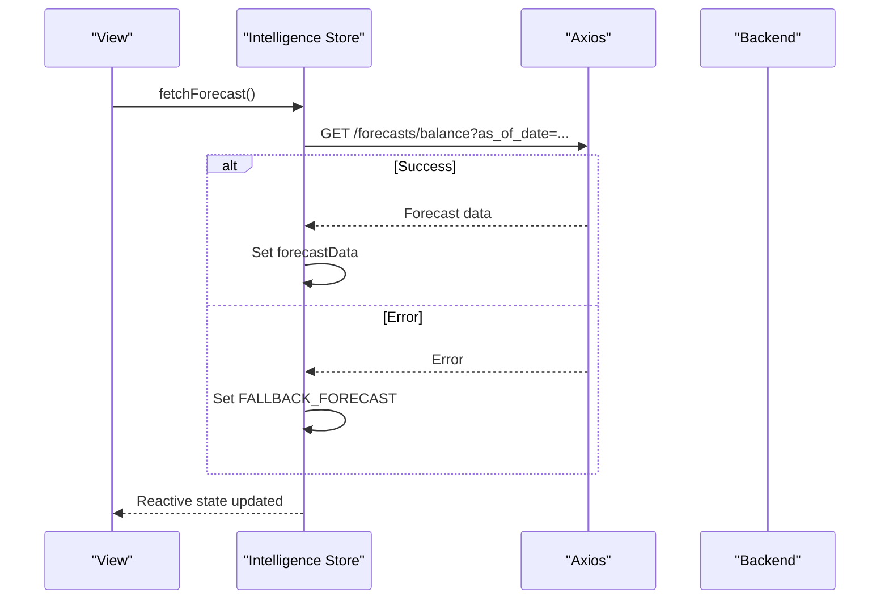

**Diagram sources**
- [intelligenceStore.js:266-276](file://src/stores/intelligenceStore.js#L266-L276)
- [intelligenceStore.js:154-195](file://src/stores/intelligenceStore.js#L154-L195)

**Section sources**
- [intelligenceStore.js:234-295](file://src/stores/intelligenceStore.js#L234-L295)

### Models Store
- State: models array, loading, error.
- Computed: championChurn, championCLV, modelCount.
- Actions: fetchModels maps backend response to normalized shape.

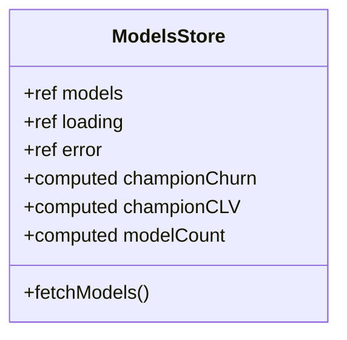

**Diagram sources**
- [modelsStore.js:15-53](file://src/stores/modelsStore.js#L15-L53)

**Section sources**
- [modelsStore.js:15-53](file://src/stores/modelsStore.js#L15-L53)

### Prediction Store
- State: predictions (customerId → object), healthScores (customerId → object), markovMatrix, churnDrivers, loading, error.
- Actions: fetchChurnProbability, fetchHealthScore, fetchPrediction, fetchMarkovMatrix, fetchBatchPredictions (batch size 2), fetchChurnDrivers; convenience getters.
- Notes: Uses axios with Authorization interceptor; default as_of_date parameter.

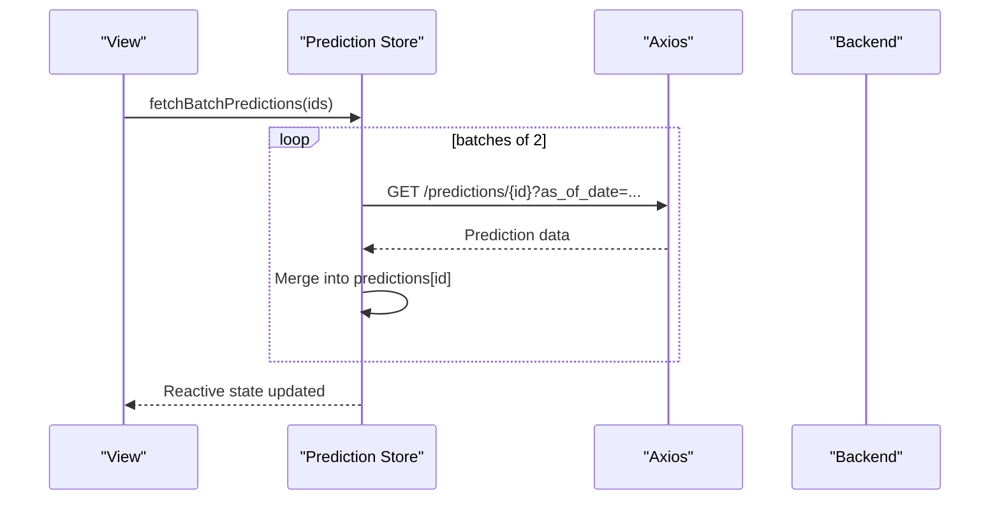

**Diagram sources**
- [predictionStore.js:110-138](file://src/stores/predictionStore.js#L110-L138)
- [predictionStore.js:27-79](file://src/stores/predictionStore.js#L27-L79)

**Section sources**
- [predictionStore.js:17-170](file://src/stores/predictionStore.js#L17-L170)

### UI, Navigation, and CRM Quick Access Stores
- UI store: Toast helper methods (placeholders).
- Navigation store: Tracks currentModule and breadcrumbs.
- CRM quick access store: Placeholder for quick access actions and data.

**Section sources**
- [ui.js:3-21](file://src/stores/ui.js#L3-L21)
- [useNavigationStore.js:4-22](file://src/stores/useNavigationStore.js#L4-L22)
- [useCRMQuickAccessStore.js:4-28](file://src/stores/useCRMQuickAccessStore.js#L4-L28)

### Widget Preferences Composable
- Provides registration, toggling, and persistence of enabled widgets using localStorage.
- Exposes active and all widgets via computed properties.

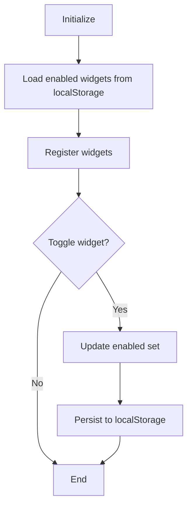

**Diagram sources**
- [useDashboardWidgets.js:8-22](file://src/composables/useDashboardWidgets.js#L8-L22)
- [useDashboardWidgets.js:43-67](file://src/composables/useDashboardWidgets.js#L43-L67)

**Section sources**
- [useDashboardWidgets.js:24-87](file://src/composables/useDashboardWidgets.js#L24-L87)

## Dependency Analysis
Stores depend on:
- Axios instances configured with baseURL and timeouts; some stores create their own instances with request interceptors to inject Authorization headers.
- Centralized axios interceptors in api.js handle 401 flows, token refresh, and queueing.
- LocalStorage is used for token persistence and widget preferences.
- Services layer (e.g., etlApi) abstracts specific endpoints.

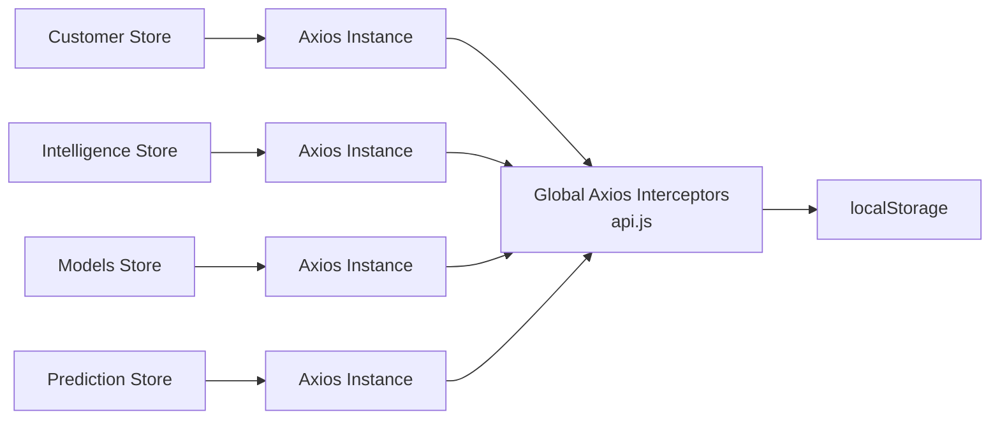

**Diagram sources**
- [customerStore.js:6-12](file://src/stores/customerStore.js#L6-L12)
- [intelligenceStore.js:6-11](file://src/stores/intelligenceStore.js#L6-L11)
- [modelsStore.js:6-12](file://src/stores/modelsStore.js#L6-L12)
- [predictionStore.js:6-12](file://src/stores/predictionStore.js#L6-L12)
- [api.js:64-146](file://src/services/api.js#L64-L146)

**Section sources**
- [api.js:64-146](file://src/services/api.js#L64-L146)
- [customerStore.js:6-12](file://src/stores/customerStore.js#L6-L12)
- [intelligenceStore.js:6-11](file://src/stores/intelligenceStore.js#L6-L11)
- [modelsStore.js:6-12](file://src/stores/modelsStore.js#L6-L12)
- [predictionStore.js:6-12](file://src/stores/predictionStore.js#L6-L12)

## Performance Considerations
- State serialization: Avoid storing large objects in localStorage; prefer lightweight tokens and small preference sets (e.g., widget IDs).
- Memory management: Use refs for arrays/objects; avoid unnecessary deep copies; leverage computed properties to derive data efficiently.
- Efficient reactivity: Keep state minimal; compute derived values; debounce heavy computations if needed.
- Network efficiency: Batch requests where possible (e.g., prediction batch with controlled concurrency); reuse axios instances; rely on global interceptors for auth handling.
- Timeouts: Configure appropriate timeouts per store’s axios instance to prevent hanging requests.

[No sources needed since this section provides general guidance]

## Troubleshooting Guide
Common issues and resolutions:
- 401 Unauthorized: Global axios interceptor attempts token refresh; ensure refresh_token exists; otherwise redirects to login.
- Missing Authorization header: Verify token exists in localStorage; confirm axios interceptors are applied.
- API failures: Stores set error state; check console warnings and network tab; consider fallback data in intelligence store.
- Pagination/filter mismatches: Ensure filters reset pagination to first page; verify computed filtering logic.

**Section sources**
- [api.js:90-146](file://src/services/api.js#L90-L146)
- [customerStore.js:105-113](file://src/stores/customerStore.js#L105-L113)
- [intelligenceStore.js:242-287](file://src/stores/intelligenceStore.js#L242-L287)
- [predictionStore.js:27-96](file://src/stores/predictionStore.js#L27-L96)

## Conclusion
The application adopts a clear, modular Pinia-based state management strategy aligned with Vue 3 Composition API. Stores encapsulate domain-specific state, computed views, and asynchronous actions, while centralized axios interceptors standardize authentication and error handling. Persistence is limited to essential tokens and widget preferences. The design supports scalability through separation of concerns, fallback data for resilience, and efficient reactivity patterns.

[No sources needed since this section summarizes without analyzing specific files]

## Appendices

### Migration Strategy from Vuex to Pinia
- Replace Vuex store initialization with Pinia instance creation and registration in main.js.
- Convert Vuex modules to Pinia stores using defineStore with composition function syntax for ref-based state.
- Migrate mutations/actions to Pinia actions; replace getters with computed properties.
- Remove Vuex imports and usage; ensure router and plugins continue to work without Vuex.
- Validate behavior with existing tests and add Pinia-specific tests using @pinia/testing.

**Section sources**
- [main.js:70-75](file://src/main.js#L70-L75)
- [package.json:66-66](file://package.json#L66-L66)

### Testing State Management Logic
- Use Vitest with jsdom environment and a setup file for Pinia.
- Create isolated test instances of stores using @pinia/testing to assert state changes and async actions.
- Mock axios or fetch calls to simulate success/failure paths and validate error handling.
- For composables like widget preferences, mock localStorage and assert persistence behavior.

**Section sources**
- [vitest.config.js:1-17](file://vitest.config.js#L1-L17)
- [package.json:66-66](file://package.json#L66-L66)

### Debugging State-Related Issues
- Inspect reactive state in browser devtools via Pinia plugin.
- Add logging around actions to trace data flow and errors.
- Check axios interceptors for token refresh and error propagation.
- Validate localStorage contents for tokens and widget preferences.

**Section sources**
- [api.js:64-146](file://src/services/api.js#L64-L146)
- [useDashboardWidgets.js:8-22](file://src/composables/useDashboardWidgets.js#L8-L22)