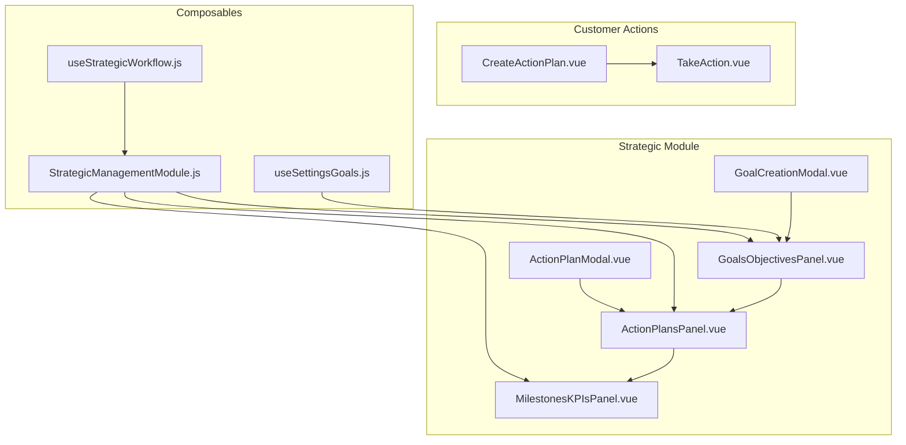
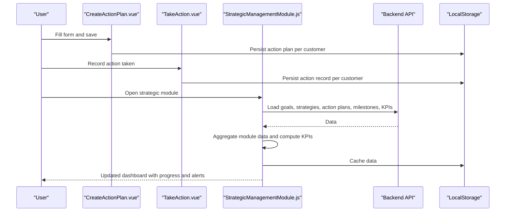
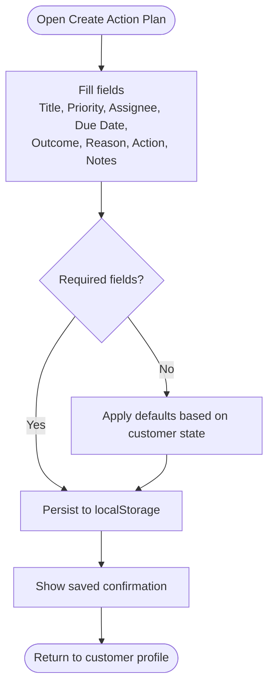
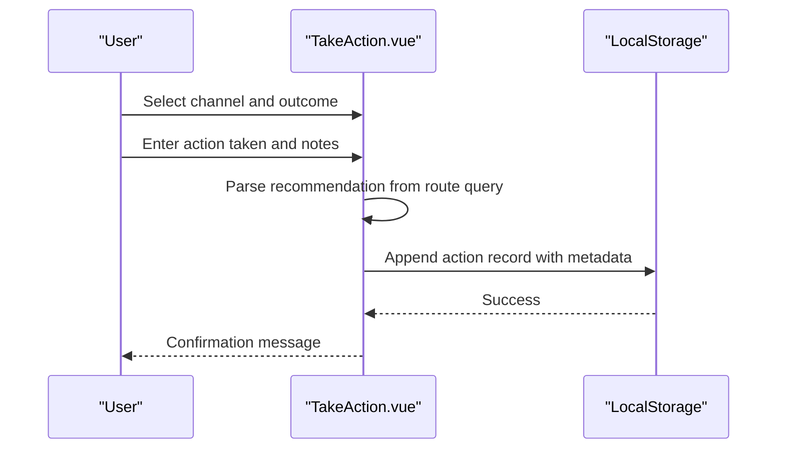
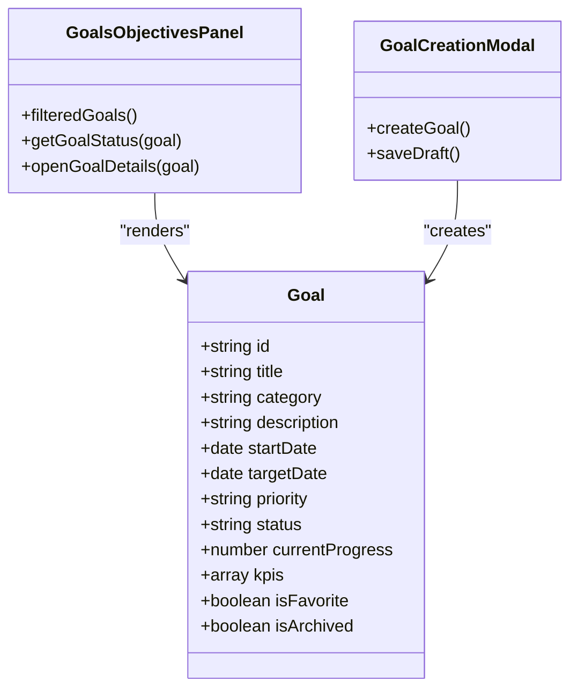
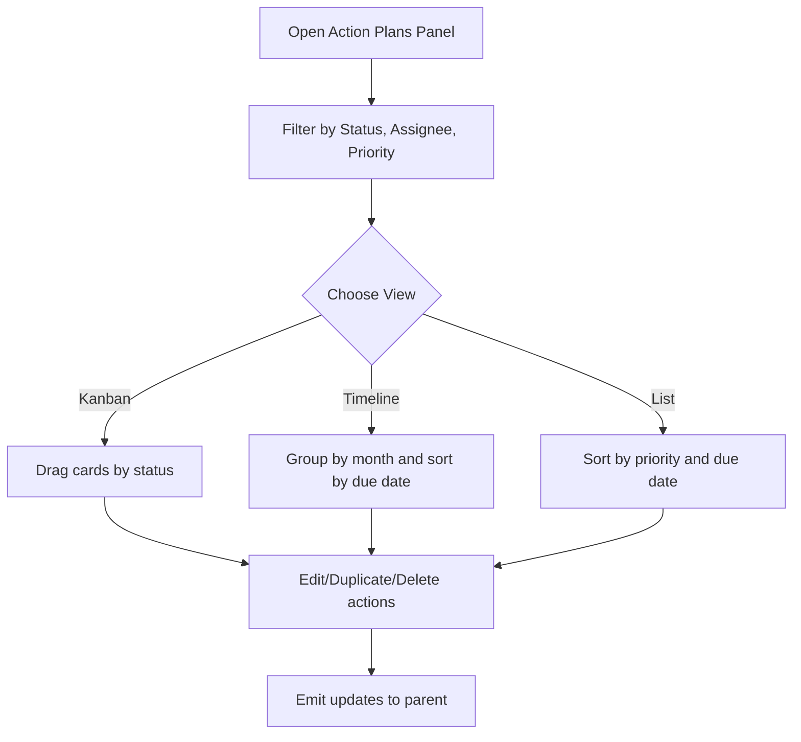
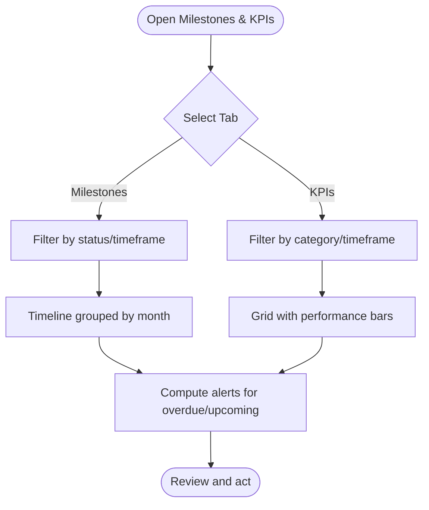
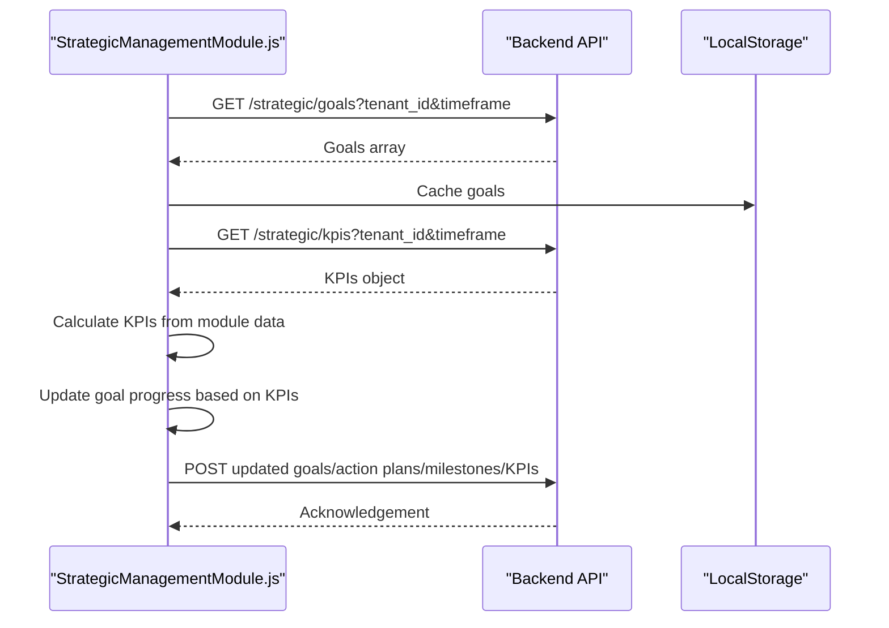
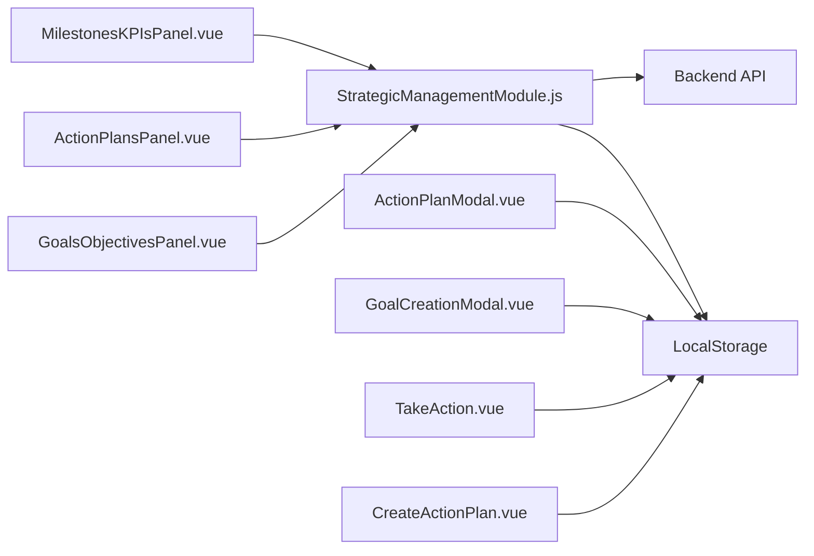

# Action Planning & Execution

<cite>
**Referenced Files in This Document**
- [CreateActionPlan.vue](file://src/views/CreateActionPlan.vue)
- [TakeAction.vue](file://src/views/TakeAction.vue)
- [ActionPlansPanel.vue](file://src/views/Modules/strategic/components/ActionPlansPanel.vue)
- [ActionPlanModal.vue](file://src/views/Modules/strategic/modals/ActionPlanModal.vue)
- [GoalsObjectivesPanel.vue](file://src/views/Modules/strategic/components/GoalsObjectivesPanel.vue)
- [MilestonesKPIsPanel.vue](file://src/views/Modules/strategic/components/MilestonesKPIsPanel.vue)
- [GoalCreationModal.vue](file://src/views/Modules/strategic/modals/GoalCreationModal.vue)
- [StrategicManagementModule.js](file://src/views/Modules/strategic/composables/StrategicManagementModule.js)
- [useSettingsGoals.js](file://src/composables/settings/useSettingsGoals.js)
- [useStrategicWorkflow.js](file://src/composables/useStrategicWorkflow.js)
</cite>

## Table of Contents
1. [Introduction](#introduction)
2. [Project Structure](#project-structure)
3. [Core Components](#core-components)
4. [Architecture Overview](#architecture-overview)
5. [Detailed Component Analysis](#detailed-component-analysis)
6. [Dependency Analysis](#dependency-analysis)
7. [Performance Considerations](#performance-considerations)
8. [Troubleshooting Guide](#troubleshooting-guide)
9. [Conclusion](#conclusion)
10. [Appendices](#appendices)

## Introduction
This document explains the Action Planning and Execution system implemented in the frontend. It covers how strategic goals are broken down into actionable tasks, how resources and timelines are planned, how assignments and progress are tracked, and how milestones and KPIs drive completion verification. It also describes collaboration features, status updates, and integration points with backend services for persistence and data aggregation.

## Project Structure
The action planning capability spans several views, components, modals, and composables:
- Customer-facing action creation and execution flows (CreateActionPlan, TakeAction)
- Strategic module panels for goals, action plans, milestones, and KPIs
- Modals to create goals and action plans
- A composable that orchestrates loading, saving, and aggregating strategic data across modules

**Diagram sources**
- [CreateActionPlan.vue:1-236](file://src/views/CreateActionPlan.vue#L1-L236)
- [TakeAction.vue:1-187](file://src/views/TakeAction.vue#L1-L187)
- [GoalsObjectivesPanel.vue:1-612](file://src/views/Modules/strategic/components/GoalsObjectivesPanel.vue#L1-L612)
- [ActionPlansPanel.vue:1-732](file://src/views/Modules/strategic/components/ActionPlansPanel.vue#L1-L732)
- [MilestonesKPIsPanel.vue:1-800](file://src/views/Modules/strategic/components/MilestonesKPIsPanel.vue#L1-L800)
- [GoalCreationModal.vue:1-420](file://src/views/Modules/strategic/modals/GoalCreationModal.vue#L1-L420)
- [ActionPlanModal.vue:1-453](file://src/views/Modules/strategic/modals/ActionPlanModal.vue#L1-L453)
- [StrategicManagementModule.js:1-800](file://src/views/Modules/strategic/composables/StrategicManagementModule.js#L1-L800)
- [useSettingsGoals.js:1-172](file://src/composables/settings/useSettingsGoals.js#L1-L172)
- [useStrategicWorkflow.js:1-58](file://src/composables/useStrategicWorkflow.js#L1-L58)

**Section sources**
- [CreateActionPlan.vue:1-236](file://src/views/CreateActionPlan.vue#L1-L236)
- [TakeAction.vue:1-187](file://src/views/TakeAction.vue#L1-L187)
- [GoalsObjectivesPanel.vue:1-612](file://src/views/Modules/strategic/components/GoalsObjectivesPanel.vue#L1-L612)
- [ActionPlansPanel.vue:1-732](file://src/views/Modules/strategic/components/ActionPlansPanel.vue#L1-L732)
- [MilestonesKPIsPanel.vue:1-800](file://src/views/Modules/strategic/components/MilestonesKPIsPanel.vue#L1-L800)
- [GoalCreationModal.vue:1-420](file://src/views/Modules/strategic/modals/GoalCreationModal.vue#L1-L420)
- [ActionPlanModal.vue:1-453](file://src/views/Modules/strategic/modals/ActionPlanModal.vue#L1-L453)
- [StrategicManagementModule.js:1-800](file://src/views/Modules/strategic/composables/StrategicManagementModule.js#L1-L800)
- [useSettingsGoals.js:1-172](file://src/composables/settings/useSettingsGoals.js#L1-L172)
- [useStrategicWorkflow.js:1-58](file://src/composables/useStrategicWorkflow.js#L1-L58)

## Core Components
- CreateActionPlan: Captures a customer-specific action plan with title, priority, assignee, due date, outcome, reason, recommended action, and notes; persists locally per customer.
- TakeAction: Records execution of a recommended action with channel, outcome, notes, and links back to the original recommendation.
- GoalsObjectivesPanel: Manages strategic goals with filtering, sorting, favorites, archiving, and progress tracking.
- ActionPlansPanel: Displays action plans in Kanban, timeline, or list views; supports filters by status, assignee, priority; shows progress and overdue counts.
- MilestonesKPIsPanel: Tracks milestones over time and manages KPIs with performance indicators and alerts.
- GoalCreationModal: Creates SMART goals with categories, timelines, priorities, owners, and KPIs.
- ActionPlanModal: Creates action plans linked to strategies, with tasks, subtasks, dependencies, resources, and success metrics.
- StrategicManagementModule: Central orchestration for loading/saving goals, strategies, action plans, milestones, meetings, and KPIs; aggregates cross-module data to compute KPIs and update goal progress.
- useSettingsGoals: Settings-backed goal management with AI insights generation and CRUD operations via API.
- useStrategicWorkflow: Runs and persists strategic workflow results and saved overview.

**Section sources**
- [CreateActionPlan.vue:100-181](file://src/views/CreateActionPlan.vue#L100-L181)
- [TakeAction.vue:78-132](file://src/views/TakeAction.vue#L78-L132)
- [GoalsObjectivesPanel.vue:332-574](file://src/views/Modules/strategic/components/GoalsObjectivesPanel.vue#L332-L574)
- [ActionPlansPanel.vue:419-691](file://src/views/Modules/strategic/components/ActionPlansPanel.vue#L419-L691)
- [MilestonesKPIsPanel.vue:522-800](file://src/views/Modules/strategic/components/MilestonesKPIsPanel.vue#L522-L800)
- [GoalCreationModal.vue:320-397](file://src/views/Modules/strategic/modals/GoalCreationModal.vue#L320-L397)
- [ActionPlanModal.vue:325-430](file://src/views/Modules/strategic/modals/ActionPlanModal.vue#L325-L430)
- [StrategicManagementModule.js:127-343](file://src/views/Modules/strategic/composables/StrategicManagementModule.js#L127-L343)
- [useSettingsGoals.js:57-116](file://src/composables/settings/useSettingsGoals.js#L57-L116)
- [useStrategicWorkflow.js:24-57](file://src/composables/useStrategicWorkflow.js#L24-L57)

## Architecture Overview
The system follows a layered approach:
- UI layer: Views and components render forms, lists, and dashboards.
- Composables: Encapsulate business logic for data fetching, caching, and state management.
- Persistence: LocalStorage for offline/pilot mode; REST APIs for online persistence and aggregation.
- Aggregation: Cross-module data is combined to compute KPIs and update goal progress automatically.

**Diagram sources**
- [CreateActionPlan.vue:150-181](file://src/views/CreateActionPlan.vue#L150-L181)
- [TakeAction.vue:115-132](file://src/views/TakeAction.vue#L115-L132)
- [StrategicManagementModule.js:127-343](file://src/views/Modules/strategic/composables/StrategicManagementModule.js#L127-L343)

## Detailed Component Analysis

### Action Plan Creation Flow
- Inputs: Title, priority, assignee, due date, expected outcome, reason, recommended action, notes.
- Behavior: Defaults are applied based on customer lifecycle state; data is stored locally per customer.
- Integration: Uses customer and prediction stores to enrich context (health score, churn probability).

**Diagram sources**
- [CreateActionPlan.vue:31-95](file://src/views/CreateActionPlan.vue#L31-L95)
- [CreateActionPlan.vue:130-171](file://src/views/CreateActionPlan.vue#L130-L171)

**Section sources**
- [CreateActionPlan.vue:31-95](file://src/views/CreateActionPlan.vue#L31-L95)
- [CreateActionPlan.vue:100-181](file://src/views/CreateActionPlan.vue#L100-L181)

### Action Execution Flow
- Inputs: Channel, outcome, action taken, notes.
- Behavior: Records action against the customer and links to the original recommendation passed via route query.
- Persistence: Stored locally per customer.

**Diagram sources**
- [TakeAction.vue:32-74](file://src/views/TakeAction.vue#L32-L74)
- [TakeAction.vue:91-127](file://src/views/TakeAction.vue#L91-L127)

**Section sources**
- [TakeAction.vue:32-74](file://src/views/TakeAction.vue#L32-L74)
- [TakeAction.vue:78-132](file://src/views/TakeAction.vue#L78-L132)

### Strategic Goals Management
- Features: Create SMART goals, set category, timeline, priority, owner, and KPIs; filter by status/timeframe; favorite/archive; duplicate/delete.
- Progress: Calculated from linked KPIs; visualized with progress bars and status badges.

**Diagram sources**
- [GoalsObjectivesPanel.vue:332-574](file://src/views/Modules/strategic/components/GoalsObjectivesPanel.vue#L332-L574)
- [GoalCreationModal.vue:320-397](file://src/views/Modules/strategic/modals/GoalCreationModal.vue#L320-L397)

**Section sources**
- [GoalsObjectivesPanel.vue:1-612](file://src/views/Modules/strategic/components/GoalsObjectivesPanel.vue#L1-L612)
- [GoalCreationModal.vue:1-420](file://src/views/Modules/strategic/modals/GoalCreationModal.vue#L1-L420)

### Action Plans Panel and Modal
- Views: Kanban, timeline, list; filters by status, assignee, priority; analytics summary (total, in-progress, average progress, overdue).
- Task breakdown: Add tasks with assignee, priority, status, due date; add subtasks; mark subtasks complete; manage dependencies and resources; define success metrics.

**Diagram sources**
- [ActionPlansPanel.vue:16-90](file://src/views/Modules/strategic/components/ActionPlansPanel.vue#L16-L90)
- [ActionPlansPanel.vue:464-500](file://src/views/Modules/strategic/components/ActionPlansPanel.vue#L464-L500)
- [ActionPlansPanel.vue:528-646](file://src/views/Modules/strategic/components/ActionPlansPanel.vue#L528-L646)

**Section sources**
- [ActionPlansPanel.vue:1-732](file://src/views/Modules/strategic/components/ActionPlansPanel.vue#L1-L732)
- [ActionPlanModal.vue:1-453](file://src/views/Modules/strategic/modals/ActionPlanModal.vue#L1-L453)

### Milestones and KPIs
- Milestones: Timeline view grouped by month; filters for upcoming, completed, overdue, this month; status computation based on target dates and completion flags.
- KPIs: Category-based grid; performance percentage vs target; trend indicators; refresh capability; alert tab surfaces critical/warning conditions.

**Diagram sources**
- [MilestonesKPIsPanel.vue:27-52](file://src/views/Modules/strategic/components/MilestonesKPIsPanel.vue#L27-L52)
- [MilestonesKPIsPanel.vue:585-616](file://src/views/Modules/strategic/components/MilestonesKPIsPanel.vue#L585-L616)
- [MilestonesKPIsPanel.vue:618-636](file://src/views/Modules/strategic/components/MilestonesKPIsPanel.vue#L618-L636)

**Section sources**
- [MilestonesKPIsPanel.vue:1-800](file://src/views/Modules/strategic/components/MilestonesKPIsPanel.vue#L1-L800)

### Orchestration and Data Aggregation
- Loads vision/mission, goals, strategies, action plans, milestones, meetings, and KPIs; caches in LocalStorage; falls back to cache when offline.
- Aggregates module data (POS, inventory, CRM, expenses, payroll) to compute KPIs and update goal progress automatically.
- Persists changes to backend when online; otherwise persists locally.

**Diagram sources**
- [StrategicManagementModule.js:127-343](file://src/views/Modules/strategic/composables/StrategicManagementModule.js#L127-L343)
- [StrategicManagementModule.js:450-473](file://src/views/Modules/strategic/composables/StrategicManagementModule.js#L450-L473)
- [StrategicManagementModule.js:539-667](file://src/views/Modules/strategic/composables/StrategicManagementModule.js#L539-L667)

**Section sources**
- [StrategicManagementModule.js:127-343](file://src/views/Modules/strategic/composables/StrategicManagementModule.js#L127-L343)
- [StrategicManagementModule.js:450-473](file://src/views/Modules/strategic/composables/StrategicManagementModule.js#L450-L473)
- [StrategicManagementModule.js:539-667](file://src/views/Modules/strategic/composables/StrategicManagementModule.js#L539-L667)

### Settings Goals and AI Insights
- Provides default company goals and CRUD operations via API.
- Supports generating AI insights per goal and toggling AI features.
- Offers recommendations based on goal category.

**Section sources**
- [useSettingsGoals.js:8-27](file://src/composables/settings/useSettingsGoals.js#L8-L27)
- [useSettingsGoals.js:57-116](file://src/composables/settings/useSettingsGoals.js#L57-L116)
- [useSettingsGoals.js:118-130](file://src/composables/settings/useSettingsGoals.js#L118-L130)

### Strategic Workflow
- Fetches saved overview and runs strategic workflow; persists result in LocalStorage for resilience.

**Section sources**
- [useStrategicWorkflow.js:24-57](file://src/composables/useStrategicWorkflow.js#L24-L57)

## Dependency Analysis
- Coupling:
  - Views depend on composables for data loading and persistence.
  - Panels emit events to parent components for updates; modals emit creation events.
  - StrategicManagementModule centralizes cross-module dependencies and computes derived state (goal progress, alerts).
- External integrations:
  - REST endpoints for goals, strategies, action plans, milestones, meetings, KPIs, and workflow execution.
  - JWT decoding for tenant/user context.
- Potential circular dependencies: None observed; composables are consumed by views without importing them back.

**Diagram sources**
- [CreateActionPlan.vue:150-181](file://src/views/CreateActionPlan.vue#L150-L181)
- [TakeAction.vue:115-132](file://src/views/TakeAction.vue#L115-L132)
- [StrategicManagementModule.js:127-343](file://src/views/Modules/strategic/composables/StrategicManagementModule.js#L127-L343)

**Section sources**
- [StrategicManagementModule.js:127-343](file://src/views/Modules/strategic/composables/StrategicManagementModule.js#L127-L343)

## Performance Considerations
- Caching: LocalStorage used for offline resilience; reduces network calls and improves perceived performance.
- Filtering and Sorting: Client-side computations for filtered lists and timeline grouping; ensure datasets remain manageable.
- Aggregation: KPI calculation and goal progress updates run once per load; avoid redundant recomputation by leveraging computed properties.
- Network Calls: Batched loading via Promise.all; graceful fallback to cached data when offline.

[No sources needed since this section provides general guidance]

## Troubleshooting Guide
- Missing data on load:
  - Check if API responses return valid data; verify tenant_id and timeframe parameters.
  - Ensure LocalStorage keys match expected names; clear stale cache if necessary.
- Goal progress not updating:
  - Verify related KPIs exist and have target values; check updateGoalProgress logic.
- Alerts not appearing:
  - Confirm thresholds for performance alerts and deadline checks are met; review computed alerts.
- Action plan/task edits not persisting:
  - Confirm emits are handled by parent components; verify save methods call both LocalStorage and API when online.

**Section sources**
- [StrategicManagementModule.js:127-343](file://src/views/Modules/strategic/composables/StrategicManagementModule.js#L127-L343)
- [StrategicManagementModule.js:450-473](file://src/views/Modules/strategic/composables/StrategicManagementModule.js#L450-L473)
- [MilestonesKPIsPanel.vue:618-636](file://src/views/Modules/strategic/components/MilestonesKPIsPanel.vue#L618-L636)

## Conclusion
The Action Planning and Execution system integrates customer-centric action creation with strategic goal management, milestone tracking, and KPI-driven progress evaluation. It supports multiple views and workflows, robust offline capabilities, and automated aggregation to keep goals aligned with operational metrics. Future enhancements can include deeper dependency resolution between tasks, workload balancing algorithms, calendar and project management integrations, and automated notifications for action item owners.

[No sources needed since this section summarizes without analyzing specific files]

## Appendices

### Practical Examples
- Breaking down strategic objectives:
  - Define a SMART goal with category, timeline, priority, owner, and KPIs using GoalCreationModal.
  - Link related KPIs so goal progress auto-updates based on performance.
- Assigning responsibilities:
  - In ActionPlanModal, add tasks with assignees, priorities, statuses, due dates, and subtasks.
  - Use ActionPlansPanel filters to focus on specific assignees or priorities.
- Tracking deliverables:
  - Monitor milestones in MilestonesKPIsPanel; mark milestones complete as work progresses.
  - Review KPI performance and alerts to validate outcomes.

[No sources needed since this section provides general guidance]