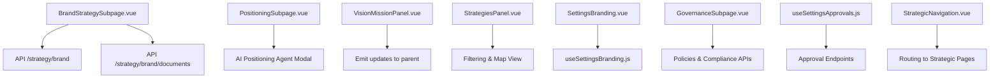
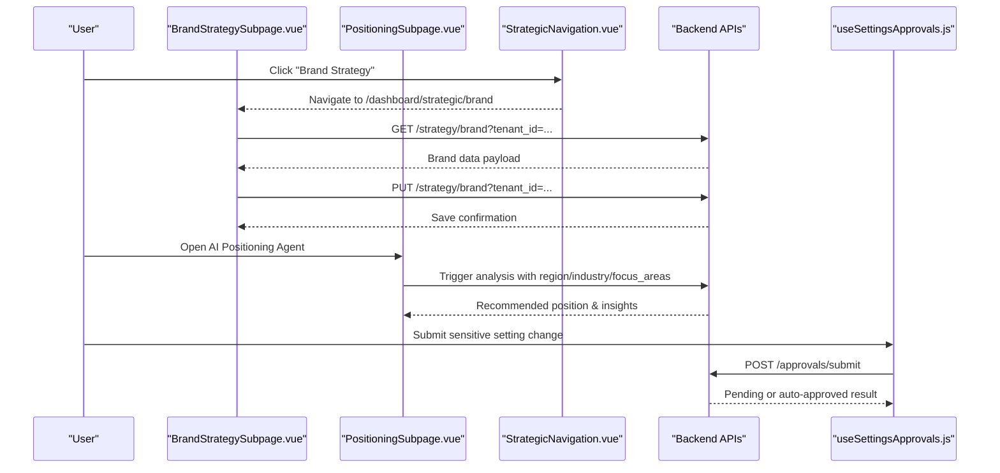
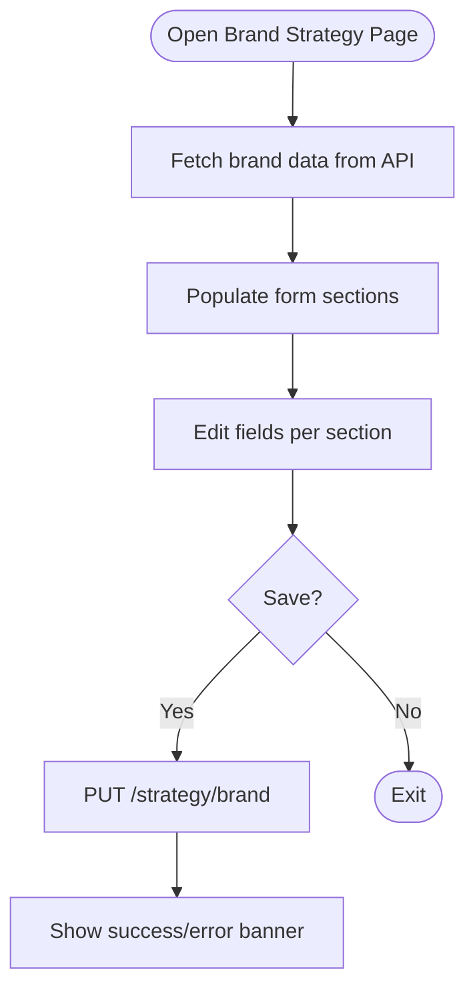
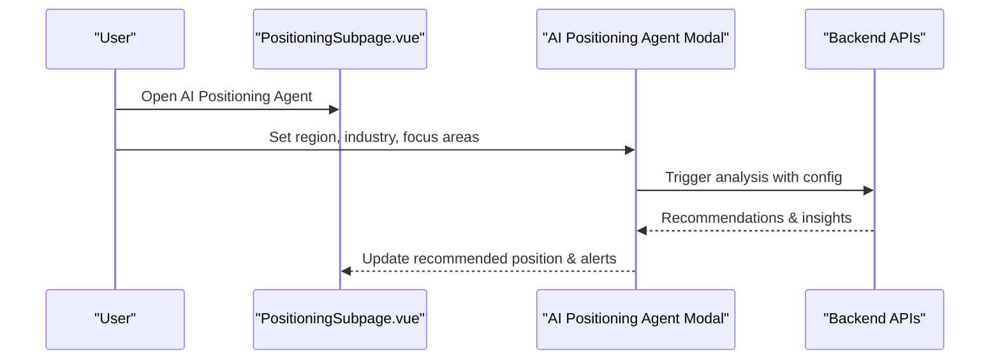
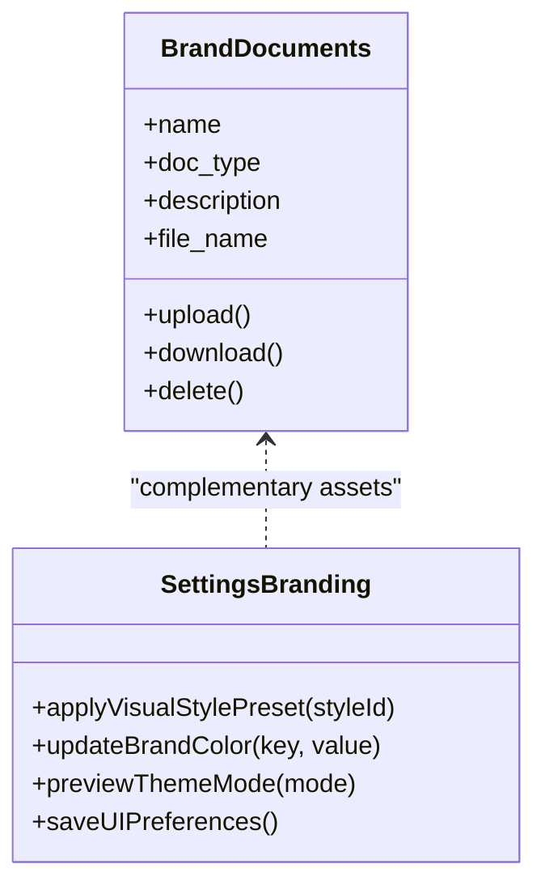
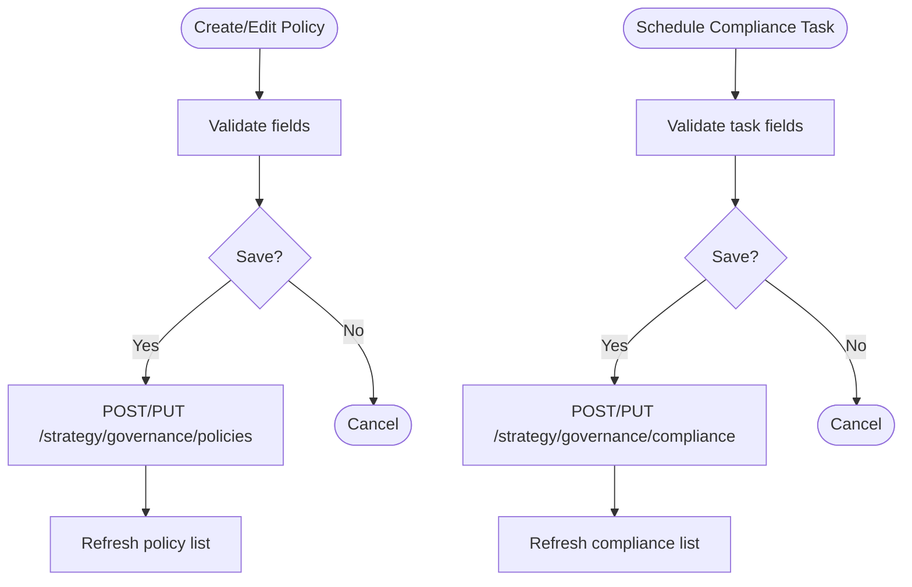
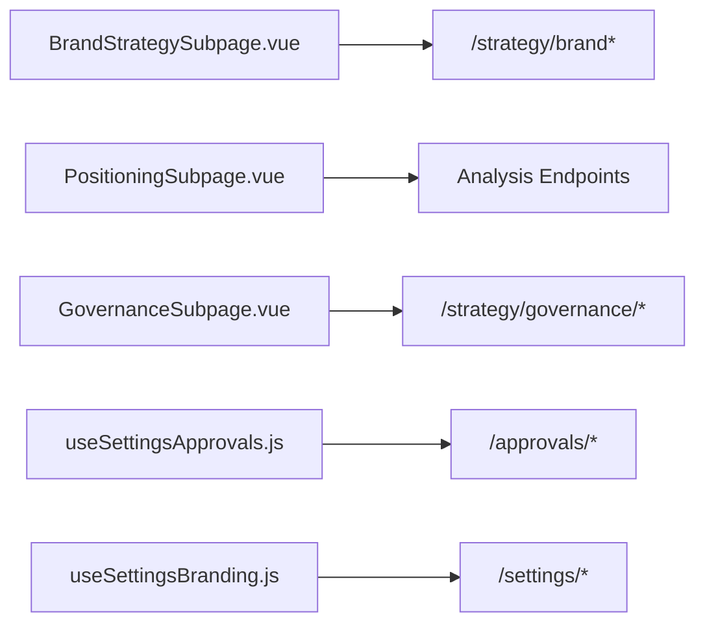

# Brand Strategy & Positioning

<cite>
**Referenced Files in This Document**
- [BrandStrategySubpage.vue](file://src/views/Modules/strategic/BrandStrategySubpage.vue)
- [PositioningSubpage.vue](file://src/views/Modules/strategic/PositioningSubpage.vue)
- [VisionMissionPanel.vue](file://src/views/Modules/strategic/components/VisionMissionPanel.vue)
- [StrategiesPanel.vue](file://src/views/Modules/strategic/components/StrategiesPanel.vue)
- [SettingsBranding.vue](file://src/views/Modules/settings/components/SettingsBranding.vue)
- [useSettingsBranding.js](file://src/composables/settings/useSettingsBranding.js)
- [GovernanceSubpage.vue](file://src/views/Modules/strategic/GovernanceSubpage.vue)
- [useSettingsApprovals.js](file://src/composables/settings/useSettingsApprovals.js)
- [StrategicNavigation.vue](file://src/views/Modules/strategic/components/StrategicNavigation.vue)
</cite>

## Table of Contents
1. [Introduction](#introduction)
2. [Project Structure](#project-structure)
3. [Core Components](#core-components)
4. [Architecture Overview](#architecture-overview)
5. [Detailed Component Analysis](#detailed-component-analysis)
6. [Dependency Analysis](#dependency-analysis)
7. [Performance Considerations](#performance-considerations)
8. [Troubleshooting Guide](#troubleshooting-guide)
9. [Conclusion](#conclusion)
10. [Appendices](#appendices)

## Introduction
This document explains the Brand Strategy and Positioning system implemented in the frontend application. It covers brand identity management (vision, mission, values), positioning strategy formulation, brand health monitoring signals, messaging framework support, brand asset management, style guide enforcement, multi-channel consistency considerations, governance workflows, approval processes, and compliance monitoring across organizational touchpoints. The goal is to provide a comprehensive, accessible guide for both technical and non-technical stakeholders.

## Project Structure
The Brand Strategy and Positioning features are organized under the Strategic module with dedicated subpages and reusable components:
- Brand Strategy Subpage: captures foundational brand data, architecture, personality, identity, menu, target market, and analysis including SWOT and equity indicators.
- Positioning Subpage: provides Porter-style matrix selection, scope analysis, renewal alerts, and dynamic capabilities insights.
- Vision & Mission Panel: editable component for vision and mission statements with guidelines.
- Strategies Panel: manages strategic plans with filtering, map view, and analytics.
- Settings Branding: UI preferences and brand color/style configuration.
- Governance Subpage: policies, compliance tasks, and organizational structure views.
- Approval Composable: multi-level approval workflow for sensitive changes.
- Strategic Navigation: shared navigation across strategic pages.

**Diagram sources**
- [BrandStrategySubpage.vue:562-596](file://src/views/Modules/strategic/BrandStrategySubpage.vue#L562-L596)
- [PositioningSubpage.vue:662-800](file://src/views/Modules/strategic/PositioningSubpage.vue#L662-L800)
- [VisionMissionPanel.vue:172-267](file://src/views/Modules/strategic/components/VisionMissionPanel.vue#L172-L267)
- [StrategiesPanel.vue:305-391](file://src/views/Modules/strategic/components/StrategiesPanel.vue#L305-L391)
- [SettingsBranding.vue:1-53](file://src/views/Modules/settings/components/SettingsBranding.vue#L1-L53)
- [useSettingsBranding.js:1-119](file://src/composables/settings/useSettingsBranding.js#L1-L119)
- [GovernanceSubpage.vue:424-533](file://src/views/Modules/strategic/GovernanceSubpage.vue#L424-L533)
- [useSettingsApprovals.js:142-257](file://src/composables/settings/useSettingsApprovals.js#L142-L257)
- [StrategicNavigation.vue:44-77](file://src/views/Modules/strategic/components/StrategicNavigation.vue#L44-L77)

**Section sources**
- [BrandStrategySubpage.vue:1-701](file://src/views/Modules/strategic/BrandStrategySubpage.vue#L1-L701)
- [PositioningSubpage.vue:1-800](file://src/views/Modules/strategic/PositioningSubpage.vue#L1-L800)
- [VisionMissionPanel.vue:1-292](file://src/views/Modules/strategic/components/VisionMissionPanel.vue#L1-L292)
- [StrategiesPanel.vue:1-584](file://src/views/Modules/strategic/components/StrategiesPanel.vue#L1-L584)
- [SettingsBranding.vue:1-53](file://src/views/Modules/settings/components/SettingsBranding.vue#L1-L53)
- [useSettingsBranding.js:1-119](file://src/composables/settings/useSettingsBranding.js#L1-L119)
- [GovernanceSubpage.vue:1-586](file://src/views/Modules/strategic/GovernanceSubpage.vue#L1-L586)
- [useSettingsApprovals.js:1-303](file://src/composables/settings/useSettingsApprovals.js#L1-L303)
- [StrategicNavigation.vue:1-79](file://src/views/Modules/strategic/components/StrategicNavigation.vue#L1-L79)

## Core Components
- Brand Strategy Subpage: Centralized form capturing brand foundation, problem statement, architecture, product strategy, personality, identity, menu, target market, and analysis (SWOT, competitive landscape, market positioning, brand equity score). Includes document upload/download/delete for brand guides and marketing materials.
- Positioning Subpage: Interactive Porter generic strategy matrix; recommended position display; AI agent modal to configure region, industry, and focus areas; scope analysis with expansion opportunities and risks; renewal alerts; 3P dynamic capabilities framework (Perceive, Pivot, Perform).
- Vision & Mission Panel: Editable panel with inline editing, guidelines, and change emission to parent for persistence.
- Strategies Panel: List and map views for strategies with filters by status and category, progress tracking, export, archive, favorite toggles, and summary metrics.
- Settings Branding: Placeholder branding settings card; underlying composable supports visual style presets, brand colors, typography, theme mode, and saving preferences.
- Governance Subpage: Company structure visualization, policy repository, compliance tasks (ZRA), customizable fields, and CRUD operations via API endpoints.
- Approval Workflow: Multi-level approvals for sensitive settings changes, including submission, decision, withdrawal, and pending request management.

**Section sources**
- [BrandStrategySubpage.vue:62-465](file://src/views/Modules/strategic/BrandStrategySubpage.vue#L62-L465)
- [PositioningSubpage.vue:91-658](file://src/views/Modules/strategic/PositioningSubpage.vue#L91-L658)
- [VisionMissionPanel.vue:17-169](file://src/views/Modules/strategic/components/VisionMissionPanel.vue#L17-L169)
- [StrategiesPanel.vue:16-302](file://src/views/Modules/strategic/components/StrategiesPanel.vue#L16-L302)
- [SettingsBranding.vue:1-53](file://src/views/Modules/settings/components/SettingsBranding.vue#L1-L53)
- [useSettingsBranding.js:27-111](file://src/composables/settings/useSettingsBranding.js#L27-L111)
- [GovernanceSubpage.vue:53-254](file://src/views/Modules/strategic/GovernanceSubpage.vue#L53-L254)
- [useSettingsApprovals.js:19-303](file://src/composables/settings/useSettingsApprovals.js#L19-L303)

## Architecture Overview
The system integrates user-facing forms and dashboards with backend APIs for brand data, documents, governance, and approvals. The Positioning Subpage includes an AI agent modal that configures analysis parameters and triggers recommendations. The Settings Branding flow uses a composable to manage UI preferences and brand tokens, applying them live and persisting changes.

**Diagram sources**
- [StrategicNavigation.vue:44-77](file://src/views/Modules/strategic/components/StrategicNavigation.vue#L44-L77)
- [BrandStrategySubpage.vue:562-596](file://src/views/Modules/strategic/BrandStrategySubpage.vue#L562-L596)
- [PositioningSubpage.vue:662-800](file://src/views/Modules/strategic/PositioningSubpage.vue#L662-L800)
- [useSettingsApprovals.js:142-257](file://src/composables/settings/useSettingsApprovals.js#L142-L257)

## Detailed Component Analysis

### Brand Identity Management
- Vision and Mission: Editable panel with inline editing, guidelines, and emits updates to parent for persistence. Supports last-updated timestamps and formatted dates.
- Brand Foundation: Captures mission, vision, core values, brand promise, story, tagline.
- Brand Architecture: Type, parent brand, sub-brands, hierarchy, relationships.
- Product Strategy: Product lines, pricing, distribution channels, competitive advantage, lifecycle.
- Brand Personality: Traits, tone of voice, communication style, archetypes, emotional attributes.
- Brand Identity: Logo description, color palette, typography, visual style, imagery guidelines.
- Brand Menu: Products/services, flagship offerings, service categories, pricing tiers, bundles.
- Target Market: Primary audience, demographics, psychographics, geographic focus, market size, personas.
- Brand Data & Analysis: SWOT strengths/weaknesses/opportunities/threats, competitive landscape, market positioning, brand equity score, website URL, social media links.
- Documents: Upload, download, delete brand guides and marketing materials with type classification.

**Diagram sources**
- [BrandStrategySubpage.vue:562-596](file://src/views/Modules/strategic/BrandStrategySubpage.vue#L562-L596)
- [BrandStrategySubpage.vue:62-465](file://src/views/Modules/strategic/BrandStrategySubpage.vue#L62-L465)

**Section sources**
- [VisionMissionPanel.vue:17-169](file://src/views/Modules/strategic/components/VisionMissionPanel.vue#L17-L169)
- [BrandStrategySubpage.vue:62-465](file://src/views/Modules/strategic/BrandStrategySubpage.vue#L62-L465)

### Positioning Strategy Formulation
- Competitive Posture Matrix: Select among Cost Leadership, Differentiation, Cost Focus, Differentiation Focus with efficiency/uniqueness metrics.
- Scope Analysis: Current scope vector, expansion opportunities with ROI, risk vectors with severity.
- Renewal Alerts: Detected triggers and recommended actions with urgency levels.
- 3P Dynamic Capabilities: Perceive (sensing signals), Pivot (adaptation recommendations), Perform (execution KPIs).
- AI Positioning Agent: Configure region, industry, focus areas; trigger analysis and receive insights.

**Diagram sources**
- [PositioningSubpage.vue:91-658](file://src/views/Modules/strategic/PositioningSubpage.vue#L91-L658)
- [PositioningSubpage.vue:662-800](file://src/views/Modules/strategic/PositioningSubpage.vue#L662-L800)

**Section sources**
- [PositioningSubpage.vue:91-658](file://src/views/Modules/strategic/PositioningSubpage.vue#L91-L658)
- [PositioningSubpage.vue:662-800](file://src/views/Modules/strategic/PositioningSubpage.vue#L662-L800)

### Messaging Framework Support
- Brand Personality and Identity sections define tone of voice, communication style, and visual guidelines which inform messaging frameworks.
- Brand Menu and Product Strategy sections outline offerings and pricing tiers that shape messaging hierarchies.
- While explicit messaging templates are not present, these structured inputs enable consistent brand voice and communication alignment across channels.

**Section sources**
- [BrandStrategySubpage.vue:208-322](file://src/views/Modules/strategic/BrandStrategySubpage.vue#L208-L322)

### Brand Asset Management and Style Guide Enforcement
- Brand Documents: Upload brand guides, strategy docs, marketing materials; categorize by type; download and delete assets.
- Settings Branding: Visual style presets, brand colors, typography, theme modes; apply live previews and save preferences via composable.
- Multi-channel Consistency: Centralized brand identity and personality definitions ensure consistent messaging across channels; document repository centralizes style guides.

**Diagram sources**
- [BrandStrategySubpage.vue:420-669](file://src/views/Modules/strategic/BrandStrategySubpage.vue#L420-L669)
- [useSettingsBranding.js:72-111](file://src/composables/settings/useSettingsBranding.js#L72-L111)

**Section sources**
- [BrandStrategySubpage.vue:420-669](file://src/views/Modules/strategic/BrandStrategySubpage.vue#L420-L669)
- [SettingsBranding.vue:1-53](file://src/views/Modules/settings/components/SettingsBranding.vue#L1-L53)
- [useSettingsBranding.js:1-119](file://src/composables/settings/useSettingsBranding.js#L1-L119)

### Brand Health Monitoring and Equity Measurement
- Brand Equity Score: Input field for quantitative equity measurement within brand analysis.
- Competitive Landscape & Market Positioning: Structured fields to capture external positioning context.
- SWOT Analysis: Strengths, weaknesses, opportunities, threats to monitor brand health drivers.
- Positioning Insights: AI-driven recommendations and renewal alerts indicate shifts requiring attention.

**Section sources**
- [BrandStrategySubpage.vue:362-417](file://src/views/Modules/strategic/BrandStrategySubpage.vue#L362-L417)
- [PositioningSubpage.vue:400-490](file://src/views/Modules/strategic/PositioningSubpage.vue#L400-L490)

### Practical Examples
- Developing Brand Positioning Statements: Use Problem Statement and Unique Value Proposition fields to articulate clear positioning; align with Competitive Advantage and Market Positioning.
- Creating Messaging Hierarchies: Leverage Brand Menu and Product Strategy to structure messages by offerings and tiers; use Brand Personality for tone and style.
- Measuring Brand Equity: Record Brand Equity Score and update periodically; correlate with SWOT and competitive landscape changes.

**Section sources**
- [BrandStrategySubpage.vue:100-206](file://src/views/Modules/strategic/BrandStrategySubpage.vue#L100-L206)
- [BrandStrategySubpage.vue:290-359](file://src/views/Modules/strategic/BrandStrategySubpage.vue#L290-L359)
- [BrandStrategySubpage.vue:362-417](file://src/views/Modules/strategic/BrandStrategySubpage.vue#L362-L417)

### Governance Workflows, Approval Processes, and Compliance Monitoring
- Policies Repository: Create, edit, delete policies with status and category; track last reviewed dates.
- Compliance Tasks: Schedule obligations with due dates, priority, and status; integrate with ZRA submission status.
- Organizational Structure: View employees grouped by department; normalize department labels for consistency.
- Approval Workflow: Submit sensitive changes for approval; approvers decide; requester can withdraw; tracks pending requests.

**Diagram sources**
- [GovernanceSubpage.vue:483-533](file://src/views/Modules/strategic/GovernanceSubpage.vue#L483-L533)
- [GovernanceSubpage.vue:424-481](file://src/views/Modules/strategic/GovernanceSubpage.vue#L424-L481)

**Section sources**
- [GovernanceSubpage.vue:139-254](file://src/views/Modules/strategic/GovernanceSubpage.vue#L139-L254)
- [GovernanceSubpage.vue:424-533](file://src/views/Modules/strategic/GovernanceSubpage.vue#L424-L533)
- [useSettingsApprovals.js:142-257](file://src/composables/settings/useSettingsApprovals.js#L142-L257)

## Dependency Analysis
- BrandStrategySubpage depends on API endpoints for brand data and documents; uses JWT decoding for tenant context.
- PositioningSubpage integrates AI agent modal and displays dynamic insights; relies on backend analysis endpoints.
- VisionMissionPanel emits updates to parent components; no direct API calls in this component.
- StrategiesPanel handles local state for filtering and map view; emits events for CRUD operations.
- SettingsBranding composable coordinates UI preferences and brand tokens; applies styles live and persists changes.
- GovernanceSubpage interacts with policies and compliance APIs; normalizes employee data for display.
- Approval composable manages multi-level approvals with token-based authentication.

**Diagram sources**
- [BrandStrategySubpage.vue:562-596](file://src/views/Modules/strategic/BrandStrategySubpage.vue#L562-L596)
- [PositioningSubpage.vue:662-800](file://src/views/Modules/strategic/PositioningSubpage.vue#L662-L800)
- [GovernanceSubpage.vue:424-533](file://src/views/Modules/strategic/GovernanceSubpage.vue#L424-L533)
- [useSettingsApprovals.js:142-257](file://src/composables/settings/useSettingsApprovals.js#L142-L257)
- [useSettingsBranding.js:91-111](file://src/composables/settings/useSettingsBranding.js#L91-L111)

**Section sources**
- [BrandStrategySubpage.vue:508-683](file://src/views/Modules/strategic/BrandStrategySubpage.vue#L508-L683)
- [PositioningSubpage.vue:662-800](file://src/views/Modules/strategic/PositioningSubpage.vue#L662-L800)
- [GovernanceSubpage.vue:350-567](file://src/views/Modules/strategic/GovernanceSubpage.vue#L350-L567)
- [useSettingsApprovals.js:19-303](file://src/composables/settings/useSettingsApprovals.js#L19-L303)
- [useSettingsBranding.js:1-119](file://src/composables/settings/useSettingsBranding.js#L1-L119)

## Performance Considerations
- Parallel API Calls: Brand Strategy page fetches brand data and documents concurrently to reduce load time.
- Local Filtering: Strategies Panel performs client-side filtering and sorting to improve responsiveness.
- Live Preview: Settings Branding applies visual changes immediately without full page reloads.
- Error Handling: Toast notifications and banners provide immediate feedback on save/upload operations.

[No sources needed since this section provides general guidance]

## Troubleshooting Guide
- Saving Brand Strategy: Check network requests to /strategy/brand; verify tenant_id and payload structure; review error banners for failure messages.
- Uploading Documents: Ensure file size limits and supported formats; check multipart/form-data headers; confirm successful upload and refresh document list.
- Positioning Analysis: Validate AI agent configuration (region, industry, focus areas); inspect API responses for insights and alerts.
- Governance Operations: Confirm policy and compliance fields are valid; handle normalization errors for department labels; verify API endpoints availability.
- Approval Workflow: Ensure authentication token is present; check pending approvals and my requests endpoints; handle decision outcomes and withdrawals.

**Section sources**
- [BrandStrategySubpage.vue:580-669](file://src/views/Modules/strategic/BrandStrategySubpage.vue#L580-L669)
- [PositioningSubpage.vue:662-800](file://src/views/Modules/strategic/PositioningSubpage.vue#L662-L800)
- [GovernanceSubpage.vue:483-533](file://src/views/Modules/strategic/GovernanceSubpage.vue#L483-L533)
- [useSettingsApprovals.js:142-257](file://src/composables/settings/useSettingsApprovals.js#L142-L257)

## Conclusion
The Brand Strategy and Positioning system provides a comprehensive suite for managing brand identity, positioning, and governance. It supports structured input for brand foundations, personality, and identity; interactive positioning analysis with AI insights; centralized asset management; and robust governance workflows with approvals and compliance tracking. These capabilities enable organizations to maintain consistent brand presence, monitor health, and enforce standards across touchpoints.

[No sources needed since this section summarizes without analyzing specific files]

## Appendices
- Navigation: StrategicNavigation provides quick access to all strategic modules including Brand Strategy and Positioning.
- Reusable Components: VisionMissionPanel and StrategiesPanel offer modular functionality for content editing and strategy management.

**Section sources**
- [StrategicNavigation.vue:44-77](file://src/views/Modules/strategic/components/StrategicNavigation.vue#L44-L77)
- [VisionMissionPanel.vue:172-267](file://src/views/Modules/strategic/components/VisionMissionPanel.vue#L172-L267)
- [StrategiesPanel.vue:305-391](file://src/views/Modules/strategic/components/StrategiesPanel.vue#L305-L391)