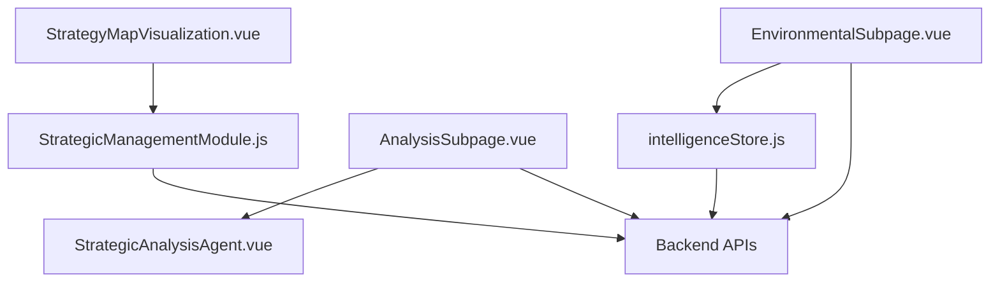
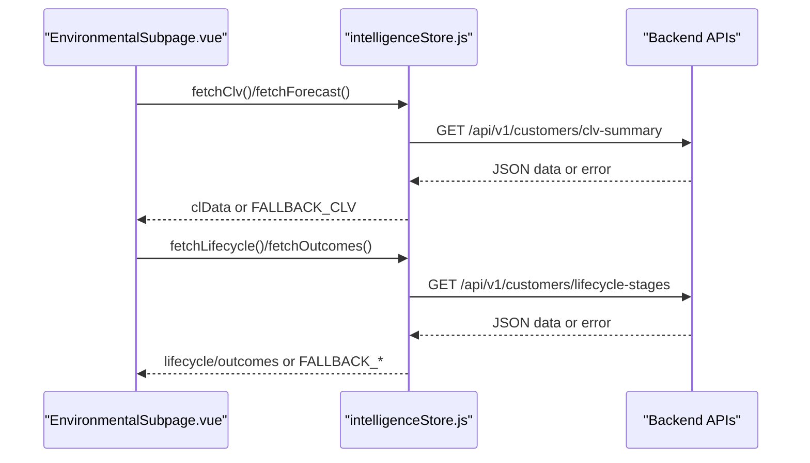
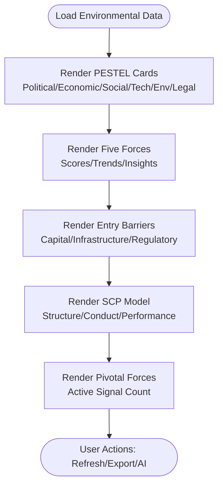
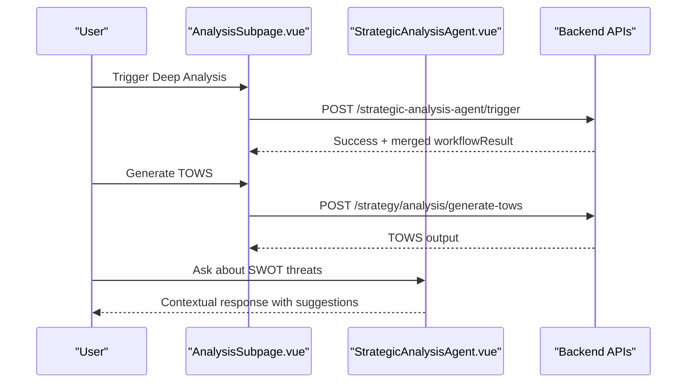
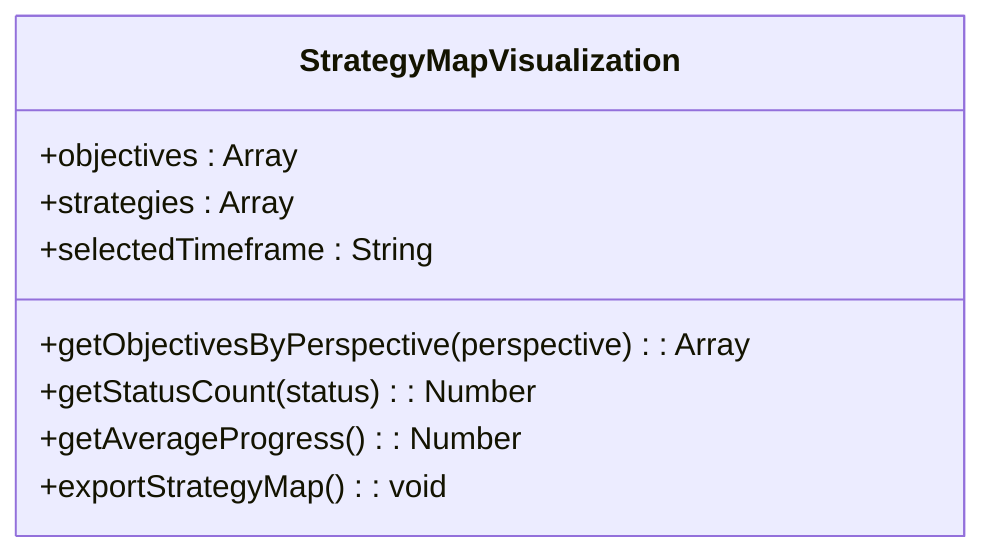
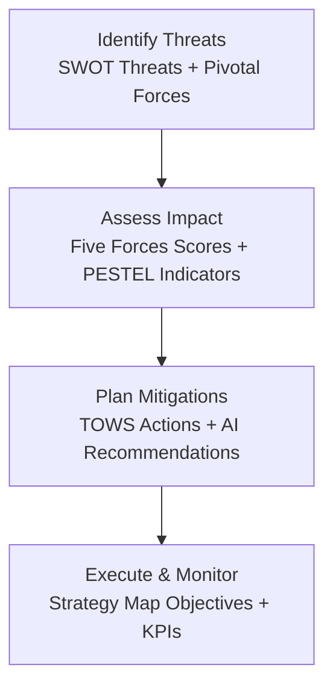
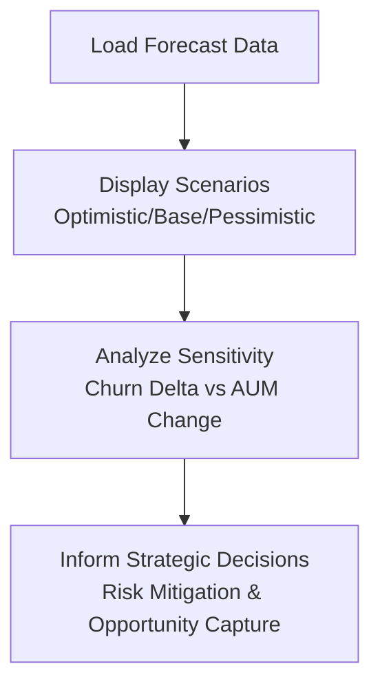
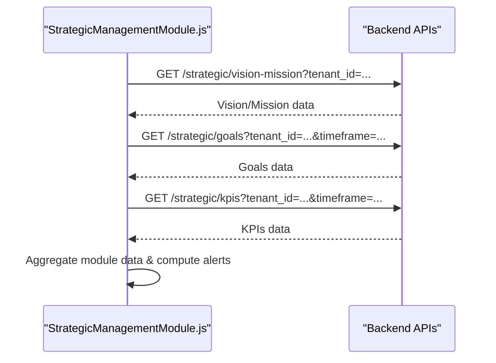
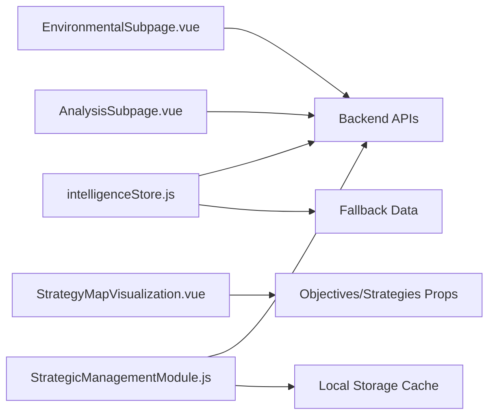

# Environmental Analysis

<cite>
**Referenced Files in This Document**
- [EnvironmentalSubpage.vue](file://src/views/Modules/strategic/EnvironmentalSubpage.vue)
- [AnalysisSubpage.vue](file://src/views/Modules/strategic/AnalysisSubpage.vue)
- [StrategyMapVisualization.vue](file://src/views/Modules/strategic/components/StrategyMapVisualization.vue)
- [StrategicAnalysisAgent.vue](file://src/views/Modules/strategic/components/StrategicAnalysisAgent.vue)
- [intelligenceStore.js](file://src/stores/intelligenceStore.js)
- [StrategicManagementModule.js](file://src/views/Modules/strategic/composables/StrategicManagementModule.js)
</cite>

## Table of Contents
1. [Introduction](#introduction)
2. [Project Structure](#project-structure)
3. [Core Components](#core-components)
4. [Architecture Overview](#architecture-overview)
5. [Detailed Component Analysis](#detailed-component-analysis)
6. [Dependency Analysis](#dependency-analysis)
7. [Performance Considerations](#performance-considerations)
8. [Troubleshooting Guide](#troubleshooting-guide)
9. [Conclusion](#conclusion)
10. [Appendices](#appendices)

## Introduction
This document explains the Environmental Analysis module, focusing on market assessment tools (competitive landscape analysis, industry trend identification, opportunity evaluation), risk assessment methodologies (threat identification, impact analysis, mitigation strategies), and the Strategy Map visualization for strategic positioning. It also covers SWOT templates, PESTLE integration, scenario planning capabilities, data source integration, automated market intelligence gathering, and collaborative workflows.

## Project Structure
The Environmental Analysis module is implemented as a set of Vue components and composables within the Strategic module:
- Environmental scanning and market models are presented in the environmental subpage.
- SWOT, TOWS, and PESTLE frameworks are integrated into the analysis subpage.
- The Strategy Map visualizes objectives across perspectives to show strategic positioning and progress.
- An AI assistant supports interactive analysis and guidance.
- A shared store provides intelligence data with fallbacks when APIs are unavailable.
- A composable orchestrates cross-module data loading and KPI aggregation.

**Diagram sources**
- [EnvironmentalSubpage.vue:146-442](file://src/views/Modules/strategic/EnvironmentalSubpage.vue#L146-L442)
- [AnalysisSubpage.vue:907-985](file://src/views/Modules/strategic/AnalysisSubpage.vue#L907-L985)
- [StrategyMapVisualization.vue:307-455](file://src/views/Modules/strategic/components/StrategyMapVisualization.vue#L307-L455)
- [intelligenceStore.js:234-295](file://src/stores/intelligenceStore.js#L234-L295)
- [StrategicManagementModule.js:127-153](file://src/views/Modules/strategic/composables/StrategicManagementModule.js#L127-L153)

**Section sources**
- [EnvironmentalSubpage.vue:146-442](file://src/views/Modules/strategic/EnvironmentalSubpage.vue#L146-L442)
- [AnalysisSubpage.vue:907-985](file://src/views/Modules/strategic/AnalysisSubpage.vue#L907-L985)
- [StrategyMapVisualization.vue:307-455](file://src/views/Modules/strategic/components/StrategyMapVisualization.vue#L307-L455)
- [intelligenceStore.js:234-295](file://src/stores/intelligenceStore.js#L234-L295)
- [StrategicManagementModule.js:127-153](file://src/views/Modules/strategic/composables/StrategicManagementModule.js#L127-L153)

## Core Components
- Environmental Subpage: Presents PESTEL scan, Porter’s Five Forces, entry barriers, SCP model, pivotal forces detection, and an executive summary banner. It supports region selection, refresh/sync actions, and displays live engine status.
- Analysis Subpage: Provides SWOT analysis, peer benchmarking, TOWS action generation, PESTLE overview, and Porter’s Five Forces view. It triggers deep analysis via an agent endpoint and integrates notes/history.
- Strategy Map Visualization: Displays objectives by perspective (Financial, Customer, Internal Process, Learning & Growth), filters by timeframe, exports strategy map data, and shows aggregate metrics.
- Strategic Analysis Agent: Chat-style interface for interactive assistance, including SWOT threat analysis prompts and contextual suggestions.
- Intelligence Store: Centralized state for customer lifecycle, forecasts, outcomes, and CLV data with offline fallbacks.
- Strategic Management Composable: Loads and aggregates strategic data (vision/mission, goals, strategies, action plans, milestones, meetings, KPIs) and computes alerts and progress updates.

**Section sources**
- [EnvironmentalSubpage.vue:146-442](file://src/views/Modules/strategic/EnvironmentalSubpage.vue#L146-L442)
- [AnalysisSubpage.vue:907-985](file://src/views/Modules/strategic/AnalysisSubpage.vue#L907-L985)
- [StrategyMapVisualization.vue:307-455](file://src/views/Modules/strategic/components/StrategyMapVisualization.vue#L307-L455)
- [StrategicAnalysisAgent.vue:102-169](file://src/views/Modules/strategic/components/StrategicAnalysisAgent.vue#L102-L169)
- [intelligenceStore.js:234-295](file://src/stores/intelligenceStore.js#L234-L295)
- [StrategicManagementModule.js:127-153](file://src/views/Modules/strategic/composables/StrategicManagementModule.js#L127-L153)

## Architecture Overview
The module follows a layered architecture:
- Presentation layer: Vue components render dashboards, charts, and interactive panels.
- State layer: Stores and composables manage application state, caching, and computed values.
- Integration layer: Axios-based client calls backend endpoints; store includes interceptors for auth headers and timeouts.
- Fallbacks: When APIs fail, static fallback datasets ensure continuity.

**Diagram sources**
- [intelligenceStore.js:242-288](file://src/stores/intelligenceStore.js#L242-L288)
- [EnvironmentalSubpage.vue:146-442](file://src/views/Modules/strategic/EnvironmentalSubpage.vue#L146-L442)

**Section sources**
- [intelligenceStore.js:234-295](file://src/stores/intelligenceStore.js#L234-L295)
- [EnvironmentalSubpage.vue:146-442](file://src/views/Modules/strategic/EnvironmentalSubpage.vue#L146-L442)

## Detailed Component Analysis

### Environmental Subpage: Market Assessment Tools
- PESTEL Scan: Displays Political, Economic, Social, Technological, Environmental, Legal factors with scores, insights, and indicators. Risk/outlook badges provide quick assessments.
- Porter’s Five Forces: Scores, trends, and percentage changes for supplier power, rivalry, substitutes, buyer power, and new entrants, plus an AI recommendation panel.
- Entry Barriers: Region-level capital, infrastructure, and regulatory barrier levels with progress bars and insights.
- SCP Model: Market structure, conduct, and performance metrics with AI insight.
- Pivotal Forces Detection: Active force signals count and dynamic indicators.

**Diagram sources**
- [EnvironmentalSubpage.vue:146-442](file://src/views/Modules/strategic/EnvironmentalSubpage.vue#L146-L442)
- [EnvironmentalSubpage.vue:444-632](file://src/views/Modules/strategic/EnvironmentalSubpage.vue#L444-L632)
- [EnvironmentalSubpage.vue:634-784](file://src/views/Modules/strategic/EnvironmentalSubpage.vue#L634-L784)
- [EnvironmentalSubpage.vue:786-800](file://src/views/Modules/strategic/EnvironmentalSubpage.vue#L786-L800)

**Section sources**
- [EnvironmentalSubpage.vue:146-442](file://src/views/Modules/strategic/EnvironmentalSubpage.vue#L146-L442)
- [EnvironmentalSubpage.vue:444-632](file://src/views/Modules/strategic/EnvironmentalSubpage.vue#L444-L632)
- [EnvironmentalSubpage.vue:634-784](file://src/views/Modules/strategic/EnvironmentalSubpage.vue#L634-L784)
- [EnvironmentalSubpage.vue:786-800](file://src/views/Modules/strategic/EnvironmentalSubpage.vue#L786-L800)

### Analysis Subpage: SWOT, TOWS, PESTLE, and Competitive Landscape
- SWOT Analysis: Strengths, Weaknesses, Opportunities, Threats with expandable lists and regeneration controls.
- Peer Benchmarking: Comparative metrics against rivals.
- TOWS Actions: Generates actionable strategies from SWOT inputs via backend endpoint.
- PESTLE Overview: High-level view of macro-environmental forces.
- Porter’s Five Forces: Industry profitability and competitive intensity assessment.

**Diagram sources**
- [AnalysisSubpage.vue:961-1007](file://src/views/Modules/strategic/AnalysisSubpage.vue#L961-L1007)
- [StrategicAnalysisAgent.vue:130-160](file://src/views/Modules/strategic/components/StrategicAnalysisAgent.vue#L130-L160)

**Section sources**
- [AnalysisSubpage.vue:907-985](file://src/views/Modules/strategic/AnalysisSubpage.vue#L907-L985)
- [AnalysisSubpage.vue:776-879](file://src/views/Modules/strategic/AnalysisSubpage.vue#L776-L879)
- [StrategicAnalysisAgent.vue:102-169](file://src/views/Modules/strategic/components/StrategicAnalysisAgent.vue#L102-L169)

### Strategy Map Visualization: Strategic Positioning and Objectives
- Perspectives: Financial, Customer, Internal Process, Learning & Growth.
- Filtering: Timeframe selection (quarterly/yearly/all).
- Export: JSON export of objectives and summaries.
- Metrics: Total objectives, active count, average progress, completed count.

**Diagram sources**
- [StrategyMapVisualization.vue:307-455](file://src/views/Modules/strategic/components/StrategyMapVisualization.vue#L307-L455)

**Section sources**
- [StrategyMapVisualization.vue:1-491](file://src/views/Modules/strategic/components/StrategyMapVisualization.vue#L1-L491)

### Risk Assessment Methodologies
- Threat Identification: SWOT threats and pivotal forces detection surfaces emerging risks.
- Impact Analysis: Five Forces scoring and trends quantify competitive pressure; PESTEL indicators highlight macro impacts.
- Mitigation Strategy Development: TOWS generation maps SWOT elements to actionable strategies; AI recommendations guide prioritization.

**Diagram sources**
- [AnalysisSubpage.vue:961-1007](file://src/views/Modules/strategic/AnalysisSubpage.vue#L961-L1007)
- [EnvironmentalSubpage.vue:444-632](file://src/views/Modules/strategic/EnvironmentalSubpage.vue#L444-L632)
- [StrategyMapVisualization.vue:307-455](file://src/views/Modules/strategic/components/StrategyMapVisualization.vue#L307-L455)

**Section sources**
- [AnalysisSubpage.vue:961-1007](file://src/views/Modules/strategic/AnalysisSubpage.vue#L961-L1007)
- [EnvironmentalSubpage.vue:444-632](file://src/views/Modules/strategic/EnvironmentalSubpage.vue#L444-L632)
- [StrategyMapVisualization.vue:307-455](file://src/views/Modules/strategic/components/StrategyMapVisualization.vue#L307-L455)

### Scenario Planning Capabilities
- Forecast Scenarios: Intelligence store provides optimistic/base/pessimistic scenarios with confidence bounds and sensitivity analysis.
- Use Cases: Evaluate revenue protection, churn impact, and segment-specific projections to inform strategic decisions.

**Diagram sources**
- [intelligenceStore.js:154-195](file://src/stores/intelligenceStore.js#L154-L195)

**Section sources**
- [intelligenceStore.js:154-195](file://src/stores/intelligenceStore.js#L154-L195)

### Data Sources Integration and Automated Market Intelligence
- Backend APIs: Authentication-enabled requests with timeout configuration; endpoints for CLV, lifecycle stages, forecasts, and outcomes.
- Offline Resilience: Static fallback datasets ensure functionality during outages.
- Cross-Module Aggregation: Strategic management composable loads vision/mission, goals, strategies, action plans, milestones, meetings, and KPIs, then aggregates module data for KPI calculation.

**Diagram sources**
- [StrategicManagementModule.js:127-153](file://src/views/Modules/strategic/composables/StrategicManagementModule.js#L127-L153)
- [StrategicManagementModule.js:156-319](file://src/views/Modules/strategic/composables/StrategicManagementModule.js#L156-L319)

**Section sources**
- [intelligenceStore.js:234-295](file://src/stores/intelligenceStore.js#L234-L295)
- [StrategicManagementModule.js:127-319](file://src/views/Modules/strategic/composables/StrategicManagementModule.js#L127-L319)

### Collaborative Analysis Workflows
- Notes and History: Users can create, edit, and delete strategic notes; history tracking supports auditability.
- AI Assistant: Interactive chat suggests actions and summarizes recent notes or SWOT threats.
- Export and Sharing: Strategy map export enables sharing of objective sets and summaries.

**Section sources**
- [AnalysisSubpage.vue:1009-1100](file://src/views/Modules/strategic/AnalysisSubpage.vue#L1009-L1100)
- [StrategicAnalysisAgent.vue:102-169](file://src/views/Modules/strategic/components/StrategicAnalysisAgent.vue#L102-L169)
- [StrategyMapVisualization.vue:425-455](file://src/views/Modules/strategic/components/StrategyMapVisualization.vue#L425-L455)

## Dependency Analysis
- Component Coupling:
  - EnvironmentalSubpage depends on backend APIs for PESTEL and Five Forces data and renders insights based on responses.
  - AnalysisSubpage depends on the strategic analysis agent endpoint and generates TOWS via backend.
  - StrategyMapVisualization depends on objectives/strategies props and emits events for creation and details.
  - IntelligenceStore depends on axios and API base URL; uses interceptors for auth headers.
  - StrategicManagementModule composes multiple API calls and local storage for resilience.
- Cohesion:
  - Each component encapsulates specific responsibilities (environmental scan, analysis, visualization, agent interaction).
  - Store centralizes intelligence data retrieval and fallback logic.
  - Composable aggregates cross-module data and computes alerts/KPIs.

**Diagram sources**
- [EnvironmentalSubpage.vue:146-442](file://src/views/Modules/strategic/EnvironmentalSubpage.vue#L146-L442)
- [AnalysisSubpage.vue:961-1007](file://src/views/Modules/strategic/AnalysisSubpage.vue#L961-L1007)
- [StrategyMapVisualization.vue:307-455](file://src/views/Modules/strategic/components/StrategyMapVisualization.vue#L307-L455)
- [intelligenceStore.js:234-295](file://src/stores/intelligenceStore.js#L234-L295)
- [StrategicManagementModule.js:127-319](file://src/views/Modules/strategic/composables/StrategicManagementModule.js#L127-L319)

**Section sources**
- [EnvironmentalSubpage.vue:146-442](file://src/views/Modules/strategic/EnvironmentalSubpage.vue#L146-L442)
- [AnalysisSubpage.vue:961-1007](file://src/views/Modules/strategic/AnalysisSubpage.vue#L961-L1007)
- [StrategyMapVisualization.vue:307-455](file://src/views/Modules/strategic/components/StrategyMapVisualization.vue#L307-L455)
- [intelligenceStore.js:234-295](file://src/stores/intelligenceStore.js#L234-L295)
- [StrategicManagementModule.js:127-319](file://src/views/Modules/strategic/composables/StrategicManagementModule.js#L127-L319)

## Performance Considerations
- API Timeouts and Retries: Store configures a 15-second timeout; consider retry logic for transient failures.
- Caching: LocalStorage caching reduces network load; ensure cache invalidation aligns with data freshness needs.
- Rendering Efficiency: Grid layouts and conditional rendering minimize reflows; avoid excessive DOM updates in loops.
- Fallback Data: Static datasets maintain UI responsiveness during outages; validate fallback schema consistency.

[No sources needed since this section provides general guidance]

## Troubleshooting Guide
- API Failures: Check interceptor token presence and base URL configuration; verify endpoint availability.
- Missing Data: Confirm tenant ID extraction and query parameters; inspect localStorage caches for stale data.
- UI State Issues: Ensure reactive refs update correctly; debounce heavy computations if necessary.
- Export Errors: Validate JSON serialization and blob creation; handle browser compatibility for downloads.

**Section sources**
- [intelligenceStore.js:6-11](file://src/stores/intelligenceStore.js#L6-L11)
- [StrategicManagementModule.js:156-319](file://src/views/Modules/strategic/composables/StrategicManagementModule.js#L156-L319)
- [StrategyMapVisualization.vue:425-455](file://src/views/Modules/strategic/components/StrategyMapVisualization.vue#L425-L455)

## Conclusion
The Environmental Analysis module provides comprehensive market assessment tools, risk assessment methodologies, and strategic visualization. It integrates PESTEL, Porter’s Five Forces, SWOT/TOWS, and scenario planning with robust data sourcing and offline resilience. The Strategy Map enables clear communication of strategic positioning and progress across perspectives.

[No sources needed since this section summarizes without analyzing specific files]

## Appendices
- Practical Examples:
  - Conducting an environmental scan: Use the PESTEL cards to identify macro trends and assess risk/outlook indicators.
  - Identifying strategic threats: Review SWOT threats and pivotal forces signals; trigger deep analysis for updated insights.
  - Developing responsive strategies: Generate TOWS actions and visualize objectives in the Strategy Map to track execution.

[No sources needed since this section provides general guidance]