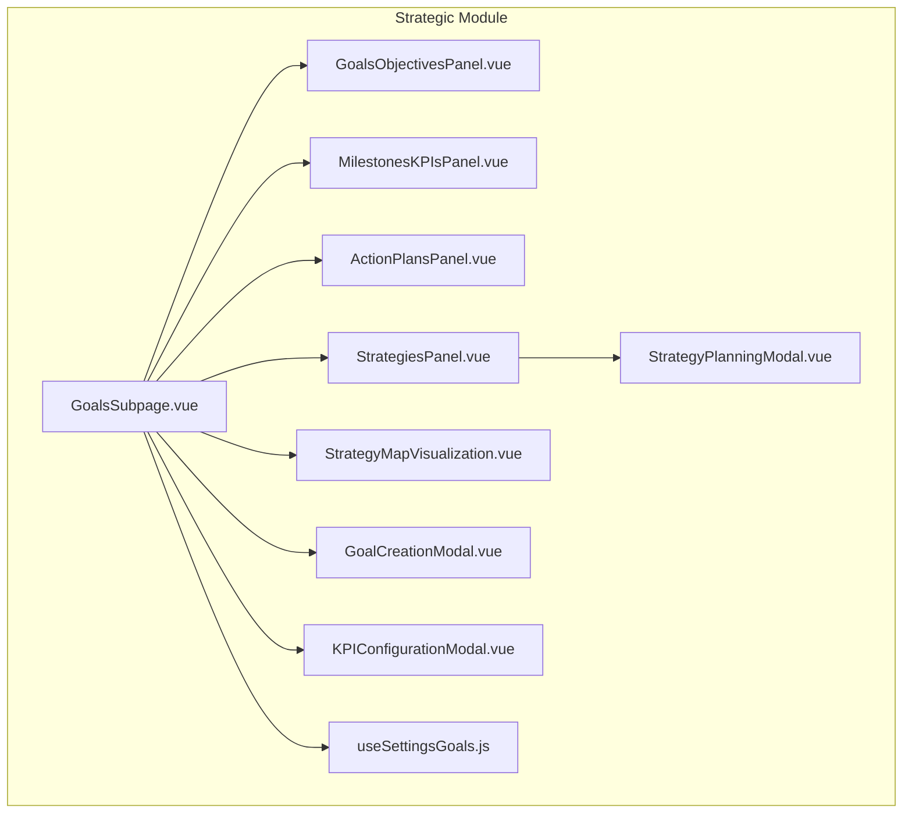
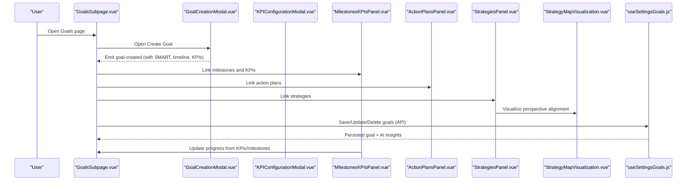
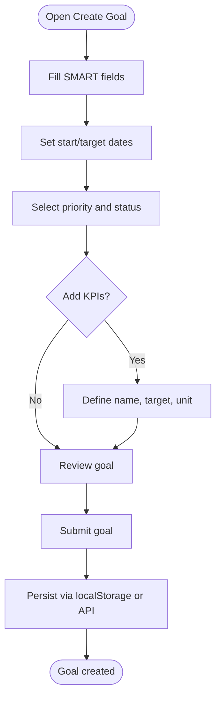
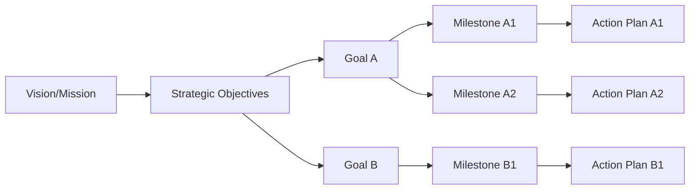
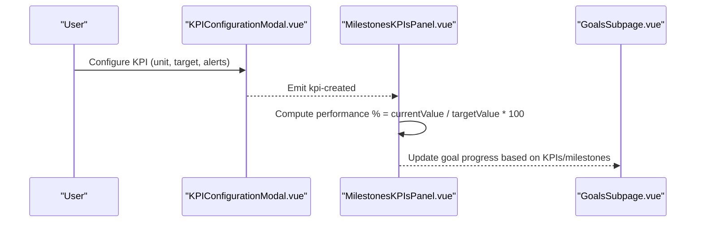
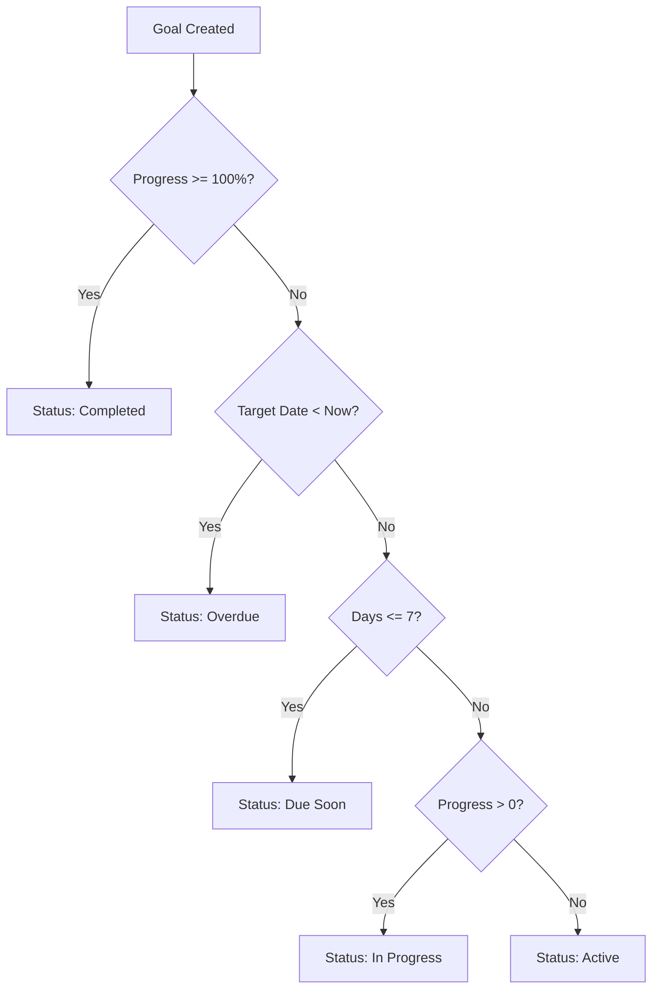
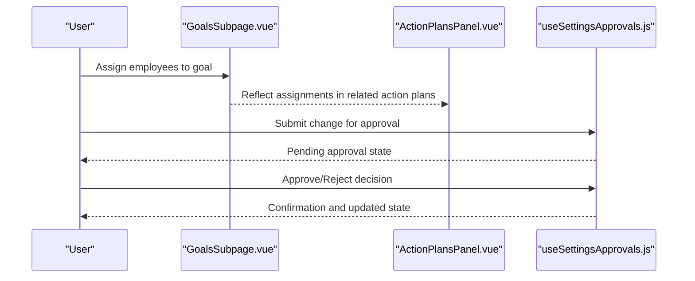
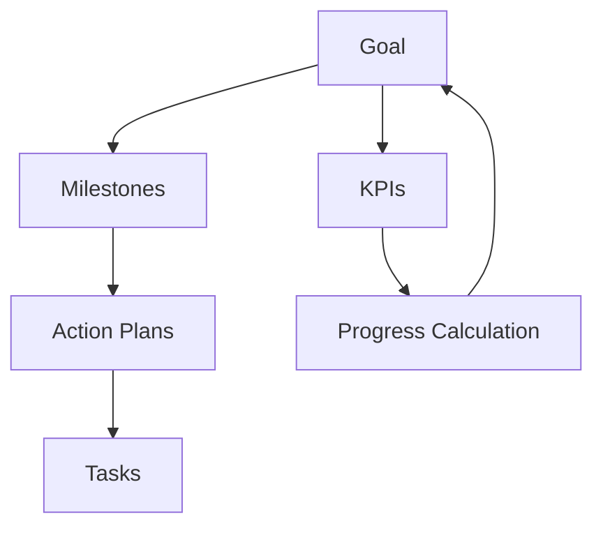
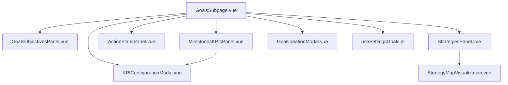

# Goals & Objectives Management

<cite>
**Referenced Files in This Document**
- [GoalsSubpage.vue](file://src/views/Modules/strategic/GoalsSubpage.vue)
- [GoalsObjectivesPanel.vue](file://src/views/Modules/strategic/components/GoalsObjectivesPanel.vue)
- [GoalCreationModal.vue](file://src/views/Modules/strategic/modals/GoalCreationModal.vue)
- [MilestonesKPIsPanel.vue](file://src/views/Modules/strategic/components/MilestonesKPIsPanel.vue)
- [KPIConfigurationModal.vue](file://src/views/Modules/strategic/modals/KPIConfigurationModal.vue)
- [ActionPlansPanel.vue](file://src/views/Modules/strategic/components/ActionPlansPanel.vue)
- [StrategiesPanel.vue](file://src/views/Modules/strategic/components/StrategiesPanel.vue)
- [useSettingsGoals.js](file://src/composables/settings/useSettingsGoals.js)
- [StrategyMapVisualization.vue](file://src/views/Modules/strategic/components/StrategyMapVisualization.vue)
- [StrategyPlanningModal.vue](file://src/views/Modules/strategic/modals/StrategyPlanningModal.vue)
</cite>

## Table of Contents
1. Introduction
2. Project Structure
3. Core Components
4. Architecture Overview
5. Detailed Component Analysis
6. Dependency Analysis
7. Performance Considerations
8. Troubleshooting Guide
9. Conclusion
10. Appendices

## Introduction
This document explains the Goals and Objectives management system implemented in the strategic module. It covers goal creation workflows (SMART goals, targets, deadlines), progress tracking, hierarchy and dependencies, KPI integration for automatic progress calculation, categories and priorities, collaboration and approvals, reporting, and relationships with action plans and milestones to support end-to-end strategic execution.

## Project Structure
The goals feature spans several Vue components and composables:
- A main goals page that orchestrates views, statistics, and modal interactions
- Panels for goals, milestones/KPIs, and action plans
- Modals for creating goals and configuring KPIs
- A composable for settings-backed goal CRUD and AI insights
- Strategy map and planning modals to connect goals to organizational objectives

**Diagram sources**
- [GoalsSubpage.vue:1-800](file://src/views/Modules/strategic/GoalsSubpage.vue#L1-L800)
- [GoalsObjectivesPanel.vue:1-612](file://src/views/Modules/strategic/components/GoalsObjectivesPanel.vue#L1-L612)
- [MilestonesKPIsPanel.vue:1-800](file://src/views/Modules/strategic/components/MilestonesKPIsPanel.vue#L1-L800)
- [ActionPlansPanel.vue:1-732](file://src/views/Modules/strategic/components/ActionPlansPanel.vue#L1-L732)
- [StrategiesPanel.vue:1-584](file://src/views/Modules/strategic/components/StrategiesPanel.vue#L1-L584)
- [StrategyMapVisualization.vue:52-490](file://src/views/Modules/strategic/components/StrategyMapVisualization.vue#L52-L490)
- [GoalCreationModal.vue:1-420](file://src/views/Modules/strategic/modals/GoalCreationModal.vue#L1-L420)
- [KPIConfigurationModal.vue:1-499](file://src/views/Modules/strategic/modals/KPIConfigurationModal.vue#L1-L499)
- [useSettingsGoals.js:1-172](file://src/composables/settings/useSettingsGoals.js#L1-L172)
- [StrategyPlanningModal.vue:171-258](file://src/views/Modules/strategic/modals/StrategyPlanningModal.vue#L171-L258)

**Section sources**
- [GoalsSubpage.vue:1-800](file://src/views/Modules/strategic/GoalsSubpage.vue#L1-L800)
- [StrategiesPanel.vue:1-584](file://src/views/Modules/strategic/components/StrategiesPanel.vue#L1-L584)

## Core Components
- GoalsSubpage: Central dashboard for goals, including SMART fields display, progress bars, milestones, badges, team assignment, smart alerts, and navigation between goal types.
- GoalsObjectivesPanel: Reusable panel for listing, filtering, sorting, and managing goals with status logic and view modes.
- GoalCreationModal: Guided form to create goals using SMART framework, timeline, priority/status, owner, and inline KPI definition.
- MilestonesKPIsPanel: Unified view for milestones and KPIs, with tabs, filters, timelines, performance calculations, and alerts.
- KPIConfigurationModal: Full configuration for KPIs including measurement units, frequency, data sources, targets, alert thresholds, formulas, visualization, and ownership.
- ActionPlansPanel: Execution layer with Kanban/timeline/list views, filters by status/assignee/priority, progress tracking, and analytics summary.
- StrategiesPanel: Strategic plans overview with category filters, strategy map toggle, and linkage to goals/action plans/milestones.
- useSettingsGoals: Composable providing goal CRUD via API, AI insights generation, and helper utilities for status/priority/progress visuals.
- StrategyMapVisualization: Perspective-based view (financial, customer, process, learning) to organize objectives and visualize alignment.

**Section sources**
- [GoalsSubpage.vue:1-800](file://src/views/Modules/strategic/GoalsSubpage.vue#L1-L800)
- [GoalsObjectivesPanel.vue:1-612](file://src/views/Modules/strategic/components/GoalsObjectivesPanel.vue#L1-L612)
- [GoalCreationModal.vue:1-420](file://src/views/Modules/strategic/modals/GoalCreationModal.vue#L1-L420)
- [MilestonesKPIsPanel.vue:1-800](file://src/views/Modules/strategic/components/MilestonesKPIsPanel.vue#L1-L800)
- [KPIConfigurationModal.vue:1-499](file://src/views/Modules/strategic/modals/KPIConfigurationModal.vue#L1-L499)
- [ActionPlansPanel.vue:1-732](file://src/views/Modules/strategic/components/ActionPlansPanel.vue#L1-L732)
- [StrategiesPanel.vue:1-584](file://src/views/Modules/strategic/components/StrategiesPanel.vue#L1-L584)
- [useSettingsGoals.js:1-172](file://src/composables/settings/useSettingsGoals.js#L1-L172)
- [StrategyMapVisualization.vue:52-490](file://src/views/Modules/strategic/components/StrategyMapVisualization.vue#L52-L490)

## Architecture Overview
The system is a modular Vue application where the GoalsSubpage composes panels and modals to deliver a cohesive workflow:
- Users create goals via GoalCreationModal, optionally defining KPIs inline or later through KPIConfigurationModal.
- MilestonesKPIsPanel tracks milestone completion and KPI performance; progress is computed from KPI values and milestones.
- ActionPlansPanel operationalizes goals into executable tasks with Kanban/timeline/list views.
- StrategiesPanel and StrategyMapVisualization align goals to strategic objectives across perspectives.
- useSettingsGoals provides backend persistence and AI-driven insights.

**Diagram sources**
- [GoalsSubpage.vue:1-800](file://src/views/Modules/strategic/GoalsSubpage.vue#L1-L800)
- [GoalCreationModal.vue:1-420](file://src/views/Modules/strategic/modals/GoalCreationModal.vue#L1-L420)
- [KPIConfigurationModal.vue:1-499](file://src/views/Modules/strategic/modals/KPIConfigurationModal.vue#L1-L499)
- [MilestonesKPIsPanel.vue:1-800](file://src/views/Modules/strategic/components/MilestonesKPIsPanel.vue#L1-L800)
- [ActionPlansPanel.vue:1-732](file://src/views/Modules/strategic/components/ActionPlansPanel.vue#L1-L732)
- [StrategiesPanel.vue:1-584](file://src/views/Modules/strategic/components/StrategiesPanel.vue#L1-L584)
- [StrategyMapVisualization.vue:52-490](file://src/views/Modules/strategic/components/StrategyMapVisualization.vue#L52-L490)
- [useSettingsGoals.js:1-172](file://src/composables/settings/useSettingsGoals.js#L1-L172)

## Detailed Component Analysis

### Goal Creation Workflow (SMART, Targets, Deadlines, Progress)
- SMART fields are captured in the creation modal to ensure clarity and measurability.
- Timeline includes start and target dates for deadline management.
- Priority and status are set at creation; progress updates occur via UI actions and KPI/milestone changes.
- The goals page displays SMART details, current vs target, and progress bars.

**Diagram sources**
- [GoalCreationModal.vue:1-420](file://src/views/Modules/strategic/modals/GoalCreationModal.vue#L1-L420)
- [GoalsSubpage.vue:1-800](file://src/views/Modules/strategic/GoalsSubpage.vue#L1-L800)

**Section sources**
- [GoalCreationModal.vue:1-420](file://src/views/Modules/strategic/modals/GoalCreationModal.vue#L1-L420)
- [GoalsSubpage.vue:1-800](file://src/views/Modules/strategic/GoalsSubpage.vue#L1-L800)

### Goal Hierarchy, Parent-Child Relationships, and Dependencies
- Goals can be linked to strategies and objectives via the strategy planning modal and strategy map.
- The strategy map organizes objectives by perspective, enabling hierarchical alignment from corporate vision down to actionable goals.
- Milestones link to goals, forming a dependency chain from high-level objectives to tactical steps.

**Diagram sources**
- [StrategyPlanningModal.vue:171-258](file://src/views/Modules/strategic/modals/StrategyPlanningModal.vue#L171-L258)
- [StrategyMapVisualization.vue:52-490](file://src/views/Modules/strategic/components/StrategyMapVisualization.vue#L52-L490)
- [MilestonesKPIsPanel.vue:1-800](file://src/views/Modules/strategic/components/MilestonesKPIsPanel.vue#L1-L800)
- [ActionPlansPanel.vue:1-732](file://src/views/Modules/strategic/components/ActionPlansPanel.vue#L1-L732)

**Section sources**
- [StrategyPlanningModal.vue:171-258](file://src/views/Modules/strategic/modals/StrategyPlanningModal.vue#L171-L258)
- [StrategyMapVisualization.vue:52-490](file://src/views/Modules/strategic/components/StrategyMapVisualization.vue#L52-L490)

### KPI Integration and Automatic Progress Calculation
- KPIs are configured with units, frequencies, data sources, targets, and alert thresholds.
- MilestonesKPIsPanel computes performance percentage from current vs target values and visualizes trends.
- Goals can include inline KPIs during creation; KPI updates feed back into goal progress.

**Diagram sources**
- [KPIConfigurationModal.vue:1-499](file://src/views/Modules/strategic/modals/KPIConfigurationModal.vue#L1-L499)
- [MilestonesKPIsPanel.vue:1-800](file://src/views/Modules/strategic/components/MilestonesKPIsPanel.vue#L1-L800)
- [GoalsSubpage.vue:1-800](file://src/views/Modules/strategic/GoalsSubpage.vue#L1-L800)

**Section sources**
- [KPIConfigurationModal.vue:1-499](file://src/views/Modules/strategic/modals/KPIConfigurationModal.vue#L1-L499)
- [MilestonesKPIsPanel.vue:1-800](file://src/views/Modules/strategic/components/MilestonesKPIsPanel.vue#L1-L800)

### Categories, Priority Levels, and Status Tracking
- Goals support multiple categories (e.g., financial, customer, process, learning, operational, strategic).
- Priority levels influence sorting and visual emphasis.
- Status logic determines Active, In Progress, Completed, Overdue, Due Soon states based on progress and deadlines.

**Diagram sources**
- [GoalsObjectivesPanel.vue:1-612](file://src/views/Modules/strategic/components/GoalsObjectivesPanel.vue#L1-L612)

**Section sources**
- [GoalsObjectivesPanel.vue:1-612](file://src/views/Modules/strategic/components/GoalsObjectivesPanel.vue#L1-L612)

### Collaboration Features, Approval Workflows, and Reporting
- Team assignment is supported directly on goal cards, allowing multiple assignees per goal.
- Approvals are handled via a dedicated composable that submits decisions and manages pending requests.
- Reporting capabilities include exporting strategy maps and generating reports from the goals page.

**Diagram sources**
- [GoalsSubpage.vue:1-800](file://src/views/Modules/strategic/GoalsSubpage.vue#L1-L800)
- [ActionPlansPanel.vue:1-732](file://src/views/Modules/strategic/components/ActionPlansPanel.vue#L1-L732)

**Section sources**
- [GoalsSubpage.vue:1-800](file://src/views/Modules/strategic/GoalsSubpage.vue#L1-L800)

### Relationship with Action Plans and Milestones
- Milestones break down goals into time-bound checkpoints; their completion contributes to overall progress.
- Action plans operationalize milestones into tasks with Kanban/timeline/list views, enabling detailed execution tracking.
- Strategies provide the higher-level context linking goals to organizational objectives.

**Diagram sources**
- [MilestonesKPIsPanel.vue:1-800](file://src/views/Modules/strategic/components/MilestonesKPIsPanel.vue#L1-L800)
- [ActionPlansPanel.vue:1-732](file://src/views/Modules/strategic/components/ActionPlansPanel.vue#L1-L732)
- [GoalsSubpage.vue:1-800](file://src/views/Modules/strategic/GoalsSubpage.vue#L1-L800)

**Section sources**
- [MilestonesKPIsPanel.vue:1-800](file://src/views/Modules/strategic/components/MilestonesKPIsPanel.vue#L1-L800)
- [ActionPlansPanel.vue:1-732](file://src/views/Modules/strategic/components/ActionPlansPanel.vue#L1-L732)

## Dependency Analysis
- GoalsSubpage depends on panels and modals to render the full lifecycle of goal management.
- MilestonesKPIsPanel depends on KPI data structures and computes performance metrics.
- StrategiesPanel and StrategyMapVisualization connect goals to broader strategic objectives.
- useSettingsGoals encapsulates API calls for goal persistence and AI insights.

**Diagram sources**
- [GoalsSubpage.vue:1-800](file://src/views/Modules/strategic/GoalsSubpage.vue#L1-L800)
- [GoalsObjectivesPanel.vue:1-612](file://src/views/Modules/strategic/components/GoalsObjectivesPanel.vue#L1-L612)
- [MilestonesKPIsPanel.vue:1-800](file://src/views/Modules/strategic/components/MilestonesKPIsPanel.vue#L1-L800)
- [ActionPlansPanel.vue:1-732](file://src/views/Modules/strategic/components/ActionPlansPanel.vue#L1-L732)
- [StrategiesPanel.vue:1-584](file://src/views/Modules/strategic/components/StrategiesPanel.vue#L1-L584)
- [GoalCreationModal.vue:1-420](file://src/views/Modules/strategic/modals/GoalCreationModal.vue#L1-L420)
- [KPIConfigurationModal.vue:1-499](file://src/views/Modules/strategic/modals/KPIConfigurationModal.vue#L1-L499)
- [useSettingsGoals.js:1-172](file://src/composables/settings/useSettingsGoals.js#L1-L172)
- [StrategyMapVisualization.vue:52-490](file://src/views/Modules/strategic/components/StrategyMapVisualization.vue#L52-L490)

**Section sources**
- [GoalsSubpage.vue:1-800](file://src/views/Modules/strategic/GoalsSubpage.vue#L1-L800)
- [useSettingsGoals.js:1-172](file://src/composables/settings/useSettingsGoals.js#L1-L172)

## Performance Considerations
- Use computed properties for filtering and sorting to minimize re-renders.
- Debounce heavy computations when updating large lists of goals or KPIs.
- Prefer server-side pagination for large datasets; client-side pagination is used in some views.
- Cache KPI calculations and milestone statuses to avoid redundant recomputation.
- Optimize modal rendering by lazy-loading heavy components when not visible.

[No sources needed since this section provides general guidance]

## Troubleshooting Guide
- Goal creation fails: Validate required fields (title, category) before submission; check localStorage or API responses.
- KPI progress not updating: Ensure KPI targets and current values are set; verify computation logic in MilestonesKPIsPanel.
- Status shows overdue unexpectedly: Confirm target dates and current date handling; review status logic in GoalsObjectivesPanel.
- AI insights not generated: Check API endpoints and authentication headers in useSettingsGoals; handle error states gracefully.
- Approval workflow stuck: Verify tenant_id and user identity; confirm endpoint availability and response codes.

**Section sources**
- [GoalCreationModal.vue:1-420](file://src/views/Modules/strategic/modals/GoalCreationModal.vue#L1-L420)
- [MilestonesKPIsPanel.vue:1-800](file://src/views/Modules/strategic/components/MilestonesKPIsPanel.vue#L1-L800)
- [GoalsObjectivesPanel.vue:1-612](file://src/views/Modules/strategic/components/GoalsObjectivesPanel.vue#L1-L612)
- [useSettingsGoals.js:1-172](file://src/composables/settings/useSettingsGoals.js#L1-L172)

## Conclusion
The Goals and Objectives management system provides a comprehensive framework for defining SMART goals, setting targets and deadlines, tracking progress via KPIs and milestones, and aligning execution through action plans and strategies. Its modular architecture supports collaboration, approvals, and reporting, enabling organizations to manage strategic execution effectively.

[No sources needed since this section summarizes without analyzing specific files]

## Appendices

### Practical Examples
- Creating a strategic goal:
  - Open GoalCreationModal, fill SMART fields, set timeline, select priority/status, add KPIs if needed, submit.
  - Reference: [GoalCreationModal.vue:1-420](file://src/views/Modules/strategic/modals/GoalCreationModal.vue#L1-L420)
- Linking to organizational objectives:
  - Use StrategyPlanningModal to define objectives and map them to goals; visualize via StrategyMapVisualization.
  - References: [StrategyPlanningModal.vue:171-258](file://src/views/Modules/strategic/modals/StrategyPlanningModal.vue#L171-L258), [StrategyMapVisualization.vue:52-490](file://src/views/Modules/strategic/components/StrategyMapVisualization.vue#L52-L490)
- Monitoring completion rates:
  - Track progress in GoalsSubpage and MilestonesKPIsPanel; compute percentages from KPIs and milestone completion.
  - References: [GoalsSubpage.vue:1-800](file://src/views/Modules/strategic/GoalsSubpage.vue#L1-L800), [MilestonesKPIsPanel.vue:1-800](file://src/views/Modules/strategic/components/MilestonesKPIsPanel.vue#L1-L800)

[No additional sources needed beyond those already cited above]