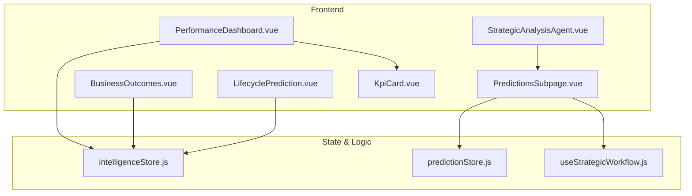
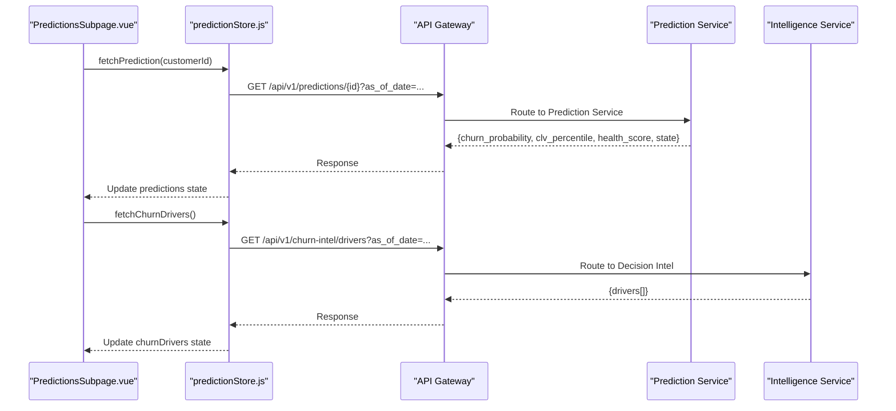
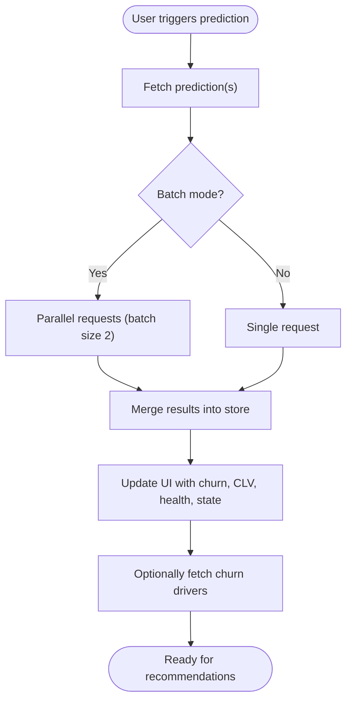
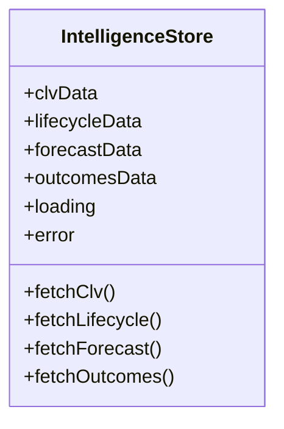
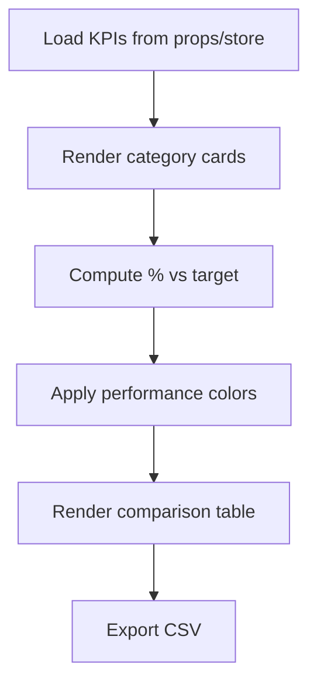
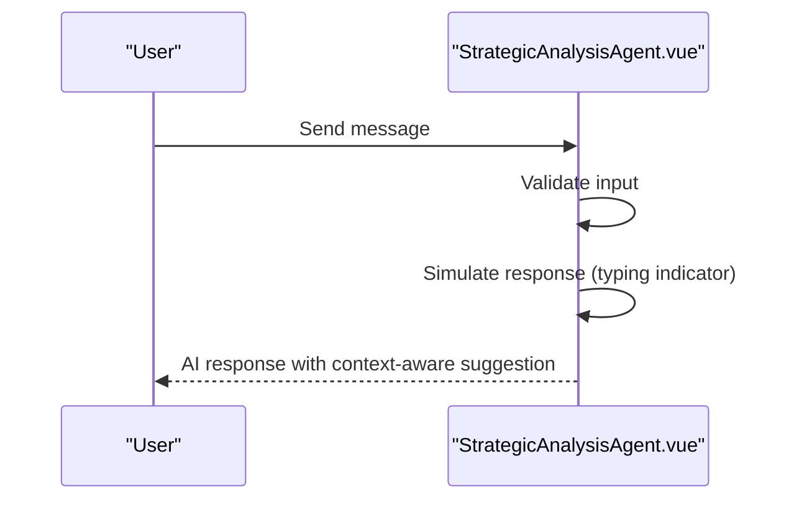
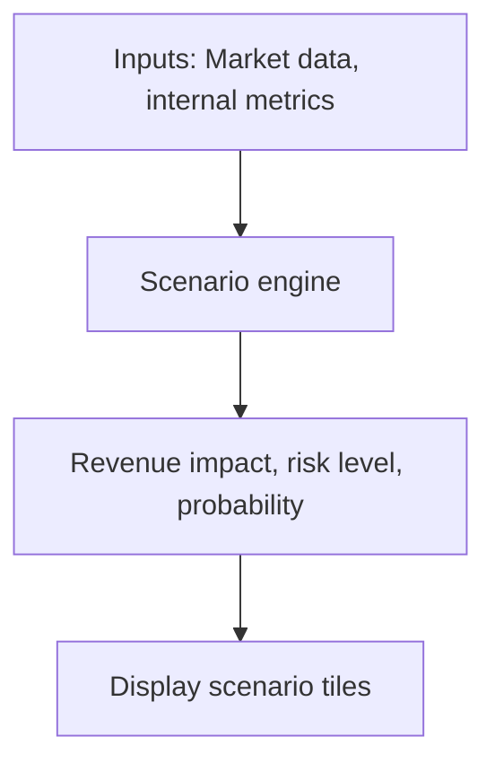
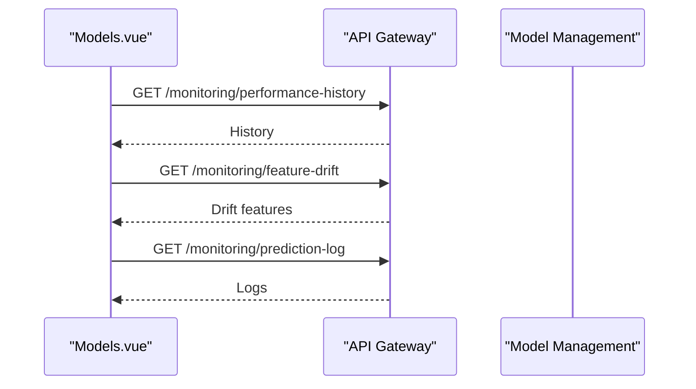
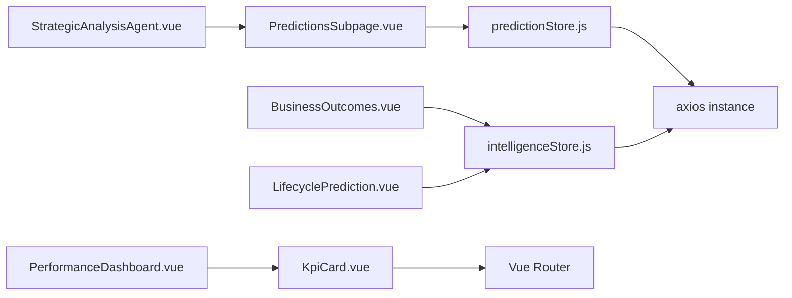

# Predictions & Analytics

<cite>
**Referenced Files in This Document**
- [predictionStore.js](file://src/stores/predictionStore.js)
- [intelligenceStore.js](file://src/stores/intelligenceStore.js)
- [useStrategicWorkflow.js](file://src/composables/useStrategicWorkflow.js)
- [PredictionsSubpage.vue](file://src/views/Modules/strategic/PredictionsSubpage.vue)
- [PerformanceDashboard.vue](file://src/views/Modules/strategic/components/PerformanceDashboard.vue)
- [StrategicAnalysisAgent.vue](file://src/views/Modules/strategic/components/StrategicAnalysisAgent.vue)
- [BusinessOutcomes.vue](file://src/views/Modules/intelligence/BusinessOutcomes.vue)
- [LifecyclePrediction.vue](file://src/views/Modules/intelligence/LifecyclePrediction.vue)
- [KpiCard.vue](file://src/components/ui/KpiCard.vue)
- [Models.vue](file://src/views/Modules/aiagents/Models.vue)
</cite>

## Table of Contents
1. Introduction
2. Project Structure
3. Core Components
4. Architecture Overview
5. Detailed Component Analysis
6. Dependency Analysis
7. Performance Considerations
8. Troubleshooting Guide
9. Conclusion
10. Appendices

## Introduction
This document explains the Predictions and Analytics subsystem that powers AI-driven forecasting, strategic insights, and performance dashboards. It covers:
- The predictive analytics engine integration for churn probability, customer lifetime value (CLV), health scores, lifecycle transitions, and balance forecasts.
- The performance dashboard components for KPI visualization, trend analysis, and real-time metrics display.
- The strategic analysis agent interface that provides intelligent insights based on historical data and market conditions.
- Implementation details for model integration, data preprocessing signals, prediction accuracy validation, and alerting mechanisms.
- Practical usage patterns for generating forecasts, analyzing trends, and receiving AI-driven recommendations.
- Customization options for thresholds, scenarios, and alerts.

## Project Structure
The subsystem spans stores, composables, views, and UI components:
- Stores centralize state and API calls for predictions and intelligence data.
- Composables orchestrate workflow execution and persistence.
- Views render pages for predictions, lifecycle, business outcomes, and scenario planning.
- UI components provide reusable KPI cards and dashboard widgets.

**Diagram sources**
- [PredictionsSubpage.vue:1-321](file://src/views/Modules/strategic/PredictionsSubpage.vue#L1-L321)
- [PerformanceDashboard.vue:1-559](file://src/views/Modules/strategic/components/PerformanceDashboard.vue#L1-L559)
- [StrategicAnalysisAgent.vue:1-184](file://src/views/Modules/strategic/components/StrategicAnalysisAgent.vue#L1-L184)
- [BusinessOutcomes.vue:1-486](file://src/views/Modules/intelligence/BusinessOutcomes.vue#L1-L486)
- [LifecyclePrediction.vue:1-616](file://src/views/Modules/intelligence/LifecyclePrediction.vue#L1-L616)
- [KpiCard.vue:1-130](file://src/components/ui/KpiCard.vue#L1-L130)
- [predictionStore.js:1-171](file://src/stores/predictionStore.js#L1-L171)
- [intelligenceStore.js:1-296](file://src/stores/intelligenceStore.js#L1-L296)
- [useStrategicWorkflow.js:1-58](file://src/composables/useStrategicWorkflow.js#L1-L58)

**Section sources**
- [PredictionsSubpage.vue:1-321](file://src/views/Modules/strategic/PredictionsSubpage.vue#L1-L321)
- [performanceDashboard.vue:1-559](file://src/views/Modules/strategic/components/PerformanceDashboard.vue#L1-L559)
- [intelligenceStore.js:1-296](file://src/stores/intelligenceStore.js#L1-L296)
- [predictionStore.js:1-171](file://src/stores/predictionStore.js#L1-L171)
- [useStrategicWorkflow.js:1-58](file://src/composables/useStrategicWorkflow.js#L1-L58)

## Core Components
- Prediction Store: Manages per-customer churn probability, CLV percentile, health score, Markov matrix, and churn drivers via API calls with error handling and loading states.
- Intelligence Store: Provides CLV summary, lifecycle stages, balance forecast scenarios, and retention ROI outcomes with fallback data when APIs are unavailable.
- Strategic Workflow Composable: Executes a tenant-scoped workflow to generate predictions, external macro-economic data, and scenario plans; persists results locally.
- Predictions Subpage: Displays predicted values, confidence scores, influence factors, macro-economic indicators, and scenario planning tiles.
- Performance Dashboard: Renders KPI categories, progress bars, operational metrics, alerts, and exportable comparison tables.
- Strategic Analysis Agent: Chat-like interface for summarizing notes, SWOT analysis, and contextual guidance.
- Business Outcomes: Tracks ROI, retention performance by branch, success criteria, and pilot vs control comparisons with charts.
- Lifecycle Prediction: Visualizes stage distribution, transition heatmaps, onboarding activation funnels, and win-back pipeline.
- KPI Card: Reusable metric card with formatting, trend indicators, actions, and navigation.

**Section sources**
- [predictionStore.js:17-171](file://src/stores/predictionStore.js#L17-L171)
- [intelligenceStore.js:234-296](file://src/stores/intelligenceStore.js#L234-L296)
- [useStrategicWorkflow.js:1-58](file://src/composables/useStrategicWorkflow.js#L1-L58)
- [PredictionsSubpage.vue:1-321](file://src/views/Modules/strategic/PredictionsSubpage.vue#L1-L321)
- [PerformanceDashboard.vue:1-559](file://src/views/Modules/strategic/components/PerformanceDashboard.vue#L1-L559)
- [StrategicAnalysisAgent.vue:1-184](file://src/views/Modules/strategic/components/StrategicAnalysisAgent.vue#L1-L184)
- [BusinessOutcomes.vue:1-486](file://src/views/Modules/intelligence/BusinessOutcomes.vue#L1-L486)
- [LifecyclePrediction.vue:1-616](file://src/views/Modules/intelligence/LifecyclePrediction.vue#L1-L616)
- [KpiCard.vue:1-130](file://src/components/ui/KpiCard.vue#L1-L130)

## Architecture Overview
The system integrates with backend services through REST endpoints exposed by a gateway. Stores encapsulate API calls, handle errors, and maintain reactive state consumed by views.

**Diagram sources**
- [predictionStore.js:27-152](file://src/stores/predictionStore.js#L27-L152)
- [PredictionsSubpage.vue:294-317](file://src/views/Modules/strategic/PredictionsSubpage.vue#L294-L317)

**Section sources**
- [predictionStore.js:1-171](file://src/stores/predictionStore.js#L1-L171)
- [intelligenceStore.js:1-296](file://src/stores/intelligenceStore.js#L1-L296)
- [useStrategicWorkflow.js:1-58](file://src/composables/useStrategicWorkflow.js#L1-L58)

## Detailed Component Analysis

### Predictive Analytics Engine Integration
- Churn Probability: Single-customer endpoint returns probability; batched fetching uses Promise.allSettled to avoid overwhelming the backend.
- Health Score: Separate endpoint aggregates behavioral and product signals into a composite health score.
- Markov Matrix: Lifecycle transition probabilities fetched for scenario modeling.
- Churn Drivers: Top drivers surfaced for AI recommendation engine to suggest interventions.

**Diagram sources**
- [predictionStore.js:59-152](file://src/stores/predictionStore.js#L59-L152)

**Section sources**
- [predictionStore.js:27-152](file://src/stores/predictionStore.js#L27-L152)

### Intelligence Store: CLV, Lifecycle, Forecast, Outcomes
- CLV Summary: Aggregates total CLV, average CLV, high-value counts, at-risk CLV, and churn-adjusted CLV; includes band breakdowns and top customers with churn drivers.
- Lifecycle Stages: Distribution across stages, transition matrix, onboarding activation metrics, and win-back candidates with probabilities.
- Balance Forecast: Multi-scenario projections (optimistic/base/pessimistic), segment-level impacts, sensitivity analysis, and Monte Carlo confidence bounds.
- Outcomes: ROI metrics, retention performance by entity, success criteria tracking, and pilot vs control statistical significance.

**Diagram sources**
- [intelligenceStore.js:234-296](file://src/stores/intelligenceStore.js#L234-L296)

**Section sources**
- [intelligenceStore.js:15-296](file://src/stores/intelligenceStore.js#L15-L296)
- [BusinessOutcomes.vue:363-486](file://src/views/Modules/intelligence/BusinessOutcomes.vue#L363-L486)
- [LifecyclePrediction.vue:471-616](file://src/views/Modules/intelligence/LifecyclePrediction.vue#L471-L616)

### Performance Dashboard: KPI Visualization and Trends
- KPI Categories: Financial, operational, customer, HR metrics grouped and visualized with progress bars and color-coded performance.
- Operational Metrics: Real-time metrics with trend direction and units.
- Alerts: Critical/warning/info alerts with dismissible actions.
- Comparison Table: Exportable CSV with current/target/performance/trend/action columns.

**Diagram sources**
- [PerformanceDashboard.vue:1-559](file://src/views/Modules/strategic/components/PerformanceDashboard.vue#L1-L559)

**Section sources**
- [PerformanceDashboard.vue:1-559](file://src/views/Modules/strategic/components/PerformanceDashboard.vue#L1-L559)
- [KpiCard.vue:1-130](file://src/components/ui/KpiCard.vue#L1-L130)

### Strategic Analysis Agent
- Chat Interface: User messages and simulated AI responses with typing indicators and suggestions.
- Contextual Prompts: Summarize notes, analyze SWOT threats, check document status.
- Integration Point: Can be extended to call backends or use stored intelligence data for richer responses.

**Diagram sources**
- [StrategicAnalysisAgent.vue:102-169](file://src/views/Modules/strategic/components/StrategicAnalysisAgent.vue#L102-L169)

**Section sources**
- [StrategicAnalysisAgent.vue:1-184](file://src/views/Modules/strategic/components/StrategicAnalysisAgent.vue#L1-L184)

### Scenario Planning and Macro-Economic Intelligence
- Scenarios: Interactive “what-if” simulations with probability, revenue impact, and risk level.
- Macro Indicators: Exchange rates, inflation, commodity index, trade agreement impact integrated to refine predictions.

**Diagram sources**
- [PredictionsSubpage.vue:199-259](file://src/views/Modules/strategic/PredictionsSubpage.vue#L199-L259)

**Section sources**
- [PredictionsSubpage.vue:134-259](file://src/views/Modules/strategic/PredictionsSubpage.vue#L134-L259)

### Machine Learning Model Integration and Validation
- Model Monitoring: Confusion matrix, precision/recall/F1, performance history, feature drift, prediction logs, and audit trail.
- Accuracy Metrics: AUC-ROC reported in model metadata; holdout set precision tracked against targets.
- Governance: Immutable logs of model events, versions, and actions taken.

**Diagram sources**
- [Models.vue:828-861](file://src/views/Modules/aiagents/Models.vue#L828-L861)

**Section sources**
- [Models.vue:187-211](file://src/views/Modules/aiagents/Models.vue#L187-L211)
- [Models.vue:439-461](file://src/views/Modules/aiagents/Models.vue#L439-L461)
- [Models.vue:828-861](file://src/views/Modules/aiagents/Models.vue#L828-L861)

## Dependency Analysis
- Stores depend on axios instances configured with base URL and token injection.
- Views consume Pinia stores for reactive updates.
- Composables coordinate workflow execution and local storage persistence.
- UI components are decoupled and accept props for rendering metrics and actions.

**Diagram sources**
- [predictionStore.js:1-12](file://src/stores/predictionStore.js#L1-L12)
- [intelligenceStore.js:1-11](file://src/stores/intelligenceStore.js#L1-L11)
- [KpiCard.vue:74-129](file://src/components/ui/KpiCard.vue#L74-L129)

**Section sources**
- [predictionStore.js:1-171](file://src/stores/predictionStore.js#L1-L171)
- [intelligenceStore.js:1-296](file://src/stores/intelligenceStore.js#L1-L296)
- [KpiCard.vue:1-130](file://src/components/ui/KpiCard.vue#L1-L130)

## Performance Considerations
- Batched Requests: Use batch fetching with controlled concurrency to reduce backend load and improve UX.
- Fallback Data: Intelligence store provides static fallbacks to ensure dashboards remain functional during outages.
- Local Persistence: Workflow results persisted to localStorage to avoid repeated network calls on reload.
- Chart Rendering: Defer chart initialization until DOM is ready to prevent layout thrashing.
- Error Handling: Centralized try/catch with user-facing error messages and loading states to maintain responsiveness.

[No sources needed since this section provides general guidance]

## Troubleshooting Guide
- API Failures: Stores log warnings and set error state; UI should surface friendly messages and allow retry.
- Missing Tokens: Axios interceptors inject Authorization headers; ensure token exists in localStorage.
- Data Completeness: Customer detail view computes feature completeness to assess prediction reliability.
- Model Drift: Monitor feature drift and performance history; adjust thresholds or retrain models if drift exceeds limits.
- Alerts: Performance dashboard supports critical/warning/info alerts; implement dismissal and escalation workflows.

**Section sources**
- [predictionStore.js:27-152](file://src/stores/predictionStore.js#L27-L152)
- [intelligenceStore.js:242-288](file://src/stores/intelligenceStore.js#L242-L288)
- [CustomerDetail.vue:612-640](file://src/views/CustomerDetail.vue#L612-L640)
- [Models.vue:828-861](file://src/views/Modules/aiagents/Models.vue#L828-L861)

## Conclusion
The Predictions and Analytics subsystem combines robust state management, rich visualizations, and AI-driven insights to support strategic decision-making. It integrates churn prediction, CLV analysis, lifecycle transitions, and balance forecasting while providing actionable dashboards and scenario planning tools. Model monitoring and governance ensure reliability and trustworthiness of predictions.

[No sources needed since this section summarizes without analyzing specific files]

## Appendices

### Practical Examples
- Generate Strategic Forecasts:
  - Run workflow to fetch predictions, macro-economic data, and scenarios; display in PredictionsSubpage.
  - Reference: [useStrategicWorkflow.js:41-58](file://src/composables/useStrategicWorkflow.js#L41-L58)
- Analyze Performance Trends:
  - Load KPIs and operational metrics in PerformanceDashboard; export CSV for deeper analysis.
  - Reference: [PerformanceDashboard.vue:157-272](file://src/views/Modules/strategic/components/PerformanceDashboard.vue#L157-L272)
- Receive AI-Driven Recommendations:
  - Use StrategicAnalysisAgent to summarize notes and get contextual advice; extend to call backends for richer insights.
  - Reference: [StrategicAnalysisAgent.vue:130-169](file://src/views/Modules/strategic/components/StrategicAnalysisAgent.vue#L130-L169)

### Customization Options
- Prediction Models:
  - Adjust thresholds for churn probability and health score classification; integrate with model registry and monitor drift.
  - Reference: [Models.vue:187-211](file://src/views/Modules/aiagents/Models.vue#L187-L211)
- Threshold Configurations:
  - Configure alert thresholds in PerformanceDashboard; customize KPI target percentages and trend bands.
  - Reference: [PerformanceDashboard.vue:362-379](file://src/views/Modules/strategic/components/PerformanceDashboard.vue#L362-L379)
- Alerting Mechanisms:
  - Implement critical/warning/info alerts with dismissal and escalation; persist alert state and notify stakeholders.
  - Reference: [PerformanceDashboard.vue:124-155](file://src/views/Modules/strategic/components/PerformanceDashboard.vue#L124-L155)

**Section sources**
- [useStrategicWorkflow.js:41-58](file://src/composables/useStrategicWorkflow.js#L41-L58)
- [PerformanceDashboard.vue:124-155](file://src/views/Modules/strategic/components/PerformanceDashboard.vue#L124-L155)
- [PerformanceDashboard.vue:362-379](file://src/views/Modules/strategic/components/PerformanceDashboard.vue#L362-L379)
- [Models.vue:187-211](file://src/views/Modules/aiagents/Models.vue#L187-L211)