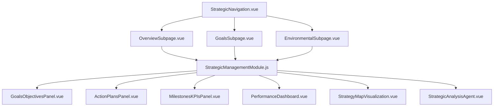
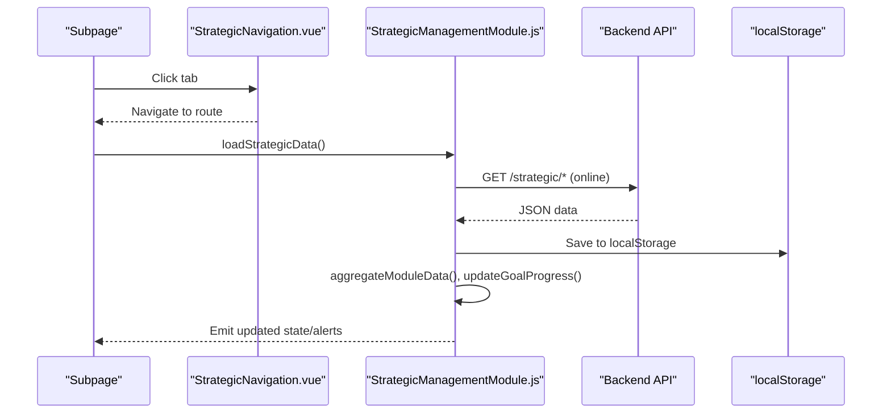
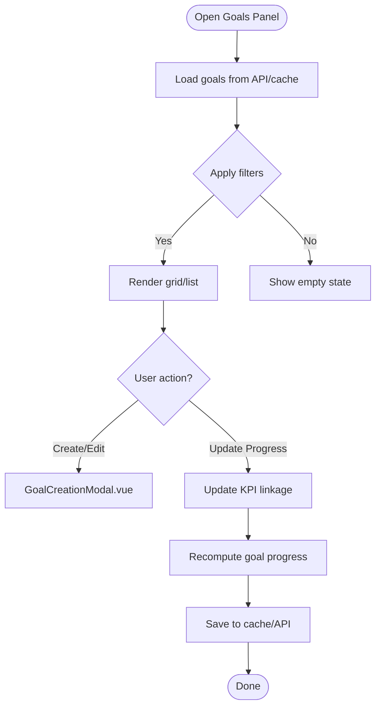
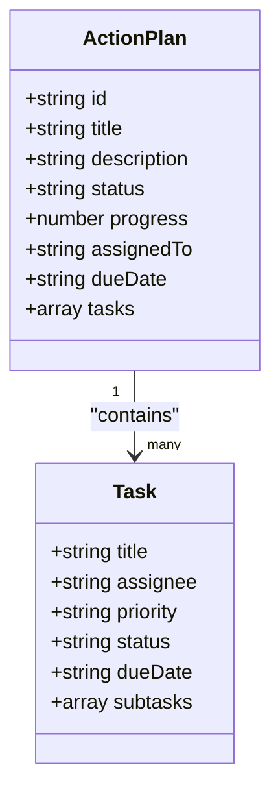
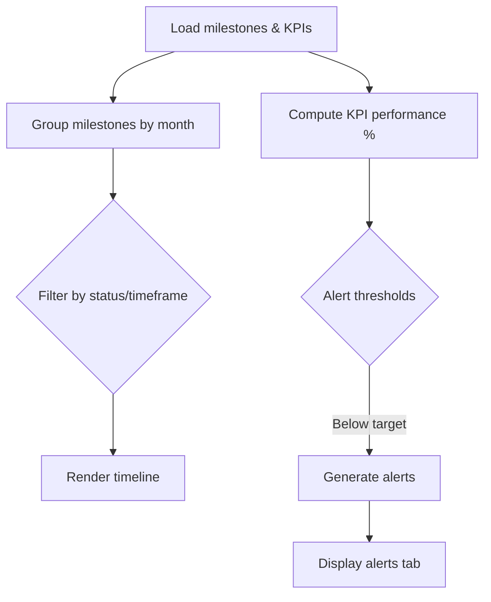
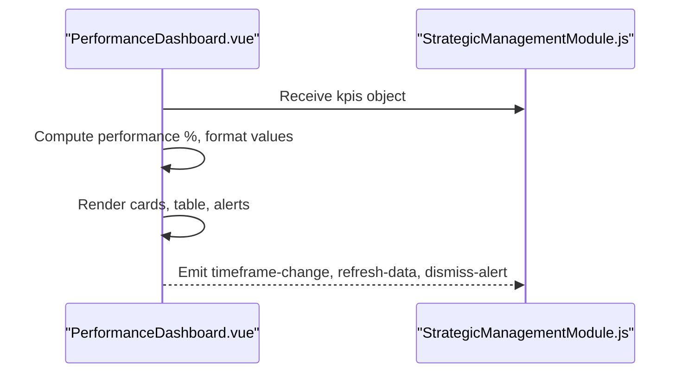
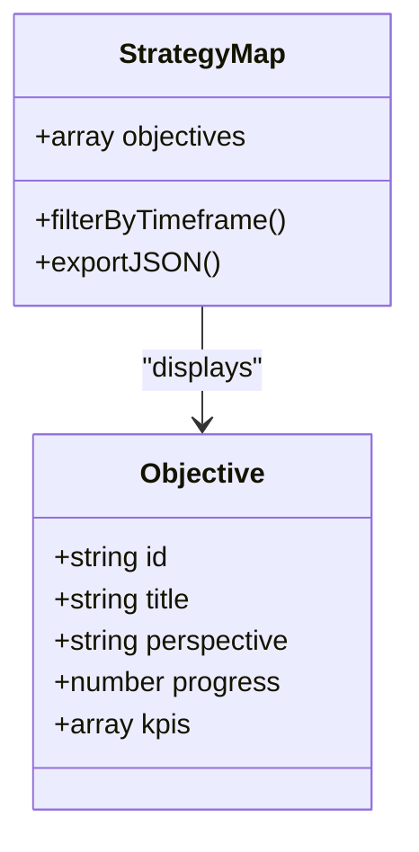
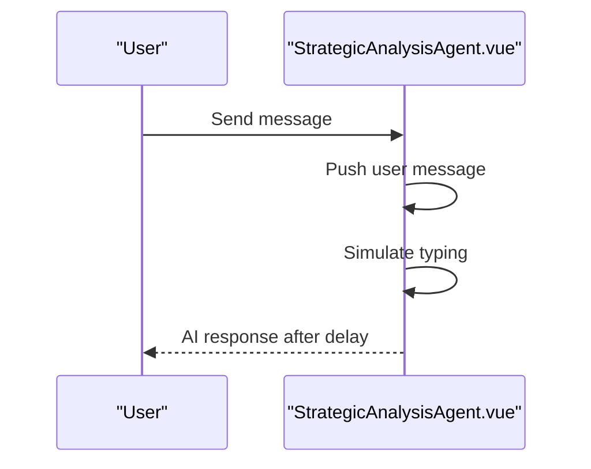
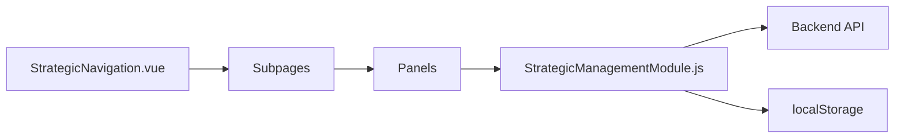

# Strategic Management Module

<cite>
**Referenced Files in This Document**
- [StrategicManagementModule.js](file://src/views/Modules/strategic/composables/StrategicManagementModule.js)
- [StrategicNavigation.vue](file://src/views/Modules/strategic/components/StrategicNavigation.vue)
- [GoalsObjectivesPanel.vue](file://src/views/Modules/strategic/components/GoalsObjectivesPanel.vue)
- [ActionPlansPanel.vue](file://src/views/Modules/strategic/components/ActionPlansPanel.vue)
- [MilestonesKPIsPanel.vue](file://src/views/Modules/strategic/components/MilestonesKPIsPanel.vue)
- [PerformanceDashboard.vue](file://src/views/Modules/strategic/components/PerformanceDashboard.vue)
- [StrategyMapVisualization.vue](file://src/views/Modules/strategic/components/StrategyMapVisualization.vue)
- [StrategicAnalysisAgent.vue](file://src/views/Modules/strategic/components/StrategicAnalysisAgent.vue)
- [GoalCreationModal.vue](file://src/views/Modules/strategic/modals/GoalCreationModal.vue)
- [ActionPlanModal.vue](file://src/views/Modules/strategic/modals/ActionPlanModal.vue)
- [OverviewSubpage.vue](file://src/views/Modules/strategic/OverviewSubpage.vue)
- [GoalsSubpage.vue](file://src/views/Modules/strategic/GoalsSubpage.vue)
- [EnvironmentalSubpage.vue](file://src/views/Modules/strategic/EnvironmentalSubpage.vue)
</cite>

## Table of Contents
1. Introduction
2. Project Structure
3. Core Components
4. Architecture Overview
5. Detailed Component Analysis
6. Dependency Analysis
7. Performance Considerations
8. Troubleshooting Guide
9. Conclusion
10. Appendices

## Introduction
This document provides comprehensive documentation for the Strategic Management module, focusing on executive-level planning tools (goals and objectives, action plans, milestones, KPI monitoring), environmental analysis features (market assessment, competitive analysis, risk evaluation), brand strategy components (positioning, messaging, health metrics), predictive analytics integration, visualization components (strategy maps, dashboards, progress tracking), AI agent interactions, data pipeline considerations, customization guidance, and integration with organizational planning processes. It is designed to be accessible to both technical and non-technical users while grounding explanations in the actual codebase.

## Project Structure
The Strategic Management module is organized into:
- Composable state and API orchestration for strategic data
- Reusable panels for goals, actions, milestones/KPIs, performance dashboard, and strategy map
- Subpages for overview, goals, environmental analysis, and more
- Modals for creating goals and action plans
- Navigation component for routing between subpages

**Diagram sources**
- [StrategicNavigation.vue:1-79](file://src/views/Modules/strategic/components/StrategicNavigation.vue#L1-L79)
- [OverviewSubpage.vue:1-800](file://src/views/Modules/strategic/OverviewSubpage.vue#L1-L800)
- [GoalsSubpage.vue:1-800](file://src/views/Modules/strategic/GoalsSubpage.vue#L1-L800)
- [EnvironmentalSubpage.vue:1-800](file://src/views/Modules/strategic/EnvironmentalSubpage.vue#L1-L800)
- [StrategicManagementModule.js:1-800](file://src/views/Modules/strategic/composables/StrategicManagementModule.js#L1-L800)

**Section sources**
- [StrategicNavigation.vue:1-79](file://src/views/Modules/strategic/components/StrategicNavigation.vue#L1-L79)
- [OverviewSubpage.vue:1-800](file://src/views/Modules/strategic/OverviewSubpage.vue#L1-L800)

## Core Components
- Goals & Objectives Panel: Create, filter, view, and manage goals with SMART framing and linked KPIs.
- Action Plans Panel: Kanban/timeline/list views for tasks, assignees, due dates, and progress.
- Milestones & KPIs Panel: Timeline-based milestone tracking and KPI cards with trends and alerts.
- Performance Dashboard: Category-based KPI summaries, charts placeholders, exportable tables, and alerts.
- Strategy Map Visualization: Perspective-based objective mapping (financial, customer, process, learning).
- Strategic Analysis Agent: Chat interface for intelligent recommendations and document insights.
- Goal Creation Modal: Guided form for defining measurable goals with SMART fields and KPIs.
- Action Plan Modal: Structured creation of action plans with tasks, subtasks, dependencies, resources, and success metrics.
- Strategic Management Composable: Centralized state, API calls, caching, aggregation, and alert computation.

**Section sources**
- [GoalsObjectivesPanel.vue:1-612](file://src/views/Modules/strategic/components/GoalsObjectivesPanel.vue#L1-L612)
- [ActionPlansPanel.vue:1-732](file://src/views/Modules/strategic/components/ActionPlansPanel.vue#L1-L732)
- [MilestonesKPIsPanel.vue:1-800](file://src/views/Modules/strategic/components/MilestonesKPIsPanel.vue#L1-L800)
- [PerformanceDashboard.vue:1-559](file://src/views/Modules/strategic/components/PerformanceDashboard.vue#L1-L559)
- [StrategyMapVisualization.vue:1-491](file://src/views/Modules/strategic/components/StrategyMapVisualization.vue#L1-L491)
- [StrategicAnalysisAgent.vue:1-184](file://src/views/Modules/strategic/components/StrategicAnalysisAgent.vue#L1-L184)
- [GoalCreationModal.vue:1-420](file://src/views/Modules/strategic/modals/GoalCreationModal.vue#L1-L420)
- [ActionPlanModal.vue:1-453](file://src/views/Modules/strategic/modals/ActionPlanModal.vue#L1-L453)
- [StrategicManagementModule.js:1-800](file://src/views/Modules/strategic/composables/StrategicManagementModule.js#L1-L800)

## Architecture Overview
The module uses a composable-driven architecture:
- The composable manages core state (vision/mission, goals, strategies, action plans, milestones, meetings, KPIs), loads data from APIs with offline fallback via localStorage, aggregates cross-module data, computes alerts, and persists updates.
- Panels and subpages consume this state and emit events to modals or parent components for user actions.
- The navigation component routes between subpages.
- The AI agent provides conversational assistance and suggestions.

**Diagram sources**
- [StrategicNavigation.vue:44-79](file://src/views/Modules/strategic/components/StrategicNavigation.vue#L44-L79)
- [StrategicManagementModule.js:127-154](file://src/views/Modules/strategic/composables/StrategicManagementModule.js#L127-L154)
- [StrategicManagementModule.js:321-343](file://src/views/Modules/strategic/composables/StrategicManagementModule.js#L321-L343)

**Section sources**
- [StrategicManagementModule.js:1-800](file://src/views/Modules/strategic/composables/StrategicManagementModule.js#L1-L800)

## Detailed Component Analysis

### Goals & Objectives
- Capabilities: Create goals with SMART fields; filter by status/timeframe; grid/list views; favorites; archive/delete; link KPIs; compute progress based on related KPIs.
- Data flow: Goals are loaded via API with timeframe filters and cached locally; progress updates trigger goal recomputation.
- Integration: Emits events to open modals and update goals; integrates with KPI categories for alignment.

**Diagram sources**
- [GoalsObjectivesPanel.vue:332-424](file://src/views/Modules/strategic/components/GoalsObjectivesPanel.vue#L332-L424)
- [GoalCreationModal.vue:320-397](file://src/views/Modules/strategic/modals/GoalCreationModal.vue#L320-L397)
- [StrategicManagementModule.js:183-204](file://src/views/Modules/strategic/composables/StrategicManagementModule.js#L183-L204)

**Section sources**
- [GoalsObjectivesPanel.vue:1-612](file://src/views/Modules/strategic/components/GoalsObjectivesPanel.vue#L1-L612)
- [GoalCreationModal.vue:1-420](file://src/views/Modules/strategic/modals/GoalCreationModal.vue#L1-L420)
- [StrategicManagementModule.js:183-204](file://src/views/Modules/strategic/composables/StrategicManagementModule.js#L183-L204)

### Action Plans
- Capabilities: Kanban/timeline/list views; filters by status, assignee, priority; task/subtask management; due dates; progress tracking; summary analytics.
- Data flow: Loaded via API with timeframe; persisted to cache/API; filtered and sorted client-side.
- Integration: Links to strategies; supports dependencies and resources; emits events for create/update/delete.

**Diagram sources**
- [ActionPlansPanel.vue:419-500](file://src/views/Modules/strategic/components/ActionPlansPanel.vue#L419-L500)
- [ActionPlanModal.vue:325-430](file://src/views/Modules/strategic/modals/ActionPlanModal.vue#L325-L430)

**Section sources**
- [ActionPlansPanel.vue:1-732](file://src/views/Modules/strategic/components/ActionPlansPanel.vue#L1-L732)
- [ActionPlanModal.vue:1-453](file://src/views/Modules/strategic/modals/ActionPlanModal.vue#L1-L453)

### Milestones & KPIs
- Capabilities: Timeline view grouped by month; filters by status/timeframe; KPI cards with value/target/trend; alerts tab for performance issues; refresh capability.
- Data flow: Milestones and KPIs loaded via API; computed alerts derived from KPI thresholds; local persistence.
- Integration: Linked to goals; supports category/timeframe filtering; exports and history views.

**Diagram sources**
- [MilestonesKPIsPanel.vue:570-636](file://src/views/Modules/strategic/components/MilestonesKPIsPanel.vue#L570-L636)
- [StrategicManagementModule.js:63-120](file://src/views/Modules/strategic/composables/StrategicManagementModule.js#L63-L120)

**Section sources**
- [MilestonesKPIsPanel.vue:1-800](file://src/views/Modules/strategic/components/MilestonesKPIsPanel.vue#L1-L800)
- [StrategicManagementModule.js:63-120](file://src/views/Modules/strategic/composables/StrategicManagementModule.js#L63-L120)

### Performance Dashboard
- Capabilities: Category-based KPI overview cards; financial and operational chart placeholders; comparison table with export; alerts; timeframe selection.
- Data flow: Consumes KPIs from composable; formats values and targets; emits events for refresh and updates.
- Integration: Supports CSV export; highlights trends and performance colors.

**Diagram sources**
- [PerformanceDashboard.vue:276-337](file://src/views/Modules/strategic/components/PerformanceDashboard.vue#L276-L337)
- [PerformanceDashboard.vue:498-527](file://src/views/Modules/strategic/components/PerformanceDashboard.vue#L498-L527)

**Section sources**
- [PerformanceDashboard.vue:1-559](file://src/views/Modules/strategic/components/PerformanceDashboard.vue#L1-L559)

### Strategy Map Visualization
- Capabilities: Perspective-based objectives (financial, customer, process, learning); status legend; add objective buttons; export strategy map; average progress and counts.
- Data flow: Filters objectives by timeframe; computes statuses and progress; emits events for creation and details.
- Integration: Aligns with goals and KPIs; supports exporting JSON snapshots.

**Diagram sources**
- [StrategyMapVisualization.vue:307-423](file://src/views/Modules/strategic/components/StrategyMapVisualization.vue#L307-L423)

**Section sources**
- [StrategyMapVisualization.vue:1-491](file://src/views/Modules/strategic/components/StrategyMapVisualization.vue#L1-L491)

### Strategic Analysis Agent
- Capabilities: Chat interface with typing indicators; suggestion chips; simulated AI responses; message formatting; scroll-to-bottom behavior.
- Data flow: Receives messages; simulates AI response; updates chat history; optional integration points for real AI services.
- Integration: Can be extended to call backend AI endpoints for document summarization and SWOT analysis.

**Diagram sources**
- [StrategicAnalysisAgent.vue:130-161](file://src/views/Modules/strategic/components/StrategicAnalysisAgent.vue#L130-L161)

**Section sources**
- [StrategicAnalysisAgent.vue:1-184](file://src/views/Modules/strategic/components/StrategicAnalysisAgent.vue#L1-L184)

### Subpages and Navigation
- Overview: Health scorecard, strategic action metrics, predictions, peer benchmarking, file upload modal, workflow triggers.
- Goals: Foundational mission/vision/values editing; goal types and statistics; detailed goal cards with milestones and achievements; smart alerts.
- Environmental: PESTEL analysis, Porter’s Five Forces, entry barriers, market structure, AI intelligence layer.
- Navigation: Tabbed navigation with icons and badges; route mapping to subpages.

**Section sources**
- [OverviewSubpage.vue:1-800](file://src/views/Modules/strategic/OverviewSubpage.vue#L1-L800)
- [GoalsSubpage.vue:1-800](file://src/views/Modules/strategic/GoalsSubpage.vue#L1-L800)
- [EnvironmentalSubpage.vue:1-800](file://src/views/Modules/strategic/EnvironmentalSubpage.vue#L1-L800)
- [StrategicNavigation.vue:1-79](file://src/views/Modules/strategic/components/StrategicNavigation.vue#L1-L79)

## Dependency Analysis
- State and data orchestration centralized in the composable; panels depend on it for read/write operations.
- Subpages compose multiple panels and modals; navigation decouples routing from content.
- External integrations:
  - Backend API endpoints for strategic data (vision/mission, goals, strategies, action plans, milestones, meetings, KPIs).
  - Cross-module data aggregation (POS, inventory, CRM, expenses, payroll) for KPI calculation.
  - Local storage for offline caching and quick access.
- Potential circular dependencies: None detected; clear separation between composables, components, and subpages.

**Diagram sources**
- [StrategicManagementModule.js:127-154](file://src/views/Modules/strategic/composables/StrategicManagementModule.js#L127-L154)
- [StrategicNavigation.vue:44-79](file://src/views/Modules/strategic/components/StrategicNavigation.vue#L44-L79)

**Section sources**
- [StrategicManagementModule.js:1-800](file://src/views/Modules/strategic/composables/StrategicManagementModule.js#L1-L800)

## Performance Considerations
- Offline resilience: API-first loading with localStorage fallback ensures availability during connectivity issues.
- Aggregation efficiency: Batch fetching of module summaries reduces round-trips; computed KPIs avoid redundant calculations.
- UI responsiveness: Filtering and sorting performed client-side; large lists use pagination or virtualization patterns where applicable.
- Export operations: CSV/JSON generation runs client-side to minimize server load.

[No sources needed since this section provides general guidance]

## Troubleshooting Guide
- Data not loading:
  - Check network connectivity; verify API endpoints and tenant ID extraction.
  - Inspect localStorage for cached data if online fetch fails.
- Alerts not appearing:
  - Ensure KPI current/target values are set; verify threshold logic in alert computation.
- Goal progress incorrect:
  - Confirm linked KPI paths and target values; re-run progress recomputation after KPI updates.
- Navigation issues:
  - Validate route mappings in navigation component; ensure router is configured correctly.

**Section sources**
- [StrategicManagementModule.js:127-154](file://src/views/Modules/strategic/composables/StrategicManagementModule.js#L127-L154)
- [StrategicManagementModule.js:63-120](file://src/views/Modules/strategic/composables/StrategicManagementModule.js#L63-L120)
- [StrategicManagementModule.js:450-473](file://src/views/Modules/strategic/composables/StrategicManagementModule.js#L450-L473)
- [StrategicNavigation.vue:59-79](file://src/views/Modules/strategic/components/StrategicNavigation.vue#L59-L79)

## Conclusion
The Strategic Management module provides a robust, modular framework for executive planning, environmental analysis, brand strategy, and performance tracking. Its composable-driven architecture enables flexible data handling, offline support, and rich visualizations. AI agent integration offers intelligent recommendations, while modals streamline goal and action plan creation. With clear navigation and extensible components, the module supports customization and integration into broader organizational planning processes.

[No sources needed since this section summarizes without analyzing specific files]

## Appendices

### Practical Examples
- Creating a strategic plan:
  - Use OverviewSubpage to initialize workflows and upload data; navigate to Goals to define foundational mission/vision/values; create goals with SMART fields; attach KPIs; generate reports.
- Defining measurable objectives:
  - In GoalsObjectivesPanel, add goals with clear targets and units; link to relevant KPIs; set deadlines and priorities; monitor progress via dashboards.
- Monitoring execution:
  - Track action plans in Kanban/timeline views; update milestones; review KPI performance and alerts; export dashboards for reporting.

[No sources needed since this section provides general guidance]

### Customizing Strategic Frameworks
- Add perspectives or categories:
  - Extend StrategyMapVisualization to include new perspectives; update filters and legends accordingly.
- Customize KPIs:
  - Modify calculateKPIsFromModuleData to incorporate new metrics from additional modules; adjust thresholds and units.
- Integrate with organizational processes:
  - Link goals and action plans to existing project management systems via API endpoints; align timelines and approvals.

[No sources needed since this section provides general guidance]

### AI Agents and Data Pipeline
- AI recommendations:
  - Enhance StrategicAnalysisAgent to call backend AI services for document summarization and SWOT analysis; pass context from subpages.
- Real-time analytics:
  - Implement WebSocket or polling mechanisms in the composable to refresh KPIs and alerts in near real-time; ensure efficient caching and throttling.

[No sources needed since this section provides general guidance]