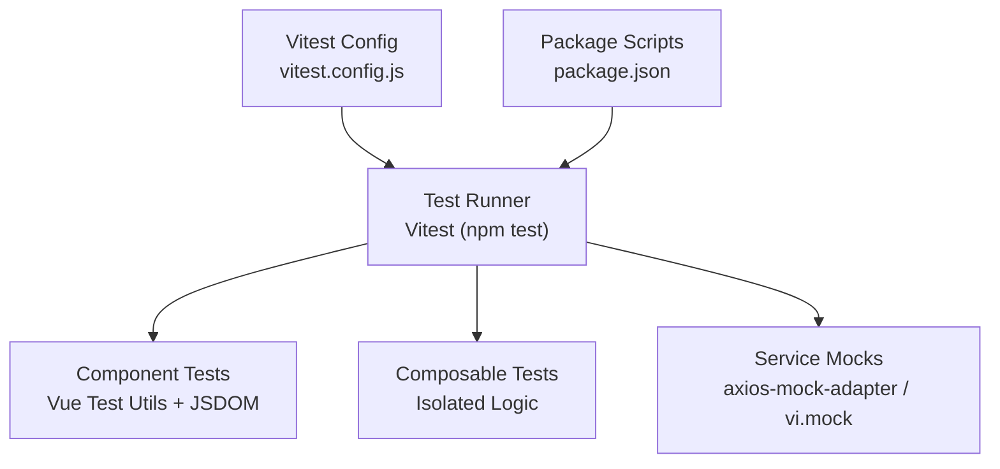
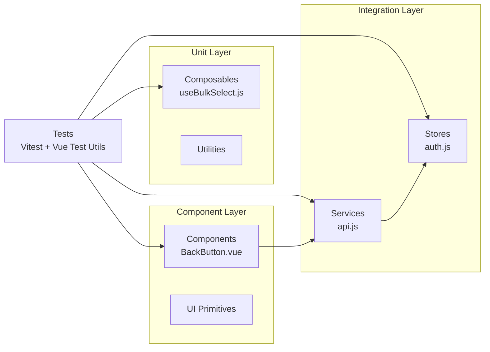
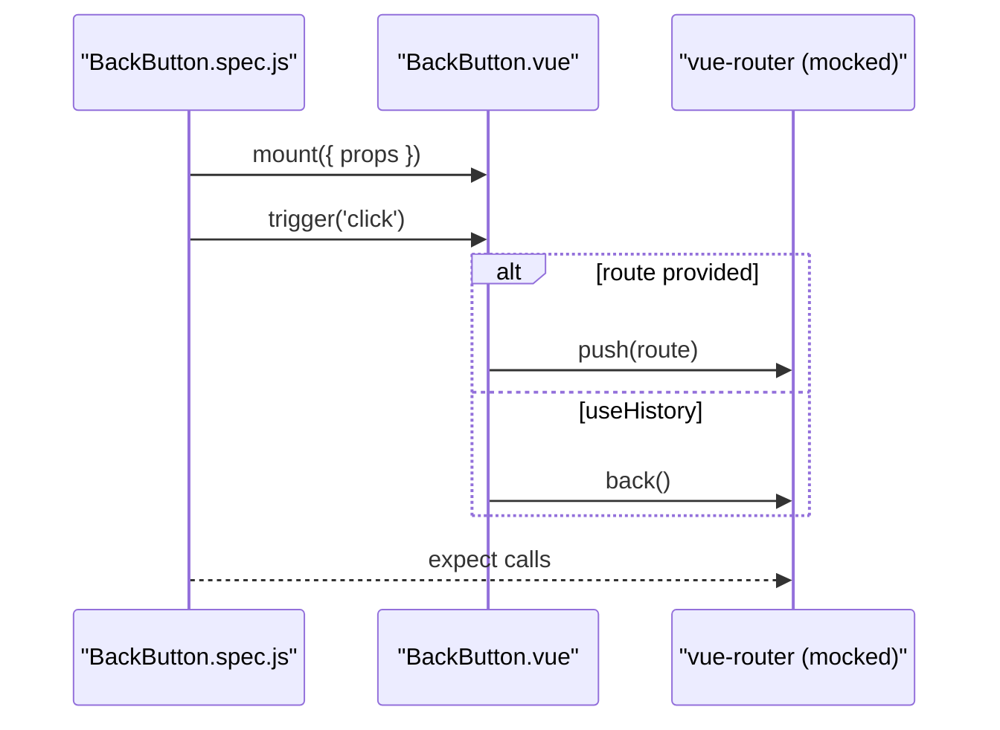
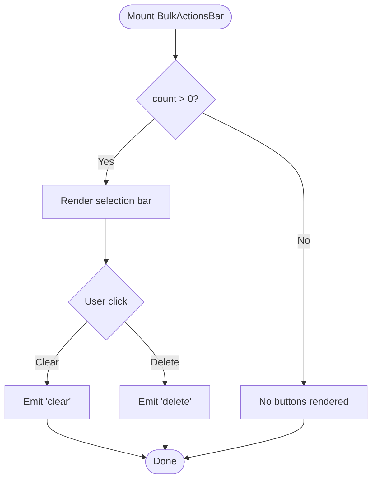
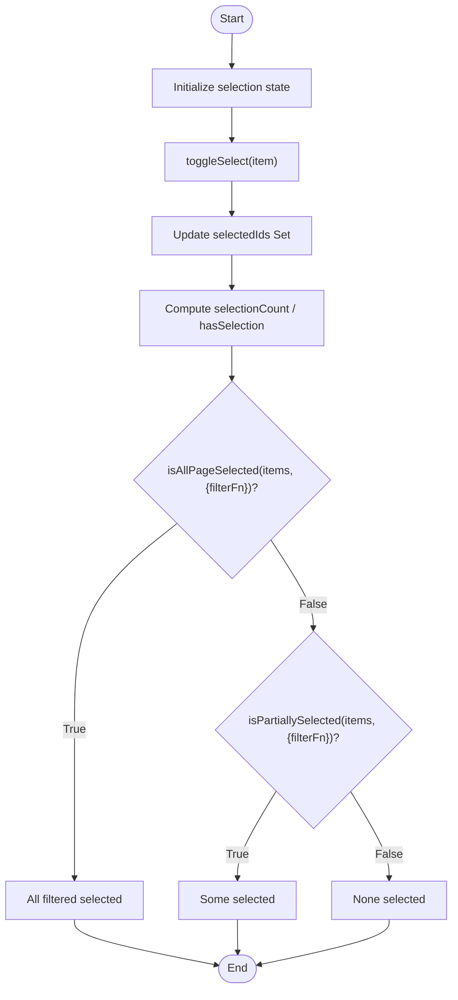
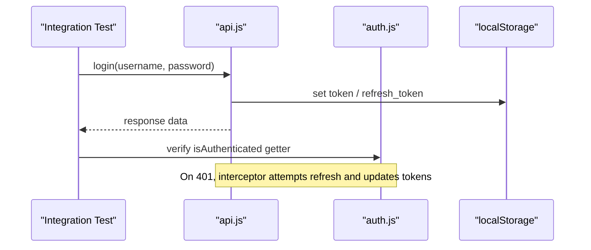
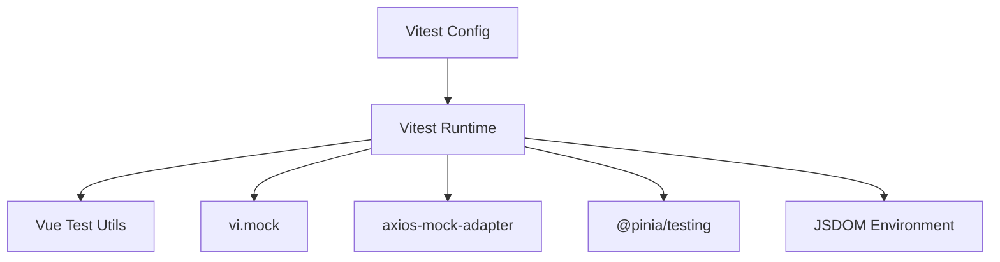

# Testing Strategy

<cite>
**Referenced Files in This Document**
- [vitest.config.js](file://vitest.config.js)
- [package.json](file://package.json)
- [BackButton.spec.js](file://src/components/__tests__/BackButton.spec.js)
- [BulkActionsBar.spec.js](file://src/components/__tests__/BulkActionsBar.spec.js)
- [useBulkSelect.spec.js](file://src/composables/__tests__/useBulkSelect.spec.js)
- [BackButton.vue](file://src/components/ui/BackButton.vue)
- [useBulkSelect.js](file://src/composables/useBulkSelect.js)
- [api.js](file://src/services/api.js)
- [auth.js](file://src/stores/auth.js)
</cite>

## Table of Contents
1. Introduction
2. Project Structure
3. Core Components
4. Architecture Overview
5. Detailed Component Analysis
6. Dependency Analysis
7. Performance Considerations
8. Troubleshooting Guide
9. Conclusion

## Introduction
This document defines the testing strategy for the ABSA Foundry Frontend. It covers unit testing with Vitest, component testing with Vue Test Utils, composable testing patterns, integration testing strategies for API and authentication flows, coverage requirements, continuous integration setup, performance testing approaches, and best practices for async operations, error scenarios, and edge cases. It also provides guidance on maintaining test suites, debugging failed tests, and optimizing execution time.

## Project Structure
The project uses Vitest as the primary test runner with jsdom environment for DOM-based tests. Vue components are tested using Vue Test Utils, composables are tested in isolation, and services are mocked to avoid real network calls. The configuration sets up an alias for src and a global setup file for shared test fixtures.

**Diagram sources**
- [vitest.config.js:1-17](file://vitest.config.js#L1-L17)
- [package.json:6-12](file://package.json#L6-L12)

**Section sources**
- [vitest.config.js:1-17](file://vitest.config.js#L1-L17)
- [package.json:6-12](file://package.json#L6-L12)

## Core Components
- Unit testing framework: Vitest with globals enabled and jsdom environment.
- Component testing: Vue Test Utils mount() for rendering and interaction.
- Composable testing: Direct invocation of composables and assertion of reactive state.
- Service mocking: vi.mock for router and axios-based services; axios-mock-adapter available for HTTP-level mocks.
- Store testing: Pinia store utilities available via @pinia/testing for isolated state tests.

Key implementation references:
- Vitest config and environment: [vitest.config.js:1-17](file://vitest.config.js#L1-L17)
- Package scripts and dev dependencies: [package.json:6-12](file://package.json#L6-L12), [package.json:64-88](file://package.json#L64-L88)

**Section sources**
- [vitest.config.js:1-17](file://vitest.config.js#L1-L17)
- [package.json:6-12](file://package.json#L6-L12)
- [package.json:64-88](file://package.json#L64-L88)

## Architecture Overview
Testing architecture centers around three layers:
- Unit layer: Pure logic in composables and utilities.
- Component layer: UI behavior, events, props, slots, and accessibility attributes.
- Integration layer: API interactions, authentication flows, and cross-component communication via stores and services.

**Diagram sources**
- [useBulkSelect.js:1-99](file://src/composables/useBulkSelect.js#L1-L99)
- [BackButton.vue:1-42](file://src/components/ui/BackButton.vue#L1-L42)
- [api.js:1-209](file://src/services/api.js#L1-L209)
- [auth.js:1-22](file://src/stores/auth.js#L1-L22)

## Detailed Component Analysis

### BackButton Component Testing
- Rendering: Assert presence of icon and text based on variant prop.
- Event handling: Click triggers either router.push or router.back depending on props.
- Prop validation: Route can be string or object; label affects aria-label.
- Accessibility: aria-label computed from label.

**Diagram sources**
- [BackButton.spec.js:1-83](file://src/components/__tests__/BackButton.spec.js#L1-L83)
- [BackButton.vue:1-42](file://src/components/ui/BackButton.vue#L1-L42)

**Section sources**
- [BackButton.spec.js:1-83](file://src/components/__tests__/BackButton.spec.js#L1-L83)
- [BackButton.vue:1-42](file://src/components/ui/BackButton.vue#L1-L42)

### BulkActionsBar Component Testing
- Rendering: Hidden when count is 0; shows selection count otherwise.
- Events: Emits clear and delete on button clicks.
- State: Shows deleting state with spinner.
- Slots: Supports actions and secondary slots for custom content.

**Diagram sources**
- [BulkActionsBar.spec.js:1-74](file://src/components/__tests__/BulkActionsBar.spec.js#L1-L74)

**Section sources**
- [BulkActionsBar.spec.js:1-74](file://src/components/__tests__/BulkActionsBar.spec.js#L1-L74)

### useBulkSelect Composable Testing
- Isolation: Instantiate composable and assert reactive state without DOM.
- Selection logic: Toggle single/multiple items, select all, clear selection.
- Page-level selection: isAllPageSelected and isPartiallySelected with optional filterFn.
- Custom identity: Support custom getId and fallback to _id.

**Diagram sources**
- [useBulkSelect.spec.js:1-159](file://src/composables/__tests__/useBulkSelect.spec.js#L1-L159)
- [useBulkSelect.js:1-99](file://src/composables/useBulkSelect.js#L1-L99)

**Section sources**
- [useBulkSelect.spec.js:1-159](file://src/composables/__tests__/useBulkSelect.spec.js#L1-L159)
- [useBulkSelect.js:1-99](file://src/composables/useBulkSelect.js#L1-L99)

### Service and Authentication Integration Testing
- API service: Axios interceptors add Authorization headers and handle 401 refresh flow.
- Auth store: Manages token, role, email persisted in localStorage.
- Integration approach: Mock axios or use axios-mock-adapter to simulate responses; assert store state changes and side effects like redirects.

**Diagram sources**
- [api.js:64-146](file://src/services/api.js#L64-L146)
- [api.js:166-200](file://src/services/api.js#L166-L200)
- [auth.js:1-22](file://src/stores/auth.js#L1-L22)

**Section sources**
- [api.js:1-209](file://src/services/api.js#L1-L209)
- [auth.js:1-22](file://src/stores/auth.js#L1-L22)

## Dependency Analysis
- Test runner and environment: Vitest configured with jsdom and Vue plugin.
- Component testing: Vue Test Utils for mounting and event simulation.
- Service mocking: vi.mock for vue-router; axios-mock-adapter available for HTTP mocks.
- Store testing: @pinia/testing available for isolating Pinia stores.

**Diagram sources**
- [vitest.config.js:1-17](file://vitest.config.js#L1-L17)
- [package.json:64-88](file://package.json#L64-L88)

**Section sources**
- [vitest.config.js:1-17](file://vitest.config.js#L1-L17)
- [package.json:64-88](file://package.json#L64-L88)

## Performance Considerations
- Keep unit tests fast and pure; isolate composables without DOM.
- Use shallow mounting only when necessary; prefer full mount for realistic behavior.
- Mock external dependencies (router, services, stores) to reduce overhead.
- Run tests in parallel by default with Vitest; limit concurrency if flaky.
- Avoid heavy assertions in tight loops; batch checks where possible.
- Use snapshot tests sparingly; prefer explicit assertions for stability.

[No sources needed since this section provides general guidance]

## Troubleshooting Guide
Common issues and resolutions:
- Router mocks not applied: Ensure vi.mock('vue-router', ...) is at the top of the test file before importing components that use it.
- JSDOM environment missing: Confirm vitest.config.js sets environment to jsdom.
- Flaky async tests: Use await wrapper.findAll()/nextTick() appropriately; ensure promises resolve before assertions.
- Service calls hitting network: Mock axios or use axios-mock-adapter; verify interceptors do not run against real endpoints.
- Store state leakage: Reset Pinia stores between tests using @pinia/testing helpers or manual reset.

Debugging tips:
- Log wrapper.html or wrapper.text() to inspect rendered output.
- Use console logs in composables temporarily to trace reactive updates.
- Narrow failing tests to minimal reproduction case.

**Section sources**
- [BackButton.spec.js:1-83](file://src/components/__tests__/BackButton.spec.js#L1-L83)
- [vitest.config.js:1-17](file://vitest.config.js#L1-L17)

## Conclusion
The ABSA Foundry Frontend employs a layered testing strategy with Vitest, Vue Test Utils, and targeted mocking for services and routers. Existing tests demonstrate robust patterns for component rendering, event handling, prop validation, and composable logic isolation. Extending these patterns to services and stores will provide comprehensive coverage across unit, component, and integration layers while maintaining speed and reliability.

[No sources needed since this section summarizes without analyzing specific files]

## Appendices

### Test Configuration Summary
- Environment: jsdom
- Globals: enabled
- Setup file: ./src/stores/__tests__/setup.js
- Alias: '@' -> './src'

**Section sources**
- [vitest.config.js:1-17](file://vitest.config.js#L1-L17)

### Coverage Requirements
- Aim for high coverage on critical paths: composables, services, and key components.
- Enforce thresholds in CI (e.g., lines, branches, functions, statements).
- Exclude generated or third-party code from coverage.

[No sources needed since this section provides general guidance]

### Continuous Integration Setup
- Add a CI job to install dependencies and run npm test.
- Cache node_modules to speed up builds.
- Fail pipeline on test failures and low coverage thresholds.

[No sources needed since this section provides general guidance]

### Performance Testing Approaches
- Use synthetic benchmarks for heavy computations within composables.
- Measure render times for complex components with large datasets.
- Profile memory usage for long-running views with frequent updates.

[No sources needed since this section provides general guidance]

### Best Practices
- Async operations: Always await asynchronous interactions and flush microtasks.
- Error scenarios: Test both success and failure paths; assert user feedback.
- Edge cases: Cover empty states, boundary values, and unusual inputs.
- Maintainability: Group related tests, use descriptive names, and keep tests focused.
- Execution optimization: Split large test suites into feature-specific files; leverage Vitest’s parallelism.

[No sources needed since this section provides general guidance]