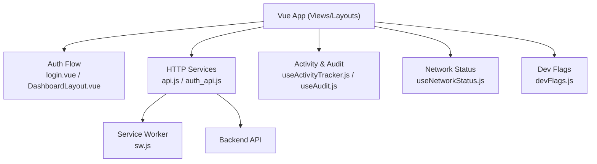
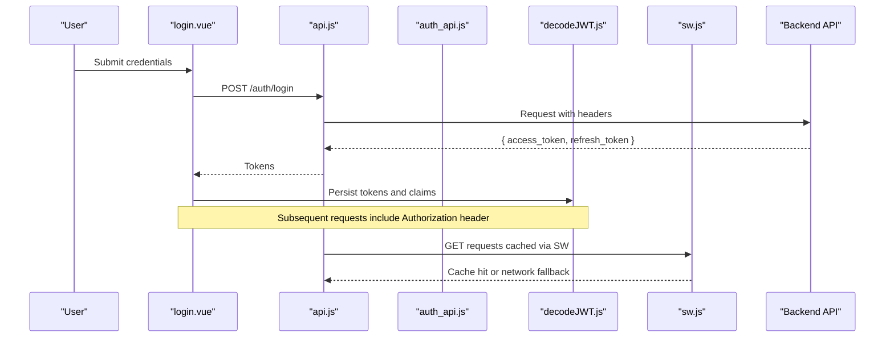
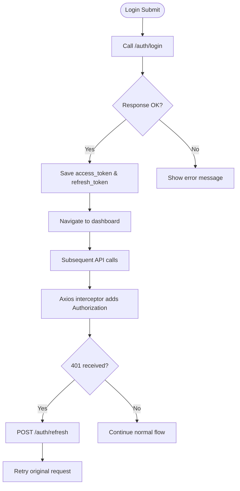
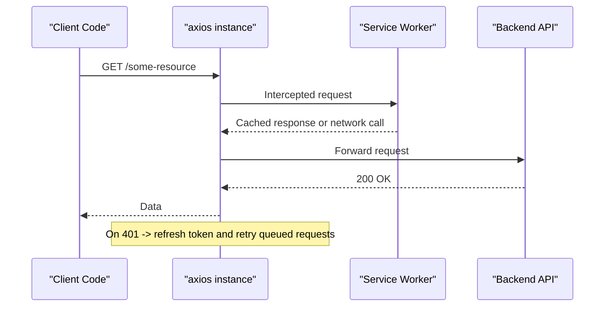
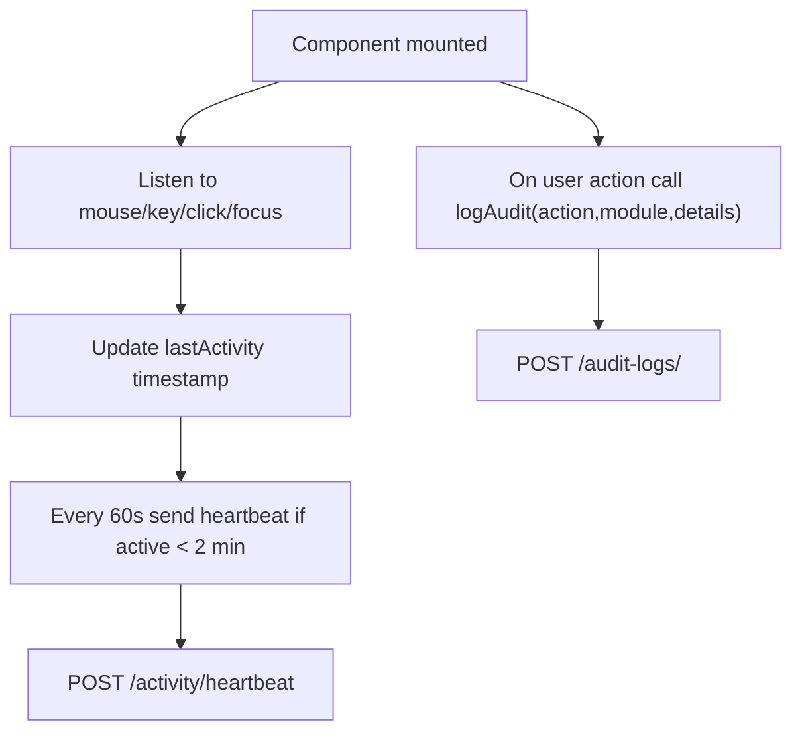
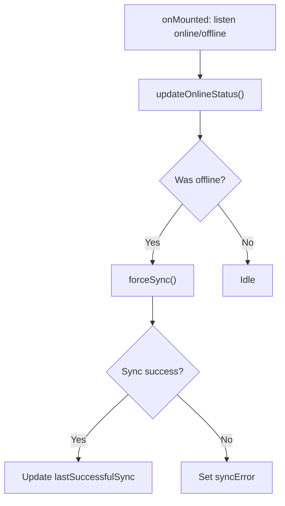
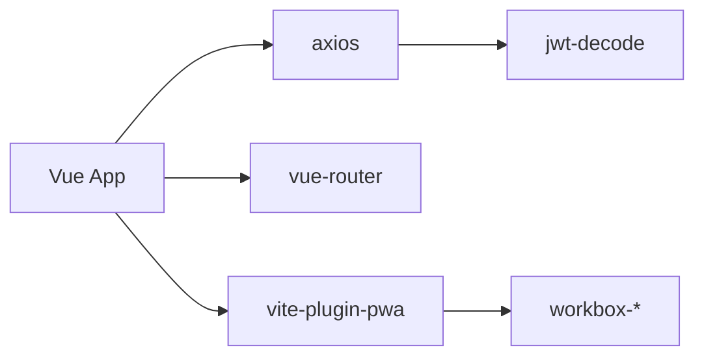

# Troubleshooting & Maintenance

<cite>
**Referenced Files in This Document**
- [api.js](file://src/services/api.js)
- [auth_api.js](file://src/services/auth_api.js)
- [decodeJWT.js](file://src/services/decodeJWT.js)
- [login.vue](file://src/views/auth/login.vue)
- [DashboardLayout.vue](file://src/components/layouts/DashboardLayout.vue)
- [useActivityTracker.js](file://src/config/useActivityTracker.js)
- [useAudit.js](file://src/config/useAudit.js)
- [audit_log.js](file://src/services/audit_log.js)
- [requestLogger.js](file://src/utils/requestLogger.js)
- [useNetworkStatus.js](file://src/composables/useNetworkStatus.js)
- [vite.config.js](file://vite.config.js)
- [sw.js](file://src/sw.js)
- [package.json](file://package.json)
- [devFlags.js](file://src/config/devFlags.js)
</cite>

## Table of Contents
1. Introduction
2. Project Structure
3. Core Components
4. Architecture Overview
5. Detailed Component Analysis
6. Dependency Analysis
7. Performance Considerations
8. Troubleshooting Guide
9. Conclusion
10. Appendices

## Introduction
This document provides comprehensive troubleshooting and maintenance guidance for the ABSA Foundry Frontend. It focuses on diagnosing authentication failures, API connectivity issues, and performance bottlenecks; explains debugging techniques using browser developer tools, console logging, and network inspection; details activity tracking and audit logging systems; and outlines maintenance procedures including dependency updates, configuration management, health checks, monitoring, backups, disaster recovery, and production operational considerations such as scaling and capacity planning.

## Project Structure
The frontend is a Vue 3 application built with Vite and uses:
- Axios and fetch-based HTTP clients with token injection and refresh handling
- A service worker for caching and offline resilience
- Composables for network status, activity tracking, and auditing
- Pinia store for auth state
- Centralized base URL resolution via environment variables or runtime detection

**Diagram sources**
- [login.vue:180-248](file://src/views/auth/login.vue#L180-L248)
- [DashboardLayout.vue:117-136](file://src/components/layouts/DashboardLayout.vue#L117-L136)
- [api.js:64-146](file://src/services/api.js#L64-L146)
- [auth_api.js:20-27](file://src/services/auth_api.js#L20-L27)
- [sw.js:75-100](file://src/sw.js#L75-L100)
- [useActivityTracker.js:12-36](file://src/config/useActivityTracker.js#L12-L36)
- [useAudit.js:43-72](file://src/config/useAudit.js#L43-L72)
- [useNetworkStatus.js:33-41](file://src/composables/useNetworkStatus.js#L33-L41)
- [devFlags.js:1-28](file://src/config/devFlags.js#L1-L28)

**Section sources**
- [vite.config.js:1-41](file://vite.config.js#L1-L41)
- [package.json:1-90](file://package.json#L1-L90)

## Core Components
- Authentication and token lifecycle: login, refresh, logout, token storage, and automatic header injection
- API client interceptors: request/response interceptors to attach tokens and handle 401 auto-refresh
- Activity tracking: periodic heartbeat to backend when user is active
- Audit logging: structured event logging for user actions
- Network status and offline sync: online/offline detection, pending operations, and forced sync
- Service worker: caching strategy for GET requests and retry/queue behavior for mutations

**Section sources**
- [api.js:64-146](file://src/services/api.js#L64-L146)
- [auth_api.js:20-27](file://src/services/auth_api.js#L20-L27)
- [useActivityTracker.js:12-36](file://src/config/useActivityTracker.js#L12-L36)
- [useAudit.js:43-72](file://src/config/useAudit.js#L43-L72)
- [useNetworkStatus.js:33-41](file://src/composables/useNetworkStatus.js#L33-L41)
- [sw.js:75-100](file://src/sw.js#L75-L100)

## Architecture Overview
The application routes through authenticated flows that rely on centralized HTTP clients. Token injection occurs at both axios and fetch layers. On 401 responses, an auto-refresh mechanism attempts to renew tokens before retrying failed requests. Offline scenarios are handled by a service worker and composable network status logic.

**Diagram sources**
- [login.vue:180-248](file://src/views/auth/login.vue#L180-L248)
- [api.js:166-180](file://src/services/api.js#L166-L180)
- [auth_api.js:36-57](file://src/services/auth_api.js#L36-L57)
- [decodeJWT.js:66-96](file://src/services/decodeJWT.js#L66-L96)
- [sw.js:75-100](file://src/sw.js#L75-L100)

## Detailed Component Analysis

### Authentication Flow and Token Management
- Login stores tokens and user metadata, then navigates to dashboard
- Axios interceptor attaches Bearer token to all requests
- Response interceptor handles 401 by refreshing tokens and retrying queued requests
- Logout clears local storage and redirects

**Diagram sources**
- [login.vue:180-248](file://src/views/auth/login.vue#L180-L248)
- [api.js:64-146](file://src/services/api.js#L64-L146)
- [auth_api.js:64-87](file://src/services/auth_api.js#L64-L87)

**Section sources**
- [login.vue:180-248](file://src/views/auth/login.vue#L180-L248)
- [api.js:64-146](file://src/services/api.js#L64-L146)
- [auth_api.js:20-27](file://src/services/auth_api.js#L20-L27)
- [decodeJWT.js:66-96](file://src/services/decodeJWT.js#L66-L96)

### API Connectivity and Error Handling
- Base URL resolution supports environment variable override and runtime fallback
- Axios response interceptor queues concurrent requests during refresh to avoid race conditions
- Fetch wrapper logs payloads and responses for debugging without exposing secrets
- Service worker caches GET responses and retries mutations offline

**Diagram sources**
- [api.js:4-18](file://src/services/api.js#L4-L18)
- [api.js:64-146](file://src/services/api.js#L64-L146)
- [sw.js:75-100](file://src/sw.js#L75-L100)

**Section sources**
- [api.js:4-18](file://src/services/api.js#L4-L18)
- [api.js:64-146](file://src/services/api.js#L64-L146)
- [requestLogger.js:1-34](file://src/utils/requestLogger.js#L1-L34)
- [sw.js:75-100](file://src/sw.js#L75-L100)

### Activity Tracking and Audit Logging
- Activity tracker sends heartbeats when user is active within a time window
- Audit composable posts structured events to backend for compliance and diagnostics
- Legacy audit log helper exists for simple event posting

**Diagram sources**
- [useActivityTracker.js:12-36](file://src/config/useActivityTracker.js#L12-L36)
- [useAudit.js:43-72](file://src/config/useAudit.js#L43-L72)
- [audit_log.js:4-20](file://src/services/audit_log.js#L4-L20)

**Section sources**
- [useActivityTracker.js:12-36](file://src/config/useActivityTracker.js#L12-L36)
- [useAudit.js:43-72](file://src/config/useAudit.js#L43-L72)
- [audit_log.js:4-20](file://src/services/audit_log.js#L4-L20)

### Network Status and Offline Behavior
- Tracks online/offline events and triggers sync on reconnect
- Provides force sync and displays offline notifications
- Integrates with offline sync manager and IndexedDB to reconcile pending operations

**Diagram sources**
- [useNetworkStatus.js:33-41](file://src/composables/useNetworkStatus.js#L33-L41)
- [useNetworkStatus.js:75-91](file://src/composables/useNetworkStatus.js#L75-L91)

**Section sources**
- [useNetworkStatus.js:33-41](file://src/composables/useNetworkStatus.js#L33-L41)
- [useNetworkStatus.js:75-91](file://src/composables/useNetworkStatus.js#L75-L91)

### Configuration and Development Flags
- Base URL can be overridden via environment variable for remote development
- Development bypass flag enables mock auth payload and skips certain checks
- PWA configuration defines manifest and caching behavior

**Section sources**
- [api.js:4-18](file://src/services/api.js#L4-L18)
- [devFlags.js:1-28](file://src/config/devFlags.js#L1-L28)
- [vite.config.js:11-35](file://vite.config.js#L11-L35)

## Dependency Analysis
Key dependencies and their roles:
- axios: HTTP client with interceptors for token injection and 401 handling
- jwt-decode: Decodes JWT to extract user info and validate expiry
- vite-plugin-pwa: Service worker registration and caching strategies
- workbox-* modules: Caching, expiration, and background sync utilities
- vue-router: Navigation and route guards (used indirectly via components)

**Diagram sources**
- [package.json:13-63](file://package.json#L13-L63)
- [vite.config.js:11-35](file://vite.config.js#L11-L35)

**Section sources**
- [package.json:13-63](file://package.json#L13-L63)
- [vite.config.js:11-35](file://vite.config.js#L11-L35)

## Performance Considerations
- Use the service worker’s cache-first strategy for GET endpoints to reduce latency
- Avoid excessive heartbeats; ensure activity tracking only pings when user is active
- Debounce network status updates to prevent rapid re-sync loops
- Minimize large payloads in audit logs; keep details concise
- Monitor token refresh queue to avoid thundering herd on 401 spikes

[No sources needed since this section provides general guidance]

## Troubleshooting Guide

### Authentication Failures
Symptoms:
- Repeated login prompts or immediate redirects to login
- 401 errors on protected endpoints
- Inability to access dashboard after login

Diagnostic steps:
- Verify tokens exist in localStorage and are not expired
- Check axios response interceptor behavior on 401 and whether refresh endpoint is reachable
- Confirm base URL resolves correctly for your environment
- Inspect login flow and token persistence in login.vue
- Ensure decodeJWT validates token expiry and performs logout on invalid tokens

Common fixes:
- Clear stale tokens and re-authenticate
- Update backend base URL via environment variable
- Ensure refresh endpoint returns valid tokens per spec
- Validate CORS and cookie settings if using credentials

**Section sources**
- [api.js:64-146](file://src/services/api.js#L64-L146)
- [auth_api.js:64-87](file://src/services/auth_api.js#L64-L87)
- [decodeJWT.js:11-39](file://src/services/decodeJWT.js#L11-L39)
- [login.vue:180-248](file://src/views/auth/login.vue#L180-L248)

### API Connection Problems
Symptoms:
- Network errors or timeouts
- Mixed content or CORS errors
- Inconsistent behavior between dev and prod

Diagnostic steps:
- Inspect network tab for failed requests and status codes
- Use loggedFetch to capture request/response details safely
- Verify service worker caching behavior and clear cache if necessary
- Check environment variable for base URL and confirm it points to correct backend

Common fixes:
- Correct base URL configuration
- Adjust CORS policies on backend
- Disable SW cache temporarily to rule out stale responses
- Ensure secure contexts for cookies and credentials

**Section sources**
- [api.js:4-18](file://src/services/api.js#L4-L18)
- [requestLogger.js:1-34](file://src/utils/requestLogger.js#L1-L34)
- [sw.js:75-100](file://src/sw.js#L75-L100)

### Performance Bottlenecks
Symptoms:
- Slow page loads or data rendering
- Frequent network calls causing jank
- High CPU usage from heavy computations

Diagnostic steps:
- Use Performance tab to identify long tasks and render blocking
- Check network waterfall for redundant or large requests
- Review activity heartbeats and audit logs frequency
- Evaluate service worker cache effectiveness

Common fixes:
- Implement pagination or virtualization for large lists
- Reduce payload sizes and batch requests where possible
- Tune debounce intervals for network status and heartbeats
- Leverage SW caching for static assets and frequent GET endpoints

**Section sources**
- [useActivityTracker.js:12-36](file://src/config/useActivityTracker.js#L12-L36)
- [useNetworkStatus.js:33-41](file://src/composables/useNetworkStatus.js#L33-L41)
- [sw.js:75-100](file://src/sw.js#L75-L100)

### Debugging Techniques
- Console logging: Use loggedFetch to group and inspect request/response payloads without leaking secrets
- Network inspection: Filter by domain, check headers, status codes, and timing
- Service worker: Inspect cache storage and update strategies; disable SW in dev to isolate issues
- Dev flags: Enable development bypass to simulate auth and skip strict checks locally

**Section sources**
- [requestLogger.js:1-34](file://src/utils/requestLogger.js#L1-L34)
- [devFlags.js:1-28](file://src/config/devFlags.js#L1-L28)
- [vite.config.js:11-35](file://vite.config.js#L11-L35)

### Activity Tracking and Audit Logging Diagnostics
- Verify heartbeats are sent only when user is active; adjust thresholds if too frequent
- Confirm audit events reach backend; check for silent failures and warnings
- Validate role resolution and user identity in audit payloads

**Section sources**
- [useActivityTracker.js:12-36](file://src/config/useActivityTracker.js#L12-L36)
- [useAudit.js:43-72](file://src/config/useAudit.js#L43-L72)
- [audit_log.js:4-20](file://src/services/audit_log.js#L4-L20)

### Module-Specific Troubleshooting
- CRM and other modules: If module menus do not load, check subscribed modules endpoint and RBAC permissions
- Dashboard layout: Ensure logout clears all relevant keys and redirects properly

**Section sources**
- [DashboardLayout.vue:117-136](file://src/components/layouts/DashboardLayout.vue#L117-L136)

## Maintenance Procedures

### Updating Dependencies
- Review package.json for outdated packages and security advisories
- Run dependency updates and verify builds in preview mode
- Test critical flows (login, API calls, offline behavior) after updates

**Section sources**
- [package.json:13-88](file://package.json#L13-L88)

### Managing Configuration Files
- Environment variables: Configure VITE_API_BASE_URL for different environments
- PWA config: Adjust manifest and caching limits in vite.config.js
- Dev flags: Use VITE_DEV_BYPASS to enable mock sessions locally

**Section sources**
- [api.js:4-18](file://src/services/api.js#L4-L18)
- [vite.config.js:11-35](file://vite.config.js#L11-L35)
- [devFlags.js:1-28](file://src/config/devFlags.js#L1-L28)

### Routine Health Checks
- Verify service worker registration and cache strategies
- Confirm network status detection and offline notifications
- Validate activity heartbeats and audit log submissions
- Check token refresh flow under load

**Section sources**
- [sw.js:75-100](file://src/sw.js#L75-L100)
- [useNetworkStatus.js:33-41](file://src/composables/useNetworkStatus.js#L33-L41)
- [useActivityTracker.js:12-36](file://src/config/useActivityTracker.js#L12-L36)
- [api.js:64-146](file://src/services/api.js#L64-L146)

### Monitoring Application Performance
- Instrument key endpoints and measure latency
- Track token refresh frequency and failure rates
- Monitor service worker cache hit ratios
- Alert on repeated 401 errors or network failures

[No sources needed since this section provides general guidance]

### Analyzing Error Logs
- Use console groups from loggedFetch to correlate errors with payloads
- Capture stack traces and context around failures
- Correlate frontend errors with backend audit logs and system traces

**Section sources**
- [requestLogger.js:1-34](file://src/utils/requestLogger.js#L1-L34)
- [useAudit.js:43-72](file://src/config/useAudit.js#L43-L72)

### Identifying Potential Issues Before Impact
- Simulate network interruptions and verify offline behavior
- Stress test token refresh under concurrent requests
- Validate RBAC and module visibility across roles
- Review audit logs for anomalous patterns

**Section sources**
- [useNetworkStatus.js:33-41](file://src/composables/useNetworkStatus.js#L33-L41)
- [api.js:64-146](file://src/services/api.js#L64-L146)
- [DashboardLayout.vue:117-136](file://src/components/layouts/DashboardLayout.vue#L117-L136)

### Backup and Recovery Procedures
- Back up local preferences stored in localStorage (e.g., branding preferences)
- Export any client-side data managed by IndexedDB if applicable
- Document environment variables and configuration changes for restoration

**Section sources**
- [usePreferences.js:34-66](file://src/config/usePreferences.js#L34-L66)

### Disaster Recovery Planning
- Define rollback procedures for frontend deployments
- Maintain versioned builds and manifests for quick restoration
- Ensure service worker cache can be invalidated to serve fresh assets

**Section sources**
- [vite.config.js:11-35](file://vite.config.js#L11-L35)

### Operational Considerations for Production
- Scaling: Ensure backend can handle token refresh bursts; consider rate limiting and queuing
- Load balancing: Validate sticky sessions if using server-side sessions; otherwise stateless token validation
- Capacity planning: Monitor API throughput, cache hit rates, and service worker performance

[No sources needed since this section provides general guidance]

## Conclusion
The ABSA Foundry Frontend implements robust authentication, resilient networking, and comprehensive observability through activity tracking and audit logging. By leveraging browser developer tools, service worker insights, and centralized interceptors, teams can quickly diagnose and resolve issues. Regular maintenance, careful configuration management, and proactive monitoring will help maintain reliability and performance in production environments.

## Appendices

### Quick Reference: Key Endpoints and Flows
- Authentication: /auth/login, /auth/refresh, /auth/logout
- Activity: /activity/heartbeat
- Audit: /audit-logs/
- Preferences: /preferences/
- Modules: /modules-manager/owner/modules

**Section sources**
- [api.js:166-208](file://src/services/api.js#L166-L208)
- [auth_api.js:36-141](file://src/services/auth_api.js#L36-L141)
- [useActivityTracker.js:12-36](file://src/config/useActivityTracker.js#L12-L36)
- [useAudit.js:43-72](file://src/config/useAudit.js#L43-L72)
- [usePreferences.js:34-99](file://src/config/usePreferences.js#L34-L99)
- [DashboardLayout.vue:198-232](file://src/components/layouts/DashboardLayout.vue#L198-L232)